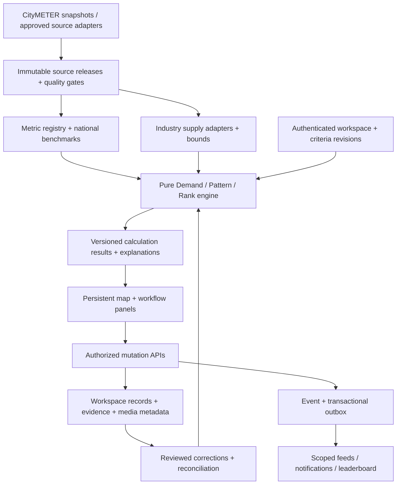

# CityMETER: Yolk — Product statement + แผนพัฒนาจากศูนย์

**หาไข่แดง ขยายตลาด — Find the yolk. Grow your market.**

**Find concentrated demand. Spot supply gaps. Plan your next location.**

Yolk ช่วยทีมขยายสาขาตัดสินใจว่า **ควรไปศึกษาพื้นที่ไหนต่อ เพราะอะไร และต้องตรวจอะไรเพิ่ม** เริ่มจากข้อมูล CityMETER ที่มีอยู่ เลือกธุรกิจและแบรนด์แล้วเห็นผลได้ทันที จากนั้นปรับเกณฑ์ เล็งทำเล ตรวจสาขา และรวบรวมงานของทีมบนแผนที่เดียว

เอกสารนี้รวมพฤติกรรมฐานจากพรีวิว 1.7.4 และข้อกำหนด UI สำหรับ **1.7.5** และแผนสร้างระบบทีมจริงไว้ในไฟล์เดียว เป็นฉบับเต็ม ไม่ใช่รายการแก้เฉพาะรอบล่าสุด อ่านจากต้นได้โดยไม่ต้องไล่อ่าน patch ของรุ่นเก่า ส่วน source code, ข้อมูล และ assets ยังต้องใช้ชุดที่อ้างอิงไว้ เพราะ Markdown ไม่ทดแทนฟอนต์ โลโก้ หรือข้อมูลทั้งประเทศ

**สถานะที่ต้องเข้าใจตั้งแต่เริ่ม:** ฐาน static preview 1.7.4 เผยแพร่แล้วและอ่าน snapshot จริง ส่วน candidate 1.7.5 ต้องมีผลตรวจและ release receipts ของตนเองก่อนอ้างว่าเผยแพร่สำเร็จ แต่ CRUD, บทบาท, feed และรูปภาพเป็นการทดลองใน browser ยังไม่มี shared backend, server RBAC หรือการส่ง email/LINE จริง ข้อกำหนด API และ schema ในเอกสารนี้เป็น **แบบเสนอสำหรับ production** จนกว่าจะ implement และตรวจรับ

### สิ่งที่เพิ่มในเอกสาร 1.7.5

**รู้บริบทแล้ว ช่วยกรอกให้:** เมื่อมีจังหวัด ทำเล แบรนด์ หรือพิกัดที่ใช้ได้ ระบบควรใช้สิ่งที่รู้ช่วยลดงานกรอก โดยรักษาค่าที่ผู้ใช้เลือกเองและค่าของสาขาเดิม ไม่เติม กทม. หรือทำเลเก่ามาแทนข้อมูลที่ยังไม่ทราบ

- พิกัดที่อยู่ภายใน source polygon เพียงแห่งเดียวช่วยเสนอจังหวัด/ทำเลใน draft ได้ ถ้าอยู่บนเส้นแบ่งหรือหลายพื้นที่ ให้ผู้ใช้ตัดสินใจ ไม่มีการเดา UUID
- Dropdown ของจังหวัด/ทำเลและแบรนด์ต้องสอดคล้องกัน แม้ POI ยังโหลดไม่ครบ ชื่อที่ตรงกับ registry ใช้ canonical ID เดียวกัน
- สาขาเดิมที่ยังไม่ทราบ UUID บันทึกโน้ต หลักฐาน และรูปได้ สาขาใหม่ใช้ **ชื่อ + (คู่พิกัดที่ใช้ได้ หรือทำเลที่ใช้ได้)**
- รูปของสาขาใหม่แยก draft ตาม context; lookup ที่กลับช้าห้ามเขียนทับ record, revision, context หรือค่าที่ผู้ใช้เพิ่งแก้

อ่านกติกาที่ [§09.7](#yolk-branch-context) และ [API ที่เสนอ](#yolk-coordinate-api) แล้วทำ [งาน BC-T00–BC-T05](#yolk-branch-tasks) กับ [fixtures BC01–BC18](#yolk-branch-acceptance) เพิ่มจาก T00–T19/A01–A30 เดิม ไม่มีการเปลี่ยนสูตร Demand/Supply, cohort, สีข้อมูล หรือการยืนยันการเปิดสาขา

## เส้นทางอ่าน

| ผู้อ่าน | เริ่มตรงไหน | สิ่งที่ควรได้ |
|---|---|---|
| Product / Marketing / Sales | 01–04 แล้ว 09 | อธิบายคุณค่า ขอบเขต และขั้นตอนทำงานได้ |
| Dev / Tech lead | 05–08, 10–14 | นิยามข้อมูล สูตร สถาปัตยกรรม และลำดับพัฒนา |
| Intern / Coding agent | 02, 05–08 แล้ว 12–15 | รับงานเล็กที่มี input, output และวิธีตรวจรับ |
| QA / Reviewer | 07–09, 13–16 | ตรวจพฤติกรรมจริง สูตร สิทธิ์ และหลักฐานก่อนปล่อย |

**ขั้นแรกสำหรับ dev:** อ่าน T00 แล้ว clone/check out source ที่ pin ไว้ เปิดพรีวิวผ่าน HTTP และลองเลือกธุรกิจ → Demand → Supply → เกณฑ์ → เล็งทำเล ก่อนเริ่มเขียนระบบ อย่าเริ่มด้วยการสั่ง AI ให้เขียนทุกหน้าพร้อมกัน

อ่านข้ามส่วนได้: [Product statement](#yolk-01) · [สูตร Demand](#yolk-06) · [Supply และอันดับ](#yolk-07) · [UX/แผนที่](#yolk-08) · [ข้อมูลและ API](#yolk-11) · [20 งานพัฒนา](#yolk-12) · [วิธีใช้กับ coding agent](#yolk-15) · [Branch context 1.7.5](#yolk-branch-context) · [JSON contracts](#yolk-17) · [แหล่งอ้างอิง](#yolk-18)

<a id="yolk-01"></a>

## 01 · Product statement

| คำถาม | คำตอบ |
|---|---|
| **Who — ใครใช้** | ทีมขยายสาขา ทีมกลยุทธ์ ผู้จัดการแบรนด์ และทีมสำรวจของ enterprise ที่ต้องเพิ่มช่องทางเข้าถึงลูกค้า |
| **What — ปัญหาอะไร** | มีรายชื่อสาขาและข้อมูลหลายชุด แต่ยังจัดคิวพื้นที่ที่ควรสำรวจได้ยาก ไม่รู้ว่าปรับเกณฑ์แล้วผลเปลี่ยนตรงไหน และข้อมูลที่ขาดทำให้เผลอเข้าใจว่าไม่มีตลาดหรือไม่มีคู่แข่ง |
| **Why — ทำไมควรใช้** | เริ่มได้จากข้อมูล CityMETER โดยยังไม่ต้องนำข้อมูลภายในมาใส่ ปรับสมมติฐานให้ตรงธุรกิจ ดูเหตุผลรายพื้นที่ และใช้หลักฐานจากทีมทำให้คำตอบรอบคอบขึ้น |
| **Which — แข่งกับใคร/วิธีอะไร** | วิธีเดิมของคนกลุ่มเดียวกัน: เปิด Google Maps ทีละจุด ต่อ Excel/Sheets กับรายชื่อสาขา อาศัยความคุ้นเคยของทีมและการลงพื้นที่ แล้วรวบรวมความเห็นผ่านแชต งานเดียวกันกระจายหลายเครื่องมือและติดตามเกณฑ์ร่วมกันยาก |
| **How — ทำอย่างไร** | เลือก industry/brand/format → คัด Demand → เทียบ Supply → เลือกรูปแบบทำเล → เรียงลำดับ → เล็งพื้นที่ → ตรวจหลักฐาน → ส่งงานให้ทีม |
| **Success — สำเร็จหน้าตาอย่างไร** | ทีมมีรายการพื้นที่พร้อมเหตุผลและสิ่งที่ต้องตรวจ ใช้เวลาจัดข้อมูลน้อยลง ไม่สำรวจซ้ำโดยไม่ตั้งใจ และย้อนดูได้ว่าใครตัดสินใจบนข้อมูล/เกณฑ์ชุดใด |

**หน่วยตัดสินใจปัจจุบันคือ “พื้นที่ที่ควรศึกษา”** ไม่ใช่แปลงที่ดินที่ได้รับอนุมัติหรือสาขาที่รับรองว่าจะขายดี หลัง shortlist พื้นที่จึงตรวจตำแหน่งจริง แปลง ทางเข้าออก คู่แข่งที่ให้บริการจริง ต้นทุน และความเป็นไปได้ในการเปิดสาขา

### ใช้ได้ก่อนเพิ่มข้อมูล และดีขึ้นอย่างไรเมื่อทีมลงทุนข้อมูล

| เริ่มต้น | ทีมเพิ่มอะไร | คำตอบที่รอบคอบขึ้น |
|---|---|---|
| CityMETER + preset | ปรับเกณฑ์ให้ตรงแบรนด์/format | รายการพื้นที่สะท้อนกลยุทธ์ของทีม |
| รายชื่อสาขาต้นทาง | ยืนยันแบรนด์ พิกัด รูปแบบ และสถานะให้บริการ | ลดพื้นที่ที่ Supply ยังสรุปไม่ได้ |
| พื้นที่ที่เล็งไว้ | เจ้าของงาน รูปถ่าย หลักฐาน บันทึก และ custom fields | รู้ว่างานไปถึงไหน ต้องทำอะไรต่อ |
| Demand proxy | ยอดธุรกรรม/ผลสาขาที่มีสิทธิ์ใช้และตรวจคุณภาพแล้ว | ศึกษาสัญญาณที่สัมพันธ์กับผลจริง และสอบเทียบ preset ได้ |

การเพิ่มข้อมูลไม่รับประกันว่าคำตอบจะแม่นขึ้นทุกครั้ง ต้องมีที่มา คุณภาพ ขอบเขต และการทดสอบกับพื้นที่/ช่วงเวลาที่ไม่ได้ใช้ตั้งเกณฑ์

### วงจรใช้งานที่มีประโยชน์

**Trigger:** ข้อมูลรุ่นใหม่ งานที่เพื่อนบันทึก หรือคำถามจากการสำรวจ → **Action:** เปิดพื้นที่ ปรับเกณฑ์ หรือเติมหลักฐาน → **Reward:** เห็นคำตอบที่อธิบายได้และช่องว่างที่ชัดขึ้น → **Investment:** เก็บสิ่งที่ทีมรู้ไว้ใน workspace → การศึกษารอบต่อไปเริ่มจากข้อมูลที่ดีขึ้น

แจ้งเตือนเรื่องที่มีผลกับงาน ไม่ส่งทุกคลิก ไม่ใช้ leaderboard เป็นคะแนนคุณภาพของพนักงานหรือความถูกต้องของทำเล

<a id="yolk-02"></a>

## 02 · ขอบเขตและภาษาที่ใช้ร่วมกัน

| คำ | หมายถึง | ไม่ควรตีความเป็น |
|---|---|---|
| **Yolk / ไข่แดง** | พื้นที่ที่ยืนยันว่าผ่าน Demand proxy ของบริบทและเกณฑ์นั้น | พื้นที่ที่ Supply น้อย, shortlisted หรืออนุมัติเปิดสาขา |
| **Demand** | สัญญาณตลาดจากประชากร อาคาร กิจกรรม หรือข้อมูลธุรกิจที่นิยามไว้ | จำนวนผู้ซื้อ/ผู้เติมน้ำมัน/ผู้ขอกู้ที่วัดจริงโดยอัตโนมัติ |
| **Supply** | รายการสาขาหรือผู้ให้บริการที่เกี่ยวข้อง แยกเรา/คู่แข่ง/ส่วนที่ยังไม่ทราบ | capacity, market share หรือการเปิดบริการจริงทั้งหมด |
| **Tier 1/2/3** | ระดับของเงื่อนไข Demand ที่ยืนยันว่าผ่าน โดย 1 เข้มที่สุด | ความมั่นใจทางสถิติหรือระดับผลตอบแทน |
| **Pattern** | รูปแบบจาก Demand สูง/ต่ำ × Supply คู่แข่งมาก/น้อย × Supply เรามาก/น้อย | ข้อสรุปว่าตลาดอิ่มตัวหรือไม่มีตลาด |
| **All-criteria match** | พื้นที่ที่ผ่าน Demand mode, Tier ที่เลือก และรูปแบบที่สนใจตามกติกาความไม่แน่นอน | จำนวนไข่แดงทั้งหมด |
| **Shortlist / เล็งทำเล** | บันทึกพื้นที่ไว้ศึกษาต่อ พร้อมเจ้าของงานและเหตุผล | ตรวจผ่าน/ซื้อที่ดิน/อนุมัติลงทุน |
| **ทำเลรอตรวจ** | ข้อมูลทำให้ผลยังมีหลายความเป็นไปได้ที่กระทบการคัด | คิวที่กดอนุมัติแล้วจะกลายเป็นทำเลดี |
| **Unbranded** | มีหลักฐานว่าเป็นสถานีไม่มีแบรนด์ | UNKNOWN ที่ยังไม่รู้แบรนด์ |

**รุ่นแรกที่สร้างจริงรองรับ 3 industry:** Fuel, Grocery และ Non-bank ใช้ registry เพื่อขยายต่อได้อย่างน้อย 10 industry โดยไม่ต้องสร้างแผนที่ CRUD feed หรือระบบสิทธิ์ใหม่ทุกครั้ง แต่ยังไม่เพิ่มอุตสาหกรรมที่ไม่มีข้อมูล/preset ที่ตรวจแล้วในเมนูใช้งาน

**ไม่อยู่ในผลคัดปัจจุบัน:** ความเป็นไปได้รายแปลง, traffic ผ่านจริง, ถนนฝั่งที่เข้าถึงสาขาได้, daypart, อุปสงค์สินเชื่อรายบุคคล, การอนุมัติสินเชื่อ และการคาดการณ์ยอดขายที่สอบเทียบแล้ว สิ่งเหล่านี้เป็นงานเพิ่มหลักฐานในระยะถัดไป

### เชื่อมกับแผน P1–P4 เดิม

| ระยะ | ผลที่ทีมต้องได้ | ความสัมพันธ์กับฉบับนี้ |
|---|---|---|
| P1 | จัดการ POI สาขาเรา/คู่แข่ง เพิ่ม custom fields และเล็งสถานี unbranded เพื่อศึกษาการ acquire | ใช้ Branch CRUD, หลักฐาน, รูป และงานของทีม; UNKNOWN ต้องตรวจแบรนด์ก่อน |
| P2 | คัดพื้นที่จาก Supply และเลือกทำเลไว้ศึกษาต่อ | มีโหมดเทียบฐานตลาดเป็นหลัก และโหมดจำนวนสาขาเป็นทางเลือก |
| P3 | จัดการทำเลเป็นพื้นที่ คัดทั้ง Demand/Supply ปรับเกณฑ์ และร่วมงานใน workspace | เปิดด้วยแขวง/อปท. ของทั้ง 3 industry; custom polygon และช่วงถนนต้องเพิ่ม adapter, geometry และ cohort ของตนเอง |
| P4 | ใช้ธุรกรรม ผลสาขา และข้อมูลสมาชิกที่ได้รับสิทธิ์ เพื่อสอบเทียบให้เหมาะกับธุรกิจ | เป็นงานถัดไปตาม §16 ยังไม่ใช้ข้อมูลส่วนบุคคลหรืออ้างว่าพรีวิวคาดการณ์ยอดขายได้ |

ตารางนี้อธิบายขอบเขตงาน ไม่ใช่สถานะว่า production เสร็จแล้ว งานสร้างจริงเรียงตาม T00–T19 เพื่อให้ dependencies พร้อมก่อนใช้งานร่วมกัน

<a id="yolk-03"></a>

## 03 · ขั้นตอนหลักของผู้ใช้


1. เลือกธุรกิจและแบรนด์ ระบบเรียกข้อมูลที่เกี่ยวข้องพร้อม preset และ format หลักของแบรนด์ หากเคยใช้แล้วให้คืนค่าที่ทีมบันทึกเอง
2. เปิด **Demand · ไข่แดง** เพื่อมองตลาดก่อนดู Supply ดู Tier หรือ metric จริงพร้อมหน่วยและช่วงข้อมูล
3. เปิด **Supply** ดูเรา คู่แข่ง หรือรวม และเลือกจำนวน/ต่อพื้นที่/เทียบฐานตลาด
4. เปิด **เกณฑ์** ทดลองค่าใน private draft แผนที่เดิมอัปเดต มีจำนวนเข้าใหม่ หลุด อันดับเปลี่ยน และจำนวน Demand แยกกัน
5. เจาะจังหวัด → อำเภอ → แขวง/อปท. ดูเหตุที่ผ่าน POI และสิ่งที่ยังต้องตรวจ
6. กด **เล็งทำเลนี้ / Add to shortlist** ได้จากรายการ Demand และ detail แม้ยังมีงานต้องตรวจ หากไม่ผ่าน strategy ให้แสดงเหตุ ไม่แอบเปลี่ยน criteria เพื่อให้ shortlist ได้
7. ใส่ผู้รับผิดชอบ สถานะ งาน และหลักฐาน เมื่อบันทึกสำเร็จจึงเกิดข้อความใน feed ของพื้นที่และกิจกรรมรวม
8. เมื่อต้องการเปลี่ยนเกณฑ์ร่วมกัน กด **ใช้เกณฑ์นี้กับทีม** มี revision/diff แล้วแจ้งเพื่อนตามสิทธิ์ การเลื่อนค่าเฉย ๆ ไม่แจ้งทีม

<a id="yolk-04"></a>

## 04 · ทีมและสิทธิ์

มาตรฐาน enterprise คือ **10 คน = 1 Admin + 3 Editors + 6 Viewers** ใช้ข้อมูลชุดเดียวกัน โดยสิทธิ์ต้องบังคับที่ server

| การทำงาน | Admin | Editor | Viewer |
|---|:---:|:---:|:---:|
| ดูแผนที่ หลักฐาน และงานที่มีสิทธิ์อ่าน | ✓ | ✓ | ✓ |
| ทดลองเกณฑ์ใน private draft | ✓ | ✓ | ✓ |
| เล็ง/แก้ทำเล เพิ่ม/แก้/เก็บสาขาเข้าคลัง | ✓ | ✓ | — |
| บันทึกเกณฑ์ของ workspace context | ✓ | ✓ | — |
| เพิ่มรูป หลักฐาน และโน้ตที่แชร์กับทีม | ✓ | ✓ | — |
| ตรวจ correction และกระทบยอด | ✓ ตาม policy | ✓ หากถูกมอบหมาย | — |
| จัดการสมาชิก โควตา และ custom-field schema | ✓ | — | — |
| สร้าง/ส่งแชร์ข้อมูลที่มีสิทธิ์ | ✓ | ✓ ตาม policy | อ่าน/คัดลอกหรือส่งต่อลิงก์ที่อนุญาตอยู่แล้ว; สร้าง grant ใหม่ไม่ได้ |

Viewer มี draft ส่วนตัวใน production ตาม brief นี้ แต่ไม่เปลี่ยนค่าทีม ปุ่ม selector ทดลองบทบาทในเดโมไม่ได้ทำหน้าที่แทน auth หรือ permission จริง

Admin หนึ่งคนต้องคงอยู่เสมอ การโอน admin ต้องทำเป็น transaction โดยยังมีผู้ดูแลหลังจบงาน การเพิ่มสมาชิก/เปลี่ยนบทบาทต้องตรวจยอด 1/3/6 ที่ server; tenant ไม่สามารถเข้าถึงข้อมูลของอีก tenant ด้วยการเดา ID

<a id="yolk-05"></a>

## 05 · พื้นที่และข้อมูล — ต้องถูกก่อนสร้างคะแนน

### 05.1 หน่วยเปรียบเทียบตั้งต้น

ฐานปัจจุบันมี **7,954 reporting UUIDs**: กทม. **180 แขวง** และต่างจังหวัด **7,774 อปท.** ตามชุดข้อมูล CityMETER ที่ pin ไว้ ไม่ใช้ locale เป็นหน่วยหลักในเดโมนี้

Province/district/tambon/LAO/custom location และ road corridor ต้องแยก `grain` ชัดเจน อปท. ไม่เท่ากับตำบล และอาณาเขตตัดกันไม่ได้พิสูจน์สังกัดทางกฎหมาย การเลือกจังหวัดเป็นการกรองมุมมอง ไม่ใช่สร้าง cohort ใหม่

| ใช้อะไร | กติกา |
|---|---|
| Aggregate metric/Supply | join ด้วย exact reporting UUID + source release |
| Polygon | ใช้ source Polygon/MultiPolygon ที่มี provenance; บอก vintage/ข้อจำกัด |
| Source extent / bbox | ใช้ fit หรือกรอบเส้นประที่ระบุว่าไม่ใช่ขอบเขต ไม่ลงสีเป็น choropleth |
| Crosswalk ละเอียด→อำเภอ | เป็น display intersection ที่มี version; 45 ทำเลเชื่อมมากกว่าหนึ่งอำเภอในชุดนี้ |
| ยอด Supply อำเภอ | ใช้ direct native source 928 อำเภอ ห้ามบวก 45 ทำเลซ้ำตาม display links |
| Locale Insight | contextual prior สำหรับวางงาน/สำรวจเท่านั้น ต้องมี crosswalk ก่อน aggregate; ไม่เป็นประชากรทางการหรือหลักฐานพฤติกรรม |

Source geometry ผ่านกระบวนการ repair/simplify ที่บันทึกไว้ แต่ความถูกต้องของรูปแสดงผลไม่ได้รับรอง vintage หรือเขตตามกฎหมาย ห้ามนำพื้นที่ของ simplified display polygon ไปแทน `base.areaSqm` ในสูตร

### 05.2 สถานะค่าที่ทุกชั้นต้องรักษา

`known` มีค่าที่ใช้ได้ รวมค่าศูนย์ที่ต้นทางรายงาน; `missing` ไม่ได้ข้อมูล; `suppressed` ปกปิด; `not_applicable` ใช้ไม่ได้กับเรื่องนี้; `invalid` รูปแบบ/ค่าผิด; `review` มีช่วงหรือความหมายที่ยังต้องตรวจ ข้อความ UI ต้องสื่อความต่าง ห้ามรวมทั้งหมดเป็นเลข 0

ตัวหารต้องมีค่าและ **มากกว่าศูนย์** ถ้า population/GFA/area หายหรือ ≤0 ให้ผลสูตรเป็น unknown ไม่ใช้ epsilon หรือเติม 1 ให้คำนวณต่อได้

### 05.3 ชุดข้อมูลและตัววัดครบ 25 ตัว

ตารางนี้ใช้ ID หลักของ registry; runtime เดิมมี alias `population → population_count`, `gfa → building_gfa_m2` ให้ map ชัดเจนก่อน port อย่าสร้าง percentile distributions ซ้ำคนละชื่อ

ให้ `P = sum(ms)+sum(fs)`, `A = base.areaSqm/1,000,000`, `G = building.area`, `F = factory.totalFactory`, `W = factory.totalWorker`, `R = hotel.roomCount` โดยแต่ละค่าผูก UUID/รอบข้อมูลและสถานะของตนเอง

| sourceMetricId (canonical) | Dataset / สูตร | หน่วย / ข้อควรรู้ |
|---|---|---|
| population_count | population: P | คนที่ชุดข้อมูลรายงาน ไม่ใช่คนเดินผ่าน |
| population_per_km2 | P/A | คน/ตร.กม. |
| working_age_15_64 | sum(ms[15:65])+sum(fs[15:65]) | คนอายุ 15–64 ไม่ใช่ผู้มีงานทำ |
| working_age_15_64_per_km2 | อายุ 15–64 / A | คน/ตร.กม. |
| adult_population_20_64 | sum(ms[20:65])+sum(fs[20:65]) | คนอายุ 20–64 ไม่ใช่ผู้ขอกู้ |
| adult_population_20_64_per_km2 | อายุ 20–64 / A | คน/ตร.กม. |
| children_0_14 | sum(ms[0:15])+sum(fs[0:15]) | คนอายุ 0–14 |
| population_65_plus | sum(ms[65:])+sum(fs[65:]) | คนอายุ 65 ปีขึ้นไป |
| building_gfa_m2 | building: G | ตร.ม. พื้นที่อาคารรวมประมาณ ไม่ใช่พื้นที่ดิน |
| building_count | building.count | รายการอาคารจากโมเดล |
| gfa_per_km2 | G/A | ตร.ม. GFA/ตร.กม. |
| gfa_per_person | G/P | ตร.ม. GFA/คน; source ต่างปีต้องมี vintage flag |
| factory_count | factory: F | รายการโรงงานในทะเบียน ACTIVE |
| factory_count_per_km2 | F/A | รายการโรงงาน/ตร.กม. |
| factory_workers | factory: W | คนงานที่ทะเบียนรายงาน ไม่ใช่คนเข้างานจริงแต่ละวัน |
| factory_workers_per_km2 | W/A | คนงานที่รายงาน/ตร.กม. |
| hotel_count | hotel.hotelCount | รายการโรงแรม |
| hotel_rooms | hotel: R | ห้องที่รายการระบุ ไม่ใช่จำนวนผู้พัก |
| hotel_rooms_per_km2 | R/A | ห้อง/ตร.กม. |
| office_count | office.officeCount | รายการอาคารสำนักงาน; coverage ต่ำ ปิดใน preset ทั่วประเทศ |
| office_count_per_km2 | office.officeCount/A | รายการ/ตร.กม.; ไม่ใช้ข้อมูลขาดเป็นศูนย์ |
| fiscal_total_thb | fiscal.total × 1,000,000 | บาท/ปี; ต้นทางหน่วยล้านบาท |
| fiscal_ex_grants_thb | (selfCollected+stateAllocated) × 1,000,000 | บาท/ปี ไม่รวม grants |
| fiscal_ex_grants_per_km2 | รายได้ไม่รวม grants / A | บาท/ตร.กม./ปี |
| fiscal_ex_grants_per_person | รายได้ไม่รวม grants / fiscal.population | บาท/คน/ปี; ใช้ประชากรตัวหาร fiscal ไม่แอบแทน P |

Snapshot metadata: population **2026-08**, building **V4 / UI 2024-12**, factory **2025-04 ACTIVE**, office **V3 / UI 2025-05**, fiscal **2024**, hotel **ไม่เผยแพร่รอบข้อมูล** เป็นรอบ snapshot ที่มี ไม่ใช่คำอ้างว่าข้อมูลทั้งหมดสด ณ วันที่อ่านเอกสาร

จำนวนโรงงานมีแล้วใน preset Fuel ส่วนโรงเรียน/โรงพยาบาลขนาดใหญ่หรือ POI ประเภทใหม่ต้องมี adapter, นิยามคำว่า “ใหญ่”, coverage, period และ formula ที่ใช้ได้จริงก่อนเปิดใน picker ไม่แสดงเป็น factor ที่พร้อมใช้เพียงเพราะ CityMETER มีชื่อ dataset

### 05.4 Source release และการ refresh

เก็บ `datasetId, sourceUrl, sourceField, sourcePeriod, retrievedAt, schemaVersion, contentHash, reportingGrain, validN` ต้นทาง immutable แยกจาก overlay ทีม เปลี่ยนข้อมูลแล้วสร้าง source release ใหม่ ตรวจ quality/reconciliation ก่อนคำนวณผลใหม่

Criteria revision ต้องอ้าง profile version และ source/cohort version การเปลี่ยน source ห้ามเขียนประวัติผลเดิมทับ UI แสดงว่า “มีข้อมูลรุ่นใหม่ ผลอาจเปลี่ยน” พร้อม ID-set diff และให้ย้อนดูผลรุ่นก่อน

<a id="yolk-06"></a>

## 06 · เกณฑ์ Demand และ preset

### 06.1 Percentile ที่ใช้คัดจริง

ทุกพื้นที่ใช้ cutoff จาก **fixed national cohort 7,954 IDs** แต่แต่ละ metric ใช้เฉพาะค่าที่ valid จริง `n` จึงอาจไม่เท่ากัน ต้องแสดง valid/missing/zero coverage และ cohort/source hash

ใช้ `PERCENTILE.INC` บนค่าดิบที่ยังไม่ปัด:

```text
v = sorted known, finite, valid raw values of one metric in the fixed cohort
if n == 0: cutoff = UNKNOWN
r = (n - 1) * p / 100
i = floor(r); j = ceil(r)
cutoff = v[i] + (r - i) * (v[j] - v[i])
pass = rawValue >= cutoff, plus the preset's explicit positive guard
```

การเลือกแบรนด์ format จังหวัดหรือ viewport ไม่สร้าง Demand cutoff ใหม่ Generic diagnostic `same_grain` ที่มีในโค้ดเดิมไม่ใช่ default นี้ และไม่เปิดใช้ใน production โดยไม่มี profile/cohort version ใหม่

Rank/display percentile แยกจาก cutoff: midrank ของ ties ใช้ `100 × (L + 0.5 × max(0,E−1)) / (n−1)` โดย L = จำนวนค่าต่ำกว่า, E = จำนวนค่าที่เท่ากัน และ n=1 แสดง 50 ป้าย “กลุ่มบน 5%” เป็นคำช่วยอ่านค่า P95 ไม่รับประกันว่า 5% ของพื้นที่จะผ่านเมื่อมี ties

### 06.2 Fuel — คงเกณฑ์ที่ตกลงไว้

| กลุ่ม | ตัววัด | Tier 1 | Tier 2 | Tier 3 |
|---|---|---|---|---|
| อาคาร | GFA, GFA/คน, GFA/ตร.กม. | ทั้ง 3 ≥ P99 | ทั้ง 3 ≥ P95 | อย่างน้อย 1 ≥ P95 |
| กิจกรรม | โรงงาน, โรงงาน/ตร.กม., คนงาน, คนงาน/ตร.กม., ห้องพัก, ห้องพัก/ตร.กม. | ≥ P95 อย่างน้อย 5 ข้อ | ≥ P95 อย่างน้อย 3 ข้อ | ≥ P95 อย่างน้อย 1 ข้อ |

ระหว่างกลุ่มใช้ **OR** ได้ Tier ที่ดีที่สุดที่ยืนยันว่าผ่าน: 1 ก่อน 2 ก่อน 3 เมื่อผ่านหลายกลุ่ม ค่า 4 ข้อเป็น T2 และ 2 ข้อเป็น T3 ตามลำดับ

Accepted Fuel baseline ไม่มี positive guard เพิ่มโดยอัตโนมัติ หาก cutoff ของ metric เท่ากับ 0 ค่าศูนย์ที่ทราบจริงอาจผ่านเงื่อนไขได้ ต้องแสดง diagnostics และข้อจำกัด หากจะเปลี่ยนนโยบายนี้ให้สร้าง profile version ใหม่ พร้อม membership diff และผู้รับผิดชอบรับรอง ไม่เปลี่ยนเพื่อให้ได้จำนวน candidates ที่ต้องการ

### 06.3 Grocery — เริ่มที่ convenience และปรับตาม format

7-Eleven / C_STORE มีสองเส้นทาง ใช้ OR ระหว่างเส้นทาง และ AND ภายในแต่ละ Tier โดยค่าต้อง >0:

| เส้นทาง | Tier 1 | Tier 2 | Tier 3 |
|---|---|---|---|
| ประชากร | จำนวน ≥ P75 AND density ≥ P90 | จำนวน ≥ P50 AND density ≥ P75 | จำนวน ≥ P75 |
| คนงานที่รายงาน | จำนวน ≥ P90 AND density ≥ P90 | จำนวน ≥ P75 AND density ≥ P75 | จำนวน ≥ P75 |

Supermarket, hypermarket, wholesale, community และ visitor context ใช้ family preset ต่างกันตาม registry ใน machine block ด้านท้าย ไม่ยืมเกณฑ์ Fuel และไม่ถือว่า C_STORE ทั้งหมดเป็นคู่แข่งที่ให้บริการเหมือนกัน ต้องแสดง scope และตรวจ format จริง ร้านประเภท PHARMACY ล้วนถูกแยกออกจาก comparator นี้ ไม่ได้มี preset ร้านขายยาในรุ่นปัจจุบัน

แบรนด์ที่มีหลาย format เริ่มที่ **format สำคัญของแบรนด์ที่ registry ระบุพร้อมที่มา** เช่น Lotus’s/Big C เริ่ม HYPERMARKET, Tops เริ่ม SUPERMARKET, Makro เริ่ม WHOLESALE คำว่า default format ไม่ใช่ข้ออ้างว่ารูปแบบนั้นมีส่วนแบ่งยอดขายสูงสุด; inventory count ไม่เท่ากับ sales market share

### 06.4 Non-bank — บริบทการเข้าถึงบริการ

MTC baseline ใช้ประชากรอายุ **20–64** และ density โดยค่าต้อง >0: T1 จำนวน ≥P75 AND density ≥P90; T2 จำนวน ≥P50 AND density ≥P75; T3 จำนวน ≥P75 แบรนด์อื่นใช้ family override ที่มีหลักฐานและคำอธิบายตาม registry

ประชากรช่วงอายุเป็นเพียงบริบทพื้นที่บริการ ไม่ใช้ตัดสิน creditworthiness, ความเดือดร้อนทางหนี้ หรือ eligibility ของบุคคล Brand picker จำกัด 10 รายที่เลือกไว้ แต่ comparator ยังคงอ่าน legal-company source ที่เกี่ยวข้องครบตาม scope ไม่จำกัดเหลือ 10 รายเพียงเพราะเมนูแสดง 10

### 06.5 ข้อมูลไม่ครบ: ไม่ให้ unknown กลายเป็นผ่าน

Three-valued logic:

| Operator | True | False | Unknown |
|---|---|---|---|
| AND | ทุกข้อ true | มี false อย่างน้อยหนึ่งข้อ | นอกเหนือจากสองกรณีแรก |
| OR | มี true อย่างน้อยหนึ่งข้อ | ทุกข้อ false | นอกเหนือจากสองกรณีแรก |
| At least K | confirmed true ≥ K | confirmed true + unknown < K | ยังคาบเกี่ยว |

Tier ที่ยืนยันใช้เฉพาะ path ที่ true; path unknown อาจทำให้ `possibleBetterTier` ดีขึ้นแต่ไม่ promote `qualifyingTier` โดยไม่มีหลักฐาน ถ้าปิดทุกกลุ่มหรือเลือกสูตรไม่ถูกต้อง ให้ invalid draft พร้อมคำแนะนำ ไม่แสดงผลเก่าเป็นผลใหม่

Baseline Grocery/Non-bank ตรวจ minimum valid cohort N=30 ต่อ metric; Fuel คง policy เดิม การเพิ่มเกณฑ์ minN ทั่วระบบต้องเป็น profile migration ที่ตรวจผล ไม่ใส่เงื่อนไขแอบแฝง

ค่าตัดเป็นสมมติฐานจัดคิวสำรวจ ไม่ใช่ cutoff ทางการของแบรนด์ ความสัมพันธ์ระหว่าง count/density จากชุดเดียวกันไม่ใช่หลักฐานอิสระสองชุด

<a id="yolk-07"></a>

## 07 · Supply, 8 patterns และอันดับ

### 07.1 โหมดหลัก: สาขาเทียบฐานตลาด

```text
rate = branchCount / positive raw market denominator * normalizationUnit
HIGH if rate >= roleThreshold
LOW  if rate < roleThreshold
UNKNOWN if numerator cannot be bounded or denominator is missing/nonpositive
```

แยก threshold **เรา (O)** กับ **คู่แข่ง (C)** ตัวหารหนึ่งตัวต่อ preset ปรับได้ ไม่หารด้วย percentile, Tier, score หรือดัชนีรวมที่ไม่มีหน่วย

| Industry | ตัวหารตั้งต้น | หน่วยแสดง |
|---|---|---|
| Fuel | GFA รวมประมาณ | สาขาต่อ 100,000 ตร.ม. GFA |
| Grocery | ประชากรรวม | สาขาต่อ 10,000 คน |
| Non-bank | ประชากรรวม | รายการสำนักงาน/สาขาที่เกี่ยวข้องต่อ 10,000 คน |

เริ่ม threshold ของแต่ละ role ด้วย **median ของอัตราที่เป็นบวกและมี count แน่นอนทั่วประเทศใน context นั้น** ต้องมีอย่างน้อย 5 ตัวอย่าง ใน baseline นี้ U ต้องเป็นศูนย์ที่ทราบแน่ และตัดแถวที่มี count-bound fields ออกจากตัวอย่างทั้งหมด แม้ lower=upper แล้วก็ตาม หากตัวอย่างไม่พอ ใช้ exploratory fallback **1 สาขาต่อหน่วย** พร้อมป้าย sample N และคำว่าไม่ได้สอบเทียบจากยอดขาย ค่า rate จึงไม่ใช่เลขเดียวตายตัวที่คัดลอกใช้ทุกแบรนด์ การเปลี่ยนนโยบายรับแถวที่มี bounds ต้องสร้าง calibration version ใหม่และตรวจผลก่อน

Seed เมื่อเปิด context ใหม่และ Supply source โหลดสำเร็จเท่านั้น; changing denominator ตั้ง seed ใหม่ใน draft โดยแสดงให้ทราบ; เลื่อน slider/เปลี่ยนภาษา/เมนูไม่ reseed และไม่แก้ค่า accepted revision Saved count contexts รวม legacy ที่ไม่มี supplyMode ยังคง count จนผู้ใช้เลือกเปลี่ยนเอง

โหมด **จำนวนสาขา** เป็นทางเลือก Fuel baseline O≥3/C≥3 และ Grocery/Non-bank O≥2/C≥2; family/format overrides อาจต่างได้ ไม่เรียก threshold เหล่านี้ว่าความอิ่มตัว

### 07.2 ทำไมเพิ่ม cutoff แล้วจำนวนผ่านอาจเพิ่ม

แถบนี้ปรับ **จุดที่เริ่มเรียก Supply ว่า “มาก”** ไม่ใช่ความเข้มของ Demand ตัวอย่าง rate จริง 0.5: cutoff 0.3 → HIGH; cutoff 0.8 → LOW ค่าต้นทางและ Demand เหมือนเดิม การเป็น LOW อาจทำให้เข้า FOMO/Pioneer/Our Farm ที่ทีมเลือก จึงเพิ่ม matches ได้ ผลขึ้นกับรูปแบบที่เลือกและไม่รับประกันทิศทางเดียวทุก strategy

UI ต้องแสดงคำกำกับทั้งสองด้าน: **← เรียก “มาก” ง่ายขึ้น / ต้องมากขึ้น ถึงเรียก “มาก” →** แยก **ไข่แดงจาก Demand** กับ **ทำเลผ่านเกณฑ์** ในขอบเขตที่เจาะ ไม่ใช้ค่าจำนวนที่มองเห็นใน viewport

Slider range/step อิง seed calibration ของ role หรือ fallback accepted criteria ไม่ยืดตาม draft thumb; exact input รับทศนิยมและค่าที่อยู่นอกช่วง slider พร้อม warning โดยไม่ clip ค่าจริง

### 07.3 Unknown และ interval ตามอุตสาหกรรม

| อุตสาหกรรม | ต้องระวัง | กติกา |
|---|---|---|
| Fuel | UNKNOWN brand allocation | ถ้ามี U รายการ พิจารณา joint allocations O+k / C+U−k ไม่เติม U เต็มให้ทั้ง O/C พร้อมกัน |
| Grocery | format กับยอดรวมไม่ตรง | ยังระบุ UUID ที่รับส่วนต่างแน่นอนไม่ได้ จึงรักษาช่วงแบบมีทิศทางใน fine C_STORE: ถูกดี นครราชสีมาอาจเป็น [N−1,N]; 7-Eleven สุราษฎร์ธานีอาจเป็น [N,N+1] ตาม role ของแบรนด์ที่เลือก ไม่เติมทั้งสองทิศหรือทั้งสอง role โดยไม่มีเหตุ และไม่แก้ยอด source ให้น่าดู |
| Non-bank | สำนักงานไม่ผูกพื้นที่/ขอบเขตใบอนุญาต | ใช้ assigned counts เป็น lower และ residual ที่อาจเป็นไปได้เป็น upper; ไม่กระจาย residual เป็นยอดจริงทุกทำเล |

Non-bank source snapshot มี 5,534 จาก 23,524 รายการสำนักงานที่ยังไม่ผูกพื้นที่ละเอียด ตัวเลขเป็น snapshot ไม่ใช่ current live inventory บริษัทหนึ่งมีหลาย licence ให้ union office/company IDs ก่อนนับ และใบอนุญาตบริษัทไม่ยืนยันว่าทุกสำนักงานให้บริการทุก product

เมื่อมี interval [L,U] ให้ HIGH หาก L≥threshold, LOW หาก U<threshold นอกนั้นอาจเป็นทั้งสองระดับ หากมี joint constraints ต้องคงไว้ ไม่สร้างคู่ endpoint ที่เกิดจริงพร้อมกันไม่ได้

### 07.4 รูปแบบทั้งแปด — หมวดแยกจาก Supply

หมวด UI ใช้ **รูปแบบทำเลที่สนใจ / Preferred location types** อธิบาย D/C/O บนทุกการ์ด ใช้ไอคอนเดิมตามตาราง และเลือกได้หลายแบบ

| ID/ชื่อ | Demand | คู่แข่ง C | เรา O | Icon | ใช้คิดเรื่องอะไร |
|---|---|---|---|---|---|
| Crowded | สูง | มาก | มาก | groups | มีเครือข่ายทั้งสองฝั่ง ตรวจช่องว่างระดับย่อยและการกินยอดเดิม |
| FOMO | สูง | มาก | น้อย | flag | ตลาดที่คู่แข่งมีเครือข่าย เราควรศึกษาโอกาสเข้าไป |
| Our Farm | สูง | น้อย | มาก | potted_plant | เรามีฐานแล้ว ตรวจว่าขยายต่อเพิ่มยอดรวมได้หรือไม่ |
| Pioneer | สูง | น้อย | น้อย | explore | Demand น่าสนใจ ตรวจ Supply coverage และการเข้าถึงก่อน |
| Quiet | ต่ำ | น้อย | น้อย | bedtime | ยังไม่ใช่พื้นที่หลักตามสัญญาณที่เลือก |
| Their War | ต่ำ | มาก | น้อย | swords | ศึกษาว่าคู่แข่งมีเครือข่ายเพราะบริบทอะไรที่ proxy ยังไม่เห็น |
| Our Island | ต่ำ | น้อย | มาก | beach_access | ทบทวน coverage และบทบาทเครือข่ายเรา |
| Winter War | ต่ำ | มาก | มาก | ac_unit | ตรวจเหตุผลและโอกาสปรับเครือข่ายทั้งสองฝั่ง |

Fuel preferred default = Pioneer/FOMO/Our Farm; Grocery/Non-bank = Pioneer/FOMO ดาวเดิม Pioneer 3, FOMO 2, Our Farm 1 เป็นมุมมองกลยุทธ์ Fuel ไม่ใช่ rating สากล และไม่แทน Tier

**แยก pattern-known กับ strategy-known:** หาก possiblePatterns มีหลายแบบ แต่ทุกแบบอยู่ใน preferred set ให้ยืนยันการเข้า strategy ได้แม้ยังยืนยัน pattern เดียวไม่ได้ ถ้าบางแบบเข้าและบางแบบไม่เข้า → review candidate; ไม่มีแบบเข้า → excluded; Demand unknown ไม่ยืนยัน Yolk

การ์ดรูปแบบแสดง confirmed count และ overlapping review count จาก 7,954 unique rows **ก่อนกรอง preferred checkboxes** แต่ยังเคารพ Demand mode/maxTier การเลือก checkbox หรือ weight ไม่เปลี่ยน counts ก่อนกรอง Review counts ซ้อนกันได้ ห้ามบวก 8 การ์ดเป็นจำนวนทำเลทั้งหมด

### 07.5 Ranking — จัดคิว ไม่สร้างสิทธิ์ผ่าน

Default Fuel ใช้ weighted ranking: **Demand 70 / own gap 20 / competitor gap 10** ส่วน Grocery/Non-bank ใช้ **context ranking**: confirmed Tier ที่ดีที่สุด → weakest-link strength ของ path ที่ผ่าน → deterministic tie-break ค่า weight สำรอง 100/0/0 เมื่อเลือก weighted ไม่ยืม 70/20/10 โดยเงียบ ๆ

```text
metricScore = fixed-cohort midrank percentile in [0,100]
groupScore = weighted mean(metricScore), over enabled positive configured weights
demandScore = weighted mean(groupScore), over enabled positive group weights
gap(N,T) = 100 / (1 + N/T)
weightedScore = (Wd*demandScore + Wo*ownGap + Wc*competitorGap) / (Wd+Wo+Wc)
```

Relative mode แปลง rate threshold เป็น equivalent count threshold `T=roleRateThreshold*denominator/unit` แล้วใช้ gap เดิม Missing metric มีส่วนร่วมเป็นช่วง [0,100] ด้วย weight ที่ตั้งไว้ ไม่ normalize weight ของข้อมูลหายทิ้ง; Supply uncertainty ใช้ joint/bounds ที่ admissible ได้ `scoreLower/scoreUpper/coverage` ไม่แสดง lower bound เป็น score ที่แน่นอน

Context strength ใช้ค่าต่ำสุดของ metric percentiles ใน confirmed AND path และเลือก strongest confirmed path **ที่ Tier เดียวกับ qualifyingTier** ไม่นำ path Tier อ่อนกว่ามายกระดับการเรียง

Context comparator เรียง eligible ก่อน → confirmed Tier ที่ดีกว่า → strongest confirmed path มากก่อน → area ID ส่วน weighted comparator เรียง eligible ก่อน → score lower มากก่อน → confirmed Tier → sourceRank → area ID รักษาตัวตัดสินเมื่อคะแนนเท่ากันให้ตรงโหมด หากเปลี่ยนต้องมี comparator version และ fixture ของผลต่าง `legacy` มีเพื่อรักษางานเดิม ไม่เป็น default ใหม่

**Weights-only change ต้องไม่เปลี่ยน eligible ID set หรือ Demand/Tier/pattern membership** สี Tier ไม่เปลี่ยนเป็นสี rank score โดยไม่มีการเลือก metric/map mode ที่ชัดเจน

<a id="yolk-08"></a>

## 08 · UX และแผนที่ที่อยู่กับผู้ใช้ตลอด

### 08.1 เมนูและแผนที่แต่ละหน้า

| เมนู / Route | งานในแผง | ภาพแผนที่ |
|---|---|---|
| ภาพรวมประเทศ / market | ผลคัดและเหตุผลเบื้องต้น | Confirmed matches ตาม strategy และ Tier |
| Demand · ไข่แดง / demand | Tier/metric picker และปุ่มเล็งทำเล | Pure Demand ก่อน Supply/preferred/maxTier filters |
| ทำเลที่เล็งไว้ / targets | owner/status/work/compare | พื้นที่ที่ shortlist และสถานะงาน |
| สาขา / Supply / supply | inventory, brand, relation, verification filters | O/C/identified total: count, per-km² หรือ market-rate |
| เกณฑ์ / criteria | Demand / Supply / Types / Weights | Draft/team/added/removed/review/rank-change diff |
| ความเคลื่อนไหว / feed | feed + leaderboard | ขอบเขตของ event ที่เลือก; ไม่ย้อนแก้เกณฑ์ปัจจุบัน |
| รายละเอียด / place/:id | Market landscape + หลักฐาน + งาน | เลือก polygon ภายในโปร่งใส + POI |
| แก้สาขา / poi/:id | CRUD, custom fields, รูป | หมุดเดิมกับ draft coordinate ที่แยกชัด |
| ทีม / team | 10 seats, roles, preferences | คงมุมมองเดิม ไม่มีเหตุให้เปลี่ยน cohort |

Feed→map focus เป็น target production ที่ต้องทำให้ครบ ถ้า event ไม่มี geometry/entity ที่ map ได้ ให้บอกว่าไม่มีพื้นที่อ้างอิงและคง camera เดิม ไม่ตีความ event location history เป็นข้อมูล source ปัจจุบัน

**Map host/instance อยู่เหนือ route content** เมนูไม่ unmount map; `sync` อัปเดตชั้นข้อมูลและ labels แต่ไม่ fit camera เพียง explicit navigation/home/fit/focus ที่เปลี่ยน camera Error/loading ต้องไม่แสดงข้อมูลแบรนด์เก่าเป็นผลใหม่

### 08.2 สีละเอียด แต่คลิกขอบเขตที่กว้างกว่า

| ระดับที่กำลังดู | Grain ที่ลงสี | คลิก/hover เป้าหมาย | สิ่งที่ไม่ควรทำ |
|---|---|---|---|
| ประเทศ | อำเภอ | จังหวัด | ลงสีจังหวัดแทนอำเภอ หรือบวก fine totals ซ้ำ |
| จังหวัด | แขวง/อปท. | อำเภอ | ทำ polygon ลูกเป็นปุ่มที่แย่ง target ของอำเภอ |
| อำเภอ | แขวง/อปท. | แขวง/อปท. | เปลี่ยน benchmark เพราะซูมเข้า |
| ทำเลละเอียด | selected polygon เป็น outline โปร่งใส | POI/ทำเลที่เลือก | opaque fill ทับถนนหรือแสดง POI ทั่วประเทศ |

Country Tier = best confirmed qualifying fine Tier ของทำเลที่อยู่ใน display scope ของอำเภอ ไม่ใช่ Demand ของอำเภอจากการเฉลี่ย Tier Raw Demand ระดับประเทศใช้ **maximum known fine value** และ label เช่นนั้น ไม่เรียกเป็น native district sum/mean ส่วน Supply ระดับประเทศใช้ native district counts และ denominator ของอำเภอโดยตรง

Hover ใช้ geometry ของ **เป้าหมายที่คลิกได้จริง** ไม่ใช่ลูกที่กำลังลงสี แยก transparent hit layers จาก data fills ให้ keyboard focus มีชื่อ/role และกด Enter/Space ได้

### 08.3 ขอบเขต สีไข่ดาว และ analytical LUT

| องค์ประกอบ | กติกาปัจจุบัน |
|---|---|
| Tier 1 | Gradient native `density.area/light/lut[20:41]` 21 จุด จาก #E6AB30 ถึง #D6600C |
| Tier 2 | Yolk yellow #FFBC1F |
| Tier 3 | Egg white #F1F4EF |
| Ordinary/selected boundaries | #FFFFFF ทั้งสองธีม |
| Province | 1.2 px |
| Country district | 0.45 px |
| Closer district / chosen parent | 1.05 / 1.1 px |
| Fine ordinary / selected | 0.45 / 0.8 px |
| Clickable hover | #FFBC1F / 2 px / fill=false |

Tier recipe เป็น categorical ordinal ที่เจ้าของเลือก Gradient ตำแหน่งใน polygon **ไม่บอก** ว่าจุดไหน Demand สูงกว่าในพื้นที่นั้น ทุกธีมคงสีเดียวกัน Selected fine `fill=false` พร้อมชื่อ breadcrumb และ Tier label; chosen parent district เป็น context อันเดียว unfilled/noninteractive และไม่เข้าคะแนน/ยอด

Quantitative choropleth ที่ไม่ใช่ Tier ใช้ **exact native 41 ค่า** ตามความหมาย metric: count, density.area, density.capita, built หรือ family ที่ registry ระบุ เก็บ opacity สีข้อมูลเต็มค่า ไม่ interpolate จากปลายสองสี ไม่ invert/derive dark colours ไม่ใช้สี categorical UI ไปเติมข้อมูล

40 class cutoffs = national `P(i*100/41), i=1…40` จาก known exact comparable values **รวม measured zero** ภายใน grain/context ของ map metric; observed zero เป็น class 0 พร้อม cue; tied cuts อาจทำให้บาง bins ว่าง/ข้าม ไม่ลดเป็น 5 bins เงียบ ๆ ไม่ใช้ map quantiles ชุดนี้แทน Demand P95/P99

ใช้ legend ระบุ metric/หน่วย/ตัวหาร/ทิศทาง, zero, no-data, review และ class interval Dense labels ให้แสดง ticks ที่อ่านได้และเปิดรายละเอียดครบ 41 bins ได้ โดยไม่พิมพ์ 41 captions เบียดกัน Missing/review ใช้ neutral cue/เส้นประ/ข้อความ ไม่ทาสีว่าเป็นค่าจริง

Layer order: fills → visible unfilled districts → provinces → selected fine → broader transparent navigation hits; markers อยู่เหนือพื้นที่ คง SVG gradient definitions ใน renderer เดียว White unfilled path ที่ opacity=1 รองขอบด้วย neutral `--yl-border-strong` drop-shadow 0.35 px ได้ ไม่ filter filled analytical paths หรือทั้ง pane

### 08.4 Layout และ control

Mobile first: header กระชับ แผนที่ sticky/visible ระหว่างปรับค่า แผงงานด้านล่าง และ bottom nav ที่ไม่ชน safe area Desktop แผนที่ใหญ่ด้านซ้าย แผงงานด้านขวา scroll แยกกัน หลีกเลี่ยง header/side panel สีอ่อนใน dark theme

Numeric controls มี slider คู่ exact input แสดงหน่วยและคำอธิบาย effect; ใช้ native input semantics ไม่ใช้ปุ่มขึ้นลงเป็นทางหลัก ช่องว่างไม่เป็น 0, invalid draft มี error สั้นตรง control, มือจับ/จุดกดขั้นต่ำ 44 px, focus เดิมไม่หายระหว่างลาก

รวม `input` ที่ถี่ใน preview ประมาณ 120 ms และ flush ค่าสุดท้ายบน `change` Production worker/API ต้องมี request ticket/context/source/criteria hash รับเฉพาะผลล่าสุด ทุกค่า draft ต้องอัปเดต counters แม้ Tier/map colour ไม่เปลี่ยน; weights-only แสดงอันดับ/↕

TH/EN ใช้ข้อความกระชับ ไอคอนมี caption จุดที่กดได้ต้องดูออก Hover underline **เฉพาะ caption ไม่ลากเส้นใต้ icon** “ทำเลจำลอง” ใช้เมื่อข้อมูลนั้นเป็น mock; source-backed area ใช้ชื่อพื้นที่จริง ไม่ label ทั้งระบบว่าจำลอง

### 08.5 รายละเอียดทำเล: Market landscape

ต้องตอบ 4 เรื่องในหน้าเดียว: **ทำไมผ่าน / ใครให้บริการอยู่ / ข้อมูลไหนยังไม่แน่ / งานต่อไปคืออะไร**

แสดง signal cards พร้อม raw value/unit/source period, cutoff ที่ใช้และ confirmed path; mini-bars เทียบ national context ไม่วาง P99.7/P100.0 เรียงลอย ๆ ใช้ชื่อ metric + ค่าจริง + ตำแหน่งเทียบประเทศ + รายละเอียดเมื่อเปิด

Supply landscape แสดง O/C และช่วง U/review แยก exact กับ uncertain พร้อม brand/format breakdown เฉพาะข้อมูลที่มี อย่าเรียก branch counts ว่า revenue market share ความต่าง raw source/model/team overlay ต้องดูได้ แผนที่แสดง selected boundary โปร่งใส + POI/brand logo มี coverage และสถานะพิกัด

Basemap = Simplified / Detailed / Satellite ต้องมี attribution Satellite ในเดโมเป็น Sentinel-2 ปี 2021, 10 m ผ่าน Terrascope ไม่ใช่ภาพถ่ายปัจจุบันหรือภาพหน้าร้าน ไม่ใช้ยืนยันแปลง/ทางเข้าโดยลำพัง

POI popup แสดงโลโก้แบรนด์จริงที่เหมาะกับพื้นที่ square, ชื่อแบรนด์และสาขา, **O เรา / C คู่แข่ง / U รอตรวจ**, record evidence, ปุ่มดู/แก้สาขา และ research actions:

- **Street View:** เปิดที่ lat/lng ที่ใช้ได้ ไม่สร้างพิกัดเอง
- **Google AI Mode:** แสดงคำถามก่อนเปิด เช่น “สาขา [ชื่อ/แบรนด์/พื้นที่] มีทางเข้าออกและที่จอดรถอย่างไร มีหลักฐานเปิดบริการล่าสุดจากแหล่งใด?” พร้อม Google Search fallback
- ใช้เฉพาะ public branch context ไม่ใส่โน้ตภายใน ชื่อสมาชิก ข้อมูลธุรกรรม หรือ criteria ของทีมใน URL คำตอบจาก search ใช้เตรียมสำรวจ ไม่เปลี่ยน verified/aggregate อัตโนมัติ

<a id="yolk-09"></a>

## 09 · CRUD, review และการทำงานร่วมกัน

### 09.1 ทำเลที่เล็งไว้

Location target อ้าง `areaId + geometryRelease` หรือ future `customLocationId` มี title, status, owner, priority, rationale, notes, evidence, tasks, custom fields, createdBy/At และ revision

เริ่มด้วยสถานะ **รอลงพื้นที่ / กำลังศึกษา / ติดตาม / ไม่ไปต่อ** ไม่ใช้ “approved” แทนทั้ง data verification และ commercial decision ข้อมูล geometry immutable ใน source; custom location ต้องสร้าง revision ของ geometry แยกต่างหาก

Deduplicate การเล็งด้วย workspace+context+areaId/customId; clicking ซ้ำเป็น no-op ไม่เพิ่ม event/leaderboard การลบออกจาก shortlist คง event history และ restore ตาม policy; source area ไม่ถูกลบ

### 09.2 สาขา/POI

Source branch กับ team overlay แยกเก็บ มี sourceRecordId, industry, entity/brand/legal identity, format/product scope, coordinates+source, area assignment evidence, relation, operation evidence, verification, archive flag, custom fields และรูปสูงสุด 5 รูป

O/C เป็นความสัมพันธ์กับ **context ที่กำลังดู** ไม่ใช่สถานะติดถาวรของสาขาเดียวกัน เปลี่ยน own brand แล้ว relation ต้องคำนวณใหม่ ตำแหน่ง draft ใช้หมุด D แยกจากหมุด source และไม่นับ Supply ก่อน commit/reconciliation

Field validation: finite lat [-90,90]/lng [-180,180], type-safe custom fields, URL scheme allowlist, identity aliases ที่ตรวจได้ และ revision lock การเก็บเข้าคลังเป็น reversible archive ห้ามลบ source inventory ด้วยการ archive overlay

### 09.3 รูปภาพและหลักฐาน

รูปสูงสุด **5 รูป** preview ใช้ mockups หรือภาพที่ browser เก็บเอง Production ใช้ private media storage, permissioned reads, server count/revision validation, content sniffing ของ JPG/PNG/WebP, จำกัดขนาดตาม policy ตั้งต้น 10 MB/ไฟล์ตาม preview, strip EXIF/metadata ที่ไม่จำเป็น และสร้าง thumbnail

ลำดับที่ปลอดภัย: เลือกรูป → staged upload/media ID → validate/revision check → commit branch/photo metadata → event → cleanup staged orphan หากล้มเหลว ไม่เขียน team branch แล้วค่อยหวังว่ารูปจะอัปโหลดสำเร็จ

จับ context/record/baseRevision ก่อน await ทุกครั้ง ผลช้าจากสาขา A ต้องไม่เข้า B เมื่อ user สลับทำเล แสดง upload failure โดยเก็บ draft ไว้; retries ไม่สร้างรูป/event ซ้ำ

### 09.4 Review: ทำอะไรถึง “ตรวจผ่าน”

1. Pin UUID, context, criteria revision และ source release ของคำถาม
2. แสดง reason code: missing denominator/metric, unknown brand, format mismatch, unmapped offices, unclear licence scope หรือ geometry/assignment issue
3. ดู lower/upper ของ role เทียบ cutoff ว่าข้อมูลชิ้นใดทำให้ HIGH/LOW ยังสรุปไม่ได้
4. เติม evidence URL/date/ผู้ตรวจ/สิ่งที่ยืนยันเฉพาะ record ที่เกี่ยวข้อง
5. ตรวจ identity/coordinate/assignment ตาม source และ crosswalk version; dedupe; reconcile totals **ใน grain ที่ต้นทางรองรับ** ไม่บวก display overlaps
6. Commit correction revision แล้ว recompute; สรุป exact pattern, guaranteed preferred membership, partial review หรือ excluded ตามข้อมูลใหม่
7. บันทึก actor/time/diff และผลที่เปลี่ยน ไม่กด “อนุมัติ Yolk” เพื่อข้าม unknown

การตรวจสำเร็จอาจได้ Quiet หรือไม่ผ่าน strategy ซึ่งเป็นข้อมูลที่มีประโยชน์ Branch operation confirmation เป็นงานราย POI อีกชั้นหนึ่ง ไม่แก้ aggregate ของพื้นที่เอง

### 09.5 Custom fields

Production field definitions มี workspace, targetType `location|branch`, key ที่ immutable, TH/EN label, type `text|number|boolean|date|single_select|multi_select|url`, options, required, validation และ archive flag Admin จัด schema; editors กรอกค่า

Field เริ่มต้นที่ใช้ acquisition: `acquisition_interest`, `contact_stage`, `asking_price`, `site_visit_date`, `access_notes` ตัวอย่างราคาเป็น field เก็บข้อมูลที่ทีมมี ไม่ใช่ผล valuation จาก Yolk ไม่เปิดข้อมูลภายในไป external share โดย default

Custom fields ที่ต้องการใช้สูตรต้องลงทะเบียน metric adapter/source/evidence scope ก่อน ไม่ให้ `asking_price` หรือ free text กลายเป็น metric โดยอัตโนมัติ

### 09.6 Feed, notification, share และ leaderboard

Mutation ที่สำเร็จมี **หนึ่ง Event + Outbox ใน transaction เดียว**: eventId, actorId, occurredAt (UTC), workspace/context, entityId, eventType, before/after diff, entityRevision, source/criteria reference

Criteria event อยู่หน้าเกณฑ์; location event อยู่ทำเล; branch event อยู่สาขา; global feed รวมสิ่งที่ผู้ใช้มีสิทธิ์อ่าน ไม่รวม private drafts/views/theme/language/map pan/hover/read/no-op/failure การแสดงเวลาใช้ Asia/Bangkok ตาม locale

Notification worker เลือกผู้รับที่มีสิทธิ์หลัง commit, dedupe โดย eventId+recipient+channel, retry มี backoff/dead-letter เปิด deep link กลับ object/context ได้ การส่ง email/LINE และ permissioned share เป็นบริการที่ต้องต่อจริง ไม่ถือว่ามีแล้วเพราะเดโมเปิด modal

แชร์ใช้ access-controlled link ไม่ตั้ง public เพราะมี URL ให้ใครก็ได้ดู ตรวจสิทธิ์ทั้งตอนสร้างและตอนอ่าน รวมถึงรูป/โน้ต Export snapshot ต้องระบุ criteria/source/revision และไม่แนบ field ที่ผู้รับไม่มีสิทธิ์

Leaderboard แสดง action สำเร็จในช่วงเวลา/ชนิดงานและจำนวน object ที่ทำงาน แยก branch edits, verifications, location work, criteria applies ไม่รวม seeded sample events หรือ retry duplicate ไม่มี ranking สำหรับยอดขายหรือคุณภาพพนักงาน

<a id="yolk-branch-context"></a>

### 09.7 ข้อมูลสาขาจากบริบทที่รู้แล้ว — ข้อกำหนด 1.7.5

**ใช้ข้อมูลที่รู้ช่วยกรอก และบอกให้เห็นว่าค่าไหนยังเป็นข้อเสนอ** ลำดับคือ ค่าที่ผู้ใช้กำลังแก้/กดยอมรับ → team overlay และ source fields ของ record → source province/UUID ที่ใช้ได้ → unique coordinate proposal สำหรับช่องว่างหรือค่าที่ระบบเติม → navigation/filter ปัจจุบันสำหรับสาขาใหม่เท่านั้น

| สถานการณ์ | สิ่งที่ระบบช่วย | สิ่งที่ต้องรักษา |
|---|---|---|
| เพิ่มจากทำเลที่เลือกจริง | เติม UUID และจังหวัดของทำเล | ไม่สร้างพิกัดแทนผู้ใช้ |
| เพิ่มจากจังหวัด/อำเภอ | เติมจังหวัด จำกัด options ด้วย source crosswalk | ไม่เลือก fine location แรกเอง |
| เพิ่มจากระดับประเทศ | ใช้ตัวกรองปัจจุบันที่ใช้ได้ หรือเว้นพื้นที่ไว้ | ไม่ยืม `Y.selected` เก่า/บังคับ กทม. |
| เปิดสาขาเดิม | ใช้ record/overlay/source ที่มี | ไม่เติมบริบทแผนที่ที่ไม่เกี่ยวข้อง |
| เปลี่ยนจังหวัดเอง | เปลี่ยน options และ label แขวง/อปท. ให้ตรง | คงชื่อ โน้ต รูป และ provenance; แจ้งเมื่อทำเลเดิมไม่สอดคล้อง |
| เปลี่ยนทำเลเอง | ให้ effective province ตรงกับ UUID | original source `adminScope` แยกเก็บ |
| เพิ่มจาก “สาขาเรา” หรือ brand filter ที่รู้ identity | เติม canonical brand และ relation ที่ตรง context | pending ยังเป็น pending; existing brand ไม่ถูกเปลี่ยนตาม context |

**พิกัด:** ต้องเป็นคู่ finite lat/lng ที่อยู่ในช่วงที่ถูกต้อง ช่องว่างหรือกรอกไม่ครบไม่เป็น 0; คู่ตัวเลข 0/0 ที่ใช้ได้ยังเป็นพิกัด แต่หากอยู่นอกข้อมูลไทยจะไม่มีข้อเสนอพื้นที่ ใช้ GeoJSON `[longitude, latitude]` และแยก `inside / boundary / outside` สำหรับ Polygon/MultiPolygon รวม holes ใช้ bbox ลด candidates ได้ แต่คำตอบต้องตรวจ polygon จริง

เสนอพื้นที่อัตโนมัติเมื่อมี **strict-interior candidate เพียงแห่งเดียว และไม่มี boundary/overlap candidate ที่ทำให้กำกวม** เติมเฉพาะช่องว่างหรือ auto-managed fields ค่าที่บันทึกไว้/เลือกเองต่างจากข้อเสนอให้คงค่าเดิม แสดงการเปรียบเทียบและปุ่ม **“ใช้พื้นที่จากพิกัด / Use coordinate suggestion”** หากอยู่บนเส้นแบ่ง อยู่หลาย polygons ไม่มี match หรือโหลด geometry ไม่ได้ ให้แสดงเหตุและตัวเลือก ไม่ใช้ nearest place, bbox-only หรือ polygon แรก

ข้อเสนอมี geometry source/รุ่นและ `legalBoundaryIndependentlyVerified: false` ไม่รับรองเขตทางกฎหมาย ตัวตนสาขา หรือการเปิดบริการ ไม่แก้ source UUID, operation status, Supply observations, Demand หรือ criteria การพิมพ์/lookup ไม่สร้าง Event และไม่ fit/zoom เอง หมุด D เป็น draft ที่ยังไม่นับ Supply

**แบรนด์:** อ่าน registry ของ industry/Supply แม้ cold POI cache ใช้ aliases ที่ประกาศไว้และ canonical ID ไม่ fuzzy-match ชื่อ เปลี่ยน label เป็นอีกแบรนด์แล้วห้ามเก็บ ID เก่าที่ไม่ตรง O/C/U ต้องสอดคล้องกับ selected own identity และ licence/format/product scope; Non-bank scope ที่ไม่ทราบยังเป็น U และ UNKNOWN ไม่เท่ากับ unbranded

**การบันทึก:** existing record ที่ยังไม่ผูก fine UUID ต้องบันทึกโน้ต หลักฐาน รูป และ valid edits ได้ ไม่บังคับเลือก UUID ที่เดา สาขาใหม่ต้องมี **ชื่อ + (คู่พิกัดที่ใช้ได้ หรือ UUID ทำเลที่ใช้ได้)** หากกรอกพิกัดผิดหรือไม่ครบให้แก้คู่พิกัดก่อน ไม่เงียบลบทิ้ง การยืนยันการเปิดสาขายังต้องมีหลักฐานตาม flow เดิม ค่าที่ทีมเลือก/ยอมรับเก็บใน overlay พร้อม origin ไม่เขียน source; เปลี่ยน aggregate หลัง governed reconciliation เท่านั้น

**รูปและผลที่กลับช้า:** temporary photo key ของ `#poi/new` แยกตาม `criteriaContextKey()` โดย branch route/record identity ยังเป็น `new` เมื่อสลับ context รูปไม่ตามไปอีกแบรนด์ และ draft เดิมเรียกคืนได้ ก่อน await จับ record ID, expected revision, context key/request generation, route, coordinate signature และ manual-edit generation รับผลเฉพาะ form ที่ยังเชื่อมกับหน้าและทุกค่าตรงกัน Mount helper หลัง `restoreWorkingForm()` และคง manual/autofill state, focus/cursor และ photo key เมื่อภาษา/theme หรือ source completion ทำให้ render ใหม่

**รายการและแผนที่:** saved effective assignment และ usable direct source geography มีลำดับก่อน coordinate matching สำหรับ record ที่ยังไม่ผูกพื้นที่ การช่วยกรองจังหวัด/อำเภอ/fine จากพิกัดเป็น **view-only** และติดป้าย ไม่เขียน `p.area`, `p.province`, `adminScope` หรือ aggregate การเลือกเองใน editor แล้วบันทึกเป็น overlay พร้อม diff เป็นคนละขั้นตอน หาก source UUID ขัดกับพิกัดให้ตรวจ ไม่ย้าย record เพียงเพราะเปิด filter

รายละเอียดควบคุมครบอยู่ใน [docs/BRANCH_CONTEXT_v1.7.5.md](docs/BRANCH_CONTEXT_v1.7.5.md) และ [contracts/branch-context.v1.7.5.json](contracts/branch-context.v1.7.5.json) ที่ฝังอีกชุดใน §17 สถานะ contract คือ release pending ไม่ใช่ production certification

<a id="yolk-10"></a>

## 10 · ต่อ LDS 0.9.7 ให้ถูกตั้งแต่เริ่ม

ใช้ **standalone base ฉบับเต็ม + separate Location Intelligence Profile** ไม่ประกอบ normative 0.9.4/0.9.5/0.9.6 เป็น authority คู่ขนาน Assets บางไฟล์เก่ามีไว้รักษาประวัติเท่านั้น ให้ตาม emitted dependency chain ของ entrypoint และ current manifest

| Dependency | Path ใน source checkout |
|---|---|
| Base normative | reference/lds-0.9.7/Landometer-Design-System-v0.9.7.md |
| Location profile | reference/lds-0.9.7/Location-Intelligence-Profile-for-LDS-v0.9.7.md |
| Full exact analytical LUT | reference/lds-0.9.7/color-srgb-10.scales.json |
| Runtime colour CSS | prototype/vendor/lds-0.9.7/color-srgb-10.production.css |
| Location CSS | prototype/vendor/lds-0.9.7/location-intelligence-0.9.7.css |
| Font definitions / binaries | prototype/vendor/lds-0.9.7/fonts.css + assets ที่ไฟล์นี้อ้าง |
| Landometer logo | prototype/assets/landometer-logo-horizontal-v12-889.png ตาม current identity integration |
| Icon declarations | prototype/icons.js, icons.css และ extension glyph font พร้อม licence |
| Brand logos | prototype/data/brand-logos.v1.7.json + localPath/variants/hash ที่ระบุ |
| Yolk Tier paint | prototype/yolk-tier-style.js/.css |
| Favicon / OG hero | prototype/assets/identity/* และ retained yolk-share-v1.7.png |

Base SHA-256 = `d3085cbc0a50195f1cbf0c77b1d77c0d19b84364daf2948eb367348d65432d96`; Profile = `5d4856041709735d3a04d4a510a88b551df86c211fdcab8a0707e8fe7c9efc3b`; exact scale JSON = `dc804436c080b5be9125417cacb258b898a679c31f1481973a61f8e8cca4e305`

Heading Latin ใช้ Arvo ตาม role; heading Thai ใช้ IBM Plex Sans Thai Looped; body Bai Jamjuree; numeric/code JetBrains Mono ตาม native font definitions/role tokens ใช้ไฟล์ที่ pin ไว้ ไม่ดาวน์โหลด font คนละรุ่นแทนแล้วใช้ชื่อเดิม

Light theme ใช้ native foundation surface ที่นุ่มตา; dark theme ใช้ foundation dark tokens ทั้ง header/sidebar/cards โดย analytical HEX คงเดิม No motifs, decorative brackets, coloured selected left rails หรือ logo frames/backing plates ตามคำขอเจ้าของ คง focus outline และ chart/table borders ที่มีความหมาย

โลโก้แบรนด์ใช้ original graphic ที่แบรนด์ใช้จริงและเหมาะกับ square slot ไม่บิด/ตัด wordmark เพื่อทำ square หากไม่มี variant ที่ตรวจได้ ใช้ชื่อ text+neutral icon และบอก fallback ไม่สร้างเครื่องหมายใหม่ Logo Landometer วางโดยตรงไม่ครอบ card; wordmark recolour ต้องคง letterforms/proportions และไม่ recolour symbol

ตรวจ TH/EN ทั้ง narrow/desktop/light/dark จริง รวม no-data/error/long-name states Hash/token/package checks ไม่รับรอง layout หรือ accessibility ทุกหน้า

<a id="yolk-11"></a>

## 11 · สถาปัตยกรรมเป้าหมายและข้อมูล production

**เลือก stack หลัง T00 สำรวจ CityMETER ที่ใช้อยู่** เอกสารนี้ไม่บังคับให้สร้าง framework/database ใหม่ หาก stack เดิมรองรับ ให้ใช้ service/datastore/auth/map pipeline เดิมและเพิ่ม module ที่ขาด



### 11.1 Modules ที่ต้องแยก

`source-adapters`, `metric-registry`, `benchmark`, `demand-evaluator`, `supply-adapters`, `pattern-classifier`, `ranker`, `criteria-service`, `calculation-service`, `map-controller`, `location-service`, `branch-service`, `review-service`, `media-service`, `event/outbox`, `notification/share`, `membership/authorization`

Pure engine ไม่เรียก DOM, localStorage, network หรือ Date.now ระหว่างคำนวณ รับ inputs ที่ pin version แล้วคืนผลแบบ deterministic ใช้ evaluator เดียวใน preview และ server/worker หรือมี parity fixtures ถ้าต้อง port ภาษา

### 11.2 Entity schema ที่เสนอ

| Entity | Fields หลัก / constraint |
|---|---|
| Workspace | id, name, locale, seatPolicy, settingsRevision; tenant boundary |
| Membership | workspaceId/userId/role/status; unique member; 1/3/6 quota transaction |
| Entity/Brand | industryId, canonicalId, type brand/legal_company, names, aliases, sourceRefs |
| IndustryProfile | id/version, supported grains, metric/rule tree, default scope, comparator policy; immutable version |
| SourceRelease | id, datasets/periods/hashes, adapter versions, diagnostics, status; immutable |
| GeographyRelease/Area | id/grain/sourceUUID/source geometry/base area/provenance; immutable |
| AreaCrosswalk | fineAreaId/districtId/release/method/coverage; **display ไม่ใช่ membership** |
| MetricObservation | releaseId/areaId/metricId/value/state/unit/inputs/vintage; unique tuple |
| SupplyObservation | releaseId/grain/areaId/industry/entity/scope/count/bounds/jointConstraint/evidence |
| CriteriaScope | workspace/industry/ownEntity/supplyScope/profileVersion; acceptedRevision pointer; format/product มี mapping ชัดเจน |
| CriteriaRevision | contextId/revision/validatedRules/hash/createdBy/createdAt/source/cohort references; immutable |
| CriteriaDraft | contextId/userId/baseRevision/rules/hash; unique draft scope |
| AnalysisRun | context/criteriaHash/sourceRelease/cohortHash/engineVersion/requestId/status/resultRef |
| BranchSource / BranchOverlay | immutable source record / workspace patch + revision + evidence; different tables/collections |
| BranchVerification | แยก operatingStatus, verificationStatus และ assignmentState พร้อม evidence, reviewedBy/At |
| LocationTarget | context/area or custom ID/status/owner/work/revision; unique active target |
| CustomFieldDefinition/Value | workspace/object type/key/type/validation/options/schemaRevision; typed values |
| ReviewEvidence / ReconciliationRelease | source/record/patch/evidence/state/reviewer/revision และผลกระทบยอด; no direct source overwrite |
| WorkItem | location/branch, owner, title, state, due date, evidence และ revision |
| Media | workspace/entity/staged or committed/key/MIME/hash/bytes/permission/createdBy |
| Event | immutable successful mutation/diff/actor/scope/entityRevision/eventId |
| Outbox / Notification / NotificationPreference | event/recipient/channel/idempotency/status/attempts, inbox และการตั้งค่าส่วนตัว; dedupe unique key |
| ShareGrant | resource/snapshot/recipients/expiry/revokedAt/permissions; reader authorization |

Production normalized context ใช้ `workspaceId + industryId + ownEntityId + supplyScope + profileVersion` เป็น scope หลัก แล้วเก็บ `formatId/productId` แยกชัดพร้อม validated mapping ไป supplyScope ไม่ใส่ criteria revision ทุกครั้งเป็น context ใหม่; draft เพิ่ม userId; source release เป็น version ของผลคำนวณไม่ใช่การย้ายแบรนด์

Index: context+latestRevision, source+grain+area, target-context+area, event-workspace+entity+occurredAt, outbox-status+nextAttempt และ spatial index ของ source geometry/points ถ้า datastore ที่เลือกมี spatial support ห้ามตัดสิน joins ด้วย name matching หรือ extent fallback

ชื่อ entity และ fields แบบละเอียดอยู่ใน contract `production` ด้านท้าย ทุก observation เก็บ `grain + areaId` ชัดเจน; `reportingUUID` ใช้กับพื้นที่ละเอียด ไม่ยืม UUID ของ อปท. มาแทน ID อำเภอ กติกา uncertainty ของ Supply เก็บทั้ง marginal bounds และ joint constraints ที่มีจริง

### 11.3 API ที่เสนอ — ยังไม่มีใน static preview

ทุก path อยู่ใต้ `/api/workspaces/{workspaceId}` หรือ service equivalent ของ CityMETER และตรวจ auth/tenant/context ที่ server Read endpoints รองรับ pagination/result IDs; mutations รับ baseRevision + idempotencyKey

| Endpoint suffix | Method / สิทธิ์ | ผลลัพธ์ |
|---|---|---|
| /bootstrap | GET / reader | membership, profiles, context, accepted criteria, source summary |
| /contexts/{id}/draft | GET/PUT / self | private draft ไม่สร้าง team event |
| /contexts/{id}/criteria | GET / reader | accepted revision + history |
| /contexts/{id}/criteria/apply | POST / editor/admin | revision + diff + eventId |
| /contexts/{id}/calculations | POST / reader self-preview | runId/request metadata; ไม่ใช่ team mutation |
| /calculations/{runId} | GET / authorized reader | status/result/explanations; scope matches requester |
| /map/layers | GET / reader | geometry version, metric layer/bins/state/coverage |
| /targets | GET/POST / reader or writer | shortlist/list; dedupe target |
| /targets/{id} | GET/PATCH / reader or writer | detail/work revision |
| /targets/{id}/archive-or-restore | POST / writer | reversible change + one event |
| /branches | GET/POST / reader or writer | source+overlay inventory; source immutable |
| /branches/{id} | GET/PATCH / reader or writer | overlay revision; no aggregate mutation |
| /branches/{id}/archive-or-restore | POST / writer | archive overlay; preserve source/history |
| /media/stage | POST / writer | upload slot/mediaId and policy |
| /branches/{id}/photos | PUT / writer | ≤5 committed media; revision/permission check |
| /custom-field-definitions | GET/POST/PATCH / reader or admin | versioned typed schema |
| /evidence-corrections | POST / writer | proposed correction, not applied source |
| /evidence-corrections/{id}/review | POST / assigned reviewer | reviewed evidence state |
| /reconciliations | POST / permitted reviewer/service | reconciled overlay release + recomputation |
| /events, /leaderboard | GET / reader | scoped committed events/counts |
| /notifications | GET/PATCH / self | inbox และสถานะอ่านของตนเอง |
| /notification-preferences | GET/PUT / self | channels and applicable workspace policy |
| /shares | POST / permitted role | permissioned link; no public grant by default |
| /memberships | GET/PATCH/POST / reader or admin | seat policy and permissions |
| /work-items | GET/POST/PATCH / reader or writer | งานสำรวจ/ตรวจหลักฐานของทำเลหรือสาขา |

ตารางนี้ย่อกลุ่ม endpoint; contract `production` แยก method และ resource path ไว้ครบ Private draft/preview เป็นสิทธิ์ของตนเอง ไม่ทำให้ Viewer เขียนเกณฑ์ของทีมได้ การสร้าง share และการรับรอง evidence ตรวจ capability เพิ่มตาม policy ไม่สร้าง role ที่สิบเอ็ดขึ้นมา

Conflict = 409 with current revision and diff; validation = 422 with field error codes; unauthorized/forbidden ใช้ auth policy ของ stack ไม่ทำให้ error เปิดข้อมูลอีก tenant การบันทึกล้มเหลวเก็บ draft ไว้ ไม่เพิ่ม feed/leaderboard/notification

<a id="yolk-coordinate-api"></a>

### 11.4 Coordinate resolver สำหรับ production — แบบเสนอ ไม่ใช่ API ที่มีแล้ว

เพิ่ม resolver ที่อ่าน source geometry โดยไม่เขียน branch หรือยอด Supply ใช้ geometry release และ context ที่ pin ไว้ เป็น read-only query ภายใต้ tenant/auth เดิม การมี API นี้ไม่ทำให้ Viewer มีสิทธิ์บันทึกสาขาของทีม

**Endpoint ที่เสนอ:** `POST /api/workspaces/{workspaceId}/geography/resolve-point` (viewer ขึ้นไปที่มีสิทธิ์อ่าน context); `sharedMutationEvent: false` หาก stack เดิมมี spatial lookup ที่เทียบเท่าให้ใช้ต่อและคง response semantics

| Request | Response |
|---|---|
| `contextId`, `geometryReleaseId`, `latitude`, `longitude`, `requestId`, `coordinateSignature` และ scope ที่ server ตรวจได้ | `requestId`, context/release ที่ใช้, `state`, province/district/area candidate arrays, `sourceFiles`/hashes, geometry provenance และ `legalBoundaryIndependentlyVerified: false` |
| คู่พิกัดที่ใช้ได้; ไม่ส่ง private notes/photos ไปกับ lookup | Candidate มี stable ID, level, province/district links ที่ source รองรับ, classification และ source reference ไม่ใช่ชื่อเป็น key |

ขั้นตอน implement:

1. ตรวจ auth, tenant, context, geometry release และคู่พิกัด คืน 422 เมื่อ pair ผิดรูปแบบ ไม่แปลง blank เป็น 0 ไม่อ่าน geometry คนละ release จาก current UI โดยเงียบ ๆ
2. โหลด province/district source และ fine-file registry จาก `hierarchy-index.json` ระดับประเทศมี 77 fine files ไม่ใช้ `source-geometries.json` ที่มีเพียง 18 ตัวอย่างแทน coverage ทั้งประเทศ สร้าง spatial index/cache ที่ pin source hash
3. คัด bbox candidates แล้วตรวจ Polygon/MultiPolygon/holes จริง แยก inside/boundary/outside; คืนทุก candidate ที่เกี่ยวข้อง ถ้าจุดอยู่บนเส้นแบ่งหรือหลายพื้นที่ให้คงความกำกวม
4. คืน `unique_strict_interior`, `boundary`, `multiple_candidates`, `no_match` หรือ `geometry_unavailable` พร้อม provenance ความขัดแย้งกับ manual/saved field เป็นสถานะของ client ไม่ให้ server เลือกทับค่าทีม
5. Client ตรวจ record/revision/context/request/route/signature/edit generation ก่อนใช้ผล เติมได้เฉพาะ eligible fields หรือข้อเสนอปัจจุบันที่ผู้ใช้กดรับ explicitly จากนั้นบันทึก overlay ผ่าน branch mutation API เดิมพร้อม optimistic lock และ Event/Outbox เมื่อ commit สำเร็จ
6. ทดสอบ fixture จริง lat `15.597502`, lng `103.808856` → จังหวัด `45` → อำเภอ `4511` → fine UUID `8f69c8f1-b275-4616-8ab5-8c641881e93f` พร้อม synthetic boundaries/holes/overlaps และผลที่กลับช้า การ match source display geometry ไม่ยืนยัน statutory boundary หรือ operation

เพิ่มใน schema เสนอ: `BranchOverlay.provinceId?`, `coordinateAssignmentProvenance?`, `fieldOrigins?`, `assignmentGeometryReleaseId?` โดย `reportingUUID` ยัง optional และคง source administrative metadata แยก ส่วน draft/media staging มี `draftContextId` และ `draftRecordKey` แยกจาก committed branch ID เซิร์ฟเวอร์บังคับ name+coordinates-or-area เฉพาะ new branch; PATCH existing unresolved record ยอมรับโน้ต/หลักฐาน/รูปที่ใช้ได้โดยไม่บังคับ UUID

ไม่มีการ infer Supply membership ใน endpoint นี้ หากต้องยืนยัน/แก้สมาชิกพื้นที่จริงใช้ evidence correction และ reconciliation flow ของ §09.4/§11.3 แยกต่างหาก

<a id="yolk-12"></a>

## 12 · แผนพัฒนาทีละขั้น ตั้งแต่เริ่มโครงการ

ใช้ source และ assets ที่ตรวจแล้วเป็นต้นแบบพฤติกรรม จากนั้นสร้างฐานของระบบ production และชุดคำนวณตามลำดับด้านล่าง งานใดยังไม่มี backend ให้พัฒนาเป็น module แยกพร้อม fixture ที่ทดสอบได้ และระบุให้ชัดว่าส่วนใดยังไม่เชื่อมบริการจริง

แต่ละ Task ใช้ ID ตรงกับ machine-readable block ในท้ายเอกสาร ส่งงานเมื่อผ่านเกณฑ์ตรวจรับและมีหลักฐานประกอบ ภาพหน้าจอหรือโค้ดที่สร้างขึ้นเพียงอย่างเดียวยังไม่ถือว่างานเสร็จ

### T00 — ตรวจ source, assets และ stack ที่ทีมใช้จริง

- **เป้าหมาย:** ให้ทั้งทีมเริ่มจาก baseline เดียวกัน และเห็นว่าส่วนใดมีอยู่แล้ว ส่วนใดต้องสร้างเพิ่ม
- **Input:** เอกสารนี้, source commit `01d3452ef759944ad07897a7bb7b67d47ad8172d`, manifests ของรุ่นนี้ และ repository, auth, datastore, API, deployment ของ CityMETER ที่ทีมเปิดให้ใช้
- **Output:** `docs/STACK_MAP.md`, `docs/SOURCE_ASSET_BASELINE.md` และรายการสิ่งที่จะใช้ต่อ สิ่งที่ต้องสร้าง และสิ่งที่ยังขาด พร้อมคำสั่ง run, build และ test ที่ใช้ได้จริง
- **ขั้นตอน:**
  1. Clone และเปิด baseline ผ่าน HTTP ทดลองทั้ง Fuel, Grocery และ Non-bank เพื่อเข้าใจ flow ก่อนแก้โค้ด
  2. ตรวจ entrypoint, ลำดับ dependencies, asset hashes และ licences เทียบกับ manifests ที่ระบุ
  3. สำรวจ stack จริง จด paths, ผู้รับผิดชอบ และชื่อ environment variables โดยไม่บันทึก secrets ลงเอกสารหรือ repository
  4. ทำตารางเชื่อม module ของเดโมกับบริการจริง ระบุข้อจำกัดและ gate ที่ยังต้องผ่านก่อนเริ่ม production
- **ตรวจรับ:** ระบุ stack, owners และคำสั่งใช้งานจริงได้; snapshot IDs, cohort และ LDS ตรงกับ baseline หากยังเข้า repository ของ production ไม่ได้ ให้รับได้เฉพาะงานสำรวจต้นแบบ และคง gate การเชื่อมระบบจริงไว้

### T01 — ตั้ง project และ application shell

- **Depends:** T00
- **Output:** โครงสร้าง project ตาม stack ของทีม, ข้อความไทย/อังกฤษ, token bridge สำหรับ light/dark/system, shell ที่มี map host คงอยู่และ panels ตาม route รวมถึงสถานะ loading/error
- **ขั้นตอน:**
  1. ตั้ง project และ build tooling ตามผล T00 แยก source adapters, calculation engine, UI และ services ให้ทดสอบแต่ละส่วนได้
  2. ต่อ logo, fonts, icons และ native tokens จากชุด LDS ที่ตรวจแล้ว เลือก dependencies ที่จำเป็น แทนการนำ CSS ทุกเวอร์ชันในอดีตมา override กัน
  3. สร้าง shell และ route panels โดยวาง map host นอก panel ที่เปลี่ยนตามเมนู แล้วเพิ่มข้อความสองภาษาและสถานะ loading/error
- **ตรวจรับ:** ทุก route เปิดได้; logo ไม่มีกรอบ; icon ไม่หลุดเป็นชื่อ glyph; header/sidebar ใน dark theme ไม่เป็นแถบสีอ่อน; หน้าจอแคบไม่เลื่อนแนวนอน; เปลี่ยน route แล้วไม่สร้าง map instance ใหม่
- **ตรวจสอบ:** ทดสอบ route และ keyboard focus พร้อมดูหน้า render จริงในไทย/อังกฤษและ light/dark ที่ 390 และ 1440 px ตรวจ long labels เพิ่มที่ความกว้างขั้นต่ำ 320 px

### T02 — Tenant, auth, จำนวนสมาชิก และ database schema

- **Depends:** T00–T01
- **Output:** Schema, migrations และ auth/authorization middleware ตาม §04/11 พร้อม fixtures สอง tenant และทีมมาตรฐาน 10 คนตามสัดส่วนบทบาทที่กำหนด
- **ขั้นตอน:**
  1. สร้าง tenant, membership และ context ที่แยก workspace, industry, own entity, format, product และ profile version อย่างชัดเจน
  2. บังคับสิทธิ์และจำนวนสมาชิกที่ server ตั้ง unique IDs, indexes, optimistic locking และ idempotency primitives
  3. เก็บ private draft แยกตามผู้ใช้และ context แล้วสร้าง fixtures สำหรับการอ่าน/เขียนภายใน tenant และการพยายามข้าม tenant
- **ตรวจรับ:** Viewer ถูกปฏิเสธเมื่อส่ง mutation ของข้อมูลร่วมทุกช่องทาง แต่ทดลองและบันทึก draft ส่วนตัวได้ตามสิทธิ์; อ่าน/เขียนข้อมูลหรือ media ข้าม tenant ไม่ได้; request เพิ่มสมาชิกที่ชนกันไม่ทำให้เกิน quota; การโอนสิทธิ์ยังเหลือ admin อย่างน้อยหนึ่งคน
- **ตรวจสอบ:** Integration tests สำหรับ authorization, tenant isolation, concurrent seat requests และ revisions การปิดปุ่มใน UI ไม่ใช่หลักฐานว่า server RBAC ทำงานแล้ว

### T03 — นำเข้า source และเชื่อมขอบเขตพื้นที่

- **Depends:** T00,T02
- **Output:** Immutable source releases, normalized records, provenance และ diagnostics, geometry/display links และ hash ของ fixed national cohort
- **ขั้นตอน:**
  1. สร้าง adapters สำหรับข้อมูลฐานพื้นที่ ประชากร อาคาร โรงงาน โรงแรม สำนักงาน รายได้ อปท. และ Supply ของทั้งสาม industry
  2. Dedupe ด้วย reporting UUID และ record IDs ที่ตรงกัน ตรวจสถานะค่า หน่วย และรอบข้อมูล เก็บ native district data แยกจากข้อมูลระดับละเอียด
  3. เชื่อม geometry และ display crosswalk โดยไม่ทำให้การแสดงพื้นที่เดียวในหลายอำเภอกลายเป็นการนับซ้ำ แล้วออก source release ที่ทำซ้ำผลได้
- **ตรวจรับ:** Baseline มี fine IDs ไม่ซ้ำ 7,954 พื้นที่ แบ่งเป็น กทม. 180 และต่างจังหวัด 7,774 พื้นที่ พร้อม native district records 928 อำเภอ; polygons และ provenance ผ่านการตรวจ; display links ของ 45 พื้นที่ที่คร่อมหลายอำเภอไม่เพิ่ม counts; ยอดต้นทางตรวจสอบได้ภายใน grain ที่เปรียบเทียบกันได้ และคง Grocery deltas กับ Non-bank residual 5,534 รายการที่ทราบอยู่แล้ว ไม่บังคับให้ยอดทุกชุดเท่ากัน
- **ตรวจสอบ:** Snapshot parity, geometry, schema และ reconciliation ห้ามแก้ immutable source เพื่อทำให้ test ผ่าน และห้ามรวมยอดคนละ grain แล้วอ้างว่าเป็นยอดเดียวกัน

### T04 — Metric registry และตัวคำนวณสูตรที่ปลอดภัย

- **Depends:** T03
- **Output:** Definitions ของ 25 metrics, canonical aliases, pure evaluator และ metadata สำหรับแสดง source/formula รวมถึงสถานะ disabled ของ metric ที่ยังไม่รองรับ
- **ขั้นตอน:**
  1. ทำ registry ให้แต่ละ metric ระบุ dataset, field, สูตร, หน่วย, ตัวหาร และรอบข้อมูล ก่อนนำไปใช้ในเกณฑ์
  2. Implement เฉพาะ field, sum, slice และ arithmetic ที่อยู่ใน whitelist ตรวจตัวหารเป็นบวกและค่าตัวเลขตามนโยบาย finite/nonnegative
  3. แสดงเหตุผลเมื่อ metric ใช้ไม่ได้ รักษาความต่างของ known zero, missing, suppressed และค่าผิดรูปแบบ
- **ตรวจรับ:** Age indices ถูกต้อง; สูตร GFA ต่อคน/พื้นที่และสูตร fiscal ใช้ตัวหารถูก; `null`, suppressed และ nonfinite ไม่ถูกแปลงเป็น 0; arbitrary code และ query string ที่ไม่รองรับถูกปฏิเสธ
- **ตรวจสอบ:** Fixtures ของสูตร, known zero, missing และ invalid denominator หากเพิ่ม safe AST builder ต้องจำกัดความลึกและ execution budget ด้วย

### T05 — สร้าง benchmark ระดับประเทศที่คงที่

- **Depends:** T04
- **Output:** Distributions, cutoffs, midranks, `validN`, `zeroN`, `missingN`, cohort hashes และ cache ที่ผูกกับ source, metric และ cohort
- **ขั้นตอน:**
  1. สร้าง distribution จากค่าที่ใช้ได้ใน national cohort ตามนิยามของ metric แล้วคำนวณ `PERCENTILE.INC` บนค่าจริงที่ยังไม่ปัดเศษ
  2. Implement นโยบาย ties, P100, กรณีมีค่าเดียว/ไม่มีค่าที่ใช้ได้ และ minimum N ตาม preset
  3. Cache ผลตาม source release และ cohort การเลือกจังหวัด แบรนด์ หรือ viewport ใช้ benchmark เดิม
- **ตรวจรับ:** การกรองพื้นที่หรือเลื่อนแผนที่ไม่เปลี่ยน Demand cutoffs; ไม่ปัดค่าก่อนเทียบเกณฑ์; การเพิ่ม diagnostic policy ต้องระบุ cohort/profile version ใหม่ ไม่ย้ายฐานเปรียบเทียบโดยเงียบ ๆ
- **ตรวจสอบ:** ใช้ fixtures ทางคณิตศาสตร์ที่คำนวณอิสระ ไม่ใช้ผลจาก engine เดียวกันเป็น expected value ของตัวเอง

### T06 — Demand engine และ preset registry

- **Depends:** T04,T05
- **Output:** Pure evaluator สำหรับ threshold-count และ path แบบ AND/OR, confirmed/possible tiers และ reasons พร้อม presets ของ 3 industries, 9 families และ bindings ของ 37 brand contexts
- **ขั้นตอน:**
  1. Implement rule tree โดยรักษา disabled groups, positive guards และการคำนวณเมื่อข้อมูลบางส่วนไม่ทราบ
  2. ตั้ง presets แบบมี version และเลือก format เริ่มต้นที่ registry ระบุว่าเหมาะกับแบรนด์ เกณฑ์ที่ผู้ใช้บันทึกแล้วต้องมีลำดับเหนือ preset ใหม่
  3. คืนผล Demand, tiers, path results และ reasons แยกกัน ห้ามปรับเกณฑ์เพื่อให้ได้จำนวนพื้นที่ผ่านตามโควตาที่ต้องการ
- **ตรวจรับ:** ใน default contexts ของ baseline นี้ จำนวนพื้นที่ Demand สูงก่อนกรอง Supply/รูปแบบทำเลคือ Fuel 1,067, Grocery 2,859 และ Non-bank 2,298; ความต่างระหว่าง families ตรงกับ registry; unknown ไม่ถูกยกระดับเป็น confirmed Tier
- **ตรวจสอบ:** ทุก brand context และ fixtures สำหรับค่าที่ตรง cutoff, ties, zero, positive guards, disabled groups, unknown และ aliases ที่ normalize แล้ว ตัวเลข baseline ใช้ตรวจ regression ไม่ใช่เป้าจำนวนพื้นที่ของ source รุ่นอนาคต

### T07 — Industry Supply adapters และโหมดเทียบฐานตลาด

- **Depends:** T03,T06
- **Output:** O/C/unknown counts หรือ joint intervals, หน่วยของตัวหาร, national calibration แยกตามบทบาท Supply และ criteria แบบ count/relative พร้อม legacy migration
- **ขั้นตอน:**
  1. แยก O/C/U ของ Fuel แบบ joint allocation; แยก format และ reconciliation bounds ของ Grocery; รวม legal licence scope และ residual bounds ของ Non-bank ให้ตรง source
  2. ตั้ง new context เป็น relative mode หลังโหลด Supply สำเร็จ ใช้ median ของ positive exact rates ระดับประเทศแยก O/C เมื่อ N ≥ 5 โดยต้องทราบว่า U = 0 และไม่ใช้ records ที่มี count-bound fields แม้ lower/upper จะเท่ากัน หากไม่พอ ใช้ fallback ที่ระบุว่าเป็น hypothesis
  3. รักษา saved count-mode criteria และเพิ่ม migration ที่แสดง mode, ตัวหาร และ units อย่างชัดเจน การลาก cutoff ห้าม reseed ค่า
- **ตรวจรับ:** ตัวหารขาดหายทำให้ rate เป็น unknown; calibration/fallback มองเห็นได้; assigned 0 ไม่ยืนยันว่า Supply น้อยเมื่อ upper bound ยังคร่อม threshold; ปรับ Supply cutoff แล้ว Demand และ source counts คงเดิม
- **ตรวจสอบ:** ความเท่ากันของ count/rate เมื่อใช้ฐานเดียวกัน, equality ที่ cutoff, interval/joint bounds, ตัวหาร 0 และการลาก slider โดยไม่ reseed รวมถึง Non-bank picker 10 รายที่ยังเปรียบเทียบกับคู่แข่งทั้งหมดใน source scope

### T08 — แปดรูปแบบทำเล การเข้าเกณฑ์ และ ranking

- **Depends:** T06,T07
- **Output:** Eight-pattern classifier, `possiblePatterns`, confirmed match/review/excluded, counts ก่อนเลือก patterns และผล ranking แยกจาก membership
- **ขั้นตอน:**
  1. Implement truth table ของทั้งแปดรูปแบบ และคำนวณทุก pattern ที่เป็นไปได้จาก Supply bounds
  2. เข้าเกณฑ์เมื่อทุก possible pattern อยู่ในกลุ่มที่เลือก; ถ้ามีเพียงบาง pattern ที่เลือก ให้รอตรวจ แสดง counts ก่อนใช้ preferred-pattern checkboxes
  3. Implement comparators แบบ context, weighted และ legacy รวม score bounds เมื่อหลักฐานขาด: context ใช้ UUID เป็น tie-break โดยตรง ส่วน weighted/legacy ใช้ source rank แล้ว UUID เมื่อเกณฑ์ก่อนหน้าเท่ากัน แสดง weights ระดับ group/metric ให้ตรวจสอบได้
- **ตรวจรับ:** เปลี่ยนเฉพาะ weights แล้ว membership ไม่เปลี่ยน; counts บน pattern cards ไม่ขึ้นกับ checkbox; ties เรียงอย่างคงที่; unknown Demand ไม่เป็น confirmed Yolk; score ไม่ถูกอธิบายว่าเป็นยอดขายหรือผลธุรกิจ
- **ตรวจสอบ:** Truth-table ครบแปดแบบ, multiple possible patterns, การทับซ้อนของ review, joint score bounds และ invariant ของชุด eligible IDs

### T09 — Calculation API/worker และการรับเฉพาะผลล่าสุด

- **Depends:** T02,T05–T08
- **Output:** Contract ของ preview/calculation result, cache ตาม source/cohort/criteria hash, request ticket/cancellation, explanations และความต่างของชุด IDs
- **ขั้นตอน:**
  1. แยก accepted revision ของ context ปัจจุบันจาก private draft และส่ง context, request ID, criteria hash ไปกับการคำนวณทุกครั้ง
  2. ใช้ worker หรือ server ตาม stack โดย reuse pure evaluator และจำกัดงานที่คำนวณต่อรอบ คืน validation errors เป็นสถานะชัดเจน
  3. ปฏิเสธผลที่ context/request เปลี่ยนไปแล้ว เปรียบเทียบชุด added/removed IDs แยกกัน ไม่ดูเพียงยอดสุทธิ
- **ตรวจรับ:** เปลี่ยน brand/route ระหว่างรอแล้วไม่รับผลเก่า; เพิ่มและลดเท่ากันยังเห็นทั้งสองชุด; ปรับเฉพาะ Supply แล้ว raw Demand คงเดิม; private preview ไม่สร้าง Event
- **ตรวจสอบ:** Deferred responses, ผลกลับผิดลำดับ, source update, invalid criteria และการรักษา draft ที่ผู้ใช้กำลังทำงาน

### T10 — Persistent map และ drilldown

- **Depends:** T01,T03,T09
- **Output:** Map controller เดียว, drilldown สี่ระดับ, district/fine choropleth และ hover ตามขอบเขตที่คลิกได้ พร้อม Tier/LUT 41 สี, boundary ordering, basemaps และ legend
- **ขั้นตอน:**
  1. Implement hierarchy ตาม §08.2–08.3 แยกขอบเขตที่ลงสีจากขอบเขตที่รับคลิก โหลด indexed geometry เมื่อจำเป็นและ reuse paths/cache
  2. คง camera ขณะปรับเกณฑ์หรือเปลี่ยนเมนู ให้ fit เมื่อผู้ใช้สั่ง navigation/focus/fit อย่างชัดเจนเท่านั้น แสดง POI เมื่อเลือก fine location
  3. ใช้สีและลำดับเส้นขอบตาม contract เก็บ source extent ที่ไม่มี polygon จริงเป็นเส้นประพร้อม label โดยไม่เรียกว่า choropleth
- **ตรวจรับ:** ระดับประเทศลงสีอำเภอแต่คลิกจังหวัด; ในจังหวัดลงสีพื้นที่ละเอียดแต่คลิกอำเภอ; selected interior มี `fill: false`; เส้นขอบสีขาวและ parent หนากว่า child; hover สีเหลืองตรง source geometry ที่คลิกได้; context layers ไม่เพิ่ม counts
- **ตรวจสอบ:** Controller, geometry, paint order, `minZoom: 3` และ stale fetch regressions พร้อมดู selected levels จริงบน desktop/หน้าจอแคบและทั้งสอง themes

### T11 — Demand/Supply panels และหน้าปรับเกณฑ์

- **Depends:** T09,T10
- **Output:** Demand metric map พร้อมปุ่ม shortlist; Supply filters ตาม relation และ metrics count/density/rate; criteria สี่หมวดพร้อม slider, ช่องกรอกค่าจริง, draft diff และ counters
- **ขั้นตอน:**
  1. ต่อ panels ให้ใช้ map instance เดิม แสดงชื่อ metric, source, unit, ตัวหาร และความหมายของค่าที่เลือก
  2. รวม input ที่ถี่ภายใน 120 ms และ flush เมื่อเกิด `change` ตั้งช่วง/step ของ slider จาก calibration ที่คงที่ แยกจากค่าปัจจุบันของ draft
  3. รองรับ exact input ที่เกินช่วง slider โดยไม่ clip พร้อม warning ที่เหมาะสม แสดง raw Demand count ก่อน max Tier, Supply และ pattern gates แยกจากจำนวนที่ผ่านทุกเกณฑ์
  4. ให้ hover ขีดเส้นใต้เฉพาะ caption ของ controls ที่มี icon รักษา keyboard focus และไม่ Apply criteria ระหว่างลาก slider
- **ตรวจรับ:** เห็นแผนที่เดิมในทุกเมนู; counters มีความหมายถูก; ใช้ mouse/touch/keyboard ได้; ช่องว่างหรือค่าผิดไม่ถูกแปลงเป็น 0; ทศนิยมที่กรอกไม่ถูกตัด; focus และ camera ไม่หายขณะ render ใหม่
- **ตรวจสอบ:** Controls integration, draft diff และ saved state พร้อม native TH/EN ที่ 390/1440 px ใน light/dark การรองรับอุปกรณ์ touch จริงต้องมีผลทดสอบแยก ไม่อนุมานจากการจำลอง viewport

### T12 — Apply criteria และการทำงานพร้อมกัน

- **Depends:** T02,T09,T11
- **Output:** Immutable accepted revisions, transaction เมื่อกด Apply, conflict UI และการจัดการ Try preset/migration
- **ขั้นตอน:**
  1. เปรียบเทียบ `baseRevision` กับ revision ล่าสุดก่อน Apply ใช้ idempotency key และตรวจ no-op เพื่อไม่สร้างงานซ้ำ
  2. บันทึก criteria revision, Event และ Outbox ใน transaction เดียว หากชนกับการแก้ของคนอื่น ให้คืน 409 และเก็บ draft พร้อม diff เพื่อให้ผู้ใช้ตัดสินใจต่อ
  3. Try preset ต้องลง private draft ก่อน แสดง mode, ตัวหารและหน่วยที่จะเปลี่ยน Preset registry รุ่นใหม่ต้องไม่ทับ saved criteria
- **ตรวจรับ:** Double-click/retry ของ mutation เดียวสำเร็จเพียงครั้งเดียว; no-op ไม่สร้าง revision/event ใหม่; conflict เก็บ draft/diff; ผู้ใช้เห็นว่า preset เปลี่ยนอะไร ก่อนกด Apply
- **ตรวจสอบ:** Concurrent editors, idempotent retries, no-op, failure และ context isolation พร้อม fixture ของเส้นทาง Try preset ในเดโมที่ยังสร้าง count-mode draft โดย production ต้องใช้ migration ที่เห็นความต่างชัดเจน

### T13 — ทำเลที่เล็งไว้ งานติดตาม และ custom fields

- **Depends:** T02,T09,T10
- **Output:** Target CRUD/archive/restore, owner, status, tasks, notes, evidence, typed custom-field definitions/values และ links ระหว่าง map/list
- **ขั้นตอน:**
  1. ตั้ง identity ของ target เป็น reporting area ร่วมกับ context เพื่อกัน duplicate และเก็บ criteria/source references ตอนบันทึก
  2. เพิ่ม owner, status และงานติดตามตาม role ใน §04 บันทึกการแก้แต่ละครั้งเป็น Event เดียวพร้อมก่อน/หลัง
  3. เพิ่ม custom-field definitions แบบมี type และ values ที่ validate ได้ ให้ field ที่แก้ไขมี audit trail
- **ตรวจรับ:** เพิ่ม target จากหน้า Demand/detail ได้; duplicate ไม่เพิ่ม action; targets ต่าง context ไม่ทับกัน; archive แล้วคืนได้; สถานะงานไม่ถูกตีความว่าเป็นการยืนยันข้อมูลหรือสถานีเปิดจริง
- **ตรวจสอบ:** CRUD, type validation, RBAC, target dedupe, revisions และ UI ในสถานะ empty/error

### T14 — Branch editor, รูปภาพ และสถานะการตรวจที่ใช้ร่วมกัน

- **Depends:** T02,T03,T10,T13
- **Output:** CRUD ที่แยก source จาก overlays, source identity/format/relation, staged photos ไม่เกิน 5 รูป และ canonical fields สำหรับ operation, evidence verification และ area assignment
- **ขั้นตอน:**
  1. กำหนด migration จากค่าเดิม `active`, `verified`, `source`, `pending` ไปยัง fields ที่แยกความหมายกัน ใช้ formatter เดียวใน editor และ popup
  2. เก็บพิกัดและการผูกพื้นที่ใน draft ตรวจความถูกต้องของรูปแบบข้อมูล ไม่เปลี่ยน source aggregates เพียงเพราะผู้ใช้แก้ POI
  3. ทำ context helper ตาม §09.7/§11.4: source/manual values มาก่อน navigation, strict-interior proposals พร้อม explicit apply, dependent province/area options, cold registry aliases/canonical IDs และ O/C/U ตาม scope
  4. ให้ existing unresolved record บันทึกโน้ต/รูปได้ และ new branch ใช้ name + (valid coordinates OR valid reporting area); แยก scoped photo draft และ reject stale lookup/form/context/revision completion
  5. Validate จำนวนรูป เนื้อหาไฟล์ ขนาดภาพ EXIF สิทธิ์และ revision ก่อน commit หากเปลี่ยน record/context ระหว่างรอ ให้ยกเลิก completion เก่าและ rollback งานที่บันทึกไม่สำเร็จ
- **ตรวจรับ:** Upload ไม่เขียนไปยัง branch/context ที่ผู้ใช้เปลี่ยนไปแล้ว; archive overlay ไม่ลบ source; O/C คำนวณตาม context; popup/editor แสดงสถานะตรงกัน; POI edits ไม่แก้ source counts; ผ่าน BC01–BC18 และไม่บังคับ UUID ใน existing unresolved record
- **ตรวจสอบ:** Photo-cap concurrency, file content, failure/retry/security, editor-popup state parity และ read-only source aggregate tests การเปลี่ยน `active` ไม่เท่ากับยืนยัน source verification อัตโนมัติ

### T15 — Location detail และ evidence review/reconciliation

- **Depends:** T08,T10,T13,T14
- **Output:** Market landscape visuals, raw/proxy values, period, coverage และ demand paths พร้อม review reasons/actions, correction workflow และ reconciled overlay releases
- **ขั้นตอน:**
  1. แสดงผลที่เกี่ยวข้องกับ industry/brand พร้อมเหตุที่ผ่าน ไม่ผ่าน หรือยังไม่ทราบ อธิบาย interval ที่คร่อม cutoff และข้อจำกัดของ area assignment
  2. ให้ผู้ใช้ค้นหลักฐานสาธารณะหรือแนบ field evidence ตาม reason ที่ต้องแก้ ใช้ independent reviewer เมื่อ policy กำหนด
  3. คำนวณ accepted corrections เป็น overlay release ที่มี lineage แล้ว reconcile/recompute โดยไม่ overwrite immutable source
- **ตรวจรับ:** ไม่มีปุ่ม approve ที่เปลี่ยนพื้นที่รอตรวจให้เป็น Yolk โดยข้ามหลักฐาน; correction อาจทำให้พื้นที่ถูกตัดออก; native district counts ไม่แก้ fine assignment ที่ยังไม่ทราบ; facts/links ไม่ยืนยันการเปิดให้บริการอัตโนมัติ
- **ตรวจสอบ:** Reason codes, evidence, reconciliation, exact pattern เทียบ guaranteed strategy match, misassigned record, unknown brand/unbranded และ audit trail

### T16 — Feed, Outbox, notifications, share และ leaderboard

- **Depends:** T02,T12–T15
- **Output:** Feeds ตาม context/entity และภาพรวม, Outbox worker พร้อม dedupe, adapters ของ in-app/email/LINE, permissioned share และ leaderboard ที่กรองได้
- **ขั้นตอน:**
  1. สร้าง Event ที่บอกผู้แก้ สิ่งที่เปลี่ยน ก่อน/หลัง เวลา และ deep link กลับ context/พื้นที่ที่เกี่ยวข้อง
  2. เลือก recipients ที่มีสิทธิ์และเกี่ยวข้อง ส่งผ่าน Outbox หลัง transaction สำเร็จ รองรับ retry/dead letter และป้องกันการส่งซ้ำ
  3. จำกัด share payload และสิทธิ์ตอนเปิดดู กรอง duplicate/sample events จาก leaderboard พร้อมให้ Event focus แผนที่ได้เมื่อมี geometry ที่รองรับ
- **ตรวจรับ:** Mutation สำเร็จหนึ่งครั้งสร้างการแจ้งเตือนให้ผู้มีสิทธิ์หนึ่งครั้ง; failure, no-op และ private view ไม่เป็น action; leaderboard ไม่รวม sample/duplicates; ไม่แสดงว่ามีการส่งภายนอกแล้วหากยังไม่ได้ส่งจริง
- **ตรวจสอบ:** Transaction rollback, retries, recipient permissions, share expiry/revocation, tenant media access และ event dedupe

### T17 — Source refresh และจุดเชื่อมสำหรับ calibration

- **Depends:** T03,T09,T12,T15,T16
- **Output:** Source releases ใหม่ที่ผ่าน QA gate, recalculation diffs, notification preferences และขอบเขต adapter สำหรับ outcome/field-study data
- **ขั้นตอน:**
  1. นำ source ใหม่เข้าพื้นที่ staging ตรวจ schema/quality ก่อนออก release และสร้าง benchmark cache version ใหม่
  2. Pin source/criteria/profile versions ของผลเก่า เพื่อคำนวณซ้ำได้ แสดงรอบข้อมูลและ coverage ที่เปลี่ยนพร้อม added/removed IDs
  3. แจ้งผู้ใช้ตาม preferences และแยกการเปลี่ยน source จาก profile migration ข้อมูลธุรกิจในอนาคตต้องอยู่ใน restricted adapters
- **ตรวจรับ:** Refresh ไม่แก้ criteria หรือเขียน history ทับ; ผลเก่าทำซ้ำได้; ingestion ที่ล้มเหลวบางส่วนไม่ถูกเผยแพร่ว่าครบ; accepted corrections ยังคง lineage
- **ตรวจสอบ:** Invalid source/schema, overlap, repeated refresh, source hash diff, period change และ membership change

### T18 — End-to-end QA และตรวจรับ production

- **Depends:** T01–T17
- **Output:** QA matrix, หลักฐาน source/model/UI/auth/security, gates ที่ยังเปิด และ performance baseline/budgets ที่วัดจริง
- **ขั้นตอน:**
  1. รัน retained checks และ tests ของ production ที่เพิ่มใหม่ ด้วยข้อมูลใกล้เคียงจริง 7,954 พื้นที่ พร้อม geometry และ POI load
  2. ตรวจ flow ไทย/อังกฤษ, light/dark, desktop/หน้าจอแคบ รวม keyboard, high zoom, error และ slow connection
  3. วัด performance ก่อนตกลง budget จด source SHA, viewport และขอบเขตที่ตรวจ พร้อมแยกสิ่งที่ยังไม่ได้ทดสอบ
- **ตรวจรับ:** Critical contracts, metric equality และ tenant boundaries ผ่าน; covered flows ไม่มี runtime errors, nonfinite values หรือ route freezes; การทดสอบ unsafe uploads/XSS ผ่าน; performance budgets มีฐานจากการวัด
- **ตรวจสอบ:** รายงานคำสั่งและผลจริง พร้อมภาพของ UI ที่เกี่ยวข้อง ไม่ขยาย coverage เกินที่ทดสอบ และไม่ release production ขณะที่ยังมี required blocker

### T19 — Release, เอกสาร และ handoff

- **Depends:** T18
- **Output:** Approved source/asset allowlist พร้อม hashes, deploy candidate, หลักฐาน provider/live bytes/native checks, runbook, rollback และ handoff
- **ขั้นตอน:**
  1. Freeze candidate หลัง QA รอบสุดท้าย ตรวจ dependencies ที่ถูกปล่อยจริง และกัน raw/private data ออกจาก public preview
  2. บันทึก source commit ที่ build/deploy ใช้ แล้ว publish ตาม authorization ของงานนั้น ตรวจ provider ว่าจบสำเร็จสำหรับ commit เดียวกัน
  3. เทียบ live entry/assets กับ sealed hashes ตรวจ critical flows บนเว็บจริง และส่งเอกสารที่บอกสถานะ ข้อจำกัด วิธี rollback และ health checks
- **ตรวจรับ:** Source/build/provider/live ตรงกัน; docs และ limits ตรงกับระบบจริง; rollback ไปยังรุ่นที่ pin ไว้ได้; feature ที่ต้องใช้ backend ผ่าน backend checks จริงก่อนปล่อย production
- **ตรวจสอบ:** แยกหลักฐานแต่ละชั้น ไม่ seal ก่อน final QA และไม่ยกผลผ่านของรุ่นก่อนมาเป็นผลของ candidate ใหม่

### ลำดับที่เหมาะกับทีมเล็ก

| รอบ | งาน | สิ่งที่ใช้ได้เมื่อจบ |
|---|---|---|
| Foundation | T00–T05 | อ่าน source/version และคำนวณ metrics/percentiles ได้ถูกต้อง |
| Model vertical slice | T06–T10 | เลือกสาม industries และเห็นผลคัดพร้อมเหตุผลบนแผนที่ |
| Decision workspace | T11–T15 | ปรับเกณฑ์ เล็งพื้นที่ จัดการสาขา และตรวจหลักฐาน |
| Team workflow | T16–T17 | ทำงานร่วมกัน แจ้งเตือน และเห็นผลจาก source รุ่นใหม่ |
| Release | T18–T19 | มีหลักฐานว่าข้อมูล สิทธิ์ flow และสิ่งที่เผยแพร่ตรงกัน |

เมื่อ schema/context พร้อม ทีมทำบางส่วนของ T13/T14 ขนานกับ T11/T12 ได้ แต่ให้ merge ทีละ vertical slice ที่ตรวจได้ครบทั้งสูตร ข้อมูลและ UI

<a id="yolk-branch-tasks"></a>

### 12.1 งานเพิ่มสำหรับ Branch context 1.7.5 — BC-T00–BC-T05

งาน BC-T00–BC-T04 เป็น work packages ภายใน T14 ส่วน BC-T05 เป็น final QA gate เพิ่มหลัง T18 ไม่ใช่การเริ่มโครงการใหม่ ทำตาม dependencies ใช้ API ที่เสนอใน §11.4 และตรวจรับ BC01–BC18 ก่อน gate T19 ส่วน helper ของ static candidate เป็นต้นแบบพฤติกรรม ไม่ทดแทน auth/storage/revision ของ production

#### BC-T00 — กำหนดข้อมูลตั้งต้นและ provenance ของ form

- **Depends:** T02, T03, T10, T13
- **Output:** initialValues และ form snapshot/restore contract
- **ขั้นตอน:**
  1. แยก source record, saved overlay และ current draft พร้อม field origin/manual state
  2. ใช้ navigation/filter ปัจจุบันเฉพาะสาขาใหม่ ไม่ใช้ stale Y.selected หรือ forced Bangkok
  3. คงชื่อ โน้ต รูป revision และ focus เมื่อเปิด/คืน form
- **ตรวจรับ:** BC01, BC06, BC14, BC17; บันทึกผลที่ทำจริงและสิ่งที่ยังไม่ผ่านก่อนส่ง reviewer

#### BC-T01 — ทำ coordinate resolver ที่คงความกำกวม

- **Depends:** T03, BC-T00
- **Output:** Pure classifyPoint + proposed read-only production resolver + fixtures
- **ขั้นตอน:**
  1. Validate คู่พิกัดและสร้าง spatial index/cache จาก source geometry release ตาม §11.4
  2. ตรวจ Polygon/MultiPolygon, edges, vertices และ holes หลัง bbox candidate filter
  3. คืน candidates/provenance; unique strict interior เติม eligible fields ได้ ส่วน boundary/overlap/no match ต้องให้เลือกเอง
  4. ทดสอบจุดจริง 45/4511/8f69c8f1-b275-4616-8ab5-8c641881e93f และ geometry error
- **ตรวจรับ:** BC02, BC03, BC04, BC05, BC15, BC16, BC17; บันทึกผลที่ทำจริงและสิ่งที่ยังไม่ผ่านก่อนส่ง reviewer

#### BC-T02 — ต่อ dropdown และ canonical brand/relation

- **Depends:** T07, BC-T00, BC-T01
- **Output:** Dependent geography options, brand identity adapter และ conflict/apply UI
- **ขั้นตอน:**
  1. Refresh province/area/district options ด้วย source crosswalk; เก็บ valid manual selection และ label แขวง/อปท.
  2. ใช้ current-industry brand registry แม้ POI cache ว่าง; normalize declared aliases เป็น canonical ID
  3. ให้ own tab/recognized brand filter เติมเฉพาะ new record และ derive O/C/U ตาม identity/scope
  4. เปิดทาง Show all areas และ explicit Use coordinate suggestion เมื่อเกิด conflict
- **ตรวจรับ:** BC05, BC06, BC07, BC08, BC09; บันทึกผลที่ทำจริงและสิ่งที่ยังไม่ผ่านก่อนส่ง reviewer

#### BC-T03 — บันทึก unresolved branch และแยก photo draft

- **Depends:** BC-T00, BC-T02
- **Output:** Revision-checked save validation และ context-scoped media lifecycle
- **ขั้นตอน:**
  1. PATCH existing record ยอมรับ valid notes/evidence/photos แม้ไม่มี UUID; POST new ต้อง name และ valid coordinates หรือ area
  2. เก็บ effective province/assignment provenance ใน overlay ไม่เขียน source; invalid partial coordinates ต้องแจ้งแก้
  3. Namespace new photo draft ด้วย context key; เก็บ draft เดิมเมื่อ switch และย้ายรูปสู่ generated branch ID ใน commit/rollback
  4. Emit Event/Outbox เฉพาะ successful shared commit; lookup/no-op/filter ไม่มี event
- **ตรวจรับ:** BC10, BC11, BC17; บันทึกผลที่ทำจริงและสิ่งที่ยังไม่ผ่านก่อนส่ง reviewer

#### BC-T04 — ทำ view-only filters และป้องกันผล async เก่า

- **Depends:** T10, BC-T01, BC-T02, BC-T03
- **Output:** Pin/list filter parity และ stale-result integration tests
- **ขั้นตอน:**
  1. Saved/source effective geography มาก่อน coordinate-derived view matching พร้อม label ข้อจำกัด
  2. ห้าม filter เขียน p.area/p.province/adminScope/Supply observations หรือ duplicate crosswalk counts
  3. Capture record/revision/context generation/route/signature/edit generation; apply เฉพาะ form ที่ตรงและยัง connected
  4. Mount หลัง restoreWorkingForm; invalidate lookup เมื่อเลือกเองหรือเปลี่ยน record/context
- **ตรวจรับ:** BC12, BC13, BC14, BC15, BC17; บันทึกผลที่ทำจริงและสิ่งที่ยังไม่ผ่านก่อนส่ง reviewer

#### BC-T05 — ตรวจ native flows และ gate ของ candidate

- **Depends:** BC-T00, BC-T01, BC-T02, BC-T03, BC-T04, T18
- **Output:** Current-candidate QA receipt และรายการ gates ที่ยังไม่ผ่าน
- **ขั้นตอน:**
  1. รัน BC01–BC18 และ retained cold-branch/save-context/photo/workspace-map checks เก็บผล candidate จริง
  2. ตรวจ TH/EN, light/dark ที่ desktop/narrow รวม keyboard, long names, loading/error/manual conflict/apply
  3. ตรวจ source/aggregate/criteria/camera invariants และ photo isolation เมื่อ switch/back
  4. แยก local QA, provider/live release และ physical/backend certification; ไม่ยืมผล 1.7.4 มาอ้างผ่าน 1.7.5
- **ตรวจรับ:** BC01, BC02, BC03, BC04, BC05, BC06, BC07, BC08, BC09, BC10, BC11, BC12, BC13, BC14, BC15, BC16, BC17, BC18; บันทึกผลที่ทำจริงและสิ่งที่ยังไม่ผ่านก่อนส่ง reviewer

<a id="yolk-13"></a>

## 13 · Acceptance fixtures ที่ต้องมี

แต่ละ fixture ต้องระบุ input, context/source version และ expected result ที่คำนวณอิสระ กรณี backend ให้ตรวจผลบันทึกและ Event/Outbox ด้วย ไม่ตรวจเฉพาะหน้าจอ

| ID | Input / สถานการณ์ | ผลที่ต้องได้ |
|---|---|---|
| A01 | Supply rate จริง 0.5; เปลี่ยน cutoff จาก 0.3 เป็น 0.8 | เปลี่ยน HIGH → LOW; raw Demand และ source counts คงเดิม จำนวนที่ผ่าน preferred patterns อาจเปลี่ยนตาม pattern selection |
| A02 | Supply rate เท่ากับ threshold พอดี | HIGH เพราะนิยามใช้ `rate >= threshold` |
| A03 | Population, GFA หรือ area ที่ใช้เป็นตัวหาร missing หรือเป็น 0 | Rate เป็น UNKNOWN พร้อมเหตุผล ไม่ใช่ rate 0 |
| A04 | Known numerator เป็น 0 และ denominator เป็นบวก; cutoff เป็นบวก | Measured rate เป็น 0 และ Supply เป็น LOW |
| A05 | Demand สูง, O มาก และ C มาก | Pattern เป็น Crowded |
| A06 | Demand เป็น unknown | ไม่เป็น confirmed Yolk; แสดง missing values/reasons |
| A07 | Possible patterns คือ FOMO/Pioneer และเลือก preferred ทั้งสอง | ยืนยัน strategy match ได้ แม้ exact pattern ยังไม่แน่ |
| A08 | Possible patterns คือ Crowded/FOMO แต่เลือกเฉพาะ FOMO | เป็น review candidate ไม่ใช่ confirmed match |
| A09 | U = 2, O = 0, C = 0; ประเมิน joint allocations | ประเมินเฉพาะ `(O,C) = (0,2), (1,1), (2,0)` ไม่สร้าง O = 2 พร้อม C = 2 ซึ่งเกินยอดรวม 2 |
| A10 | Non-bank assigned count เป็น 0 แต่ residual upper bound คร่อมหรือถึง threshold | ไม่ยืนยัน LOW จาก assigned 0 เพียงอย่างเดียว; รักษา interval/unknown ตาม threshold |
| A11 | เปลี่ยนเฉพาะ ranking weights ใน context/source เดิม | Eligible IDs, Demand, Tier และ patterns คงเดิม; ranking เปลี่ยนได้ |
| A12 | เปลี่ยน preferred-pattern checkboxes | Counts ของ patterns ก่อน selection คงเดิม |
| A13 | เลือกจังหวัดหรือ pan viewport โดยไม่เปลี่ยน source/metric/cohort | National Demand cutoffs คงเดิม |
| A14 | คำนวณ age 20–64 จาก array ที่ index ตรงอายุ | รวม indices 20 ถึง 64; ถ้าใช้ `slice` ให้เป็น `slice(20, 65)` โดย 65 เป็น exclusive end จึงไม่รวมอายุ 65 ปี |
| A15 | Preset registry ออกรุ่นใหม่ขณะที่ context มี saved criteria/private draft | ไม่เขียนทับ saved criteria หรือ draft; migration ต้องแสดงให้ผู้ใช้เลือก |
| A16 | Request A ของ brand A กลับมาหลังผู้ใช้สลับไป brand B | Discard ผล A; context B ไม่รับผลของ A |
| A17 | ช่องค่าของ slider ว่าง, invalid หรือกรอกทศนิยม | ช่องว่างไม่กลายเป็น 0; invalid แสดงเหตุ; exact decimal คงค่าโดยไม่ clip และช่วง slider ไม่ยืดตาม thumb ทุก render |
| A18 | เปลี่ยน map route หรือ criteria | Map instance และ camera คงเดิม; fit เกิดจาก explicit navigation/focus/fit |
| A19 | Hover ที่ country/province level | เส้นกรอบสีเหลืองตาม source boundary ของจังหวัด/อำเภอที่คลิกได้ ไม่ใช่ขอบเขตลูกที่ลงสี |
| A20 | เลือก fine location | ภายในโปร่งใส; selected outline สีขาว 0.8 px; chosen parent district 1.1 px; context layer ไม่เข้ายอดนับ/ranking |
| A21 | Fine locations 45 พื้นที่มี display links ข้ามอำเภอ | Native district counts ไม่ถูกนับซ้ำจากการรวม fine display links; UUID เดียวไม่เพิ่ม national/province counts |
| A22 | Viewer ส่ง mutation ของข้อมูลร่วม หรือผู้ใช้พยายามอ่าน/เขียน media ข้าม tenant | Server ปฏิเสธ; ไม่เกิด Event จาก mutation ที่ไม่สำเร็จ; draft/preview ส่วนตัวของ Viewer ยังทำได้ |
| A23 | Apply พร้อมกัน, retry mutation เดิม และส่ง no-op | Mutation สำเร็จแต่ละครั้งมี revision/Event/Outbox ครั้งเดียว; retry ไม่ซ้ำ; no-op ไม่สร้างใหม่; conflict เก็บ draft ให้แก้ต่อ |
| A24 | เพิ่มรูปที่หก, uploads ชนกัน หรือเปลี่ยน context ระหว่างรอ | Reject เมื่อเกิน cap หรือปฏิเสธ stale commit; ไม่เขียนไปยัง branch ผิดตัวและไม่เหลือ branch mutation ที่ไม่สมบูรณ์ |
| A25 | แก้ brand/status/coordinate ใน POI overlay | Source aggregates คงเดิมจนมี review และ governed reconciliation |
| A26 | Record ระบุ unknown brand เทียบกับ unbranded ที่มีหลักฐาน | ไม่แปลง UNKNOWN เป็น unbranded/acquisition target ที่ยืนยันแล้วโดยไม่มี evidence |
| A27 | สร้าง URL ไป Street View หรือ external research | ใช้เฉพาะ public context; ไม่ใส่ private team/customer payload |
| A28 | Render quantitative LUT และ Tier gradient ใน light/dark | Quantitative LUT ครบ 41 ค่าต้นฉบับและ HEX เดิมทั้งสอง themes; Tier gradient defs ยัง render ตาม owner recipe แยกจาก quantitative scale |
| A29 | เปลี่ยน workspace/context, format หรือ product แล้วกลับมา | คืน saved criteria/draft ของ context ที่ถูกต้อง; ไม่มี hidden reset หรือข้อมูลข้าม context |
| A30 | Refresh source หรือเปลี่ยน criteria/profile version | ผลเก่าทำซ้ำได้จาก versions ที่ pin; ผลใหม่มี hashes, version และ diff ชัดเจน |

ใช้ baseline model เป็น regression reference แต่ expected values ต้องตรวจจากนิยามและการคำนวณอิสระด้วย การตรงกับ baseline เพียงอย่างเดียวไม่ยืนยันว่าต้นทางถูกต้องหรือทำเลจะขายดี

หลักฐานของ static release 1.7.4 ที่ pin ไว้ครอบคลุม 17 suites/266 checks, native checks แบบจำกัดขอบเขตใน TH/dark และ EN/light ที่ desktop/หน้าจอแคบ และ 297 live HTTP checks ตาม receipts ผลเหล่านี้เป็นของ **static release นั้น** ไม่ใช่ผลทดสอบ production ที่จะพัฒนาใหม่ และไม่แทน A22–A24 หรือการส่ง notifications ผ่าน backend จริง

<a id="yolk-branch-acceptance"></a>

### 13.1 Fixtures เพิ่มสำหรับ context-aware branch CRUD

คง A01–A30 เดิม แล้วเพิ่ม cases ด้านล่าง ทุกข้อเป็นสิ่งที่ต้องตรวจ ไม่ใช่ผลผ่านที่เอกสารนี้รับรอง

| ID | กรณี | ผลที่ต้องได้ |
|---|---|---|
| BC01 | Known source/overlay กับแผนที่คนละพื้นที่ | คงค่าของสาขาเดิม ไม่เติมจาก navigation ที่ไม่เกี่ยวข้อง |
| BC02 | พิกัด strict interior เพียงพื้นที่เดียว และ geography field ว่าง/auto | เสนอพร้อม provenance; ไม่เปลี่ยน source/status/aggregate |
| BC03 | Shared edge, vertex, hole และ overlap | จำแนก geometry/candidates ถูก; ไม่บังคับ fine UUID |
| BC04 | Blank, partial, nonfinite, out-of-range และ numeric zero pair | แยก missing/invalid/valid ไม่แปลง blank เป็น 0 ไม่เดาพื้นที่ |
| BC05 | Saved/manual area ต่างจาก coordinate proposal | คงค่าเดิม แสดงเปรียบเทียบและ explicit apply |
| BC06 | New editor ใน country/province/district/location | ใช้บริบทปัจจุบันที่ valid ไม่ใช้ stale selection/forced กทม./พิกัดเดา |
| BC07 | เปลี่ยน dependent province/area/district | Options/label/effective province ตรงกัน; manual input ไม่หาย |
| BC08 | Cold POI cache แต่มี brand registry | Suggestions/declared aliases/canonical IDs พร้อมใช้ |
| BC09 | เลือก brand/Our stores และ Non-bank scope ไม่ทราบ | O/C/U สอดคล้อง; unknown scope ยัง uncertain; operation ยัง pending |
| BC10 | Existing unresolved notes/photos; new name+coords-or-area | บันทึกงานที่ valid ได้โดยไม่เดา UUID; new validation เป็น OR |
| BC11 | New photo draft สลับ context แล้วกลับ | รูปไม่ข้าม context; draft คืนได้; commit ย้ายสู่ generated ID |
| BC12 | Province/district/fine filters กับ unassigned coordinate POI | Match เพื่อแสดงเท่านั้น มี label ไม่มี assignment/aggregate write |
| BC13 | Deferred lookup แล้วเปลี่ยน record/context/route/revision/coords/manual field | Discard ผลเก่า ไม่เขียนทับหรือบันทึกผิดสาขา |
| BC14 | ภาษา/theme/source completion ทำให้ render ใหม่ | คง values/manual state/revision/focus/cursor/รูป |
| BC15 | Geometry unavailable/no match/multiple | ยังเลือกเองและบันทึกงานได้; ไม่มี nearest/bbox fallback |
| BC16 | จุดจริง 15.597502/103.808856 | Candidate unique strict interior: 45/4511/8f69c8f1-b275-4616-8ab5-8c641881e93f; ไม่รับรองกฎหมาย/operation |
| BC17 | Default/filter/lookup ก่อน explicit save | ไม่มี Event/Supply totals/criteria/cohort/camera mutation |
| BC18 | Render TH/EN, light/dark, desktop/narrow และ keyboard | Dependent fields/candidates อ่านและกดได้ รวม long names/loading/error; physical/backend ตรวจแยก |

กรณี BC16 ใช้ district UUID `a52c56b4-46e2-477f-bde9-99bb328394a1` และ source geometry snapshot ที่ pin ไว้ ผล lookup เป็นข้อเสนอพื้นที่ ไม่ใช่ branch identity หรือ independent statutory verification

<a id="yolk-14"></a>

## 14 · สิ่งที่ต้องเปลี่ยนเมื่อย้ายจากเดโมสู่ production

| สิ่งที่พบในโค้ดปัจจุบัน | แนวทางในแผนนี้ |
|---|---|
| ใช้ globals/classic scripts และเก็บข้อมูลใน localStorage/IndexedDB | แยกเป็น modules/adapters ตาม stack จริง โดยรักษาพฤติกรรมและ fixtures ระบุว่า preview ยังไม่มี shared backend |
| Context ใช้ `expansion-demo` และรวม format/product ใน `supplyScope` | ใช้ tenant/context จริง แยก format/product อย่างชัดเจน และ migrate ให้คืน saved criteria/draft ถูกชุด |
| บางส่วนของ popup ตรวจค่า `verified` ขณะที่ editor ใช้ `active` | แยก `operatingStatus`, `verificationStatus` และ `assignmentState` แล้วใช้ formatter เดียวกัน `active` ไม่ใช่การยืนยัน source verification |
| บางเส้นทาง Try preset สร้าง draft แบบ count mode | แสดง mode/denominator ก่อน Try; new contexts ใช้ relative mode; saved count mode คงไว้; migration ต้องมี diff ให้เห็น |
| Product contract รุ่นฐานยังมี Tier colors ก่อน owner override | ใช้ effective Tier recipe 1.7.3 และ boundary rules 1.7.4 ตามเอกสารนี้ ไม่ใช้ historical fields เป็นกฎปัจจุบัน |
| หลักฐาน release 1.7.4 กับ candidate 1.7.5 เป็นคนละชุด | `01d3452…` และ receipts เดิมรับรองฐาน 1.7.4 เท่านั้น Candidate 1.7.5 ยัง pending จนมี current provider/live-byte receipts ไม่ยืมผลเดิมมาสรุปสถานะใหม่ |
| 1.7.4 editor เคยเติมจาก selected area เก่า/บังคับ area และ new photo key ไม่แยก context | 1.7.5 ใช้ Branch context extension; production ต้องต่อ resolver, provenance, conditional validation, scoped staging และ stale guards ตาม BC tasks ไม่ตีความการ prefill ว่าตรวจผ่าน source |
| Custom-field schemas, custom polygons และ road corridors ยังไม่ครบ | เป็นงาน production/ระยะถัดไป การมี notes/status fields หรือ static map ไม่เท่ากับทำ features เหล่านี้เสร็จ |
| Source inventory และ local POI มี coverage ต่างกัน | แสดง coverage และ counts แยกกัน Corrections ต้องผ่าน review/reconciliation ก่อนเปลี่ยน aggregate |
| สิทธิ์และการบันทึกอยู่ใน browser; บาง target/archive handlers ไม่ได้ rollback state ครบเมื่อ save ล้มเหลว | บังคับ authorization ที่ server และทำ entity update, revision, Event และ Outbox เป็น transaction เดียว; ทดสอบ failure/retry ไม่ใช้ local preview เป็นหลักฐานว่า atomic writes พร้อมแล้ว |

เอกสารนี้ระบุงาน migration และทำให้ความหมายชัดขึ้น ไม่ได้อ้างว่าแก้ runtime ตามข้อเสนอทั้งหมดแล้ว ก่อนเปลี่ยนข้อมูลที่ทีมบันทึก ต้องมี migration fixtures, tests และ review ของพฤติกรรมที่ต่างจาก preview

<a id="yolk-15"></a>

## 15 · วิธีใช้เอกสารกับ coding agent และ interns

### เปิด baseline เพื่อศึกษาพฤติกรรม

```sh
git clone https://github.com/montri-th/yolk.git yolk-reference
cd yolk-reference
git checkout 01d3452ef759944ad07897a7bb7b67d47ad8172d
python3 -m http.server 8854 --bind 127.0.0.1
```

เปิด `http://127.0.0.1:8854/prototype/` ผ่าน HTTP เพราะข้อมูล fonts และ geometry โหลดตาม relative paths คำสั่งชุดนี้ใช้เปิด reference ไม่ใช่ production deployment

ก่อนเริ่มแก้ ให้สร้าง working branch ตาม workflow ของทีม Reference checkout ที่ pin commit ไว้ใช้ศึกษาหรือเทียบผล อย่า commit งานลง detached reference และอย่านำ credentials/private source ไปไว้ใน public repository

### ทำหนึ่ง Task ต่อหนึ่งรอบ

ใช้ prompt นี้โดยแทน `T[xx]` ด้วยงานที่จะทำ:

```text
ทำ Task T[xx] หรือ BC-T[xx] จาก CityMETER_Yolk_Full_Product_and_Implementation_v1.7.5.md

1. อ่าน sections และ embedded machine-readable blocks ที่เกี่ยวข้องกับ Task
2. อ่าน STACK_MAP.md และ actual modules/contracts ใน source checkout ก่อนเขียน
3. ระบุสิ่งที่ต้องสร้าง สิ่งที่ reuse และ prerequisites ที่ยังขาด ทำเฉพาะ Task นี้
4. คง cohorts, formulas, units, unknown states, context scope และ source lineage
5. UI ใช้ map instance เดียว รองรับ TH/EN และ light/dark ตาม LDS 0.9.7 assets
   ไม่มี motifs, logo frames, decorative brackets หรือ selected colored left rails
6. เพิ่ม tests ที่พิสูจน์ acceptance ของงาน และรัน focused checks ที่มีอยู่จริง
7. อย่าอ้างว่ามี shared backend, source verification, physical touch-device checks
   หรือ external delivery หากยังไม่มีหลักฐานว่า implement และตรวจแล้ว
8. อย่าแก้ immutable source หรือ signed history เพื่อทำให้ tests ผ่าน
9. ก่อนจบ ส่ง files changed, พฤติกรรมก่อน/หลัง, tests/results,
   หลักฐานภาพที่บอก viewport/ภาษา/theme, source/criteria/engine versions,
   ข้อจำกัด และ Task/prerequisites ถัดไป

การ deploy/send/share จริงต้องอยู่ใน authorization ของงานนั้น
การอ่าน spec นี้ไม่ได้เป็นการอนุญาตให้ส่งข้อมูลหรือเผยแพร่ระบบ
```

**จุดเริ่มสำหรับ interns:** T04 เป็นงานที่ฝึกสูตรและสถานะข้อมูลได้ชัด ให้ mentor ตรวจก่อนนำไปใช้ ส่วน T07 เรื่อง uncertainty และ T10 เรื่องแผนที่ควร pair review เพราะข้อผิดพลาดส่งผลต่อการคัดทั้งประเทศ T02 เรื่อง auth และ T16 เรื่อง delivery ต้องผ่าน tech lead review ก่อนใช้กับ tenant จริง

### Definition of done ของทุก Task

ก่อนส่งงาน ให้ตรวจว่าโค้ด contracts และข้อความใน UI ใช้ความหมายเดียวกัน; focused tests ผ่านพร้อมคำสั่งและผลจริง; ไม่มี placeholder ที่ถูกเรียกว่าพร้อมใช้; source/asset/criteria versions ชัดเจน; error, unknown และ conflict มีทางให้ผู้ใช้ไปต่อ; UI ที่แก้ผ่านการดู render จริง; reviewer รับ acceptance ที่กำหนดแล้ว งานที่พึ่งพา Task นี้ยังไม่ถือว่าเสร็จจนผ่าน acceptance ของตนเอง

### ส่ง context ให้ agent เท่าที่จำเป็น

แนบเอกสารนี้, Task ID, `STACK_MAP.md`, source paths ที่เกี่ยวข้อง, expected fixtures และ error ที่พบ แยก public demo fixtures จาก private team data ไม่ส่ง raw transactions, member addresses หรือ secrets สำหรับงาน UI ที่ไม่จำเป็นต้องใช้ข้อมูลเหล่านั้น

<a id="yolk-16"></a>

## 16 · งานระยะถัดไปและเกณฑ์ตัดสินใจ

### A · ชุมชนเมืองและการสำรวจรอบไข่แดง

ใช้ polygon แขวง/อปท. เป็นพื้นที่ศึกษา ส่วน “ไข่ขาว” รอบไข่แดงเป็น hypothesis เรื่องการเดินทางและการเข้าถึง ยังไม่ใช่ Demand ที่ยืนยันแล้ว หากใช้ border adjacency ต้องตรวจ geometry/crosswalk และไม่เพิ่ม Demand ให้พื้นที่เพื่อนบ้านโดยอัตโนมัติ

ภาพอธิบาย commute ต้องสื่อทิศทาง **นอกพื้นที่ → ผ่านไข่ขาว → เข้าไข่แดง** และย้อนกลับ การพบขอบเขตติดกันเพียงอย่างเดียวไม่ยืนยันเส้นทางหรือจำนวนผู้เดินทางจริง

โมเดล municipal fiscal P99/P95 ที่เคยเสนอเป็น hypothesis ในอดีต ปัจจุบัน Fuel ใช้ building/activity signals ระดับประเทศ ส่วน Grocery และ Non-bank ใช้ demand paths ตาม industry/format/product presets อย่านำรายได้ อปท. กลับเป็น default โดยไม่มีการปรับ profile และตรวจหลักฐานใหม่

### B · Highway corridors และชุมทาง

พัฒนาเป็น profile แยกจาก urban Demand สำหรับ major junctions, closed motorways/rest areas และ **B6: แยกถนนหลักกับถนนบายพาสของหัวเมือง** ก่อนตั้ง thresholds/ranking ต้องนิยาม road segment/node, direction, access, catchment, source OSM version/topology และหลักฐาน traffic ของรถบรรทุก/รถโดยสารให้ชัด Road class เป็นลักษณะโครงข่าย ไม่ใช่ measured traffic

เตรียม custom-location schema ให้รองรับ `geometryKind = road_segment` หรือ `polygon` แต่ corridor benchmark ต้องมี cohort และ metrics ของตนเอง ไม่ใช้ percentile ฐานเดียวกับ 7,954 administrative units เมื่อ shortlist พื้นที่หรือ corridor แล้ว จึงศึกษาที่ดินรายแปลงต่อ

### P4 · ธุรกรรม สมาชิก และการปรับ Demand ด้วยผลจริง

เริ่มจาก restricted adapters ที่มีสิทธิ์ใช้ข้อมูล transaction time, branch, product, amount/quantity, branch maturity, format/capacity และ customer-origin/catchment ที่ aggregate เท่าที่จำเป็น กำหนด owner, access, retention และ quality rules ก่อนเชื่อมข้อมูล และแยกออกจาก public preview

ศึกษาพฤติกรรม daypart, ฝั่งถนน, catchment overlap และ cannibalization รวมถึงสัญญาณที่ช่วยเพิ่มยอดรวม เทียบโมเดลกับ simple baseline ด้วย held-out geography/time และกัน leakage จาก branches/members ที่ซ้ำระหว่าง train/test ไม่ส่ง raw addresses หรือ individual financial records ไป browser, URL หรือ external share

CRUD ที่ควรเพิ่มคือ business source connections/import status, data quality/reconciliation, branch operating context และ versioned calibration runs ไม่เปิด CRUD ลูกค้ารายบุคคลให้ทีม expansion เป็นค่าเริ่มต้น ผลคัดต้องบอกว่าใช้ outcome อะไรในการปรับ และข้อมูลครอบคลุมพื้นที่ใด

### วัดประโยชน์ของ Yolk ก่อนสรุปผลธุรกิจ

เริ่มจากเวลาถึง useful shortlist แรก, จำนวนพื้นที่ไม่ซ้ำที่ตรวจ, evidence gaps ที่ปิดได้, งานสำรวจซ้ำที่ลดลง และสัดส่วน field visits ที่ได้เหตุผลชัดว่าไปต่อ/ไม่ไปต่อ เก็บ baseline ก่อน pilot แล้วจึงตั้งเป้าจากข้อมูลจริง

Field study ควรสุ่มทั้ง Tier 1/2/3, กลุ่มต่ำกว่าเกณฑ์และกลุ่ม unknown แยกตาม format/product/geography เพื่อไม่ตรวจเฉพาะทำเลที่โมเดลเลือก ใช้ผลสำรวจตรวจขนาดตลาดและเงื่อนไขการเข้าถึง แยก engagement metrics ออกจากคุณภาพการตัดสินใจและยอดธุรกิจ

<a id="yolk-17"></a>

## 17 · Machine-readable contracts — อยู่ในไฟล์เดียว

JSON blocks ต่อไปนี้ใช้ ID ใน comment `yolk-contract` เพื่อ extract ไปเป็น input ของ tooling ได้ เป็นข้อกำหนดแบบ consolidated ไม่ใช่ code ที่สั่ง run ระบบเอง **retained** คือ baseline ที่มีจริง; **target/proposed** คือ productionwork ที่ยังต้องสร้าง Prefix/modulelayout/API อาจ map กับ stack จริงใน T00 แต่ห้ามเปลี่ยน semantics โดยไม่มี version/review


เลือกอ่าน contract ตามงาน ไม่จำเป็นต้องใส่ทั้งไฟล์ใน prompt ทุกครั้ง:

| Contract | ใช้กับงานอะไร |
|---|---|
| `product` | ขอบเขต ข้อจำกัด และแหล่งที่ pin ไว้ |
| `metrics` | สูตร หน่วย สถานะข้อมูล และ national benchmark |
| `presets` | Demand/Supply ของ 3 ธุรกิจ, 9 families, patterns และ ranking |
| `brand_bindings` | 37 แบรนด์, format เริ่มต้น และ family ที่ใช้ |
| `ui_map` | routes, map states, modules เดิม และ LDS assets |
| `production` | schema, context, API, สิทธิ์ และการบันทึกข้อมูล |
| `tasks` | T00–T19, dependencies, outputs, steps และ acceptance |
| `acceptance` | A01–A30 และการตรวจข้ามภาษา/ธีม/อุปกรณ์ |

### Contract: product

<!-- yolk-contract: product -->
```json
{
  "schemaVersion": "yolk.full-blueprint.1",
  "documentRevision": "1.1.0",
  "productBaseline": "1.7.5",
  "baselineCommit": "01d3452ef759944ad07897a7bb7b67d47ad8172d",
  "createdOn": "2026-10-05",
  "status": {
    "preview": "1.7.5_CANDIDATE_RELEASE_PENDING",
    "production": "PROPOSED_NOT_IMPLEMENTED",
    "newDocument": "DOCUMENTATION_ONLY_NOT_RUNTIME_CERTIFICATION",
    "publishedSourceBaseline": "1.7.4"
  },
  "sourceAuthority": {
    "runtime": {
      "product": "contracts/product.v1.7.json",
      "calculationBaseline": [
        "contracts/criteria-proposal.v1.6.json",
        "contracts/runtime-parameter-presets.json",
        "contracts/industry-profiles.json"
      ],
      "runtime": [
        "prototype/model.js",
        "prototype/industry-workspace.js",
        "prototype/relative-supply.js"
      ],
      "brandOverrides": "prototype/data/brand-presets.v1.7.json",
      "versionNumbersAreIndependent": true,
      "sourceFilesUnchanged": true,
      "branchContext": "contracts/branch-context.v1.7.5.json"
    },
    "design": {
      "product": "contracts/product.v1.7.json",
      "criteriaBaseline": "contracts/criteria-proposal.v1.6.json",
      "runtimeProfiles": "contracts/industry-profiles.json",
      "runtimePresets": "contracts/runtime-parameter-presets.json",
      "brandOverrides": "prototype/data/brand-presets.v1.7.json",
      "mapBase": "contracts/workspace-map.v1.7.json",
      "mapAnalysis": "contracts/map-analysis.v1.7.2.json",
      "reviewAndTier": "contracts/location-review.v1.7.3.json",
      "appearanceAndClarity": "contracts/map-boundary-appearance.v1.7.4.json",
      "productionTasksBaseline": "contracts/implementation-tasks.v1.6.json",
      "precedence": "Contracts version independently. 1.7.4 appearance/clarity overrides relevant older display rules only; it does not replace v1.6 analytical semantics or authorize source changes. Branch context 1.7.5 overrides editor defaults, coordinate proposals and filter display only; source and analytical semantics stay unchanged.",
      "branchContext": "contracts/branch-context.v1.7.5.json"
    }
  },
  "industryIds": [
    "fuel",
    "grocery",
    "nonbank"
  ],
  "workspaceSeats": {
    "admin": 1,
    "editor": 3,
    "viewer": 6,
    "total": 10
  },
  "terms": {
    "Yolk": "Confirmed high Demand proxy only",
    "tier": "Confirmed demand condition level, not confidence or ROI",
    "match": "Demand mode + maxTier + guaranteed preferred strategy",
    "shortlist": "Saved investigation target, not an approval",
    "unknown": "Unknown evidence, never implicit zero or unbranded"
  },
  "currentGeography": {
    "universeId": "national_7954",
    "reportingUnits": 7954,
    "bangkok": {
      "defaultGrain": "khwaeng",
      "n": 180
    },
    "upcountry": {
      "defaultGrain": "local_authority",
      "n": 7774
    },
    "join": "Exact source reporting UUID only",
    "optionalGrains": "Province/district/tambon/custom/corridor need independent versioned aggregation and comparison contracts; source display crosswalk is not statutory affiliation",
    "nativeDistrictUnits": 928,
    "doNotSumFineDisplayLinksToDistrictTotals": true,
    "fineAreasWithMultipleDistrictDisplayLinks": 45
  },
  "sourceEvidence": [
    {
      "path": "AGENTS.md",
      "sha256": "63e4bef82cdb00cc89080f10184414a254f07f6ad4af7edb39f5621e9d61db96"
    },
    {
      "path": "START_HERE.md",
      "sha256": "34b7ecf520ff2c5c2f6b7dda472eeb3f330b1a86ce1c3e1aa2ab22f7dfdb47b1"
    },
    {
      "path": "contracts/product.v1.7.json",
      "sha256": "471973a86adab95b181e1c9cb446293e580fa437f253e301305baff8613cfe78"
    },
    {
      "path": "contracts/criteria-proposal.v1.6.json",
      "sha256": "50bce6c1bd2db41387a66cc954a80b08dae2d88032dfa8d95889181def014eed"
    },
    {
      "path": "contracts/runtime-parameter-presets.json",
      "sha256": "abedf2999ee555de482df5a209b3b12a157b3a7bf7269e01781cc0c7a8b15c17"
    },
    {
      "path": "contracts/industry-profiles.json",
      "sha256": "73934c2d0023e39935fe6a1120e516a1442b99489715bc979bd90a83c5e89f65"
    },
    {
      "path": "contracts/implementation-tasks.v1.6.json",
      "sha256": "de1f90a8454a6c0e40e7faece34758f2541c894b959dbc8092ec5e4316464531"
    },
    {
      "path": "contracts/map-analysis.v1.7.2.json",
      "sha256": "a7652b2fe3a400f0ee4ff0e5c83f61d4193209d163f9946e01bdf6e00784e13f"
    },
    {
      "path": "contracts/location-review.v1.7.3.json",
      "sha256": "40368080020cae74646c3e7d7a9d88d175d023e5bc13523e66dab20c584141e0"
    },
    {
      "path": "contracts/map-boundary-appearance.v1.7.4.json",
      "sha256": "447df659829c33eac49b7450a665b40cdc3142cda9baaafbed459b8f90384ca5"
    },
    {
      "path": "prototype/bootstrap.js",
      "sha256": "15343f7df569cd82d2b88c7f026870c3b582a175b94864f4d5b45fd6d43fab28"
    },
    {
      "path": "prototype/metrics.js",
      "sha256": "5dbaa295b0f5f01ff8756c7724c9977cf19dc3ce63c09d88f1a800a28466feed"
    },
    {
      "path": "prototype/model.js",
      "sha256": "a16e39d101566a6d59f40392176c3107cb91353c0c8852d28f29bcddc6d86aaf"
    },
    {
      "path": "prototype/relative-supply.js",
      "sha256": "41b2ccd4201540099ca06f7bf169147a0e61262d38f22d8a5fc44050acc92be6"
    },
    {
      "path": "prototype/industry-workspace.js",
      "sha256": "f193ebe4314611f416be1a2e0e517ef205ca25c507aefac74da412c63eeff0a2"
    },
    {
      "path": "prototype/brand-experience.js",
      "sha256": "2e623be7a864fd07edf4589d480b32f502d021a4431e64cf6f83155c9aef6612"
    },
    {
      "path": "prototype/app.js",
      "sha256": "b1cf92e0515032c34928423bd4abd8e2cc768b794b5188329146322aea2c5772"
    },
    {
      "path": "prototype/data/brand-presets.v1.7.json",
      "sha256": "a20aeb4294a916d997b2105e3d6f69125743f66dfc920061f6e749a6617a896c"
    },
    {
      "path": "prototype/data/real/area-context.json",
      "sha256": "c0386d1314efd06cd3d67970d08c7cf182ac9e40be0875a7bd177cc91edb6528"
    },
    {
      "path": "prototype/data/real/fuel-supply.json",
      "sha256": "1cbe85c16bfe81f5ae577b9d3021e83bfd9efadda5d53064f0b5ce58f6574a4c"
    },
    {
      "path": "prototype/data/real/grocery-supply.json",
      "sha256": "1ba2b27cf247cbfb11214a3e3a007393b863e3a37aab0809f0a5e1ef813865ff"
    },
    {
      "path": "prototype/data/real/nonbank-supply.json",
      "sha256": "6474915e47611b97b931454ee33ff5a9126e9b45b458ee943036e5611d9c4c0b"
    },
    {
      "path": "prototype/data/real/nonbank-company-scopes.json",
      "sha256": "e37d82157f8ec5e24dc6771f3c6d901fa6d1d15e1384f9b0dcd1837b3d912a7d"
    },
    {
      "path": "prototype/data/real/nonbank-assignment-bounds.json",
      "sha256": "8f66548ef51ed3791d36d84755c7ea94e4e95264dc780c332c7b25b2f6705905"
    },
    {
      "path": "docs/CRITERIA_GUIDE.md",
      "sha256": "478051921620dc05df3d45cf8f5364e6e3597afe9e0d5fc71d378c62d43b0fe6"
    },
    {
      "path": "docs/SUPPLY_RELATIVE_PROPOSAL.md",
      "sha256": "c81b48706579e9b9680030bf7b2cdc58b19878dcdfae63a0be0bae4f1709373f"
    },
    {
      "path": "scripts/check-brand-presets.cjs",
      "sha256": "86b73ac75d2f86d52396354c85c0fc5ab27c51915b753e4f048aec820d764be0"
    }
  ],
  "runtimeVsProduction": {
    "staticPreviewVerifiedBehaviors": [
      "Source snapshot joins and current model calculations",
      "Scoping saved criteria/draft/targets by industry/brand/scope/profile",
      "Browser localStorage and same-device cross-tab storage notifications",
      "Local POI overlays and explicit draft/Apply demonstration",
      "Persistent single-map Demand/Supply/screens with actual source overlays"
    ],
    "notImplementedOrNotProven": [
      "Shared authenticated tenant database",
      "Server-side seats/RBAC/revision locks",
      "Live source or Google Sheets synchronization",
      "Transactional event/outbox and actual email/LINE delivery",
      "Private signed media service/server-side five-photo limits",
      "Sales/transaction/member-based calibration",
      "Corridor traffic/directional catchments or parcel legal/physical feasibility"
    ],
    "productionRequirements": [
      "First map actual reusable CityMETER modules and stack; do not assume parallel stack",
      "Whitelisted metric AST/service with unit and positive-denominator validation; no arbitrary eval",
      "Immutable SourceRelease + scoped CriteriaRevision and explicit refresh/recalibration",
      "1 Admin +3 Editors +6 Viewers; enforced on server",
      "One successful mutation -> one revision/event/outbox transaction; event-ID delivery dedupe",
      "POI corrections need UUID evidence, crosswalk/reconciliation and source-revision workflow before updating aggregate Supply",
      "Hold private/member-level data outside public files and client events; signed permissions-preserving shares"
    ],
    "shippedUiParameterScope": [
      "choose dataset/derivedmetric formula",
      "percentile thresholds",
      "Fuel threshold-hit counts",
      "enabled groups/extra metrics",
      "maxTier",
      "Supply many cutoffs",
      "preferredpatterns",
      "ranking mode/top/group/metric weights",
      "relative Supply denominator and role rates; optional branch-count cutoffs"
    ],
    "futureUiParameterScope": [
      "arbitrary new safe AST formula builder",
      "change every compositegroup operator",
      "absolute value gates beyond presetguard"
    ],
    "sourceMetricsArePrecomputed": true,
    "formulaAstRole": "Metric ASTs describe reproducible source derivations and production evaluator requirements; current browser loads already-derived metric values from area-context.json"
  },
  "knownMigrationMismatches": [
    {
      "id": "MIG-01",
      "observed": "Static scope key hardcodes expansion-demo and merges format/product into supplyScope; production product contract lists workspace/industry/ownEntity/format/product/profileVersion separately.",
      "action": "Introduce canonical typed CriteriaScope and explicit migration map; preserve each saved criteria/draft/target context, no silent overwrite.",
      "evidence": [
        "prototype/industry-workspace.js#criteriaContextKey",
        "contracts/product.v1.7.json#/criteriaScope"
      ]
    },
    {
      "id": "MIG-02",
      "observed": "Branch editor emits active for team-confirmed open; poi-popup verification() checks verified as the team-verified status, so active does not reach that dedicated label.",
      "action": "Separate identity verification from operatingStatus in canonical DTO, map old active/source/pending/closed explicitly and unify popup/editor wording; do not turn local status into independent proof.",
      "evidence": [
        "prototype/model.js#valLabels",
        "prototype/supply-ui.js#poiEditor",
        "prototype/poi-popup.js#verification"
      ]
    },
    {
      "id": "MIG-03",
      "observed": "Generic custom-field definitions/values, user-created custom area polygons/corridors, true tenant/member CRUD and server 10-seat policy are not present.",
      "action": "Mark these as proposed production/optional future work rather than completed preview features; source-area shortlist exists today.",
      "evidence": [
        "prototype/supply-ui.js",
        "prototype/app.js#place",
        "prototype/model.js#canEdit"
      ]
    },
    {
      "id": "MIG-04",
      "observed": "Old v1.6 production map prose describes province color and old v1.7 base retains previous selected styling/minZoom; later extensions change district/fine hierarchy, 41 classes, egg tiers, white selected boundary and minZoom3.",
      "action": "Use explicit precedence in the new full document; do not start by copying an older plan or restoring legacy separate maps.",
      "evidence": [
        "IMPLEMENTATION_PLAN_v1.6.md#09",
        "contracts/workspace-map.v1.7.json",
        "contracts/location-review.v1.7.3.json",
        "contracts/map-boundary-appearance.v1.7.4.json"
      ]
    },
    {
      "id": "MIG-05",
      "observed": "Client canEdit and local recipients/events/photos are simulation; several target/archive handlers mutate state before local persistence and do not provide a database transaction.",
      "action": "Build server authorization and atomic mutation/revision/event/outbox handling for every shared write; import local draft only with explicit tenant/context mapping and user action.",
      "evidence": [
        "prototype/model.js#save",
        "prototype/model.js#emitEvent",
        "prototype/app.js#target and archive-poi handlers"
      ]
    },
    {
      "id": "MIG-06",
      "observed": "Source files include references to private acquisition manifests not bundled as runtime dependencies, and compact branch/aggregate evidence is not automatically reconciled.",
      "action": "Keep public adapters self-sufficient and source provenance explicit; fetch private governed evidence only through authorized services, never expose raw acquisition archives.",
      "evidence": [
        "prototype/data/real/area-context.json#/metadata",
        "prototype/industry-workspace.js#sourceSummary"
      ]
    },
    {
      "id": "MIG-07",
      "observed": "Release-facing committed docs/contracts preserve pending provider/live-byte state even though later external delivery receipts may attest deployment.",
      "action": "Read parent release delivery receipts separately; do not infer production backend readiness or edit frozen source history to manufacture a current status.",
      "evidence": [
        "contracts/release.v1.7.4.json",
        "HANDOFF.md"
      ]
    },
    {
      "id": "MIG-08",
      "observed": "1.7.4 branch editor defaulted from prior selection, required fine area and used one new-photo temporary identity; candidate 1.7.5 adds context-aware helper.",
      "action": "Implement production read-only resolver/proposals, optional assignment for existing work, name+coordinates-or-area new validation, canonical identity, scoped staging and async guards. Do not certify source/operation or recompute aggregates from form defaults.",
      "evidence": [
        "contracts/branch-context.v1.7.5.json",
        "prototype/branch-context.js"
      ]
    }
  ],
  "historicalProposalDifferences": [
    {
      "topic": "Historical preset filenames/status",
      "proposal": "runtime-parameter-presets.json says recommended_not_shipped_by_model_agent=true and keeps count baselines",
      "runtime": "Current industry-workspace/brand-experience/relative-supply modules ship those Demand families with fresh-context relative rates; use module behavior plus active product extension, not the old flag alone"
    },
    {
      "topic": "Metric and group aliases",
      "proposal": "population_count and groups population/reported_workplace/adult_population_context",
      "runtime": "Runtime metric alias population; weight groups remain building/activity/extra across industries. Registry branches use these actual keys"
    },
    {
      "topic": "Formula editing",
      "proposal": "Safe AST op catalog and broad editableParameters include groupOperator/absolute minimum guards",
      "runtime": "Shipped preview selects precomputed metric formulas and edits gte-percentile paths, toggles, counts, extra metrics, tiers, Supply and weights. It does not execute arbitrary user-created ASTs or ship all composite operators/absolute-value gates"
    },
    {
      "topic": "Path operator",
      "proposal": "Versioned path AST stores op=gte_percentile",
      "runtime": "pathTier currently calls passes() for every condition and uses its percentile/positive_presence; condition.op is metadata, not a general dispatcher. Production must whitelist/validate this instead of assuming all operators work"
    },
    {
      "topic": "Group classification",
      "proposal": "Logical groups can carry descriptive IDs",
      "runtime": "Current primary/activity routing is by path ID prefix workplace; hospitality paths are primary. Treat this as adapter behavior, not a scalable future schema; production should use explicit versioned group IDs without changing baseline membership"
    },
    {
      "topic": "New relative context vs explicit Try preset",
      "proposal": "Primary mode for new contexts is relative; saved work wins",
      "runtime": "Fresh selection seeds relative after applyIndustryData. The explicit brand try-preset action calls family seed(base) and returns its count-mode draft without initializeRelativeContext; document as current behavior or consciously fix later, never claim it already reseeds relative"
    },
    {
      "topic": "Non-bank sample",
      "proposal": "Median seed when N>=5",
      "runtime": "All current fine Non-bank rows have bounds, so default sample n=0 for both roles and rate1 is an exploratory fallback, not calibrated median"
    },
    {
      "topic": "Highway/parcel and outcome models",
      "proposal": "Strategic corridors, raw traffic, parcel feasibility and operational-data calibration appear in longer-term plans",
      "runtime": "Current3 profiles are area-context screens. No numeric corridor or sales/loan-propensity model is shipped"
    },
    {
      "topic": "Unavailable future datasets",
      "proposal": "Broader industry design may include schools, hospitals, retail spend, footfall or traffic evidence",
      "runtime": "Current ready catalogue has25 actual metrics from population/building/factory/hotel/office/fiscal only. Do not fabricate school/hospital or observed-traffic thresholds as shipped data"
    }
  ],
  "futureExtensions": [
    "urban adjacency/egg-white contextual study",
    "versioned highway corridor cohort including B6 bypass junctions",
    "parcel due diligence after area selection",
    "restricted transaction/outcome calibration",
    "additional industries only after evidence/preset validation"
  ],
  "currentUIVersion": "1.7.5",
  "sourceBaselineVersion": "1.7.4",
  "candidateReleaseStatus": "PENDING_CURRENT_CANDIDATE_EVIDENCE",
  "candidateCommit": null
}
```

### Contract: metrics

<!-- yolk-contract: metrics -->
```json
{
  "schemaVersion": "yolk.full-blueprint.1",
  "documentRevision": "1.1.0",
  "productBaseline": "1.7.5",
  "baselineCommit": "01d3452ef759944ad07897a7bb7b67d47ad8172d",
  "createdOn": "2026-10-05",
  "status": "RETAINED_CURRENT_FORMULAS",
  "metricIdPolicy": "metricId is the current engine alias; sourceMetricId is canonical catalogue ID; map explicitly, never fuzzy-match display labels",
  "metrics": [
    {
      "metricId": "population",
      "sourceMetricId": "population_count",
      "datasetId": "population",
      "unit": "persons",
      "evidenceKind": "reported_context",
      "sourcePeriod": "2026-08",
      "qualifiedFormula": "(sum(population.ms) + sum(population.fs))",
      "formulaAST": {
        "op": "add",
        "args": [
          {
            "op": "sum",
            "field": "ms"
          },
          {
            "op": "sum",
            "field": "fs"
          }
        ]
      },
      "nationalCoverage": {
        "cohortId": "national_7954",
        "nTotal": 7954,
        "nValid": 7830,
        "nUnknown": 124,
        "nNotApplicable": 0,
        "nExplicitZero": 2
      }
    },
    {
      "metricId": "population_per_km2",
      "sourceMetricId": "population_per_km2",
      "datasetId": "population",
      "unit": "persons/km2",
      "evidenceKind": "derived_context",
      "sourcePeriod": "2026-08",
      "qualifiedFormula": "((sum(population.ms) + sum(population.fs)) / (base.areaSqm / 1000000))",
      "formulaAST": {
        "op": "divide",
        "args": [
          {
            "metric": "population_count"
          },
          {
            "op": "divide",
            "args": [
              {
                "field": "base.areaSqm"
              },
              {
                "const": 1000000
              }
            ]
          }
        ],
        "denominator_must_be_positive": true,
        "invalid_result": "unknown"
      },
      "nationalCoverage": {
        "cohortId": "national_7954",
        "nTotal": 7954,
        "nValid": 7830,
        "nUnknown": 124,
        "nNotApplicable": 0,
        "nExplicitZero": 2
      }
    },
    {
      "metricId": "working_age_15_64",
      "sourceMetricId": "working_age_15_64",
      "datasetId": "population",
      "unit": "persons",
      "evidenceKind": "derived_context",
      "sourcePeriod": "2026-08",
      "qualifiedFormula": "(sum(population.ms[15:65]) + sum(population.fs[15:65]))",
      "formulaAST": {
        "op": "add",
        "args": [
          {
            "op": "sum",
            "arg": {
              "op": "slice",
              "field": "ms",
              "start": 15,
              "endExclusive": 65
            }
          },
          {
            "op": "sum",
            "arg": {
              "op": "slice",
              "field": "fs",
              "start": 15,
              "endExclusive": 65
            }
          }
        ]
      },
      "nationalCoverage": {
        "cohortId": "national_7954",
        "nTotal": 7954,
        "nValid": 7830,
        "nUnknown": 124,
        "nNotApplicable": 0,
        "nExplicitZero": 2
      }
    },
    {
      "metricId": "working_age_15_64_per_km2",
      "sourceMetricId": "working_age_15_64_per_km2",
      "datasetId": "population",
      "unit": "persons/km2",
      "evidenceKind": "derived_context",
      "sourcePeriod": "2026-08",
      "qualifiedFormula": "((sum(population.ms[15:65]) + sum(population.fs[15:65])) / (base.areaSqm / 1000000))",
      "formulaAST": {
        "op": "divide",
        "args": [
          {
            "metric": "working_age_15_64"
          },
          {
            "op": "divide",
            "args": [
              {
                "field": "base.areaSqm"
              },
              {
                "const": 1000000
              }
            ]
          }
        ],
        "denominator_must_be_positive": true,
        "invalid_result": "unknown"
      },
      "nationalCoverage": {
        "cohortId": "national_7954",
        "nTotal": 7954,
        "nValid": 7830,
        "nUnknown": 124,
        "nNotApplicable": 0,
        "nExplicitZero": 2
      }
    },
    {
      "metricId": "adult_population_20_64",
      "sourceMetricId": "adult_population_20_64",
      "datasetId": "population",
      "unit": "persons",
      "evidenceKind": "derived_context",
      "sourcePeriod": "2026-08",
      "qualifiedFormula": "(sum(population.ms[20:65]) + sum(population.fs[20:65]))",
      "formulaAST": {
        "op": "add",
        "args": [
          {
            "op": "sum",
            "arg": {
              "op": "slice",
              "field": "ms",
              "start": 20,
              "endExclusive": 65
            }
          },
          {
            "op": "sum",
            "arg": {
              "op": "slice",
              "field": "fs",
              "start": 20,
              "endExclusive": 65
            }
          }
        ]
      },
      "nationalCoverage": {
        "cohortId": "national_7954",
        "nTotal": 7954,
        "nValid": 7830,
        "nUnknown": 124,
        "nNotApplicable": 0,
        "nExplicitZero": 2
      }
    },
    {
      "metricId": "adult_population_20_64_per_km2",
      "sourceMetricId": "adult_population_20_64_per_km2",
      "datasetId": "population",
      "unit": "persons/km2",
      "evidenceKind": "derived_context",
      "sourcePeriod": "2026-08",
      "qualifiedFormula": "((sum(population.ms[20:65]) + sum(population.fs[20:65])) / (base.areaSqm / 1000000))",
      "formulaAST": {
        "op": "divide",
        "args": [
          {
            "metric": "adult_population_20_64"
          },
          {
            "op": "divide",
            "args": [
              {
                "field": "base.areaSqm"
              },
              {
                "const": 1000000
              }
            ]
          }
        ],
        "denominator_must_be_positive": true,
        "invalid_result": "unknown"
      },
      "nationalCoverage": {
        "cohortId": "national_7954",
        "nTotal": 7954,
        "nValid": 7830,
        "nUnknown": 124,
        "nNotApplicable": 0,
        "nExplicitZero": 2
      }
    },
    {
      "metricId": "children_0_14",
      "sourceMetricId": "children_0_14",
      "datasetId": "population",
      "unit": "persons",
      "evidenceKind": "derived_context",
      "sourcePeriod": "2026-08",
      "qualifiedFormula": "(sum(population.ms[0:15]) + sum(population.fs[0:15]))",
      "formulaAST": {
        "op": "add",
        "args": [
          {
            "op": "sum",
            "arg": {
              "op": "slice",
              "field": "ms",
              "start": 0,
              "endExclusive": 15
            }
          },
          {
            "op": "sum",
            "arg": {
              "op": "slice",
              "field": "fs",
              "start": 0,
              "endExclusive": 15
            }
          }
        ]
      },
      "nationalCoverage": {
        "cohortId": "national_7954",
        "nTotal": 7954,
        "nValid": 7830,
        "nUnknown": 124,
        "nNotApplicable": 0,
        "nExplicitZero": 2
      }
    },
    {
      "metricId": "population_65_plus",
      "sourceMetricId": "population_65_plus",
      "datasetId": "population",
      "unit": "persons",
      "evidenceKind": "derived_context",
      "sourcePeriod": "2026-08",
      "qualifiedFormula": "(sum(population.ms[65:]) + sum(population.fs[65:]))",
      "formulaAST": {
        "op": "add",
        "args": [
          {
            "op": "sum",
            "arg": {
              "op": "slice",
              "field": "ms",
              "start": 65
            }
          },
          {
            "op": "sum",
            "arg": {
              "op": "slice",
              "field": "fs",
              "start": 65
            }
          }
        ]
      },
      "nationalCoverage": {
        "cohortId": "national_7954",
        "nTotal": 7954,
        "nValid": 7830,
        "nUnknown": 124,
        "nNotApplicable": 0,
        "nExplicitZero": 4
      }
    },
    {
      "metricId": "gfa",
      "sourceMetricId": "building_gfa_m2",
      "datasetId": "building",
      "unit": "estimated m2 GFA",
      "evidenceKind": "model_estimate",
      "sourcePeriod": "V4 / published UI label 2024-12",
      "qualifiedFormula": "building.area",
      "formulaAST": {
        "field": "area",
        "selector": {
          "v": "V4"
        }
      },
      "nationalCoverage": {
        "cohortId": "national_7954",
        "nTotal": 7954,
        "nValid": 7939,
        "nUnknown": 15,
        "nNotApplicable": 0,
        "nExplicitZero": 0
      }
    },
    {
      "metricId": "building_count",
      "sourceMetricId": "building_count",
      "datasetId": "building",
      "unit": "modeled building records",
      "evidenceKind": "model_estimate",
      "sourcePeriod": "V4 / published UI label 2024-12",
      "qualifiedFormula": "building.count",
      "formulaAST": {
        "field": "count",
        "selector": {
          "v": "V4"
        }
      },
      "nationalCoverage": {
        "cohortId": "national_7954",
        "nTotal": 7954,
        "nValid": 7939,
        "nUnknown": 15,
        "nNotApplicable": 0,
        "nExplicitZero": 0
      }
    },
    {
      "metricId": "gfa_per_km2",
      "sourceMetricId": "gfa_per_km2",
      "datasetId": "building",
      "unit": "estimated m2 GFA/km2",
      "evidenceKind": "derived_model_estimate",
      "sourcePeriod": "V4 / published UI label 2024-12",
      "qualifiedFormula": "(building.area / (base.areaSqm / 1000000))",
      "formulaAST": {
        "op": "divide",
        "args": [
          {
            "metric": "building_gfa_m2"
          },
          {
            "op": "divide",
            "args": [
              {
                "field": "base.areaSqm"
              },
              {
                "const": 1000000
              }
            ]
          }
        ],
        "denominator_must_be_positive": true,
        "invalid_result": "unknown"
      },
      "nationalCoverage": {
        "cohortId": "national_7954",
        "nTotal": 7954,
        "nValid": 7939,
        "nUnknown": 15,
        "nNotApplicable": 0,
        "nExplicitZero": 0
      }
    },
    {
      "metricId": "gfa_per_person",
      "sourceMetricId": "gfa_per_person",
      "datasetId": "building",
      "unit": "estimated m2 GFA/person",
      "evidenceKind": "derived_model_estimate",
      "sourcePeriod": "V4 / published UI label 2024-12",
      "qualifiedFormula": "(building.area / (sum(population.ms) + sum(population.fs)))",
      "formulaAST": {
        "op": "divide",
        "args": [
          {
            "metric": "building_gfa_m2"
          },
          {
            "metric": "population_count"
          }
        ],
        "denominator_must_be_positive": true,
        "invalid_result": "unknown"
      },
      "nationalCoverage": {
        "cohortId": "national_7954",
        "nTotal": 7954,
        "nValid": 7828,
        "nUnknown": 126,
        "nNotApplicable": 0,
        "nExplicitZero": 0
      }
    },
    {
      "metricId": "factory_count",
      "sourceMetricId": "factory_count",
      "datasetId": "factory",
      "unit": "registered factory records",
      "evidenceKind": "reported_context",
      "sourcePeriod": "2025-04 ACTIVE",
      "qualifiedFormula": "factory.active.totalFactory",
      "formulaAST": {
        "field": "totalFactory",
        "selector": {
          "y": 2025,
          "m": 4,
          "factory_status": "ACTIVE"
        }
      },
      "nationalCoverage": {
        "cohortId": "national_7954",
        "nTotal": 7954,
        "nValid": 5822,
        "nUnknown": 2132,
        "nNotApplicable": 0,
        "nExplicitZero": 0
      }
    },
    {
      "metricId": "factory_count_per_km2",
      "sourceMetricId": "factory_count_per_km2",
      "datasetId": "factory",
      "unit": "factory records/km2",
      "evidenceKind": "derived_context",
      "sourcePeriod": "2025-04 ACTIVE",
      "qualifiedFormula": "(factory.active.totalFactory / (base.areaSqm / 1000000))",
      "formulaAST": {
        "op": "divide",
        "args": [
          {
            "metric": "factory_count"
          },
          {
            "op": "divide",
            "args": [
              {
                "field": "base.areaSqm"
              },
              {
                "const": 1000000
              }
            ]
          }
        ],
        "denominator_must_be_positive": true,
        "invalid_result": "unknown"
      },
      "nationalCoverage": {
        "cohortId": "national_7954",
        "nTotal": 7954,
        "nValid": 5822,
        "nUnknown": 2132,
        "nNotApplicable": 0,
        "nExplicitZero": 0
      }
    },
    {
      "metricId": "factory_workers",
      "sourceMetricId": "factory_workers",
      "datasetId": "factory",
      "unit": "reported workers",
      "evidenceKind": "reported_context",
      "sourcePeriod": "2025-04 ACTIVE",
      "qualifiedFormula": "factory.active.totalWorker",
      "formulaAST": {
        "field": "totalWorker",
        "selector": {
          "y": 2025,
          "m": 4,
          "factory_status": "ACTIVE"
        }
      },
      "nationalCoverage": {
        "cohortId": "national_7954",
        "nTotal": 7954,
        "nValid": 5822,
        "nUnknown": 2132,
        "nNotApplicable": 0,
        "nExplicitZero": 13
      }
    },
    {
      "metricId": "factory_workers_per_km2",
      "sourceMetricId": "factory_workers_per_km2",
      "datasetId": "factory",
      "unit": "reported workers/km2",
      "evidenceKind": "derived_context",
      "sourcePeriod": "2025-04 ACTIVE",
      "qualifiedFormula": "(factory.active.totalWorker / (base.areaSqm / 1000000))",
      "formulaAST": {
        "op": "divide",
        "args": [
          {
            "metric": "factory_workers"
          },
          {
            "op": "divide",
            "args": [
              {
                "field": "base.areaSqm"
              },
              {
                "const": 1000000
              }
            ]
          }
        ],
        "denominator_must_be_positive": true,
        "invalid_result": "unknown"
      },
      "nationalCoverage": {
        "cohortId": "national_7954",
        "nTotal": 7954,
        "nValid": 5822,
        "nUnknown": 2132,
        "nNotApplicable": 0,
        "nExplicitZero": 13
      }
    },
    {
      "metricId": "hotel_count",
      "sourceMetricId": "hotel_count",
      "datasetId": "hotel",
      "unit": "catalog hotel records",
      "evidenceKind": "reported_context",
      "sourcePeriod": null,
      "qualifiedFormula": "hotel.hotelCount",
      "formulaAST": {
        "field": "hotelCount"
      },
      "nationalCoverage": {
        "cohortId": "national_7954",
        "nTotal": 7954,
        "nValid": 7506,
        "nUnknown": 448,
        "nNotApplicable": 0,
        "nExplicitZero": 3494
      }
    },
    {
      "metricId": "hotel_rooms",
      "sourceMetricId": "hotel_rooms",
      "datasetId": "hotel",
      "unit": "catalog rooms",
      "evidenceKind": "reported_context",
      "sourcePeriod": null,
      "qualifiedFormula": "hotel.roomCount",
      "formulaAST": {
        "field": "roomCount"
      },
      "nationalCoverage": {
        "cohortId": "national_7954",
        "nTotal": 7954,
        "nValid": 7506,
        "nUnknown": 448,
        "nNotApplicable": 0,
        "nExplicitZero": 3494
      }
    },
    {
      "metricId": "hotel_rooms_per_km2",
      "sourceMetricId": "hotel_rooms_per_km2",
      "datasetId": "hotel",
      "unit": "catalog rooms/km2",
      "evidenceKind": "derived_context",
      "sourcePeriod": null,
      "qualifiedFormula": "(hotel.roomCount / (base.areaSqm / 1000000))",
      "formulaAST": {
        "op": "divide",
        "args": [
          {
            "metric": "hotel_rooms"
          },
          {
            "op": "divide",
            "args": [
              {
                "field": "base.areaSqm"
              },
              {
                "const": 1000000
              }
            ]
          }
        ],
        "denominator_must_be_positive": true,
        "invalid_result": "unknown"
      },
      "nationalCoverage": {
        "cohortId": "national_7954",
        "nTotal": 7954,
        "nValid": 7506,
        "nUnknown": 448,
        "nNotApplicable": 0,
        "nExplicitZero": 3494
      }
    },
    {
      "metricId": "office_count",
      "sourceMetricId": "office_count",
      "datasetId": "office",
      "unit": "catalog office buildings",
      "evidenceKind": "reported_context",
      "sourcePeriod": "V3 / published UI label 2025-05",
      "qualifiedFormula": "office.officeCount",
      "formulaAST": {
        "field": "officeCount",
        "selector": {
          "v": "V3"
        }
      },
      "nationalCoverage": {
        "cohortId": "national_7954",
        "nTotal": 7954,
        "nValid": 45,
        "nUnknown": 7909,
        "nNotApplicable": 0,
        "nExplicitZero": 0
      }
    },
    {
      "metricId": "office_count_per_km2",
      "sourceMetricId": "office_count_per_km2",
      "datasetId": "office",
      "unit": "catalog buildings/km2",
      "evidenceKind": "derived_context",
      "sourcePeriod": "V3 / published UI label 2025-05",
      "qualifiedFormula": "(office.officeCount / (base.areaSqm / 1000000))",
      "formulaAST": {
        "op": "divide",
        "args": [
          {
            "metric": "office_count"
          },
          {
            "op": "divide",
            "args": [
              {
                "field": "base.areaSqm"
              },
              {
                "const": 1000000
              }
            ]
          }
        ],
        "denominator_must_be_positive": true,
        "invalid_result": "unknown"
      },
      "nationalCoverage": {
        "cohortId": "national_7954",
        "nTotal": 7954,
        "nValid": 45,
        "nUnknown": 7909,
        "nNotApplicable": 0,
        "nExplicitZero": 0
      }
    },
    {
      "metricId": "fiscal_total_thb",
      "sourceMetricId": "fiscal_total_thb",
      "datasetId": "fiscal",
      "unit": "THB/year",
      "evidenceKind": "reported_context",
      "sourcePeriod": "2024",
      "qualifiedFormula": "(municipality.income.total * 1000000)",
      "formulaAST": {
        "op": "multiply",
        "args": [
          {
            "field": "total"
          },
          {
            "const": 1000000
          }
        ]
      },
      "nationalCoverage": {
        "cohortId": "national_7954",
        "nTotal": 7954,
        "nValid": 7751,
        "nUnknown": 23,
        "nNotApplicable": 180,
        "nExplicitZero": 0
      }
    },
    {
      "metricId": "fiscal_ex_grants_thb",
      "sourceMetricId": "fiscal_ex_grants_thb",
      "datasetId": "fiscal",
      "unit": "THB/year",
      "evidenceKind": "derived_context",
      "sourcePeriod": "2024",
      "qualifiedFormula": "((municipality.income.selfCollected + municipality.income.stateAllocated) * 1000000)",
      "formulaAST": {
        "op": "multiply",
        "args": [
          {
            "op": "add",
            "args": [
              {
                "field": "selfCollected"
              },
              {
                "field": "stateAllocated"
              }
            ]
          },
          {
            "const": 1000000
          }
        ]
      },
      "nationalCoverage": {
        "cohortId": "national_7954",
        "nTotal": 7954,
        "nValid": 7751,
        "nUnknown": 23,
        "nNotApplicable": 180,
        "nExplicitZero": 0
      }
    },
    {
      "metricId": "fiscal_ex_grants_per_km2",
      "sourceMetricId": "fiscal_ex_grants_per_km2",
      "datasetId": "fiscal",
      "unit": "THB/km2/year",
      "evidenceKind": "derived_context",
      "sourcePeriod": "2024",
      "qualifiedFormula": "(((municipality.income.selfCollected + municipality.income.stateAllocated) * 1000000) / (base.areaSqm / 1000000))",
      "formulaAST": {
        "op": "divide",
        "args": [
          {
            "metric": "fiscal_ex_grants_thb"
          },
          {
            "op": "divide",
            "args": [
              {
                "field": "base.areaSqm"
              },
              {
                "const": 1000000
              }
            ]
          }
        ],
        "denominator_must_be_positive": true,
        "invalid_result": "unknown"
      },
      "nationalCoverage": {
        "cohortId": "national_7954",
        "nTotal": 7954,
        "nValid": 7751,
        "nUnknown": 23,
        "nNotApplicable": 180,
        "nExplicitZero": 0
      }
    },
    {
      "metricId": "fiscal_ex_grants_per_person",
      "sourceMetricId": "fiscal_ex_grants_per_person",
      "datasetId": "fiscal",
      "unit": "THB/person/year",
      "evidenceKind": "derived_context",
      "sourcePeriod": "2024",
      "qualifiedFormula": "(((municipality.income.selfCollected + municipality.income.stateAllocated) * 1000000) / municipality.income.population)",
      "formulaAST": {
        "op": "divide",
        "args": [
          {
            "metric": "fiscal_ex_grants_thb"
          },
          {
            "field": "fiscal.population"
          }
        ],
        "denominator_must_be_positive": true,
        "invalid_result": "unknown"
      },
      "nationalCoverage": {
        "cohortId": "national_7954",
        "nTotal": 7954,
        "nValid": 7717,
        "nUnknown": 57,
        "nNotApplicable": 180,
        "nExplicitZero": 0
      }
    }
  ],
  "evidenceStates": [
    "missing_or_nonpositive_fiscal_population_denominator",
    "missing_or_nonpositive_population_denominator",
    "not_applicable",
    "observed_zero",
    "reported_value",
    "selected_period_missing",
    "source_row_missing"
  ],
  "percentile": {
    "defaultCohort": "national_7954",
    "perMetricValues": "Known finite nonnegative values, including observed zeros; null/missing/suppressed/not-applicable never converted to zero",
    "cutoffMethod": "PERCENTILE.INC",
    "cutoffFormula": "For sorted x of length n, r=(n-1)*p/100; k=floor(r); cutoff=x[k]+(x[min(k+1,n-1)]-x[k])*(r-k)",
    "comparison": "raw unrounded x >= cutoff",
    "positivePresence": "Separate from cohort construction; when requested require x>0 AND x>=cutoff",
    "minimumValidN": {
      "fuel": "not enforced in passes(); retained accepted literal behavior",
      "grocery": 30,
      "nonbank": 30
    },
    "rankMethod": "national midrank",
    "rankFormula": "n>1: 100*(lowerBound(x,v)+0.5*(tieCount-1))/(n-1); n=1:50; absent/invalid:null",
    "stableUnder": [
      "province filter",
      "district filter",
      "map viewport",
      "brand choice",
      "Supply slider",
      "preferred-pattern checkbox"
    ],
    "sameGrain": "Optional model cohortMode=same_grain exists; no shipped UI switch. Must explicitly version any production cohort change",
    "snapshotDefaultCutoffs": {
      "gfa": {
        "P95": 4852071.909010004,
        "P99": 17873385.894325968
      },
      "gfa_per_person": {
        "P95": 347.94523450003413,
        "P99": 651.8276285826556
      },
      "gfa_per_km2": {
        "P95": 484768.0974711418,
        "P99": 2658586.744050819
      },
      "factory_count": {
        "P95": 40
      },
      "factory_count_per_km2": {
        "P95": 3.3010704102998174
      },
      "factory_workers": {
        "P95": 2382.0499999999965,
        "P90": 1023.7999999999993,
        "P75": 256.75
      },
      "factory_workers_per_km2": {
        "P95": 162.50013804966164,
        "P90": 65.16528005382781,
        "P75": 10.257495375117866
      },
      "hotel_rooms": {
        "P95": 366.25
      },
      "hotel_rooms_per_km2": {
        "P95": 24.1241027119274
      },
      "population": {
        "P75": 8719.5,
        "P50": 6121.5
      },
      "population_per_km2": {
        "P90": 938.6298584816435,
        "P75": 297.767892977752
      },
      "adult_population_20_64": {
        "P75": 5610.75,
        "P50": 3951.5
      },
      "adult_population_20_64_per_km2": {
        "P90": 610.6995374884781,
        "P75": 189.4217860232809
      }
    }
  },
  "formulaExecution": {
    "allowed": "Whitelisted field/sum/slice/arithmetic nodes only; qualify dataset and denominator source",
    "denominator": "Known finite raw >0",
    "unknown": "Preserve null/suppressed/not-applicable/invalid; never coerce to zero",
    "guard": "Positive presence belongs to preset, not hidden cohort filtering",
    "budget": "Validate depth/node count and evaluation budget before exposing generic builder"
  },
  "currentUIVersion": "1.7.5",
  "sourceBaselineVersion": "1.7.4",
  "candidateReleaseStatus": "PENDING_CURRENT_CANDIDATE_EVIDENCE",
  "candidateCommit": null
}
```

### Contract: presets

<!-- yolk-contract: presets -->
```json
{
  "schemaVersion": "yolk.full-blueprint.1",
  "documentRevision": "1.1.0",
  "productBaseline": "1.7.5",
  "baselineCommit": "01d3452ef759944ad07897a7bb7b67d47ad8172d",
  "createdOn": "2026-10-05",
  "status": "RETAINED_WITH_EXPLICIT_NEW_CONTEXT_RELATIVE_MODE_POLICY",
  "industryPresets": [
    {
      "industryId": "fuel",
      "profileVersion": "fuel-accepted-v1.4-with-evidence-notes.1",
      "defaultOwnEntityId": "bangchak",
      "defaultScope": "all_fuel",
      "seedFamilyId": "fuel-common",
      "demand": {
        "operator": "OR",
        "mode": "high",
        "maxDemandTier": 3,
        "extraMetricIds": [],
        "extraPercentile": 95,
        "primaryEnabled": true,
        "supportingEnabled": true,
        "primary": {
          "metricIds": [
            "gfa",
            "gfa_per_person",
            "gfa_per_km2"
          ],
          "tierRules": [
            {
              "tier": 1,
              "percentile": 99,
              "atLeast": 3,
              "operator": "all"
            },
            {
              "tier": 2,
              "percentile": 95,
              "atLeast": 3,
              "operator": "all"
            },
            {
              "tier": 3,
              "percentile": 95,
              "atLeast": 1,
              "operator": "any"
            }
          ],
          "positivePresence": false
        },
        "supporting": {
          "metricIds": [
            "factory_count",
            "factory_count_per_km2",
            "factory_workers",
            "factory_workers_per_km2",
            "hotel_rooms",
            "hotel_rooms_per_km2"
          ],
          "tierRules": [
            {
              "tier": 1,
              "percentile": 95,
              "atLeast": 5
            },
            {
              "tier": 2,
              "percentile": 95,
              "atLeast": 3
            },
            {
              "tier": 3,
              "percentile": 95,
              "atLeast": 1
            }
          ],
          "positivePresence": false
        },
        "enabledMetricIds": [
          "gfa",
          "gfa_per_person",
          "gfa_per_km2",
          "factory_count",
          "factory_count_per_km2",
          "factory_workers",
          "factory_workers_per_km2",
          "hotel_rooms",
          "hotel_rooms_per_km2"
        ],
        "cohortMode": "national",
        "minimumValidCohortN": null
      },
      "supply": {
        "newContextMode": "relative",
        "denominatorMetricId": "gfa",
        "unit": 100000,
        "countModeOptional": {
          "ownHighAt": 3,
          "competitorHighAt": 3
        },
        "snapshotSeed": {
          "ownRateHigh": 0.09344044657285473,
          "competitorRateHigh": 0.11755607557180173,
          "own": {
            "n": 643,
            "method": "median_national_known_positive_exact_rates"
          },
          "competitor": {
            "n": 1340,
            "method": "median_national_known_positive_exact_rates"
          },
          "excludedRows": {
            "missingOrNonpositiveDenominator": 15,
            "uncertainCounts": 1961
          }
        },
        "seedValuesAreSnapshotSpecificNotPermanentBusinessThresholds": true
      },
      "preferredPatterns": [
        "Pioneer",
        "FOMO",
        "Our Farm"
      ],
      "ranking": {
        "mode": "weighted",
        "topWeights": {
          "demand": 70,
          "ownGap": 20,
          "competitorGap": 10
        },
        "groupWeights": {
          "building": 50,
          "activity": 50,
          "extra": 50
        },
        "uniformMetricWeight": 1,
        "appliesTo": "all ready metric IDs; only enabled positive-weight groups and metrics contribute; context mode ignores weights for order"
      },
      "snapshotCounts": {
        "rawDemandYolks": 1067,
        "guaranteedMatches": 987,
        "reviewCandidates": 64
      }
    },
    {
      "industryId": "grocery",
      "profileVersion": "grocery-convenience-context-hypothesis.1",
      "defaultOwnEntityId": "grocery-brand:SEVEN_ELEVEN",
      "defaultScope": "C_STORE",
      "seedFamilyId": "grocery-convenience",
      "demand": {
        "operator": "OR",
        "mode": "high",
        "maxDemandTier": 3,
        "extraMetricIds": [],
        "extraPercentile": 95,
        "primaryEnabled": true,
        "supportingEnabled": true,
        "paths": [
          {
            "id": "population_concentrated_t1",
            "tier": 1,
            "all": [
              {
                "metric": "population",
                "operator": "gte_percentile",
                "percentile": 75,
                "positivePresence": true
              },
              {
                "metric": "population_per_km2",
                "operator": "gte_percentile",
                "percentile": 90,
                "positivePresence": true
              }
            ]
          },
          {
            "id": "population_concentrated_t2",
            "tier": 2,
            "all": [
              {
                "metric": "population",
                "operator": "gte_percentile",
                "percentile": 50,
                "positivePresence": true
              },
              {
                "metric": "population_per_km2",
                "operator": "gte_percentile",
                "percentile": 75,
                "positivePresence": true
              }
            ]
          },
          {
            "id": "population_volume_t3",
            "tier": 3,
            "all": [
              {
                "metric": "population",
                "operator": "gte_percentile",
                "percentile": 75,
                "positivePresence": true
              }
            ]
          },
          {
            "id": "workplace_t1",
            "tier": 1,
            "all": [
              {
                "metric": "factory_workers",
                "operator": "gte_percentile",
                "percentile": 90,
                "positivePresence": true
              },
              {
                "metric": "factory_workers_per_km2",
                "operator": "gte_percentile",
                "percentile": 90,
                "positivePresence": true
              }
            ]
          },
          {
            "id": "workplace_t2",
            "tier": 2,
            "all": [
              {
                "metric": "factory_workers",
                "operator": "gte_percentile",
                "percentile": 75,
                "positivePresence": true
              },
              {
                "metric": "factory_workers_per_km2",
                "operator": "gte_percentile",
                "percentile": 75,
                "positivePresence": true
              }
            ]
          },
          {
            "id": "workplace_volume_t3",
            "tier": 3,
            "all": [
              {
                "metric": "factory_workers",
                "operator": "gte_percentile",
                "percentile": 75,
                "positivePresence": true
              }
            ]
          }
        ],
        "enabledMetricIds": [
          "population",
          "population_per_km2",
          "factory_workers",
          "factory_workers_per_km2"
        ],
        "cohortMode": "national",
        "minimumValidCohortN": 30
      },
      "supply": {
        "newContextMode": "relative",
        "denominatorMetricId": "population",
        "unit": 10000,
        "countModeOptional": {
          "ownHighAt": 2,
          "competitorHighAt": 2
        },
        "snapshotSeed": {
          "ownRateHigh": 2.737476047084588,
          "competitorRateHigh": 2.127885945313331,
          "own": {
            "n": 3375,
            "method": "median_national_known_positive_exact_rates"
          },
          "competitor": {
            "n": 3673,
            "method": "median_national_known_positive_exact_rates"
          },
          "excludedRows": {
            "missingOrNonpositiveDenominator": 126,
            "uncertainCounts": 463
          }
        },
        "seedValuesAreSnapshotSpecificNotPermanentBusinessThresholds": true
      },
      "preferredPatterns": [
        "Pioneer",
        "FOMO"
      ],
      "ranking": {
        "mode": "context",
        "topWeights": {
          "demand": 100,
          "ownGap": 0,
          "competitorGap": 0
        },
        "groupWeights": {
          "building": 50,
          "activity": 50,
          "extra": 50
        },
        "uniformMetricWeight": 1,
        "appliesTo": "all ready metric IDs; only enabled positive-weight groups and metrics contribute; context mode ignores weights for order"
      },
      "snapshotCounts": {
        "rawDemandYolks": 2859,
        "guaranteedMatches": 1779,
        "reviewCandidates": 30
      }
    },
    {
      "industryId": "nonbank",
      "profileVersion": "nonbank-service-context-hypothesis.1",
      "defaultOwnEntityId": "legal:0107557000195",
      "defaultScope": "potential_retail_branch_service",
      "seedFamilyId": "nonbank-community",
      "demand": {
        "operator": "OR",
        "mode": "high",
        "maxDemandTier": 3,
        "extraMetricIds": [],
        "extraPercentile": 95,
        "primaryEnabled": true,
        "supportingEnabled": false,
        "paths": [
          {
            "id": "population_concentrated_t1",
            "tier": 1,
            "all": [
              {
                "metric": "adult_population_20_64",
                "operator": "gte_percentile",
                "percentile": 75,
                "positivePresence": true
              },
              {
                "metric": "adult_population_20_64_per_km2",
                "operator": "gte_percentile",
                "percentile": 90,
                "positivePresence": true
              }
            ]
          },
          {
            "id": "population_concentrated_t2",
            "tier": 2,
            "all": [
              {
                "metric": "adult_population_20_64",
                "operator": "gte_percentile",
                "percentile": 50,
                "positivePresence": true
              },
              {
                "metric": "adult_population_20_64_per_km2",
                "operator": "gte_percentile",
                "percentile": 75,
                "positivePresence": true
              }
            ]
          },
          {
            "id": "population_volume_t3",
            "tier": 3,
            "all": [
              {
                "metric": "adult_population_20_64",
                "operator": "gte_percentile",
                "percentile": 75,
                "positivePresence": true
              }
            ]
          }
        ],
        "enabledMetricIds": [
          "adult_population_20_64",
          "adult_population_20_64_per_km2"
        ],
        "cohortMode": "national",
        "minimumValidCohortN": 30
      },
      "supply": {
        "newContextMode": "relative",
        "denominatorMetricId": "population",
        "unit": 10000,
        "countModeOptional": {
          "ownHighAt": 2,
          "competitorHighAt": 2
        },
        "snapshotSeed": {
          "ownRateHigh": 1,
          "competitorRateHigh": 1,
          "own": {
            "n": 0,
            "method": "hypothesis_insufficient_sample"
          },
          "competitor": {
            "n": 0,
            "method": "hypothesis_insufficient_sample"
          },
          "excludedRows": {
            "missingOrNonpositiveDenominator": 126,
            "uncertainCounts": 7828
          }
        },
        "seedValuesAreSnapshotSpecificNotPermanentBusinessThresholds": true
      },
      "preferredPatterns": [
        "Pioneer",
        "FOMO"
      ],
      "ranking": {
        "mode": "context",
        "topWeights": {
          "demand": 100,
          "ownGap": 0,
          "competitorGap": 0
        },
        "groupWeights": {
          "building": 100,
          "activity": 50,
          "extra": 50
        },
        "uniformMetricWeight": 1,
        "appliesTo": "all ready metric IDs; only enabled positive-weight groups and metrics contribute; context mode ignores weights for order"
      },
      "snapshotCounts": {
        "rawDemandYolks": 2298,
        "guaranteedMatches": 28,
        "reviewCandidates": 1194
      }
    }
  ],
  "familyOverrides": [
    {
      "familyId": "fuel-common",
      "industryId": "fuel",
      "status": "adjustable_research_hypothesis_not_operator_calibrated",
      "criteriaOverrides": {}
    },
    {
      "familyId": "grocery-convenience",
      "industryId": "grocery",
      "status": "adjustable_research_hypothesis_not_operator_calibrated",
      "criteriaOverrides": {}
    },
    {
      "familyId": "grocery-community",
      "industryId": "grocery",
      "status": "adjustable_research_hypothesis_not_operator_calibrated",
      "criteriaOverrides": {
        "buildingEnabled": true,
        "activityEnabled": false,
        "rankingMode": "context",
        "rankingWeights": {
          "demand": 100,
          "ownGap": 0,
          "competitorGap": 0
        },
        "demandGroupWeights": {
          "building": 100,
          "activity": 50,
          "extra": 50
        },
        "cohortMode": "national",
        "minimumCohortN": 30,
        "positivePresence": true,
        "extraMetrics": [],
        "ownMany": 2,
        "competitorMany": 2,
        "maxDemandTier": 3,
        "demandMode": "high",
        "patterns": [
          "Pioneer",
          "FOMO"
        ],
        "paths": [
          {
            "id": "population_concentrated_t1",
            "tier": 1,
            "all": [
              {
                "metric": "population",
                "operator": "gte_percentile",
                "percentile": 75,
                "positivePresence": true
              },
              {
                "metric": "population_per_km2",
                "operator": "gte_percentile",
                "percentile": 90,
                "positivePresence": true
              }
            ]
          },
          {
            "id": "population_concentrated_t2",
            "tier": 2,
            "all": [
              {
                "metric": "population",
                "operator": "gte_percentile",
                "percentile": 50,
                "positivePresence": true
              },
              {
                "metric": "population_per_km2",
                "operator": "gte_percentile",
                "percentile": 75,
                "positivePresence": true
              }
            ]
          },
          {
            "id": "population_volume_t3",
            "tier": 3,
            "all": [
              {
                "metric": "population",
                "operator": "gte_percentile",
                "percentile": 75,
                "positivePresence": true
              }
            ]
          }
        ]
      }
    },
    {
      "familyId": "grocery-supermarket",
      "industryId": "grocery",
      "status": "adjustable_research_hypothesis_not_operator_calibrated",
      "criteriaOverrides": {
        "buildingEnabled": true,
        "activityEnabled": false,
        "rankingMode": "context",
        "rankingWeights": {
          "demand": 100,
          "ownGap": 0,
          "competitorGap": 0
        },
        "demandGroupWeights": {
          "building": 100,
          "activity": 50,
          "extra": 50
        },
        "cohortMode": "national",
        "minimumCohortN": 30,
        "positivePresence": true,
        "extraMetrics": [],
        "ownMany": 1,
        "competitorMany": 1,
        "maxDemandTier": 3,
        "demandMode": "high",
        "patterns": [
          "Pioneer",
          "FOMO"
        ],
        "paths": [
          {
            "id": "population_concentrated_t1",
            "tier": 1,
            "all": [
              {
                "metric": "population",
                "operator": "gte_percentile",
                "percentile": 90,
                "positivePresence": true
              },
              {
                "metric": "population_per_km2",
                "operator": "gte_percentile",
                "percentile": 90,
                "positivePresence": true
              }
            ]
          },
          {
            "id": "population_concentrated_t2",
            "tier": 2,
            "all": [
              {
                "metric": "population",
                "operator": "gte_percentile",
                "percentile": 75,
                "positivePresence": true
              },
              {
                "metric": "population_per_km2",
                "operator": "gte_percentile",
                "percentile": 75,
                "positivePresence": true
              }
            ]
          },
          {
            "id": "population_volume_t3",
            "tier": 3,
            "all": [
              {
                "metric": "population",
                "operator": "gte_percentile",
                "percentile": 90,
                "positivePresence": true
              }
            ]
          }
        ]
      }
    },
    {
      "familyId": "grocery-visitor-context",
      "industryId": "grocery",
      "status": "adjustable_research_hypothesis_not_operator_calibrated",
      "criteriaOverrides": {
        "buildingEnabled": true,
        "activityEnabled": false,
        "rankingMode": "context",
        "rankingWeights": {
          "demand": 100,
          "ownGap": 0,
          "competitorGap": 0
        },
        "demandGroupWeights": {
          "building": 100,
          "activity": 50,
          "extra": 50
        },
        "cohortMode": "national",
        "minimumCohortN": 30,
        "positivePresence": true,
        "extraMetrics": [],
        "ownMany": 1,
        "competitorMany": 1,
        "maxDemandTier": 3,
        "demandMode": "high",
        "patterns": [
          "Pioneer",
          "FOMO"
        ],
        "paths": [
          {
            "id": "population_concentrated_t1",
            "tier": 1,
            "all": [
              {
                "metric": "population",
                "operator": "gte_percentile",
                "percentile": 90,
                "positivePresence": true
              },
              {
                "metric": "population_per_km2",
                "operator": "gte_percentile",
                "percentile": 90,
                "positivePresence": true
              }
            ]
          },
          {
            "id": "population_concentrated_t2",
            "tier": 2,
            "all": [
              {
                "metric": "population",
                "operator": "gte_percentile",
                "percentile": 75,
                "positivePresence": true
              },
              {
                "metric": "population_per_km2",
                "operator": "gte_percentile",
                "percentile": 75,
                "positivePresence": true
              }
            ]
          },
          {
            "id": "population_volume_t3",
            "tier": 3,
            "all": [
              {
                "metric": "population",
                "operator": "gte_percentile",
                "percentile": 90,
                "positivePresence": true
              }
            ]
          },
          {
            "id": "hospitality_capacity_t1",
            "tier": 1,
            "all": [
              {
                "metric": "hotel_rooms",
                "operator": "gte_percentile",
                "percentile": 95,
                "positivePresence": true
              },
              {
                "metric": "hotel_rooms_per_km2",
                "operator": "gte_percentile",
                "percentile": 95,
                "positivePresence": true
              }
            ]
          },
          {
            "id": "hospitality_capacity_t2",
            "tier": 2,
            "all": [
              {
                "metric": "hotel_rooms",
                "operator": "gte_percentile",
                "percentile": 90,
                "positivePresence": true
              },
              {
                "metric": "hotel_rooms_per_km2",
                "operator": "gte_percentile",
                "percentile": 90,
                "positivePresence": true
              }
            ]
          },
          {
            "id": "hospitality_capacity_volume_t3",
            "tier": 3,
            "all": [
              {
                "metric": "hotel_rooms",
                "operator": "gte_percentile",
                "percentile": 90,
                "positivePresence": true
              }
            ]
          }
        ]
      }
    },
    {
      "familyId": "grocery-hypermarket",
      "industryId": "grocery",
      "status": "adjustable_research_hypothesis_not_operator_calibrated",
      "criteriaOverrides": {
        "buildingEnabled": true,
        "activityEnabled": false,
        "rankingMode": "context",
        "rankingWeights": {
          "demand": 100,
          "ownGap": 0,
          "competitorGap": 0
        },
        "demandGroupWeights": {
          "building": 100,
          "activity": 50,
          "extra": 50
        },
        "cohortMode": "national",
        "minimumCohortN": 30,
        "positivePresence": true,
        "extraMetrics": [],
        "ownMany": 1,
        "competitorMany": 1,
        "maxDemandTier": 3,
        "demandMode": "high",
        "patterns": [
          "Pioneer",
          "FOMO"
        ],
        "paths": [
          {
            "id": "population_volume_t1",
            "tier": 1,
            "all": [
              {
                "metric": "population",
                "operator": "gte_percentile",
                "percentile": 95,
                "positivePresence": true
              }
            ]
          },
          {
            "id": "population_volume_t2",
            "tier": 2,
            "all": [
              {
                "metric": "population",
                "operator": "gte_percentile",
                "percentile": 90,
                "positivePresence": true
              }
            ]
          },
          {
            "id": "population_volume_t3",
            "tier": 3,
            "all": [
              {
                "metric": "population",
                "operator": "gte_percentile",
                "percentile": 75,
                "positivePresence": true
              }
            ]
          }
        ]
      }
    },
    {
      "familyId": "grocery-wholesale",
      "industryId": "grocery",
      "status": "adjustable_research_hypothesis_not_operator_calibrated",
      "criteriaOverrides": {
        "buildingEnabled": true,
        "activityEnabled": false,
        "rankingMode": "context",
        "rankingWeights": {
          "demand": 100,
          "ownGap": 0,
          "competitorGap": 0
        },
        "demandGroupWeights": {
          "building": 100,
          "activity": 50,
          "extra": 50
        },
        "cohortMode": "national",
        "minimumCohortN": 30,
        "positivePresence": true,
        "extraMetrics": [],
        "ownMany": 1,
        "competitorMany": 1,
        "maxDemandTier": 3,
        "demandMode": "high",
        "patterns": [
          "Pioneer",
          "FOMO"
        ],
        "paths": [
          {
            "id": "population_volume_t1",
            "tier": 1,
            "all": [
              {
                "metric": "population",
                "operator": "gte_percentile",
                "percentile": 95,
                "positivePresence": true
              }
            ]
          },
          {
            "id": "population_volume_t2",
            "tier": 2,
            "all": [
              {
                "metric": "population",
                "operator": "gte_percentile",
                "percentile": 90,
                "positivePresence": true
              }
            ]
          },
          {
            "id": "population_volume_t3",
            "tier": 3,
            "all": [
              {
                "metric": "population",
                "operator": "gte_percentile",
                "percentile": 75,
                "positivePresence": true
              }
            ]
          },
          {
            "id": "hospitality_capacity_volume_t1",
            "tier": 1,
            "all": [
              {
                "metric": "hotel_rooms",
                "operator": "gte_percentile",
                "percentile": 95,
                "positivePresence": true
              }
            ]
          },
          {
            "id": "hospitality_capacity_volume_t2",
            "tier": 2,
            "all": [
              {
                "metric": "hotel_rooms",
                "operator": "gte_percentile",
                "percentile": 90,
                "positivePresence": true
              }
            ]
          },
          {
            "id": "hospitality_capacity_volume_t3",
            "tier": 3,
            "all": [
              {
                "metric": "hotel_rooms",
                "operator": "gte_percentile",
                "percentile": 75,
                "positivePresence": true
              }
            ]
          }
        ]
      }
    },
    {
      "familyId": "nonbank-community",
      "industryId": "nonbank",
      "status": "adjustable_research_hypothesis_not_operator_calibrated",
      "criteriaOverrides": {}
    },
    {
      "familyId": "nonbank-concentrated",
      "industryId": "nonbank",
      "status": "adjustable_research_hypothesis_not_operator_calibrated",
      "criteriaOverrides": {
        "maxDemandTier": 2
      }
    }
  ],
  "brandOverridePolicy": {
    "selectableCounts": {
      "fuel": 11,
      "grocery": 16,
      "nonbank": 10
    },
    "nonbankComparatorIncludesAllSourceLegalEntities": true,
    "order": "industry base -> selected brand/scope family override -> relative seed after selected Supply loads -> saved applied criteria/draft take precedence",
    "familyLookupPrecedence": [
      "brand.perScopeFamily[scope]",
      "fallbackPerScope[industry][scope]",
      "brand.defaultFamilyId",
      "fallback[industry]"
    ],
    "contextKey": "workspaceId | industryId | ownEntityId | scopeId(format/product) | profileVersion",
    "initialScopePrecedence": [
      "explicit selection",
      "last saved scope for this brand",
      "registry suggested important brand format",
      "industry default"
    ],
    "groceryImportantFormat": "Supported brand positioning + source-format inventory, not financial market share or proven highest sales",
    "initialSeedsEmitTeamEvent": false,
    "savedMissingSupplyMode": "count",
    "savedMissingRankingMode": "legacy",
    "savedDraftsAreNeverOverwrittenOnContextSwitch": true,
    "operatorResearchSupports": "mission / formats / identity, not percentiles, numeric Supply cutoffs or ranking weights"
  },
  "demandTruth": {
    "states": [
      "true",
      "false",
      "null"
    ],
    "condition": "unknown when source value/cutoff missing or invalid, or new profile valid cohort too small; otherwise declared raw threshold test",
    "and": "false if any false; else null if any unknown; else true",
    "or": "true if any true; else null if any unknown; else false",
    "tierBounds": "Evaluate known-confirmed and optimistic-possible rules separately. confirmed>0 -> high true; confirmed=0 and possible>0 -> high null; both0 -> high false. exact tier only if confirmed==possible",
    "qualifyingTier": "minimum positive confirmed primary/supporting tier; any enabled confirmed extra pass contributes Tier3",
    "extra": "OR over selected ready nonduplicated metrics; same extraP; Fuel literal>=, other industries require positive presence",
    "pathStrength": "A confirmed path strength is min(midrank percentile of its conditions). Among confirmed paths at qualifyingTier choose max(strength)",
    "tierMeaning": "proxy signal strength, not probability, confidence, independent evidence count, measured sales or customer traffic",
    "measuredDemand": "unknown until separate operational evidence is connected",
    "rawDemandYolkCount": "count(demand===true AND areaMatchesNavigation); before maxDemandTier, Supply or preferred-pattern gates; unrelated to camera viewport"
  },
  "supplyTruth": {
    "modes": [
      "relative",
      "count"
    ],
    "rateFormula": "roleRate=roleCount*unit/rawDenominator",
    "relativeCountEquivalentThreshold": "roleRateHigh*rawDenominator/unit; no rounding",
    "denominatorCatalog": [
      {
        "metricId": "gfa",
        "unit": 100000
      },
      {
        "metricId": "population",
        "unit": 10000
      },
      {
        "metricId": "working_age_15_64",
        "unit": 10000
      },
      {
        "metricId": "adult_population_20_64",
        "unit": 10000
      },
      {
        "metricId": "factory_workers",
        "unit": 10000
      },
      {
        "metricId": "hotel_rooms",
        "unit": 1000
      }
    ],
    "invalidDenominator": "null, missing, nonfinite or <=0 -> unresolved, even if branch count0",
    "knownZero": "exact source branch0 / positive known denominator -> rate0",
    "high": "value >= cutoff",
    "low": "value < cutoff",
    "intervalHigh": "lower >= cutoff",
    "intervalLow": "upper < cutoff",
    "intervalReview": "otherwise lower < cutoff <= upper",
    "fuelBrandAllocation": "For integer k=0..U enumerate own=B+k and competitor=C+U-k jointly, retaining every possible pattern. UNKNOWN is not certified unbranded or proof of operation",
    "generalIntervals": "Enumerate allowed ownHigh/competitorHigh states from both inclusive count bounds; never replace bounds with midpoint",
    "missingCounts": "Known Demand with unavailable thresholds/count evidence retains all four possible Supply states; unknown Demand has no confirmed pattern",
    "groceryReconciliation": "For fine C_STORE only retain Nakhon Ratchasima Toogdee -1 and Surat Thani SevenEleven +1 possible source corrections as bounds; do not allocate fake point records. Native districts use separate direct source totals",
    "nonbankResidual": "Fine assigned count lower bound; province residual for a company is an upper possibility for each eligible fine area, never actual repeated allocation or additively summable",
    "nonbankLicense": "Exact legal company active-license family union; unknown/not-found affects upper/review, not confirmed absence; a company license does not certify each office product",
    "scopeUnavailable": "Missing own brand/format or own company license membership leaves own unknown, never own=0",
    "poiCrud": "Source aggregate Supply remains immutable; POI/local overlays/status edits do not auto-reconcile aggregates",
    "cutoffDirection": "Right increases High cutoff -> may classify more locations Low; actual source branches and Demand do not grow. Preferred-pattern/ranking results may change; arbitrary selections are not guaranteed monotonic"
  },
  "relativeSeed": {
    "when": "Only fresh context after selected Supply load, or explicit denominator change in draft; no reseed while dragging",
    "universe": 7954,
    "perRoleSample": "Positive exact count/denominator rates only; denominator>0; own and competitor valid nonnegative integers; no interval-bearing row; unverified known0; own scope available",
    "zeroRateRows": "May be screened, excluded from median sample",
    "minimumN": 5,
    "methodWhenEnough": "separate median of national positive exact rates for own and competitor",
    "fallbackWhenTooFew": 1,
    "fallbackMethod": "hypothesis_insufficient_sample",
    "savedCalibration": [
      "metricId",
      "unit",
      "industryId",
      "brandId",
      "scope",
      "nationalUniverse",
      "minimumSampleN",
      "own.n/method/threshold",
      "competitor.n/method/threshold",
      "excludedRows",
      "seededAt"
    ],
    "denominatorMustNotBe": [
      "percentile",
      "ranking score",
      "composite 0-100 demand index"
    ],
    "unitInvariance": "If unit changes by factor q, rate thresholds change by q; screening invariant"
  },
  "marketPatterns": [
    {
      "id": "Crowded",
      "demandHigh": true,
      "competitorHigh": true,
      "ownHigh": true,
      "stars": 0
    },
    {
      "id": "FOMO",
      "demandHigh": true,
      "competitorHigh": true,
      "ownHigh": false,
      "stars": 2
    },
    {
      "id": "Our Farm",
      "demandHigh": true,
      "competitorHigh": false,
      "ownHigh": true,
      "stars": 1
    },
    {
      "id": "Pioneer",
      "demandHigh": true,
      "competitorHigh": false,
      "ownHigh": false,
      "stars": 3
    },
    {
      "id": "Quiet",
      "demandHigh": false,
      "competitorHigh": false,
      "ownHigh": false,
      "stars": 0
    },
    {
      "id": "Their War",
      "demandHigh": false,
      "competitorHigh": true,
      "ownHigh": false,
      "stars": 0
    },
    {
      "id": "Our Island",
      "demandHigh": false,
      "competitorHigh": false,
      "ownHigh": true,
      "stars": 0
    },
    {
      "id": "Winter War",
      "demandHigh": false,
      "competitorHigh": true,
      "ownHigh": true,
      "stars": 0
    }
  ],
  "eligibility": {
    "tierEligible": "qualifyingTier != null AND qualifyingTier <= maxDemandTier",
    "demandEligibleHigh": "demand===true AND tierEligible",
    "demandEligibleAll": "demand===false OR (demand===true AND tierEligible); unknown excluded",
    "possiblePatterns": "Set of all evidence-consistent patterns; size1 confirms a single pattern",
    "eligible": "demandEligible AND possiblePatterns.size>0 AND every possible pattern is selected",
    "reviewCandidate": "demandEligible AND any possible pattern selected AND not every possible pattern selected",
    "strategyConfirmed": "eligible can be true with multiple possible pattern names when all are selected; not field verified",
    "fieldStudyCandidate": "demand===true AND tierEligible; ignores preferred patterns and Supply",
    "weightsCannotChange": [
      "demand",
      "qualifyingTier",
      "possiblePatterns",
      "eligible",
      "reviewCandidate"
    ],
    "preselectionPatternCounts": "All unique national7954 rows, using Demand mode/maxTier but before preferred checkbox and weights; exact size1 is confirmed; multiple possibilities increment overlapping review counts"
  },
  "ranking": {
    "modes": [
      "weighted",
      "context",
      "legacy"
    ],
    "metricScore": "national fixed metric midrank percentile [0,100]",
    "weightedGroup": "sum(metricWeight*percentile)/sum(active positive metricWeights) within enabled group",
    "weightedDemand": "sum(positive enabled groupWeight*groupScore)/sum(positive enabled groupWeights)",
    "missingMetric": "Keep configured weight: lower0, upper100; no observed-only renormalization",
    "gap": "100/(1+roleCount/countEquivalentHighThreshold)",
    "gapMeaning": "relative screening gap score, not capacity or sales",
    "weightedRank": "(wDemand*demandLower + jointSupplyWeightedLower)/sum(wDemand,wOwnGap,wCompetitorGap)",
    "weightedUpper": "(wDemand*demandUpper + jointSupplyWeightedUpper)/sum(weights)",
    "fuelJointSupplyBounds": "Compute weighted sum wOwnGap*gap(B+k)+wCompetitorGap*gap(C+U-k) over the same k; use its min/max, not independent incompatible marginal combinations",
    "generalIntervalSupplyBounds": "own gap lower from ownUpper / upper from ownLower, competitor likewise; combine conservative component bounds. Unknown thresholds/counts -> [0,100] per gap",
    "coverage": "Weighted share from observed Demand plus Supply only when fully exact; evidence coverage, not confidence probability",
    "weightedOrder": [
      "eligible descending",
      "rankScore lower descending",
      "qualifyingTier ascending null last",
      "sourceRank ascending",
      "area ID ascending"
    ],
    "contextOrder": [
      "eligible descending",
      "qualifyingTier ascending null last",
      "best confirmed pathStrength at qualifyingTier descending null last",
      "area ID ascending"
    ],
    "legacyOrder": [
      "eligible descending",
      "Demand true then unknown then false",
      "Fuel explanatory stars descending",
      "best confirmed group tier ascending",
      "enabled threshold hits descending",
      "competitor source count descending",
      "own source count ascending",
      "sourceRank ascending",
      "area ID ascending"
    ],
    "stars": "Pioneer3/FOMO2/OurFarm1, explanatory; not a primary weighted ranking term",
    "weightValidation": {
      "minimum": 0,
      "maximum": 100,
      "sum100Required": false,
      "positiveTopSumRequired": true,
      "positiveDemandRequiresPositiveEnabledGroup": true,
      "positiveEnabledGroupRequiresPositiveMetricWeightSum": true
    },
    "zeroMetricWeight": "Removes ranking contribution only; does not disable threshold/tiers",
    "thresholdChangesMayChangeRanks": true
  },
  "seedBoundsExclusion": "Exclude any row carrying count-bound fields, even when lower==upper; require known U==0. Version policy if relaxed.",
  "initializationOrder": [
    "load exact context/source",
    "restore accepted criteria and own private draft if compatible",
    "seed selected family only for fresh context",
    "calibrate relative mode after matching Supply load",
    "never silently overwrite saved count contexts"
  ],
  "tryPresetMigration": "Current some UI paths create count-mode drafts. Target must disclose relative mode/denominator and seed only by explicit preset action; retain saved contexts until chosen.",
  "currentUIVersion": "1.7.5",
  "sourceBaselineVersion": "1.7.4",
  "candidateReleaseStatus": "PENDING_CURRENT_CANDIDATE_EVIDENCE",
  "candidateCommit": null
}
```

### Contract: brand_bindings

<!-- yolk-contract: brand_bindings -->
```json
{
  "schemaVersion": "yolk.full-blueprint.1",
  "documentRevision": "1.1.0",
  "productBaseline": "1.7.5",
  "baselineCommit": "01d3452ef759944ad07897a7bb7b67d47ad8172d",
  "createdOn": "2026-10-05",
  "status": "RETAINED_ADJUSTABLE_RESEARCH_DEFAULTS_NOT_OPERATOR_CALIBRATED",
  "selectableCounts": {
    "fuel": 11,
    "grocery": 16,
    "nonbank": 10
  },
  "bindings": [
    {
      "industryId": "fuel",
      "ownEntityId": "ptt",
      "name": "PTT Station",
      "initialScope": "all_fuel",
      "initialFamilyId": "fuel-common",
      "perScopeFamily": {
        "all_fuel": "fuel-common"
      }
    },
    {
      "industryId": "fuel",
      "ownEntityId": "shell",
      "name": "Shell",
      "initialScope": "all_fuel",
      "initialFamilyId": "fuel-common",
      "perScopeFamily": {
        "all_fuel": "fuel-common"
      }
    },
    {
      "industryId": "fuel",
      "ownEntityId": "bangchak",
      "name": "Bangchak",
      "initialScope": "all_fuel",
      "initialFamilyId": "fuel-common",
      "perScopeFamily": {
        "all_fuel": "fuel-common"
      }
    },
    {
      "industryId": "fuel",
      "ownEntityId": "caltex",
      "name": "Caltex",
      "initialScope": "all_fuel",
      "initialFamilyId": "fuel-common",
      "perScopeFamily": {
        "all_fuel": "fuel-common"
      }
    },
    {
      "industryId": "fuel",
      "ownEntityId": "cosmo",
      "name": "COSMO",
      "initialScope": "all_fuel",
      "initialFamilyId": "fuel-common",
      "perScopeFamily": {
        "all_fuel": "fuel-common"
      }
    },
    {
      "industryId": "fuel",
      "ownEntityId": "pt",
      "name": "PT",
      "initialScope": "all_fuel",
      "initialFamilyId": "fuel-common",
      "perScopeFamily": {
        "all_fuel": "fuel-common"
      }
    },
    {
      "industryId": "fuel",
      "ownEntityId": "pure",
      "name": "PURE",
      "initialScope": "all_fuel",
      "initialFamilyId": "fuel-common",
      "perScopeFamily": {
        "all_fuel": "fuel-common"
      }
    },
    {
      "industryId": "fuel",
      "ownEntityId": "siam-gas",
      "name": "Siam Gas",
      "initialScope": "all_fuel",
      "initialFamilyId": "fuel-common",
      "perScopeFamily": {
        "all_fuel": "fuel-common"
      }
    },
    {
      "industryId": "fuel",
      "ownEntityId": "susco",
      "name": "SUSCO",
      "initialScope": "all_fuel",
      "initialFamilyId": "fuel-common",
      "perScopeFamily": {
        "all_fuel": "fuel-common"
      }
    },
    {
      "industryId": "fuel",
      "ownEntityId": "unique-gas",
      "name": "Unique Gas",
      "initialScope": "all_fuel",
      "initialFamilyId": "fuel-common",
      "perScopeFamily": {
        "all_fuel": "fuel-common"
      }
    },
    {
      "industryId": "fuel",
      "ownEntityId": "world-gas",
      "name": "World Gas",
      "initialScope": "all_fuel",
      "initialFamilyId": "fuel-common",
      "perScopeFamily": {
        "all_fuel": "fuel-common"
      }
    },
    {
      "industryId": "grocery",
      "ownEntityId": "grocery-brand:SEVEN_ELEVEN",
      "name": "7-Eleven",
      "initialScope": "C_STORE",
      "initialFamilyId": "grocery-convenience",
      "perScopeFamily": {
        "C_STORE": "grocery-convenience"
      },
      "scopeBasisMethod": "brand_primary_positioning_with_source_inventory",
      "inventoryCountsAreFinancialMarketShare": false
    },
    {
      "industryId": "grocery",
      "ownEntityId": "grocery-brand:TOOGDEE",
      "name": "Toogdee",
      "initialScope": "C_STORE",
      "initialFamilyId": "grocery-community",
      "perScopeFamily": {
        "C_STORE": "grocery-community"
      },
      "scopeBasisMethod": "brand_primary_positioning_with_source_inventory",
      "inventoryCountsAreFinancialMarketShare": false
    },
    {
      "industryId": "grocery",
      "ownEntityId": "grocery-brand:LOTUSS",
      "name": "Lotus's",
      "initialScope": "HYPERMARKET",
      "initialFamilyId": "grocery-hypermarket",
      "perScopeFamily": {
        "C_STORE": "grocery-community",
        "SUPERMARKET": "grocery-supermarket",
        "HYPERMARKET": "grocery-hypermarket"
      },
      "scopeBasisMethod": "brand_primary_positioning_with_source_inventory",
      "inventoryCountsAreFinancialMarketShare": false
    },
    {
      "industryId": "grocery",
      "ownEntityId": "grocery-brand:CJ_MORE",
      "name": "CJ More",
      "initialScope": "C_STORE",
      "initialFamilyId": "grocery-community",
      "perScopeFamily": {
        "C_STORE": "grocery-community"
      },
      "scopeBasisMethod": "brand_primary_positioning_with_source_inventory",
      "inventoryCountsAreFinancialMarketShare": false
    },
    {
      "industryId": "grocery",
      "ownEntityId": "grocery-brand:BIG_C",
      "name": "Big C",
      "initialScope": "HYPERMARKET",
      "initialFamilyId": "grocery-hypermarket",
      "perScopeFamily": {
        "C_STORE": "grocery-community",
        "SUPERMARKET": "grocery-supermarket",
        "HYPERMARKET": "grocery-hypermarket",
        "WHOLESALE": "grocery-wholesale"
      },
      "scopeBasisMethod": "brand_primary_positioning_with_source_inventory",
      "inventoryCountsAreFinancialMarketShare": false
    },
    {
      "industryId": "grocery",
      "ownEntityId": "grocery-brand:TOPS",
      "name": "Tops",
      "initialScope": "SUPERMARKET",
      "initialFamilyId": "grocery-visitor-context",
      "perScopeFamily": {
        "C_STORE": "grocery-visitor-context",
        "SUPERMARKET": "grocery-visitor-context"
      },
      "scopeBasisMethod": "brand_primary_positioning_with_source_inventory",
      "inventoryCountsAreFinancialMarketShare": false
    },
    {
      "industryId": "grocery",
      "ownEntityId": "grocery-brand:MAKRO",
      "name": "Makro",
      "initialScope": "WHOLESALE",
      "initialFamilyId": "grocery-wholesale",
      "perScopeFamily": {
        "WHOLESALE": "grocery-wholesale"
      },
      "scopeBasisMethod": "brand_primary_positioning_with_source_inventory",
      "inventoryCountsAreFinancialMarketShare": false
    },
    {
      "industryId": "grocery",
      "ownEntityId": "grocery-brand:LAWSON108",
      "name": "Lawson 108",
      "initialScope": "C_STORE",
      "initialFamilyId": "grocery-convenience",
      "perScopeFamily": {
        "C_STORE": "grocery-convenience"
      },
      "scopeBasisMethod": "brand_primary_positioning_with_source_inventory",
      "inventoryCountsAreFinancialMarketShare": false
    },
    {
      "industryId": "grocery",
      "ownEntityId": "grocery-brand:VILLA_MARKET",
      "name": "Villa Market",
      "initialScope": "SUPERMARKET",
      "initialFamilyId": "grocery-supermarket",
      "perScopeFamily": {
        "SUPERMARKET": "grocery-supermarket"
      },
      "scopeBasisMethod": "brand_primary_positioning_with_source_inventory",
      "inventoryCountsAreFinancialMarketShare": false
    },
    {
      "industryId": "grocery",
      "ownEntityId": "grocery-brand:MAXVALU",
      "name": "MaxValu",
      "initialScope": "SUPERMARKET",
      "initialFamilyId": "grocery-supermarket",
      "perScopeFamily": {
        "SUPERMARKET": "grocery-supermarket"
      },
      "scopeBasisMethod": "brand_primary_positioning_with_source_inventory",
      "inventoryCountsAreFinancialMarketShare": false
    },
    {
      "industryId": "grocery",
      "ownEntityId": "grocery-brand:FOODLAND",
      "name": "Foodland",
      "initialScope": "SUPERMARKET",
      "initialFamilyId": "grocery-supermarket",
      "perScopeFamily": {
        "SUPERMARKET": "grocery-supermarket"
      },
      "scopeBasisMethod": "brand_primary_positioning_with_source_inventory",
      "inventoryCountsAreFinancialMarketShare": false
    },
    {
      "industryId": "grocery",
      "ownEntityId": "grocery-brand:GOURMET_MARKET",
      "name": "Gourmet Market",
      "initialScope": "SUPERMARKET",
      "initialFamilyId": "grocery-supermarket",
      "perScopeFamily": {
        "SUPERMARKET": "grocery-supermarket"
      },
      "scopeBasisMethod": "brand_primary_positioning_with_source_inventory",
      "inventoryCountsAreFinancialMarketShare": false
    },
    {
      "industryId": "grocery",
      "ownEntityId": "grocery-brand:GO_WHOLESALE",
      "name": "GO Wholesale",
      "initialScope": "WHOLESALE",
      "initialFamilyId": "grocery-wholesale",
      "perScopeFamily": {
        "WHOLESALE": "grocery-wholesale"
      },
      "scopeBasisMethod": "brand_primary_positioning_with_source_inventory",
      "inventoryCountsAreFinancialMarketShare": false
    },
    {
      "industryId": "grocery",
      "ownEntityId": "grocery-brand:DONKI",
      "name": "Don Don Donki",
      "initialScope": "SUPERMARKET",
      "initialFamilyId": "grocery-supermarket",
      "perScopeFamily": {
        "SUPERMARKET": "grocery-supermarket"
      },
      "scopeBasisMethod": "brand_primary_positioning_with_source_inventory",
      "inventoryCountsAreFinancialMarketShare": false
    },
    {
      "industryId": "grocery",
      "ownEntityId": "grocery-brand:RIMPING",
      "name": "Rimping",
      "initialScope": "SUPERMARKET",
      "initialFamilyId": "grocery-supermarket",
      "perScopeFamily": {
        "SUPERMARKET": "grocery-supermarket"
      },
      "scopeBasisMethod": "brand_primary_positioning_with_source_inventory",
      "inventoryCountsAreFinancialMarketShare": false
    },
    {
      "industryId": "grocery",
      "ownEntityId": "grocery-brand:FUJI",
      "name": "UFM Fuji Super",
      "initialScope": "SUPERMARKET",
      "initialFamilyId": "grocery-supermarket",
      "perScopeFamily": {
        "SUPERMARKET": "grocery-supermarket"
      },
      "scopeBasisMethod": "brand_primary_positioning_with_source_inventory",
      "inventoryCountsAreFinancialMarketShare": false
    },
    {
      "industryId": "nonbank",
      "ownEntityId": "legal:0107557000195",
      "name": "Muangthai Capital",
      "initialScope": "potential_retail_branch_service",
      "initialFamilyId": "nonbank-community",
      "perScopeFamily": {
        "potential_retail_branch_service": "nonbank-community",
        "office_context": "nonbank-community",
        "vehicle_title": "nonbank-community",
        "personal": "nonbank-community",
        "nano": "nonbank-community",
        "pico": "nonbank-community",
        "pico_plus": "nonbank-community"
      },
      "legalEntityOnly": true
    },
    {
      "industryId": "nonbank",
      "ownEntityId": "legal:0105559126747",
      "name": "Srisawad Power 2014",
      "initialScope": "office_context",
      "initialFamilyId": "nonbank-community",
      "perScopeFamily": {
        "potential_retail_branch_service": "nonbank-community",
        "office_context": "nonbank-community",
        "vehicle_title": "nonbank-community",
        "personal": "nonbank-community",
        "nano": "nonbank-community",
        "pico": "nonbank-community",
        "pico_plus": "nonbank-community"
      },
      "legalEntityOnly": true
    },
    {
      "industryId": "nonbank",
      "ownEntityId": "legal:0105564161598",
      "name": "Ngern Chaiyo · AutoX",
      "initialScope": "vehicle_title",
      "initialFamilyId": "nonbank-community",
      "perScopeFamily": {
        "potential_retail_branch_service": "nonbank-community",
        "office_context": "nonbank-community",
        "vehicle_title": "nonbank-community",
        "personal": "nonbank-community",
        "nano": "nonbank-community",
        "pico": "nonbank-community",
        "pico_plus": "nonbank-community"
      },
      "legalEntityOnly": true
    },
    {
      "industryId": "nonbank",
      "ownEntityId": "legal:0107563000355",
      "name": "Ngern Tid Lor",
      "initialScope": "vehicle_title",
      "initialFamilyId": "nonbank-concentrated",
      "perScopeFamily": {
        "potential_retail_branch_service": "nonbank-concentrated",
        "office_context": "nonbank-concentrated",
        "vehicle_title": "nonbank-concentrated",
        "personal": "nonbank-concentrated",
        "nano": "nonbank-concentrated",
        "pico": "nonbank-concentrated",
        "pico_plus": "nonbank-concentrated"
      },
      "legalEntityOnly": true
    },
    {
      "industryId": "nonbank",
      "ownEntityId": "legal:0107559000290",
      "name": "Saksiam Leasing",
      "initialScope": "vehicle_title",
      "initialFamilyId": "nonbank-community",
      "perScopeFamily": {
        "potential_retail_branch_service": "nonbank-community",
        "office_context": "nonbank-community",
        "vehicle_title": "nonbank-community",
        "personal": "nonbank-community",
        "nano": "nonbank-community",
        "pico": "nonbank-community",
        "pico_plus": "nonbank-community"
      },
      "legalEntityOnly": true
    },
    {
      "industryId": "nonbank",
      "ownEntityId": "legal:0107566000542",
      "name": "Ngern Turbo",
      "initialScope": "vehicle_title",
      "initialFamilyId": "nonbank-community",
      "perScopeFamily": {
        "potential_retail_branch_service": "nonbank-community",
        "office_context": "nonbank-community",
        "vehicle_title": "nonbank-community",
        "personal": "nonbank-community",
        "nano": "nonbank-community",
        "pico": "nonbank-community",
        "pico_plus": "nonbank-community"
      },
      "legalEntityOnly": true
    },
    {
      "industryId": "nonbank",
      "ownEntityId": "legal:0107564000120",
      "name": "Heng Leasing",
      "initialScope": "potential_retail_branch_service",
      "initialFamilyId": "nonbank-community",
      "perScopeFamily": {
        "potential_retail_branch_service": "nonbank-community",
        "office_context": "nonbank-community",
        "vehicle_title": "nonbank-community",
        "personal": "nonbank-community",
        "nano": "nonbank-community",
        "pico": "nonbank-community",
        "pico_plus": "nonbank-community"
      },
      "legalEntityOnly": true
    },
    {
      "industryId": "nonbank",
      "ownEntityId": "legal:0505560008015",
      "name": "Nim Leasing",
      "initialScope": "potential_retail_branch_service",
      "initialFamilyId": "nonbank-community",
      "perScopeFamily": {
        "potential_retail_branch_service": "nonbank-community",
        "office_context": "nonbank-community",
        "vehicle_title": "nonbank-community",
        "personal": "nonbank-community",
        "nano": "nonbank-community",
        "pico": "nonbank-community",
        "pico_plus": "nonbank-community"
      },
      "legalEntityOnly": true
    },
    {
      "industryId": "nonbank",
      "ownEntityId": "legal:0107538000690",
      "name": "Krungsri Auto · Ayudhya Capital Auto Lease",
      "initialScope": "vehicle_title",
      "initialFamilyId": "nonbank-concentrated",
      "perScopeFamily": {
        "potential_retail_branch_service": "nonbank-concentrated",
        "office_context": "nonbank-concentrated",
        "vehicle_title": "nonbank-concentrated",
        "personal": "nonbank-concentrated",
        "nano": "nonbank-concentrated",
        "pico": "nonbank-concentrated",
        "pico_plus": "nonbank-concentrated"
      },
      "legalEntityOnly": true
    },
    {
      "industryId": "nonbank",
      "ownEntityId": "legal:0105528033194",
      "name": "UOB Capital Services",
      "initialScope": "personal",
      "initialFamilyId": "nonbank-concentrated",
      "perScopeFamily": {
        "potential_retail_branch_service": "nonbank-concentrated",
        "office_context": "nonbank-concentrated",
        "vehicle_title": "nonbank-concentrated",
        "personal": "nonbank-concentrated",
        "nano": "nonbank-concentrated",
        "pico": "nonbank-concentrated",
        "pico_plus": "nonbank-concentrated"
      },
      "legalEntityOnly": true
    }
  ],
  "nonbankComparator": "Selectable first10 does not restrict legal-company comparison inventory to10",
  "groceryPolicy": "Default means registry-designated important format, not measured highest sales share; PHARMACY-only comparator excluded",
  "logoPolicy": "prototype/data/brand-logos.v1.7.json and assets/brands; use verifiedSquareGraphic=true with supported theme variant; readable brand name remains beside mark; neutral icon fallback rather than guessed/cropped wordmark",
  "currentUIVersion": "1.7.5",
  "sourceBaselineVersion": "1.7.4",
  "candidateReleaseStatus": "PENDING_CURRENT_CANDIDATE_EVIDENCE",
  "candidateCommit": null
}
```

### Contract: ui_map

<!-- yolk-contract: ui_map -->
```json
{
  "schemaVersion": "yolk.full-blueprint.1",
  "documentRevision": "1.1.0",
  "productBaseline": "1.7.5",
  "baselineCommit": "01d3452ef759944ad07897a7bb7b67d47ad8172d",
  "createdOn": "2026-10-05",
  "status": "RETAINED_MAP_AND_DESIGN_WITH_PROPOSED_PRODUCTION_WORKFLOWS",
  "routes": [
    {
      "hash": "#market",
      "job": "Screened market map, ranked list, raw Demand and strategy counts"
    },
    {
      "hash": "#demand",
      "job": "Pure Demand proxy tiers or chosen raw metric; shortlist action"
    },
    {
      "hash": "#targets",
      "job": "Saved context targets and assigned work"
    },
    {
      "hash": "#supply",
      "job": "Our/comparator/identified-total Supply choropleth, branch filters and editor entry"
    },
    {
      "hash": "#criteria",
      "job": "Private draft Demand/Supply/preferred types/weights, live map diff and explicit Apply"
    },
    {
      "hash": "#feed",
      "job": "Global activity/event feed and leaderboard"
    },
    {
      "hash": "#place/{reportingUUID}",
      "job": "Location verdict, landscape, source/uncertainty reasons, work and feed"
    },
    {
      "hash": "#poi/new or #poi/{branchId}",
      "job": "Branch overlay editor, evidence and up to five local photos"
    },
    {
      "hash": "#inbox",
      "job": "Local recipient notifications and read state"
    },
    {
      "hash": "#team",
      "job": "Demo seat/role explanation and actor simulation; not real member management"
    }
  ],
  "moduleReference": [
    {
      "file": "prototype/theme.js",
      "globalAPI": "YolkTheme",
      "observedInterfaces": [
        "renderControl",
        "setPreference",
        "apply",
        "getPreference",
        "getResolved"
      ],
      "job": "Apply personal light/dark/system preference before rendering; separate theme storage."
    },
    {
      "file": "prototype/bootstrap.js",
      "globalAPI": null,
      "observedInterfaces": [],
      "job": "Fetch compact context, selected Supply, profiles, runtime hashes and brand registries; load classic scripts sequentially; honest loading/error state."
    },
    {
      "file": "prototype/metrics.js",
      "globalAPI": null,
      "observedInterfaces": [
        "METRICS",
        "METRIC_INDEX",
        "BUILDING_IDS",
        "ACTIVITY_IDS"
      ],
      "job": "Build the runtime metric catalogue and source/formula display registry."
    },
    {
      "file": "prototype/model.js",
      "globalAPI": null,
      "observedInterfaces": [
        "evaluate",
        "computeEvaluation",
        "cutoff",
        "rankValue",
        "criteriaErrors",
        "diffCriteria",
        "save",
        "emitEvent",
        "leaderboard"
      ],
      "job": "Pure-ish screening and rank functions plus shared global demo state, local persistence and event helpers. Production must separate those concerns."
    },
    {
      "file": "prototype/relative-supply.js",
      "globalAPI": "YolkRelativeSupply",
      "observedInterfaces": [
        "catalog",
        "unitLabel",
        "defaultMetric",
        "countThresholds",
        "seedCriteria"
      ],
      "job": "One extensive denominator, role-specific median calibration, count-equivalent thresholds; optional count mode."
    },
    {
      "file": "prototype/brand-experience.js",
      "globalAPI": "YolkBrands",
      "observedInterfaces": [
        "record",
        "displayName",
        "visibleBrands",
        "familyFor",
        "scopeFor",
        "seed",
        "logo",
        "picker",
        "presetSummary"
      ],
      "job": "Research-backed mission/format registry with editable screening hypotheses; square logo variants/fallback."
    },
    {
      "file": "prototype/industry-workspace.js",
      "globalAPI": null,
      "observedInterfaces": [
        "criteriaContextKey",
        "presetCriteria",
        "stashContext",
        "loadCriteriaContext",
        "selectIndustryContext",
        "calculateSupply",
        "applyIndustryData",
        "ensureSourcePoints",
        "eventContextRoute"
      ],
      "job": "Scope switching, snapshot adapters, source-versus-overlay merge and ticket guards."
    },
    {
      "file": "prototype/decision-ui.js",
      "globalAPI": "YolkDecisions",
      "observedInterfaces": [
        "patternCounts",
        "patterns",
        "levels",
        "preferred",
        "ranking",
        "detail",
        "tierText",
        "rankText",
        "rankLabel",
        "sync"
      ],
      "job": "Criteria explanations, pre-checkbox pattern counts, readable percentile/rank presentation."
    },
    {
      "file": "prototype/criteria-controls.js",
      "globalAPI": "YolkCriteriaControls",
      "observedInterfaces": [
        "mount",
        "sync"
      ],
      "job": "Paired range/exact-number controls; preserve DOM node/focus; outside-range warning."
    },
    {
      "file": "prototype/criteria-map.js",
      "globalAPI": "YolkCriteriaMap",
      "observedInterfaces": [
        "shell",
        "mount",
        "mountControls",
        "sync",
        "pending",
        "snapshot",
        "showRanking"
      ],
      "job": "Criteria tabs and baseline/draft ID-set impact. Delegates persistent map display to workspace-map."
    },
    {
      "file": "prototype/map-analysis.js",
      "globalAPI": "YolkMapAnalysis",
      "observedInterfaces": [
        "value",
        "prepare",
        "metadata",
        "palettes",
        "scaleSource",
        "percentilePoints",
        "percentile"
      ],
      "job": "Dedicated raw Demand and Supply value/interval calculations, national same-grain 41-bin map scales."
    },
    {
      "file": "prototype/analysis-ui.js",
      "globalAPI": "YolkAnalysisUI",
      "observedInterfaces": [
        "state",
        "set",
        "controls",
        "demandPage",
        "supplySummary",
        "districtRows",
        "formatted",
        "unit",
        "metricLabel"
      ],
      "job": "Personal Demand/Supply map metric/relation controls and lists; native district DTO adaptation."
    },
    {
      "file": "prototype/workspace-map.js",
      "globalAPI": "YolkWorkspaceMap",
      "observedInterfaces": [
        "mount",
        "sync",
        "navigate",
        "back",
        "home",
        "getNavigation",
        "areaMatchesNavigation",
        "poiMatchesArea",
        "poiMatchesNavigation",
        "navigationLabel",
        "focusArea",
        "focusPoi",
        "setLayer",
        "setBasemap",
        "snapshot",
        "pending",
        "previewBaselineDraft",
        "analysisState",
        "getState"
      ],
      "job": "One persistent Leaflet instance; hierarchy, lazy geometry, keyed polygons/markers, counters and layer changes. 1.7.5 coordinate candidates support view-only geography filters; source membership remains unchanged.",
      "candidateExtensionInterfaces": [
        "resolvePoint",
        "provinceForPoint",
        "districtForPoint"
      ]
    },
    {
      "file": "prototype/map-hover.js",
      "globalAPI": "YolkMapHover",
      "observedInterfaces": [
        "create",
        "usableFeature"
      ],
      "job": "Reusable source-boundary hover/focus controller; highlights the actual broader clickable target."
    },
    {
      "file": "prototype/poi-popup.js",
      "globalAPI": "YolkPoiPopup",
      "observedInterfaces": [
        "render",
        "prompt",
        "links",
        "publicContext",
        "relationship",
        "validPoint"
      ],
      "job": "Real square brand graphic plus name, O/C/U, dated source status and user-activated research links."
    },
    {
      "file": "prototype/yolk-tier-style.js",
      "globalAPI": "YolkTierStyle",
      "observedInterfaces": [
        "source",
        "stops",
        "definition",
        "color",
        "css",
        "paint",
        "outline",
        "ensureDefs"
      ],
      "job": "Owner-authorized fried-egg categorical tier appearance and SVG gradient definitions."
    },
    {
      "file": "prototype/location-review.js",
      "globalAPI": "YolkLocationReview",
      "observedInterfaces": [
        "report",
        "body",
        "detail",
        "open"
      ],
      "job": "Read-only uncertainty reasons, lower/upper Supply thresholds and next evidence checks; modal pagination."
    },
    {
      "file": "prototype/landscape.js",
      "globalAPI": null,
      "observedInterfaces": [
        "renderMarketLandscape"
      ],
      "job": "Industry-relevant Demand/Supply landscape, metrics/units/source state and evidence bars in location detail."
    },
    {
      "file": "prototype/supply-ui.js",
      "globalAPI": null,
      "observedInterfaces": [
        "poiEditor",
        "areaOptions"
      ],
      "job": "Branch editor with source/team provenance, evidence note and current fixed fields. New defaults/dependent options use branch-context helper; existing unresolved notes/photos remain editable."
    },
    {
      "file": "prototype/branch-photos.js",
      "globalAPI": "YolkBranchPhotos",
      "observedInterfaces": [
        "create",
        "render",
        "bind",
        "read",
        "reset",
        "commit",
        "rollbackCommit",
        "finalizeCommit",
        "validateFile"
      ],
      "job": "Five-photo local draft/commit lifecycle and IndexedDB storage; no upload."
    },
    {
      "file": "prototype/leaderboard.js",
      "globalAPI": null,
      "observedInterfaces": [
        "renderLeaderboard"
      ],
      "job": "Participation by committed event category and period, never quality/outcome scoring."
    },
    {
      "file": "prototype/icons.js",
      "globalAPI": "YolkIcons",
      "observedInterfaces": [
        "icon",
        "captionControls",
        "patternIcon",
        "yolkIcon",
        "yolkWordmark",
        "load"
      ],
      "job": "Licensed 37-glyph preserved Yolk Material Symbols Rounded extension; caption-only hover underline."
    },
    {
      "file": "prototype/app.js",
      "globalAPI": null,
      "observedInterfaces": [
        "render",
        "header",
        "market",
        "targets",
        "place",
        "criteria",
        "supply",
        "activityPage",
        "teamPage"
      ],
      "job": "Hash router, shell rendering, UI event handlers and local CRUD/Apply orchestration."
    },
    {
      "file": "prototype/location-map.js",
      "globalAPI": "YolkLocationMap",
      "observedInterfaces": [
        "render",
        "mount",
        "destroy",
        "context",
        "polygonValid",
        "extentBounds"
      ],
      "job": "Retained location-map module. Persistent workspace-map is the active shared map; do not introduce a second map instance by copying legacy detail markup."
    },
    {
      "file": "prototype/branch-context.js",
      "globalAPI": "YolkBranchContext",
      "observedInterfaces": [
        "coordinatePair",
        "classifyPoint",
        "brands",
        "canonicalBrand",
        "initialValues",
        "photoDraftId",
        "bind",
        "snapshot",
        "restore",
        "assignment"
      ],
      "job": "Candidate context-aware branch defaults/proposals, protected manual choices, canonical brand identity, context-scoped new photos. Current release verification remains pending."
    }
  ],
  "map": {
    "persistentHost": "#workspace-map survives route content rerenders; one Leaflet 1.9.4 SVG renderer instance",
    "levels": [
      {
        "level": "country",
        "fillGrain": "district",
        "clickTarget": "province"
      },
      {
        "level": "province",
        "fillGrain": "khwaeng/LAO reporting area",
        "clickTarget": "district"
      },
      {
        "level": "district",
        "fillGrain": "khwaeng/LAO reporting area",
        "clickTarget": "fine reporting area"
      },
      {
        "level": "location",
        "fillGrain": "none; selected interior transparent",
        "clickTarget": "O/C/U branch POI"
      }
    ],
    "fineDefault": "BKK khwaeng / upcountry LAO; LAO is not silently equated with tambon",
    "crosswalk": {
      "relations": 8001,
      "fineMultiDistrict": 45,
      "join": "Checked polygon-overlap display crosswalk; explicit multi-district choice",
      "minimumFineShare": 0.005,
      "notStatutory": true,
      "dedupeNationalProvince": "reporting UUID"
    },
    "screeningDistrictTier": "Best confirmed eligible fine-area tier; not a district percentile or a native aggregate",
    "pureDemandCountry": "Best confirmed fine Tier, or maximum known fine raw metric, explicitly labelled maximum; not district sum/mean",
    "countrySupply": "Direct native 928-district inventory/context; do not sum fine rows through multi-district display links",
    "supplyMetrics": [
      "our / competitor / identified total",
      "count",
      "branches per km2",
      "branches per displayed raw-market denominator"
    ],
    "quantityScale": "41 exact native samples; 40 national same-grain cuts P(i*100/41), i=1..40; known exact zero -> class 0 cue; intervals/no-data excluded, ties may skip colors; normal data fillOpacity=1",
    "tierAppearance": {
      "source": "prototype/yolk-tier-style.js/.css; contracts/location-review.v1.7.3.json",
      "Tier1": {
        "kind": "categorical gradient",
        "LUT": "density.area LIGHT indices 20..40",
        "start": "#E6AB30",
        "end": "#D6600C",
        "solidFallback": "#D6600C",
        "withinPolygonMagnitude": false
      },
      "Tier2": "#FFBC1F",
      "Tier3": "#F1F4EF",
      "sameBothThemes": true
    },
    "boundary": {
      "ordinaryStroke": "#FFFFFF",
      "hoverStroke": "#FFBC1F",
      "widthPx": {
        "province": 1.2,
        "districtCountry": 0.45,
        "districtCloser": 1.05,
        "chosenParentDistrict": 1.1,
        "fineOrdinary": 0.45,
        "fineSelected": 0.8,
        "hoverClickable": 2
      },
      "selectedFill": false,
      "parentContext": "Chosen parent district only, unfilled, noninteractive, excluded from counts/ranking",
      "neutralHalo": {
        "purpose": "Keep white unfilled outlines readable on a pale basemap; not data recoloring or a new metric",
        "kind": "drop-shadow",
        "offsetPx": [
          0,
          0
        ],
        "blurRadiusPx": 0.35,
        "colorCssVariable": "--yl-border-strong",
        "sourceRole": "foundation.border.emphasis",
        "themePolicy": "Retain native theme border token",
        "eligibleSvgPathAttributes": {
          "fill": "none",
          "stroke": "#FFFFFF",
          "stroke-opacity": "1"
        },
        "filledAnalyticalPathsFiltered": false,
        "entirePaneFiltered": false,
        "LUTAndTierPaintsChanged": false
      },
      "missingExtent": "White dashed unfilled explicitly labelled source extent; not a boundary/choropleth"
    },
    "camera": "Ordinary sync, menu, criteria preview, theme/language, layers/basemap do not refit; explicit navigate/home/back/fit/focus may fit. minZoom=3; mobile bottom padding uses actual footer legend height.",
    "performance": "Lazy fine province geometries; cache by source/context; keyed markers reuse; max1000 points/max1500 fine areas shown with honest totals; viewport redraw in RAF must not call evaluator; scalable production worker is proposed.",
    "unknown": "Distinct zero/missing/review/suppressed/not-applicable; no opaque selected fill, hue inversion or data-color alpha transform",
    "researchLinks": "Only user-activated external Street View and Google AI Mode/Search query from public branch/brand/area coordinates. No team note/private criteria/photos/customer data in query; Google AI query is best effort with Search fallback, not verified provider API."
  },
  "assets": {
    "base": {
      "path": "reference/lds-0.9.7/Landometer-Design-System-v0.9.7.md",
      "sha256": "d3085cbc0a50195f1cbf0c77b1d77c0d19b84364daf2948eb367348d65432d96"
    },
    "locationProfile": {
      "path": "reference/lds-0.9.7/Location-Intelligence-Profile-for-LDS-v0.9.7.md",
      "sha256": "5d4856041709735d3a04d4a510a88b551df86c211fdcab8a0707e8fe7c9efc3b"
    },
    "LUT": {
      "path": "reference/lds-0.9.7/color-srgb-10.scales.json",
      "sha256": "dc804436c080b5be9125417cacb258b898a679c31f1481973a61f8e8cca4e305"
    },
    "runtime": "prototype/vendor/lds-0.9.7/color-srgb-10.production.css, fonts.css, location-intelligence-0.9.7.css plus governed product extension; consult contracts/ds-assets.v1.6.json and current contracts/assets.v1.7.4.json",
    "fontRoles": {
      "EnglishHeading": "Arvo 700",
      "ThaiHeading": "IBM Plex Sans Thai Looped 700",
      "Body": "Bai Jamjuree 400/600",
      "Numbers": "JetBrains Mono 400",
      "suppliedFiles": "prototype/vendor/lds-0.9.7/assets/*.woff2; inherit exact bytes/licences"
    },
    "icon": {
      "path": "prototype/assets/material-symbols-rounded-yolk-300-v1.5.woff2",
      "sha256": "c5b7e050e816964ebbbd3b0c43df6aefa4a3d4b181894620efd9385f84b1aedd"
    },
    "iconStyle": "Material Symbols Rounded FILL0/wght300/GRAD0, preserved 37-glyph Yolk extension, not a newly canonical DS subset",
    "patterns": {
      "Crowded": "groups",
      "FOMO": "flag",
      "Our Farm": "potted_plant",
      "Pioneer": "explore",
      "Quiet": "bedtime",
      "Their War": "swords",
      "Our Island": "beach_access",
      "Winter War": "ac_unit"
    },
    "logo": {
      "path": "prototype/assets/landometer-logo-horizontal-v12-889.png",
      "sha256": "989f58583bc54e4b9a743d0f04308df92fb7cf0bb2ae3ba9398ec9c03c481554"
    },
    "YolkWordmark": "icons.js renders Y + egg_alt O + lk; explicit product artwork, not an alteration of Landometer symbol",
    "brandLogos": "prototype/data/brand-logos.v1.7.json and assets/brands; use verifiedSquareGraphic=true with supported theme variant; readable brand name remains beside mark; neutral icon fallback rather than guessed/cropped wordmark",
    "browserIdentity": [
      "prototype/assets/identity/icon-portfolio-{16,32,48,180}.png",
      "prototype/assets/identity/site.webmanifest",
      "prototype/assets/identity/yolk-share-v1.7.png (1200x630 retained approved 1.7 family)"
    ],
    "foundation": "Theme-native foundation tokens; light canvas/soft surfaces avoid stark white background; dark sidebar/header follow dark surfaces. Exact quantitative data colors stay identical themes.",
    "ownerPreferences": [
      "no motifs",
      "no decorative brackets or selected colored left rails",
      "no logo frame/backing plate",
      "caption-only underline for icon controls; visible keyboard focus",
      "mobile-first TH/EN, light/dark/system; meaningful labels/units and 44px touch targets"
    ]
  },
  "ownerConstraints": [
    "No motifs",
    "No decorative brackets or colored selected left rails",
    "No logo frames/backplates",
    "Underline captions only, not icons",
    "Selected interior transparent",
    "TH/EN and light/dark actual narrow/desktop review",
    "Keep one persistent map across all routes"
  ],
  "feedFocus": "PROPOSED: permitted event focus without changing accepted criteria; retain camera if no valid entity geometry",
  "privateDraft": "Slider + exact input; latest request ticket/context/hash wins; draft never team event before Apply",
  "currentUIVersion": "1.7.5",
  "sourceBaselineVersion": "1.7.4",
  "candidateReleaseStatus": "PENDING_CURRENT_CANDIDATE_EVIDENCE",
  "candidateCommit": null,
  "branchContext": "branch_context embedded contract; same persistent map and unchanged camera semantics"
}
```

### Contract: production

<!-- yolk-contract: production -->
```json
{
  "schemaVersion": "yolk.full-blueprint.1",
  "documentRevision": "1.1.0",
  "productBaseline": "1.7.5",
  "baselineCommit": "01d3452ef759944ad07897a7bb7b67d47ad8172d",
  "createdOn": "2026-10-05",
  "status": "PROPOSED_NOT_SHIPPED",
  "stack": "Reuse existing CityMETER stack after T00, no implied new framework approval",
  "moduleBoundaries": "Reuse mapped CityMETER auth/tenant/database/spatial/media/queue stack. Split source adapter, safe metric registry/benchmark, pure decision evaluator, context/revision application service, private CRUD/media service and event/outbox. Do not port globals as server state.",
  "context": {
    "keyFields": [
      "workspaceId",
      "industryId",
      "ownEntityId",
      "supplyScope",
      "profileVersion"
    ],
    "explicitMapping": [
      "formatId",
      "productId"
    ],
    "privateDraftAdds": "userId",
    "resultsAdd": [
      "sourceReleaseId",
      "benchmarkReleaseId",
      "criteriaHash",
      "engineVersion"
    ],
    "criteriaRevisionNotNewContext": true
  },
  "entities": [
    {
      "entity": "Workspace",
      "status": "PROPOSED",
      "fields": [
        "id",
        "name",
        "defaultLocale",
        "defaultIndustryId",
        "createdAt",
        "revision"
      ],
      "invariants": "Tenant root; all private records must have workspaceId."
    },
    {
      "entity": "Membership",
      "status": "PROPOSED",
      "fields": [
        "workspaceId",
        "userId",
        "role",
        "status",
        "joinedAt",
        "revision"
      ],
      "invariants": "Unique workspace/user; active seat limits 1 admin + 3 editors + 6 viewers; preserve a last admin."
    },
    {
      "entity": "IndustryProfile",
      "status": "PROPOSED",
      "fields": [
        "industryId",
        "profileVersion",
        "metricConditions",
        "defaultParameters",
        "sourceRefs",
        "status"
      ],
      "invariants": "Versioned immutable preset template, adjustable copied workspace criteria."
    },
    {
      "entity": "Entity",
      "status": "PROPOSED",
      "fields": [
        "id",
        "industryId",
        "kind",
        "legalCompanyId?",
        "names",
        "brandAliases",
        "formatIds",
        "logoAssetRefs"
      ],
      "invariants": "Identity and aliases are explicit, never name-only joins; a company license does not prove a branch product."
    },
    {
      "entity": "CriteriaScope",
      "status": "PROPOSED",
      "fields": [
        "id",
        "workspaceId",
        "industryId",
        "ownEntityId",
        "supplyScope",
        "formatId?",
        "productId?",
        "profileVersion",
        "acceptedRevisionId"
      ],
      "invariants": "Unique workspaceId/industryId/ownEntityId/supplyScope/profileVersion; explicit validated formatId/productId mapping, not ambiguous concatenation."
    },
    {
      "entity": "CriteriaRevision",
      "status": "PROPOSED",
      "fields": [
        "id",
        "scopeId",
        "revision",
        "criteriaJson",
        "sourceReleaseId",
        "benchmarkReleaseId",
        "actorId",
        "createdAt",
        "criteriaHash"
      ],
      "invariants": "Immutable accepted revision; optimistic baseRevision at Apply."
    },
    {
      "entity": "CriteriaDraft",
      "status": "PROPOSED",
      "fields": [
        "scopeId",
        "userId",
        "baseRevision",
        "draftJson",
        "updatedAt"
      ],
      "invariants": "Private user draft; preview never writes team feed/outbox."
    },
    {
      "entity": "SourceRelease",
      "status": "PROPOSED",
      "fields": [
        "id",
        "datasetId",
        "schemaVersion",
        "sourceUrl",
        "retrievedAt",
        "sourcePeriod",
        "contentHash",
        "coverage",
        "rightsRef"
      ],
      "invariants": "Immutable provenance/version; source correction creates a new release, not in-place silent change."
    },
    {
      "entity": "Area",
      "status": "PROPOSED",
      "fields": [
        "reportingUUID",
        "grain",
        "names",
        "provinceId",
        "sourceReleaseId",
        "sourceAreaSqm",
        "geometryRef",
        "geometryVersion"
      ],
      "invariants": "Source reporting UUID is identity; source area denominator stays separate from simplified display area."
    },
    {
      "entity": "AreaCrosswalk",
      "status": "PROPOSED",
      "fields": [
        "fineUUID",
        "parentDistrictId",
        "method",
        "overlapShare",
        "sourceReleaseId",
        "geometryVersion",
        "displayOnly"
      ],
      "invariants": "Versioned many-to-many display relationships, dedupe UUIDs for national/province counts; not statutory affiliation."
    },
    {
      "entity": "MetricObservation",
      "status": "PROPOSED",
      "fields": [
        "areaId",
        "grain",
        "reportingUUID?",
        "metricId",
        "sourceReleaseId",
        "value?",
        "evidenceState",
        "unit",
        "sourcePeriod",
        "sourceFields"
      ],
      "invariants": "Unique release/UUID/metric; null unknown remains distinct from observed zero. Fine reportingUUID is present only at fine grain; native district area IDs are a separate namespace. Compare/aggregate at matching grain."
    },
    {
      "entity": "SupplyObservation",
      "status": "PROPOSED",
      "fields": [
        "areaId",
        "grain",
        "reportingUUID?",
        "industryId",
        "entityId",
        "formatId?",
        "productScope?",
        "sourceReleaseId",
        "assignedCount?",
        "lower?",
        "upper?",
        "evidenceState",
        "supplyScope",
        "jointConstraint?",
        "adapterVersion",
        "reconciliationReleaseId?"
      ],
      "invariants": "Immutable source inventory; role classification derives from selected own/comparator identities and scope. Fine reportingUUID is present only at fine grain; native district area IDs are a separate namespace. Compare/aggregate at matching grain. Preserve joint admissible allocations where counts share the same unknown pool; marginal bounds alone cannot certify feasibility."
    },
    {
      "entity": "BranchOverlay",
      "status": "PROPOSED",
      "fields": [
        "id",
        "workspaceId",
        "industryId",
        "sourceRecordId?",
        "entityId?",
        "reportingUUID?",
        "lat?",
        "lng?",
        "name?",
        "verificationStatus",
        "operatingStatus",
        "evidenceRef?",
        "customFields",
        "archivedAt?",
        "revision",
        "assignmentState",
        "coordinateEvidence",
        "formatId?",
        "productId?",
        "createdBy",
        "createdAt",
        "provinceId?",
        "coordinateAssignmentProvenance?",
        "fieldOrigins?",
        "assignmentGeometryReleaseId?"
      ],
      "invariants": "Private team overlay; archive preserves history; source aggregates do not change until governed reconciliation. Existing unresolved records may save valid notes/evidence/photos without a reporting UUID. New record requires name && (valid coordinate pair || valid reporting area); partial/invalid supplied pair is rejected. Coordinate proposals never verify operation or source membership."
    },
    {
      "entity": "LocationTarget",
      "status": "PROPOSED",
      "fields": [
        "id",
        "workspaceId",
        "scopeId",
        "reportingUUID?",
        "geometryRef?",
        "geometryKind",
        "ownerId",
        "workflowStatus",
        "note",
        "customFields",
        "archivedAt?",
        "revision",
        "title",
        "priority",
        "rationale",
        "criteriaRevisionId",
        "sourceReleaseId",
        "geometryReleaseId",
        "createdBy",
        "createdAt"
      ],
      "invariants": "Current launch targets use source areas. Custom polygon/corridor work is a separately approved extension with explicit grain/cohort."
    },
    {
      "entity": "CustomFieldDefinition",
      "status": "PROPOSED",
      "fields": [
        "id",
        "workspaceId",
        "entityType",
        "key",
        "labelTH",
        "labelEN",
        "type",
        "required",
        "options?",
        "validation",
        "revision"
      ],
      "invariants": "PROPOSED generic typed extension, not implemented in current fixed-field editor; do not execute formulas from these values."
    },
    {
      "entity": "Event",
      "status": "PROPOSED",
      "fields": [
        "id",
        "workspaceId",
        "scopeId?",
        "entityType",
        "entityId",
        "eventType",
        "actorId",
        "occurredAt",
        "beforeAfterDiff",
        "revision",
        "idempotencyKey"
      ],
      "invariants": "Immutable record after successful shared mutation; no image bytes, credentials or unnecessary personal data."
    },
    {
      "entity": "Outbox",
      "status": "PROPOSED",
      "fields": [
        "id",
        "eventId",
        "channel",
        "recipientId",
        "state",
        "attempts",
        "nextAttemptAt",
        "dedupeKey"
      ],
      "invariants": "Created transactionally with event/mutation; delivery dedupe event+recipient+channel; actual external delivery remains proposed."
    },
    {
      "entity": "Media",
      "status": "PROPOSED",
      "fields": [
        "id",
        "workspaceId",
        "branchId?",
        "privateObjectKey",
        "mime",
        "byteSize",
        "width",
        "height",
        "contentHash",
        "caption",
        "cover",
        "createdBy",
        "revision",
        "state",
        "stagedForEntityId?",
        "expiresAt?",
        "committedAt?",
        "draftContextId?",
        "draftRecordKey?"
      ],
      "invariants": "Private object storage; max five current photos per branch enforced by server, scoped signed access. State=staged|committed|expired; commit checks record/context/revision, count cap, tenant permission; clean unused staged objects. Staged new-record media is scoped to context/draft key before a branch ID exists; committed media requires branchId. No cross-context carryover."
    },
    {
      "entity": "ReviewEvidence",
      "status": "PROPOSED",
      "fields": [
        "id",
        "workspaceId",
        "scopeId",
        "reportingUUID",
        "issueType",
        "sourceReleaseId",
        "evidenceRef",
        "observedAt",
        "reviewerId",
        "state",
        "resolutionDiff?",
        "revision",
        "sourceRecordId",
        "proposedPatch",
        "reconciliationReleaseId?",
        "recordVersion"
      ],
      "invariants": "PROPOSED documented evidence/reconciliation workflow; no generic approve button that removes uncertainty without corrected inputs."
    },
    {
      "entity": "AnalysisRun",
      "status": "PROPOSED",
      "fields": [
        "id",
        "workspaceId",
        "scopeId",
        "sourceReleaseId",
        "benchmarkReleaseId",
        "criteriaHash",
        "requestId",
        "engineVersion",
        "createdAt",
        "diagnostics"
      ],
      "invariants": "Immutable reproducibility identity and cache key; results are screening proxies, not sales predictions."
    },
    {
      "entity": "GeographyRelease",
      "status": "PROPOSED",
      "fields": [
        "id",
        "sourceReleaseId",
        "geometryVersion",
        "grain",
        "contentHash",
        "crosswalkVersion",
        "provenance",
        "publishedAt"
      ],
      "invariants": "Immutable geometry and crosswalk provenance; administrative evidence and display context are distinguished."
    },
    {
      "entity": "BranchSource",
      "status": "PROPOSED",
      "fields": [
        "sourceReleaseId",
        "sourceRecordId",
        "industryId",
        "entityId?",
        "sourceAreaAssignment?",
        "formatId?",
        "productScope?",
        "coordinates?",
        "sourceFields",
        "evidenceState"
      ],
      "invariants": "Immutable stable source identity. Team overlays never overwrite this record."
    },
    {
      "entity": "BranchVerification",
      "status": "PROPOSED",
      "fields": [
        "id",
        "workspaceId",
        "branchId",
        "operatingStatus",
        "verificationStatus",
        "assignmentState",
        "evidenceRefs",
        "observedAt",
        "reviewedBy",
        "reviewedAt",
        "revision"
      ],
      "invariants": "Audit each verification dimension separately; operating active is not a certified source assignment or brand identity. No automatic aggregate approval."
    },
    {
      "entity": "WorkItem",
      "status": "PROPOSED",
      "fields": [
        "id",
        "workspaceId",
        "entityType",
        "entityId",
        "ownerId",
        "title",
        "state",
        "dueAt?",
        "evidenceRefs",
        "revision"
      ],
      "invariants": "Work belongs to a permitted location/branch. Successful mutation creates one scoped event."
    },
    {
      "entity": "ReconciliationRelease",
      "status": "PROPOSED",
      "fields": [
        "id",
        "workspaceId",
        "scopeId",
        "sourceReleaseId",
        "reviewEvidenceIds",
        "adapterVersion",
        "contentHash",
        "diagnostics",
        "createdBy",
        "createdAt"
      ],
      "invariants": "Versioned effective correction layer, only after reviewed evidence and comparable-grain reconciliation; source remains immutable."
    },
    {
      "entity": "Notification",
      "status": "PROPOSED",
      "fields": [
        "id",
        "workspaceId",
        "eventId",
        "recipientId",
        "channel",
        "deliveryState",
        "readAt?",
        "deepLink",
        "createdAt"
      ],
      "invariants": "Recipient-only read/update; access rechecked at delivery and deep-link opening; unique event/recipient/channel."
    },
    {
      "entity": "NotificationPreference",
      "status": "PROPOSED",
      "fields": [
        "workspaceId",
        "userId",
        "channels",
        "eventTypes",
        "digestMode",
        "revision"
      ],
      "invariants": "Self-only updates within workspace policy; preferences do not grant access."
    },
    {
      "entity": "ShareGrant",
      "status": "PROPOSED",
      "fields": [
        "id",
        "workspaceId",
        "resourceType",
        "resourceId",
        "snapshotRefs",
        "recipientIds",
        "permissions",
        "expiresAt?",
        "revokedAt?",
        "createdBy",
        "revision"
      ],
      "invariants": "No public visibility by default; authorization for both link creation and reading including media/private fields."
    }
  ],
  "fieldConventions": {
    "id": "stable opaque ID/UUID, never display name",
    "optionalSuffix": "? means nullable/optional with explicit evidence state where appropriate",
    "revision": "monotonic server revision, optimistic locking",
    "timestamp": "UTC ISO8601 / datastore timestamp; UI Asia/Bangkok",
    "privateScope": "workspaceId plus object authorization on read/write/media",
    "json": "schema-validated registry/criteria/diff/custom values, no executable free text"
  },
  "enforceIndexes": [
    "Membership(workspaceId,userId) unique",
    "CriteriaScope(workspaceId,industryId,ownEntityId,supplyScope,profileVersion) unique",
    "CriteriaDraft(scopeId,userId) unique",
    "MetricObservation(sourceReleaseId,reportingUUID,metricId) unique",
    "LocationTarget active(workspaceId,scopeId,reportingUUID/customLocationId) unique",
    "Event(workspaceId,entityType,entityId,occurredAt)",
    "Outbox(eventId,recipientId,channel) unique",
    "Outbox(state,nextAttemptAt)",
    "spatial geometry/points when datastore supports it"
  ],
  "endpoints": [
    {
      "method": "GET",
      "path": "/api/workspaces/{workspaceId}/bootstrap",
      "minimumRole": "viewer",
      "job": "Authorized membership, profiles, accepted context and source summary",
      "sharedMutationEvent": false
    },
    {
      "method": "GET",
      "path": "/api/workspaces/{workspaceId}/contexts/{id}/draft",
      "minimumRole": "viewer_self",
      "job": "Read own private draft",
      "sharedMutationEvent": false
    },
    {
      "method": "PUT",
      "path": "/api/workspaces/{workspaceId}/contexts/{id}/draft",
      "minimumRole": "viewer_self",
      "job": "Write own private draft, never accepted shared state",
      "sharedMutationEvent": false
    },
    {
      "method": "GET",
      "path": "/api/workspaces/{workspaceId}/contexts/{id}/criteria",
      "minimumRole": "viewer",
      "job": "Accepted revision and history",
      "sharedMutationEvent": false
    },
    {
      "method": "POST",
      "path": "/api/workspaces/{workspaceId}/contexts/{id}/criteria/apply",
      "minimumRole": "editor",
      "job": "Validate baseRevision; commit accepted criteria, event and outbox",
      "sharedMutationEvent": true
    },
    {
      "method": "POST",
      "path": "/api/workspaces/{workspaceId}/contexts/{id}/calculations",
      "minimumRole": "viewer_self",
      "job": "Create private preview run against pinned inputs, no shared mutation",
      "sharedMutationEvent": false
    },
    {
      "method": "GET",
      "path": "/api/workspaces/{workspaceId}/calculations/{runId}",
      "minimumRole": "viewer_authorized_run",
      "job": "Read calculation status/result/explanation",
      "sharedMutationEvent": false
    },
    {
      "method": "GET",
      "path": "/api/workspaces/{workspaceId}/map/layers",
      "minimumRole": "viewer",
      "job": "Versioned geometry/metric/classes/coverage, paginated or tiled",
      "sharedMutationEvent": false
    },
    {
      "method": "GET",
      "path": "/api/workspaces/{workspaceId}/targets",
      "minimumRole": "viewer",
      "job": "List permitted targets in context",
      "sharedMutationEvent": false
    },
    {
      "method": "POST",
      "path": "/api/workspaces/{workspaceId}/targets",
      "minimumRole": "editor",
      "job": "Deduplicate source area target within workspace/context",
      "sharedMutationEvent": true
    },
    {
      "method": "GET",
      "path": "/api/workspaces/{workspaceId}/targets/{id}",
      "minimumRole": "viewer",
      "job": "Target detail and work",
      "sharedMutationEvent": false
    },
    {
      "method": "PATCH",
      "path": "/api/workspaces/{workspaceId}/targets/{id}",
      "minimumRole": "editor",
      "job": "Revision-checked target fields",
      "sharedMutationEvent": true
    },
    {
      "method": "POST",
      "path": "/api/workspaces/{workspaceId}/targets/{id}/archive-or-restore",
      "minimumRole": "editor",
      "job": "Reversible target archival",
      "sharedMutationEvent": true
    },
    {
      "method": "GET",
      "path": "/api/workspaces/{workspaceId}/branches",
      "minimumRole": "viewer",
      "job": "Source and team overlay inventory; context-derived roles",
      "sharedMutationEvent": false
    },
    {
      "method": "POST",
      "path": "/api/workspaces/{workspaceId}/branches",
      "minimumRole": "editor",
      "job": "New team record; source aggregate unchanged",
      "sharedMutationEvent": true
    },
    {
      "method": "GET",
      "path": "/api/workspaces/{workspaceId}/branches/{id}",
      "minimumRole": "viewer",
      "job": "Source/overlay/evidence/media detail",
      "sharedMutationEvent": false
    },
    {
      "method": "PATCH",
      "path": "/api/workspaces/{workspaceId}/branches/{id}",
      "minimumRole": "editor",
      "job": "Revision-checked overlay mutation",
      "sharedMutationEvent": true
    },
    {
      "method": "POST",
      "path": "/api/workspaces/{workspaceId}/branches/{id}/archive-or-restore",
      "minimumRole": "editor",
      "job": "Reversible overlay archival, preserve source",
      "sharedMutationEvent": true
    },
    {
      "method": "POST",
      "path": "/api/workspaces/{workspaceId}/media/stage",
      "minimumRole": "editor",
      "job": "Private staged upload intent and policy, no branch event",
      "sharedMutationEvent": false
    },
    {
      "method": "PUT",
      "path": "/api/workspaces/{workspaceId}/branches/{id}/photos",
      "minimumRole": "editor",
      "job": "Commit authorized media references, five-photo cap and revision check",
      "sharedMutationEvent": true
    },
    {
      "method": "GET",
      "path": "/api/workspaces/{workspaceId}/custom-field-definitions",
      "minimumRole": "viewer",
      "job": "Permitted typed schema and revision",
      "sharedMutationEvent": false
    },
    {
      "method": "POST",
      "path": "/api/workspaces/{workspaceId}/custom-field-definitions",
      "minimumRole": "admin",
      "job": "Create immutable field key and versioned definition",
      "sharedMutationEvent": true
    },
    {
      "method": "PATCH",
      "path": "/api/workspaces/{workspaceId}/custom-field-definitions/{id}",
      "minimumRole": "admin",
      "job": "Version/archive definition, retain historical values",
      "sharedMutationEvent": true
    },
    {
      "method": "POST",
      "path": "/api/workspaces/{workspaceId}/evidence-corrections",
      "minimumRole": "editor",
      "job": "Propose documented correction; source unchanged",
      "sharedMutationEvent": true
    },
    {
      "method": "POST",
      "path": "/api/workspaces/{workspaceId}/evidence-corrections/{id}/review",
      "minimumRole": "assigned_reviewer",
      "job": "Confirm evidence within assigned scope, no approve-Yolk shortcut",
      "sharedMutationEvent": true
    },
    {
      "method": "POST",
      "path": "/api/workspaces/{workspaceId}/reconciliations",
      "minimumRole": "authorized_reviewer_or_service",
      "job": "Validate comparable-grain totals, publish effective correction release",
      "sharedMutationEvent": true
    },
    {
      "method": "GET",
      "path": "/api/workspaces/{workspaceId}/events",
      "minimumRole": "viewer",
      "job": "Cursor-paginated permitted committed events",
      "sharedMutationEvent": false
    },
    {
      "method": "GET",
      "path": "/api/workspaces/{workspaceId}/leaderboard",
      "minimumRole": "viewer",
      "job": "Successful action counts by period and category",
      "sharedMutationEvent": false
    },
    {
      "method": "GET",
      "path": "/api/workspaces/{workspaceId}/notifications",
      "minimumRole": "viewer_self",
      "job": "Own inbox only",
      "sharedMutationEvent": false
    },
    {
      "method": "PATCH",
      "path": "/api/workspaces/{workspaceId}/notifications/{id}",
      "minimumRole": "viewer_self",
      "job": "Own read state, no team work event",
      "sharedMutationEvent": false
    },
    {
      "method": "GET",
      "path": "/api/workspaces/{workspaceId}/notification-preferences",
      "minimumRole": "viewer_self",
      "job": "Own delivery preferences",
      "sharedMutationEvent": false
    },
    {
      "method": "PUT",
      "path": "/api/workspaces/{workspaceId}/notification-preferences",
      "minimumRole": "viewer_self",
      "job": "Own preferences within workspace policy",
      "sharedMutationEvent": false
    },
    {
      "method": "POST",
      "path": "/api/workspaces/{workspaceId}/shares",
      "minimumRole": "permitted_editor_or_admin",
      "job": "Permissioned snapshot link, no public grant by default",
      "sharedMutationEvent": true
    },
    {
      "method": "GET",
      "path": "/api/workspaces/{workspaceId}/shares/{id}",
      "minimumRole": "authorized_recipient",
      "job": "Authorization at reading and media access",
      "sharedMutationEvent": false
    },
    {
      "method": "POST",
      "path": "/api/workspaces/{workspaceId}/shares/{id}/revoke",
      "minimumRole": "grant_owner_or_admin",
      "job": "Revoke permitted grant",
      "sharedMutationEvent": true
    },
    {
      "method": "GET",
      "path": "/api/workspaces/{workspaceId}/memberships",
      "minimumRole": "viewer",
      "job": "Team roles and seats",
      "sharedMutationEvent": false
    },
    {
      "method": "POST",
      "path": "/api/workspaces/{workspaceId}/memberships",
      "minimumRole": "admin",
      "job": "Transactional seat quota and membership assignment",
      "sharedMutationEvent": true
    },
    {
      "method": "PATCH",
      "path": "/api/workspaces/{workspaceId}/memberships/{id}",
      "minimumRole": "admin",
      "job": "Role/state change, protect last admin",
      "sharedMutationEvent": true
    },
    {
      "method": "GET",
      "path": "/api/workspaces/{workspaceId}/work-items",
      "minimumRole": "viewer",
      "job": "Permitted location/branch tasks",
      "sharedMutationEvent": false
    },
    {
      "method": "POST",
      "path": "/api/workspaces/{workspaceId}/work-items",
      "minimumRole": "editor",
      "job": "Assigned task with scoped entity",
      "sharedMutationEvent": true
    },
    {
      "method": "PATCH",
      "path": "/api/workspaces/{workspaceId}/work-items/{id}",
      "minimumRole": "editor",
      "job": "Revision-checked task progress/evidence",
      "sharedMutationEvent": true
    },
    {
      "method": "POST",
      "path": "/api/workspaces/{workspaceId}/geography/resolve-point",
      "minimumRole": "viewer",
      "job": "PROPOSED authorized read-only source geometry proposal query; all candidates/classification/provenance, no branch/source/aggregate write",
      "sharedMutationEvent": false,
      "request": "contextId,geometryReleaseId,latitude,longitude,requestId,coordinateSignature",
      "response": "requestId,contextId,geometryReleaseId,state,provinceCandidates,districtCandidates,areaCandidates,sourceFiles,legalBoundaryIndependentlyVerified:false"
    }
  ],
  "requestEnvelope": {
    "workspaceId": "server-authorized tenant",
    "context": {
      "industryId": "fuel|grocery|nonbank",
      "ownEntityId": "stable entity ID",
      "formatId": "optional explicit grocery format",
      "productId": "optional explicit Non-bank product/license scope",
      "profileVersion": "pinned profile version",
      "supplyScope": "stable validated Supply scope; formatId/productId mapping required"
    },
    "sourceReleaseId": "immutable release",
    "benchmarkReleaseId": "pinned national distribution",
    "criteriaHash": "canonical JSON hash",
    "requestId": "unique request/ticket",
    "baseRevision": "required accepted revision for mutation",
    "idempotencyKey": "required for retryable shared mutation",
    "scopeId": "authorized CriteriaScope ID matching complete context tuple",
    "criteria": "validated criteria payload for private preview/Apply; server verifies or derives criteriaHash"
  },
  "responseEnvelope": {
    "requestId": "echo",
    "contextKey": "echo stable full tuple",
    "sourceReleaseId": "exact",
    "benchmarkReleaseId": "exact",
    "criteriaHash": "exact",
    "engineVersion": "exact",
    "rows": "DTO by reporting UUID; raw metrics/units/evidence states/tier/possiblePatterns/eligible/review/rank",
    "diagnostics": "validN/missingN/zeroN/coverage/denominator/errors",
    "revision": "new immutable accepted revision after mutation only"
  },
  "decisionResultDTO": {
    "status": "PROPOSED; preserve existing evaluator meanings when implementing a typed/server result",
    "context": "workspaceId,scopeId,industryId,ownEntityId,supplyScope,formatId,productId,profileVersion",
    "provenance": "sourceReleaseId,benchmarkReleaseId,benchmarkCohortId,criteriaRevisionId or draftHash,analysisRunId,requestId,engineVersion",
    "result": "areaId,grain,reportingUUID when fine,rawMetrics,metricStates,metricPercentiles,demand,qualifyingTier,possiblePatterns,pattern,supplyBounds,supplyThresholds,eligible,reviewCandidate,rankLower,rankUpper,evidenceCoverage,reasonCodes",
    "countContract": "Return highDemandCount before maxTier/pattern/Supply gates and criteriaMatchCount separately for the same administrative scope. Keep no-data/interval/unverified counts separate.",
    "guarantees": "No missing metric becomes zero; no field evidence changes source aggregates without governed reconciliation; no grade claims measured purchases, credit need, sales or statutory eligibility.",
    "fieldTypes": {
      "demand": "boolean|null",
      "qualifyingTier": "1|2|3|null",
      "possiblePatterns": "array of retained pattern IDs",
      "pattern": "single confirmed pattern|null",
      "eligible": "boolean guaranteed strategy membership",
      "reviewCandidate": "boolean",
      "rankLower": "number|null",
      "rankUpper": "number|null",
      "evidenceCoverage": "0..1 fraction, not confidence probability",
      "rawMetrics": "metricId -> known numeric value or null plus metricStates and source refs"
    }
  },
  "rbac": {
    "status": "PROPOSED_SERVER_ENFORCED",
    "admin": "Manage workspace/members/custom field definitions plus editor actions",
    "editor": "Branch/target/evidence/media CRUD and scoped criteria Apply; permitted sharing",
    "viewer": "Read permitted data, maps/details/feed; personal filters/theme/locale and notification read state; no shared writes",
    "seats": {
      "admin": 1,
      "editor": 3,
      "viewer": 6
    },
    "checks": "Tenant+role+entity scope at every API/storage/signed URL/share path; do not trust actor selectors or client canEdit",
    "viewerPrivateDraft": "Permitted self-only preview/draft, never Apply/shared mutation",
    "reviewer": "Assigned capability within editor/admin, not an extra seat role",
    "viewerForwarding": "May copy/forward an existing link only within its authorized audience. Cannot create a new ShareGrant or grant new access."
  },
  "mutationTransaction": "Authorize -> validate fields/evidence/baseRevision -> entity+revision -> immutable event+outbox in one database transaction -> acknowledge -> async delivery. Roll back all persisted state on failure; retry dedupes by idempotency/event IDs.",
  "mediaFlow": "Private object upload intention -> type/header/decode/dimension/count validation and metadata stripping according to media policy -> finalize branch/media revision -> event metadata only -> permissioned signed retrieval; no blobs/signed URLs in public feed.",
  "reconciliationFlow": "Team marks evidence, does not change aggregate on POI save. Authorized correction resolves exact source record/UUID, checked geometry crosswalk, identity/license/category and province/area totals; publish a new source release, recompute run and preserve old evidence.",
  "notifications": "Per-page/entity/global feed from one immutable event; recipient permissions and preferences checked before email/LINE; outbox retry/dead letter/dedupe required; delivery is separate from event creation.",
  "errors": {
    "409": "Revision conflict, return current revision/diff; keep draft",
    "422": "Invalid criteria/field with stable code and path",
    "auth": "Follow existing stack policy, reveal no other tenant data"
  },
  "newSourcePolicy": "Stage immutable releases; validate; show diff; explicit accepted adoption; reproduce historical results",
  "photoPolicy": {
    "maxCount": 5,
    "maxBytesPerFile": 10485760,
    "mimeAllowlist": [
      "image/jpeg",
      "image/png",
      "image/webp"
    ],
    "verify": "Content sniffing plus permission/revision/cap validation; strip unnecessary EXIF; private signed reads"
  },
  "sharePolicy": "Permissioned grants, expiry/revoke support; no public access by default; data disclosure scoped to recipient Viewer forwarding does not create a grant or widen recipients; POST /shares requires permitted editor/admin.",
  "currentUIVersion": "1.7.5",
  "sourceBaselineVersion": "1.7.4",
  "candidateReleaseStatus": "PENDING_CURRENT_CANDIDATE_EVIDENCE",
  "candidateCommit": null,
  "branchContextExtension": {
    "contract": "branch_context",
    "resolverStatus": "PROPOSED_NOT_SHIPPED",
    "savePolicy": {
      "existingUnresolved": "Permit notes/evidence/photos and other valid edits without forcing reporting UUID.",
      "newRequired": "name && (valid coordinate pair || valid reporting-area UUID)",
      "invalidPartialCoordinates": "Reject incomplete or invalid supplied pair with field error; do not silently drop it.",
      "provinceConsistency": "Persist effective province from selected valid area, otherwise explicit known province/coordinate proposal with provenance; unresolved is allowed.",
      "geoProposal": "Store proposal provenance in draft/team overlay, not immutable source.",
      "sourceUnchangedUntilGovernedReconciliation": true,
      "statusUnchangedByAutofill": true,
      "event": "Only successful committed branch mutation emits the normal before/after event; typing/lookup/filtering has no event."
    },
    "photoDraft": {
      "freshKey": "Namespace the temporary new-record photo draft by criteriaContextKey(); branch recordId/route new remains a separate identity.",
      "contextSwitch": "No photos carried to another brand/industry/supplyScope; previous context draft remains recoverable.",
      "commit": "Move scoped temporary photos to generated branch ID only through existing commit/finalize/rollback flow.",
      "cap": 5,
      "sourcePolicy": "Retain existing validation, browser-local storage and privacy limits; no production upload claim."
    },
    "async": {
      "capture": [
        "form record ID",
        "expected record revision",
        "criteriaContextKey",
        "context request generation",
        "route hash",
        "coordinate signature",
        "manual edit generation"
      ],
      "applyOnlyIf": "All captured values still match, form remains connected, field is eligible for automatic prefill or user explicitly applies the current proposal.",
      "cancelOn": [
        "new coordinate input",
        "manual geography selection",
        "record change",
        "context change",
        "route change",
        "revision change"
      ],
      "mountAfter": "workingForm/restoreWorkingForm has restored manual values and state.",
      "rerenderState": [
        "values",
        "manual/autofill provenance",
        "expected revision",
        "focus/cursor",
        "scoped photo draft identity"
      ],
      "failures": "Show loading/error/unresolved status without erasing entered fields or applying an older result."
    },
    "viewFilters": {
      "levels": [
        "province",
        "district",
        "location"
      ],
      "priority": "Saved effective assignment, then usable direct source administrative fields; coordinate candidates only when source membership is unresolved.",
      "unassignedCoordinateMatch": "View-only pin/list matching with explicit coordinate-derived label and candidate uncertainty.",
      "preserveFields": [
        "p.area",
        "p.province",
        "original adminScope",
        "source record",
        "SupplyObservation"
      ],
      "noAggregateEffect": true,
      "boundaryMultiple": "Do not turn ambiguous display candidates into exact Supply counts or forced membership.",
      "sourceConflict": "Expose mismatch for review; opening/filtering cannot relocate a source UUID.",
      "crosswalk": "Many-to-many display links do not duplicate reporting UUIDs/counts."
    }
  }
}
```

### Contract: tasks

<!-- yolk-contract: tasks -->
```json
{
  "schemaVersion": "yolk.full-blueprint.1",
  "documentRevision": "1.1.0",
  "productBaseline": "1.7.5",
  "baselineCommit": "01d3452ef759944ad07897a7bb7b67d47ad8172d",
  "createdOn": "2026-10-05",
  "status": "ORDERED_PRODUCTION_BACKLOG_NOT_COMPLETED",
  "executionPolicy": "One bounded task per AI coding session; reuse contracts and acceptance; update actual stack map after T00; no self-approval from generated code",
  "tasks": [
    {
      "id": "T00",
      "title": "ตรวจ source, assets และ stack ที่ทีมใช้จริง",
      "dependsOn": [],
      "humanSection": "12/T00",
      "status": "PLANNED_PRODUCTION",
      "specification": {
        "goal": "ให้ทั้งทีมเริ่มจาก baseline เดียวกัน และเห็นว่าส่วนใดมีอยู่แล้ว ส่วนใดต้องสร้างเพิ่ม",
        "inputs": "เอกสารนี้, source commit `01d3452ef759944ad07897a7bb7b67d47ad8172d`, manifests ของรุ่นนี้ และ repository, auth, datastore, API, deployment ของ CityMETER ที่ทีมเปิดให้ใช้",
        "deliverables": "`docs/STACK_MAP.md`, `docs/SOURCE_ASSET_BASELINE.md` และรายการสิ่งที่จะใช้ต่อ สิ่งที่ต้องสร้าง และสิ่งที่ยังขาด พร้อมคำสั่ง run, build และ test ที่ใช้ได้จริง",
        "steps": [
          "Clone และเปิด baseline ผ่าน HTTP ทดลองทั้ง Fuel, Grocery และ Non-bank เพื่อเข้าใจ flow ก่อนแก้โค้ด",
          "ตรวจ entrypoint, ลำดับ dependencies, asset hashes และ licences เทียบกับ manifests ที่ระบุ",
          "สำรวจ stack จริง จด paths, ผู้รับผิดชอบ และชื่อ environment variables โดยไม่บันทึก secrets ลงเอกสารหรือ repository",
          "ทำตารางเชื่อม module ของเดโมกับบริการจริง ระบุข้อจำกัดและ gate ที่ยังต้องผ่านก่อนเริ่ม production"
        ],
        "acceptance": "ระบุ stack, owners และคำสั่งใช้งานจริงได้; snapshot IDs, cohort และ LDS ตรงกับ baseline หากยังเข้า repository ของ production ไม่ได้ ให้รับได้เฉพาะงานสำรวจต้นแบบ และคง gate การเชื่อมระบบจริงไว้"
      },
      "doneGate": "Implementation + task acceptance + evidence + reviewer; generated code alone is not done"
    },
    {
      "id": "T01",
      "title": "ตั้ง project และ application shell",
      "dependsOn": [
        "T00"
      ],
      "humanSection": "12/T01",
      "status": "PLANNED_PRODUCTION",
      "specification": {
        "dependsOnText": "T00",
        "deliverables": "โครงสร้าง project ตาม stack ของทีม, ข้อความไทย/อังกฤษ, token bridge สำหรับ light/dark/system, shell ที่มี map host คงอยู่และ panels ตาม route รวมถึงสถานะ loading/error",
        "steps": [
          "ตั้ง project และ build tooling ตามผล T00 แยก source adapters, calculation engine, UI และ services ให้ทดสอบแต่ละส่วนได้",
          "ต่อ logo, fonts, icons และ native tokens จากชุด LDS ที่ตรวจแล้ว เลือก dependencies ที่จำเป็น แทนการนำ CSS ทุกเวอร์ชันในอดีตมา override กัน",
          "สร้าง shell และ route panels โดยวาง map host นอก panel ที่เปลี่ยนตามเมนู แล้วเพิ่มข้อความสองภาษาและสถานะ loading/error"
        ],
        "acceptance": "ทุก route เปิดได้; logo ไม่มีกรอบ; icon ไม่หลุดเป็นชื่อ glyph; header/sidebar ใน dark theme ไม่เป็นแถบสีอ่อน; หน้าจอแคบไม่เลื่อนแนวนอน; เปลี่ยน route แล้วไม่สร้าง map instance ใหม่",
        "verification": "ทดสอบ route และ keyboard focus พร้อมดูหน้า render จริงในไทย/อังกฤษและ light/dark ที่ 390 และ 1440 px ตรวจ long labels เพิ่มที่ความกว้างขั้นต่ำ 320 px"
      },
      "doneGate": "Implementation + task acceptance + evidence + reviewer; generated code alone is not done"
    },
    {
      "id": "T02",
      "title": "Tenant, auth, จำนวนสมาชิก และ database schema",
      "dependsOn": [
        "T00",
        "T01"
      ],
      "humanSection": "12/T02",
      "status": "PLANNED_PRODUCTION",
      "specification": {
        "dependsOnText": "T00–T01",
        "deliverables": "Schema, migrations และ auth/authorization middleware ตาม §04/11 พร้อม fixtures สอง tenant และทีมมาตรฐาน 10 คนตามสัดส่วนบทบาทที่กำหนด",
        "steps": [
          "สร้าง tenant, membership และ context ที่แยก workspace, industry, own entity, format, product และ profile version อย่างชัดเจน",
          "บังคับสิทธิ์และจำนวนสมาชิกที่ server ตั้ง unique IDs, indexes, optimistic locking และ idempotency primitives",
          "เก็บ private draft แยกตามผู้ใช้และ context แล้วสร้าง fixtures สำหรับการอ่าน/เขียนภายใน tenant และการพยายามข้าม tenant"
        ],
        "acceptance": "Viewer ถูกปฏิเสธเมื่อส่ง mutation ของข้อมูลร่วมทุกช่องทาง แต่ทดลองและบันทึก draft ส่วนตัวได้ตามสิทธิ์; อ่าน/เขียนข้อมูลหรือ media ข้าม tenant ไม่ได้; request เพิ่มสมาชิกที่ชนกันไม่ทำให้เกิน quota; การโอนสิทธิ์ยังเหลือ admin อย่างน้อยหนึ่งคน",
        "verification": "Integration tests สำหรับ authorization, tenant isolation, concurrent seat requests และ revisions การปิดปุ่มใน UI ไม่ใช่หลักฐานว่า server RBAC ทำงานแล้ว"
      },
      "doneGate": "Implementation + task acceptance + evidence + reviewer; generated code alone is not done"
    },
    {
      "id": "T03",
      "title": "นำเข้า source และเชื่อมขอบเขตพื้นที่",
      "dependsOn": [
        "T00",
        "T02"
      ],
      "humanSection": "12/T03",
      "status": "PLANNED_PRODUCTION",
      "specification": {
        "dependsOnText": "T00,T02",
        "deliverables": "Immutable source releases, normalized records, provenance และ diagnostics, geometry/display links และ hash ของ fixed national cohort",
        "steps": [
          "สร้าง adapters สำหรับข้อมูลฐานพื้นที่ ประชากร อาคาร โรงงาน โรงแรม สำนักงาน รายได้ อปท. และ Supply ของทั้งสาม industry",
          "Dedupe ด้วย reporting UUID และ record IDs ที่ตรงกัน ตรวจสถานะค่า หน่วย และรอบข้อมูล เก็บ native district data แยกจากข้อมูลระดับละเอียด",
          "เชื่อม geometry และ display crosswalk โดยไม่ทำให้การแสดงพื้นที่เดียวในหลายอำเภอกลายเป็นการนับซ้ำ แล้วออก source release ที่ทำซ้ำผลได้"
        ],
        "acceptance": "Baseline มี fine IDs ไม่ซ้ำ 7,954 พื้นที่ แบ่งเป็น กทม. 180 และต่างจังหวัด 7,774 พื้นที่ พร้อม native district records 928 อำเภอ; polygons และ provenance ผ่านการตรวจ; display links ของ 45 พื้นที่ที่คร่อมหลายอำเภอไม่เพิ่ม counts; ยอดต้นทางตรวจสอบได้ภายใน grain ที่เปรียบเทียบกันได้ และคง Grocery deltas กับ Non-bank residual 5,534 รายการที่ทราบอยู่แล้ว ไม่บังคับให้ยอดทุกชุดเท่ากัน",
        "verification": "Snapshot parity, geometry, schema และ reconciliation ห้ามแก้ immutable source เพื่อทำให้ test ผ่าน และห้ามรวมยอดคนละ grain แล้วอ้างว่าเป็นยอดเดียวกัน"
      },
      "doneGate": "Implementation + task acceptance + evidence + reviewer; generated code alone is not done"
    },
    {
      "id": "T04",
      "title": "Metric registry และตัวคำนวณสูตรที่ปลอดภัย",
      "dependsOn": [
        "T03"
      ],
      "humanSection": "12/T04",
      "status": "PLANNED_PRODUCTION",
      "specification": {
        "dependsOnText": "T03",
        "deliverables": "Definitions ของ 25 metrics, canonical aliases, pure evaluator และ metadata สำหรับแสดง source/formula รวมถึงสถานะ disabled ของ metric ที่ยังไม่รองรับ",
        "steps": [
          "ทำ registry ให้แต่ละ metric ระบุ dataset, field, สูตร, หน่วย, ตัวหาร และรอบข้อมูล ก่อนนำไปใช้ในเกณฑ์",
          "Implement เฉพาะ field, sum, slice และ arithmetic ที่อยู่ใน whitelist ตรวจตัวหารเป็นบวกและค่าตัวเลขตามนโยบาย finite/nonnegative",
          "แสดงเหตุผลเมื่อ metric ใช้ไม่ได้ รักษาความต่างของ known zero, missing, suppressed และค่าผิดรูปแบบ"
        ],
        "acceptance": "Age indices ถูกต้อง; สูตร GFA ต่อคน/พื้นที่และสูตร fiscal ใช้ตัวหารถูก; `null`, suppressed และ nonfinite ไม่ถูกแปลงเป็น 0; arbitrary code และ query string ที่ไม่รองรับถูกปฏิเสธ",
        "verification": "Fixtures ของสูตร, known zero, missing และ invalid denominator หากเพิ่ม safe AST builder ต้องจำกัดความลึกและ execution budget ด้วย"
      },
      "doneGate": "Implementation + task acceptance + evidence + reviewer; generated code alone is not done"
    },
    {
      "id": "T05",
      "title": "สร้าง benchmark ระดับประเทศที่คงที่",
      "dependsOn": [
        "T04"
      ],
      "humanSection": "12/T05",
      "status": "PLANNED_PRODUCTION",
      "specification": {
        "dependsOnText": "T04",
        "deliverables": "Distributions, cutoffs, midranks, `validN`, `zeroN`, `missingN`, cohort hashes และ cache ที่ผูกกับ source, metric และ cohort",
        "steps": [
          "สร้าง distribution จากค่าที่ใช้ได้ใน national cohort ตามนิยามของ metric แล้วคำนวณ `PERCENTILE.INC` บนค่าจริงที่ยังไม่ปัดเศษ",
          "Implement นโยบาย ties, P100, กรณีมีค่าเดียว/ไม่มีค่าที่ใช้ได้ และ minimum N ตาม preset",
          "Cache ผลตาม source release และ cohort การเลือกจังหวัด แบรนด์ หรือ viewport ใช้ benchmark เดิม"
        ],
        "acceptance": "การกรองพื้นที่หรือเลื่อนแผนที่ไม่เปลี่ยน Demand cutoffs; ไม่ปัดค่าก่อนเทียบเกณฑ์; การเพิ่ม diagnostic policy ต้องระบุ cohort/profile version ใหม่ ไม่ย้ายฐานเปรียบเทียบโดยเงียบ ๆ",
        "verification": "ใช้ fixtures ทางคณิตศาสตร์ที่คำนวณอิสระ ไม่ใช้ผลจาก engine เดียวกันเป็น expected value ของตัวเอง"
      },
      "doneGate": "Implementation + task acceptance + evidence + reviewer; generated code alone is not done"
    },
    {
      "id": "T06",
      "title": "Demand engine และ preset registry",
      "dependsOn": [
        "T04",
        "T05"
      ],
      "humanSection": "12/T06",
      "status": "PLANNED_PRODUCTION",
      "specification": {
        "dependsOnText": "T04,T05",
        "deliverables": "Pure evaluator สำหรับ threshold-count และ path แบบ AND/OR, confirmed/possible tiers และ reasons พร้อม presets ของ 3 industries, 9 families และ bindings ของ 37 brand contexts",
        "steps": [
          "Implement rule tree โดยรักษา disabled groups, positive guards และการคำนวณเมื่อข้อมูลบางส่วนไม่ทราบ",
          "ตั้ง presets แบบมี version และเลือก format เริ่มต้นที่ registry ระบุว่าเหมาะกับแบรนด์ เกณฑ์ที่ผู้ใช้บันทึกแล้วต้องมีลำดับเหนือ preset ใหม่",
          "คืนผล Demand, tiers, path results และ reasons แยกกัน ห้ามปรับเกณฑ์เพื่อให้ได้จำนวนพื้นที่ผ่านตามโควตาที่ต้องการ"
        ],
        "acceptance": "ใน default contexts ของ baseline นี้ จำนวนพื้นที่ Demand สูงก่อนกรอง Supply/รูปแบบทำเลคือ Fuel 1,067, Grocery 2,859 และ Non-bank 2,298; ความต่างระหว่าง families ตรงกับ registry; unknown ไม่ถูกยกระดับเป็น confirmed Tier",
        "verification": "ทุก brand context และ fixtures สำหรับค่าที่ตรง cutoff, ties, zero, positive guards, disabled groups, unknown และ aliases ที่ normalize แล้ว ตัวเลข baseline ใช้ตรวจ regression ไม่ใช่เป้าจำนวนพื้นที่ของ source รุ่นอนาคต"
      },
      "doneGate": "Implementation + task acceptance + evidence + reviewer; generated code alone is not done"
    },
    {
      "id": "T07",
      "title": "Industry Supply adapters และโหมดเทียบฐานตลาด",
      "dependsOn": [
        "T03",
        "T06"
      ],
      "humanSection": "12/T07",
      "status": "PLANNED_PRODUCTION",
      "specification": {
        "dependsOnText": "T03,T06",
        "deliverables": "O/C/unknown counts หรือ joint intervals, หน่วยของตัวหาร, national calibration แยกตามบทบาท Supply และ criteria แบบ count/relative พร้อม legacy migration",
        "steps": [
          "แยก O/C/U ของ Fuel แบบ joint allocation; แยก format และ reconciliation bounds ของ Grocery; รวม legal licence scope และ residual bounds ของ Non-bank ให้ตรง source",
          "ตั้ง new context เป็น relative mode หลังโหลด Supply สำเร็จ ใช้ median ของ positive exact rates ระดับประเทศแยก O/C เมื่อ N ≥ 5 โดยต้องทราบว่า U = 0 และไม่ใช้ records ที่มี count-bound fields แม้ lower/upper จะเท่ากัน หากไม่พอ ใช้ fallback ที่ระบุว่าเป็น hypothesis",
          "รักษา saved count-mode criteria และเพิ่ม migration ที่แสดง mode, ตัวหาร และ units อย่างชัดเจน การลาก cutoff ห้าม reseed ค่า"
        ],
        "acceptance": "ตัวหารขาดหายทำให้ rate เป็น unknown; calibration/fallback มองเห็นได้; assigned 0 ไม่ยืนยันว่า Supply น้อยเมื่อ upper bound ยังคร่อม threshold; ปรับ Supply cutoff แล้ว Demand และ source counts คงเดิม",
        "verification": "ความเท่ากันของ count/rate เมื่อใช้ฐานเดียวกัน, equality ที่ cutoff, interval/joint bounds, ตัวหาร 0 และการลาก slider โดยไม่ reseed รวมถึง Non-bank picker 10 รายที่ยังเปรียบเทียบกับคู่แข่งทั้งหมดใน source scope"
      },
      "doneGate": "Implementation + task acceptance + evidence + reviewer; generated code alone is not done"
    },
    {
      "id": "T08",
      "title": "แปดรูปแบบทำเล การเข้าเกณฑ์ และ ranking",
      "dependsOn": [
        "T06",
        "T07"
      ],
      "humanSection": "12/T08",
      "status": "PLANNED_PRODUCTION",
      "specification": {
        "dependsOnText": "T06,T07",
        "deliverables": "Eight-pattern classifier, `possiblePatterns`, confirmed match/review/excluded, counts ก่อนเลือก patterns และผล ranking แยกจาก membership",
        "steps": [
          "Implement truth table ของทั้งแปดรูปแบบ และคำนวณทุก pattern ที่เป็นไปได้จาก Supply bounds",
          "เข้าเกณฑ์เมื่อทุก possible pattern อยู่ในกลุ่มที่เลือก; ถ้ามีเพียงบาง pattern ที่เลือก ให้รอตรวจ แสดง counts ก่อนใช้ preferred-pattern checkboxes",
          "Implement comparators แบบ context, weighted และ legacy รวม score bounds เมื่อหลักฐานขาด: context ใช้ UUID เป็น tie-break โดยตรง ส่วน weighted/legacy ใช้ source rank แล้ว UUID เมื่อเกณฑ์ก่อนหน้าเท่ากัน แสดง weights ระดับ group/metric ให้ตรวจสอบได้"
        ],
        "acceptance": "เปลี่ยนเฉพาะ weights แล้ว membership ไม่เปลี่ยน; counts บน pattern cards ไม่ขึ้นกับ checkbox; ties เรียงอย่างคงที่; unknown Demand ไม่เป็น confirmed Yolk; score ไม่ถูกอธิบายว่าเป็นยอดขายหรือผลธุรกิจ",
        "verification": "Truth-table ครบแปดแบบ, multiple possible patterns, การทับซ้อนของ review, joint score bounds และ invariant ของชุด eligible IDs"
      },
      "doneGate": "Implementation + task acceptance + evidence + reviewer; generated code alone is not done"
    },
    {
      "id": "T09",
      "title": "Calculation API/worker และการรับเฉพาะผลล่าสุด",
      "dependsOn": [
        "T02",
        "T05",
        "T06",
        "T07",
        "T08"
      ],
      "humanSection": "12/T09",
      "status": "PLANNED_PRODUCTION",
      "specification": {
        "dependsOnText": "T02,T05–T08",
        "deliverables": "Contract ของ preview/calculation result, cache ตาม source/cohort/criteria hash, request ticket/cancellation, explanations และความต่างของชุด IDs",
        "steps": [
          "แยก accepted revision ของ context ปัจจุบันจาก private draft และส่ง context, request ID, criteria hash ไปกับการคำนวณทุกครั้ง",
          "ใช้ worker หรือ server ตาม stack โดย reuse pure evaluator และจำกัดงานที่คำนวณต่อรอบ คืน validation errors เป็นสถานะชัดเจน",
          "ปฏิเสธผลที่ context/request เปลี่ยนไปแล้ว เปรียบเทียบชุด added/removed IDs แยกกัน ไม่ดูเพียงยอดสุทธิ"
        ],
        "acceptance": "เปลี่ยน brand/route ระหว่างรอแล้วไม่รับผลเก่า; เพิ่มและลดเท่ากันยังเห็นทั้งสองชุด; ปรับเฉพาะ Supply แล้ว raw Demand คงเดิม; private preview ไม่สร้าง Event",
        "verification": "Deferred responses, ผลกลับผิดลำดับ, source update, invalid criteria และการรักษา draft ที่ผู้ใช้กำลังทำงาน"
      },
      "doneGate": "Implementation + task acceptance + evidence + reviewer; generated code alone is not done"
    },
    {
      "id": "T10",
      "title": "Persistent map และ drilldown",
      "dependsOn": [
        "T01",
        "T03",
        "T09"
      ],
      "humanSection": "12/T10",
      "status": "PLANNED_PRODUCTION",
      "specification": {
        "dependsOnText": "T01,T03,T09",
        "deliverables": "Map controller เดียว, drilldown สี่ระดับ, district/fine choropleth และ hover ตามขอบเขตที่คลิกได้ พร้อม Tier/LUT 41 สี, boundary ordering, basemaps และ legend",
        "steps": [
          "Implement hierarchy ตาม §08.2–08.3 แยกขอบเขตที่ลงสีจากขอบเขตที่รับคลิก โหลด indexed geometry เมื่อจำเป็นและ reuse paths/cache",
          "คง camera ขณะปรับเกณฑ์หรือเปลี่ยนเมนู ให้ fit เมื่อผู้ใช้สั่ง navigation/focus/fit อย่างชัดเจนเท่านั้น แสดง POI เมื่อเลือก fine location",
          "ใช้สีและลำดับเส้นขอบตาม contract เก็บ source extent ที่ไม่มี polygon จริงเป็นเส้นประพร้อม label โดยไม่เรียกว่า choropleth"
        ],
        "acceptance": "ระดับประเทศลงสีอำเภอแต่คลิกจังหวัด; ในจังหวัดลงสีพื้นที่ละเอียดแต่คลิกอำเภอ; selected interior มี `fill: false`; เส้นขอบสีขาวและ parent หนากว่า child; hover สีเหลืองตรง source geometry ที่คลิกได้; context layers ไม่เพิ่ม counts",
        "verification": "Controller, geometry, paint order, `minZoom: 3` และ stale fetch regressions พร้อมดู selected levels จริงบน desktop/หน้าจอแคบและทั้งสอง themes"
      },
      "doneGate": "Implementation + task acceptance + evidence + reviewer; generated code alone is not done"
    },
    {
      "id": "T11",
      "title": "Demand/Supply panels และหน้าปรับเกณฑ์",
      "dependsOn": [
        "T09",
        "T10"
      ],
      "humanSection": "12/T11",
      "status": "PLANNED_PRODUCTION",
      "specification": {
        "dependsOnText": "T09,T10",
        "deliverables": "Demand metric map พร้อมปุ่ม shortlist; Supply filters ตาม relation และ metrics count/density/rate; criteria สี่หมวดพร้อม slider, ช่องกรอกค่าจริง, draft diff และ counters",
        "steps": [
          "ต่อ panels ให้ใช้ map instance เดิม แสดงชื่อ metric, source, unit, ตัวหาร และความหมายของค่าที่เลือก",
          "รวม input ที่ถี่ภายใน 120 ms และ flush เมื่อเกิด `change` ตั้งช่วง/step ของ slider จาก calibration ที่คงที่ แยกจากค่าปัจจุบันของ draft",
          "รองรับ exact input ที่เกินช่วง slider โดยไม่ clip พร้อม warning ที่เหมาะสม แสดง raw Demand count ก่อน max Tier, Supply และ pattern gates แยกจากจำนวนที่ผ่านทุกเกณฑ์",
          "ให้ hover ขีดเส้นใต้เฉพาะ caption ของ controls ที่มี icon รักษา keyboard focus และไม่ Apply criteria ระหว่างลาก slider"
        ],
        "acceptance": "เห็นแผนที่เดิมในทุกเมนู; counters มีความหมายถูก; ใช้ mouse/touch/keyboard ได้; ช่องว่างหรือค่าผิดไม่ถูกแปลงเป็น 0; ทศนิยมที่กรอกไม่ถูกตัด; focus และ camera ไม่หายขณะ render ใหม่",
        "verification": "Controls integration, draft diff และ saved state พร้อม native TH/EN ที่ 390/1440 px ใน light/dark การรองรับอุปกรณ์ touch จริงต้องมีผลทดสอบแยก ไม่อนุมานจากการจำลอง viewport"
      },
      "doneGate": "Implementation + task acceptance + evidence + reviewer; generated code alone is not done"
    },
    {
      "id": "T12",
      "title": "Apply criteria และการทำงานพร้อมกัน",
      "dependsOn": [
        "T02",
        "T09",
        "T11"
      ],
      "humanSection": "12/T12",
      "status": "PLANNED_PRODUCTION",
      "specification": {
        "dependsOnText": "T02,T09,T11",
        "deliverables": "Immutable accepted revisions, transaction เมื่อกด Apply, conflict UI และการจัดการ Try preset/migration",
        "steps": [
          "เปรียบเทียบ `baseRevision` กับ revision ล่าสุดก่อน Apply ใช้ idempotency key และตรวจ no-op เพื่อไม่สร้างงานซ้ำ",
          "บันทึก criteria revision, Event และ Outbox ใน transaction เดียว หากชนกับการแก้ของคนอื่น ให้คืน 409 และเก็บ draft พร้อม diff เพื่อให้ผู้ใช้ตัดสินใจต่อ",
          "Try preset ต้องลง private draft ก่อน แสดง mode, ตัวหารและหน่วยที่จะเปลี่ยน Preset registry รุ่นใหม่ต้องไม่ทับ saved criteria"
        ],
        "acceptance": "Double-click/retry ของ mutation เดียวสำเร็จเพียงครั้งเดียว; no-op ไม่สร้าง revision/event ใหม่; conflict เก็บ draft/diff; ผู้ใช้เห็นว่า preset เปลี่ยนอะไร ก่อนกด Apply",
        "verification": "Concurrent editors, idempotent retries, no-op, failure และ context isolation พร้อม fixture ของเส้นทาง Try preset ในเดโมที่ยังสร้าง count-mode draft โดย production ต้องใช้ migration ที่เห็นความต่างชัดเจน"
      },
      "doneGate": "Implementation + task acceptance + evidence + reviewer; generated code alone is not done"
    },
    {
      "id": "T13",
      "title": "ทำเลที่เล็งไว้ งานติดตาม และ custom fields",
      "dependsOn": [
        "T02",
        "T09",
        "T10"
      ],
      "humanSection": "12/T13",
      "status": "PLANNED_PRODUCTION",
      "specification": {
        "dependsOnText": "T02,T09,T10",
        "deliverables": "Target CRUD/archive/restore, owner, status, tasks, notes, evidence, typed custom-field definitions/values และ links ระหว่าง map/list",
        "steps": [
          "ตั้ง identity ของ target เป็น reporting area ร่วมกับ context เพื่อกัน duplicate และเก็บ criteria/source references ตอนบันทึก",
          "เพิ่ม owner, status และงานติดตามตาม role ใน §04 บันทึกการแก้แต่ละครั้งเป็น Event เดียวพร้อมก่อน/หลัง",
          "เพิ่ม custom-field definitions แบบมี type และ values ที่ validate ได้ ให้ field ที่แก้ไขมี audit trail"
        ],
        "acceptance": "เพิ่ม target จากหน้า Demand/detail ได้; duplicate ไม่เพิ่ม action; targets ต่าง context ไม่ทับกัน; archive แล้วคืนได้; สถานะงานไม่ถูกตีความว่าเป็นการยืนยันข้อมูลหรือสถานีเปิดจริง",
        "verification": "CRUD, type validation, RBAC, target dedupe, revisions และ UI ในสถานะ empty/error"
      },
      "doneGate": "Implementation + task acceptance + evidence + reviewer; generated code alone is not done"
    },
    {
      "id": "T14",
      "title": "Branch editor, รูปภาพ และสถานะการตรวจที่ใช้ร่วมกัน",
      "dependsOn": [
        "T02",
        "T03",
        "T10",
        "T13"
      ],
      "humanSection": "12/T14",
      "status": "PLANNED_PRODUCTION",
      "specification": {
        "dependsOnText": "T02,T03,T10,T13",
        "deliverables": "CRUD ที่แยก source จาก overlays, source identity/format/relation, staged photos ไม่เกิน 5 รูป และ canonical fields สำหรับ operation, evidence verification และ area assignment",
        "steps": [
          "กำหนด migration จากค่าเดิม `active`, `verified`, `source`, `pending` ไปยัง fields ที่แยกความหมายกัน ใช้ formatter เดียวใน editor และ popup",
          "เก็บพิกัดและการผูกพื้นที่ใน draft ตรวจความถูกต้องของรูปแบบข้อมูล ไม่เปลี่ยน source aggregates เพียงเพราะผู้ใช้แก้ POI",
          "ทำ context helper ตาม §09.7/§11.4: source/manual values มาก่อน navigation, strict-interior proposals พร้อม explicit apply, dependent province/area options, cold registry aliases/canonical IDs และ O/C/U ตาม scope",
          "ให้ existing unresolved record บันทึกโน้ต/รูปได้ และ new branch ใช้ name + (valid coordinates OR valid reporting area); แยก scoped photo draft และ reject stale lookup/form/context/revision completion",
          "Validate จำนวนรูป เนื้อหาไฟล์ ขนาดภาพ EXIF สิทธิ์และ revision ก่อน commit หากเปลี่ยน record/context ระหว่างรอ ให้ยกเลิก completion เก่าและ rollback งานที่บันทึกไม่สำเร็จ"
        ],
        "acceptance": "Upload ไม่เขียนไปยัง branch/context ที่ผู้ใช้เปลี่ยนไปแล้ว; archive overlay ไม่ลบ source; O/C คำนวณตาม context; popup/editor แสดงสถานะตรงกัน; POI edits ไม่แก้ source counts; ผ่าน BC01–BC18 และไม่บังคับ UUID ใน existing unresolved record",
        "verification": "Photo-cap concurrency, file content, failure/retry/security, editor-popup state parity และ read-only source aggregate tests การเปลี่ยน `active` ไม่เท่ากับยืนยัน source verification อัตโนมัติ"
      },
      "doneGate": "Implementation + task acceptance + evidence + reviewer; generated code alone is not done"
    },
    {
      "id": "T15",
      "title": "Location detail และ evidence review/reconciliation",
      "dependsOn": [
        "T08",
        "T10",
        "T13",
        "T14"
      ],
      "humanSection": "12/T15",
      "status": "PLANNED_PRODUCTION",
      "specification": {
        "dependsOnText": "T08,T10,T13,T14",
        "deliverables": "Market landscape visuals, raw/proxy values, period, coverage และ demand paths พร้อม review reasons/actions, correction workflow และ reconciled overlay releases",
        "steps": [
          "แสดงผลที่เกี่ยวข้องกับ industry/brand พร้อมเหตุที่ผ่าน ไม่ผ่าน หรือยังไม่ทราบ อธิบาย interval ที่คร่อม cutoff และข้อจำกัดของ area assignment",
          "ให้ผู้ใช้ค้นหลักฐานสาธารณะหรือแนบ field evidence ตาม reason ที่ต้องแก้ ใช้ independent reviewer เมื่อ policy กำหนด",
          "คำนวณ accepted corrections เป็น overlay release ที่มี lineage แล้ว reconcile/recompute โดยไม่ overwrite immutable source"
        ],
        "acceptance": "ไม่มีปุ่ม approve ที่เปลี่ยนพื้นที่รอตรวจให้เป็น Yolk โดยข้ามหลักฐาน; correction อาจทำให้พื้นที่ถูกตัดออก; native district counts ไม่แก้ fine assignment ที่ยังไม่ทราบ; facts/links ไม่ยืนยันการเปิดให้บริการอัตโนมัติ",
        "verification": "Reason codes, evidence, reconciliation, exact pattern เทียบ guaranteed strategy match, misassigned record, unknown brand/unbranded และ audit trail"
      },
      "doneGate": "Implementation + task acceptance + evidence + reviewer; generated code alone is not done"
    },
    {
      "id": "T16",
      "title": "Feed, Outbox, notifications, share และ leaderboard",
      "dependsOn": [
        "T02",
        "T12",
        "T13",
        "T14",
        "T15"
      ],
      "humanSection": "12/T16",
      "status": "PLANNED_PRODUCTION",
      "specification": {
        "dependsOnText": "T02,T12–T15",
        "deliverables": "Feeds ตาม context/entity และภาพรวม, Outbox worker พร้อม dedupe, adapters ของ in-app/email/LINE, permissioned share และ leaderboard ที่กรองได้",
        "steps": [
          "สร้าง Event ที่บอกผู้แก้ สิ่งที่เปลี่ยน ก่อน/หลัง เวลา และ deep link กลับ context/พื้นที่ที่เกี่ยวข้อง",
          "เลือก recipients ที่มีสิทธิ์และเกี่ยวข้อง ส่งผ่าน Outbox หลัง transaction สำเร็จ รองรับ retry/dead letter และป้องกันการส่งซ้ำ",
          "จำกัด share payload และสิทธิ์ตอนเปิดดู กรอง duplicate/sample events จาก leaderboard พร้อมให้ Event focus แผนที่ได้เมื่อมี geometry ที่รองรับ"
        ],
        "acceptance": "Mutation สำเร็จหนึ่งครั้งสร้างการแจ้งเตือนให้ผู้มีสิทธิ์หนึ่งครั้ง; failure, no-op และ private view ไม่เป็น action; leaderboard ไม่รวม sample/duplicates; ไม่แสดงว่ามีการส่งภายนอกแล้วหากยังไม่ได้ส่งจริง",
        "verification": "Transaction rollback, retries, recipient permissions, share expiry/revocation, tenant media access และ event dedupe"
      },
      "doneGate": "Implementation + task acceptance + evidence + reviewer; generated code alone is not done"
    },
    {
      "id": "T17",
      "title": "Source refresh และจุดเชื่อมสำหรับ calibration",
      "dependsOn": [
        "T03",
        "T09",
        "T12",
        "T15",
        "T16"
      ],
      "humanSection": "12/T17",
      "status": "PLANNED_PRODUCTION",
      "specification": {
        "dependsOnText": "T03,T09,T12,T15,T16",
        "deliverables": "Source releases ใหม่ที่ผ่าน QA gate, recalculation diffs, notification preferences และขอบเขต adapter สำหรับ outcome/field-study data",
        "steps": [
          "นำ source ใหม่เข้าพื้นที่ staging ตรวจ schema/quality ก่อนออก release และสร้าง benchmark cache version ใหม่",
          "Pin source/criteria/profile versions ของผลเก่า เพื่อคำนวณซ้ำได้ แสดงรอบข้อมูลและ coverage ที่เปลี่ยนพร้อม added/removed IDs",
          "แจ้งผู้ใช้ตาม preferences และแยกการเปลี่ยน source จาก profile migration ข้อมูลธุรกิจในอนาคตต้องอยู่ใน restricted adapters"
        ],
        "acceptance": "Refresh ไม่แก้ criteria หรือเขียน history ทับ; ผลเก่าทำซ้ำได้; ingestion ที่ล้มเหลวบางส่วนไม่ถูกเผยแพร่ว่าครบ; accepted corrections ยังคง lineage",
        "verification": "Invalid source/schema, overlap, repeated refresh, source hash diff, period change และ membership change"
      },
      "doneGate": "Implementation + task acceptance + evidence + reviewer; generated code alone is not done"
    },
    {
      "id": "T18",
      "title": "End-to-end QA และตรวจรับ production",
      "dependsOn": [
        "T01",
        "T02",
        "T03",
        "T04",
        "T05",
        "T06",
        "T07",
        "T08",
        "T09",
        "T10",
        "T11",
        "T12",
        "T13",
        "T14",
        "T15",
        "T16",
        "T17"
      ],
      "humanSection": "12/T18",
      "status": "PLANNED_PRODUCTION",
      "specification": {
        "dependsOnText": "T01–T17",
        "deliverables": "QA matrix, หลักฐาน source/model/UI/auth/security, gates ที่ยังเปิด และ performance baseline/budgets ที่วัดจริง",
        "steps": [
          "รัน retained checks และ tests ของ production ที่เพิ่มใหม่ ด้วยข้อมูลใกล้เคียงจริง 7,954 พื้นที่ พร้อม geometry และ POI load",
          "ตรวจ flow ไทย/อังกฤษ, light/dark, desktop/หน้าจอแคบ รวม keyboard, high zoom, error และ slow connection",
          "วัด performance ก่อนตกลง budget จด source SHA, viewport และขอบเขตที่ตรวจ พร้อมแยกสิ่งที่ยังไม่ได้ทดสอบ"
        ],
        "acceptance": "Critical contracts, metric equality และ tenant boundaries ผ่าน; covered flows ไม่มี runtime errors, nonfinite values หรือ route freezes; การทดสอบ unsafe uploads/XSS ผ่าน; performance budgets มีฐานจากการวัด",
        "verification": "รายงานคำสั่งและผลจริง พร้อมภาพของ UI ที่เกี่ยวข้อง ไม่ขยาย coverage เกินที่ทดสอบ และไม่ release production ขณะที่ยังมี required blocker"
      },
      "doneGate": "Implementation + task acceptance + evidence + reviewer; generated code alone is not done"
    },
    {
      "id": "T19",
      "title": "Release, เอกสาร และ handoff",
      "dependsOn": [
        "T18"
      ],
      "humanSection": "12/T19",
      "status": "PLANNED_PRODUCTION",
      "specification": {
        "dependsOnText": "T18",
        "deliverables": "Approved source/asset allowlist พร้อม hashes, deploy candidate, หลักฐาน provider/live bytes/native checks, runbook, rollback และ handoff",
        "steps": [
          "Freeze candidate หลัง QA รอบสุดท้าย ตรวจ dependencies ที่ถูกปล่อยจริง และกัน raw/private data ออกจาก public preview",
          "บันทึก source commit ที่ build/deploy ใช้ แล้ว publish ตาม authorization ของงานนั้น ตรวจ provider ว่าจบสำเร็จสำหรับ commit เดียวกัน",
          "เทียบ live entry/assets กับ sealed hashes ตรวจ critical flows บนเว็บจริง และส่งเอกสารที่บอกสถานะ ข้อจำกัด วิธี rollback และ health checks"
        ],
        "acceptance": "Source/build/provider/live ตรงกัน; docs และ limits ตรงกับระบบจริง; rollback ไปยังรุ่นที่ pin ไว้ได้; feature ที่ต้องใช้ backend ผ่าน backend checks จริงก่อนปล่อย production",
        "verification": "แยกหลักฐานแต่ละชั้น ไม่ seal ก่อน final QA และไม่ยกผลผ่านของรุ่นก่อนมาเป็นผลของ candidate ใหม่"
      },
      "doneGate": "Implementation + task acceptance + evidence + reviewer; generated code alone is not done"
    }
  ],
  "currentUIVersion": "1.7.5",
  "sourceBaselineVersion": "1.7.4",
  "candidateReleaseStatus": "PENDING_CURRENT_CANDIDATE_EVIDENCE",
  "candidateCommit": null,
  "extensionTasksReference": "branch_context.extensionTasks; main T00-T19 IDs/dependencies retained; BC-T05 required before T19 release gate"
}
```

### Contract: acceptance

<!-- yolk-contract: acceptance -->
```json
{
  "schemaVersion": "yolk.full-blueprint.1",
  "documentRevision": "1.1.0",
  "productBaseline": "1.7.5",
  "baselineCommit": "01d3452ef759944ad07897a7bb7b67d47ad8172d",
  "createdOn": "2026-10-05",
  "status": "REQUIRED_TARGET_TESTS_NOT_EXECUTED_BY_THIS_DOCUMENT",
  "fixtures": [
    {
      "id": "A01",
      "case": "Supply rate จริง 0.5; เปลี่ยน cutoff จาก 0.3 เป็น 0.8",
      "expected": "เปลี่ยน HIGH → LOW; raw Demand และ source counts คงเดิม จำนวนที่ผ่าน preferred patterns อาจเปลี่ยนตาม pattern selection",
      "status": "REQUIRED_NOT_RUN_FOR_FUTURE_PRODUCTION"
    },
    {
      "id": "A02",
      "case": "Supply rate เท่ากับ threshold พอดี",
      "expected": "HIGH เพราะนิยามใช้ `rate >= threshold`",
      "status": "REQUIRED_NOT_RUN_FOR_FUTURE_PRODUCTION"
    },
    {
      "id": "A03",
      "case": "Population, GFA หรือ area ที่ใช้เป็นตัวหาร missing หรือเป็น 0",
      "expected": "Rate เป็น UNKNOWN พร้อมเหตุผล ไม่ใช่ rate 0",
      "status": "REQUIRED_NOT_RUN_FOR_FUTURE_PRODUCTION"
    },
    {
      "id": "A04",
      "case": "Known numerator เป็น 0 และ denominator เป็นบวก; cutoff เป็นบวก",
      "expected": "Measured rate เป็น 0 และ Supply เป็น LOW",
      "status": "REQUIRED_NOT_RUN_FOR_FUTURE_PRODUCTION"
    },
    {
      "id": "A05",
      "case": "Demand สูง, O มาก และ C มาก",
      "expected": "Pattern เป็น Crowded",
      "status": "REQUIRED_NOT_RUN_FOR_FUTURE_PRODUCTION"
    },
    {
      "id": "A06",
      "case": "Demand เป็น unknown",
      "expected": "ไม่เป็น confirmed Yolk; แสดง missing values/reasons",
      "status": "REQUIRED_NOT_RUN_FOR_FUTURE_PRODUCTION"
    },
    {
      "id": "A07",
      "case": "Possible patterns คือ FOMO/Pioneer และเลือก preferred ทั้งสอง",
      "expected": "ยืนยัน strategy match ได้ แม้ exact pattern ยังไม่แน่",
      "status": "REQUIRED_NOT_RUN_FOR_FUTURE_PRODUCTION"
    },
    {
      "id": "A08",
      "case": "Possible patterns คือ Crowded/FOMO แต่เลือกเฉพาะ FOMO",
      "expected": "เป็น review candidate ไม่ใช่ confirmed match",
      "status": "REQUIRED_NOT_RUN_FOR_FUTURE_PRODUCTION"
    },
    {
      "id": "A09",
      "case": "U = 2, O = 0, C = 0; ประเมิน joint allocations",
      "expected": "ประเมินเฉพาะ `(O,C) = (0,2), (1,1), (2,0)` ไม่สร้าง O = 2 พร้อม C = 2 ซึ่งเกินยอดรวม 2",
      "status": "REQUIRED_NOT_RUN_FOR_FUTURE_PRODUCTION"
    },
    {
      "id": "A10",
      "case": "Non-bank assigned count เป็น 0 แต่ residual upper bound คร่อมหรือถึง threshold",
      "expected": "ไม่ยืนยัน LOW จาก assigned 0 เพียงอย่างเดียว; รักษา interval/unknown ตาม threshold",
      "status": "REQUIRED_NOT_RUN_FOR_FUTURE_PRODUCTION"
    },
    {
      "id": "A11",
      "case": "เปลี่ยนเฉพาะ ranking weights ใน context/source เดิม",
      "expected": "Eligible IDs, Demand, Tier และ patterns คงเดิม; ranking เปลี่ยนได้",
      "status": "REQUIRED_NOT_RUN_FOR_FUTURE_PRODUCTION"
    },
    {
      "id": "A12",
      "case": "เปลี่ยน preferred-pattern checkboxes",
      "expected": "Counts ของ patterns ก่อน selection คงเดิม",
      "status": "REQUIRED_NOT_RUN_FOR_FUTURE_PRODUCTION"
    },
    {
      "id": "A13",
      "case": "เลือกจังหวัดหรือ pan viewport โดยไม่เปลี่ยน source/metric/cohort",
      "expected": "National Demand cutoffs คงเดิม",
      "status": "REQUIRED_NOT_RUN_FOR_FUTURE_PRODUCTION"
    },
    {
      "id": "A14",
      "case": "คำนวณ age 20–64 จาก array ที่ index ตรงอายุ",
      "expected": "รวม indices 20 ถึง 64; ถ้าใช้ `slice` ให้เป็น `slice(20, 65)` โดย 65 เป็น exclusive end จึงไม่รวมอายุ 65 ปี",
      "status": "REQUIRED_NOT_RUN_FOR_FUTURE_PRODUCTION"
    },
    {
      "id": "A15",
      "case": "Preset registry ออกรุ่นใหม่ขณะที่ context มี saved criteria/private draft",
      "expected": "ไม่เขียนทับ saved criteria หรือ draft; migration ต้องแสดงให้ผู้ใช้เลือก",
      "status": "REQUIRED_NOT_RUN_FOR_FUTURE_PRODUCTION"
    },
    {
      "id": "A16",
      "case": "Request A ของ brand A กลับมาหลังผู้ใช้สลับไป brand B",
      "expected": "Discard ผล A; context B ไม่รับผลของ A",
      "status": "REQUIRED_NOT_RUN_FOR_FUTURE_PRODUCTION"
    },
    {
      "id": "A17",
      "case": "ช่องค่าของ slider ว่าง, invalid หรือกรอกทศนิยม",
      "expected": "ช่องว่างไม่กลายเป็น 0; invalid แสดงเหตุ; exact decimal คงค่าโดยไม่ clip และช่วง slider ไม่ยืดตาม thumb ทุก render",
      "status": "REQUIRED_NOT_RUN_FOR_FUTURE_PRODUCTION"
    },
    {
      "id": "A18",
      "case": "เปลี่ยน map route หรือ criteria",
      "expected": "Map instance และ camera คงเดิม; fit เกิดจาก explicit navigation/focus/fit",
      "status": "REQUIRED_NOT_RUN_FOR_FUTURE_PRODUCTION"
    },
    {
      "id": "A19",
      "case": "Hover ที่ country/province level",
      "expected": "เส้นกรอบสีเหลืองตาม source boundary ของจังหวัด/อำเภอที่คลิกได้ ไม่ใช่ขอบเขตลูกที่ลงสี",
      "status": "REQUIRED_NOT_RUN_FOR_FUTURE_PRODUCTION"
    },
    {
      "id": "A20",
      "case": "เลือก fine location",
      "expected": "ภายในโปร่งใส; selected outline สีขาว 0.8 px; chosen parent district 1.1 px; context layer ไม่เข้ายอดนับ/ranking",
      "status": "REQUIRED_NOT_RUN_FOR_FUTURE_PRODUCTION"
    },
    {
      "id": "A21",
      "case": "Fine locations 45 พื้นที่มี display links ข้ามอำเภอ",
      "expected": "Native district counts ไม่ถูกนับซ้ำจากการรวม fine display links; UUID เดียวไม่เพิ่ม national/province counts",
      "status": "REQUIRED_NOT_RUN_FOR_FUTURE_PRODUCTION"
    },
    {
      "id": "A22",
      "case": "Viewer ส่ง mutation ของข้อมูลร่วม หรือผู้ใช้พยายามอ่าน/เขียน media ข้าม tenant",
      "expected": "Server ปฏิเสธ; ไม่เกิด Event จาก mutation ที่ไม่สำเร็จ; draft/preview ส่วนตัวของ Viewer ยังทำได้",
      "status": "REQUIRED_NOT_RUN_FOR_FUTURE_PRODUCTION"
    },
    {
      "id": "A23",
      "case": "Apply พร้อมกัน, retry mutation เดิม และส่ง no-op",
      "expected": "Mutation สำเร็จแต่ละครั้งมี revision/Event/Outbox ครั้งเดียว; retry ไม่ซ้ำ; no-op ไม่สร้างใหม่; conflict เก็บ draft ให้แก้ต่อ",
      "status": "REQUIRED_NOT_RUN_FOR_FUTURE_PRODUCTION"
    },
    {
      "id": "A24",
      "case": "เพิ่มรูปที่หก, uploads ชนกัน หรือเปลี่ยน context ระหว่างรอ",
      "expected": "Reject เมื่อเกิน cap หรือปฏิเสธ stale commit; ไม่เขียนไปยัง branch ผิดตัวและไม่เหลือ branch mutation ที่ไม่สมบูรณ์",
      "status": "REQUIRED_NOT_RUN_FOR_FUTURE_PRODUCTION"
    },
    {
      "id": "A25",
      "case": "แก้ brand/status/coordinate ใน POI overlay",
      "expected": "Source aggregates คงเดิมจนมี review และ governed reconciliation",
      "status": "REQUIRED_NOT_RUN_FOR_FUTURE_PRODUCTION"
    },
    {
      "id": "A26",
      "case": "Record ระบุ unknown brand เทียบกับ unbranded ที่มีหลักฐาน",
      "expected": "ไม่แปลง UNKNOWN เป็น unbranded/acquisition target ที่ยืนยันแล้วโดยไม่มี evidence",
      "status": "REQUIRED_NOT_RUN_FOR_FUTURE_PRODUCTION"
    },
    {
      "id": "A27",
      "case": "สร้าง URL ไป Street View หรือ external research",
      "expected": "ใช้เฉพาะ public context; ไม่ใส่ private team/customer payload",
      "status": "REQUIRED_NOT_RUN_FOR_FUTURE_PRODUCTION"
    },
    {
      "id": "A28",
      "case": "Render quantitative LUT และ Tier gradient ใน light/dark",
      "expected": "Quantitative LUT ครบ 41 ค่าต้นฉบับและ HEX เดิมทั้งสอง themes; Tier gradient defs ยัง render ตาม owner recipe แยกจาก quantitative scale",
      "status": "REQUIRED_NOT_RUN_FOR_FUTURE_PRODUCTION"
    },
    {
      "id": "A29",
      "case": "เปลี่ยน workspace/context, format หรือ product แล้วกลับมา",
      "expected": "คืน saved criteria/draft ของ context ที่ถูกต้อง; ไม่มี hidden reset หรือข้อมูลข้าม context",
      "status": "REQUIRED_NOT_RUN_FOR_FUTURE_PRODUCTION"
    },
    {
      "id": "A30",
      "case": "Refresh source หรือเปลี่ยน criteria/profile version",
      "expected": "ผลเก่าทำซ้ำได้จาก versions ที่ pin; ผลใหม่มี hashes, version และ diff ชัดเจน",
      "status": "REQUIRED_NOT_RUN_FOR_FUTURE_PRODUCTION"
    }
  ],
  "crossCutting": [
    "TH/EN actual 320/390/1440 widths",
    "light/dark/system with native analytical color parity",
    "keyboard focus and target >=44px",
    "no stale async mutation/context leakage",
    "tenant/auth server enforcement",
    "no private info in external search/share"
  ],
  "existingStaticBaselineEvidence": {
    "sourceCommit": "01d3452ef759944ad07897a7bb7b67d47ad8172d",
    "published": true,
    "suites": 17,
    "checks": 266,
    "liveHTTPChecks": 297,
    "providerRun": "https://github.com/montri-th/yolk/actions/runs/37217134750",
    "scope": "Released static preview only, not future backend/physical device certification"
  },
  "doneDefinition": "Task tests + actual UI review when affected + source/asset parity + recorded evidence + reviewer + candidate-specific release verification",
  "currentUIVersion": "1.7.5",
  "sourceBaselineVersion": "1.7.4",
  "candidateReleaseStatus": "PENDING_CURRENT_CANDIDATE_EVIDENCE",
  "candidateCommit": null,
  "extensionFixturesReference": "branch_context.acceptance BC01-BC18",
  "currentCandidateEvidence": {
    "version": "1.7.5",
    "status": "PENDING",
    "localQA": null,
    "provider": null,
    "liveBytes": null,
    "production": false
  }
}
```

### Contract 9 · Branch context 1.7.5

BC01–BC18 และงาน BC-T00–BC-T05 อยู่ใน JSON เดียวกัน ค่า status/verification ระบุสิ่งที่ต้องตรวจ ไม่ใช่รายงานผลผ่าน Production resolver เป็น proposed endpoint; static helper ไม่ใช่ backend ที่เผยแพร่แล้ว

<!-- yolk-contract: branch_context -->
```json
{
  "schemaVersion": "yolk.branch_context/1.7",
  "version": "1.7.5",
  "status": "release_pending_current_QA",
  "date": "2026-10-05",
  "baseline": "1.7.4",
  "humanDocument": "docs/BRANCH_CONTEXT_v1.7.5.md",
  "scope": [
    "branch_editor_prefill",
    "dependent_geography_options",
    "brand_identity_relationship",
    "unresolved_record_work",
    "scoped_new_photo_drafts",
    "coordinate_view_filters",
    "stale_async_protection"
  ],
  "industries": [
    "fuel",
    "grocery",
    "nonbank"
  ],
  "unchanged": [
    "Demand and Supply formulas",
    "national reporting cohort and benchmark",
    "source aggregate inventory",
    "source operation truth",
    "LDS 0.9.7 and effective 1.7.4 map appearance",
    "quantitative native LUT41 and categorical egg tiers",
    "persistent map instance and ordinary camera behavior"
  ],
  "authority": {
    "product": "contracts/product.v1.7.json",
    "mapBase": "contracts/workspace-map.v1.7.json",
    "mapAnalysis": "contracts/map-analysis.v1.7.2.json",
    "reviewTier": "contracts/location-review.v1.7.3.json",
    "mapAppearance": "contracts/map-boundary-appearance.v1.7.4.json",
    "branchContextExtension": "contracts/branch-context.v1.7.5.json",
    "precedence": "This extension changes editor defaults, dependent options and coordinate display proposals only; source lineage, analytical semantics and uncertainty remain authoritative."
  },
  "runtimeIntegration": {
    "module": "prototype/branch-context.js",
    "namespace": "YolkBranchContext",
    "pureInterfaces": [
      "coordinatePair(latitude,longitude)",
      "classifyPoint(feature,point)",
      "initialValues(record,navigation)",
      "brands()",
      "canonicalBrand(label,existingId)"
    ],
    "consumers": [
      "prototype/supply-ui.js",
      "prototype/app.js",
      "prototype/workspace-map.js",
      "prototype/branch-photos.js"
    ],
    "bootstrap": "Load module before its editor/app consumers; hash and public selection updates belong to final release sealing.",
    "implementationStatus": "Candidate integration and tests require current evidence; interface listing is not a production certification."
  },
  "editorPriority": [
    "current manually edited or explicitly accepted draft values",
    "saved team overlay values and existing source fields, distinguished by provenance",
    "usable direct source province/reporting UUID",
    "unique strict-interior coordinate proposal for empty or auto-managed values",
    "current navigation/filter context for a fresh record only"
  ],
  "sourceFirst": {
    "existingRecordMustNotInheritUnrelatedNavigation": true,
    "existingSourceAssignmentPreserved": true,
    "manualSavedConflict": "Show current value and coordinate proposal. Change only by explicit Use coordinate suggestion action.",
    "proposalIsNot": [
      "source UUID certification",
      "independently verified statutory boundary",
      "physical branch identity",
      "operation verification",
      "new aggregate membership"
    ],
    "sourceOverwrite": false
  },
  "coordinates": {
    "pair": "Finite numeric latitude in [-90,90] and longitude in [-180,180], both supplied. Preserve source/input precision.",
    "blankPartialInvalid": "Return missing/invalid state; never Number(empty)->0. Partial/invalid supplied values must be fixed before save.",
    "numericZeroPairValid": true,
    "geometryCRS": "EPSG:4326; GeoJSON coordinates [longitude,latitude]",
    "classifications": [
      "inside",
      "boundary",
      "outside"
    ],
    "geometryTypes": [
      "Polygon",
      "MultiPolygon"
    ],
    "holes": "Inside outer ring and outside all holes; a hole edge is boundary.",
    "uniquePolicy": "Exactly one inside candidate and no boundary/other overlapping candidate for the applicable level. Only strict-interior uniqueness can prefill an empty/auto-managed editor field.",
    "states": [
      "loading",
      "unique_strict_interior",
      "boundary",
      "multiple_candidates",
      "no_match",
      "geometry_unavailable",
      "invalid_pair",
      "manual_conflict"
    ],
    "boundaryMultiple": "Keep candidate set and require a user choice; do not select first or force a UUID.",
    "noMatch": "Leave unresolved values visible; manual selection/work remains available.",
    "forbiddenFallbacks": [
      "nearest place",
      "bbox-only assignment",
      "first polygon by file order",
      "forced Bangkok",
      "stale Y.selected"
    ],
    "candidateIndex": "Bounding boxes may reduce candidates only; actual polygon classification decides the proposal.",
    "sources": {
      "province": "prototype/data/real/province-boundaries.geojson",
      "district": "prototype/data/real/district-boundaries.geojson",
      "hierarchy": "prototype/data/real/hierarchy-index.json",
      "fineFileRegistry": "metadata.provinceFiles[provinceCode].file; area geometryFile links are available",
      "fine": "prototype/data/real/fine-boundaries/{provinceCode}.geojson",
      "limitedExamples": "prototype/data/real/source-geometries.json contains 18 examples and is not national coverage",
      "geometryIsDisplaySource": "Native source/display-simplified geometry; independent legal-boundary verification is false"
    },
    "cache": "Load required source geometry lazily, share/cache in-flight loads, preserve all candidate ambiguity.",
    "autoFit": false,
    "automaticEvent": false,
    "aggregateMutation": false,
    "draftMarker": "D remains unsaved, excluded from analytical Supply."
  },
  "defaults": {
    "freshCountry": "No default fine area/province without a valid current filter; no old selected example or forced province.",
    "freshProvince": "Current province only; no arbitrary fine area or invented coordinates.",
    "freshDistrict": "Current province/district filters; fine options via source crosswalk; no arbitrary child selection.",
    "freshLocation": "Current validated reporting UUID and its province; coordinates remain empty unless user supplies them.",
    "existing": "Use record and source values before navigation/filter hints; leave unresolved fields unresolved pending coordinate proposal or explicit choice.",
    "initialStatus": "pending for new records; lookup/prefill never promotes existing/source status",
    "freshOwnTab": "Canonical selected own brand with own relation, pending status.",
    "freshBrandFilter": "Use a recognized current identity as default; derive relation within selected scope.",
    "noImplicitOwnBrandInAllTab": "Without explicit own/filter context, keep unidentified brand/relation unresolved.",
    "dependentProvince": "Refresh fine options and Bangkok Khwaeng versus upcountry LAO label. Keep same valid selection; clear incompatible displayed option only after the user explicitly changes province, retain former draft provenance and explain next step.",
    "dependentArea": "Effective province must equal the province of the selected valid reporting UUID; source adminScope/provenance stays separate.",
    "candidateFilterEscape": "Provide a clear way to select another area; a proposal/filter is not a forced assignment.",
    "protectedFields": [
      "branch name",
      "notes/evidence",
      "photos",
      "manual choices",
      "expected revision",
      "focus/cursor"
    ]
  },
  "brands": {
    "source": "Current industry supplyCache registry, aliases, selected identity and governed brand metadata; not only loaded Y.pois.",
    "coldInventorySupported": true,
    "identity": "Store canonical ID; retain readable canonical label and original source provenance.",
    "matching": "Exact normalized registry name/declared alias; harmless case/whitespace normalization allowed, no fuzzy invention.",
    "oldId": "Do not reuse an old ID when the new recognizable label identifies another entity.",
    "ambiguousOrUnrecognized": "Remain unresolved; no guessed canonical identity.",
    "relationship": "Derive O/C/U using selected own identity and pointRelation/scope policy; keep Non-bank unknown licence/product scope as U.",
    "explicitOwnChoice": "Selected Our stores relationship can fill canonical own identity; do not overwrite unrelated saved fields.",
    "unknownNotUnbranded": true,
    "knownBrandNotOperationVerification": true,
    "nonbankPicker": "Top-10 selectable own identities remains separate from full comparator source inventory."
  },
  "savePolicy": {
    "existingUnresolved": "Permit notes/evidence/photos and other valid edits without forcing reporting UUID.",
    "newRequired": "name && (valid coordinate pair || valid reporting-area UUID)",
    "invalidPartialCoordinates": "Reject incomplete or invalid supplied pair with field error; do not silently drop it.",
    "provinceConsistency": "Persist effective province from selected valid area, otherwise explicit known province/coordinate proposal with provenance; unresolved is allowed.",
    "geoProposal": "Store proposal provenance in draft/team overlay, not immutable source.",
    "sourceUnchangedUntilGovernedReconciliation": true,
    "statusUnchangedByAutofill": true,
    "event": "Only successful committed branch mutation emits the normal before/after event; typing/lookup/filtering has no event."
  },
  "photoDraft": {
    "freshKey": "Namespace the temporary new-record photo draft by criteriaContextKey(); branch recordId/route new remains a separate identity.",
    "contextSwitch": "No photos carried to another brand/industry/supplyScope; previous context draft remains recoverable.",
    "commit": "Move scoped temporary photos to generated branch ID only through existing commit/finalize/rollback flow.",
    "cap": 5,
    "sourcePolicy": "Retain existing validation, browser-local storage and privacy limits; no production upload claim."
  },
  "viewFilters": {
    "levels": [
      "province",
      "district",
      "location"
    ],
    "priority": "Saved effective assignment, then usable direct source administrative fields; coordinate candidates only when source membership is unresolved.",
    "unassignedCoordinateMatch": "View-only pin/list matching with explicit coordinate-derived label and candidate uncertainty.",
    "preserveFields": [
      "p.area",
      "p.province",
      "original adminScope",
      "source record",
      "SupplyObservation"
    ],
    "noAggregateEffect": true,
    "boundaryMultiple": "Do not turn ambiguous display candidates into exact Supply counts or forced membership.",
    "sourceConflict": "Expose mismatch for review; opening/filtering cannot relocate a source UUID.",
    "crosswalk": "Many-to-many display links do not duplicate reporting UUIDs/counts."
  },
  "async": {
    "capture": [
      "form record ID",
      "expected record revision",
      "criteriaContextKey",
      "context request generation",
      "route hash",
      "coordinate signature",
      "manual edit generation"
    ],
    "applyOnlyIf": "All captured values still match, form remains connected, field is eligible for automatic prefill or user explicitly applies the current proposal.",
    "cancelOn": [
      "new coordinate input",
      "manual geography selection",
      "record change",
      "context change",
      "route change",
      "revision change"
    ],
    "mountAfter": "workingForm/restoreWorkingForm has restored manual values and state.",
    "rerenderState": [
      "values",
      "manual/autofill provenance",
      "expected revision",
      "focus/cursor",
      "scoped photo draft identity"
    ],
    "failures": "Show loading/error/unresolved status without erasing entered fields or applying an older result."
  },
  "sourceCoordinateFixture": {
    "latitude": 15.597502,
    "longitude": 103.808856,
    "expectedProvince": {
      "code": "45",
      "nameTh": "ร้อยเอ็ด"
    },
    "expectedDistrict": {
      "code": "4511",
      "uuid": "a52c56b4-46e2-477f-bde9-99bb328394a1",
      "nameTh": "สุวรรณภูมิ"
    },
    "expectedArea": {
      "uuid": "8f69c8f1-b275-4616-8ab5-8c641881e93f",
      "nameTh": "เทศบาลตำบล สุวรรณภูมิ"
    },
    "meaning": "Required expected unique strict-interior source-geometry candidate; not a new branch identity/operation/statutory verification.",
    "status": "REQUIRED_CURRENT_QA_NOT_CLAIMED_BY_CONTRACT"
  },
  "acceptance": [
    {
      "id": "BC01",
      "case": "Known source/overlay values with unrelated current map geography",
      "expected": "Existing values preserved; no default overwrites."
    },
    {
      "id": "BC02",
      "case": "Unique strict-interior coordinates and empty/auto-managed geography",
      "expected": "Prefill editor proposal with provenance; no source/status/aggregate change."
    },
    {
      "id": "BC03",
      "case": "Shared edge, vertex, polygon hole or multiple overlaps",
      "expected": "Correct geometric class/candidates; no forced fine UUID."
    },
    {
      "id": "BC04",
      "case": "Blank, partial, nonfinite, out-of-range and legitimate numeric-zero pair",
      "expected": "Preserve distinct states; no empty-to-zero coercion; no guessed geography."
    },
    {
      "id": "BC05",
      "case": "Saved/manual area differs from coordinate proposal",
      "expected": "Preserve current value; explicit comparison/apply action only."
    },
    {
      "id": "BC06",
      "case": "Fresh country/province/district/location editor",
      "expected": "Current valid geography defaults only; no stale selected area/Bangkok/coordinates."
    },
    {
      "id": "BC07",
      "case": "Province/area/district dependent dropdown edits",
      "expected": "Options/labels and effective province agree; no duplicate fine identity or lost manual input."
    },
    {
      "id": "BC08",
      "case": "Cold point cache with known brand registry/aliases",
      "expected": "All known current-industry suggestions and canonical IDs available."
    },
    {
      "id": "BC09",
      "case": "Brand or Our stores selection and uncertain Non-bank licence scope",
      "expected": "Consistent O/C/U; unknown scope remains uncertain, pending operation stays pending."
    },
    {
      "id": "BC10",
      "case": "Existing unresolved record notes/photos; new name plus coords or area",
      "expected": "Valid work saves without invented UUID; new validation follows OR rule."
    },
    {
      "id": "BC11",
      "case": "New photo draft and context switch/back",
      "expected": "No cross-context carryover; correct draft recoverable, save moves to generated branch ID."
    },
    {
      "id": "BC12",
      "case": "Province/district/fine view filters on unassigned coordinate POI",
      "expected": "View-only matching, explicit labels, no aggregate/assignment writes."
    },
    {
      "id": "BC13",
      "case": "Deferred lookup then record/context/route/revision/coordinate/manual change",
      "expected": "Stale result discarded; no field overwrite or wrong branch write."
    },
    {
      "id": "BC14",
      "case": "Language/theme/source completion rerender",
      "expected": "Manual state, values, revision, focus/cursor and photos retained."
    },
    {
      "id": "BC15",
      "case": "Geometry error/no match/multiple candidates",
      "expected": "Unresolved status and manual workflow remain available; no nearest/bbox fallback."
    },
    {
      "id": "BC16",
      "case": "Source-coordinate fixture 45/4511/8f69c8f1-b275-4616-8ab5-8c641881e93f",
      "expected": "Unique strict-interior candidates at all three source levels, with non-statutory label."
    },
    {
      "id": "BC17",
      "case": "All default/filter/lookup actions before explicit save",
      "expected": "No team Event, Supply totals, criteria, cohort or camera mutation."
    },
    {
      "id": "BC18",
      "case": "Rendered TH/EN, light/dark, desktop/narrow, keyboard, long labels, loading/error",
      "expected": "Usable dependent fields, clear suggestions and preserved focus; physical devices/backend remain separately unverified."
    }
  ],
  "verification": {
    "requiredChecks": [
      "scripts/check-branch-context.cjs",
      "retained cold-branch checks",
      "retained save-context checks",
      "retained photo checks",
      "retained workspace-map checks",
      "bounded native TH/EN/theme/width flow review"
    ],
    "status": "pending_current_candidate_evidence",
    "runtimeTestResults": null,
    "nativeBrowserReceipt": null,
    "providerEvidence": null,
    "liveByteEvidence": null,
    "limits": [
      "Contract creation does not establish runtime test success or publication.",
      "Geometry proposals are not independent legal boundary or operating-site verification.",
      "No shared backend/server RBAC/email/LINE or production-media certification.",
      "VM/viewport review is not physical-device QA."
    ]
  },
  "documentRevision": "1.1.0",
  "fullDocument": "CityMETER_Yolk_Full_Product_and_Implementation_v1.7.5.md",
  "extensionTasks": [
    {
      "id": "BC-T00",
      "title": "กำหนดข้อมูลตั้งต้นและ provenance ของ form",
      "dependsOn": [
        "T02",
        "T03",
        "T10",
        "T13"
      ],
      "output": "initialValues และ form snapshot/restore contract",
      "steps": [
        "แยก source record, saved overlay และ current draft พร้อม field origin/manual state",
        "ใช้ navigation/filter ปัจจุบันเฉพาะสาขาใหม่ ไม่ใช้ stale Y.selected หรือ forced Bangkok",
        "คงชื่อ โน้ต รูป revision และ focus เมื่อเปิด/คืน form"
      ],
      "acceptanceIds": [
        "BC01",
        "BC06",
        "BC14",
        "BC17"
      ],
      "status": "PLANNED_PRODUCTION_EXTENSION",
      "humanSection": "12.1/BC-T00",
      "verification": "Run linked acceptance cases and retained regressions; record actual current-candidate evidence. No success implied by this document."
    },
    {
      "id": "BC-T01",
      "title": "ทำ coordinate resolver ที่คงความกำกวม",
      "dependsOn": [
        "T03",
        "BC-T00"
      ],
      "output": "Pure classifyPoint + proposed read-only production resolver + fixtures",
      "steps": [
        "Validate คู่พิกัดและสร้าง spatial index/cache จาก source geometry release ตาม §11.4",
        "ตรวจ Polygon/MultiPolygon, edges, vertices และ holes หลัง bbox candidate filter",
        "คืน candidates/provenance; unique strict interior เติม eligible fields ได้ ส่วน boundary/overlap/no match ต้องให้เลือกเอง",
        "ทดสอบจุดจริง 45/4511/8f69c8f1-b275-4616-8ab5-8c641881e93f และ geometry error"
      ],
      "acceptanceIds": [
        "BC02",
        "BC03",
        "BC04",
        "BC05",
        "BC15",
        "BC16",
        "BC17"
      ],
      "status": "PLANNED_PRODUCTION_EXTENSION",
      "humanSection": "12.1/BC-T01",
      "verification": "Run linked acceptance cases and retained regressions; record actual current-candidate evidence. No success implied by this document."
    },
    {
      "id": "BC-T02",
      "title": "ต่อ dropdown และ canonical brand/relation",
      "dependsOn": [
        "T07",
        "BC-T00",
        "BC-T01"
      ],
      "output": "Dependent geography options, brand identity adapter และ conflict/apply UI",
      "steps": [
        "Refresh province/area/district options ด้วย source crosswalk; เก็บ valid manual selection และ label แขวง/อปท.",
        "ใช้ current-industry brand registry แม้ POI cache ว่าง; normalize declared aliases เป็น canonical ID",
        "ให้ own tab/recognized brand filter เติมเฉพาะ new record และ derive O/C/U ตาม identity/scope",
        "เปิดทาง Show all areas และ explicit Use coordinate suggestion เมื่อเกิด conflict"
      ],
      "acceptanceIds": [
        "BC05",
        "BC06",
        "BC07",
        "BC08",
        "BC09"
      ],
      "status": "PLANNED_PRODUCTION_EXTENSION",
      "humanSection": "12.1/BC-T02",
      "verification": "Run linked acceptance cases and retained regressions; record actual current-candidate evidence. No success implied by this document."
    },
    {
      "id": "BC-T03",
      "title": "บันทึก unresolved branch และแยก photo draft",
      "dependsOn": [
        "BC-T00",
        "BC-T02"
      ],
      "output": "Revision-checked save validation และ context-scoped media lifecycle",
      "steps": [
        "PATCH existing record ยอมรับ valid notes/evidence/photos แม้ไม่มี UUID; POST new ต้อง name และ valid coordinates หรือ area",
        "เก็บ effective province/assignment provenance ใน overlay ไม่เขียน source; invalid partial coordinates ต้องแจ้งแก้",
        "Namespace new photo draft ด้วย context key; เก็บ draft เดิมเมื่อ switch และย้ายรูปสู่ generated branch ID ใน commit/rollback",
        "Emit Event/Outbox เฉพาะ successful shared commit; lookup/no-op/filter ไม่มี event"
      ],
      "acceptanceIds": [
        "BC10",
        "BC11",
        "BC17"
      ],
      "status": "PLANNED_PRODUCTION_EXTENSION",
      "humanSection": "12.1/BC-T03",
      "verification": "Run linked acceptance cases and retained regressions; record actual current-candidate evidence. No success implied by this document."
    },
    {
      "id": "BC-T04",
      "title": "ทำ view-only filters และป้องกันผล async เก่า",
      "dependsOn": [
        "T10",
        "BC-T01",
        "BC-T02",
        "BC-T03"
      ],
      "output": "Pin/list filter parity และ stale-result integration tests",
      "steps": [
        "Saved/source effective geography มาก่อน coordinate-derived view matching พร้อม label ข้อจำกัด",
        "ห้าม filter เขียน p.area/p.province/adminScope/Supply observations หรือ duplicate crosswalk counts",
        "Capture record/revision/context generation/route/signature/edit generation; apply เฉพาะ form ที่ตรงและยัง connected",
        "Mount หลัง restoreWorkingForm; invalidate lookup เมื่อเลือกเองหรือเปลี่ยน record/context"
      ],
      "acceptanceIds": [
        "BC12",
        "BC13",
        "BC14",
        "BC15",
        "BC17"
      ],
      "status": "PLANNED_PRODUCTION_EXTENSION",
      "humanSection": "12.1/BC-T04",
      "verification": "Run linked acceptance cases and retained regressions; record actual current-candidate evidence. No success implied by this document."
    },
    {
      "id": "BC-T05",
      "title": "ตรวจ native flows และ gate ของ candidate",
      "dependsOn": [
        "BC-T00",
        "BC-T01",
        "BC-T02",
        "BC-T03",
        "BC-T04",
        "T18"
      ],
      "output": "Current-candidate QA receipt และรายการ gates ที่ยังไม่ผ่าน",
      "steps": [
        "รัน BC01–BC18 และ retained cold-branch/save-context/photo/workspace-map checks เก็บผล candidate จริง",
        "ตรวจ TH/EN, light/dark ที่ desktop/narrow รวม keyboard, long names, loading/error/manual conflict/apply",
        "ตรวจ source/aggregate/criteria/camera invariants และ photo isolation เมื่อ switch/back",
        "แยก local QA, provider/live release และ physical/backend certification; ไม่ยืมผล 1.7.4 มาอ้างผ่าน 1.7.5"
      ],
      "acceptanceIds": [
        "BC01",
        "BC02",
        "BC03",
        "BC04",
        "BC05",
        "BC06",
        "BC07",
        "BC08",
        "BC09",
        "BC10",
        "BC11",
        "BC12",
        "BC13",
        "BC14",
        "BC15",
        "BC16",
        "BC17",
        "BC18"
      ],
      "status": "PLANNED_PRODUCTION_EXTENSION",
      "humanSection": "12.1/BC-T05",
      "verification": "Run linked acceptance cases and retained regressions; record actual current-candidate evidence. No success implied by this document."
    }
  ],
  "productionResolver": {
    "status": "PROPOSED_NOT_SHIPPED",
    "method": "POST",
    "path": "/api/workspaces/{workspaceId}/geography/resolve-point",
    "minimumRole": "viewer",
    "sharedMutationEvent": false,
    "requestFields": [
      "contextId",
      "geometryReleaseId",
      "latitude",
      "longitude",
      "requestId",
      "coordinateSignature"
    ],
    "responseFields": [
      "requestId",
      "contextId",
      "geometryReleaseId",
      "state",
      "provinceCandidates",
      "districtCandidates",
      "areaCandidates",
      "sourceFiles",
      "legalBoundaryIndependentlyVerified"
    ],
    "responseStates": [
      "unique_strict_interior",
      "boundary",
      "multiple_candidates",
      "no_match",
      "geometry_unavailable"
    ],
    "geometryClassification": [
      "inside",
      "boundary",
      "outside"
    ],
    "manualConflict": "Client-only comparison against saved/current values; explicit apply, not a server overwrite.",
    "serverValidation": "Auth, tenant, context, geometry release, finite coordinate pair; 422 for invalid pair; no empty-to-zero coercion.",
    "notSourceVerification": true,
    "noAggregateWrites": true
  },
  "releaseGate": {
    "mainTask": "T19",
    "additionalRequiredTask": "BC-T05",
    "meaning": "Current-candidate BC verification is required before release; historical 1.7.4 evidence is insufficient."
  }
}
```

### แยก JSON ไปใช้ในเครื่องมือพัฒนา เมื่อต้องการ

เก็บ Markdown ต้นฉบับไว้ แล้วเรียกสคริปต์ด้านล่างด้วย path ของไฟล์นี้และโฟลเดอร์ปลายทาง สคริปต์อ่านเฉพาะ JSON ที่มี marker ทั้ง 9 ชุด โดยไม่ต้องเปิดเอกสารรุ่นเก่า JSON ที่แยกได้เป็นข้อกำหนด ไม่ทดแทน source data หรือ LDS assets

```python
import json, pathlib, re, sys
source = pathlib.Path(sys.argv[1]).read_text(encoding="utf-8")
destination = pathlib.Path(sys.argv[2])
destination.mkdir(parents=True, exist_ok=True)
pattern = r"<!-- yolk-contract: ([a-z_]+) -->\s*```json\s*([\s\S]*?)\s*```"
blocks = re.findall(pattern, source)
expected = {"product", "metrics", "presets", "brand_bindings", "ui_map", "production", "tasks", "acceptance", "branch_context"}
assert {name for name, _ in blocks} == expected and len(blocks) == 9
for name, payload in blocks:
    value = json.loads(payload)
    (destination / f"{name}.json").write_text(
        json.dumps(value, ensure_ascii=False, indent=2) + "\n", encoding="utf-8")
print("Validated and extracted 9 contracts")
```


<a id="yolk-18"></a>

## 18 · Source baseline และหลักฐานที่ตรวจ

Source ที่ใช้อ้างอิง: [`montri-th/yolk@01d3452`](https://github.com/montri-th/yolk/tree/01d3452ef759944ad07897a7bb7b67d47ad8172d) (พรีวิวที่เผยแพร่รุ่น 1.7.4) ชื่อไฟล์บางส่วนคงเลขรุ่นเดิมไว้ ให้ยึด runtime ที่โหลดจริงและ overrides ปัจจุบันที่ตรวจแล้ว ไม่เลือก authority จากเลขชื่อไฟล์เพียงอย่างเดียว

ลำดับอ้างอิง: คำสั่งของผู้ใช้ → Branch context 1.7.5 สำหรับ flow ที่เพิ่มใน candidate → runtime 1.7.4 สำหรับพฤติกรรมฐานที่ต้องคง → source/evidence ที่ immutable สำหรับข้อเท็จจริง → LDS 0.9.7 standalone และ Location Intelligence Profile สำหรับงานออกแบบ ส่วน production ในเอกสารนี้เป็นแบบเสนอสำหรับพัฒนาและตรวจรับ ไม่ใช่หลักฐานว่ามี backend แล้ว

| Pinned source | SHA-256 |
|---|---|
| [AGENTS.md](https://github.com/montri-th/yolk/blob/01d3452ef759944ad07897a7bb7b67d47ad8172d/AGENTS.md) | `63e4bef82cdb00cc89080f10184414a254f07f6ad4af7edb39f5621e9d61db96` |
| [START_HERE.md](https://github.com/montri-th/yolk/blob/01d3452ef759944ad07897a7bb7b67d47ad8172d/START_HERE.md) | `34b7ecf520ff2c5c2f6b7dda472eeb3f330b1a86ce1c3e1aa2ab22f7dfdb47b1` |
| [contracts/product.v1.7.json](https://github.com/montri-th/yolk/blob/01d3452ef759944ad07897a7bb7b67d47ad8172d/contracts/product.v1.7.json) | `471973a86adab95b181e1c9cb446293e580fa437f253e301305baff8613cfe78` |
| [contracts/criteria-proposal.v1.6.json](https://github.com/montri-th/yolk/blob/01d3452ef759944ad07897a7bb7b67d47ad8172d/contracts/criteria-proposal.v1.6.json) | `50bce6c1bd2db41387a66cc954a80b08dae2d88032dfa8d95889181def014eed` |
| [contracts/runtime-parameter-presets.json](https://github.com/montri-th/yolk/blob/01d3452ef759944ad07897a7bb7b67d47ad8172d/contracts/runtime-parameter-presets.json) | `abedf2999ee555de482df5a209b3b12a157b3a7bf7269e01781cc0c7a8b15c17` |
| [contracts/industry-profiles.json](https://github.com/montri-th/yolk/blob/01d3452ef759944ad07897a7bb7b67d47ad8172d/contracts/industry-profiles.json) | `73934c2d0023e39935fe6a1120e516a1442b99489715bc979bd90a83c5e89f65` |
| [contracts/implementation-tasks.v1.6.json](https://github.com/montri-th/yolk/blob/01d3452ef759944ad07897a7bb7b67d47ad8172d/contracts/implementation-tasks.v1.6.json) | `de1f90a8454a6c0e40e7faece34758f2541c894b959dbc8092ec5e4316464531` |
| [contracts/map-analysis.v1.7.2.json](https://github.com/montri-th/yolk/blob/01d3452ef759944ad07897a7bb7b67d47ad8172d/contracts/map-analysis.v1.7.2.json) | `a7652b2fe3a400f0ee4ff0e5c83f61d4193209d163f9946e01bdf6e00784e13f` |
| [contracts/location-review.v1.7.3.json](https://github.com/montri-th/yolk/blob/01d3452ef759944ad07897a7bb7b67d47ad8172d/contracts/location-review.v1.7.3.json) | `40368080020cae74646c3e7d7a9d88d175d023e5bc13523e66dab20c584141e0` |
| [contracts/map-boundary-appearance.v1.7.4.json](https://github.com/montri-th/yolk/blob/01d3452ef759944ad07897a7bb7b67d47ad8172d/contracts/map-boundary-appearance.v1.7.4.json) | `447df659829c33eac49b7450a665b40cdc3142cda9baaafbed459b8f90384ca5` |
| [prototype/bootstrap.js](https://github.com/montri-th/yolk/blob/01d3452ef759944ad07897a7bb7b67d47ad8172d/prototype/bootstrap.js) | `15343f7df569cd82d2b88c7f026870c3b582a175b94864f4d5b45fd6d43fab28` |
| [prototype/metrics.js](https://github.com/montri-th/yolk/blob/01d3452ef759944ad07897a7bb7b67d47ad8172d/prototype/metrics.js) | `5dbaa295b0f5f01ff8756c7724c9977cf19dc3ce63c09d88f1a800a28466feed` |
| [prototype/model.js](https://github.com/montri-th/yolk/blob/01d3452ef759944ad07897a7bb7b67d47ad8172d/prototype/model.js) | `a16e39d101566a6d59f40392176c3107cb91353c0c8852d28f29bcddc6d86aaf` |
| [prototype/relative-supply.js](https://github.com/montri-th/yolk/blob/01d3452ef759944ad07897a7bb7b67d47ad8172d/prototype/relative-supply.js) | `41b2ccd4201540099ca06f7bf169147a0e61262d38f22d8a5fc44050acc92be6` |
| [prototype/industry-workspace.js](https://github.com/montri-th/yolk/blob/01d3452ef759944ad07897a7bb7b67d47ad8172d/prototype/industry-workspace.js) | `f193ebe4314611f416be1a2e0e517ef205ca25c507aefac74da412c63eeff0a2` |
| [prototype/brand-experience.js](https://github.com/montri-th/yolk/blob/01d3452ef759944ad07897a7bb7b67d47ad8172d/prototype/brand-experience.js) | `2e623be7a864fd07edf4589d480b32f502d021a4431e64cf6f83155c9aef6612` |
| [prototype/app.js](https://github.com/montri-th/yolk/blob/01d3452ef759944ad07897a7bb7b67d47ad8172d/prototype/app.js) | `b1cf92e0515032c34928423bd4abd8e2cc768b794b5188329146322aea2c5772` |
| [prototype/data/brand-presets.v1.7.json](https://github.com/montri-th/yolk/blob/01d3452ef759944ad07897a7bb7b67d47ad8172d/prototype/data/brand-presets.v1.7.json) | `a20aeb4294a916d997b2105e3d6f69125743f66dfc920061f6e749a6617a896c` |
| [prototype/data/real/area-context.json](https://github.com/montri-th/yolk/blob/01d3452ef759944ad07897a7bb7b67d47ad8172d/prototype/data/real/area-context.json) | `c0386d1314efd06cd3d67970d08c7cf182ac9e40be0875a7bd177cc91edb6528` |
| [prototype/data/real/fuel-supply.json](https://github.com/montri-th/yolk/blob/01d3452ef759944ad07897a7bb7b67d47ad8172d/prototype/data/real/fuel-supply.json) | `1cbe85c16bfe81f5ae577b9d3021e83bfd9efadda5d53064f0b5ce58f6574a4c` |
| [prototype/data/real/grocery-supply.json](https://github.com/montri-th/yolk/blob/01d3452ef759944ad07897a7bb7b67d47ad8172d/prototype/data/real/grocery-supply.json) | `1ba2b27cf247cbfb11214a3e3a007393b863e3a37aab0809f0a5e1ef813865ff` |
| [prototype/data/real/nonbank-supply.json](https://github.com/montri-th/yolk/blob/01d3452ef759944ad07897a7bb7b67d47ad8172d/prototype/data/real/nonbank-supply.json) | `6474915e47611b97b931454ee33ff5a9126e9b45b458ee943036e5611d9c4c0b` |
| [prototype/data/real/nonbank-company-scopes.json](https://github.com/montri-th/yolk/blob/01d3452ef759944ad07897a7bb7b67d47ad8172d/prototype/data/real/nonbank-company-scopes.json) | `e37d82157f8ec5e24dc6771f3c6d901fa6d1d15e1384f9b0dcd1837b3d912a7d` |
| [prototype/data/real/nonbank-assignment-bounds.json](https://github.com/montri-th/yolk/blob/01d3452ef759944ad07897a7bb7b67d47ad8172d/prototype/data/real/nonbank-assignment-bounds.json) | `8f66548ef51ed3791d36d84755c7ea94e4e95264dc780c332c7b25b2f6705905` |
| [docs/CRITERIA_GUIDE.md](https://github.com/montri-th/yolk/blob/01d3452ef759944ad07897a7bb7b67d47ad8172d/docs/CRITERIA_GUIDE.md) | `478051921620dc05df3d45cf8f5364e6e3597afe9e0d5fc71d378c62d43b0fe6` |
| [docs/SUPPLY_RELATIVE_PROPOSAL.md](https://github.com/montri-th/yolk/blob/01d3452ef759944ad07897a7bb7b67d47ad8172d/docs/SUPPLY_RELATIVE_PROPOSAL.md) | `c81b48706579e9b9680030bf7b2cdc58b19878dcdfae63a0be0bae4f1709373f` |
| [scripts/check-brand-presets.cjs](https://github.com/montri-th/yolk/blob/01d3452ef759944ad07897a7bb7b67d47ad8172d/scripts/check-brand-presets.cjs) | `86b73ac75d2f86d52396354c85c0fc5ab27c51915b753e4f048aec820d764be0` |

พรีวิว baseline เผยแพร่สำเร็จแล้ว: [provider run 37217134750](https://github.com/montri-th/yolk/actions/runs/37217134750). หลักฐานการส่งมอบเดิมระบุ 17 suites / 266 checks และ 297 live HTTP checks ของ static release นี้ เอกสารรวมใหม่ไม่ได้ใช้ผลเหล่านั้นเป็นการตรวจรับ production ที่ยังต้องสร้าง

DS inputs ที่ตรวจ: base `d3085cbc0a50195f1cbf0c77b1d77c0d19b84364daf2948eb367348d65432d96`; profile `5d4856041709735d3a04d4a510a88b551df86c211fdcab8a0707e8fe7c9efc3b`; native scales `dc804436c080b5be9125417cacb258b898a679c31f1481973a61f8e8cca4e305`. ตรวจ parity ของ package ผ่าน 9,768 checks ขณะจัดทำเอกสารนี้ ผลดังกล่าวไม่ใช่การรับรอง UI หรือการ deploy ใหม่

ตรวจ JSON ในไฟล์ให้ parse ได้ครบ: 25 metrics, 3 industry presets, 9 families, 37 brand bindings, 8 patterns, 20 Tasks และ 30 fixtures รวมถึง source hashes และลำดับ dependencies งาน production และ fixtures ยังเป็นข้อกำหนดที่ต้องทำให้ผ่านด้วยหลักฐานของระบบที่สร้างจริง

Document revision = 1.1.0; current UI contract = 1.7.5; source baseline = 1.7.4 (`01d3452…`) ฉบับนี้รวมข้อกำหนดสำหรับพัฒนา สถานะ candidate/release 1.7.5 ยัง pending จนมีหลักฐานรอบปัจจุบัน

เอกสารฉบับนี้เป็น documentation deliverable ไม่เปลี่ยน runtime, Google Sheets, source snapshots หรือสถานะการตรวจสาขาของทีม การพัฒนาตามแผนต้องสร้างหลักฐานของ candidate ที่ทำจริง ไม่ยืมผลผ่านของ release 1.7.4 มาเป็นผลตรวจงานใหม่
