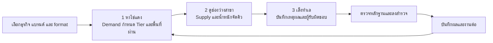
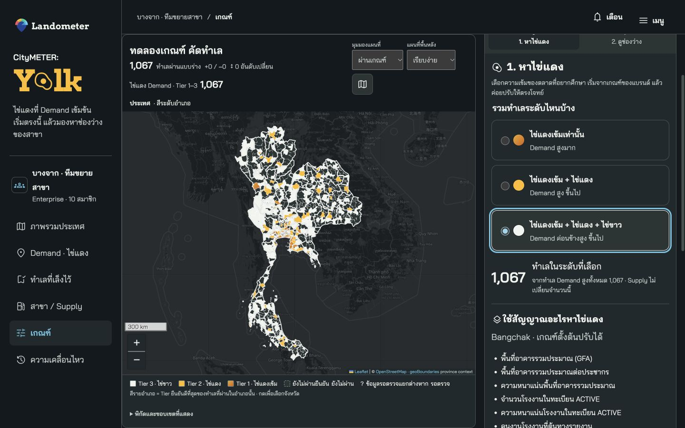
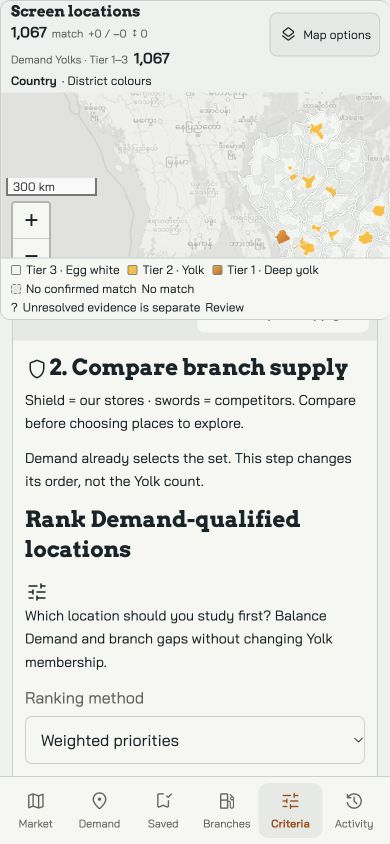
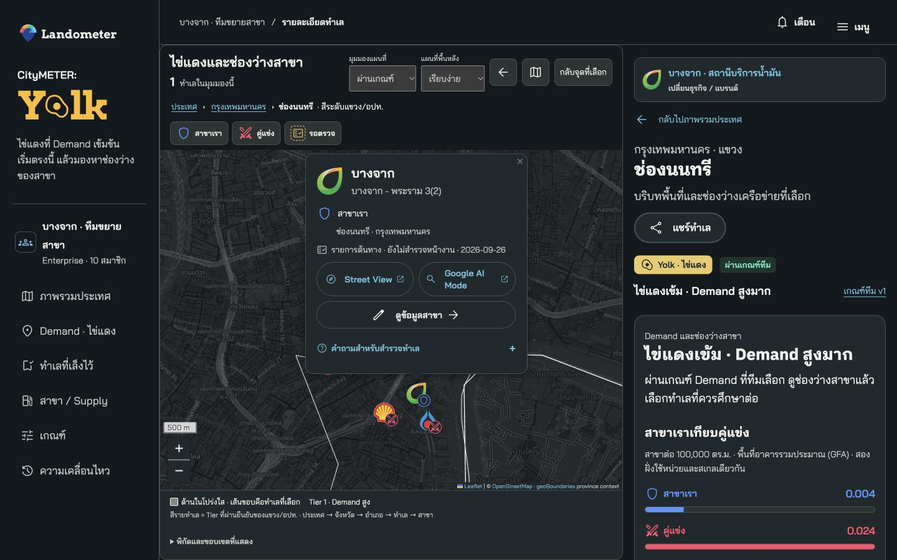
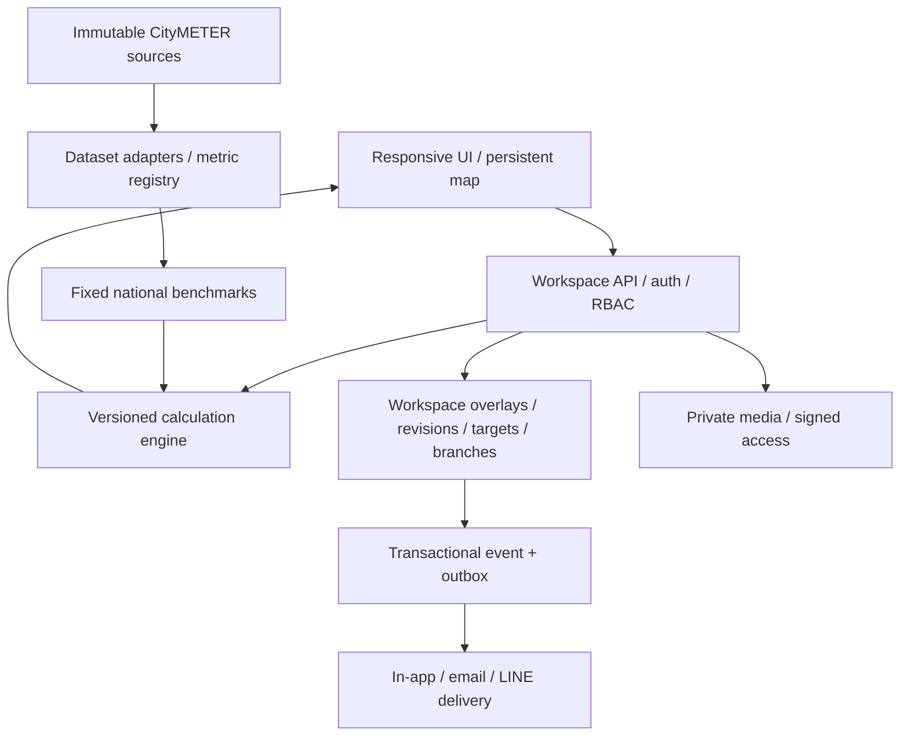

# CityMETER: Yolk · Product statement + แผนพัฒนาจากศูนย์

**หาไข่แดง ขยายตลาด — Find the yolk. Grow your market.**

**Find concentrated demand. Compare branch gaps. Shortlist your next location.**

Yolk ช่วยทีมขยายสาขาตอบว่า **ควรไปศึกษาพื้นที่ไหนต่อ เพราะอะไร และยังต้องตรวจอะไร** เริ่มจากข้อมูล CityMETER เลือกธุรกิจและแบรนด์แล้วเห็นผลทันที ปรับเกณฑ์บนแผนที่เดิม เทียบสาขาเราและคู่แข่ง แล้วเก็บทำเลและงานของทีมไว้ด้วยกัน

รุ่น 1.8.0 ลดขั้นตอนให้เหลือ **หาไข่แดง → ดูช่องว่างสาขา → เล็งทำเล** ไข่แดงวัดจาก Demand เท่านั้น ส่วน Supply และน้ำหนักช่วยจัดลำดับพื้นที่ที่ผ่าน Demand ไม่ทำให้พื้นที่กลายเป็นไข่แดงเพิ่มหรือลด การเลือก 8 รูปแบบและดาวหยุดใช้ใน flow ปัจจุบัน; เก็บนิยามเดิมไว้เป็นประวัติ

เอกสารนี้เป็นฉบับเต็มสำหรับเริ่มพัฒนาจากศูนย์ มี product statement, สูตร, UX, ข้อมูล/API, งานเรียงตาม dependencies และ JSON อยู่ในไฟล์เดียว ไม่ต้องไล่อ่าน patch เก่าเพื่อเข้าใจ flow ปัจจุบัน ส่วน assets และข้อมูลทั้งประเทศยังต้องใช้ไฟล์จริงที่ pin ไว้

**สถานะ:** static preview เป็นการทดลองในเบราว์เซอร์ ยังไม่มี shared backend, server RBAC, private production media หรือการส่ง email/LINE จริง API/schema ในเอกสารเป็นแบบเสนอสำหรับ production ผล QA และการเผยแพร่ของ 1.8.0 ต้องอ่านจาก [release contract](contracts/release.v1.8.0.json) ของรุ่นนี้ ผล 1.7.5 เป็นหลักฐานของฐานเดิม


### ผลตรวจ local ของ 1.8.0

ผ่าน **21 suites / 354 automated checks** และ native browser review แบบจำกัด **11 checks** ตรวจหน้าจอ 1440×900 และ 390×844 ตาม state ที่ระบุใน receipt มีภาพจริง 5 ภาพ การเลือก Tier ให้ผล 44 / 323 / 1,067 ทำเลใน Fuel context ที่ตรวจ; เปลี่ยนน้ำหนัก own gap จาก 20 เป็น 80 ยังคง 1,067 ทำเล (+0/−0) และ 1,054 ทำเลเปลี่ยนอันดับ

DS package integrity: 9,768 checks ผ่าน พร้อม 65 retained warnings ผลนี้ไม่ใช่ใบรับรอง usability/accessibility ทั้งผลิตภัณฑ์ ยังไม่ใช่ครบทุกภาษา/ธีม/หน้า หรือ physical-device/backend pass ส่วน provider/live-byte proof **ยังรอ external attestation** ไม่สรุปจาก local QA

[Automated receipt](evidence/automated-v1.8.0.json) · [Release checks](evidence/release-checks-v1.8.0.json) · [Native review](evidence/browser-v1.8.0/native-browser-review.json)

## เส้นทางอ่าน

| ผู้อ่าน | เริ่มอ่าน | ผลที่ควรได้ |
|---|---|---|
| Product / Marketing / Sales | 01–04, 08–09 | อธิบายคุณค่าและสาธิตขั้นตอนหลักได้ |
| Dev / Tech lead | 05–11, 12 | ตัดสินใจเรื่อง stack และเริ่มงานตาม dependencies |
| Intern / Coding agent | 02, 05–07, 12–14 | ทำงานเล็กที่มี input, output และวิธีตรวจรับ |
| QA / Reviewer | 06–09, 13, 15 | แยกสูตร สิทธิ์ หลักฐาน และ release gates |

เริ่มที่ T00: ตรวจ stack ที่ CityMETER ใช้จริง เปิดพรีวิวผ่าน HTTP แล้วลองเลือกธุรกิจ → หาไข่แดง → ดูช่องว่าง → เล็งทำเล ก่อนเริ่มเขียนระบบ ห้ามเดาว่าต้องย้าย framework หรือ database

<a id="yolk-01"></a>

## 01 · Product statement

| คำถาม | คำตอบ |
|---|---|
| **Who — ใครใช้** | ทีมขยายสาขา ทีมกลยุทธ์ ผู้จัดการแบรนด์ และทีมสำรวจของ enterprise ที่ต้องเพิ่มช่องทางเข้าถึงลูกค้า |
| **What — แก้ปัญหาอะไร** | ข้อมูลตลาดและสาขากระจายหลายที่ จัดคิวพื้นที่ที่จะสำรวจยาก ไม่เห็นผลของเกณฑ์ทันที และมักเข้าใจข้อมูลที่ขาดว่าไม่มีตลาดหรือไม่มีคู่แข่ง |
| **Why — ทำไมควรใช้** | เริ่มจาก CityMETER ได้เลย ปรับสมมติฐานให้ตรงแบรนด์ เห็นเหตุผลรายพื้นที่ และสะสมหลักฐานจากทีมเพื่อศึกษารอบต่อไปได้รอบคอบขึ้น |
| **Which — แข่งกับใคร/วิธีอะไร** | วิธีเดิมที่คนกลุ่มนี้ใช้ทำงานเดียวกัน: Google Maps + Excel/Sheets + ความคุ้นเคยของทีม + การสำรวจ + แชต งานและเกณฑ์ร่วมกันติดตามยาก |
| **How — ทำอย่างไร** | เลือกธุรกิจ/แบรนด์/format → หาไข่แดงจาก Demand → เทียบสาขาเรา/คู่แข่ง → เรียงพื้นที่ที่ผ่าน → เล็งทำเลพร้อมเหตุผล → ตรวจหลักฐานและทำงานต่อ |
| **Success — สำเร็จอย่างไร** | ทีมเตรียมข้อมูลซ้ำน้อยลง มีคิวสำรวจพร้อมเหตุผล รู้ว่าใครรับผิดชอบ และย้อนดูได้ว่าตัดสินใจบนข้อมูล/เกณฑ์รุ่นใด |

Yolk คัด **พื้นที่ที่ควรศึกษา** หลัง shortlist จึงตรวจตำแหน่งจริง แปลงที่ดิน ทางเข้าออก ฝั่งถนน การให้บริการของคู่แข่ง ต้นทุน และความเป็นไปได้ก่อนลงทุน ผลคัดไม่ใช่การรับรองว่าจะขายดี

| เริ่มได้จาก | ทีมลงทุนข้อมูลเพิ่ม | ประโยชน์ที่ตรวจสอบได้ |
|---|---|---|
| CityMETER + preset | ปรับเกณฑ์และขอบเขตคู่แข่งให้ตรงแบรนด์ | คิวสำรวจสะท้อนโจทย์ทีม |
| รายการสาขาต้นทาง | ยืนยันแบรนด์ format พิกัด และสถานะบริการ | ลดความกำกวมของ Supply |
| ทำเลที่เล็งไว้ | owner งาน รูปถ่าย โน้ต และหลักฐาน | ไม่เริ่มศึกษาทำเลเดิมจากศูนย์ |
| Demand proxy | ผลสาขา/ธุรกรรมที่มีสิทธิ์ใช้และตรวจคุณภาพแล้ว | ทดสอบและสอบเทียบความสัมพันธ์กับผลจริง |

**วงจรที่มีประโยชน์:** ข้อมูลรุ่นใหม่หรือเพื่อนบันทึกงาน → เปิดทำเล/ปรับร่างเกณฑ์ → เห็นเหตุผลและสิ่งที่ต้องตรวจชัดขึ้น → เก็บหลักฐานไว้ใน workspace แจ้งเตือนเมื่อบันทึกการเปลี่ยนแปลงที่เกี่ยวกับทีมสำเร็จ ไม่แจ้งทุกการเลื่อน slider

<a id="yolk-02"></a>

## 02 · ภาษาที่ใช้ร่วมกัน

| คำ | ความหมายในรุ่นนี้ |
|---|---|
| **ไข่แดงเข้ม / Deep yolk** | Tier 1: Demand proxy สูงมาก ตามเงื่อนไขที่เข้มที่สุดของ preset |
| **ไข่แดง / Yolk** | Tier 2: Demand proxy สูง |
| **ไข่ขาว / Egg white** | Tier 3: Demand proxy ค่อนข้างสูง (elevated demand) |
| **Demand** | สัญญาณจากประชากร อาคาร กิจกรรม หรือข้อมูลธุรกิจที่นิยามไว้ ยังไม่ใช่ผู้ซื้อ/ผู้เติมน้ำมัน/ผู้ขอกู้ที่วัดจริง |
| **Supply** | รายการสาขาหรือผู้ให้บริการที่เกี่ยวข้อง แยกเรา คู่แข่ง และส่วนที่ยังต้องตรวจ ไม่เท่ากับ capacity หรือ market share |
| **สาขาเรา — โล่** | เครือข่ายของแบรนด์ที่เลือก โล่บอกว่าเป็นฝั่งใคร ตัวเลข/แท่งบอกปริมาณ |
| **คู่แข่ง — ดาบ** | ผู้ให้บริการใน comparator scope ดาบมากไม่ได้แปลว่าทำเลไม่น่าสนใจ |
| **พื้นที่ผ่าน Demand** | `demand===true` และ Tier ไม่เกินระดับที่เลือก ตั้งต้นรับทั้ง 1–3 |
| **รอตรวจ** | ข้อมูลยังไม่พอหรือมีหลายความเป็นไปได้ ต้องแก้เหตุของข้อมูล ไม่มีปุ่มอนุมัติให้กลายเป็นทำเลดีทันที |
| **เล็งทำเล / Shortlist** | บันทึกพื้นที่และเหตุผลไว้ศึกษาต่อ ยังไม่ใช่ตรวจผ่านหรืออนุมัติลงทุน |
| **Unbranded** | มีหลักฐานว่าไม่มีแบรนด์ `UNKNOWN` ไม่เท่ากับ unbranded |

Tier เป็นระดับเงื่อนไข Demand ไม่ใช่ความมั่นใจทางสถิติ ดาวเดิมและ 8 รูปแบบไม่ใช้คัดหรือเรียงผลในรุ่น 1.8.0

รองรับ **Fuel, Grocery, Non-bank** เท่านั้นใน active demo ออกแบบ registry ให้เพิ่มอุตสาหกรรมภายหลังได้ แต่ไม่เปิดอุตสาหกรรมใหม่ก่อนมี data adapter, metric/formula, coverage, comparator และ preset ที่ตรวจแล้ว

## 03 · สามขั้นตอนบนแผนที่เดียว



1. **หาไข่แดง:** หน้าหลักแสดงระดับที่รับ 1/2/3 และคำอธิบาย preset สั้น ๆ เลือก “ไข่แดงเข้ม”, “รวมไข่แดง”, “รวมไข่ขาว” ได้ แล้วเห็นแผนที่/จำนวนเปลี่ยนทันที ค่า dataset, metric, สูตร, percentile และ AND/OR อยู่ในรายละเอียดขั้นสูง ไม่หายไป
2. **ดูช่องว่าง:** เทียบโล่/ดาบด้วยหน่วยเดียวกัน ตั้งต้นเป็นสาขาต่อฐานตลาด ตัวหารหนึ่งตัวเปลี่ยนได้ จำนวนสาขาดิบเป็นทางเลือก ปรับ reference และน้ำหนักภายในขั้นนี้ อันดับเปลี่ยนได้ แต่ Demand/Tier และชุดพื้นที่ผ่านคงเดิม
3. **เล็งทำเล:** ปุ่ม “เล็งทำเลนี้ / Add to shortlist” อยู่ในรายการ Demand, ผลคัด และ detail ใส่เหตุผล owner และงานที่ต้องตรวจ ทำได้แม้ข้อมูล Supply ยังไม่ครบโดยมีสถานะกำกับ ไม่เปลี่ยนเกณฑ์ให้ผ่านโดยอัตโนมัติ

หน้าเกณฑ์มี **2 ส่วนหลัก**: หาไข่แดง / ดูช่องว่าง ขั้นที่สามเป็น action ในรายการ/detail ไม่เพิ่ม tab เกณฑ์อีกอัน พื้นที่ชั้นสูงอาจมี Supply ต่ำหรือสูงได้ การคัด Demand และการจัดคิวเป็นคนละเรื่อง

## 04 · ทีม สิทธิ์ และ activity

มาตรฐาน enterprise: **10 คน = 1 Admin + 3 Editors + 6 Viewers** ใช้ข้อมูลร่วมกันหนึ่ง workspace สิทธิ์จริงต้องบังคับที่ server

| งาน | Admin | Editor | Viewer |
|---|:---:|:---:|:---:|
| ดูข้อมูล/งานที่มีสิทธิ์ และทดลองเกณฑ์ส่วนตัว | ✓ | ✓ | ✓ |
| บันทึกเกณฑ์ทีม เล็ง/แก้ทำเล เพิ่ม/แก้สาขา | ✓ | ✓ | — |
| เพิ่มหลักฐาน โน้ต และรูปที่แชร์ใน workspace | ✓ | ✓ | — |
| ตรวจ correction และกระทบยอด | ตาม policy | เมื่อมอบหมาย | — |
| สมาชิก โควตา และ custom-field schema | ✓ | — | — |
| สร้างสิทธิ์แชร์ใหม่ | ✓ | ตาม policy | — |

ต้องมี Admin หนึ่งคนหลังทุก transaction Viewer เปลี่ยนค่าทีมไม่ได้ แม้ฝั่ง UI ซ่อนปุ่มแล้ว server ยังต้องตรวจทุกคำขอ Demo actor selector ไม่ใช่ระบบ auth

การเปลี่ยนเกณฑ์ทีม/สาขา/ทำเลหนึ่งครั้ง = transaction + event + outbox หนึ่งชุด Feed แสดงใคร ทำอะไร เปลี่ยนจาก/เป็นอะไร เมื่อไร และอยู่ context/revision ใด เกณฑ์มี log ในหน้าเกณฑ์ ทำเลมี log ในทำเล และ activity รวมมี leaderboard ของ **action ที่บันทึกสำเร็จ** ไม่รวมดูหน้า hover slider หรือ typing ไม่ใช้จำนวน action แทนคุณภาพพนักงาน

Email/LINE/share เป็น production integration ตามสิทธิ์ มี dedupe ด้วย event ID และ notification preference; static preview ยังไม่ส่งจริง

<a id="yolk-05"></a>

## 05 · ข้อมูลและหน่วยพื้นที่

### 05.1 ขอบเขตและ source

Cohort ที่ใช้เทียบทั่วประเทศ = **7,954 reporting UUIDs: กทม. 180 แขวง / ต่างจังหวัด 7,774 อปท.** การเลือกจังหวัด/อำเภอ/แบรนด์/viewport ไม่สร้าง percentile ใหม่ Supply ระดับประเทศ มีข้อมูล **928 อำเภอ** และ geography 77 จังหวัด

- Join metric/Supply ด้วย exact UUID + source release ไม่เดาสังกัดจากชื่อหรือ bbox
- อปท. ไม่เท่ากับตำบล Crosswalk ละเอียด→อำเภอเป็น display intersection; 45 ทำเลเชื่อมหลายอำเภอ ห้ามรวมซ้ำเป็นยอดประเทศ/อำเภอ
- ใช้ source Polygon/MultiPolygon ที่มี provenance; extent ใช้ fit/กรอบเส้นประพร้อม label ไม่ลงสีเหมือนขอบเขตจริง
- Locale Insight ใช้เป็น contextual prior สำหรับวางงาน/สำรวจ ต้องมี crosswalk ก่อน aggregate ไม่เป็นประชากรทางการ eligibility ความเสี่ยง หรือหลักฐานพฤติกรรม
- Snapshot immutable แยกจาก team overlay เก็บ period, URL, retrievedAt, hash, schema, grain และ coverage ทุก dataset

### 05.2 สถานะข้อมูล

`known` รวมศูนย์ที่รายงานจริง; `missing`; `suppressed`; `not_applicable`; `invalid`; `review` เมื่อมีช่วง/ความกำกวม UI และ API รักษาสถานะถึงปลายทาง ไม่แปลงข้อมูลหายเป็น 0 ต้องมีตัวหารที่ทราบและมากกว่า 0

### 05.3 ตัววัดครบ 25 ตัว

ให้ `P=sum(ms)+sum(fs)`, `A=base.areaSqm/1,000,000`, `G=building.area`, `F=factory.totalFactory`, `W=factory.totalWorker`, `R=hotel.roomCount` ใช้สถานะ/รอบข้อมูลของแต่ละค่า

| Canonical metric | Dataset / สูตร | หน่วย |
|---|---|---|
| population_count | population: P | คนที่ dataset รายงาน |
| population_per_km2 | P/A | คน/ตร.กม. |
| working_age_15_64 | sum(ms[15:65])+sum(fs[15:65]) | คนอายุ 15–64 ไม่ใช่ผู้มีงานทำ |
| working_age_15_64_per_km2 | อายุ 15–64/A | คน/ตร.กม. |
| adult_population_20_64 | sum(ms[20:65])+sum(fs[20:65]) | คนอายุ 20–64 ไม่ใช่ผู้ขอกู้ |
| adult_population_20_64_per_km2 | อายุ 20–64/A | คน/ตร.กม. |
| children_0_14 | sum(ms[0:15])+sum(fs[0:15]) | คนอายุ 0–14 |
| population_65_plus | sum(ms[65:])+sum(fs[65:]) | คนอายุ 65+ |
| building_gfa_m2 | building: G | ตร.ม. GFA โดยประมาณ |
| building_count | building.count | รายการอาคาร |
| gfa_per_km2 | G/A | ตร.ม. GFA/ตร.กม. |
| gfa_per_person | G/P | ตร.ม. GFA/คน |
| factory_count | factory: F | รายการโรงงาน ACTIVE |
| factory_count_per_km2 | F/A | รายการ/ตร.กม. |
| factory_workers | factory: W | คนงานที่ทะเบียนรายงาน |
| factory_workers_per_km2 | W/A | คนงาน/ตร.กม. |
| hotel_count | hotel.hotelCount | รายการโรงแรม |
| hotel_rooms | hotel: R | ห้องตามรายการ ไม่ใช่ผู้พัก |
| hotel_rooms_per_km2 | R/A | ห้อง/ตร.กม. |
| office_count | office.officeCount | สำนักงาน; coverage ต่ำ ปิดใน preset ประเทศ |
| office_count_per_km2 | office.officeCount/A | รายการ/ตร.กม. |
| fiscal_total_thb | fiscal.total × 1,000,000 | บาท/ปี; source หน่วยล้านบาท |
| fiscal_ex_grants_thb | (selfCollected+stateAllocated) × 1,000,000 | บาท/ปี ไม่รวม grants |
| fiscal_ex_grants_per_km2 | รายได้ไม่รวม grants/A | บาท/ตร.กม./ปี |
| fiscal_ex_grants_per_person | รายได้ไม่รวม grants/fiscal.population | บาท/คน/ปี; ใช้ population ของ fiscal |

Runtime alias `population`/`gfa` map เป็น `population_count`/`building_gfa_m2` ชัดเจน อย่าสร้าง distribution ซ้ำ Snapshot: population 2026-08; building V4/UI2024-12; factory ACTIVE2025-04; office V3/UI2025-05; fiscal2024; hotel ไม่เผยแพร่รอบ ไม่อ้างว่าทุกชุดสด ณ วันที่ใช้

โรงงานพร้อมใช้แล้ว โรงเรียน/โรงพยาบาล “ขนาดใหญ่” ต้องมีนิยาม adapter period coverage และสูตรก่อนเพิ่มเป็น factor ไม่เปิดเพียงเพราะมีชื่อ dataset

<a id="yolk-06"></a>

## 06 · Demand: สูตรและ preset ที่ใช้ได้จริง

### 06.1 National percentile

ใช้ PERCENTILE.INC บนค่าดิบ valid ของ metric ใน fixed cohort ไม่ปัดก่อนเทียบ แต่ละ metric มี validN ของตัวเอง

```text
values = sort(known finite valid raw values in fixed national cohort)
if n == 0: cutoff = UNKNOWN
r = (n - 1) * percentile / 100
cutoff = values[floor(r)] + (r-floor(r)) * (values[ceil(r)]-values[floor(r)])
pass = rawValue >= cutoff, plus the profile's explicit positive guard
```

Midrank สำหรับ ranking แยกจาก cutoff: `100*(L+0.5*max(0,E-1))/(n-1)`; n=1 แสดง50 P95 ไม่รับประกันว่าผ่าน5%เมื่อมี ties UI แสดง “กลุ่มบน…”/progress + metric caption/rawvalue ไม่เรียง P99.7/P100.0 หลายค่าโดยไม่มีชื่อ

### 06.2 Fuel

| กลุ่ม | ตัววัด | ไข่แดงเข้ม T1 | ไข่แดง T2 | ไข่ขาว T3 |
|---|---|---|---|---|
| อาคาร | GFA, GFA/คน, GFA/ตร.กม. | ทั้ง3 ≥P99 | ทั้ง3 ≥P95 | อย่างน้อย1 ≥P95 |
| กิจกรรม | โรงงาน, โรงงาน/ตร.กม., คนงาน, คนงาน/ตร.กม., ห้องพัก, ห้องพัก/ตร.กม. | ผ่านP95อย่างน้อย5ข้อ | ผ่านP95อย่างน้อย3ข้อ | ผ่านP95อย่างน้อย1ข้อ |

ระหว่างกลุ่มใช้ OR เลือก Tier ดีที่สุดที่ยืนยันได้ 4กิจกรรมเป็นT2; 2กิจกรรมเป็นT3 ไม่เพิ่ม positive guard แอบแฝงใน accepted Fuel เมื่อ cutoff=0 ศูนย์ที่ทราบจริงอาจผ่าน ต้องแสดง diagnostics หากจะเปลี่ยนให้ version profile พร้อม membership diff

### 06.3 Grocery

7-Eleven/C_STORE มีสอง path OR ระหว่าง path, AND ภายใน Tier และ value>0:

| Path | T1 | T2 | T3 |
|---|---|---|---|
| ประชากร | count≥P75 AND density≥P90 | count≥P50 AND density≥P75 | count≥P75 |
| คนงานที่รายงาน | count≥P90 AND density≥P90 | count≥P75 AND density≥P75 | count≥P75 |

Supermarket/hypermarket/wholesale/community/visitor ใช้ family registry ใน JSON ไม่ยืม Fuel preset แบรนด์หลายformatเริ่ม formatสำคัญที่มีหลักฐาน เช่น Lotus’s/BigC HYPERMARKET, Tops SUPERMARKET, Makro WHOLESALE ไม่มีการอ้าง inventorycountเป็นยอดขาย marketshare Pharmacyล้วนไม่อยู่ comparatorนี้

### 06.4 Non-bank

MTC baseline ใช้ population20–64 และ density, value>0: T1 count≥P75 AND density≥P90; T2 count≥P50 AND density≥P75; T3 count≥P75 แบรนด์อื่นใช้ family override ที่มี research scope ใน registry

ช่วงอายุของประชากร ไม่ใช่ borrower/creditworthiness/debt distress เมนูเลือกแบรนด์มี 10 ราย แต่ comparator อ่าน legal entities ที่เกี่ยวข้องครบ ไม่จำกัดเหลือ 10 รายตามเมนู บริษัท/ใบอนุญาตไม่ยืนยันว่าทุกสำนักงานให้บริการทุก product

### 06.5 Unknown, Tier และ membership

AND: falseหากมีfalse, trueหากทุกข้อtrue, นอกนั้นunknown; OR:trueหากมีtrue,falseหากทุกข้อfalse; AtleastK:trueเมื่อconfirmed≥K,falseเมื่อconfirmed+unknown<K,นอกนั้นunknown

ใช้ Tier จาก pathที่ยืนยันtrueเท่านั้น `possibleBetterTier` ไม่ promote Tier แบบอัตโนมัติ Grocery/Non-bank baselineมี minvalidN30; Fuelคงpolicyเดิม ไม่มีgroupเปิดหรือสูตรinvalidให้เป็นinvaliddraft ไม่แสดงผลเก่าเป็นผลใหม่

```text
confirmedDemand = demand === true
activeEligible = confirmedDemand && qualifyingTier in [1,2,3] && qualifyingTier <= maxDemandTier
```

ตั้งต้น `maxDemandTier=3` หากเลือก 1 หรือ 2 จะรับพื้นที่แคบลง จำนวนผ่านลดหรือเท่าเดิม Supply/weights/pattern history ไม่มีผลต่อสองบรรทัดนี้ `demandMode` และ `patterns` ที่บันทึกในงานเดิมเก็บไว้เป็นประวัติ ไม่ใช้ใน ขั้นตอนใช้งานของ 1.8

<a id="yolk-07"></a>

## 07 · Supply: โล่กับดาบ และการเรียงคิว

### 07.1 โหมดหลัก: สาขาเทียบฐานตลาด

```text
rate = branchCount / positive known rawDenominator * normalizationUnit
gapScore = 100 / (1 + rate / roleReference)
rate == roleReference -> gapScore 50/100
```

| ธุรกิจ | ตัวหารตั้งต้น | หน่วย |
|---|---|---|
| Fuel | GFAรวมประมาณ | สาขา/100,000ตร.ม.GFA |
| Grocery | ประชากรรวม | สาขา/10,000คน |
| Non-bank | ประชากรรวม | รายการที่เกี่ยวข้อง/10,000คน |

หนึ่งตัวหารต่อ preset เปลี่ยนได้ ไม่หารด้วย Tier, percentile หรือ rank score โหมดจำนวนสาขาเป็นทางเลือก โล่/ดาบบอกฝั่ง ตัวเลข/แท่งบอกจำนวนหรืออัตรา **หน่วยและสเกลเหมือนกันภายในคู่** โดยมีป้าย “สเกลเฉพาะทำเลนี้ / Local scale” พร้อมช่วงจริง 0 ถึงขอบบนที่มากที่สุดของสองฝั่ง (รวมช่วงความไม่แน่นอน) เมื่อค่านั้นมากกว่า 0; ใช้ช่วง 0–1 เฉพาะกรณีทั้งสองฝั่งเป็นศูนย์หรือยังไม่มีข้อมูล ทั้งแบบเต็มและแบบย่อ ไม่บังคับสเกลเป็น 1 เมื่ออัตราจริงต่ำกว่า 1 ความยาวแท่งข้ามทำเลเปรียบเทียบกันไม่ได้ ไม่เรียกแท่งว่า coverage ของตลาดหรือ capacity

ActualPOIใช้ verifiedsquarebrandgraphic + ชื่อแบรนด์ + rolebadgeโล่/ดาบ ถ้าไม่มีassetเหมาะสมใช้DSroleiconกับชื่อ ไม่เอาตราใหม่มาทำให้ดูเหมือนแบรนด์รับรองผลวิเคราะห์

### 07.2 จุดเทียบช่องว่างและ slider

Reference เริ่มจาก median ของ positive exact-count national rates ใน context, N≥5, Uต้องknown0และexclude boundsfieldsตามpolicyเดิม ตัวอย่างไม่พอfallback1/unitพร้อมlabel explorative เมื่อSupplyโหลดและcontextใหม่เท่านั้น Savedcontextsคงเดิมไม่reseedขณะdrag/เปลี่ยนภาษา/route การเปลี่ยนตัวหารseedในdraftพร้อมข้อความ ไม่saveทีมทันที

จำนวนดิบbaseline Fuel O≥3/C≥3; Grocery/Nonbank O≥2/C≥2 แต่registryoverrideได้ ค่านี้เป็นจุดเทียบ ไม่ใช่capacityจริง

UI ใช้คำว่า **จุดเทียบช่องว่าง / Gap reference** เมื่ออัตราสาขาเท่าจุดเทียบ gap score = 50/100 สาขายิ่งน้อยเมื่อเทียบกับฐานตลาด gap ยิ่งมาก ค่านี้ไม่ใช่สาขาที่ตลาดรองรับได้จริง

เลื่อนไปขวาเพิ่มจุดเทียบ ทำให้ gap score และอันดับอาจเปลี่ยน แต่ **จำนวน Demand, Tier และ eligible IDs คงเดิม** แสดง diff “อันดับเปลี่ยน” ไม่เรียก “ไข่แดงเพิ่ม” ช่วง slider อิง calibration ที่คงที่ รับค่าพิมพ์ตรงนอกช่วงพร้อม warning โดยไม่ clip ค่า High/Low เดิมเก็บเป็น diagnostics/history ไม่เป็น gate ของรุ่นนี้

### 07.3 Supply uncertainty

- Fuel UNKNOWNbrand U: jointallocations `O+k / C+U-k` ใช้kเดียวกัน ไม่เติมUเต็มทั้งสองฝั่ง
- Grocery fineC_STORE reconciliation: ถูกดีนครราชสีมาอาจ[N−1,N]; 7-Elevenสุราษฎร์ธานีอาจ[N,N+1] ตามrole ไม่กระจายส่วนต่างเป็นยอดจริง
- Nonbankassignedcountsเป็นlower/residualเป็นupperpossibility ไม่แจกresidualจริงซ้ำทุกทำเล unionIDsไม่doublecountlicences Snapshotมี5,534/23,524office recordsยังไม่ผูกfinearea

Interval[L,U]: Highแน่เมื่อL≥reference,Lowแน่เมื่อU<reference,นอกนั้นreview **reviewไม่ตัดพื้นที่Demand-qualifiedออก** แต่กำกับว่าอันดับSupplyยังไม่แน่นอน Known0/positivedenominatorเป็น0; missing/nonpositiveเป็นรอตรวจ

### 07.4 Ranking: จัดคิวพื้นที่ที่ผ่าน Demand

Fuel ตั้งต้นเป็น weighted: Demand 70 / ช่องว่างสาขาเรา 20 / ช่องว่างคู่แข่ง 10 ส่วน Grocery/Non-bank ตั้งต้นเป็น context (Tier → path strength ใน Tier เดียวกัน → ID) ค่า weighted สำรองยังเป็น 100/0/0 ผู้ใช้ปรับน้ำหนักในดูช่องว่างได้ ไม่ยืม Fuel weights ให้ทุกธุรกิจ

```text
metricScore = fixed-cohort midrank percentile [0,100]
groupScore = weighted mean(active configured metric scores)
demandScore = weighted mean(enabled configured group scores)
gap(N,T) = 100 / (1 + N/T)
weightedScore = (Wd*demandScore + Wo*ownGap + Wc*competitorGap) / (Wd+Wo+Wc)
relative equivalent T = roleReference * rawDenominator / normalizationUnit
```

Metric ที่ขาดยังเก็บน้ำหนักเดิมเป็นช่วงคะแนน [0,100] ไม่ตัดน้ำหนักแล้ว normalize ใหม่ Supply ใช้ joint bounds ที่เป็นไปได้จริง ได้ `rankLower`, `rankUpper`, `coverage` ไม่เรียก coverage ว่าความมั่นใจทางสถิติ

Context sort: eligible ก่อน → Tier ที่ดีกว่า → strongest confirmed path ใน Tier เดียวกัน → area ID

Weighted sort: eligible ก่อน → rankLower มากกว่า → Tier ที่ดีกว่า → sourceRank → ID ผลต้องเรียงเหมือนเดิมเมื่อ input เท่ากัน ไม่ใช้ดาวเดิม น้ำหนักรวมเป็น 0 ใช้ไม่ได้ น้ำหนัก metric เป็น 0 ตัดเฉพาะส่วนของอันดับ ไม่ปิดเงื่อนไข Demand

## 08 · UX แผนที่ และ DS

### 08.1 เมนู

| หน้า | หน้าที่ | แผนที่ |
|---|---|---|
| ภาพรวมประเทศ | ผลDemand-qualifiedเรียงตามcontext/ranking | TierของDemandในชุดผ่าน ไม่ใช่Supplyfilter |
| Demand · ไข่แดง | Tier/rawmetric เหตุผล ปุ่มเล็งทำเล | PureDemandก่อนmaxTierเพื่ออ่านตลาด |
| สาขา / Supply | role/inventory/verification/metric | count/km²/market-ratechoropleth |
| เกณฑ์ | หาไข่แดง / ดูช่องว่าง +advanced | draft/team/diffบนmapเดิม |
| ทำเลที่เล็งไว้ | owner/status/work | shortlistedareas |
| รายละเอียดทำเล | marketlandscape/evidence/work/log | transparentselectedpolygon+POI |
| แก้สาขา | CRUD/geometry/evidence/photos | sourcepinและdraftpinแยกชัด |
| ความเคลื่อนไหว | feed+leaderboard | focusentityของeventเมื่อผู้ใช้เลือก |
| ทีม / inbox | seats/preferences/notificationdemo | cameraคงเดิม |

Map host อยู่เหนือ route `mount()` เรียกซ้ำได้โดยไม่สร้าง instance ใหม่ `sync()` อัปเดตชั้นข้อมูลแต่ไม่ fit เปลี่ยนเมนู/เกณฑ์/ภาษา/ธีมแล้ว camera คงเดิม เฉพาะ navigation, home, fit หรือ focus ที่ผู้ใช้สั่งจึงเปลี่ยน camera เมื่อ loading/error ไม่แสดงข้อมูลแบรนด์เก่าแทน context ใหม่

### 08.2 ลงสีเล็ก คลิกใหญ่

| กำลังดู | ลงสี | hover/click | POI |
|---|---|---|---|
| ประเทศ | อำเภอ | จังหวัด | ไม่แสดงจุดเหมือนสาขาจริง |
| จังหวัด | แขวง/อปท. | อำเภอ | aggregateเท่านั้น |
| อำเภอ | แขวง/อปท. | แขวง/อปท. | aggregateเท่านั้น |
| แขวง/อปท. | selected interiorใส | ทำเล/หมุด | actualcoordinateเรา/คู่แข่ง/รอตรวจ |

CountrySupplyใช้928nativeD/Ptotals+directdenominators ไม่บวกfine45multi-districtlinks RawDemandcountrymetriclabel“maximum knownfinevalue”ไม่เรียกdistrictsum/mean

Ordinaryoutlinewhite#FFFFFF parentrelativelythicker; countrydistrict0.45/province1.2px, closer district1.05/fine0.45, selectedfine0.8; parentcontext1.1 Yellowhover#FFBC1F2pxบอกขอบเขตที่คลิกได้ Selectedfill=falseทุกรูปแบบbasemap ไม่มีopaquehighlightบังถนน

### 08.3 สีและสัญลักษณ์

Tier1exactdensity.areaLUT20–40yellow-orangegradient; Tier2Yolk#FFBC1F; Tier3eggwhite#F1F4EF เหมือนกันทั้งtheme Tier1gradientเป็นcategoricalappearanceไม่ได้หมายถึงค่าแตกต่างในpolygon ส่วนmetricquantitativeอื่นใช้ **41exactLDSLUT** ตามunit/denominator ไม่reverse/darken/invert/alpha data paint

โล่blueowninkและดาบredcompetitorinkใช้retainedLDScategoricaltheme tokens ไม่ใช้สีDemandเป็นparty Knownzero/nodata/suppressed/reviewใช้label/shapeที่ต่างกัน IconsจากverifiedMaterialSymbolsassetผ่านsharedhelper ไม่มีemojiเป็นshippingicon

LDS0.9.7base SHA256 `d3085cbc0a50195f1cbf0c77b1d77c0d19b84364daf2948eb367348d65432d96`; LocationProfile SHA256 `5d4856041709735d3a04d4a510a88b551df86c211fdcab8a0707e8fe7c9efc3b` ใช้exactassetsในreference/vendor ไม่สร้างlogo/font/colorขึ้นใหม่

Arvo สำหรับหัวเรื่องอังกฤษ, IBM Plex Sans Thai Looped สำหรับหัวเรื่องไทย, Bai Jamjuree สำหรับ UI, JetBrains Mono สำหรับตัวเลข ใช้ bundled weights และ coverage ตาม DS วางโลโก้ Landometer ทางการโดยไม่มีกรอบ ใช้ soft surfaces ใน light theme และ dark foundation ทั้ง header/sidebar ใน dark theme ไม่มี motif, backing plate, decorative bracket หรือ colored left rail

Responsive: mapใหญ่คงอยู่desktop; mobilecontrolsไม่ทับmap/legend ใช้bottomnavigationกระชับและtouchhitareaไม่เล็ก Captionhoverunderlineเท่านั้นไม่ใต้icon keyboardfocusยังชัด Basemap3แบบsimplified/satellite/detailedมีattributionและdataage ไม่อ้างsatelliteเป็นภาพสด


### 08.4 ภาพจาก prototype ที่ตรวจจริง

**Desktop · ไทย · dark · 1440×900:** สองขั้นตอนเกณฑ์และแผนที่ที่คงอยู่



**Mobile · English · light · 390×844:** ดูช่องว่างและปรับน้ำหนัก โดยแผนที่ยังมองเห็น



**ทำเลช่องนนทรี · ไทย · dark:** จุดบางจากจริงมีโลโก้ ชื่อ โล่ และลิงก์ช่วยสำรวจ; ขอบเขตที่เลือกโปร่งใส



ภาพเหล่านี้เป็น local native renders ของ source ปัจจุบัน ไม่เป็นหลักฐานว่า provider เผยแพร่แล้วหรือสาขาให้บริการจริงในวันนี้ ดู state/ข้อจำกัดใน native review receipt

## 09 · CRUD และหลักฐานที่ช่วยตัดสินใจ

### 09.1 ทำเล

Target ผูก workspace + industry + own brand + format/profile + reporting UUID มี status, owner, reason, tasks, evidence, custom fields และ revision ใช้ archive/restore เก็บประวัติ source/criteria ที่ใช้ตอนเล็ง เมื่อผลคัดเปลี่ยนไม่ลบ target เอง

Locationdetailแสดงชื่อ/ขอบเขต, DemandTierและเหตุผ่าน, selectedrawmetric/sourceperiod/coverage, โล่/ดาบsame-unitpairและSupplyuncertainty, brandPOIs, marketlandscapeที่มีข้อมูลรองรับ, evidence/workactionsที่เห็นว่าคลิกได้, feedรายทำเล

### 09.2 สาขาและรูป5รูป

Branch overlay ผูก ID, brand, relation, format, location, coordinates, verification, evidence, custom fields และ revision เก็บรูปได้สูงสุด 5 รูปใน private production storage รูป Demo เป็น mockup ไม่ใช่รูปสาขาจริง ไม่เอา signed URL หรือ image bytes ลง feed การแชร์ต้องตรวจ tenant/permissions

รู้พิกัด/บริบทแล้วช่วยกรอก: source/savedassignmentและค่าที่ผู้ใช้แก้มาก่อน hint Unique strictinteriordisplaypolygonช่วยfilldraftได้ Boundary/overlap/conflictต้องให้เลือก ไม่เดาUUIDจากnearbyชื่อ/bbox ไม่เปลี่ยนaggregate/legalmembership/operatingstatusจากhint

สาขาเดิมunresolvedบันทึกnotes/photosได้ สาขาใหม่ต้องname+(validcoordinatepairหรือvalidarea) Dropdownfilteredตามcontext CurrentmapseedNEWrecordsเท่านั้น ไม่staleY.selectedไม่forcedBangkok Unknownbrandคงunknown

Asynclookup/photoawaitต้องcapturecontext/route/record/revision/coordsแล้วตรวจกลับก่อนapply guardfocus/cursor/sameform draft ข้อมูลกลับช้าไม่เขียนทับrecordหรือแบรนด์ใหม่ รูปสาขาnewแยกdraftcontext

### 09.3 ตรวจอะไรถึงผ่าน

“ตรวจผ่าน”ต้องบอกขอบเขตที่ตรวจ ไม่ใช้flagเดียวรับรองทุกเรื่อง:

1. **Demand:** ตรวจmetricvalues/period/formula/coverage/thresholdที่ทำให้ยังunknown การเติมหลักฐานไม่เปลี่ยนต้นทางจนreconciliationที่กำกับผ่าน
2. **Supply:** ตรวจbrand/format/productscope,พิกัดและการผูกพื้นที่, sourcecountinterval/residual,สถานะบริการพร้อมแหล่ง+วันที่ Unknownไม่เป็นunbranded
3. **ทำเลจริง:** สำรวจเข้าออก/ฝั่งถนน/traffic/daypart/landparcel/costregulationตามอุตสาหกรรม แยกจากalgorithmeligibility

Correctionsใช้exactUUID+provenance+revision+reviewer+reconciledsourceversion ไม่bulkapproveจากรูปแผนที่ ไม่กระจายresidualเพื่อทำให้rankดูแน่นอน StreetView/GoogleAIModeลิงก์คำถามช่วยสำรวจ ไม่ใช้ผลsearchเป็นofficialverificationอัตโนมัติ

## 10 · สถาปัตยกรรมที่เสนอสำหรับ production



T00เลือกstackจริงโดยตรวจrepo/CityMETERAPIsก่อน แยกpureengineจากrender และsourceจากteamoverlay UIทำdraftส่วนตัว result cachekeyต้องมีcontext+source+cohort+criteriaHash+engineVersion ใช้worker/servercalculationตามประสิทธิภาพที่วัด ไม่เลือกเพราะเป็นแฟชั่น

RequestcapturesrequestID/context/hash/source/criteriarevision เมื่อผลกลับมาถ้าticketไม่ตรงทิ้งผล เผยผลlatestเท่านั้น Abort/timeout/errorไม่ย้ายcameraหรือทำให้คนอ่านผลcontextเก่า

## 11 · Data/API contracts และการบันทึก

Entitiesที่ต้องมี: Workspace/Membership; IndustryProfile/Brand/Format; SourceRelease/MetricDefinition/BenchmarkRelease; CriteriaRevision/PrivateDraft/CalculationResult; Target/Task/CustomField; BranchOverlay/Evidence/Photo; Event/Outbox/Notification/ShareGrant ดูfield/index/endpointsแบบเต็มในmachineproductionblock

| APIตัวอย่างที่เสนอ | สิทธิ์ / ผล |
|---|---|
| GET bootstrap/profiles/sources/boundaries | ตรวจmembership ส่งcontext+provenance |
| POST calculations/preview | ส่วนตัว ไม่สร้างteamevent; source+criteriaHash+engineVersion |
| PUT criteria withbaseRevision | admin/editor; conditionalrevision +oneevent/outbox |
| CRUD targets/branches/evidence | workspaceRBAC+revision ไม่mutateimmutableadapter |
| POST coordinate-resolution | read-onlycandidates/provenance/ambiguity ไม่มีevent |
| POST/complete media upload | ตรวจmime,size,max5,tenant; metadata ไม่ส่งbytesในevent |
| GET eventfeed / POST shares | ตรวจread/writegrant; dedupednotifications |

Saveทั่วไป: validate+authorize → checkbaseRevision → writeoverlay/revision+event+outboxหนึ่งtransaction → returnrevision/eventID → asyncdeliverydedupe 409เมื่อrevisionขัด,422validation,401/403auth สิทธิ์UIไม่พอสำหรับsecurity

Source refresh สร้าง release ใหม่ ตรวจคุณภาพและ benchmarks แล้วแสดง ID-set/rank diff ไม่เขียนผลในประวัติทับ Migration ของ engine 1.8 เก็บ pattern/demandMode เดิมไว้แต่ไม่ใช้เป็น active filter ไม่สร้าง event เพียงเพราะเปิดหน้า ให้เทียบผลจาก engine เดิมก่อนยืนยันค่าทีม


## 12 · งานพัฒนาแบบ step-by-step

ทำทีละงานตาม dependencies แต่ละงานส่งหลักฐานการตรวจของตัวเอง ไม่เรียก API/schema ที่เสนอว่ามีอยู่จริงใน static preview

### T00 · ตรวจ source, assets และ stack ที่ทีมใช้จริง

**ทำหลัง:** เริ่มได้เลย

**เป้าหมาย:** ให้ทั้งทีมเริ่มจาก baseline เดียวกัน และเห็นว่าส่วนใดมีอยู่แล้ว ส่วนใดต้องสร้างเพิ่ม

**Input:** เอกสารนี้, source commit `bdcd99cda0396106957827c2103b682dc02d07a9`, manifests ของรุ่นนี้ และ repository, auth, datastore, API, deployment ของ CityMETER ที่ทีมเปิดให้ใช้

**Output:** `docs/STACK_MAP.md`, `docs/SOURCE_ASSET_BASELINE.md` และรายการสิ่งที่จะใช้ต่อ สิ่งที่ต้องสร้าง และสิ่งที่ยังขาด พร้อมคำสั่ง run, build และ test ที่ใช้ได้จริง

**ทำตามลำดับ:**

1. Clone และเปิด baseline ผ่าน HTTP ทดลองทั้ง Fuel, Grocery และ Non-bank เพื่อเข้าใจ flow ก่อนแก้โค้ด
2. ตรวจ entrypoint, ลำดับ dependencies, asset hashes และ licences เทียบกับ manifests ที่ระบุ
3. สำรวจ stack จริง จด paths, ผู้รับผิดชอบ และชื่อ environment variables โดยไม่บันทึก secrets ลงเอกสารหรือ repository
4. ทำตารางเชื่อม module ของเดโมกับบริการจริง ระบุข้อจำกัดและ gate ที่ยังต้องผ่านก่อนเริ่ม production

**ตรวจรับเมื่อ:** ระบุ stack, owners และคำสั่งใช้งานจริงได้; snapshot IDs, cohort และ LDS ตรงกับ baseline หากยังเข้า repository ของ production ไม่ได้ ให้รับได้เฉพาะงานสำรวจต้นแบบ และคง gate การเชื่อมระบบจริงไว้

### T01 · ตั้ง project และ application shell

**ทำหลัง:** T00

**Output:** โครงสร้าง project ตาม stack ของทีม, ข้อความไทย/อังกฤษ, token bridge สำหรับ light/dark/system, shell ที่มี map host คงอยู่และ panels ตาม route รวมถึงสถานะ loading/error

**ทำตามลำดับ:**

1. ตั้ง project และ build tooling ตามผล T00 แยก source adapters, calculation engine, UI และ services ให้ทดสอบแต่ละส่วนได้
2. ต่อ logo, fonts, icons และ native tokens จากชุด LDS ที่ตรวจแล้ว เลือก dependencies ที่จำเป็น แทนการนำ CSS ทุกเวอร์ชันในอดีตมา override กัน
3. สร้าง shell และ route panels โดยวาง map host นอก panel ที่เปลี่ยนตามเมนู แล้วเพิ่มข้อความสองภาษาและสถานะ loading/error

**ตรวจรับเมื่อ:** ทุก route เปิดได้; logo ไม่มีกรอบ; icon ไม่หลุดเป็นชื่อ glyph; header/sidebar ใน dark theme ไม่เป็นแถบสีอ่อน; หน้าจอแคบไม่เลื่อนแนวนอน; เปลี่ยน route แล้วไม่สร้าง map instance ใหม่

**วิธีตรวจ:** ทดสอบ route และ keyboard focus พร้อมดูหน้า render จริงในไทย/อังกฤษและ light/dark ที่ 390 และ 1440 px ตรวจ long labels เพิ่มที่ความกว้างขั้นต่ำ 320 px

### T02 · Tenant, auth, จำนวนสมาชิก และ database schema

**ทำหลัง:** T00, T01

**Output:** Schema, migrations และ auth/authorization middleware ตาม §04/11 พร้อม fixtures สอง tenant และทีมมาตรฐาน 10 คนตามสัดส่วนบทบาทที่กำหนด

**ทำตามลำดับ:**

1. สร้าง tenant, membership และ context ที่แยก workspace, industry, own entity, format, product และ profile version อย่างชัดเจน
2. บังคับสิทธิ์และจำนวนสมาชิกที่ server ตั้ง unique IDs, indexes, optimistic locking และ idempotency primitives
3. เก็บ private draft แยกตามผู้ใช้และ context แล้วสร้าง fixtures สำหรับการอ่าน/เขียนภายใน tenant และการพยายามข้าม tenant

**ตรวจรับเมื่อ:** Viewer ถูกปฏิเสธเมื่อส่ง mutation ของข้อมูลร่วมทุกช่องทาง แต่ทดลองและบันทึก draft ส่วนตัวได้ตามสิทธิ์; อ่าน/เขียนข้อมูลหรือ media ข้าม tenant ไม่ได้; request เพิ่มสมาชิกที่ชนกันไม่ทำให้เกิน quota; การโอนสิทธิ์ยังเหลือ admin อย่างน้อยหนึ่งคน

**วิธีตรวจ:** Integration tests สำหรับ authorization, tenant isolation, concurrent seat requests และ revisions การปิดปุ่มใน UI ไม่ใช่หลักฐานว่า server RBAC ทำงานแล้ว

### T03 · นำเข้า source และเชื่อมขอบเขตพื้นที่

**ทำหลัง:** T00, T02

**Output:** Immutable source releases, normalized records, provenance และ diagnostics, geometry/display links และ hash ของ fixed national cohort

**ทำตามลำดับ:**

1. สร้าง adapters สำหรับข้อมูลฐานพื้นที่ ประชากร อาคาร โรงงาน โรงแรม สำนักงาน รายได้ อปท. และ Supply ของทั้งสาม industry
2. Dedupe ด้วย reporting UUID และ record IDs ที่ตรงกัน ตรวจสถานะค่า หน่วย และรอบข้อมูล เก็บ native district data แยกจากข้อมูลระดับละเอียด
3. เชื่อม geometry และ display crosswalk โดยไม่ทำให้การแสดงพื้นที่เดียวในหลายอำเภอกลายเป็นการนับซ้ำ แล้วออก source release ที่ทำซ้ำผลได้

**ตรวจรับเมื่อ:** Baseline มี fine IDs ไม่ซ้ำ 7,954 พื้นที่ แบ่งเป็น กทม. 180 และต่างจังหวัด 7,774 พื้นที่ พร้อม native district records 928 อำเภอ; polygons และ provenance ผ่านการตรวจ; display links ของ 45 พื้นที่ที่คร่อมหลายอำเภอไม่เพิ่ม counts; ยอดต้นทางตรวจสอบได้ภายใน grain ที่เปรียบเทียบกันได้ และคง Grocery deltas กับ Non-bank residual 5,534 รายการที่ทราบอยู่แล้ว ไม่บังคับให้ยอดทุกชุดเท่ากัน

**วิธีตรวจ:** Snapshot parity, geometry, schema และ reconciliation ห้ามแก้ immutable source เพื่อทำให้ test ผ่าน และห้ามรวมยอดคนละ grain แล้วอ้างว่าเป็นยอดเดียวกัน

### T04 · Metric registry และตัวคำนวณสูตรที่ปลอดภัย

**ทำหลัง:** T03

**Output:** Definitions ของ 25 metrics, canonical aliases, pure evaluator และ metadata สำหรับแสดง source/formula รวมถึงสถานะ disabled ของ metric ที่ยังไม่รองรับ

**ทำตามลำดับ:**

1. ทำ registry ให้แต่ละ metric ระบุ dataset, field, สูตร, หน่วย, ตัวหาร และรอบข้อมูล ก่อนนำไปใช้ในเกณฑ์
2. Implement เฉพาะ field, sum, slice และ arithmetic ที่อยู่ใน whitelist ตรวจตัวหารเป็นบวกและค่าตัวเลขตามนโยบาย finite/nonnegative
3. แสดงเหตุผลเมื่อ metric ใช้ไม่ได้ รักษาความต่างของ known zero, missing, suppressed และค่าผิดรูปแบบ

**ตรวจรับเมื่อ:** Age indices ถูกต้อง; สูตร GFA ต่อคน/พื้นที่และสูตร fiscal ใช้ตัวหารถูก; `null`, suppressed และ nonfinite ไม่ถูกแปลงเป็น 0; arbitrary code และ query string ที่ไม่รองรับถูกปฏิเสธ

**วิธีตรวจ:** Fixtures ของสูตร, known zero, missing และ invalid denominator หากเพิ่ม safe AST builder ต้องจำกัดความลึกและ execution budget ด้วย

### T05 · สร้าง benchmark ระดับประเทศที่คงที่

**ทำหลัง:** T04

**Output:** Distributions, cutoffs, midranks, `validN`, `zeroN`, `missingN`, cohort hashes และ cache ที่ผูกกับ source, metric และ cohort

**ทำตามลำดับ:**

1. สร้าง distribution จากค่าที่ใช้ได้ใน national cohort ตามนิยามของ metric แล้วคำนวณ `PERCENTILE.INC` บนค่าจริงที่ยังไม่ปัดเศษ
2. Implement นโยบาย ties, P100, กรณีมีค่าเดียว/ไม่มีค่าที่ใช้ได้ และ minimum N ตาม preset
3. Cache ผลตาม source release และ cohort การเลือกจังหวัด แบรนด์ หรือ viewport ใช้ benchmark เดิม

**ตรวจรับเมื่อ:** การกรองพื้นที่หรือเลื่อนแผนที่ไม่เปลี่ยน Demand cutoffs; ไม่ปัดค่าก่อนเทียบเกณฑ์; การเพิ่ม diagnostic policy ต้องระบุ cohort/profile version ใหม่ ไม่ย้ายฐานเปรียบเทียบโดยเงียบ ๆ

**วิธีตรวจ:** ใช้ fixtures ทางคณิตศาสตร์ที่คำนวณอิสระ ไม่ใช้ผลจาก engine เดียวกันเป็น expected value ของตัวเอง

### T06 · Demand engine และ preset registry

**ทำหลัง:** T04, T05

**Output:** Pure evaluator สำหรับ threshold-count และ path แบบ AND/OR, confirmed/possible tiers และ reasons พร้อม presets ของ 3 industries, 9 families และ bindings ของ 37 brand contexts

**ทำตามลำดับ:**

1. Implement rule tree โดยรักษา disabled groups, positive guards และการคำนวณเมื่อข้อมูลบางส่วนไม่ทราบ
2. ตั้ง presets แบบมี version และเลือก format เริ่มต้นที่ registry ระบุว่าเหมาะกับแบรนด์ เกณฑ์ที่ผู้ใช้บันทึกแล้วต้องมีลำดับเหนือ preset ใหม่
3. คืนผล Demand, tiers, path results และ reasons แยกกัน ห้ามปรับเกณฑ์เพื่อให้ได้จำนวนพื้นที่ผ่านตามโควตาที่ต้องการ

**ตรวจรับเมื่อ:** ใน default contexts ของ baseline นี้ จำนวนพื้นที่ Demand สูงก่อน maxTier และการเรียงอันดับคือ Fuel 1,067, Grocery 2,859 และ Non-bank 2,298; ความต่างระหว่าง families ตรงกับ registry; unknown ไม่ถูกยกระดับเป็น confirmed Tier

**วิธีตรวจ:** ทุก brand context และ fixtures สำหรับค่าที่ตรง cutoff, ties, zero, positive guards, disabled groups, unknown และ aliases ที่ normalize แล้ว ตัวเลข baseline ใช้ตรวจ regression ไม่ใช่เป้าจำนวนพื้นที่ของ source รุ่นอนาคต

### T07 · Industry Supply adapters และโหมดเทียบฐานตลาด

**ทำหลัง:** T03, T06

**Output:** O/C/unknown counts หรือ joint intervals, หน่วยของตัวหาร, national calibration แยกตามบทบาท Supply และ criteria แบบ count/relative พร้อม legacy migration

**ทำตามลำดับ:**

1. แยก O/C/U ของ Fuel แบบ joint allocation; แยก format และ reconciliation bounds ของ Grocery; รวม legal licence scope และ residual bounds ของ Non-bank ให้ตรง source
2. ตั้ง new context เป็น relative mode หลังโหลด Supply สำเร็จ ใช้ median ของ positive exact rates ระดับประเทศแยก O/C เมื่อ N ≥ 5 โดยต้องทราบว่า U = 0 และไม่ใช้ records ที่มี count-bound fields แม้ lower/upper จะเท่ากัน หากไม่พอ ใช้ fallback ที่ระบุว่าเป็น hypothesis
3. รักษา saved count-mode criteria และเพิ่ม migration ที่แสดง mode, ตัวหาร และ units อย่างชัดเจน การลาก cutoff ห้าม reseed ค่า

**ตรวจรับเมื่อ:** ตัวหารขาดหายทำให้ rate เป็น unknown; calibration/fallback มองเห็นได้; assigned 0 ไม่ยืนยันว่า Supply น้อยเมื่อ upper bound ยังคร่อม threshold; ปรับ Supply cutoff แล้ว Demand และ source counts คงเดิม

**วิธีตรวจ:** ความเท่ากันของ count/rate เมื่อใช้ฐานเดียวกัน, equality ที่ cutoff, interval/joint bounds, ตัวหาร 0 และการลาก slider โดยไม่ reseed รวมถึง Non-bank picker 10 รายที่ยังเปรียบเทียบกับคู่แข่งทั้งหมดใน source scope

### T08 · Demand-only membership และการเรียงช่องว่างสาขา

**ทำหลัง:** T06, T07

**เป้าหมาย:** แยกว่าพื้นที่เป็นไข่แดงหรือไม่ ออกจากว่าควรไปศึกษาพื้นที่ไหนก่อน

**Input:** Demand result/Tier จาก T06, Supply exact/bounds/references จาก T07, criteria-experience.v1.8.0.json

**Output:** Demand-only membership, stable context/weighted ranking, score intervals, supply summary และ migration ที่ไม่ใช้ preferred patterns

**ทำตามลำดับ:**

1. กำหนด eligible = demand===true AND qualifyingTier<=maxDemandTier (default3)
2. เก็บ legacy patterns/history เดิม แต่ห้ามใช้เป็น filter หรือ star priority ใน active engine
3. ใช้ retained context comparator หรือ weighted formula; Supplyreferenceและweightเปลี่ยนลำดับได้ ไม่เปลี่ยนeligibleIDs
4. คง joint Supply bounds และmissingweights; แสดงrankinterval/coverageไม่เรียกเป็นconfidence
5. ทำmigrationversion/diffโดยไม่emitteameventตอนโหลด

**ตรวจรับเมื่อ:** Supplymode/denominator/cutoffและweightsเปลี่ยนแล้วconfirmedDemand/Tier/eligibleIDsคงเดิม; ไม่มีhiddenpatterngate; unknownไม่ผ่าน; deterministicties

**วิธีตรวจ:** CX01–CX03, allzero weights, same-tier strength, interval admissibility, legacy savedcriteria

### T09 · Calculation API/worker และการรับเฉพาะผลล่าสุด

**ทำหลัง:** T02, T05, T06, T07, T08

**Output:** Contract ของ preview/calculation result, cache ตาม source/cohort/criteria hash, request ticket/cancellation, explanations และความต่างของชุด IDs

**ทำตามลำดับ:**

1. แยก accepted revision ของ context ปัจจุบันจาก private draft และส่ง context, request ID, criteria hash ไปกับการคำนวณทุกครั้ง
2. ใช้ worker หรือ server ตาม stack โดย reuse pure evaluator และจำกัดงานที่คำนวณต่อรอบ คืน validation errors เป็นสถานะชัดเจน
3. ปฏิเสธผลที่ context/request เปลี่ยนไปแล้ว เปรียบเทียบชุด added/removed IDs แยกกัน ไม่ดูเพียงยอดสุทธิ

**ตรวจรับเมื่อ:** เปลี่ยน brand/route ระหว่างรอแล้วไม่รับผลเก่า; เพิ่มและลดเท่ากันยังเห็นทั้งสองชุด; ปรับเฉพาะ Supply แล้ว raw Demand คงเดิม; private preview ไม่สร้าง Event

**วิธีตรวจ:** Deferred responses, ผลกลับผิดลำดับ, source update, invalid criteria และการรักษา draft ที่ผู้ใช้กำลังทำงาน

### T10 · Persistent map และ drilldown

**ทำหลัง:** T01, T03, T09

**Output:** Map controller เดียว, drilldown สี่ระดับ, district/fine choropleth และ hover ตามขอบเขตที่คลิกได้ พร้อม Tier/LUT 41 สี, boundary ordering, basemaps และ legend

**ทำตามลำดับ:**

1. Implement hierarchy ตาม §08.2–08.3 แยกขอบเขตที่ลงสีจากขอบเขตที่รับคลิก โหลด indexed geometry เมื่อจำเป็นและ reuse paths/cache
2. คง camera ขณะปรับเกณฑ์หรือเปลี่ยนเมนู ให้ fit เมื่อผู้ใช้สั่ง navigation/focus/fit อย่างชัดเจนเท่านั้น แสดง POI เมื่อเลือก fine location
3. ใช้สีและลำดับเส้นขอบตาม contract เก็บ source extent ที่ไม่มี polygon จริงเป็นเส้นประพร้อม label โดยไม่เรียกว่า choropleth

**ตรวจรับเมื่อ:** ระดับประเทศลงสีอำเภอแต่คลิกจังหวัด; ในจังหวัดลงสีพื้นที่ละเอียดแต่คลิกอำเภอ; selected interior มี `fill: false`; เส้นขอบสีขาวและ parent หนากว่า child; hover สีเหลืองตรง source geometry ที่คลิกได้; context layers ไม่เพิ่ม counts

**วิธีตรวจ:** Controller, geometry, paint order, `minZoom: 3` และ stale fetch regressions พร้อมดู selected levels จริงบน desktop/หน้าจอแคบและทั้งสอง themes

### T11 · Demand/Supply panels และหน้าปรับเกณฑ์

**ทำหลัง:** T09, T10

**Output:** หน้าเกณฑ์หลักหาไข่แดง/ดูช่องว่าง พร้อม advanced Demandmetric/formula/percentile และ Supply/weights; mapdiff และคำอธิบายทันที

**ทำตามลำดับ:**

1. แสดงDemand vocabularyไข่แดงเข้ม/ไข่แดง/ไข่ขาว พร้อม retainedcolorsและcriteriaเหตุผล
2. ใช้slider+exactinputร่วมกัน เลือกdataset/metric/formulaได้ในadvanced
3. แยกSupplyshield/swords captions ตัวเลขและsame-unitpairedbars; defaultrelative+optionalcount
4. แสดงconfirmedDemandcountและeligibleDemandcountชัดเจน ไม่มีpatterncards/starfilter
5. previewdraftบนpersistentmap cameraคงเดิม; explicitApplyพร้อมdiff/revisionเท่านั้นส่งteamevent

**ตรวจรับเมื่อ:** Supply/weight-onlychangeไม่เปลี่ยนจำนวนไข่แดง/eligibleIDs; advancedweightsไม่หาย; TH/ENmobile/desktopอ่านและใช้งานได้

**วิธีตรวจ:** Controls integration, draft diff และ saved state พร้อม native TH/EN ที่ 390/1440 px ใน light/dark การรองรับอุปกรณ์ touch จริงต้องมีผลทดสอบแยก ไม่อนุมานจากการจำลอง viewport

### T12 · Apply criteria และการทำงานพร้อมกัน

**ทำหลัง:** T02, T09, T11

**Output:** Immutable accepted revisions, transaction เมื่อกด Apply, conflict UI และการจัดการ Try preset/migration

**ทำตามลำดับ:**

1. เปรียบเทียบ `baseRevision` กับ revision ล่าสุดก่อน Apply ใช้ idempotency key และตรวจ no-op เพื่อไม่สร้างงานซ้ำ
2. บันทึก criteria revision, Event และ Outbox ใน transaction เดียว หากชนกับการแก้ของคนอื่น ให้คืน 409 และเก็บ draft พร้อม diff เพื่อให้ผู้ใช้ตัดสินใจต่อ
3. Try preset ต้องลง private draft ก่อน แสดง mode, ตัวหารและหน่วยที่จะเปลี่ยน Preset registry รุ่นใหม่ต้องไม่ทับ saved criteria

**ตรวจรับเมื่อ:** Double-click/retry ของ mutation เดียวสำเร็จเพียงครั้งเดียว; no-op ไม่สร้าง revision/event ใหม่; conflict เก็บ draft/diff; ผู้ใช้เห็นว่า preset เปลี่ยนอะไร ก่อนกด Apply

**วิธีตรวจ:** Concurrent editors, idempotent retries, no-op, failure และ context isolation พร้อม fixture ของเส้นทาง Try preset ในเดโมที่ยังสร้าง count-mode draft โดย production ต้องใช้ migration ที่เห็นความต่างชัดเจน

### T13 · ทำเลที่เล็งไว้ งานติดตาม และ custom fields

**ทำหลัง:** T02, T09, T10

**Output:** Target CRUD/archive/restore, owner, status, tasks, notes, evidence, typed custom-field definitions/values และ links ระหว่าง map/list

**ทำตามลำดับ:**

1. ตั้ง identity ของ target เป็น reporting area ร่วมกับ context เพื่อกัน duplicate และเก็บ criteria/source references ตอนบันทึก
2. เพิ่ม owner, status และงานติดตามตาม role ใน §04 บันทึกการแก้แต่ละครั้งเป็น Event เดียวพร้อมก่อน/หลัง
3. เพิ่ม custom-field definitions แบบมี type และ values ที่ validate ได้ ให้ field ที่แก้ไขมี audit trail

**ตรวจรับเมื่อ:** เพิ่ม target จากหน้า Demand/detail ได้; duplicate ไม่เพิ่ม action; targets ต่าง context ไม่ทับกัน; archive แล้วคืนได้; สถานะงานไม่ถูกตีความว่าเป็นการยืนยันข้อมูลหรือสถานีเปิดจริง

**วิธีตรวจ:** CRUD, type validation, RBAC, target dedupe, revisions และ UI ในสถานะ empty/error

### T14 · Branch editor, รูปภาพ และสถานะการตรวจที่ใช้ร่วมกัน

**ทำหลัง:** T02, T03, T10, T13

**Output:** CRUD ที่แยก source จาก overlays, source identity/format/relation, staged photos ไม่เกิน 5 รูป และ canonical fields สำหรับ operation, evidence verification และ area assignment

**ทำตามลำดับ:**

1. กำหนด migration จากค่าเดิม `active`, `verified`, `source`, `pending` ไปยัง fields ที่แยกความหมายกัน ใช้ formatter เดียวใน editor และ popup
2. เก็บพิกัดและการผูกพื้นที่ใน draft ตรวจความถูกต้องของรูปแบบข้อมูล ไม่เปลี่ยน source aggregates เพียงเพราะผู้ใช้แก้ POI
3. ทำ context helper ตาม §09.7/§11.4: source/manual values มาก่อน navigation, strict-interior proposals พร้อม explicit apply, dependent province/area options, cold registry aliases/canonical IDs และ O/C/U ตาม scope
4. ให้ existing unresolved record บันทึกโน้ต/รูปได้ และ new branch ใช้ name + (valid coordinates OR valid reporting area); แยก scoped photo draft และ reject stale lookup/form/context/revision completion
5. Validate จำนวนรูป เนื้อหาไฟล์ ขนาดภาพ EXIF สิทธิ์และ revision ก่อน commit หากเปลี่ยน record/context ระหว่างรอ ให้ยกเลิก completion เก่าและ rollback งานที่บันทึกไม่สำเร็จ

**ตรวจรับเมื่อ:** Upload ไม่เขียนไปยัง branch/context ที่ผู้ใช้เปลี่ยนไปแล้ว; archive overlay ไม่ลบ source; O/C คำนวณตาม context; popup/editor แสดงสถานะตรงกัน; POI edits ไม่แก้ source counts; ผ่าน BC01–BC18 และไม่บังคับ UUID ใน existing unresolved record

**วิธีตรวจ:** Photo-cap concurrency, file content, failure/retry/security, editor-popup state parity และ read-only source aggregate tests การเปลี่ยน `active` ไม่เท่ากับยืนยัน source verification อัตโนมัติ

### T15 · Location detail และ evidence review/reconciliation

**ทำหลัง:** T08, T10, T13, T14

**Output:** Market landscape visuals, raw/proxy values, period, coverage และ demand paths พร้อม review reasons/actions, correction workflow และ reconciled overlay releases

**ทำตามลำดับ:**

1. แสดงผลที่เกี่ยวข้องกับ industry/brand พร้อมเหตุที่ผ่าน ไม่ผ่าน หรือยังไม่ทราบ อธิบาย interval ที่คร่อม cutoff และข้อจำกัดของ area assignment
2. ให้ผู้ใช้ค้นหลักฐานสาธารณะหรือแนบ field evidence ตาม reason ที่ต้องแก้ ใช้ independent reviewer เมื่อ policy กำหนด
3. คำนวณ accepted corrections เป็น overlay release ที่มี lineage แล้ว reconcile/recompute โดยไม่ overwrite immutable source

**ตรวจรับเมื่อ:** ไม่มีปุ่ม approve ที่เปลี่ยนพื้นที่รอตรวจให้เป็น Yolk โดยข้ามหลักฐาน; correction อาจทำให้พื้นที่ถูกตัดออก; native district counts ไม่แก้ fine assignment ที่ยังไม่ทราบ; facts/links ไม่ยืนยันการเปิดให้บริการอัตโนมัติ

**วิธีตรวจ:** Reasoncodes/evidence/reconciliation, DemandunknownvsSupplyinterval, misassignedrecords, UNKNOWNvsunbranded, actualbrandgraphic+partybadge, audittrail

### T16 · Feed, Outbox, notifications, share และ leaderboard

**ทำหลัง:** T02, T12, T13, T14, T15

**Output:** Feeds ตาม context/entity และภาพรวม, Outbox worker พร้อม dedupe, adapters ของ in-app/email/LINE, permissioned share และ leaderboard ที่กรองได้

**ทำตามลำดับ:**

1. สร้าง Event ที่บอกผู้แก้ สิ่งที่เปลี่ยน ก่อน/หลัง เวลา และ deep link กลับ context/พื้นที่ที่เกี่ยวข้อง
2. เลือก recipients ที่มีสิทธิ์และเกี่ยวข้อง ส่งผ่าน Outbox หลัง transaction สำเร็จ รองรับ retry/dead letter และป้องกันการส่งซ้ำ
3. จำกัด share payload และสิทธิ์ตอนเปิดดู กรอง duplicate/sample events จาก leaderboard พร้อมให้ Event focus แผนที่ได้เมื่อมี geometry ที่รองรับ

**ตรวจรับเมื่อ:** Mutation สำเร็จหนึ่งครั้งสร้างการแจ้งเตือนให้ผู้มีสิทธิ์หนึ่งครั้ง; failure, no-op และ private view ไม่เป็น action; leaderboard ไม่รวม sample/duplicates; ไม่แสดงว่ามีการส่งภายนอกแล้วหากยังไม่ได้ส่งจริง

**วิธีตรวจ:** Transaction rollback, retries, recipient permissions, share expiry/revocation, tenant media access และ event dedupe

### T17 · Source refresh และจุดเชื่อมสำหรับ calibration

**ทำหลัง:** T03, T09, T12, T15, T16

**Output:** Source releases ใหม่ที่ผ่าน QA gate, recalculation diffs, notification preferences และขอบเขต adapter สำหรับ outcome/field-study data

**ทำตามลำดับ:**

1. นำ source ใหม่เข้าพื้นที่ staging ตรวจ schema/quality ก่อนออก release และสร้าง benchmark cache version ใหม่
2. Pin source/criteria/profile versions ของผลเก่า เพื่อคำนวณซ้ำได้ แสดงรอบข้อมูลและ coverage ที่เปลี่ยนพร้อม added/removed IDs
3. แจ้งผู้ใช้ตาม preferences และแยกการเปลี่ยน source จาก profile migration ข้อมูลธุรกิจในอนาคตต้องอยู่ใน restricted adapters

**ตรวจรับเมื่อ:** Refresh ไม่แก้ criteria หรือเขียน history ทับ; ผลเก่าทำซ้ำได้; ingestion ที่ล้มเหลวบางส่วนไม่ถูกเผยแพร่ว่าครบ; accepted corrections ยังคง lineage

**วิธีตรวจ:** Invalid source/schema, overlap, repeated refresh, source hash diff, period change และ membership change

### T18 · End-to-end QA และตรวจรับ production

**ทำหลัง:** T01, T02, T03, T04, T05, T06, T07, T08, T09, T10, T11, T12, T13, T14, T15, T16, T17

**Output:** QA matrix, หลักฐาน source/model/UI/auth/security, gates ที่ยังเปิด และ performance baseline/budgets ที่วัดจริง

**ทำตามลำดับ:**

1. รัน retained checks และ tests ของ production ที่เพิ่มใหม่ ด้วยข้อมูลใกล้เคียงจริง 7,954 พื้นที่ พร้อม geometry และ POI load
2. ตรวจ flow ไทย/อังกฤษ, light/dark, desktop/หน้าจอแคบ รวม keyboard, high zoom, error และ slow connection
3. วัด performance ก่อนตกลง budget จด source SHA, viewport และขอบเขตที่ตรวจ พร้อมแยกสิ่งที่ยังไม่ได้ทดสอบ

**ตรวจรับเมื่อ:** Critical contracts, metric equality และ tenant boundaries ผ่าน; covered flows ไม่มี runtime errors, nonfinite values หรือ route freezes; การทดสอบ unsafe uploads/XSS ผ่าน; performance budgets มีฐานจากการวัด

**วิธีตรวจ:** รายงานคำสั่งและผลจริง พร้อมภาพของ UI ที่เกี่ยวข้อง ไม่ขยาย coverage เกินที่ทดสอบ และไม่ release production ขณะที่ยังมี required blocker

### T19 · Release, เอกสาร และ handoff

**ทำหลัง:** T18

**Output:** Approved source/asset allowlist พร้อม hashes, deploy candidate, หลักฐาน provider/live bytes/native checks, runbook, rollback และ handoff

**ทำตามลำดับ:**

1. Freeze candidate หลัง QA รอบสุดท้าย ตรวจ dependencies ที่ถูกปล่อยจริง และกัน raw/private data ออกจาก public preview
2. บันทึก source commit ที่ build/deploy ใช้ แล้ว publish ตาม authorization ของงานนั้น ตรวจ provider ว่าจบสำเร็จสำหรับ commit เดียวกัน
3. เทียบ live entry/assets กับ sealed hashes ตรวจ critical flows บนเว็บจริง และส่งเอกสารที่บอกสถานะ ข้อจำกัด วิธี rollback และ health checks

**ตรวจรับเมื่อ:** Source/build/provider/live ตรงกัน; docs และ limits ตรงกับระบบจริง; rollback ไปยังรุ่นที่ pin ไว้ได้; feature ที่ต้องใช้ backend ผ่าน backend checks จริงก่อนปล่อย production

**วิธีตรวจ:** แยกหลักฐานแต่ละชั้น ไม่ seal ก่อน final QA และไม่ยกผลผ่านของรุ่นก่อนมาเป็นผลของ candidate ใหม่

## 13 · Fixtures และ Definition of done

| Fixture | ต้องเห็น |
|---|---|
| เลือกTier1→รวม1–2→รวม1–3 | eligibleIDsขยายหรือเท่าเดิม ไม่ลด |
| เปลี่ยนSupplymode/denominator/cutoff | Demand/Tier/eligibleIDsคงเดิม อัตราและrankเปลี่ยนได้ |
| เปลี่ยนweightเฉพาะranking | membershipคงเดิม score/rankเปลี่ยนได้; allzeroinvalid |
| คืนlegacycriteriaที่มีpatterns/demandMode | ค่าhistoryไม่หาย ไม่มีhiddengate/card/starpriority |
| Missing/0/nonpositivedenominator/interval | statusต่าง ไม่missing=>0 ไม่bound=>exact |
| Fuel U allocation | jointlyadmissibleboundsไม่เติมUทั้งสองrole |
| country/province/district/fine | finerfill/broaderclickถูกและhoveryellowtarget |
| switchroute/THEN/theme/context | cameraคงเดิม,formdraft/focusคง,ผลasyncเก่าถูกทิ้ง |
| sourcePOIมีverifiedsquarelogo | graphic+name+shield/swords+research/editoractions |
| อัตราสองฝั่ง 0.01 และ 0.02 | สเกล 0–0.02; แท่ง 50%/100% มองเห็นชัด ไม่ floor สเกลเป็น 1 |
| manualprovince/areaกับlatehint | manualwins; conflictให้เลือก ไม่changeaggregate |
| photosnewcontextsA/B | draftแยกcontext,max5,stalecompletionไม่leak |
| saveconflict/RBAC/outboxretry | no partialwrite/doubleevent/duplicate notification |

Definitionofdone: บันทึกไฟล์/contractversionที่เปลี่ยน, actualcheckcommands/results, rawsource/eligibleIDinvariants, actualTH/ENlight/darknarrow+desktopreview, limitsที่ยังpending ไม่เรียกhashcheckว่าusabilitypassหรือbrowserviewportว่าphysicaldevicepass

ProductionfixturesในJSONเป็น **ข้อกำหนดที่ต้องทำให้ผ่าน** ไม่ใช่ผลทดสอบของstaticdemo ReleaseQAปัจจุบันอยู่contracts/release.v1.8.0.json และreceiptsของรุ่นนี้เท่านั้น

## 14 · วิธีทำงานกับ dev / intern / coding agent

### หนึ่งงานต่อหนึ่งรอบ

```text
Task: T[xx] จาก CityMETER_Yolk_Full_Product_and_Implementation_v1.8.0.md
Goal: [ผลที่ผู้ใช้จะทำได้]
Read: AGENTS.md, START_HERE.md, task inputs, active criteria-experience contract
Allowed files: [ไฟล์ที่จำเป็น]
Preserve: source/formulas/cohort/DS assets/camera/context isolation
Do: implement เฉพาะ task + regression สำหรับ acceptance ที่เสี่ยง
Verify: [fixture และ actual UI states ที่ต้องตรวจ]
Return: changed files, contracts/source versions, actual results, remaining gates
Do not: สร้าง data/asset/สิทธิ์ใหม่จากการเดา หรือ implement ทุก task พร้อมกัน
```

เมื่อเจอschema/APIที่ไม่ตรงจริงให้ทำmappingที่T00และreport อย่าเปลี่ยนสูตรให้พอดีกับUIโดยไม่version ไม่สร้างtestsที่เพียงmirrorimplementation ให้testผู้ใช้เข้าใจผลและmodelinvariants

ทีมเล็กทำverticalsliceก่อน: T00–T06→T07–T11→T12–T15→T16–T19 เริ่มread-onlymap/engineให้ตรวจสูตรได้ แล้วsave/RBAC/media/outbox ไม่ทำproductionnotificationก่อนtransaction/revisionพร้อม

### สิ่งที่รอระยะถัดไป

Urbanไข่ดาว/satelliteและhighwaycorridorรวมB6บายพาสmajorjunctionต้องมีgeometry/cohort/trafficaccesspriorของตัวเอง หลังเลือกพื้นที่จึงศึกษารายแปลง ธุรกรรม/สมาชิกP4ต้องมีสิทธิ์/privacy/qualityและholdoutcalibrationก่อนอ้างผลแม่นขึ้น ไม่ใช้personaladdressสาธารณะ

วัดประโยชน์ด้วยtime-to-explained-shortlist,duplicatepreparation,shareofcandidateswithresolvedevidence,fieldfollow-throughและcriteriahistoryreproducibility Salesprediction/ROIไม่พิสูจน์จากproxycountหรือdemo

### Release และ handoff

- [Full blueprint](CityMETER_Yolk_Full_Product_and_Implementation_v1.8.0.md), [ลำดับงาน](IMPLEMENTATION_PLAN_v1.8.0.md), [Handoff](HANDOFF.md)
- [Asset index](ASSET_INDEX_v1.8.0.md), [DS integration](DS_ASSET_INTEGRATION.md), [criteria contract](contracts/criteria-experience.v1.8.0.json)
- [Release state](contracts/release.v1.8.0.json): localQA/nativebrowser/provider/livebytesแยกกัน ไม่ยืมผลรุ่นก่อน
- Runtime `prototype/` และpubliccopyallowlistต้องsealหลังsourceนิ่งและfinalQAแล้ว ตรวจemittedURLs/actualhashes/publicproviderSHAก่อนบอกpublishสำเร็จ
- รูปsnapshotเป็นactualrenderของรุ่นนี้เท่านั้น บอกviewport/language/theme/evidenceboundary PackageZIPต้องรวมsource/assets/contract/docs/receiptsตามpublicselection ไม่มีข้อมูลลูกค้า/rawprivateacquisition


### ประวัติ 8 รูปแบบ — หยุดใช้ใน active flow

เก็บชื่อและหลักคิดเดิมเพื่ออ่านงานในอดีต ไม่เป็น checkbox, filter, eligibility หรืออันดับดาวของ 1.8.0 หากจะกลับมาใช้ต้องเสนอ model version ใหม่และทดสอบผลก่อน

| รูปแบบเดิม | Demand | คู่แข่ง | เรา |
|---|---|---|---|
| Crowded | สูง | มาก | มาก |
| FOMO | สูง | มาก | น้อย |
| Our Farm | สูง | น้อย | มาก |
| Pioneer | สูง | น้อย | น้อย |
| Quiet | ต่ำ | น้อย | น้อย |
| Their War | ต่ำ | มาก | น้อย |
| Our Island | ต่ำ | น้อย | มาก |
| Winter War | ต่ำ | มาก | มาก |

ดาวเดิม Pioneer3/FOMO2/OurFarm1 เป็นความเห็นเชิงกลยุทธ์ Fuel ในอดีต ไม่ใช้แทน Demand Tier หรือ priority ปัจจุบัน

## 15 · Machine-readable contracts

JSON ทั้ง10block เป็น snapshot ของ blueprint นี้ แยก versionข้อมูล/เกณฑ์/engine/DS ชัดเจน อ่าน precedence จาก criteria_experience ก่อน retained baselines ไม่มี arbitrary eval หรือ source aggregation โดยชื่อพื้นที่

### Contract: product

<!-- yolk-contract: product -->
```json
{
  "schemaVersion": "yolk.full_product/1.8",
  "documentRevision": "2.0.0",
  "version": "1.8.0",
  "date": "2026-10-07",
  "status": {
    "preview": "locally_verified_pending_publication",
    "production": "planned_not_implemented"
  },
  "statement": {
    "who": "Expansion,strategy,brandandfieldteamsinmulti-branchenterprises",
    "what": "PrioritizelocationstostudywithclearDemand/Supplyevidenceandsharedtraceablecriteria",
    "why": "StartwithCityMETERpresets; refinewithbrandparametersandquality-checkedteamdata",
    "which": "GoogleMaps+Excel/Sheets+fieldknowledge+chatcoordinationfor the samelocationexpansionjob",
    "how": [
      "selectindustry/brand/format",
      "findDemandyolks",
      "compareour/competitorbranches",
      "rankDemand-qualifiedlocations",
      "shortlistwithreasons",
      "validateandworkasateam"
    ],
    "success": "Lessrepeatedpreparation; fasterexplainedshortlisting; evidence/gapclarityandreproduciblecriteriahistory"
  },
  "industries": [
    "fuel",
    "grocery",
    "nonbank"
  ],
  "fixedNationalReportingUUIDs": 7954,
  "workspaceSeats": {
    "admin": 1,
    "editor": 3,
    "viewer": 6
  },
  "criteriaExperience": {
    "schemaVersion": "yolk.criteria_experience/1.8",
    "version": "1.8.0",
    "date": "2026-10-07",
    "status": "locally_verified_pending_publication",
    "humanDocument": "CityMETER_Yolk_Full_Product_and_Implementation_v1.8.0.md",
    "authority": "Owner-authorized simplified active decision flow. Overrides retained pattern/demandMode eligibility and star priorities, preserving source Demand/Supply formulas.",
    "baseContracts": [
      "contracts/product.v1.7.json",
      "contracts/criteria-proposal.v1.6.json",
      "contracts/industry-profiles.json",
      "contracts/workspace-map.v1.7.json",
      "contracts/map-analysis.v1.7.2.json",
      "contracts/branch-context.v1.7.5.json"
    ],
    "industries": [
      "fuel",
      "grocery",
      "nonbank"
    ],
    "flow": [
      {
        "id": "find_yolk",
        "th": "หาไข่แดง",
        "en": "Find Yolks",
        "job": "Determine Demand tier from pinned metric formulas, fixed national cutoffs and saved context parameters."
      },
      {
        "id": "compare_supply",
        "th": "ดูช่องว่างสาขา",
        "en": "Compare supply",
        "job": "Compare our and competitor branches with one market denominator; ranking parameters may reorder Demand-qualified locations."
      },
      {
        "id": "shortlist",
        "th": "เล็งทำเล",
        "en": "Shortlist locations",
        "job": "Save a location and reasons; do not alter eligibility or imply field/investment approval."
      }
    ],
    "demand": {
      "confirmed": "demand === true",
      "membership": "demand === true AND qualifyingTier is integer1..3 AND qualifyingTier <= maxDemandTier",
      "defaultMaxDemandTier": 3,
      "countBeforeTierSelection": "count(demand===true) in current administrative scope; never camera viewport",
      "eligibleCount": "count(membership) in same scope",
      "tierVocabulary": [
        {
          "tier": 1,
          "th": "ไข่แดงเข้ม",
          "en": "Deep yolk",
          "demandTh": "สูงมาก",
          "demandEn": "Very high",
          "appearance": "Exact retained density.area LUT20..40 gradient",
          "displayLabelEn": "Deep yolk · very high demand"
        },
        {
          "tier": 2,
          "th": "ไข่แดง",
          "en": "Yolk",
          "demandTh": "สูง",
          "demandEn": "High",
          "appearance": "energy.yellow #FFBC1F",
          "displayLabelEn": "Yolk · high demand"
        },
        {
          "tier": 3,
          "th": "ไข่ขาว",
          "en": "Egg white",
          "demandTh": "ค่อนข้างสูง",
          "demandEn": "Elevated",
          "appearance": "owner categorical egg-white #F1F4EF",
          "displayLabelEn": "Egg white · elevated demand"
        }
      ],
      "meaning": "Confirmed Demand proxy screening strength, not measured purchases, statistical confidence or forecast revenue.",
      "unknown": "Not confirmed Yolk; preserve reason/evidence state."
    },
    "supply": {
      "defaultMode": "relative",
      "optionalMode": "count",
      "singleRawDenominator": true,
      "defaultDenominators": {
        "fuel": {
          "metricId": "gfa",
          "unit": 100000,
          "label": "branches per100,000sqm GFA"
        },
        "grocery": {
          "metricId": "population",
          "unit": 10000,
          "label": "branches per10,000persons"
        },
        "nonbank": {
          "metricId": "population",
          "unit": 10000,
          "label": "relevant office/branch records per10,000persons"
        }
      },
      "formula": "roleCount / positive known rawDenominator * normalizationUnit",
      "thresholdMeaning": "Gap reference: equal observed rate gives gap score50/100. Lower observed Supply gives a larger gap. Retained High/Low diagnostics remain historical; the primary UI does not use a many/few gate. Never capacity, sales or active Yolk eligibility.",
      "high": "value >= roleThreshold",
      "low": "value < roleThreshold",
      "unknown": "Missing/nonpositive denominator or unresolved numerator; not zero.",
      "interval": "Retain lower/upper and admissible joint constraints; do not render a bound as an exact value.",
      "calibration": "Retained per-role national positive exact-count median withN>=5; preserve existing saved contexts and no reseeding while dragging.",
      "membershipEffect": "NONE",
      "countEffect": "NONE on confirmed Demand count and active eligible IDs"
    },
    "ranking": {
      "membershipEffect": "NONE",
      "defaults": {
        "fuel": {
          "mode": "weighted",
          "weights": {
            "demand": 70,
            "ownGap": 20,
            "competitorGap": 10
          }
        },
        "grocery": {
          "mode": "context",
          "weightedFallback": {
            "demand": 100,
            "ownGap": 0,
            "competitorGap": 0
          }
        },
        "nonbank": {
          "mode": "context",
          "weightedFallback": {
            "demand": 100,
            "ownGap": 0,
            "competitorGap": 0
          }
        }
      },
      "formula": "gap(N,T)=100/(1+N/T); weightedScore=(Wd*DemandScore+Wo*OwnGap+Wc*CompetitorGap)/(Wd+Wo+Wc)",
      "uncertainty": "Retain rankLower/rankUpper and conservative admissible joint bounds, configured missing weights and evidence coverage.",
      "contextOrder": [
        "eligible first",
        "qualifyingTier ascending",
        "strongest confirmed same-tier path descending",
        "areaId ascending"
      ],
      "weightedOrder": [
        "eligible first",
        "rankLower descending",
        "qualifyingTier ascending",
        "sourceRank ascending",
        "areaId ascending"
      ],
      "legacyStars": "Historical-only; not active ranking criterion.",
      "zeroWeights": "All-zero top weights are invalid; a zero metric weight removes rank contribution but not Demand threshold membership."
    },
    "symbols": {
      "our": {
        "icon": "shield",
        "th": "สาขาเรา",
        "en": "Our stores",
        "colorRole": "Retained LDS categorical own-network ink; blue"
      },
      "competitor": {
        "icon": "swords",
        "th": "คู่แข่ง",
        "en": "Competitors",
        "colorRole": "Retained LDS categorical competitor ink; red"
      },
      "unresolved": {
        "icon": "help",
        "th": "รอตรวจ",
        "en": "To verify",
        "meaning": "Unresolved record; UNKNOWN is not unbranded."
      },
      "rule": "Symbol identifies party; number or paired bar identifies quantity. More swords does not imply an unattractive location.",
      "iconsSource": "Verified LDS Material Symbols runtime through shared uiIcon helper, never emoji as the shipped symbol.",
      "pairedBars": "Our and competitor use the same metric, denominator, period, unit and local extent within each pair. Set extent to the maximum positive roleUpper, including uncertainty bounds; use fallback1 only when both sides are zero or unavailable. Do not floor positive sub-one rates to1. Label Local scale and actual extent in full/compact views. Do not compare bar lengths across locations. Unknown is labelled; known zero is shown as0. Count mode shows actual branch counts; rate mode shows inventory per named denominator unit.",
      "poi": "Keep actual verified square brand graphic and visible brand name; add party badge. Generic role icon only when an approved graphic is unavailable.",
      "pairedScaleFixture": {
        "input": {
          "ownLower": 0.01,
          "ownUpper": 0.01,
          "competitorLower": 0.02,
          "competitorUpper": 0.02,
          "unit": "same selected rate unit"
        },
        "expected": {
          "extent": 0.02,
          "ownBarPercent": 50,
          "competitorBarPercent": 100,
          "localScaleVisible": true
        },
        "allZeroOrUnavailableFallback": 1
      }
    },
    "patterns": {
      "active": false,
      "uiCards": false,
      "filter": false,
      "starPriority": false,
      "retained": "Historical8definitions/evidence and internal diagnostics may remain for migration; no hidden preferred-pattern membership gate.",
      "migration": "Preserve stored criteria/history; ignore legacy patterns and demandMode for active 1.8 eligibility, mark engineVersion and explain result-set change. Do not emit team-change events merely on load."
    },
    "map": {
      "persistentInstance": true,
      "syncRefits": false,
      "selectedFineFill": false,
      "ordinaryOutline": "#FFFFFF with retained relative parent/child widths",
      "hoverOutline": "#FFBC1F /2px clickable parent target",
      "finePoiRole": "Actual branded POIs only at fine-area detail; aggregate symbols never pretend to be point locations.",
      "tierColors": "Retained owner fried-egg categories; no fill opacity transformation",
      "rawMetricColors": "All41exact LDS LUT colors identical both themes; scale selected by metric/denominator; review and zero distinct."
    },
    "unchanged": [
      "7,954fixednationalreportingUUIDcohort",
      "25source-derivedmetrics",
      "3industry/9family/37brandbindings",
      "immutable source snapshots/counts/geometry provenance",
      "Demandformula/tierthresholds/presetresearchscope",
      "CRUD/RBAC10seatproposal/feed/private5photoapproach",
      "branch-context1.7.5source-firstmanual-safeinference",
      "actualDS0.9.7assets/brand-squarelogos/mapcamera/drilldown"
    ],
    "acceptance": [
      {
        "id": "CX01",
        "case": "Change own/competitor Supply cutoff, count/rate mode or denominator",
        "expect": "Demand/Tier/activeeligibleIDset unchanged; rates and rank may change."
      },
      {
        "id": "CX02",
        "case": "Change top/group/metric ranking weights",
        "expect": "Membership unchanged; stable ranking updates; all-zero configuration rejected."
      },
      {
        "id": "CX03",
        "case": "Restore saved legacy preferred patterns",
        "expect": "No active pattern gate, cards or stars; historical values preserved, activeengineversionexplicit."
      },
      {
        "id": "CX04",
        "case": "Known0 versus missing/nonpositive denominator/interval",
        "expect": "Distinct numbers/cues; no missing=>0 or lower-bound=>exact conversion."
      },
      {
        "id": "CX05",
        "case": "Brand graphic exists on actual POI",
        "expect": "Graphic, visible brand name, party shield/swords and existing research/editor actions shown."
      },
      {
        "id": "CX06",
        "case": "Switch route, language, theme, context or edit draft",
        "expect": "Persistent camera unless explicitnavigation/focus; stale asyncdata guarded; saved criteria isolated."
      }
    ],
    "verification": {
      "localQA": {
        "status": "bounded_local_pass",
        "automatedSuites": 21,
        "automatedChecks": 354,
        "automatedReceipt": "evidence/automated-v1.8.0.json",
        "releaseChecksReceipt": "evidence/release-checks-v1.8.0.json",
        "browserStatus": "PASS_BOUNDED_NATIVE_BROWSER_REVIEW",
        "browserChecks": 11,
        "nativeBrowserReceipt": "evidence/browser-v1.8.0/native-browser-review.json",
        "snapshots": [
          "evidence/browser-v1.8.0/desktop-en-light-supply.jpg",
          "evidence/browser-v1.8.0/desktop-th-dark-demand.jpg",
          "evidence/browser-v1.8.0/location-th-dark-poi.jpg",
          "evidence/browser-v1.8.0/mobile-en-light-supply.jpg",
          "evidence/browser-v1.8.0/mobile-th-dark-demand.jpg"
        ],
        "fullLanguageThemeMatrix": false,
        "physicalDevices": "unverified",
        "productionBackend": "not_implemented_in_static_preview"
      },
      "nativeBrowser": "PASS_BOUNDED_NATIVE_BROWSER_REVIEW",
      "provider": "pending_external_attestation",
      "liveBytes": "pending_external_attestation",
      "productionBackend": "not_implemented_in_static_preview",
      "physicalDevice": "unverified"
    }
  },
  "sourceAuthority": {
    "baseCommit": "bdcd99cda0396106957827c2103b682dc02d07a9",
    "metrics": "contracts/criteria-proposal.v1.6.json",
    "profiles": "contracts/industry-profiles.json",
    "presets": "contracts/runtime-parameter-presets.json",
    "brands": "prototype/data/brand-presets.v1.7.json",
    "map": "contracts/workspace-map.v1.7.json",
    "branchContext": "contracts/branch-context.v1.7.5.json"
  },
  "runtimeVsProduction": {
    "staticPreviewVerifiedBehaviors": [
      "Source snapshot joins and current model calculations",
      "Scoping saved criteria/draft/targets by industry/brand/scope/profile",
      "Browser localStorage and same-device cross-tab storage notifications",
      "Local POI overlays and explicit draft/Apply demonstration",
      "Persistent single-map Demand/Supply/screens with actual source overlays"
    ],
    "notImplementedOrNotProven": [
      "Shared authenticated tenant database",
      "Server-side seats/RBAC/revision locks",
      "Live source or Google Sheets synchronization",
      "Transactional event/outbox and actual email/LINE delivery",
      "Private signed media service/server-side five-photo limits",
      "Sales/transaction/member-based calibration",
      "Corridor traffic/directional catchments or parcel legal/physical feasibility"
    ],
    "productionRequirements": [
      "First map actual reusable CityMETER modules and stack; do not assume parallel stack",
      "Whitelisted metric AST/service with unit and positive-denominator validation; no arbitrary eval",
      "Immutable SourceRelease + scoped CriteriaRevision and explicit refresh/recalibration",
      "1 Admin +3 Editors +6 Viewers; enforced on server",
      "One successful mutation -> one revision/event/outbox transaction; event-ID delivery dedupe",
      "POI corrections need UUID evidence, crosswalk/reconciliation and source-revision workflow before updating aggregate Supply",
      "Hold private/member-level data outside public files and client events; signed permissions-preserving shares"
    ],
    "shippedUiParameterScope": [
      "choose dataset/derivedmetric formula",
      "percentile thresholds",
      "Fuel threshold-hit counts",
      "enabled groups/extra metrics",
      "maxTier",
      "Supply many cutoffs",
      "ranking mode/top/group/metric weights",
      "relative Supply denominator and role rates; optional branch-count cutoffs"
    ],
    "futureUiParameterScope": [
      "arbitrary new safe AST formula builder",
      "change every compositegroup operator",
      "absolute value gates beyond presetguard"
    ],
    "sourceMetricsArePrecomputed": true,
    "formulaAstRole": "Metric ASTs describe reproducible source derivations and production evaluator requirements; current browser loads already-derived metric values from area-context.json",
    "retiredActiveParameters": [
      "preferred patterns",
      "legacy demandMode",
      "explanatory stars"
    ]
  },
  "sourceEvidence": [
    {
      "path": "AGENTS.md",
      "sha256": "63e4bef82cdb00cc89080f10184414a254f07f6ad4af7edb39f5621e9d61db96"
    },
    {
      "path": "START_HERE.md",
      "sha256": "34b7ecf520ff2c5c2f6b7dda472eeb3f330b1a86ce1c3e1aa2ab22f7dfdb47b1"
    },
    {
      "path": "contracts/product.v1.7.json",
      "sha256": "471973a86adab95b181e1c9cb446293e580fa437f253e301305baff8613cfe78"
    },
    {
      "path": "contracts/criteria-proposal.v1.6.json",
      "sha256": "50bce6c1bd2db41387a66cc954a80b08dae2d88032dfa8d95889181def014eed"
    },
    {
      "path": "contracts/runtime-parameter-presets.json",
      "sha256": "abedf2999ee555de482df5a209b3b12a157b3a7bf7269e01781cc0c7a8b15c17"
    },
    {
      "path": "contracts/industry-profiles.json",
      "sha256": "73934c2d0023e39935fe6a1120e516a1442b99489715bc979bd90a83c5e89f65"
    },
    {
      "path": "contracts/implementation-tasks.v1.6.json",
      "sha256": "de1f90a8454a6c0e40e7faece34758f2541c894b959dbc8092ec5e4316464531"
    },
    {
      "path": "contracts/map-analysis.v1.7.2.json",
      "sha256": "a7652b2fe3a400f0ee4ff0e5c83f61d4193209d163f9946e01bdf6e00784e13f"
    },
    {
      "path": "contracts/location-review.v1.7.3.json",
      "sha256": "40368080020cae74646c3e7d7a9d88d175d023e5bc13523e66dab20c584141e0"
    },
    {
      "path": "contracts/map-boundary-appearance.v1.7.4.json",
      "sha256": "447df659829c33eac49b7450a665b40cdc3142cda9baaafbed459b8f90384ca5"
    },
    {
      "path": "prototype/bootstrap.js",
      "sha256": "15343f7df569cd82d2b88c7f026870c3b582a175b94864f4d5b45fd6d43fab28"
    },
    {
      "path": "prototype/metrics.js",
      "sha256": "5dbaa295b0f5f01ff8756c7724c9977cf19dc3ce63c09d88f1a800a28466feed"
    },
    {
      "path": "prototype/model.js",
      "sha256": "a16e39d101566a6d59f40392176c3107cb91353c0c8852d28f29bcddc6d86aaf"
    },
    {
      "path": "prototype/relative-supply.js",
      "sha256": "41b2ccd4201540099ca06f7bf169147a0e61262d38f22d8a5fc44050acc92be6"
    },
    {
      "path": "prototype/industry-workspace.js",
      "sha256": "f193ebe4314611f416be1a2e0e517ef205ca25c507aefac74da412c63eeff0a2"
    },
    {
      "path": "prototype/brand-experience.js",
      "sha256": "2e623be7a864fd07edf4589d480b32f502d021a4431e64cf6f83155c9aef6612"
    },
    {
      "path": "prototype/app.js",
      "sha256": "b1cf92e0515032c34928423bd4abd8e2cc768b794b5188329146322aea2c5772"
    },
    {
      "path": "prototype/data/brand-presets.v1.7.json",
      "sha256": "a20aeb4294a916d997b2105e3d6f69125743f66dfc920061f6e749a6617a896c"
    },
    {
      "path": "prototype/data/real/area-context.json",
      "sha256": "c0386d1314efd06cd3d67970d08c7cf182ac9e40be0875a7bd177cc91edb6528"
    },
    {
      "path": "prototype/data/real/fuel-supply.json",
      "sha256": "1cbe85c16bfe81f5ae577b9d3021e83bfd9efadda5d53064f0b5ce58f6574a4c"
    },
    {
      "path": "prototype/data/real/grocery-supply.json",
      "sha256": "1ba2b27cf247cbfb11214a3e3a007393b863e3a37aab0809f0a5e1ef813865ff"
    },
    {
      "path": "prototype/data/real/nonbank-supply.json",
      "sha256": "6474915e47611b97b931454ee33ff5a9126e9b45b458ee943036e5611d9c4c0b"
    },
    {
      "path": "prototype/data/real/nonbank-company-scopes.json",
      "sha256": "e37d82157f8ec5e24dc6771f3c6d901fa6d1d15e1384f9b0dcd1837b3d912a7d"
    },
    {
      "path": "prototype/data/real/nonbank-assignment-bounds.json",
      "sha256": "8f66548ef51ed3791d36d84755c7ea94e4e95264dc780c332c7b25b2f6705905"
    },
    {
      "path": "docs/CRITERIA_GUIDE.md",
      "sha256": "478051921620dc05df3d45cf8f5364e6e3597afe9e0d5fc71d378c62d43b0fe6"
    },
    {
      "path": "docs/SUPPLY_RELATIVE_PROPOSAL.md",
      "sha256": "c81b48706579e9b9680030bf7b2cdc58b19878dcdfae63a0be0bae4f1709373f"
    },
    {
      "path": "scripts/check-brand-presets.cjs",
      "sha256": "86b73ac75d2f86d52396354c85c0fc5ab27c51915b753e4f048aec820d764be0"
    }
  ],
  "currentPreviewVerification": {
    "status": "bounded_local_pass",
    "automatedSuites": 21,
    "automatedChecks": 354,
    "automatedReceipt": "evidence/automated-v1.8.0.json",
    "releaseChecksReceipt": "evidence/release-checks-v1.8.0.json",
    "browserStatus": "PASS_BOUNDED_NATIVE_BROWSER_REVIEW",
    "browserChecks": 11,
    "nativeBrowserReceipt": "evidence/browser-v1.8.0/native-browser-review.json",
    "snapshots": [
      "evidence/browser-v1.8.0/desktop-en-light-supply.jpg",
      "evidence/browser-v1.8.0/desktop-th-dark-demand.jpg",
      "evidence/browser-v1.8.0/location-th-dark-poi.jpg",
      "evidence/browser-v1.8.0/mobile-en-light-supply.jpg",
      "evidence/browser-v1.8.0/mobile-th-dark-demand.jpg"
    ],
    "fullLanguageThemeMatrix": false,
    "physicalDevices": "unverified",
    "productionBackend": "not_implemented_in_static_preview"
  }
}
```

### Contract: metrics

<!-- yolk-contract: metrics -->
```json
{
  "schemaVersion": "yolk.full-blueprint.1",
  "documentRevision": "2.0.0",
  "productBaseline": "1.8.0",
  "baselineCommit": "bdcd99cda0396106957827c2103b682dc02d07a9",
  "createdOn": "2026-10-07",
  "status": "locally_verified_pending_publication",
  "metricIdPolicy": "metricId is the current engine alias; sourceMetricId is canonical catalogue ID; map explicitly, never fuzzy-match display labels",
  "metrics": [
    {
      "metricId": "population",
      "sourceMetricId": "population_count",
      "datasetId": "population",
      "unit": "persons",
      "evidenceKind": "reported_context",
      "sourcePeriod": "2026-08",
      "qualifiedFormula": "(sum(population.ms) + sum(population.fs))",
      "formulaAST": {
        "op": "add",
        "args": [
          {
            "op": "sum",
            "field": "ms"
          },
          {
            "op": "sum",
            "field": "fs"
          }
        ]
      },
      "nationalCoverage": {
        "cohortId": "national_7954",
        "nTotal": 7954,
        "nValid": 7830,
        "nUnknown": 124,
        "nNotApplicable": 0,
        "nExplicitZero": 2
      }
    },
    {
      "metricId": "population_per_km2",
      "sourceMetricId": "population_per_km2",
      "datasetId": "population",
      "unit": "persons/km2",
      "evidenceKind": "derived_context",
      "sourcePeriod": "2026-08",
      "qualifiedFormula": "((sum(population.ms) + sum(population.fs)) / (base.areaSqm / 1000000))",
      "formulaAST": {
        "op": "divide",
        "args": [
          {
            "metric": "population_count"
          },
          {
            "op": "divide",
            "args": [
              {
                "field": "base.areaSqm"
              },
              {
                "const": 1000000
              }
            ]
          }
        ],
        "denominator_must_be_positive": true,
        "invalid_result": "unknown"
      },
      "nationalCoverage": {
        "cohortId": "national_7954",
        "nTotal": 7954,
        "nValid": 7830,
        "nUnknown": 124,
        "nNotApplicable": 0,
        "nExplicitZero": 2
      }
    },
    {
      "metricId": "working_age_15_64",
      "sourceMetricId": "working_age_15_64",
      "datasetId": "population",
      "unit": "persons",
      "evidenceKind": "derived_context",
      "sourcePeriod": "2026-08",
      "qualifiedFormula": "(sum(population.ms[15:65]) + sum(population.fs[15:65]))",
      "formulaAST": {
        "op": "add",
        "args": [
          {
            "op": "sum",
            "arg": {
              "op": "slice",
              "field": "ms",
              "start": 15,
              "endExclusive": 65
            }
          },
          {
            "op": "sum",
            "arg": {
              "op": "slice",
              "field": "fs",
              "start": 15,
              "endExclusive": 65
            }
          }
        ]
      },
      "nationalCoverage": {
        "cohortId": "national_7954",
        "nTotal": 7954,
        "nValid": 7830,
        "nUnknown": 124,
        "nNotApplicable": 0,
        "nExplicitZero": 2
      }
    },
    {
      "metricId": "working_age_15_64_per_km2",
      "sourceMetricId": "working_age_15_64_per_km2",
      "datasetId": "population",
      "unit": "persons/km2",
      "evidenceKind": "derived_context",
      "sourcePeriod": "2026-08",
      "qualifiedFormula": "((sum(population.ms[15:65]) + sum(population.fs[15:65])) / (base.areaSqm / 1000000))",
      "formulaAST": {
        "op": "divide",
        "args": [
          {
            "metric": "working_age_15_64"
          },
          {
            "op": "divide",
            "args": [
              {
                "field": "base.areaSqm"
              },
              {
                "const": 1000000
              }
            ]
          }
        ],
        "denominator_must_be_positive": true,
        "invalid_result": "unknown"
      },
      "nationalCoverage": {
        "cohortId": "national_7954",
        "nTotal": 7954,
        "nValid": 7830,
        "nUnknown": 124,
        "nNotApplicable": 0,
        "nExplicitZero": 2
      }
    },
    {
      "metricId": "adult_population_20_64",
      "sourceMetricId": "adult_population_20_64",
      "datasetId": "population",
      "unit": "persons",
      "evidenceKind": "derived_context",
      "sourcePeriod": "2026-08",
      "qualifiedFormula": "(sum(population.ms[20:65]) + sum(population.fs[20:65]))",
      "formulaAST": {
        "op": "add",
        "args": [
          {
            "op": "sum",
            "arg": {
              "op": "slice",
              "field": "ms",
              "start": 20,
              "endExclusive": 65
            }
          },
          {
            "op": "sum",
            "arg": {
              "op": "slice",
              "field": "fs",
              "start": 20,
              "endExclusive": 65
            }
          }
        ]
      },
      "nationalCoverage": {
        "cohortId": "national_7954",
        "nTotal": 7954,
        "nValid": 7830,
        "nUnknown": 124,
        "nNotApplicable": 0,
        "nExplicitZero": 2
      }
    },
    {
      "metricId": "adult_population_20_64_per_km2",
      "sourceMetricId": "adult_population_20_64_per_km2",
      "datasetId": "population",
      "unit": "persons/km2",
      "evidenceKind": "derived_context",
      "sourcePeriod": "2026-08",
      "qualifiedFormula": "((sum(population.ms[20:65]) + sum(population.fs[20:65])) / (base.areaSqm / 1000000))",
      "formulaAST": {
        "op": "divide",
        "args": [
          {
            "metric": "adult_population_20_64"
          },
          {
            "op": "divide",
            "args": [
              {
                "field": "base.areaSqm"
              },
              {
                "const": 1000000
              }
            ]
          }
        ],
        "denominator_must_be_positive": true,
        "invalid_result": "unknown"
      },
      "nationalCoverage": {
        "cohortId": "national_7954",
        "nTotal": 7954,
        "nValid": 7830,
        "nUnknown": 124,
        "nNotApplicable": 0,
        "nExplicitZero": 2
      }
    },
    {
      "metricId": "children_0_14",
      "sourceMetricId": "children_0_14",
      "datasetId": "population",
      "unit": "persons",
      "evidenceKind": "derived_context",
      "sourcePeriod": "2026-08",
      "qualifiedFormula": "(sum(population.ms[0:15]) + sum(population.fs[0:15]))",
      "formulaAST": {
        "op": "add",
        "args": [
          {
            "op": "sum",
            "arg": {
              "op": "slice",
              "field": "ms",
              "start": 0,
              "endExclusive": 15
            }
          },
          {
            "op": "sum",
            "arg": {
              "op": "slice",
              "field": "fs",
              "start": 0,
              "endExclusive": 15
            }
          }
        ]
      },
      "nationalCoverage": {
        "cohortId": "national_7954",
        "nTotal": 7954,
        "nValid": 7830,
        "nUnknown": 124,
        "nNotApplicable": 0,
        "nExplicitZero": 2
      }
    },
    {
      "metricId": "population_65_plus",
      "sourceMetricId": "population_65_plus",
      "datasetId": "population",
      "unit": "persons",
      "evidenceKind": "derived_context",
      "sourcePeriod": "2026-08",
      "qualifiedFormula": "(sum(population.ms[65:]) + sum(population.fs[65:]))",
      "formulaAST": {
        "op": "add",
        "args": [
          {
            "op": "sum",
            "arg": {
              "op": "slice",
              "field": "ms",
              "start": 65
            }
          },
          {
            "op": "sum",
            "arg": {
              "op": "slice",
              "field": "fs",
              "start": 65
            }
          }
        ]
      },
      "nationalCoverage": {
        "cohortId": "national_7954",
        "nTotal": 7954,
        "nValid": 7830,
        "nUnknown": 124,
        "nNotApplicable": 0,
        "nExplicitZero": 4
      }
    },
    {
      "metricId": "gfa",
      "sourceMetricId": "building_gfa_m2",
      "datasetId": "building",
      "unit": "estimated m2 GFA",
      "evidenceKind": "model_estimate",
      "sourcePeriod": "V4 / published UI label 2024-12",
      "qualifiedFormula": "building.area",
      "formulaAST": {
        "field": "area",
        "selector": {
          "v": "V4"
        }
      },
      "nationalCoverage": {
        "cohortId": "national_7954",
        "nTotal": 7954,
        "nValid": 7939,
        "nUnknown": 15,
        "nNotApplicable": 0,
        "nExplicitZero": 0
      }
    },
    {
      "metricId": "building_count",
      "sourceMetricId": "building_count",
      "datasetId": "building",
      "unit": "modeled building records",
      "evidenceKind": "model_estimate",
      "sourcePeriod": "V4 / published UI label 2024-12",
      "qualifiedFormula": "building.count",
      "formulaAST": {
        "field": "count",
        "selector": {
          "v": "V4"
        }
      },
      "nationalCoverage": {
        "cohortId": "national_7954",
        "nTotal": 7954,
        "nValid": 7939,
        "nUnknown": 15,
        "nNotApplicable": 0,
        "nExplicitZero": 0
      }
    },
    {
      "metricId": "gfa_per_km2",
      "sourceMetricId": "gfa_per_km2",
      "datasetId": "building",
      "unit": "estimated m2 GFA/km2",
      "evidenceKind": "derived_model_estimate",
      "sourcePeriod": "V4 / published UI label 2024-12",
      "qualifiedFormula": "(building.area / (base.areaSqm / 1000000))",
      "formulaAST": {
        "op": "divide",
        "args": [
          {
            "metric": "building_gfa_m2"
          },
          {
            "op": "divide",
            "args": [
              {
                "field": "base.areaSqm"
              },
              {
                "const": 1000000
              }
            ]
          }
        ],
        "denominator_must_be_positive": true,
        "invalid_result": "unknown"
      },
      "nationalCoverage": {
        "cohortId": "national_7954",
        "nTotal": 7954,
        "nValid": 7939,
        "nUnknown": 15,
        "nNotApplicable": 0,
        "nExplicitZero": 0
      }
    },
    {
      "metricId": "gfa_per_person",
      "sourceMetricId": "gfa_per_person",
      "datasetId": "building",
      "unit": "estimated m2 GFA/person",
      "evidenceKind": "derived_model_estimate",
      "sourcePeriod": "V4 / published UI label 2024-12",
      "qualifiedFormula": "(building.area / (sum(population.ms) + sum(population.fs)))",
      "formulaAST": {
        "op": "divide",
        "args": [
          {
            "metric": "building_gfa_m2"
          },
          {
            "metric": "population_count"
          }
        ],
        "denominator_must_be_positive": true,
        "invalid_result": "unknown"
      },
      "nationalCoverage": {
        "cohortId": "national_7954",
        "nTotal": 7954,
        "nValid": 7828,
        "nUnknown": 126,
        "nNotApplicable": 0,
        "nExplicitZero": 0
      }
    },
    {
      "metricId": "factory_count",
      "sourceMetricId": "factory_count",
      "datasetId": "factory",
      "unit": "registered factory records",
      "evidenceKind": "reported_context",
      "sourcePeriod": "2025-04 ACTIVE",
      "qualifiedFormula": "factory.active.totalFactory",
      "formulaAST": {
        "field": "totalFactory",
        "selector": {
          "y": 2025,
          "m": 4,
          "factory_status": "ACTIVE"
        }
      },
      "nationalCoverage": {
        "cohortId": "national_7954",
        "nTotal": 7954,
        "nValid": 5822,
        "nUnknown": 2132,
        "nNotApplicable": 0,
        "nExplicitZero": 0
      }
    },
    {
      "metricId": "factory_count_per_km2",
      "sourceMetricId": "factory_count_per_km2",
      "datasetId": "factory",
      "unit": "factory records/km2",
      "evidenceKind": "derived_context",
      "sourcePeriod": "2025-04 ACTIVE",
      "qualifiedFormula": "(factory.active.totalFactory / (base.areaSqm / 1000000))",
      "formulaAST": {
        "op": "divide",
        "args": [
          {
            "metric": "factory_count"
          },
          {
            "op": "divide",
            "args": [
              {
                "field": "base.areaSqm"
              },
              {
                "const": 1000000
              }
            ]
          }
        ],
        "denominator_must_be_positive": true,
        "invalid_result": "unknown"
      },
      "nationalCoverage": {
        "cohortId": "national_7954",
        "nTotal": 7954,
        "nValid": 5822,
        "nUnknown": 2132,
        "nNotApplicable": 0,
        "nExplicitZero": 0
      }
    },
    {
      "metricId": "factory_workers",
      "sourceMetricId": "factory_workers",
      "datasetId": "factory",
      "unit": "reported workers",
      "evidenceKind": "reported_context",
      "sourcePeriod": "2025-04 ACTIVE",
      "qualifiedFormula": "factory.active.totalWorker",
      "formulaAST": {
        "field": "totalWorker",
        "selector": {
          "y": 2025,
          "m": 4,
          "factory_status": "ACTIVE"
        }
      },
      "nationalCoverage": {
        "cohortId": "national_7954",
        "nTotal": 7954,
        "nValid": 5822,
        "nUnknown": 2132,
        "nNotApplicable": 0,
        "nExplicitZero": 13
      }
    },
    {
      "metricId": "factory_workers_per_km2",
      "sourceMetricId": "factory_workers_per_km2",
      "datasetId": "factory",
      "unit": "reported workers/km2",
      "evidenceKind": "derived_context",
      "sourcePeriod": "2025-04 ACTIVE",
      "qualifiedFormula": "(factory.active.totalWorker / (base.areaSqm / 1000000))",
      "formulaAST": {
        "op": "divide",
        "args": [
          {
            "metric": "factory_workers"
          },
          {
            "op": "divide",
            "args": [
              {
                "field": "base.areaSqm"
              },
              {
                "const": 1000000
              }
            ]
          }
        ],
        "denominator_must_be_positive": true,
        "invalid_result": "unknown"
      },
      "nationalCoverage": {
        "cohortId": "national_7954",
        "nTotal": 7954,
        "nValid": 5822,
        "nUnknown": 2132,
        "nNotApplicable": 0,
        "nExplicitZero": 13
      }
    },
    {
      "metricId": "hotel_count",
      "sourceMetricId": "hotel_count",
      "datasetId": "hotel",
      "unit": "catalog hotel records",
      "evidenceKind": "reported_context",
      "sourcePeriod": null,
      "qualifiedFormula": "hotel.hotelCount",
      "formulaAST": {
        "field": "hotelCount"
      },
      "nationalCoverage": {
        "cohortId": "national_7954",
        "nTotal": 7954,
        "nValid": 7506,
        "nUnknown": 448,
        "nNotApplicable": 0,
        "nExplicitZero": 3494
      }
    },
    {
      "metricId": "hotel_rooms",
      "sourceMetricId": "hotel_rooms",
      "datasetId": "hotel",
      "unit": "catalog rooms",
      "evidenceKind": "reported_context",
      "sourcePeriod": null,
      "qualifiedFormula": "hotel.roomCount",
      "formulaAST": {
        "field": "roomCount"
      },
      "nationalCoverage": {
        "cohortId": "national_7954",
        "nTotal": 7954,
        "nValid": 7506,
        "nUnknown": 448,
        "nNotApplicable": 0,
        "nExplicitZero": 3494
      }
    },
    {
      "metricId": "hotel_rooms_per_km2",
      "sourceMetricId": "hotel_rooms_per_km2",
      "datasetId": "hotel",
      "unit": "catalog rooms/km2",
      "evidenceKind": "derived_context",
      "sourcePeriod": null,
      "qualifiedFormula": "(hotel.roomCount / (base.areaSqm / 1000000))",
      "formulaAST": {
        "op": "divide",
        "args": [
          {
            "metric": "hotel_rooms"
          },
          {
            "op": "divide",
            "args": [
              {
                "field": "base.areaSqm"
              },
              {
                "const": 1000000
              }
            ]
          }
        ],
        "denominator_must_be_positive": true,
        "invalid_result": "unknown"
      },
      "nationalCoverage": {
        "cohortId": "national_7954",
        "nTotal": 7954,
        "nValid": 7506,
        "nUnknown": 448,
        "nNotApplicable": 0,
        "nExplicitZero": 3494
      }
    },
    {
      "metricId": "office_count",
      "sourceMetricId": "office_count",
      "datasetId": "office",
      "unit": "catalog office buildings",
      "evidenceKind": "reported_context",
      "sourcePeriod": "V3 / published UI label 2025-05",
      "qualifiedFormula": "office.officeCount",
      "formulaAST": {
        "field": "officeCount",
        "selector": {
          "v": "V3"
        }
      },
      "nationalCoverage": {
        "cohortId": "national_7954",
        "nTotal": 7954,
        "nValid": 45,
        "nUnknown": 7909,
        "nNotApplicable": 0,
        "nExplicitZero": 0
      }
    },
    {
      "metricId": "office_count_per_km2",
      "sourceMetricId": "office_count_per_km2",
      "datasetId": "office",
      "unit": "catalog buildings/km2",
      "evidenceKind": "derived_context",
      "sourcePeriod": "V3 / published UI label 2025-05",
      "qualifiedFormula": "(office.officeCount / (base.areaSqm / 1000000))",
      "formulaAST": {
        "op": "divide",
        "args": [
          {
            "metric": "office_count"
          },
          {
            "op": "divide",
            "args": [
              {
                "field": "base.areaSqm"
              },
              {
                "const": 1000000
              }
            ]
          }
        ],
        "denominator_must_be_positive": true,
        "invalid_result": "unknown"
      },
      "nationalCoverage": {
        "cohortId": "national_7954",
        "nTotal": 7954,
        "nValid": 45,
        "nUnknown": 7909,
        "nNotApplicable": 0,
        "nExplicitZero": 0
      }
    },
    {
      "metricId": "fiscal_total_thb",
      "sourceMetricId": "fiscal_total_thb",
      "datasetId": "fiscal",
      "unit": "THB/year",
      "evidenceKind": "reported_context",
      "sourcePeriod": "2024",
      "qualifiedFormula": "(municipality.income.total * 1000000)",
      "formulaAST": {
        "op": "multiply",
        "args": [
          {
            "field": "total"
          },
          {
            "const": 1000000
          }
        ]
      },
      "nationalCoverage": {
        "cohortId": "national_7954",
        "nTotal": 7954,
        "nValid": 7751,
        "nUnknown": 23,
        "nNotApplicable": 180,
        "nExplicitZero": 0
      }
    },
    {
      "metricId": "fiscal_ex_grants_thb",
      "sourceMetricId": "fiscal_ex_grants_thb",
      "datasetId": "fiscal",
      "unit": "THB/year",
      "evidenceKind": "derived_context",
      "sourcePeriod": "2024",
      "qualifiedFormula": "((municipality.income.selfCollected + municipality.income.stateAllocated) * 1000000)",
      "formulaAST": {
        "op": "multiply",
        "args": [
          {
            "op": "add",
            "args": [
              {
                "field": "selfCollected"
              },
              {
                "field": "stateAllocated"
              }
            ]
          },
          {
            "const": 1000000
          }
        ]
      },
      "nationalCoverage": {
        "cohortId": "national_7954",
        "nTotal": 7954,
        "nValid": 7751,
        "nUnknown": 23,
        "nNotApplicable": 180,
        "nExplicitZero": 0
      }
    },
    {
      "metricId": "fiscal_ex_grants_per_km2",
      "sourceMetricId": "fiscal_ex_grants_per_km2",
      "datasetId": "fiscal",
      "unit": "THB/km2/year",
      "evidenceKind": "derived_context",
      "sourcePeriod": "2024",
      "qualifiedFormula": "(((municipality.income.selfCollected + municipality.income.stateAllocated) * 1000000) / (base.areaSqm / 1000000))",
      "formulaAST": {
        "op": "divide",
        "args": [
          {
            "metric": "fiscal_ex_grants_thb"
          },
          {
            "op": "divide",
            "args": [
              {
                "field": "base.areaSqm"
              },
              {
                "const": 1000000
              }
            ]
          }
        ],
        "denominator_must_be_positive": true,
        "invalid_result": "unknown"
      },
      "nationalCoverage": {
        "cohortId": "national_7954",
        "nTotal": 7954,
        "nValid": 7751,
        "nUnknown": 23,
        "nNotApplicable": 180,
        "nExplicitZero": 0
      }
    },
    {
      "metricId": "fiscal_ex_grants_per_person",
      "sourceMetricId": "fiscal_ex_grants_per_person",
      "datasetId": "fiscal",
      "unit": "THB/person/year",
      "evidenceKind": "derived_context",
      "sourcePeriod": "2024",
      "qualifiedFormula": "(((municipality.income.selfCollected + municipality.income.stateAllocated) * 1000000) / municipality.income.population)",
      "formulaAST": {
        "op": "divide",
        "args": [
          {
            "metric": "fiscal_ex_grants_thb"
          },
          {
            "field": "fiscal.population"
          }
        ],
        "denominator_must_be_positive": true,
        "invalid_result": "unknown"
      },
      "nationalCoverage": {
        "cohortId": "national_7954",
        "nTotal": 7954,
        "nValid": 7717,
        "nUnknown": 57,
        "nNotApplicable": 180,
        "nExplicitZero": 0
      }
    }
  ],
  "evidenceStates": [
    "missing_or_nonpositive_fiscal_population_denominator",
    "missing_or_nonpositive_population_denominator",
    "not_applicable",
    "observed_zero",
    "reported_value",
    "selected_period_missing",
    "source_row_missing"
  ],
  "percentile": {
    "defaultCohort": "national_7954",
    "perMetricValues": "Known finite nonnegative values, including observed zeros; null/missing/suppressed/not-applicable never converted to zero",
    "cutoffMethod": "PERCENTILE.INC",
    "cutoffFormula": "For sorted x of length n, r=(n-1)*p/100; k=floor(r); cutoff=x[k]+(x[min(k+1,n-1)]-x[k])*(r-k)",
    "comparison": "raw unrounded x >= cutoff",
    "positivePresence": "Separate from cohort construction; when requested require x>0 AND x>=cutoff",
    "minimumValidN": {
      "fuel": "not enforced in passes(); retained accepted literal behavior",
      "grocery": 30,
      "nonbank": 30
    },
    "rankMethod": "national midrank",
    "rankFormula": "n>1: 100*(lowerBound(x,v)+0.5*(tieCount-1))/(n-1); n=1:50; absent/invalid:null",
    "stableUnder": [
      "province/viewport view filter",
      "brand selection",
      "Supplymode/denominator/cutoff",
      "rankingweights"
    ],
    "sameGrain": "Optional model cohortMode=same_grain exists; no shipped UI switch. Must explicitly version any production cohort change",
    "snapshotDefaultCutoffs": {
      "gfa": {
        "P95": 4852071.909010004,
        "P99": 17873385.894325968
      },
      "gfa_per_person": {
        "P95": 347.94523450003413,
        "P99": 651.8276285826556
      },
      "gfa_per_km2": {
        "P95": 484768.0974711418,
        "P99": 2658586.744050819
      },
      "factory_count": {
        "P95": 40
      },
      "factory_count_per_km2": {
        "P95": 3.3010704102998174
      },
      "factory_workers": {
        "P95": 2382.0499999999965,
        "P90": 1023.7999999999993,
        "P75": 256.75
      },
      "factory_workers_per_km2": {
        "P95": 162.50013804966164,
        "P90": 65.16528005382781,
        "P75": 10.257495375117866
      },
      "hotel_rooms": {
        "P95": 366.25
      },
      "hotel_rooms_per_km2": {
        "P95": 24.1241027119274
      },
      "population": {
        "P75": 8719.5,
        "P50": 6121.5
      },
      "population_per_km2": {
        "P90": 938.6298584816435,
        "P75": 297.767892977752
      },
      "adult_population_20_64": {
        "P75": 5610.75,
        "P50": 3951.5
      },
      "adult_population_20_64_per_km2": {
        "P90": 610.6995374884781,
        "P75": 189.4217860232809
      }
    }
  },
  "formulaExecution": {
    "allowed": "Whitelisted field/sum/slice/arithmetic nodes only; qualify dataset and denominator source",
    "denominator": "Known finite raw >0",
    "unknown": "Preserve null/suppressed/not-applicable/invalid; never coerce to zero",
    "guard": "Positive presence belongs to preset, not hidden cohort filtering",
    "budget": "Validate depth/node count and evaluation budget before exposing generic builder"
  },
  "currentUIVersion": "1.8.0",
  "sourceBaselineVersion": "1.7.5",
  "candidateReleaseStatus": "locally_verified_pending_publication",
  "candidateCommit": null,
  "currentPreviewVerification": {
    "status": "bounded_local_pass",
    "automatedSuites": 21,
    "automatedChecks": 354,
    "automatedReceipt": "evidence/automated-v1.8.0.json",
    "releaseChecksReceipt": "evidence/release-checks-v1.8.0.json",
    "browserStatus": "PASS_BOUNDED_NATIVE_BROWSER_REVIEW",
    "browserChecks": 11,
    "nativeBrowserReceipt": "evidence/browser-v1.8.0/native-browser-review.json",
    "snapshots": [
      "evidence/browser-v1.8.0/desktop-en-light-supply.jpg",
      "evidence/browser-v1.8.0/desktop-th-dark-demand.jpg",
      "evidence/browser-v1.8.0/location-th-dark-poi.jpg",
      "evidence/browser-v1.8.0/mobile-en-light-supply.jpg",
      "evidence/browser-v1.8.0/mobile-th-dark-demand.jpg"
    ],
    "fullLanguageThemeMatrix": false,
    "physicalDevices": "unverified",
    "productionBackend": "not_implemented_in_static_preview"
  }
}
```

### Contract: presets

<!-- yolk-contract: presets -->
```json
{
  "schemaVersion": "yolk.full-blueprint.1",
  "documentRevision": "2.0.0",
  "productBaseline": "1.8.0",
  "baselineCommit": "bdcd99cda0396106957827c2103b682dc02d07a9",
  "createdOn": "2026-10-07",
  "status": "locally_verified_pending_publication",
  "industryPresets": [
    {
      "industryId": "fuel",
      "profileVersion": "fuel-accepted-v1.4-with-evidence-notes.1",
      "defaultOwnEntityId": "bangchak",
      "defaultScope": "all_fuel",
      "seedFamilyId": "fuel-common",
      "demand": {
        "operator": "OR",
        "mode": "high",
        "maxDemandTier": 3,
        "extraMetricIds": [],
        "extraPercentile": 95,
        "primaryEnabled": true,
        "supportingEnabled": true,
        "primary": {
          "metricIds": [
            "gfa",
            "gfa_per_person",
            "gfa_per_km2"
          ],
          "tierRules": [
            {
              "tier": 1,
              "percentile": 99,
              "atLeast": 3,
              "operator": "all"
            },
            {
              "tier": 2,
              "percentile": 95,
              "atLeast": 3,
              "operator": "all"
            },
            {
              "tier": 3,
              "percentile": 95,
              "atLeast": 1,
              "operator": "any"
            }
          ],
          "positivePresence": false
        },
        "supporting": {
          "metricIds": [
            "factory_count",
            "factory_count_per_km2",
            "factory_workers",
            "factory_workers_per_km2",
            "hotel_rooms",
            "hotel_rooms_per_km2"
          ],
          "tierRules": [
            {
              "tier": 1,
              "percentile": 95,
              "atLeast": 5
            },
            {
              "tier": 2,
              "percentile": 95,
              "atLeast": 3
            },
            {
              "tier": 3,
              "percentile": 95,
              "atLeast": 1
            }
          ],
          "positivePresence": false
        },
        "enabledMetricIds": [
          "gfa",
          "gfa_per_person",
          "gfa_per_km2",
          "factory_count",
          "factory_count_per_km2",
          "factory_workers",
          "factory_workers_per_km2",
          "hotel_rooms",
          "hotel_rooms_per_km2"
        ],
        "cohortMode": "national",
        "minimumValidCohortN": null
      },
      "supply": {
        "newContextMode": "relative",
        "denominatorMetricId": "gfa",
        "unit": 100000,
        "countModeOptional": {
          "ownHighAt": 3,
          "competitorHighAt": 3
        },
        "snapshotSeed": {
          "ownRateHigh": 0.09344044657285473,
          "competitorRateHigh": 0.11755607557180173,
          "own": {
            "n": 643,
            "method": "median_national_known_positive_exact_rates"
          },
          "competitor": {
            "n": 1340,
            "method": "median_national_known_positive_exact_rates"
          },
          "excludedRows": {
            "missingOrNonpositiveDenominator": 15,
            "uncertainCounts": 1961
          }
        },
        "seedValuesAreSnapshotSpecificNotPermanentBusinessThresholds": true
      },
      "ranking": {
        "mode": "weighted",
        "topWeights": {
          "demand": 70,
          "ownGap": 20,
          "competitorGap": 10
        },
        "groupWeights": {
          "building": 50,
          "activity": 50,
          "extra": 50
        },
        "uniformMetricWeight": 1,
        "appliesTo": "all ready metric IDs; only enabled positive-weight groups and metrics contribute; context mode ignores weights for order"
      },
      "snapshotCounts": {
        "rawDemandYolks": 1067,
        "guaranteedMatches": 987,
        "reviewCandidates": 64
      }
    },
    {
      "industryId": "grocery",
      "profileVersion": "grocery-convenience-context-hypothesis.1",
      "defaultOwnEntityId": "grocery-brand:SEVEN_ELEVEN",
      "defaultScope": "C_STORE",
      "seedFamilyId": "grocery-convenience",
      "demand": {
        "operator": "OR",
        "mode": "high",
        "maxDemandTier": 3,
        "extraMetricIds": [],
        "extraPercentile": 95,
        "primaryEnabled": true,
        "supportingEnabled": true,
        "paths": [
          {
            "id": "population_concentrated_t1",
            "tier": 1,
            "all": [
              {
                "metric": "population",
                "operator": "gte_percentile",
                "percentile": 75,
                "positivePresence": true
              },
              {
                "metric": "population_per_km2",
                "operator": "gte_percentile",
                "percentile": 90,
                "positivePresence": true
              }
            ]
          },
          {
            "id": "population_concentrated_t2",
            "tier": 2,
            "all": [
              {
                "metric": "population",
                "operator": "gte_percentile",
                "percentile": 50,
                "positivePresence": true
              },
              {
                "metric": "population_per_km2",
                "operator": "gte_percentile",
                "percentile": 75,
                "positivePresence": true
              }
            ]
          },
          {
            "id": "population_volume_t3",
            "tier": 3,
            "all": [
              {
                "metric": "population",
                "operator": "gte_percentile",
                "percentile": 75,
                "positivePresence": true
              }
            ]
          },
          {
            "id": "workplace_t1",
            "tier": 1,
            "all": [
              {
                "metric": "factory_workers",
                "operator": "gte_percentile",
                "percentile": 90,
                "positivePresence": true
              },
              {
                "metric": "factory_workers_per_km2",
                "operator": "gte_percentile",
                "percentile": 90,
                "positivePresence": true
              }
            ]
          },
          {
            "id": "workplace_t2",
            "tier": 2,
            "all": [
              {
                "metric": "factory_workers",
                "operator": "gte_percentile",
                "percentile": 75,
                "positivePresence": true
              },
              {
                "metric": "factory_workers_per_km2",
                "operator": "gte_percentile",
                "percentile": 75,
                "positivePresence": true
              }
            ]
          },
          {
            "id": "workplace_volume_t3",
            "tier": 3,
            "all": [
              {
                "metric": "factory_workers",
                "operator": "gte_percentile",
                "percentile": 75,
                "positivePresence": true
              }
            ]
          }
        ],
        "enabledMetricIds": [
          "population",
          "population_per_km2",
          "factory_workers",
          "factory_workers_per_km2"
        ],
        "cohortMode": "national",
        "minimumValidCohortN": 30
      },
      "supply": {
        "newContextMode": "relative",
        "denominatorMetricId": "population",
        "unit": 10000,
        "countModeOptional": {
          "ownHighAt": 2,
          "competitorHighAt": 2
        },
        "snapshotSeed": {
          "ownRateHigh": 2.737476047084588,
          "competitorRateHigh": 2.127885945313331,
          "own": {
            "n": 3375,
            "method": "median_national_known_positive_exact_rates"
          },
          "competitor": {
            "n": 3673,
            "method": "median_national_known_positive_exact_rates"
          },
          "excludedRows": {
            "missingOrNonpositiveDenominator": 126,
            "uncertainCounts": 463
          }
        },
        "seedValuesAreSnapshotSpecificNotPermanentBusinessThresholds": true
      },
      "ranking": {
        "mode": "context",
        "topWeights": {
          "demand": 100,
          "ownGap": 0,
          "competitorGap": 0
        },
        "groupWeights": {
          "building": 50,
          "activity": 50,
          "extra": 50
        },
        "uniformMetricWeight": 1,
        "appliesTo": "all ready metric IDs; only enabled positive-weight groups and metrics contribute; context mode ignores weights for order"
      },
      "snapshotCounts": {
        "rawDemandYolks": 2859,
        "guaranteedMatches": 1779,
        "reviewCandidates": 30
      }
    },
    {
      "industryId": "nonbank",
      "profileVersion": "nonbank-service-context-hypothesis.1",
      "defaultOwnEntityId": "legal:0107557000195",
      "defaultScope": "potential_retail_branch_service",
      "seedFamilyId": "nonbank-community",
      "demand": {
        "operator": "OR",
        "mode": "high",
        "maxDemandTier": 3,
        "extraMetricIds": [],
        "extraPercentile": 95,
        "primaryEnabled": true,
        "supportingEnabled": false,
        "paths": [
          {
            "id": "population_concentrated_t1",
            "tier": 1,
            "all": [
              {
                "metric": "adult_population_20_64",
                "operator": "gte_percentile",
                "percentile": 75,
                "positivePresence": true
              },
              {
                "metric": "adult_population_20_64_per_km2",
                "operator": "gte_percentile",
                "percentile": 90,
                "positivePresence": true
              }
            ]
          },
          {
            "id": "population_concentrated_t2",
            "tier": 2,
            "all": [
              {
                "metric": "adult_population_20_64",
                "operator": "gte_percentile",
                "percentile": 50,
                "positivePresence": true
              },
              {
                "metric": "adult_population_20_64_per_km2",
                "operator": "gte_percentile",
                "percentile": 75,
                "positivePresence": true
              }
            ]
          },
          {
            "id": "population_volume_t3",
            "tier": 3,
            "all": [
              {
                "metric": "adult_population_20_64",
                "operator": "gte_percentile",
                "percentile": 75,
                "positivePresence": true
              }
            ]
          }
        ],
        "enabledMetricIds": [
          "adult_population_20_64",
          "adult_population_20_64_per_km2"
        ],
        "cohortMode": "national",
        "minimumValidCohortN": 30
      },
      "supply": {
        "newContextMode": "relative",
        "denominatorMetricId": "population",
        "unit": 10000,
        "countModeOptional": {
          "ownHighAt": 2,
          "competitorHighAt": 2
        },
        "snapshotSeed": {
          "ownRateHigh": 1,
          "competitorRateHigh": 1,
          "own": {
            "n": 0,
            "method": "hypothesis_insufficient_sample"
          },
          "competitor": {
            "n": 0,
            "method": "hypothesis_insufficient_sample"
          },
          "excludedRows": {
            "missingOrNonpositiveDenominator": 126,
            "uncertainCounts": 7828
          }
        },
        "seedValuesAreSnapshotSpecificNotPermanentBusinessThresholds": true
      },
      "ranking": {
        "mode": "context",
        "topWeights": {
          "demand": 100,
          "ownGap": 0,
          "competitorGap": 0
        },
        "groupWeights": {
          "building": 100,
          "activity": 50,
          "extra": 50
        },
        "uniformMetricWeight": 1,
        "appliesTo": "all ready metric IDs; only enabled positive-weight groups and metrics contribute; context mode ignores weights for order"
      },
      "snapshotCounts": {
        "rawDemandYolks": 2298,
        "guaranteedMatches": 28,
        "reviewCandidates": 1194
      }
    }
  ],
  "familyOverrides": [
    {
      "familyId": "fuel-common",
      "industryId": "fuel",
      "status": "adjustable_research_hypothesis_not_operator_calibrated",
      "criteriaOverrides": {}
    },
    {
      "familyId": "grocery-convenience",
      "industryId": "grocery",
      "status": "adjustable_research_hypothesis_not_operator_calibrated",
      "criteriaOverrides": {}
    },
    {
      "familyId": "grocery-community",
      "industryId": "grocery",
      "status": "adjustable_research_hypothesis_not_operator_calibrated",
      "criteriaOverrides": {
        "buildingEnabled": true,
        "activityEnabled": false,
        "rankingMode": "context",
        "rankingWeights": {
          "demand": 100,
          "ownGap": 0,
          "competitorGap": 0
        },
        "demandGroupWeights": {
          "building": 100,
          "activity": 50,
          "extra": 50
        },
        "cohortMode": "national",
        "minimumCohortN": 30,
        "positivePresence": true,
        "extraMetrics": [],
        "ownMany": 2,
        "competitorMany": 2,
        "maxDemandTier": 3,
        "demandMode": "high",
        "paths": [
          {
            "id": "population_concentrated_t1",
            "tier": 1,
            "all": [
              {
                "metric": "population",
                "operator": "gte_percentile",
                "percentile": 75,
                "positivePresence": true
              },
              {
                "metric": "population_per_km2",
                "operator": "gte_percentile",
                "percentile": 90,
                "positivePresence": true
              }
            ]
          },
          {
            "id": "population_concentrated_t2",
            "tier": 2,
            "all": [
              {
                "metric": "population",
                "operator": "gte_percentile",
                "percentile": 50,
                "positivePresence": true
              },
              {
                "metric": "population_per_km2",
                "operator": "gte_percentile",
                "percentile": 75,
                "positivePresence": true
              }
            ]
          },
          {
            "id": "population_volume_t3",
            "tier": 3,
            "all": [
              {
                "metric": "population",
                "operator": "gte_percentile",
                "percentile": 75,
                "positivePresence": true
              }
            ]
          }
        ]
      }
    },
    {
      "familyId": "grocery-supermarket",
      "industryId": "grocery",
      "status": "adjustable_research_hypothesis_not_operator_calibrated",
      "criteriaOverrides": {
        "buildingEnabled": true,
        "activityEnabled": false,
        "rankingMode": "context",
        "rankingWeights": {
          "demand": 100,
          "ownGap": 0,
          "competitorGap": 0
        },
        "demandGroupWeights": {
          "building": 100,
          "activity": 50,
          "extra": 50
        },
        "cohortMode": "national",
        "minimumCohortN": 30,
        "positivePresence": true,
        "extraMetrics": [],
        "ownMany": 1,
        "competitorMany": 1,
        "maxDemandTier": 3,
        "demandMode": "high",
        "paths": [
          {
            "id": "population_concentrated_t1",
            "tier": 1,
            "all": [
              {
                "metric": "population",
                "operator": "gte_percentile",
                "percentile": 90,
                "positivePresence": true
              },
              {
                "metric": "population_per_km2",
                "operator": "gte_percentile",
                "percentile": 90,
                "positivePresence": true
              }
            ]
          },
          {
            "id": "population_concentrated_t2",
            "tier": 2,
            "all": [
              {
                "metric": "population",
                "operator": "gte_percentile",
                "percentile": 75,
                "positivePresence": true
              },
              {
                "metric": "population_per_km2",
                "operator": "gte_percentile",
                "percentile": 75,
                "positivePresence": true
              }
            ]
          },
          {
            "id": "population_volume_t3",
            "tier": 3,
            "all": [
              {
                "metric": "population",
                "operator": "gte_percentile",
                "percentile": 90,
                "positivePresence": true
              }
            ]
          }
        ]
      }
    },
    {
      "familyId": "grocery-visitor-context",
      "industryId": "grocery",
      "status": "adjustable_research_hypothesis_not_operator_calibrated",
      "criteriaOverrides": {
        "buildingEnabled": true,
        "activityEnabled": false,
        "rankingMode": "context",
        "rankingWeights": {
          "demand": 100,
          "ownGap": 0,
          "competitorGap": 0
        },
        "demandGroupWeights": {
          "building": 100,
          "activity": 50,
          "extra": 50
        },
        "cohortMode": "national",
        "minimumCohortN": 30,
        "positivePresence": true,
        "extraMetrics": [],
        "ownMany": 1,
        "competitorMany": 1,
        "maxDemandTier": 3,
        "demandMode": "high",
        "paths": [
          {
            "id": "population_concentrated_t1",
            "tier": 1,
            "all": [
              {
                "metric": "population",
                "operator": "gte_percentile",
                "percentile": 90,
                "positivePresence": true
              },
              {
                "metric": "population_per_km2",
                "operator": "gte_percentile",
                "percentile": 90,
                "positivePresence": true
              }
            ]
          },
          {
            "id": "population_concentrated_t2",
            "tier": 2,
            "all": [
              {
                "metric": "population",
                "operator": "gte_percentile",
                "percentile": 75,
                "positivePresence": true
              },
              {
                "metric": "population_per_km2",
                "operator": "gte_percentile",
                "percentile": 75,
                "positivePresence": true
              }
            ]
          },
          {
            "id": "population_volume_t3",
            "tier": 3,
            "all": [
              {
                "metric": "population",
                "operator": "gte_percentile",
                "percentile": 90,
                "positivePresence": true
              }
            ]
          },
          {
            "id": "hospitality_capacity_t1",
            "tier": 1,
            "all": [
              {
                "metric": "hotel_rooms",
                "operator": "gte_percentile",
                "percentile": 95,
                "positivePresence": true
              },
              {
                "metric": "hotel_rooms_per_km2",
                "operator": "gte_percentile",
                "percentile": 95,
                "positivePresence": true
              }
            ]
          },
          {
            "id": "hospitality_capacity_t2",
            "tier": 2,
            "all": [
              {
                "metric": "hotel_rooms",
                "operator": "gte_percentile",
                "percentile": 90,
                "positivePresence": true
              },
              {
                "metric": "hotel_rooms_per_km2",
                "operator": "gte_percentile",
                "percentile": 90,
                "positivePresence": true
              }
            ]
          },
          {
            "id": "hospitality_capacity_volume_t3",
            "tier": 3,
            "all": [
              {
                "metric": "hotel_rooms",
                "operator": "gte_percentile",
                "percentile": 90,
                "positivePresence": true
              }
            ]
          }
        ]
      }
    },
    {
      "familyId": "grocery-hypermarket",
      "industryId": "grocery",
      "status": "adjustable_research_hypothesis_not_operator_calibrated",
      "criteriaOverrides": {
        "buildingEnabled": true,
        "activityEnabled": false,
        "rankingMode": "context",
        "rankingWeights": {
          "demand": 100,
          "ownGap": 0,
          "competitorGap": 0
        },
        "demandGroupWeights": {
          "building": 100,
          "activity": 50,
          "extra": 50
        },
        "cohortMode": "national",
        "minimumCohortN": 30,
        "positivePresence": true,
        "extraMetrics": [],
        "ownMany": 1,
        "competitorMany": 1,
        "maxDemandTier": 3,
        "demandMode": "high",
        "paths": [
          {
            "id": "population_volume_t1",
            "tier": 1,
            "all": [
              {
                "metric": "population",
                "operator": "gte_percentile",
                "percentile": 95,
                "positivePresence": true
              }
            ]
          },
          {
            "id": "population_volume_t2",
            "tier": 2,
            "all": [
              {
                "metric": "population",
                "operator": "gte_percentile",
                "percentile": 90,
                "positivePresence": true
              }
            ]
          },
          {
            "id": "population_volume_t3",
            "tier": 3,
            "all": [
              {
                "metric": "population",
                "operator": "gte_percentile",
                "percentile": 75,
                "positivePresence": true
              }
            ]
          }
        ]
      }
    },
    {
      "familyId": "grocery-wholesale",
      "industryId": "grocery",
      "status": "adjustable_research_hypothesis_not_operator_calibrated",
      "criteriaOverrides": {
        "buildingEnabled": true,
        "activityEnabled": false,
        "rankingMode": "context",
        "rankingWeights": {
          "demand": 100,
          "ownGap": 0,
          "competitorGap": 0
        },
        "demandGroupWeights": {
          "building": 100,
          "activity": 50,
          "extra": 50
        },
        "cohortMode": "national",
        "minimumCohortN": 30,
        "positivePresence": true,
        "extraMetrics": [],
        "ownMany": 1,
        "competitorMany": 1,
        "maxDemandTier": 3,
        "demandMode": "high",
        "paths": [
          {
            "id": "population_volume_t1",
            "tier": 1,
            "all": [
              {
                "metric": "population",
                "operator": "gte_percentile",
                "percentile": 95,
                "positivePresence": true
              }
            ]
          },
          {
            "id": "population_volume_t2",
            "tier": 2,
            "all": [
              {
                "metric": "population",
                "operator": "gte_percentile",
                "percentile": 90,
                "positivePresence": true
              }
            ]
          },
          {
            "id": "population_volume_t3",
            "tier": 3,
            "all": [
              {
                "metric": "population",
                "operator": "gte_percentile",
                "percentile": 75,
                "positivePresence": true
              }
            ]
          },
          {
            "id": "hospitality_capacity_volume_t1",
            "tier": 1,
            "all": [
              {
                "metric": "hotel_rooms",
                "operator": "gte_percentile",
                "percentile": 95,
                "positivePresence": true
              }
            ]
          },
          {
            "id": "hospitality_capacity_volume_t2",
            "tier": 2,
            "all": [
              {
                "metric": "hotel_rooms",
                "operator": "gte_percentile",
                "percentile": 90,
                "positivePresence": true
              }
            ]
          },
          {
            "id": "hospitality_capacity_volume_t3",
            "tier": 3,
            "all": [
              {
                "metric": "hotel_rooms",
                "operator": "gte_percentile",
                "percentile": 75,
                "positivePresence": true
              }
            ]
          }
        ]
      }
    },
    {
      "familyId": "nonbank-community",
      "industryId": "nonbank",
      "status": "adjustable_research_hypothesis_not_operator_calibrated",
      "criteriaOverrides": {}
    },
    {
      "familyId": "nonbank-concentrated",
      "industryId": "nonbank",
      "status": "adjustable_research_hypothesis_not_operator_calibrated",
      "criteriaOverrides": {
        "maxDemandTier": 2
      }
    }
  ],
  "brandOverridePolicy": {
    "selectableCounts": {
      "fuel": 11,
      "grocery": 16,
      "nonbank": 10
    },
    "nonbankComparatorIncludesAllSourceLegalEntities": true,
    "order": "industry base -> selected brand/scope family override -> relative seed after selected Supply loads -> saved applied criteria/draft take precedence",
    "familyLookupPrecedence": [
      "brand.perScopeFamily[scope]",
      "fallbackPerScope[industry][scope]",
      "brand.defaultFamilyId",
      "fallback[industry]"
    ],
    "contextKey": "workspaceId | industryId | ownEntityId | scopeId(format/product) | profileVersion",
    "initialScopePrecedence": [
      "explicit selection",
      "last saved scope for this brand",
      "registry suggested important brand format",
      "industry default"
    ],
    "groceryImportantFormat": "Supported brand positioning + source-format inventory, not financial market share or proven highest sales",
    "initialSeedsEmitTeamEvent": false,
    "savedMissingSupplyMode": "count",
    "savedMissingRankingMode": "legacy",
    "savedDraftsAreNeverOverwrittenOnContextSwitch": true,
    "operatorResearchSupports": "mission / formats / identity, not percentiles, numeric Supply cutoffs or ranking weights"
  },
  "demandTruth": {
    "states": [
      "true",
      "false",
      "null"
    ],
    "condition": "unknown when source value/cutoff missing or invalid, or new profile valid cohort too small; otherwise declared raw threshold test",
    "and": "false if any false; else null if any unknown; else true",
    "or": "true if any true; else null if any unknown; else false",
    "tierBounds": "Evaluate known-confirmed and optimistic-possible rules separately. confirmed>0 -> high true; confirmed=0 and possible>0 -> high null; both0 -> high false. exact tier only if confirmed==possible",
    "qualifyingTier": "minimum positive confirmed primary/supporting tier; any enabled confirmed extra pass contributes Tier3",
    "extra": "OR over selected ready nonduplicated metrics; same extraP; Fuel literal>=, other industries require positive presence",
    "pathStrength": "A confirmed path strength is min(midrank percentile of its conditions). Among confirmed paths at qualifyingTier choose max(strength)",
    "tierMeaning": "proxy signal strength, not probability, confidence, independent evidence count, measured sales or customer traffic",
    "measuredDemand": "unknown until separate operational evidence is connected",
    "rawDemandYolkCount": "count(demand===true) in current administrative scope; never camera viewport"
  },
  "supplyTruth": {
    "modes": [
      "relative",
      "count"
    ],
    "rateFormula": "roleRate=roleCount*unit/rawDenominator",
    "relativeCountEquivalentThreshold": "roleRateHigh*rawDenominator/unit; no rounding",
    "denominatorCatalog": [
      {
        "metricId": "gfa",
        "unit": 100000
      },
      {
        "metricId": "population",
        "unit": 10000
      },
      {
        "metricId": "working_age_15_64",
        "unit": 10000
      },
      {
        "metricId": "adult_population_20_64",
        "unit": 10000
      },
      {
        "metricId": "factory_workers",
        "unit": 10000
      },
      {
        "metricId": "hotel_rooms",
        "unit": 1000
      }
    ],
    "invalidDenominator": "null, missing, nonfinite or <=0 -> unresolved, even if branch count0",
    "knownZero": "exact source branch0 / positive known denominator -> rate0",
    "high": "value >= cutoff",
    "low": "value < cutoff",
    "intervalHigh": "lower >= cutoff",
    "intervalLow": "upper < cutoff",
    "intervalReview": "otherwise lower < cutoff <= upper",
    "fuelBrandAllocation": "For integer k=0..U enumerate own=B+k and competitor=C+U-k jointly for admissible score bounds. Any possible-pattern diagnostics are retained history only and never gate1.8membership. UNKNOWN is not certified unbranded or proof of operation.",
    "generalIntervals": "Enumerate allowed ownHigh/competitorHigh states from both inclusive count bounds; never replace bounds with midpoint",
    "missingCounts": "Retain admissible Supply states/bounds when evidence is missing; never gate confirmed Demand membership or treat missing as zero.",
    "groceryReconciliation": "For fine C_STORE only retain Nakhon Ratchasima Toogdee -1 and Surat Thani SevenEleven +1 possible source corrections as bounds; do not allocate fake point records. Native districts use separate direct source totals",
    "nonbankResidual": "Fine assigned count lower bound; province residual for a company is an upper possibility for each eligible fine area, never actual repeated allocation or additively summable",
    "nonbankLicense": "Exact legal company active-license family union; unknown/not-found affects upper/review, not confirmed absence; a company license does not certify each office product",
    "scopeUnavailable": "Missing own brand/format or own company license membership leaves own unknown, never own=0",
    "poiCrud": "Source aggregate Supply remains immutable; POI/local overlays/status edits do not auto-reconcile aggregates",
    "cutoffDirection": "MovingrightincreasesHighreference; observedbranches, Demand/TierandactiveeligibleIDsdonotgrow. OnlySupplyclassification/rates/rankingmaychange."
  },
  "relativeSeed": {
    "when": "Only fresh context after selected Supply load, or explicit denominator change in draft; no reseed while dragging",
    "universe": 7954,
    "perRoleSample": "Positive exact count/denominator rates only; denominator>0; own and competitor valid nonnegative integers; no interval-bearing row; unverified known0; own scope available",
    "zeroRateRows": "May be screened, excluded from median sample",
    "minimumN": 5,
    "methodWhenEnough": "separate median of national positive exact rates for own and competitor",
    "fallbackWhenTooFew": 1,
    "fallbackMethod": "hypothesis_insufficient_sample",
    "savedCalibration": [
      "metricId",
      "unit",
      "industryId",
      "brandId",
      "scope",
      "nationalUniverse",
      "minimumSampleN",
      "own.n/method/threshold",
      "competitor.n/method/threshold",
      "excludedRows",
      "seededAt"
    ],
    "denominatorMustNotBe": [
      "percentile",
      "ranking score",
      "composite 0-100 demand index"
    ],
    "unitInvariance": "If unit changes by factor q, rate thresholds change by q; screening invariant"
  },
  "eligibility": {
    "confirmed": "demand === true",
    "membership": "demand === true AND qualifyingTier is integer1..3 AND qualifyingTier <= maxDemandTier",
    "defaultMaxDemandTier": 3,
    "countBeforeTierSelection": "count(demand===true) in current administrative scope; never camera viewport",
    "eligibleCount": "count(membership) in same scope",
    "tierVocabulary": [
      {
        "tier": 1,
        "th": "ไข่แดงเข้ม",
        "en": "Deep yolk",
        "demandTh": "สูงมาก",
        "demandEn": "Very high",
        "appearance": "Exact retained density.area LUT20..40 gradient",
        "displayLabelEn": "Deep yolk · very high demand"
      },
      {
        "tier": 2,
        "th": "ไข่แดง",
        "en": "Yolk",
        "demandTh": "สูง",
        "demandEn": "High",
        "appearance": "energy.yellow #FFBC1F",
        "displayLabelEn": "Yolk · high demand"
      },
      {
        "tier": 3,
        "th": "ไข่ขาว",
        "en": "Egg white",
        "demandTh": "ค่อนข้างสูง",
        "demandEn": "Elevated",
        "appearance": "owner categorical egg-white #F1F4EF",
        "displayLabelEn": "Egg white · elevated demand"
      }
    ],
    "meaning": "Confirmed Demand proxy screening strength, not measured purchases, statistical confidence or forecast revenue.",
    "unknown": "Not confirmed Yolk; preserve reason/evidence state.",
    "patternsActive": false,
    "supplyCannotChange": true,
    "weightsCannotChange": true,
    "legacyPreferenceMigration": "Preserve stored criteria/history; ignore legacy patterns and demandMode for active 1.8 eligibility, mark engineVersion and explain result-set change. Do not emit team-change events merely on load."
  },
  "ranking": {
    "modes": [
      "weighted",
      "context"
    ],
    "metricScore": "national fixed metric midrank percentile [0,100]",
    "weightedGroup": "sum(metricWeight*percentile)/sum(active positive metricWeights) within enabled group",
    "weightedDemand": "sum(positive enabled groupWeight*groupScore)/sum(positive enabled groupWeights)",
    "missingMetric": "Keep configured weight: lower0, upper100; no observed-only renormalization",
    "gap": "100/(1+roleCount/countEquivalentHighThreshold)",
    "gapMeaning": "relative screening gap score, not capacity or sales",
    "weightedRank": "(wDemand*demandLower + jointSupplyWeightedLower)/sum(wDemand,wOwnGap,wCompetitorGap)",
    "weightedUpper": "(wDemand*demandUpper + jointSupplyWeightedUpper)/sum(weights)",
    "fuelJointSupplyBounds": "Compute weighted sum wOwnGap*gap(B+k)+wCompetitorGap*gap(C+U-k) over the same k; use its min/max, not independent incompatible marginal combinations",
    "generalIntervalSupplyBounds": "own gap lower from ownUpper / upper from ownLower, competitor likewise; combine conservative component bounds. Unknown thresholds/counts -> [0,100] per gap",
    "coverage": "Weighted share from observed Demand plus Supply only when fully exact; evidence coverage, not confidence probability",
    "weightedOrder": [
      "eligible descending",
      "rankScore lower descending",
      "qualifyingTier ascending null last",
      "sourceRank ascending",
      "area ID ascending"
    ],
    "contextOrder": [
      "eligible descending",
      "qualifyingTier ascending null last",
      "best confirmed pathStrength at qualifyingTier descending null last",
      "area ID ascending"
    ],
    "weightValidation": {
      "minimum": 0,
      "maximum": 100,
      "sum100Required": false,
      "positiveTopSumRequired": true,
      "positiveDemandRequiresPositiveEnabledGroup": true,
      "positiveEnabledGroupRequiresPositiveMetricWeightSum": true
    },
    "zeroMetricWeight": "Removes ranking contribution only; does not disable threshold/tiers",
    "thresholdChangesMayChangeRanks": true,
    "historicalLegacyOrder": [
      "eligible descending",
      "Demand true then unknown then false",
      "Fuel explanatory stars descending",
      "best confirmed group tier ascending",
      "enabled threshold hits descending",
      "competitor source count descending",
      "own source count ascending",
      "sourceRank ascending",
      "area ID ascending"
    ],
    "activeExperience": "contracts/criteria-experience.v1.8.0.json",
    "historicalLegacyOrderStatus": "History only, not an active ranking mode or priority in1.8"
  },
  "seedBoundsExclusion": "Exclude any row carrying count-bound fields, even when lower==upper; require known U==0. Version policy if relaxed.",
  "initializationOrder": [
    "load exact context/source",
    "restore accepted criteria and own private draft if compatible",
    "seed selected family only for fresh context",
    "calibrate relative mode after matching Supply load",
    "never silently overwrite saved count contexts"
  ],
  "tryPresetMigration": "Current some UI paths create count-mode drafts. Target must disclose relative mode/denominator and seed only by explicit preset action; retain saved contexts until chosen.",
  "currentUIVersion": "1.8.0",
  "sourceBaselineVersion": "1.7.5",
  "candidateReleaseStatus": "locally_verified_pending_publication",
  "candidateCommit": null,
  "historicalMarketPatterns": {
    "active": false,
    "definitions": [
      {
        "id": "Crowded",
        "demandHigh": true,
        "competitorHigh": true,
        "ownHigh": true,
        "stars": 0
      },
      {
        "id": "FOMO",
        "demandHigh": true,
        "competitorHigh": true,
        "ownHigh": false,
        "stars": 2
      },
      {
        "id": "Our Farm",
        "demandHigh": true,
        "competitorHigh": false,
        "ownHigh": true,
        "stars": 1
      },
      {
        "id": "Pioneer",
        "demandHigh": true,
        "competitorHigh": false,
        "ownHigh": false,
        "stars": 3
      },
      {
        "id": "Quiet",
        "demandHigh": false,
        "competitorHigh": false,
        "ownHigh": false,
        "stars": 0
      },
      {
        "id": "Their War",
        "demandHigh": false,
        "competitorHigh": true,
        "ownHigh": false,
        "stars": 0
      },
      {
        "id": "Our Island",
        "demandHigh": false,
        "competitorHigh": false,
        "ownHigh": true,
        "stars": 0
      },
      {
        "id": "Winter War",
        "demandHigh": false,
        "competitorHigh": true,
        "ownHigh": true,
        "stars": 0
      }
    ],
    "rule": "No active eligibility or rank term; retained for historical evidence only."
  },
  "currentPreviewVerification": {
    "status": "bounded_local_pass",
    "automatedSuites": 21,
    "automatedChecks": 354,
    "automatedReceipt": "evidence/automated-v1.8.0.json",
    "releaseChecksReceipt": "evidence/release-checks-v1.8.0.json",
    "browserStatus": "PASS_BOUNDED_NATIVE_BROWSER_REVIEW",
    "browserChecks": 11,
    "nativeBrowserReceipt": "evidence/browser-v1.8.0/native-browser-review.json",
    "snapshots": [
      "evidence/browser-v1.8.0/desktop-en-light-supply.jpg",
      "evidence/browser-v1.8.0/desktop-th-dark-demand.jpg",
      "evidence/browser-v1.8.0/location-th-dark-poi.jpg",
      "evidence/browser-v1.8.0/mobile-en-light-supply.jpg",
      "evidence/browser-v1.8.0/mobile-th-dark-demand.jpg"
    ],
    "fullLanguageThemeMatrix": false,
    "physicalDevices": "unverified",
    "productionBackend": "not_implemented_in_static_preview"
  }
}
```

### Contract: brand_bindings

<!-- yolk-contract: brand_bindings -->
```json
{
  "schemaVersion": "yolk.full-blueprint.1",
  "documentRevision": "2.0.0",
  "productBaseline": "1.8.0",
  "baselineCommit": "bdcd99cda0396106957827c2103b682dc02d07a9",
  "createdOn": "2026-10-07",
  "status": "locally_verified_pending_publication",
  "selectableCounts": {
    "fuel": 11,
    "grocery": 16,
    "nonbank": 10
  },
  "bindings": [
    {
      "industryId": "fuel",
      "ownEntityId": "ptt",
      "name": "PTT Station",
      "initialScope": "all_fuel",
      "initialFamilyId": "fuel-common",
      "perScopeFamily": {
        "all_fuel": "fuel-common"
      }
    },
    {
      "industryId": "fuel",
      "ownEntityId": "shell",
      "name": "Shell",
      "initialScope": "all_fuel",
      "initialFamilyId": "fuel-common",
      "perScopeFamily": {
        "all_fuel": "fuel-common"
      }
    },
    {
      "industryId": "fuel",
      "ownEntityId": "bangchak",
      "name": "Bangchak",
      "initialScope": "all_fuel",
      "initialFamilyId": "fuel-common",
      "perScopeFamily": {
        "all_fuel": "fuel-common"
      }
    },
    {
      "industryId": "fuel",
      "ownEntityId": "caltex",
      "name": "Caltex",
      "initialScope": "all_fuel",
      "initialFamilyId": "fuel-common",
      "perScopeFamily": {
        "all_fuel": "fuel-common"
      }
    },
    {
      "industryId": "fuel",
      "ownEntityId": "cosmo",
      "name": "COSMO",
      "initialScope": "all_fuel",
      "initialFamilyId": "fuel-common",
      "perScopeFamily": {
        "all_fuel": "fuel-common"
      }
    },
    {
      "industryId": "fuel",
      "ownEntityId": "pt",
      "name": "PT",
      "initialScope": "all_fuel",
      "initialFamilyId": "fuel-common",
      "perScopeFamily": {
        "all_fuel": "fuel-common"
      }
    },
    {
      "industryId": "fuel",
      "ownEntityId": "pure",
      "name": "PURE",
      "initialScope": "all_fuel",
      "initialFamilyId": "fuel-common",
      "perScopeFamily": {
        "all_fuel": "fuel-common"
      }
    },
    {
      "industryId": "fuel",
      "ownEntityId": "siam-gas",
      "name": "Siam Gas",
      "initialScope": "all_fuel",
      "initialFamilyId": "fuel-common",
      "perScopeFamily": {
        "all_fuel": "fuel-common"
      }
    },
    {
      "industryId": "fuel",
      "ownEntityId": "susco",
      "name": "SUSCO",
      "initialScope": "all_fuel",
      "initialFamilyId": "fuel-common",
      "perScopeFamily": {
        "all_fuel": "fuel-common"
      }
    },
    {
      "industryId": "fuel",
      "ownEntityId": "unique-gas",
      "name": "Unique Gas",
      "initialScope": "all_fuel",
      "initialFamilyId": "fuel-common",
      "perScopeFamily": {
        "all_fuel": "fuel-common"
      }
    },
    {
      "industryId": "fuel",
      "ownEntityId": "world-gas",
      "name": "World Gas",
      "initialScope": "all_fuel",
      "initialFamilyId": "fuel-common",
      "perScopeFamily": {
        "all_fuel": "fuel-common"
      }
    },
    {
      "industryId": "grocery",
      "ownEntityId": "grocery-brand:SEVEN_ELEVEN",
      "name": "7-Eleven",
      "initialScope": "C_STORE",
      "initialFamilyId": "grocery-convenience",
      "perScopeFamily": {
        "C_STORE": "grocery-convenience"
      },
      "scopeBasisMethod": "brand_primary_positioning_with_source_inventory",
      "inventoryCountsAreFinancialMarketShare": false
    },
    {
      "industryId": "grocery",
      "ownEntityId": "grocery-brand:TOOGDEE",
      "name": "Toogdee",
      "initialScope": "C_STORE",
      "initialFamilyId": "grocery-community",
      "perScopeFamily": {
        "C_STORE": "grocery-community"
      },
      "scopeBasisMethod": "brand_primary_positioning_with_source_inventory",
      "inventoryCountsAreFinancialMarketShare": false
    },
    {
      "industryId": "grocery",
      "ownEntityId": "grocery-brand:LOTUSS",
      "name": "Lotus's",
      "initialScope": "HYPERMARKET",
      "initialFamilyId": "grocery-hypermarket",
      "perScopeFamily": {
        "C_STORE": "grocery-community",
        "SUPERMARKET": "grocery-supermarket",
        "HYPERMARKET": "grocery-hypermarket"
      },
      "scopeBasisMethod": "brand_primary_positioning_with_source_inventory",
      "inventoryCountsAreFinancialMarketShare": false
    },
    {
      "industryId": "grocery",
      "ownEntityId": "grocery-brand:CJ_MORE",
      "name": "CJ More",
      "initialScope": "C_STORE",
      "initialFamilyId": "grocery-community",
      "perScopeFamily": {
        "C_STORE": "grocery-community"
      },
      "scopeBasisMethod": "brand_primary_positioning_with_source_inventory",
      "inventoryCountsAreFinancialMarketShare": false
    },
    {
      "industryId": "grocery",
      "ownEntityId": "grocery-brand:BIG_C",
      "name": "Big C",
      "initialScope": "HYPERMARKET",
      "initialFamilyId": "grocery-hypermarket",
      "perScopeFamily": {
        "C_STORE": "grocery-community",
        "SUPERMARKET": "grocery-supermarket",
        "HYPERMARKET": "grocery-hypermarket",
        "WHOLESALE": "grocery-wholesale"
      },
      "scopeBasisMethod": "brand_primary_positioning_with_source_inventory",
      "inventoryCountsAreFinancialMarketShare": false
    },
    {
      "industryId": "grocery",
      "ownEntityId": "grocery-brand:TOPS",
      "name": "Tops",
      "initialScope": "SUPERMARKET",
      "initialFamilyId": "grocery-visitor-context",
      "perScopeFamily": {
        "C_STORE": "grocery-visitor-context",
        "SUPERMARKET": "grocery-visitor-context"
      },
      "scopeBasisMethod": "brand_primary_positioning_with_source_inventory",
      "inventoryCountsAreFinancialMarketShare": false
    },
    {
      "industryId": "grocery",
      "ownEntityId": "grocery-brand:MAKRO",
      "name": "Makro",
      "initialScope": "WHOLESALE",
      "initialFamilyId": "grocery-wholesale",
      "perScopeFamily": {
        "WHOLESALE": "grocery-wholesale"
      },
      "scopeBasisMethod": "brand_primary_positioning_with_source_inventory",
      "inventoryCountsAreFinancialMarketShare": false
    },
    {
      "industryId": "grocery",
      "ownEntityId": "grocery-brand:LAWSON108",
      "name": "Lawson 108",
      "initialScope": "C_STORE",
      "initialFamilyId": "grocery-convenience",
      "perScopeFamily": {
        "C_STORE": "grocery-convenience"
      },
      "scopeBasisMethod": "brand_primary_positioning_with_source_inventory",
      "inventoryCountsAreFinancialMarketShare": false
    },
    {
      "industryId": "grocery",
      "ownEntityId": "grocery-brand:VILLA_MARKET",
      "name": "Villa Market",
      "initialScope": "SUPERMARKET",
      "initialFamilyId": "grocery-supermarket",
      "perScopeFamily": {
        "SUPERMARKET": "grocery-supermarket"
      },
      "scopeBasisMethod": "brand_primary_positioning_with_source_inventory",
      "inventoryCountsAreFinancialMarketShare": false
    },
    {
      "industryId": "grocery",
      "ownEntityId": "grocery-brand:MAXVALU",
      "name": "MaxValu",
      "initialScope": "SUPERMARKET",
      "initialFamilyId": "grocery-supermarket",
      "perScopeFamily": {
        "SUPERMARKET": "grocery-supermarket"
      },
      "scopeBasisMethod": "brand_primary_positioning_with_source_inventory",
      "inventoryCountsAreFinancialMarketShare": false
    },
    {
      "industryId": "grocery",
      "ownEntityId": "grocery-brand:FOODLAND",
      "name": "Foodland",
      "initialScope": "SUPERMARKET",
      "initialFamilyId": "grocery-supermarket",
      "perScopeFamily": {
        "SUPERMARKET": "grocery-supermarket"
      },
      "scopeBasisMethod": "brand_primary_positioning_with_source_inventory",
      "inventoryCountsAreFinancialMarketShare": false
    },
    {
      "industryId": "grocery",
      "ownEntityId": "grocery-brand:GOURMET_MARKET",
      "name": "Gourmet Market",
      "initialScope": "SUPERMARKET",
      "initialFamilyId": "grocery-supermarket",
      "perScopeFamily": {
        "SUPERMARKET": "grocery-supermarket"
      },
      "scopeBasisMethod": "brand_primary_positioning_with_source_inventory",
      "inventoryCountsAreFinancialMarketShare": false
    },
    {
      "industryId": "grocery",
      "ownEntityId": "grocery-brand:GO_WHOLESALE",
      "name": "GO Wholesale",
      "initialScope": "WHOLESALE",
      "initialFamilyId": "grocery-wholesale",
      "perScopeFamily": {
        "WHOLESALE": "grocery-wholesale"
      },
      "scopeBasisMethod": "brand_primary_positioning_with_source_inventory",
      "inventoryCountsAreFinancialMarketShare": false
    },
    {
      "industryId": "grocery",
      "ownEntityId": "grocery-brand:DONKI",
      "name": "Don Don Donki",
      "initialScope": "SUPERMARKET",
      "initialFamilyId": "grocery-supermarket",
      "perScopeFamily": {
        "SUPERMARKET": "grocery-supermarket"
      },
      "scopeBasisMethod": "brand_primary_positioning_with_source_inventory",
      "inventoryCountsAreFinancialMarketShare": false
    },
    {
      "industryId": "grocery",
      "ownEntityId": "grocery-brand:RIMPING",
      "name": "Rimping",
      "initialScope": "SUPERMARKET",
      "initialFamilyId": "grocery-supermarket",
      "perScopeFamily": {
        "SUPERMARKET": "grocery-supermarket"
      },
      "scopeBasisMethod": "brand_primary_positioning_with_source_inventory",
      "inventoryCountsAreFinancialMarketShare": false
    },
    {
      "industryId": "grocery",
      "ownEntityId": "grocery-brand:FUJI",
      "name": "UFM Fuji Super",
      "initialScope": "SUPERMARKET",
      "initialFamilyId": "grocery-supermarket",
      "perScopeFamily": {
        "SUPERMARKET": "grocery-supermarket"
      },
      "scopeBasisMethod": "brand_primary_positioning_with_source_inventory",
      "inventoryCountsAreFinancialMarketShare": false
    },
    {
      "industryId": "nonbank",
      "ownEntityId": "legal:0107557000195",
      "name": "Muangthai Capital",
      "initialScope": "potential_retail_branch_service",
      "initialFamilyId": "nonbank-community",
      "perScopeFamily": {
        "potential_retail_branch_service": "nonbank-community",
        "office_context": "nonbank-community",
        "vehicle_title": "nonbank-community",
        "personal": "nonbank-community",
        "nano": "nonbank-community",
        "pico": "nonbank-community",
        "pico_plus": "nonbank-community"
      },
      "legalEntityOnly": true
    },
    {
      "industryId": "nonbank",
      "ownEntityId": "legal:0105559126747",
      "name": "Srisawad Power 2014",
      "initialScope": "office_context",
      "initialFamilyId": "nonbank-community",
      "perScopeFamily": {
        "potential_retail_branch_service": "nonbank-community",
        "office_context": "nonbank-community",
        "vehicle_title": "nonbank-community",
        "personal": "nonbank-community",
        "nano": "nonbank-community",
        "pico": "nonbank-community",
        "pico_plus": "nonbank-community"
      },
      "legalEntityOnly": true
    },
    {
      "industryId": "nonbank",
      "ownEntityId": "legal:0105564161598",
      "name": "Ngern Chaiyo · AutoX",
      "initialScope": "vehicle_title",
      "initialFamilyId": "nonbank-community",
      "perScopeFamily": {
        "potential_retail_branch_service": "nonbank-community",
        "office_context": "nonbank-community",
        "vehicle_title": "nonbank-community",
        "personal": "nonbank-community",
        "nano": "nonbank-community",
        "pico": "nonbank-community",
        "pico_plus": "nonbank-community"
      },
      "legalEntityOnly": true
    },
    {
      "industryId": "nonbank",
      "ownEntityId": "legal:0107563000355",
      "name": "Ngern Tid Lor",
      "initialScope": "vehicle_title",
      "initialFamilyId": "nonbank-concentrated",
      "perScopeFamily": {
        "potential_retail_branch_service": "nonbank-concentrated",
        "office_context": "nonbank-concentrated",
        "vehicle_title": "nonbank-concentrated",
        "personal": "nonbank-concentrated",
        "nano": "nonbank-concentrated",
        "pico": "nonbank-concentrated",
        "pico_plus": "nonbank-concentrated"
      },
      "legalEntityOnly": true
    },
    {
      "industryId": "nonbank",
      "ownEntityId": "legal:0107559000290",
      "name": "Saksiam Leasing",
      "initialScope": "vehicle_title",
      "initialFamilyId": "nonbank-community",
      "perScopeFamily": {
        "potential_retail_branch_service": "nonbank-community",
        "office_context": "nonbank-community",
        "vehicle_title": "nonbank-community",
        "personal": "nonbank-community",
        "nano": "nonbank-community",
        "pico": "nonbank-community",
        "pico_plus": "nonbank-community"
      },
      "legalEntityOnly": true
    },
    {
      "industryId": "nonbank",
      "ownEntityId": "legal:0107566000542",
      "name": "Ngern Turbo",
      "initialScope": "vehicle_title",
      "initialFamilyId": "nonbank-community",
      "perScopeFamily": {
        "potential_retail_branch_service": "nonbank-community",
        "office_context": "nonbank-community",
        "vehicle_title": "nonbank-community",
        "personal": "nonbank-community",
        "nano": "nonbank-community",
        "pico": "nonbank-community",
        "pico_plus": "nonbank-community"
      },
      "legalEntityOnly": true
    },
    {
      "industryId": "nonbank",
      "ownEntityId": "legal:0107564000120",
      "name": "Heng Leasing",
      "initialScope": "potential_retail_branch_service",
      "initialFamilyId": "nonbank-community",
      "perScopeFamily": {
        "potential_retail_branch_service": "nonbank-community",
        "office_context": "nonbank-community",
        "vehicle_title": "nonbank-community",
        "personal": "nonbank-community",
        "nano": "nonbank-community",
        "pico": "nonbank-community",
        "pico_plus": "nonbank-community"
      },
      "legalEntityOnly": true
    },
    {
      "industryId": "nonbank",
      "ownEntityId": "legal:0505560008015",
      "name": "Nim Leasing",
      "initialScope": "potential_retail_branch_service",
      "initialFamilyId": "nonbank-community",
      "perScopeFamily": {
        "potential_retail_branch_service": "nonbank-community",
        "office_context": "nonbank-community",
        "vehicle_title": "nonbank-community",
        "personal": "nonbank-community",
        "nano": "nonbank-community",
        "pico": "nonbank-community",
        "pico_plus": "nonbank-community"
      },
      "legalEntityOnly": true
    },
    {
      "industryId": "nonbank",
      "ownEntityId": "legal:0107538000690",
      "name": "Krungsri Auto · Ayudhya Capital Auto Lease",
      "initialScope": "vehicle_title",
      "initialFamilyId": "nonbank-concentrated",
      "perScopeFamily": {
        "potential_retail_branch_service": "nonbank-concentrated",
        "office_context": "nonbank-concentrated",
        "vehicle_title": "nonbank-concentrated",
        "personal": "nonbank-concentrated",
        "nano": "nonbank-concentrated",
        "pico": "nonbank-concentrated",
        "pico_plus": "nonbank-concentrated"
      },
      "legalEntityOnly": true
    },
    {
      "industryId": "nonbank",
      "ownEntityId": "legal:0105528033194",
      "name": "UOB Capital Services",
      "initialScope": "personal",
      "initialFamilyId": "nonbank-concentrated",
      "perScopeFamily": {
        "potential_retail_branch_service": "nonbank-concentrated",
        "office_context": "nonbank-concentrated",
        "vehicle_title": "nonbank-concentrated",
        "personal": "nonbank-concentrated",
        "nano": "nonbank-concentrated",
        "pico": "nonbank-concentrated",
        "pico_plus": "nonbank-concentrated"
      },
      "legalEntityOnly": true
    }
  ],
  "nonbankComparator": "Selectable first10 does not restrict legal-company comparison inventory to10",
  "groceryPolicy": "Default means registry-designated important format, not measured highest sales share; PHARMACY-only comparator excluded",
  "logoPolicy": "prototype/data/brand-logos.v1.7.json and assets/brands; use verifiedSquareGraphic=true with supported theme variant; readable brand name remains beside mark; neutral icon fallback rather than guessed/cropped wordmark",
  "currentUIVersion": "1.8.0",
  "sourceBaselineVersion": "1.7.5",
  "candidateReleaseStatus": "locally_verified_pending_publication",
  "candidateCommit": null,
  "currentPreviewVerification": {
    "status": "bounded_local_pass",
    "automatedSuites": 21,
    "automatedChecks": 354,
    "automatedReceipt": "evidence/automated-v1.8.0.json",
    "releaseChecksReceipt": "evidence/release-checks-v1.8.0.json",
    "browserStatus": "PASS_BOUNDED_NATIVE_BROWSER_REVIEW",
    "browserChecks": 11,
    "nativeBrowserReceipt": "evidence/browser-v1.8.0/native-browser-review.json",
    "snapshots": [
      "evidence/browser-v1.8.0/desktop-en-light-supply.jpg",
      "evidence/browser-v1.8.0/desktop-th-dark-demand.jpg",
      "evidence/browser-v1.8.0/location-th-dark-poi.jpg",
      "evidence/browser-v1.8.0/mobile-en-light-supply.jpg",
      "evidence/browser-v1.8.0/mobile-th-dark-demand.jpg"
    ],
    "fullLanguageThemeMatrix": false,
    "physicalDevices": "unverified",
    "productionBackend": "not_implemented_in_static_preview"
  }
}
```

### Contract: ui_map

<!-- yolk-contract: ui_map -->
```json
{
  "schemaVersion": "yolk.ui_map/1.8",
  "version": "1.8.0",
  "status": "locally_verified_pending_publication",
  "criteriaExperience": "contracts/criteria-experience.v1.8.0.json",
  "routes": [
    {
      "hash": "#market",
      "job": "Demand-qualifiedlocations and ranking; independentconfirmedDemand andmaxTiereligiblecounts"
    },
    {
      "hash": "#demand",
      "job": "Pure Demand proxy tiers or chosen raw metric; shortlist action"
    },
    {
      "hash": "#targets",
      "job": "Saved context targets and assigned work"
    },
    {
      "hash": "#supply",
      "job": "Our/comparator/identified-total Supply choropleth, branch filters and editor entry"
    },
    {
      "hash": "#criteria",
      "job": "Private draft Findyolk/Comparebranchgaps, advancedmetric/denominator/weights, persistentmapdiff and explicitApply; no active8patterns"
    },
    {
      "hash": "#feed",
      "job": "Global activity/event feed and leaderboard"
    },
    {
      "hash": "#place/{reportingUUID}",
      "job": "Location verdict, landscape, source/uncertainty reasons, work and feed"
    },
    {
      "hash": "#poi/new or #poi/{branchId}",
      "job": "Branch overlay editor, evidence and up to five local photos"
    },
    {
      "hash": "#inbox",
      "job": "Local recipient notifications and read state"
    },
    {
      "hash": "#team",
      "job": "Demo seat/role explanation and actor simulation; not real member management"
    }
  ],
  "map": {
    "persistentHost": "#workspace-map survives route content rerenders; one Leaflet 1.9.4 SVG renderer instance",
    "levels": [
      {
        "level": "country",
        "fillGrain": "district",
        "clickTarget": "province"
      },
      {
        "level": "province",
        "fillGrain": "khwaeng/LAO reporting area",
        "clickTarget": "district"
      },
      {
        "level": "district",
        "fillGrain": "khwaeng/LAO reporting area",
        "clickTarget": "fine reporting area"
      },
      {
        "level": "location",
        "fillGrain": "none; selected interior transparent",
        "clickTarget": "O/C/U branch POI"
      }
    ],
    "fineDefault": "BKK khwaeng / upcountry LAO; LAO is not silently equated with tambon",
    "crosswalk": {
      "relations": 8001,
      "fineMultiDistrict": 45,
      "join": "Checked polygon-overlap display crosswalk; explicit multi-district choice",
      "minimumFineShare": 0.005,
      "notStatutory": true,
      "dedupeNationalProvince": "reporting UUID"
    },
    "screeningDistrictTier": "BestconfirmedDemand-qualifiedfineareatier; not districtpercentile/nativeaggregate",
    "pureDemandCountry": "Best confirmed fine Tier, or maximum known fine raw metric, explicitly labelled maximum; not district sum/mean",
    "countrySupply": "Direct native 928-district inventory/context; do not sum fine rows through multi-district display links",
    "supplyMetrics": [
      "our / competitor / identified total",
      "count",
      "branches per km2",
      "branches per displayed raw-market denominator"
    ],
    "quantityScale": "41 exact native samples; 40 national same-grain cuts P(i*100/41), i=1..40; known exact zero -> class 0 cue; intervals/no-data excluded, ties may skip colors; normal data fillOpacity=1",
    "tierAppearance": {
      "source": "prototype/yolk-tier-style.js/.css; contracts/location-review.v1.7.3.json",
      "Tier1": {
        "kind": "categorical gradient",
        "LUT": "density.area LIGHT indices 20..40",
        "start": "#E6AB30",
        "end": "#D6600C",
        "solidFallback": "#D6600C",
        "withinPolygonMagnitude": false
      },
      "Tier2": "#FFBC1F",
      "Tier3": "#F1F4EF",
      "sameBothThemes": true
    },
    "boundary": {
      "ordinaryStroke": "#FFFFFF",
      "hoverStroke": "#FFBC1F",
      "widthPx": {
        "province": 1.2,
        "districtCountry": 0.45,
        "districtCloser": 1.05,
        "chosenParentDistrict": 1.1,
        "fineOrdinary": 0.45,
        "fineSelected": 0.8,
        "hoverClickable": 2
      },
      "selectedFill": false,
      "parentContext": "Chosen parent district only, unfilled, noninteractive, excluded from counts/ranking",
      "neutralHalo": {
        "purpose": "Keep white unfilled outlines readable on a pale basemap; not data recoloring or a new metric",
        "kind": "drop-shadow",
        "offsetPx": [
          0,
          0
        ],
        "blurRadiusPx": 0.35,
        "colorCssVariable": "--yl-border-strong",
        "sourceRole": "foundation.border.emphasis",
        "themePolicy": "Retain native theme border token",
        "eligibleSvgPathAttributes": {
          "fill": "none",
          "stroke": "#FFFFFF",
          "stroke-opacity": "1"
        },
        "filledAnalyticalPathsFiltered": false,
        "entirePaneFiltered": false,
        "LUTAndTierPaintsChanged": false
      },
      "missingExtent": "White dashed unfilled explicitly labelled source extent; not a boundary/choropleth"
    },
    "camera": "Ordinary sync, menu, criteria preview, theme/language, layers/basemap do not refit; explicit navigate/home/back/fit/focus may fit. minZoom=3; mobile bottom padding uses actual footer legend height.",
    "performance": "Lazy fine province geometries; cache by source/context; keyed markers reuse; max1000 points/max1500 fine areas shown with honest totals; viewport redraw in RAF must not call evaluator; scalable production worker is proposed.",
    "unknown": "Distinct zero/missing/review/suppressed/not-applicable; no opaque selected fill, hue inversion or data-color alpha transform",
    "researchLinks": "Only user-activated external Street View and Google AI Mode/Search query from public branch/brand/area coordinates. No team note/private criteria/photos/customer data in query; Google AI query is best effort with Search fallback, not verified provider API."
  },
  "assets": {
    "base": {
      "path": "reference/lds-0.9.7/Landometer-Design-System-v0.9.7.md",
      "sha256": "d3085cbc0a50195f1cbf0c77b1d77c0d19b84364daf2948eb367348d65432d96"
    },
    "locationProfile": {
      "path": "reference/lds-0.9.7/Location-Intelligence-Profile-for-LDS-v0.9.7.md",
      "sha256": "5d4856041709735d3a04d4a510a88b551df86c211fdcab8a0707e8fe7c9efc3b"
    },
    "LUT": {
      "path": "reference/lds-0.9.7/color-srgb-10.scales.json",
      "sha256": "dc804436c080b5be9125417cacb258b898a679c31f1481973a61f8e8cca4e305"
    },
    "runtime": "prototype/vendor/lds-0.9.7/ plus governed product assets; consult ASSET_INDEX_v1.8.0.md and the current sealed asset manifest.",
    "fontRoles": {
      "EnglishHeading": "Arvo 700",
      "ThaiHeading": "IBM Plex Sans Thai Looped 700",
      "Body": "Bai Jamjuree 400/600",
      "Numbers": "JetBrains Mono 400",
      "suppliedFiles": "prototype/vendor/lds-0.9.7/assets/*.woff2; inherit exact bytes/licences"
    },
    "icon": {
      "path": "prototype/assets/material-symbols-rounded-yolk-300-v1.8.0.woff2",
      "sha256": "2998791392b42334dbff07b513d28b794462db6392885dfb0fd0968e90919187",
      "bytes": 6820,
      "glyphs": 39,
      "provenance": "contracts/icons.v1.8.0.json"
    },
    "iconStyle": "Material Symbols Rounded FILL0/wght300/GRAD0; retained37 plus shield and arrow_forward, verified39glyph Yolk product extension, not a canonical LDS subset.",
    "logo": {
      "path": "prototype/assets/landometer-logo-horizontal-v12-889.png",
      "sha256": "989f58583bc54e4b9a743d0f04308df92fb7cf0bb2ae3ba9398ec9c03c481554"
    },
    "YolkWordmark": "icons.js renders Y + egg_alt O + lk; explicit product artwork, not an alteration of Landometer symbol",
    "brandLogos": "prototype/data/brand-logos.v1.7.json and assets/brands; use verifiedSquareGraphic=true with supported theme variant; readable brand name remains beside mark; neutral icon fallback rather than guessed/cropped wordmark",
    "browserIdentity": [
      "prototype/assets/identity/icon-portfolio-{16,32,48,180}.png",
      "prototype/assets/identity/site.webmanifest",
      "prototype/assets/identity/yolk-share-v1.7.png (1200x630 retained approved 1.7 family)"
    ],
    "foundation": "Theme-native foundation tokens; light canvas/soft surfaces avoid stark white background; dark sidebar/header follow dark surfaces. Exact quantitative data colors stay identical themes.",
    "ownerPreferences": [
      "no motifs",
      "no decorative brackets or selected colored left rails",
      "no logo frame/backing plate",
      "caption-only underline for icon controls; visible keyboard focus",
      "mobile-first TH/EN, light/dark/system; meaningful labels/units and 44px touch targets"
    ],
    "roleIcons": {
      "our": "shield",
      "competitor": "swords",
      "unresolved": "help",
      "authority": "Verified LDS icon assets through shared helper; icon extension path/hash must be verified in current asset manifest."
    }
  },
  "ownerConstraints": [
    "No motifs",
    "No decorative brackets or colored selected left rails",
    "No logo frames/backplates",
    "Underline captions only, not icons",
    "Selected interior transparent",
    "TH/EN and light/dark actual narrow/desktop review",
    "Keep one persistent map across all routes"
  ],
  "branchContext": "contracts/branch-context.v1.7.5.json",
  "currentPreviewVerification": {
    "status": "bounded_local_pass",
    "automatedSuites": 21,
    "automatedChecks": 354,
    "automatedReceipt": "evidence/automated-v1.8.0.json",
    "releaseChecksReceipt": "evidence/release-checks-v1.8.0.json",
    "browserStatus": "PASS_BOUNDED_NATIVE_BROWSER_REVIEW",
    "browserChecks": 11,
    "nativeBrowserReceipt": "evidence/browser-v1.8.0/native-browser-review.json",
    "snapshots": [
      "evidence/browser-v1.8.0/desktop-en-light-supply.jpg",
      "evidence/browser-v1.8.0/desktop-th-dark-demand.jpg",
      "evidence/browser-v1.8.0/location-th-dark-poi.jpg",
      "evidence/browser-v1.8.0/mobile-en-light-supply.jpg",
      "evidence/browser-v1.8.0/mobile-th-dark-demand.jpg"
    ],
    "fullLanguageThemeMatrix": false,
    "physicalDevices": "unverified",
    "productionBackend": "not_implemented_in_static_preview"
  }
}
```

### Contract: production

<!-- yolk-contract: production -->
```json
{
  "schemaVersion": "yolk.full-blueprint.1",
  "documentRevision": "2.0.0",
  "productBaseline": "1.8.0",
  "baselineCommit": "bdcd99cda0396106957827c2103b682dc02d07a9",
  "createdOn": "2026-10-07",
  "status": "locally_verified_pending_publication",
  "stack": "Reuse existing CityMETER stack after T00, no implied new framework approval",
  "moduleBoundaries": "Reuse mapped CityMETER auth/tenant/database/spatial/media/queue stack. Split source adapter, safe metric registry/benchmark, pure decision evaluator, context/revision application service, private CRUD/media service and event/outbox. Do not port globals as server state.",
  "context": {
    "keyFields": [
      "workspaceId",
      "industryId",
      "ownEntityId",
      "supplyScope",
      "profileVersion"
    ],
    "explicitMapping": [
      "formatId",
      "productId"
    ],
    "privateDraftAdds": "userId",
    "resultsAdd": [
      "sourceReleaseId",
      "benchmarkReleaseId",
      "criteriaHash",
      "engineVersion"
    ],
    "criteriaRevisionNotNewContext": true
  },
  "entities": [
    {
      "entity": "Workspace",
      "status": "PROPOSED",
      "fields": [
        "id",
        "name",
        "defaultLocale",
        "defaultIndustryId",
        "createdAt",
        "revision"
      ],
      "invariants": "Tenant root; all private records must have workspaceId."
    },
    {
      "entity": "Membership",
      "status": "PROPOSED",
      "fields": [
        "workspaceId",
        "userId",
        "role",
        "status",
        "joinedAt",
        "revision"
      ],
      "invariants": "Unique workspace/user; active seat limits 1 admin + 3 editors + 6 viewers; preserve a last admin."
    },
    {
      "entity": "IndustryProfile",
      "status": "PROPOSED",
      "fields": [
        "industryId",
        "profileVersion",
        "metricConditions",
        "defaultParameters",
        "sourceRefs",
        "status"
      ],
      "invariants": "Versioned immutable preset template, adjustable copied workspace criteria."
    },
    {
      "entity": "Entity",
      "status": "PROPOSED",
      "fields": [
        "id",
        "industryId",
        "kind",
        "legalCompanyId?",
        "names",
        "brandAliases",
        "formatIds",
        "logoAssetRefs"
      ],
      "invariants": "Identity and aliases are explicit, never name-only joins; a company license does not prove a branch product."
    },
    {
      "entity": "CriteriaScope",
      "status": "PROPOSED",
      "fields": [
        "id",
        "workspaceId",
        "industryId",
        "ownEntityId",
        "supplyScope",
        "formatId?",
        "productId?",
        "profileVersion",
        "acceptedRevisionId"
      ],
      "invariants": "Unique workspaceId/industryId/ownEntityId/supplyScope/profileVersion; explicit validated formatId/productId mapping, not ambiguous concatenation."
    },
    {
      "entity": "CriteriaRevision",
      "status": "PROPOSED",
      "fields": [
        "id",
        "scopeId",
        "revision",
        "criteriaJson",
        "sourceReleaseId",
        "benchmarkReleaseId",
        "actorId",
        "createdAt",
        "criteriaHash"
      ],
      "invariants": "Immutable accepted revision; optimistic baseRevision at Apply."
    },
    {
      "entity": "CriteriaDraft",
      "status": "PROPOSED",
      "fields": [
        "scopeId",
        "userId",
        "baseRevision",
        "draftJson",
        "updatedAt"
      ],
      "invariants": "Private user draft; preview never writes team feed/outbox."
    },
    {
      "entity": "SourceRelease",
      "status": "PROPOSED",
      "fields": [
        "id",
        "datasetId",
        "schemaVersion",
        "sourceUrl",
        "retrievedAt",
        "sourcePeriod",
        "contentHash",
        "coverage",
        "rightsRef"
      ],
      "invariants": "Immutable provenance/version; source correction creates a new release, not in-place silent change."
    },
    {
      "entity": "Area",
      "status": "PROPOSED",
      "fields": [
        "reportingUUID",
        "grain",
        "names",
        "provinceId",
        "sourceReleaseId",
        "sourceAreaSqm",
        "geometryRef",
        "geometryVersion"
      ],
      "invariants": "Source reporting UUID is identity; source area denominator stays separate from simplified display area."
    },
    {
      "entity": "AreaCrosswalk",
      "status": "PROPOSED",
      "fields": [
        "fineUUID",
        "parentDistrictId",
        "method",
        "overlapShare",
        "sourceReleaseId",
        "geometryVersion",
        "displayOnly"
      ],
      "invariants": "Versioned many-to-many display relationships, dedupe UUIDs for national/province counts; not statutory affiliation."
    },
    {
      "entity": "MetricObservation",
      "status": "PROPOSED",
      "fields": [
        "areaId",
        "grain",
        "reportingUUID?",
        "metricId",
        "sourceReleaseId",
        "value?",
        "evidenceState",
        "unit",
        "sourcePeriod",
        "sourceFields"
      ],
      "invariants": "Unique release/UUID/metric; null unknown remains distinct from observed zero. Fine reportingUUID is present only at fine grain; native district area IDs are a separate namespace. Compare/aggregate at matching grain."
    },
    {
      "entity": "SupplyObservation",
      "status": "PROPOSED",
      "fields": [
        "areaId",
        "grain",
        "reportingUUID?",
        "industryId",
        "entityId",
        "formatId?",
        "productScope?",
        "sourceReleaseId",
        "assignedCount?",
        "lower?",
        "upper?",
        "evidenceState",
        "supplyScope",
        "jointConstraint?",
        "adapterVersion",
        "reconciliationReleaseId?"
      ],
      "invariants": "Immutable source inventory; role classification derives from selected own/comparator identities and scope. Fine reportingUUID is present only at fine grain; native district area IDs are a separate namespace. Compare/aggregate at matching grain. Preserve joint admissible allocations where counts share the same unknown pool; marginal bounds alone cannot certify feasibility."
    },
    {
      "entity": "BranchOverlay",
      "status": "PROPOSED",
      "fields": [
        "id",
        "workspaceId",
        "industryId",
        "sourceRecordId?",
        "entityId?",
        "reportingUUID?",
        "lat?",
        "lng?",
        "name?",
        "verificationStatus",
        "operatingStatus",
        "evidenceRef?",
        "customFields",
        "archivedAt?",
        "revision",
        "assignmentState",
        "coordinateEvidence",
        "formatId?",
        "productId?",
        "createdBy",
        "createdAt",
        "provinceId?",
        "coordinateAssignmentProvenance?",
        "fieldOrigins?",
        "assignmentGeometryReleaseId?"
      ],
      "invariants": "Private team overlay; archive preserves history; source aggregates do not change until governed reconciliation. Existing unresolved records may save valid notes/evidence/photos without a reporting UUID. New record requires name && (valid coordinate pair || valid reporting area); partial/invalid supplied pair is rejected. Coordinate proposals never verify operation or source membership."
    },
    {
      "entity": "LocationTarget",
      "status": "PROPOSED",
      "fields": [
        "id",
        "workspaceId",
        "scopeId",
        "reportingUUID?",
        "geometryRef?",
        "geometryKind",
        "ownerId",
        "workflowStatus",
        "note",
        "customFields",
        "archivedAt?",
        "revision",
        "title",
        "priority",
        "rationale",
        "criteriaRevisionId",
        "sourceReleaseId",
        "geometryReleaseId",
        "createdBy",
        "createdAt"
      ],
      "invariants": "Current launch targets use source areas. Custom polygon/corridor work is a separately approved extension with explicit grain/cohort."
    },
    {
      "entity": "CustomFieldDefinition",
      "status": "PROPOSED",
      "fields": [
        "id",
        "workspaceId",
        "entityType",
        "key",
        "labelTH",
        "labelEN",
        "type",
        "required",
        "options?",
        "validation",
        "revision"
      ],
      "invariants": "PROPOSED generic typed extension, not implemented in current fixed-field editor; do not execute formulas from these values."
    },
    {
      "entity": "Event",
      "status": "PROPOSED",
      "fields": [
        "id",
        "workspaceId",
        "scopeId?",
        "entityType",
        "entityId",
        "eventType",
        "actorId",
        "occurredAt",
        "beforeAfterDiff",
        "revision",
        "idempotencyKey"
      ],
      "invariants": "Immutable record after successful shared mutation; no image bytes, credentials or unnecessary personal data."
    },
    {
      "entity": "Outbox",
      "status": "PROPOSED",
      "fields": [
        "id",
        "eventId",
        "channel",
        "recipientId",
        "state",
        "attempts",
        "nextAttemptAt",
        "dedupeKey"
      ],
      "invariants": "Created transactionally with event/mutation; delivery dedupe event+recipient+channel; actual external delivery remains proposed."
    },
    {
      "entity": "Media",
      "status": "PROPOSED",
      "fields": [
        "id",
        "workspaceId",
        "branchId?",
        "privateObjectKey",
        "mime",
        "byteSize",
        "width",
        "height",
        "contentHash",
        "caption",
        "cover",
        "createdBy",
        "revision",
        "state",
        "stagedForEntityId?",
        "expiresAt?",
        "committedAt?",
        "draftContextId?",
        "draftRecordKey?"
      ],
      "invariants": "Private object storage; max five current photos per branch enforced by server, scoped signed access. State=staged|committed|expired; commit checks record/context/revision, count cap, tenant permission; clean unused staged objects. Staged new-record media is scoped to context/draft key before a branch ID exists; committed media requires branchId. No cross-context carryover."
    },
    {
      "entity": "ReviewEvidence",
      "status": "PROPOSED",
      "fields": [
        "id",
        "workspaceId",
        "scopeId",
        "reportingUUID",
        "issueType",
        "sourceReleaseId",
        "evidenceRef",
        "observedAt",
        "reviewerId",
        "state",
        "resolutionDiff?",
        "revision",
        "sourceRecordId",
        "proposedPatch",
        "reconciliationReleaseId?",
        "recordVersion"
      ],
      "invariants": "PROPOSED documented evidence/reconciliation workflow; no generic approve button that removes uncertainty without corrected inputs."
    },
    {
      "entity": "AnalysisRun",
      "status": "PROPOSED",
      "fields": [
        "id",
        "workspaceId",
        "scopeId",
        "sourceReleaseId",
        "benchmarkReleaseId",
        "criteriaHash",
        "requestId",
        "engineVersion",
        "createdAt",
        "diagnostics"
      ],
      "invariants": "Immutable reproducibility identity and cache key; results are screening proxies, not sales predictions."
    },
    {
      "entity": "GeographyRelease",
      "status": "PROPOSED",
      "fields": [
        "id",
        "sourceReleaseId",
        "geometryVersion",
        "grain",
        "contentHash",
        "crosswalkVersion",
        "provenance",
        "publishedAt"
      ],
      "invariants": "Immutable geometry and crosswalk provenance; administrative evidence and display context are distinguished."
    },
    {
      "entity": "BranchSource",
      "status": "PROPOSED",
      "fields": [
        "sourceReleaseId",
        "sourceRecordId",
        "industryId",
        "entityId?",
        "sourceAreaAssignment?",
        "formatId?",
        "productScope?",
        "coordinates?",
        "sourceFields",
        "evidenceState"
      ],
      "invariants": "Immutable stable source identity. Team overlays never overwrite this record."
    },
    {
      "entity": "BranchVerification",
      "status": "PROPOSED",
      "fields": [
        "id",
        "workspaceId",
        "branchId",
        "operatingStatus",
        "verificationStatus",
        "assignmentState",
        "evidenceRefs",
        "observedAt",
        "reviewedBy",
        "reviewedAt",
        "revision"
      ],
      "invariants": "Audit each verification dimension separately; operating active is not a certified source assignment or brand identity. No automatic aggregate approval."
    },
    {
      "entity": "WorkItem",
      "status": "PROPOSED",
      "fields": [
        "id",
        "workspaceId",
        "entityType",
        "entityId",
        "ownerId",
        "title",
        "state",
        "dueAt?",
        "evidenceRefs",
        "revision"
      ],
      "invariants": "Work belongs to a permitted location/branch. Successful mutation creates one scoped event."
    },
    {
      "entity": "ReconciliationRelease",
      "status": "PROPOSED",
      "fields": [
        "id",
        "workspaceId",
        "scopeId",
        "sourceReleaseId",
        "reviewEvidenceIds",
        "adapterVersion",
        "contentHash",
        "diagnostics",
        "createdBy",
        "createdAt"
      ],
      "invariants": "Versioned effective correction layer, only after reviewed evidence and comparable-grain reconciliation; source remains immutable."
    },
    {
      "entity": "Notification",
      "status": "PROPOSED",
      "fields": [
        "id",
        "workspaceId",
        "eventId",
        "recipientId",
        "channel",
        "deliveryState",
        "readAt?",
        "deepLink",
        "createdAt"
      ],
      "invariants": "Recipient-only read/update; access rechecked at delivery and deep-link opening; unique event/recipient/channel."
    },
    {
      "entity": "NotificationPreference",
      "status": "PROPOSED",
      "fields": [
        "workspaceId",
        "userId",
        "channels",
        "eventTypes",
        "digestMode",
        "revision"
      ],
      "invariants": "Self-only updates within workspace policy; preferences do not grant access."
    },
    {
      "entity": "ShareGrant",
      "status": "PROPOSED",
      "fields": [
        "id",
        "workspaceId",
        "resourceType",
        "resourceId",
        "snapshotRefs",
        "recipientIds",
        "permissions",
        "expiresAt?",
        "revokedAt?",
        "createdBy",
        "revision"
      ],
      "invariants": "No public visibility by default; authorization for both link creation and reading including media/private fields."
    }
  ],
  "fieldConventions": {
    "id": "stable opaque ID/UUID, never display name",
    "optionalSuffix": "? means nullable/optional with explicit evidence state where appropriate",
    "revision": "monotonic server revision, optimistic locking",
    "timestamp": "UTC ISO8601 / datastore timestamp; UI Asia/Bangkok",
    "privateScope": "workspaceId plus object authorization on read/write/media",
    "json": "schema-validated registry/criteria/diff/custom values, no executable free text"
  },
  "enforceIndexes": [
    "Membership(workspaceId,userId) unique",
    "CriteriaScope(workspaceId,industryId,ownEntityId,supplyScope,profileVersion) unique",
    "CriteriaDraft(scopeId,userId) unique",
    "MetricObservation(sourceReleaseId,reportingUUID,metricId) unique",
    "LocationTarget active(workspaceId,scopeId,reportingUUID/customLocationId) unique",
    "Event(workspaceId,entityType,entityId,occurredAt)",
    "Outbox(eventId,recipientId,channel) unique",
    "Outbox(state,nextAttemptAt)",
    "spatial geometry/points when datastore supports it"
  ],
  "endpoints": [
    {
      "method": "GET",
      "path": "/api/workspaces/{workspaceId}/bootstrap",
      "minimumRole": "viewer",
      "job": "Authorized membership, profiles, accepted context and source summary",
      "sharedMutationEvent": false
    },
    {
      "method": "GET",
      "path": "/api/workspaces/{workspaceId}/contexts/{id}/draft",
      "minimumRole": "viewer_self",
      "job": "Read own private draft",
      "sharedMutationEvent": false
    },
    {
      "method": "PUT",
      "path": "/api/workspaces/{workspaceId}/contexts/{id}/draft",
      "minimumRole": "viewer_self",
      "job": "Write own private draft, never accepted shared state",
      "sharedMutationEvent": false
    },
    {
      "method": "GET",
      "path": "/api/workspaces/{workspaceId}/contexts/{id}/criteria",
      "minimumRole": "viewer",
      "job": "Accepted revision and history",
      "sharedMutationEvent": false
    },
    {
      "method": "POST",
      "path": "/api/workspaces/{workspaceId}/contexts/{id}/criteria/apply",
      "minimumRole": "editor",
      "job": "Validate baseRevision; commit accepted criteria, event and outbox",
      "sharedMutationEvent": true
    },
    {
      "method": "POST",
      "path": "/api/workspaces/{workspaceId}/contexts/{id}/calculations",
      "minimumRole": "viewer_self",
      "job": "Create private preview run against pinned inputs, no shared mutation",
      "sharedMutationEvent": false
    },
    {
      "method": "GET",
      "path": "/api/workspaces/{workspaceId}/calculations/{runId}",
      "minimumRole": "viewer_authorized_run",
      "job": "Read calculation status/result/explanation",
      "sharedMutationEvent": false
    },
    {
      "method": "GET",
      "path": "/api/workspaces/{workspaceId}/map/layers",
      "minimumRole": "viewer",
      "job": "Versioned geometry/metric/classes/coverage, paginated or tiled",
      "sharedMutationEvent": false
    },
    {
      "method": "GET",
      "path": "/api/workspaces/{workspaceId}/targets",
      "minimumRole": "viewer",
      "job": "List permitted targets in context",
      "sharedMutationEvent": false
    },
    {
      "method": "POST",
      "path": "/api/workspaces/{workspaceId}/targets",
      "minimumRole": "editor",
      "job": "Deduplicate source area target within workspace/context",
      "sharedMutationEvent": true
    },
    {
      "method": "GET",
      "path": "/api/workspaces/{workspaceId}/targets/{id}",
      "minimumRole": "viewer",
      "job": "Target detail and work",
      "sharedMutationEvent": false
    },
    {
      "method": "PATCH",
      "path": "/api/workspaces/{workspaceId}/targets/{id}",
      "minimumRole": "editor",
      "job": "Revision-checked target fields",
      "sharedMutationEvent": true
    },
    {
      "method": "POST",
      "path": "/api/workspaces/{workspaceId}/targets/{id}/archive-or-restore",
      "minimumRole": "editor",
      "job": "Reversible target archival",
      "sharedMutationEvent": true
    },
    {
      "method": "GET",
      "path": "/api/workspaces/{workspaceId}/branches",
      "minimumRole": "viewer",
      "job": "Source and team overlay inventory; context-derived roles",
      "sharedMutationEvent": false
    },
    {
      "method": "POST",
      "path": "/api/workspaces/{workspaceId}/branches",
      "minimumRole": "editor",
      "job": "New team record; source aggregate unchanged",
      "sharedMutationEvent": true
    },
    {
      "method": "GET",
      "path": "/api/workspaces/{workspaceId}/branches/{id}",
      "minimumRole": "viewer",
      "job": "Source/overlay/evidence/media detail",
      "sharedMutationEvent": false
    },
    {
      "method": "PATCH",
      "path": "/api/workspaces/{workspaceId}/branches/{id}",
      "minimumRole": "editor",
      "job": "Revision-checked overlay mutation",
      "sharedMutationEvent": true
    },
    {
      "method": "POST",
      "path": "/api/workspaces/{workspaceId}/branches/{id}/archive-or-restore",
      "minimumRole": "editor",
      "job": "Reversible overlay archival, preserve source",
      "sharedMutationEvent": true
    },
    {
      "method": "POST",
      "path": "/api/workspaces/{workspaceId}/media/stage",
      "minimumRole": "editor",
      "job": "Private staged upload intent and policy, no branch event",
      "sharedMutationEvent": false
    },
    {
      "method": "PUT",
      "path": "/api/workspaces/{workspaceId}/branches/{id}/photos",
      "minimumRole": "editor",
      "job": "Commit authorized media references, five-photo cap and revision check",
      "sharedMutationEvent": true
    },
    {
      "method": "GET",
      "path": "/api/workspaces/{workspaceId}/custom-field-definitions",
      "minimumRole": "viewer",
      "job": "Permitted typed schema and revision",
      "sharedMutationEvent": false
    },
    {
      "method": "POST",
      "path": "/api/workspaces/{workspaceId}/custom-field-definitions",
      "minimumRole": "admin",
      "job": "Create immutable field key and versioned definition",
      "sharedMutationEvent": true
    },
    {
      "method": "PATCH",
      "path": "/api/workspaces/{workspaceId}/custom-field-definitions/{id}",
      "minimumRole": "admin",
      "job": "Version/archive definition, retain historical values",
      "sharedMutationEvent": true
    },
    {
      "method": "POST",
      "path": "/api/workspaces/{workspaceId}/evidence-corrections",
      "minimumRole": "editor",
      "job": "Propose documented correction; source unchanged",
      "sharedMutationEvent": true
    },
    {
      "method": "POST",
      "path": "/api/workspaces/{workspaceId}/evidence-corrections/{id}/review",
      "minimumRole": "assigned_reviewer",
      "job": "Confirm evidence within assigned scope, no approve-Yolk shortcut",
      "sharedMutationEvent": true
    },
    {
      "method": "POST",
      "path": "/api/workspaces/{workspaceId}/reconciliations",
      "minimumRole": "authorized_reviewer_or_service",
      "job": "Validate comparable-grain totals, publish effective correction release",
      "sharedMutationEvent": true
    },
    {
      "method": "GET",
      "path": "/api/workspaces/{workspaceId}/events",
      "minimumRole": "viewer",
      "job": "Cursor-paginated permitted committed events",
      "sharedMutationEvent": false
    },
    {
      "method": "GET",
      "path": "/api/workspaces/{workspaceId}/leaderboard",
      "minimumRole": "viewer",
      "job": "Successful action counts by period and category",
      "sharedMutationEvent": false
    },
    {
      "method": "GET",
      "path": "/api/workspaces/{workspaceId}/notifications",
      "minimumRole": "viewer_self",
      "job": "Own inbox only",
      "sharedMutationEvent": false
    },
    {
      "method": "PATCH",
      "path": "/api/workspaces/{workspaceId}/notifications/{id}",
      "minimumRole": "viewer_self",
      "job": "Own read state, no team work event",
      "sharedMutationEvent": false
    },
    {
      "method": "GET",
      "path": "/api/workspaces/{workspaceId}/notification-preferences",
      "minimumRole": "viewer_self",
      "job": "Own delivery preferences",
      "sharedMutationEvent": false
    },
    {
      "method": "PUT",
      "path": "/api/workspaces/{workspaceId}/notification-preferences",
      "minimumRole": "viewer_self",
      "job": "Own preferences within workspace policy",
      "sharedMutationEvent": false
    },
    {
      "method": "POST",
      "path": "/api/workspaces/{workspaceId}/shares",
      "minimumRole": "permitted_editor_or_admin",
      "job": "Permissioned snapshot link, no public grant by default",
      "sharedMutationEvent": true
    },
    {
      "method": "GET",
      "path": "/api/workspaces/{workspaceId}/shares/{id}",
      "minimumRole": "authorized_recipient",
      "job": "Authorization at reading and media access",
      "sharedMutationEvent": false
    },
    {
      "method": "POST",
      "path": "/api/workspaces/{workspaceId}/shares/{id}/revoke",
      "minimumRole": "grant_owner_or_admin",
      "job": "Revoke permitted grant",
      "sharedMutationEvent": true
    },
    {
      "method": "GET",
      "path": "/api/workspaces/{workspaceId}/memberships",
      "minimumRole": "viewer",
      "job": "Team roles and seats",
      "sharedMutationEvent": false
    },
    {
      "method": "POST",
      "path": "/api/workspaces/{workspaceId}/memberships",
      "minimumRole": "admin",
      "job": "Transactional seat quota and membership assignment",
      "sharedMutationEvent": true
    },
    {
      "method": "PATCH",
      "path": "/api/workspaces/{workspaceId}/memberships/{id}",
      "minimumRole": "admin",
      "job": "Role/state change, protect last admin",
      "sharedMutationEvent": true
    },
    {
      "method": "GET",
      "path": "/api/workspaces/{workspaceId}/work-items",
      "minimumRole": "viewer",
      "job": "Permitted location/branch tasks",
      "sharedMutationEvent": false
    },
    {
      "method": "POST",
      "path": "/api/workspaces/{workspaceId}/work-items",
      "minimumRole": "editor",
      "job": "Assigned task with scoped entity",
      "sharedMutationEvent": true
    },
    {
      "method": "PATCH",
      "path": "/api/workspaces/{workspaceId}/work-items/{id}",
      "minimumRole": "editor",
      "job": "Revision-checked task progress/evidence",
      "sharedMutationEvent": true
    },
    {
      "method": "POST",
      "path": "/api/workspaces/{workspaceId}/geography/resolve-point",
      "minimumRole": "viewer",
      "job": "PROPOSED authorized read-only source geometry proposal query; all candidates/classification/provenance, no branch/source/aggregate write",
      "sharedMutationEvent": false,
      "request": "contextId,geometryReleaseId,latitude,longitude,requestId,coordinateSignature",
      "response": "requestId,contextId,geometryReleaseId,state,provinceCandidates,districtCandidates,areaCandidates,sourceFiles,legalBoundaryIndependentlyVerified:false"
    }
  ],
  "requestEnvelope": {
    "workspaceId": "server-authorized tenant",
    "context": {
      "industryId": "fuel|grocery|nonbank",
      "ownEntityId": "stable entity ID",
      "formatId": "optional explicit grocery format",
      "productId": "optional explicit Non-bank product/license scope",
      "profileVersion": "pinned profile version",
      "supplyScope": "stable validated Supply scope; formatId/productId mapping required"
    },
    "sourceReleaseId": "immutable release",
    "benchmarkReleaseId": "pinned national distribution",
    "criteriaHash": "canonical JSON hash",
    "requestId": "unique request/ticket",
    "baseRevision": "required accepted revision for mutation",
    "idempotencyKey": "required for retryable shared mutation",
    "scopeId": "authorized CriteriaScope ID matching complete context tuple",
    "criteria": "validated criteria payload for private preview/Apply; server verifies or derives criteriaHash"
  },
  "responseEnvelope": {
    "requestId": "echo",
    "contextKey": "echo stable full tuple",
    "sourceReleaseId": "exact",
    "benchmarkReleaseId": "exact",
    "criteriaHash": "exact",
    "engineVersion": "exact",
    "rows": "DTO by reporting UUID: raw metrics/units/evidence states/Demand tier/eligible/Supply bounds/rank; historical patterns optional and inactive.",
    "diagnostics": "validN/missingN/zeroN/coverage/denominator/errors",
    "revision": "new immutable accepted revision after mutation only"
  },
  "decisionResultDTO": {
    "status": "PROPOSED; preserve existing evaluator meanings when implementing a typed/server result",
    "context": "workspaceId,scopeId,industryId,ownEntityId,supplyScope,formatId,productId,profileVersion",
    "provenance": "sourceReleaseId,benchmarkReleaseId,benchmarkCohortId,criteriaRevisionId or draftHash,analysisRunId,requestId,engineVersion",
    "result": "areaId,grain,reportingUUIDwhenfine,rawMetrics,metricStates,metricPercentiles,demand,qualifyingTier,supplyBounds,supplyReferences,eligible,rankLower,rankUpper,evidenceCoverage,reasonCodes; legacypossiblePatterns are historicaldiagnostics only.",
    "countContract": "Return confirmedDemandCount before maxTier and eligibleDemandCount after maxTier, in same administrative scope. Supply/weights cannot alter either IDset. Keepunknown/interval/unverified counts separate.",
    "guarantees": "No missing metric becomes zero; no field evidence changes source aggregates without governed reconciliation; no grade claims measured purchases, credit need, sales or statutory eligibility.",
    "fieldTypes": {
      "demand": "boolean|null",
      "qualifyingTier": "1|2|3|null",
      "possiblePatterns": "optional historicaldiagnostic; never active1.8membership/rank term",
      "pattern": "optional historicaldiagnostic; not shown as active selection category",
      "eligible": "boolean: confirmedDemand AND qualifyingTier<=maxDemandTier; not a Supply/pattern gate",
      "reviewCandidate": "boolean",
      "rankLower": "number|null",
      "rankUpper": "number|null",
      "evidenceCoverage": "0..1 fraction, not confidence probability",
      "rawMetrics": "metricId -> known numeric value or null plus metricStates and source refs"
    }
  },
  "rbac": {
    "status": "PROPOSED_SERVER_ENFORCED",
    "admin": "Manage workspace/members/custom field definitions plus editor actions",
    "editor": "Branch/target/evidence/media CRUD and scoped criteria Apply; permitted sharing",
    "viewer": "Read permitted data, maps/details/feed; personal filters/theme/locale and notification read state; no shared writes",
    "seats": {
      "admin": 1,
      "editor": 3,
      "viewer": 6
    },
    "checks": "Tenant+role+entity scope at every API/storage/signed URL/share path; do not trust actor selectors or client canEdit",
    "viewerPrivateDraft": "Permitted self-only preview/draft, never Apply/shared mutation",
    "reviewer": "Assigned capability within editor/admin, not an extra seat role",
    "viewerForwarding": "May copy/forward an existing link only within its authorized audience. Cannot create a new ShareGrant or grant new access."
  },
  "mutationTransaction": "Authorize -> validate fields/evidence/baseRevision -> entity+revision -> immutable event+outbox in one database transaction -> acknowledge -> async delivery. Roll back all persisted state on failure; retry dedupes by idempotency/event IDs.",
  "mediaFlow": "Private object upload intention -> type/header/decode/dimension/count validation and metadata stripping according to media policy -> finalize branch/media revision -> event metadata only -> permissioned signed retrieval; no blobs/signed URLs in public feed.",
  "reconciliationFlow": "Team marks evidence, does not change aggregate on POI save. Authorized correction resolves exact source record/UUID, checked geometry crosswalk, identity/license/category and province/area totals; publish a new source release, recompute run and preserve old evidence.",
  "notifications": "Per-page/entity/global feed from one immutable event; recipient permissions and preferences checked before email/LINE; outbox retry/dead letter/dedupe required; delivery is separate from event creation.",
  "errors": {
    "409": "Revision conflict, return current revision/diff; keep draft",
    "422": "Invalid criteria/field with stable code and path",
    "auth": "Follow existing stack policy, reveal no other tenant data"
  },
  "newSourcePolicy": "Stage immutable releases; validate; show diff; explicit accepted adoption; reproduce historical results",
  "photoPolicy": {
    "maxCount": 5,
    "maxBytesPerFile": 10485760,
    "mimeAllowlist": [
      "image/jpeg",
      "image/png",
      "image/webp"
    ],
    "verify": "Content sniffing plus permission/revision/cap validation; strip unnecessary EXIF; private signed reads"
  },
  "sharePolicy": "Permissioned grants, expiry/revoke support; no public access by default; data disclosure scoped to recipient Viewer forwarding does not create a grant or widen recipients; POST /shares requires permitted editor/admin.",
  "currentUIVersion": "1.8.0",
  "sourceBaselineVersion": "1.7.5",
  "candidateReleaseStatus": "locally_verified_pending_publication",
  "candidateCommit": null,
  "branchContextExtension": {
    "contract": "branch_context",
    "resolverStatus": "PROPOSED_NOT_SHIPPED",
    "savePolicy": {
      "existingUnresolved": "Permit notes/evidence/photos and other valid edits without forcing reporting UUID.",
      "newRequired": "name && (valid coordinate pair || valid reporting-area UUID)",
      "invalidPartialCoordinates": "Reject incomplete or invalid supplied pair with field error; do not silently drop it.",
      "provinceConsistency": "Persist effective province from selected valid area, otherwise explicit known province/coordinate proposal with provenance; unresolved is allowed.",
      "geoProposal": "Store proposal provenance in draft/team overlay, not immutable source.",
      "sourceUnchangedUntilGovernedReconciliation": true,
      "statusUnchangedByAutofill": true,
      "event": "Only successful committed branch mutation emits the normal before/after event; typing/lookup/filtering has no event."
    },
    "photoDraft": {
      "freshKey": "Namespace the temporary new-record photo draft by criteriaContextKey(); branch recordId/route new remains a separate identity.",
      "contextSwitch": "No photos carried to another brand/industry/supplyScope; previous context draft remains recoverable.",
      "commit": "Move scoped temporary photos to generated branch ID only through existing commit/finalize/rollback flow.",
      "cap": 5,
      "sourcePolicy": "Retain existing validation, browser-local storage and privacy limits; no production upload claim."
    },
    "async": {
      "capture": [
        "form record ID",
        "expected record revision",
        "criteriaContextKey",
        "context request generation",
        "route hash",
        "coordinate signature",
        "manual edit generation"
      ],
      "applyOnlyIf": "All captured values still match, form remains connected, field is eligible for automatic prefill or user explicitly applies the current proposal.",
      "cancelOn": [
        "new coordinate input",
        "manual geography selection",
        "record change",
        "context change",
        "route change",
        "revision change"
      ],
      "mountAfter": "workingForm/restoreWorkingForm has restored manual values and state.",
      "rerenderState": [
        "values",
        "manual/autofill provenance",
        "expected revision",
        "focus/cursor",
        "scoped photo draft identity"
      ],
      "failures": "Show loading/error/unresolved status without erasing entered fields or applying an older result."
    },
    "viewFilters": {
      "levels": [
        "province",
        "district",
        "location"
      ],
      "priority": "Saved effective assignment, then usable direct source administrative fields; coordinate candidates only when source membership is unresolved.",
      "unassignedCoordinateMatch": "View-only pin/list matching with explicit coordinate-derived label and candidate uncertainty.",
      "preserveFields": [
        "p.area",
        "p.province",
        "original adminScope",
        "source record",
        "SupplyObservation"
      ],
      "noAggregateEffect": true,
      "boundaryMultiple": "Do not turn ambiguous display candidates into exact Supply counts or forced membership.",
      "sourceConflict": "Expose mismatch for review; opening/filtering cannot relocate a source UUID.",
      "crosswalk": "Many-to-many display links do not duplicate reporting UUIDs/counts."
    }
  },
  "activeCriteriaExperience": "contracts/criteria-experience.v1.8.0.json",
  "currentPreviewVerification": {
    "status": "bounded_local_pass",
    "automatedSuites": 21,
    "automatedChecks": 354,
    "automatedReceipt": "evidence/automated-v1.8.0.json",
    "releaseChecksReceipt": "evidence/release-checks-v1.8.0.json",
    "browserStatus": "PASS_BOUNDED_NATIVE_BROWSER_REVIEW",
    "browserChecks": 11,
    "nativeBrowserReceipt": "evidence/browser-v1.8.0/native-browser-review.json",
    "snapshots": [
      "evidence/browser-v1.8.0/desktop-en-light-supply.jpg",
      "evidence/browser-v1.8.0/desktop-th-dark-demand.jpg",
      "evidence/browser-v1.8.0/location-th-dark-poi.jpg",
      "evidence/browser-v1.8.0/mobile-en-light-supply.jpg",
      "evidence/browser-v1.8.0/mobile-th-dark-demand.jpg"
    ],
    "fullLanguageThemeMatrix": false,
    "physicalDevices": "unverified",
    "productionBackend": "not_implemented_in_static_preview"
  }
}
```

### Contract: tasks

<!-- yolk-contract: tasks -->
```json
{
  "schemaVersion": "yolk.full-blueprint.1",
  "documentRevision": "2.0.0",
  "productBaseline": "1.8.0",
  "baselineCommit": "bdcd99cda0396106957827c2103b682dc02d07a9",
  "createdOn": "2026-10-07",
  "status": "locally_verified_pending_publication",
  "executionPolicy": "One bounded task per AI coding session; reuse contracts and acceptance; update actual stack map after T00; no self-approval from generated code",
  "tasks": [
    {
      "id": "T00",
      "title": "ตรวจ source, assets และ stack ที่ทีมใช้จริง",
      "dependsOn": [],
      "humanSection": "12/T00",
      "status": "PLANNED_PRODUCTION",
      "specification": {
        "goal": "ให้ทั้งทีมเริ่มจาก baseline เดียวกัน และเห็นว่าส่วนใดมีอยู่แล้ว ส่วนใดต้องสร้างเพิ่ม",
        "inputs": "เอกสารนี้, source commit `bdcd99cda0396106957827c2103b682dc02d07a9`, manifests ของรุ่นนี้ และ repository, auth, datastore, API, deployment ของ CityMETER ที่ทีมเปิดให้ใช้",
        "deliverables": "`docs/STACK_MAP.md`, `docs/SOURCE_ASSET_BASELINE.md` และรายการสิ่งที่จะใช้ต่อ สิ่งที่ต้องสร้าง และสิ่งที่ยังขาด พร้อมคำสั่ง run, build และ test ที่ใช้ได้จริง",
        "steps": [
          "Clone และเปิด baseline ผ่าน HTTP ทดลองทั้ง Fuel, Grocery และ Non-bank เพื่อเข้าใจ flow ก่อนแก้โค้ด",
          "ตรวจ entrypoint, ลำดับ dependencies, asset hashes และ licences เทียบกับ manifests ที่ระบุ",
          "สำรวจ stack จริง จด paths, ผู้รับผิดชอบ และชื่อ environment variables โดยไม่บันทึก secrets ลงเอกสารหรือ repository",
          "ทำตารางเชื่อม module ของเดโมกับบริการจริง ระบุข้อจำกัดและ gate ที่ยังต้องผ่านก่อนเริ่ม production"
        ],
        "acceptance": "ระบุ stack, owners และคำสั่งใช้งานจริงได้; snapshot IDs, cohort และ LDS ตรงกับ baseline หากยังเข้า repository ของ production ไม่ได้ ให้รับได้เฉพาะงานสำรวจต้นแบบ และคง gate การเชื่อมระบบจริงไว้"
      },
      "doneGate": "Implementation + task acceptance + evidence + reviewer; generated code alone is not done"
    },
    {
      "id": "T01",
      "title": "ตั้ง project และ application shell",
      "dependsOn": [
        "T00"
      ],
      "humanSection": "12/T01",
      "status": "PLANNED_PRODUCTION",
      "specification": {
        "dependsOnText": "T00",
        "deliverables": "โครงสร้าง project ตาม stack ของทีม, ข้อความไทย/อังกฤษ, token bridge สำหรับ light/dark/system, shell ที่มี map host คงอยู่และ panels ตาม route รวมถึงสถานะ loading/error",
        "steps": [
          "ตั้ง project และ build tooling ตามผล T00 แยก source adapters, calculation engine, UI และ services ให้ทดสอบแต่ละส่วนได้",
          "ต่อ logo, fonts, icons และ native tokens จากชุด LDS ที่ตรวจแล้ว เลือก dependencies ที่จำเป็น แทนการนำ CSS ทุกเวอร์ชันในอดีตมา override กัน",
          "สร้าง shell และ route panels โดยวาง map host นอก panel ที่เปลี่ยนตามเมนู แล้วเพิ่มข้อความสองภาษาและสถานะ loading/error"
        ],
        "acceptance": "ทุก route เปิดได้; logo ไม่มีกรอบ; icon ไม่หลุดเป็นชื่อ glyph; header/sidebar ใน dark theme ไม่เป็นแถบสีอ่อน; หน้าจอแคบไม่เลื่อนแนวนอน; เปลี่ยน route แล้วไม่สร้าง map instance ใหม่",
        "verification": "ทดสอบ route และ keyboard focus พร้อมดูหน้า render จริงในไทย/อังกฤษและ light/dark ที่ 390 และ 1440 px ตรวจ long labels เพิ่มที่ความกว้างขั้นต่ำ 320 px"
      },
      "doneGate": "Implementation + task acceptance + evidence + reviewer; generated code alone is not done"
    },
    {
      "id": "T02",
      "title": "Tenant, auth, จำนวนสมาชิก และ database schema",
      "dependsOn": [
        "T00",
        "T01"
      ],
      "humanSection": "12/T02",
      "status": "PLANNED_PRODUCTION",
      "specification": {
        "dependsOnText": "T00–T01",
        "deliverables": "Schema, migrations และ auth/authorization middleware ตาม §04/11 พร้อม fixtures สอง tenant และทีมมาตรฐาน 10 คนตามสัดส่วนบทบาทที่กำหนด",
        "steps": [
          "สร้าง tenant, membership และ context ที่แยก workspace, industry, own entity, format, product และ profile version อย่างชัดเจน",
          "บังคับสิทธิ์และจำนวนสมาชิกที่ server ตั้ง unique IDs, indexes, optimistic locking และ idempotency primitives",
          "เก็บ private draft แยกตามผู้ใช้และ context แล้วสร้าง fixtures สำหรับการอ่าน/เขียนภายใน tenant และการพยายามข้าม tenant"
        ],
        "acceptance": "Viewer ถูกปฏิเสธเมื่อส่ง mutation ของข้อมูลร่วมทุกช่องทาง แต่ทดลองและบันทึก draft ส่วนตัวได้ตามสิทธิ์; อ่าน/เขียนข้อมูลหรือ media ข้าม tenant ไม่ได้; request เพิ่มสมาชิกที่ชนกันไม่ทำให้เกิน quota; การโอนสิทธิ์ยังเหลือ admin อย่างน้อยหนึ่งคน",
        "verification": "Integration tests สำหรับ authorization, tenant isolation, concurrent seat requests และ revisions การปิดปุ่มใน UI ไม่ใช่หลักฐานว่า server RBAC ทำงานแล้ว"
      },
      "doneGate": "Implementation + task acceptance + evidence + reviewer; generated code alone is not done"
    },
    {
      "id": "T03",
      "title": "นำเข้า source และเชื่อมขอบเขตพื้นที่",
      "dependsOn": [
        "T00",
        "T02"
      ],
      "humanSection": "12/T03",
      "status": "PLANNED_PRODUCTION",
      "specification": {
        "dependsOnText": "T00,T02",
        "deliverables": "Immutable source releases, normalized records, provenance และ diagnostics, geometry/display links และ hash ของ fixed national cohort",
        "steps": [
          "สร้าง adapters สำหรับข้อมูลฐานพื้นที่ ประชากร อาคาร โรงงาน โรงแรม สำนักงาน รายได้ อปท. และ Supply ของทั้งสาม industry",
          "Dedupe ด้วย reporting UUID และ record IDs ที่ตรงกัน ตรวจสถานะค่า หน่วย และรอบข้อมูล เก็บ native district data แยกจากข้อมูลระดับละเอียด",
          "เชื่อม geometry และ display crosswalk โดยไม่ทำให้การแสดงพื้นที่เดียวในหลายอำเภอกลายเป็นการนับซ้ำ แล้วออก source release ที่ทำซ้ำผลได้"
        ],
        "acceptance": "Baseline มี fine IDs ไม่ซ้ำ 7,954 พื้นที่ แบ่งเป็น กทม. 180 และต่างจังหวัด 7,774 พื้นที่ พร้อม native district records 928 อำเภอ; polygons และ provenance ผ่านการตรวจ; display links ของ 45 พื้นที่ที่คร่อมหลายอำเภอไม่เพิ่ม counts; ยอดต้นทางตรวจสอบได้ภายใน grain ที่เปรียบเทียบกันได้ และคง Grocery deltas กับ Non-bank residual 5,534 รายการที่ทราบอยู่แล้ว ไม่บังคับให้ยอดทุกชุดเท่ากัน",
        "verification": "Snapshot parity, geometry, schema และ reconciliation ห้ามแก้ immutable source เพื่อทำให้ test ผ่าน และห้ามรวมยอดคนละ grain แล้วอ้างว่าเป็นยอดเดียวกัน"
      },
      "doneGate": "Implementation + task acceptance + evidence + reviewer; generated code alone is not done"
    },
    {
      "id": "T04",
      "title": "Metric registry และตัวคำนวณสูตรที่ปลอดภัย",
      "dependsOn": [
        "T03"
      ],
      "humanSection": "12/T04",
      "status": "PLANNED_PRODUCTION",
      "specification": {
        "dependsOnText": "T03",
        "deliverables": "Definitions ของ 25 metrics, canonical aliases, pure evaluator และ metadata สำหรับแสดง source/formula รวมถึงสถานะ disabled ของ metric ที่ยังไม่รองรับ",
        "steps": [
          "ทำ registry ให้แต่ละ metric ระบุ dataset, field, สูตร, หน่วย, ตัวหาร และรอบข้อมูล ก่อนนำไปใช้ในเกณฑ์",
          "Implement เฉพาะ field, sum, slice และ arithmetic ที่อยู่ใน whitelist ตรวจตัวหารเป็นบวกและค่าตัวเลขตามนโยบาย finite/nonnegative",
          "แสดงเหตุผลเมื่อ metric ใช้ไม่ได้ รักษาความต่างของ known zero, missing, suppressed และค่าผิดรูปแบบ"
        ],
        "acceptance": "Age indices ถูกต้อง; สูตร GFA ต่อคน/พื้นที่และสูตร fiscal ใช้ตัวหารถูก; `null`, suppressed และ nonfinite ไม่ถูกแปลงเป็น 0; arbitrary code และ query string ที่ไม่รองรับถูกปฏิเสธ",
        "verification": "Fixtures ของสูตร, known zero, missing และ invalid denominator หากเพิ่ม safe AST builder ต้องจำกัดความลึกและ execution budget ด้วย"
      },
      "doneGate": "Implementation + task acceptance + evidence + reviewer; generated code alone is not done"
    },
    {
      "id": "T05",
      "title": "สร้าง benchmark ระดับประเทศที่คงที่",
      "dependsOn": [
        "T04"
      ],
      "humanSection": "12/T05",
      "status": "PLANNED_PRODUCTION",
      "specification": {
        "dependsOnText": "T04",
        "deliverables": "Distributions, cutoffs, midranks, `validN`, `zeroN`, `missingN`, cohort hashes และ cache ที่ผูกกับ source, metric และ cohort",
        "steps": [
          "สร้าง distribution จากค่าที่ใช้ได้ใน national cohort ตามนิยามของ metric แล้วคำนวณ `PERCENTILE.INC` บนค่าจริงที่ยังไม่ปัดเศษ",
          "Implement นโยบาย ties, P100, กรณีมีค่าเดียว/ไม่มีค่าที่ใช้ได้ และ minimum N ตาม preset",
          "Cache ผลตาม source release และ cohort การเลือกจังหวัด แบรนด์ หรือ viewport ใช้ benchmark เดิม"
        ],
        "acceptance": "การกรองพื้นที่หรือเลื่อนแผนที่ไม่เปลี่ยน Demand cutoffs; ไม่ปัดค่าก่อนเทียบเกณฑ์; การเพิ่ม diagnostic policy ต้องระบุ cohort/profile version ใหม่ ไม่ย้ายฐานเปรียบเทียบโดยเงียบ ๆ",
        "verification": "ใช้ fixtures ทางคณิตศาสตร์ที่คำนวณอิสระ ไม่ใช้ผลจาก engine เดียวกันเป็น expected value ของตัวเอง"
      },
      "doneGate": "Implementation + task acceptance + evidence + reviewer; generated code alone is not done"
    },
    {
      "id": "T06",
      "title": "Demand engine และ preset registry",
      "dependsOn": [
        "T04",
        "T05"
      ],
      "humanSection": "12/T06",
      "status": "PLANNED_PRODUCTION",
      "specification": {
        "dependsOnText": "T04,T05",
        "deliverables": "Pure evaluator สำหรับ threshold-count และ path แบบ AND/OR, confirmed/possible tiers และ reasons พร้อม presets ของ 3 industries, 9 families และ bindings ของ 37 brand contexts",
        "steps": [
          "Implement rule tree โดยรักษา disabled groups, positive guards และการคำนวณเมื่อข้อมูลบางส่วนไม่ทราบ",
          "ตั้ง presets แบบมี version และเลือก format เริ่มต้นที่ registry ระบุว่าเหมาะกับแบรนด์ เกณฑ์ที่ผู้ใช้บันทึกแล้วต้องมีลำดับเหนือ preset ใหม่",
          "คืนผล Demand, tiers, path results และ reasons แยกกัน ห้ามปรับเกณฑ์เพื่อให้ได้จำนวนพื้นที่ผ่านตามโควตาที่ต้องการ"
        ],
        "acceptance": "ใน default contexts ของ baseline นี้ จำนวนพื้นที่ Demand สูงก่อน maxTier และการเรียงอันดับคือ Fuel 1,067, Grocery 2,859 และ Non-bank 2,298; ความต่างระหว่าง families ตรงกับ registry; unknown ไม่ถูกยกระดับเป็น confirmed Tier",
        "verification": "ทุก brand context และ fixtures สำหรับค่าที่ตรง cutoff, ties, zero, positive guards, disabled groups, unknown และ aliases ที่ normalize แล้ว ตัวเลข baseline ใช้ตรวจ regression ไม่ใช่เป้าจำนวนพื้นที่ของ source รุ่นอนาคต"
      },
      "doneGate": "Implementation + task acceptance + evidence + reviewer; generated code alone is not done"
    },
    {
      "id": "T07",
      "title": "Industry Supply adapters และโหมดเทียบฐานตลาด",
      "dependsOn": [
        "T03",
        "T06"
      ],
      "humanSection": "12/T07",
      "status": "PLANNED_PRODUCTION",
      "specification": {
        "dependsOnText": "T03,T06",
        "deliverables": "O/C/unknown counts หรือ joint intervals, หน่วยของตัวหาร, national calibration แยกตามบทบาท Supply และ criteria แบบ count/relative พร้อม legacy migration",
        "steps": [
          "แยก O/C/U ของ Fuel แบบ joint allocation; แยก format และ reconciliation bounds ของ Grocery; รวม legal licence scope และ residual bounds ของ Non-bank ให้ตรง source",
          "ตั้ง new context เป็น relative mode หลังโหลด Supply สำเร็จ ใช้ median ของ positive exact rates ระดับประเทศแยก O/C เมื่อ N ≥ 5 โดยต้องทราบว่า U = 0 และไม่ใช้ records ที่มี count-bound fields แม้ lower/upper จะเท่ากัน หากไม่พอ ใช้ fallback ที่ระบุว่าเป็น hypothesis",
          "รักษา saved count-mode criteria และเพิ่ม migration ที่แสดง mode, ตัวหาร และ units อย่างชัดเจน การลาก cutoff ห้าม reseed ค่า"
        ],
        "acceptance": "ตัวหารขาดหายทำให้ rate เป็น unknown; calibration/fallback มองเห็นได้; assigned 0 ไม่ยืนยันว่า Supply น้อยเมื่อ upper bound ยังคร่อม threshold; ปรับ Supply cutoff แล้ว Demand และ source counts คงเดิม",
        "verification": "ความเท่ากันของ count/rate เมื่อใช้ฐานเดียวกัน, equality ที่ cutoff, interval/joint bounds, ตัวหาร 0 และการลาก slider โดยไม่ reseed รวมถึง Non-bank picker 10 รายที่ยังเปรียบเทียบกับคู่แข่งทั้งหมดใน source scope"
      },
      "doneGate": "Implementation + task acceptance + evidence + reviewer; generated code alone is not done"
    },
    {
      "id": "T08",
      "title": "Demand-only membership และการเรียงช่องว่างสาขา",
      "dependsOn": [
        "T06",
        "T07"
      ],
      "humanSection": "12/T08",
      "status": "PLANNED_PRODUCTION",
      "specification": {
        "dependsOnText": "T06,T07",
        "deliverables": "Demand-only membership, stable context/weighted ranking, score intervals, supply summary และ migration ที่ไม่ใช้ preferred patterns",
        "steps": [
          "กำหนด eligible = demand===true AND qualifyingTier<=maxDemandTier (default3)",
          "เก็บ legacy patterns/history เดิม แต่ห้ามใช้เป็น filter หรือ star priority ใน active engine",
          "ใช้ retained context comparator หรือ weighted formula; Supplyreferenceและweightเปลี่ยนลำดับได้ ไม่เปลี่ยนeligibleIDs",
          "คง joint Supply bounds และmissingweights; แสดงrankinterval/coverageไม่เรียกเป็นconfidence",
          "ทำmigrationversion/diffโดยไม่emitteameventตอนโหลด"
        ],
        "acceptance": "Supplymode/denominator/cutoffและweightsเปลี่ยนแล้วconfirmedDemand/Tier/eligibleIDsคงเดิม; ไม่มีhiddenpatterngate; unknownไม่ผ่าน; deterministicties",
        "verification": "CX01–CX03, allzero weights, same-tier strength, interval admissibility, legacy savedcriteria",
        "goal": "แยกว่าพื้นที่เป็นไข่แดงหรือไม่ ออกจากว่าควรไปศึกษาพื้นที่ไหนก่อน",
        "inputs": "Demand result/Tier จาก T06, Supply exact/bounds/references จาก T07, criteria-experience.v1.8.0.json"
      },
      "doneGate": "Implementation + task acceptance + evidence + reviewer; generated code alone is not done"
    },
    {
      "id": "T09",
      "title": "Calculation API/worker และการรับเฉพาะผลล่าสุด",
      "dependsOn": [
        "T02",
        "T05",
        "T06",
        "T07",
        "T08"
      ],
      "humanSection": "12/T09",
      "status": "PLANNED_PRODUCTION",
      "specification": {
        "dependsOnText": "T02,T05–T08",
        "deliverables": "Contract ของ preview/calculation result, cache ตาม source/cohort/criteria hash, request ticket/cancellation, explanations และความต่างของชุด IDs",
        "steps": [
          "แยก accepted revision ของ context ปัจจุบันจาก private draft และส่ง context, request ID, criteria hash ไปกับการคำนวณทุกครั้ง",
          "ใช้ worker หรือ server ตาม stack โดย reuse pure evaluator และจำกัดงานที่คำนวณต่อรอบ คืน validation errors เป็นสถานะชัดเจน",
          "ปฏิเสธผลที่ context/request เปลี่ยนไปแล้ว เปรียบเทียบชุด added/removed IDs แยกกัน ไม่ดูเพียงยอดสุทธิ"
        ],
        "acceptance": "เปลี่ยน brand/route ระหว่างรอแล้วไม่รับผลเก่า; เพิ่มและลดเท่ากันยังเห็นทั้งสองชุด; ปรับเฉพาะ Supply แล้ว raw Demand คงเดิม; private preview ไม่สร้าง Event",
        "verification": "Deferred responses, ผลกลับผิดลำดับ, source update, invalid criteria และการรักษา draft ที่ผู้ใช้กำลังทำงาน"
      },
      "doneGate": "Implementation + task acceptance + evidence + reviewer; generated code alone is not done"
    },
    {
      "id": "T10",
      "title": "Persistent map และ drilldown",
      "dependsOn": [
        "T01",
        "T03",
        "T09"
      ],
      "humanSection": "12/T10",
      "status": "PLANNED_PRODUCTION",
      "specification": {
        "dependsOnText": "T01,T03,T09",
        "deliverables": "Map controller เดียว, drilldown สี่ระดับ, district/fine choropleth และ hover ตามขอบเขตที่คลิกได้ พร้อม Tier/LUT 41 สี, boundary ordering, basemaps และ legend",
        "steps": [
          "Implement hierarchy ตาม §08.2–08.3 แยกขอบเขตที่ลงสีจากขอบเขตที่รับคลิก โหลด indexed geometry เมื่อจำเป็นและ reuse paths/cache",
          "คง camera ขณะปรับเกณฑ์หรือเปลี่ยนเมนู ให้ fit เมื่อผู้ใช้สั่ง navigation/focus/fit อย่างชัดเจนเท่านั้น แสดง POI เมื่อเลือก fine location",
          "ใช้สีและลำดับเส้นขอบตาม contract เก็บ source extent ที่ไม่มี polygon จริงเป็นเส้นประพร้อม label โดยไม่เรียกว่า choropleth"
        ],
        "acceptance": "ระดับประเทศลงสีอำเภอแต่คลิกจังหวัด; ในจังหวัดลงสีพื้นที่ละเอียดแต่คลิกอำเภอ; selected interior มี `fill: false`; เส้นขอบสีขาวและ parent หนากว่า child; hover สีเหลืองตรง source geometry ที่คลิกได้; context layers ไม่เพิ่ม counts",
        "verification": "Controller, geometry, paint order, `minZoom: 3` และ stale fetch regressions พร้อมดู selected levels จริงบน desktop/หน้าจอแคบและทั้งสอง themes"
      },
      "doneGate": "Implementation + task acceptance + evidence + reviewer; generated code alone is not done"
    },
    {
      "id": "T11",
      "title": "Demand/Supply panels และหน้าปรับเกณฑ์",
      "dependsOn": [
        "T09",
        "T10"
      ],
      "humanSection": "12/T11",
      "status": "PLANNED_PRODUCTION",
      "specification": {
        "dependsOnText": "T09,T10",
        "deliverables": "หน้าเกณฑ์หลักหาไข่แดง/ดูช่องว่าง พร้อม advanced Demandmetric/formula/percentile และ Supply/weights; mapdiff และคำอธิบายทันที",
        "steps": [
          "แสดงDemand vocabularyไข่แดงเข้ม/ไข่แดง/ไข่ขาว พร้อม retainedcolorsและcriteriaเหตุผล",
          "ใช้slider+exactinputร่วมกัน เลือกdataset/metric/formulaได้ในadvanced",
          "แยกSupplyshield/swords captions ตัวเลขและsame-unitpairedbars; defaultrelative+optionalcount",
          "แสดงconfirmedDemandcountและeligibleDemandcountชัดเจน ไม่มีpatterncards/starfilter",
          "previewdraftบนpersistentmap cameraคงเดิม; explicitApplyพร้อมdiff/revisionเท่านั้นส่งteamevent"
        ],
        "acceptance": "Supply/weight-onlychangeไม่เปลี่ยนจำนวนไข่แดง/eligibleIDs; advancedweightsไม่หาย; TH/ENmobile/desktopอ่านและใช้งานได้",
        "verification": "Controls integration, draft diff และ saved state พร้อม native TH/EN ที่ 390/1440 px ใน light/dark การรองรับอุปกรณ์ touch จริงต้องมีผลทดสอบแยก ไม่อนุมานจากการจำลอง viewport"
      },
      "doneGate": "Implementation + task acceptance + evidence + reviewer; generated code alone is not done"
    },
    {
      "id": "T12",
      "title": "Apply criteria และการทำงานพร้อมกัน",
      "dependsOn": [
        "T02",
        "T09",
        "T11"
      ],
      "humanSection": "12/T12",
      "status": "PLANNED_PRODUCTION",
      "specification": {
        "dependsOnText": "T02,T09,T11",
        "deliverables": "Immutable accepted revisions, transaction เมื่อกด Apply, conflict UI และการจัดการ Try preset/migration",
        "steps": [
          "เปรียบเทียบ `baseRevision` กับ revision ล่าสุดก่อน Apply ใช้ idempotency key และตรวจ no-op เพื่อไม่สร้างงานซ้ำ",
          "บันทึก criteria revision, Event และ Outbox ใน transaction เดียว หากชนกับการแก้ของคนอื่น ให้คืน 409 และเก็บ draft พร้อม diff เพื่อให้ผู้ใช้ตัดสินใจต่อ",
          "Try preset ต้องลง private draft ก่อน แสดง mode, ตัวหารและหน่วยที่จะเปลี่ยน Preset registry รุ่นใหม่ต้องไม่ทับ saved criteria"
        ],
        "acceptance": "Double-click/retry ของ mutation เดียวสำเร็จเพียงครั้งเดียว; no-op ไม่สร้าง revision/event ใหม่; conflict เก็บ draft/diff; ผู้ใช้เห็นว่า preset เปลี่ยนอะไร ก่อนกด Apply",
        "verification": "Concurrent editors, idempotent retries, no-op, failure และ context isolation พร้อม fixture ของเส้นทาง Try preset ในเดโมที่ยังสร้าง count-mode draft โดย production ต้องใช้ migration ที่เห็นความต่างชัดเจน"
      },
      "doneGate": "Implementation + task acceptance + evidence + reviewer; generated code alone is not done"
    },
    {
      "id": "T13",
      "title": "ทำเลที่เล็งไว้ งานติดตาม และ custom fields",
      "dependsOn": [
        "T02",
        "T09",
        "T10"
      ],
      "humanSection": "12/T13",
      "status": "PLANNED_PRODUCTION",
      "specification": {
        "dependsOnText": "T02,T09,T10",
        "deliverables": "Target CRUD/archive/restore, owner, status, tasks, notes, evidence, typed custom-field definitions/values และ links ระหว่าง map/list",
        "steps": [
          "ตั้ง identity ของ target เป็น reporting area ร่วมกับ context เพื่อกัน duplicate และเก็บ criteria/source references ตอนบันทึก",
          "เพิ่ม owner, status และงานติดตามตาม role ใน §04 บันทึกการแก้แต่ละครั้งเป็น Event เดียวพร้อมก่อน/หลัง",
          "เพิ่ม custom-field definitions แบบมี type และ values ที่ validate ได้ ให้ field ที่แก้ไขมี audit trail"
        ],
        "acceptance": "เพิ่ม target จากหน้า Demand/detail ได้; duplicate ไม่เพิ่ม action; targets ต่าง context ไม่ทับกัน; archive แล้วคืนได้; สถานะงานไม่ถูกตีความว่าเป็นการยืนยันข้อมูลหรือสถานีเปิดจริง",
        "verification": "CRUD, type validation, RBAC, target dedupe, revisions และ UI ในสถานะ empty/error"
      },
      "doneGate": "Implementation + task acceptance + evidence + reviewer; generated code alone is not done"
    },
    {
      "id": "T14",
      "title": "Branch editor, รูปภาพ และสถานะการตรวจที่ใช้ร่วมกัน",
      "dependsOn": [
        "T02",
        "T03",
        "T10",
        "T13"
      ],
      "humanSection": "12/T14",
      "status": "PLANNED_PRODUCTION",
      "specification": {
        "dependsOnText": "T02,T03,T10,T13",
        "deliverables": "CRUD ที่แยก source จาก overlays, source identity/format/relation, staged photos ไม่เกิน 5 รูป และ canonical fields สำหรับ operation, evidence verification และ area assignment",
        "steps": [
          "กำหนด migration จากค่าเดิม `active`, `verified`, `source`, `pending` ไปยัง fields ที่แยกความหมายกัน ใช้ formatter เดียวใน editor และ popup",
          "เก็บพิกัดและการผูกพื้นที่ใน draft ตรวจความถูกต้องของรูปแบบข้อมูล ไม่เปลี่ยน source aggregates เพียงเพราะผู้ใช้แก้ POI",
          "ทำ context helper ตาม §09.7/§11.4: source/manual values มาก่อน navigation, strict-interior proposals พร้อม explicit apply, dependent province/area options, cold registry aliases/canonical IDs และ O/C/U ตาม scope",
          "ให้ existing unresolved record บันทึกโน้ต/รูปได้ และ new branch ใช้ name + (valid coordinates OR valid reporting area); แยก scoped photo draft และ reject stale lookup/form/context/revision completion",
          "Validate จำนวนรูป เนื้อหาไฟล์ ขนาดภาพ EXIF สิทธิ์และ revision ก่อน commit หากเปลี่ยน record/context ระหว่างรอ ให้ยกเลิก completion เก่าและ rollback งานที่บันทึกไม่สำเร็จ"
        ],
        "acceptance": "Upload ไม่เขียนไปยัง branch/context ที่ผู้ใช้เปลี่ยนไปแล้ว; archive overlay ไม่ลบ source; O/C คำนวณตาม context; popup/editor แสดงสถานะตรงกัน; POI edits ไม่แก้ source counts; ผ่าน BC01–BC18 และไม่บังคับ UUID ใน existing unresolved record",
        "verification": "Photo-cap concurrency, file content, failure/retry/security, editor-popup state parity และ read-only source aggregate tests การเปลี่ยน `active` ไม่เท่ากับยืนยัน source verification อัตโนมัติ"
      },
      "doneGate": "Implementation + task acceptance + evidence + reviewer; generated code alone is not done"
    },
    {
      "id": "T15",
      "title": "Location detail และ evidence review/reconciliation",
      "dependsOn": [
        "T08",
        "T10",
        "T13",
        "T14"
      ],
      "humanSection": "12/T15",
      "status": "PLANNED_PRODUCTION",
      "specification": {
        "dependsOnText": "T08,T10,T13,T14",
        "deliverables": "Market landscape visuals, raw/proxy values, period, coverage และ demand paths พร้อม review reasons/actions, correction workflow และ reconciled overlay releases",
        "steps": [
          "แสดงผลที่เกี่ยวข้องกับ industry/brand พร้อมเหตุที่ผ่าน ไม่ผ่าน หรือยังไม่ทราบ อธิบาย interval ที่คร่อม cutoff และข้อจำกัดของ area assignment",
          "ให้ผู้ใช้ค้นหลักฐานสาธารณะหรือแนบ field evidence ตาม reason ที่ต้องแก้ ใช้ independent reviewer เมื่อ policy กำหนด",
          "คำนวณ accepted corrections เป็น overlay release ที่มี lineage แล้ว reconcile/recompute โดยไม่ overwrite immutable source"
        ],
        "acceptance": "ไม่มีปุ่ม approve ที่เปลี่ยนพื้นที่รอตรวจให้เป็น Yolk โดยข้ามหลักฐาน; correction อาจทำให้พื้นที่ถูกตัดออก; native district counts ไม่แก้ fine assignment ที่ยังไม่ทราบ; facts/links ไม่ยืนยันการเปิดให้บริการอัตโนมัติ",
        "verification": "Reasoncodes/evidence/reconciliation, DemandunknownvsSupplyinterval, misassignedrecords, UNKNOWNvsunbranded, actualbrandgraphic+partybadge, audittrail"
      },
      "doneGate": "Implementation + task acceptance + evidence + reviewer; generated code alone is not done"
    },
    {
      "id": "T16",
      "title": "Feed, Outbox, notifications, share และ leaderboard",
      "dependsOn": [
        "T02",
        "T12",
        "T13",
        "T14",
        "T15"
      ],
      "humanSection": "12/T16",
      "status": "PLANNED_PRODUCTION",
      "specification": {
        "dependsOnText": "T02,T12–T15",
        "deliverables": "Feeds ตาม context/entity และภาพรวม, Outbox worker พร้อม dedupe, adapters ของ in-app/email/LINE, permissioned share และ leaderboard ที่กรองได้",
        "steps": [
          "สร้าง Event ที่บอกผู้แก้ สิ่งที่เปลี่ยน ก่อน/หลัง เวลา และ deep link กลับ context/พื้นที่ที่เกี่ยวข้อง",
          "เลือก recipients ที่มีสิทธิ์และเกี่ยวข้อง ส่งผ่าน Outbox หลัง transaction สำเร็จ รองรับ retry/dead letter และป้องกันการส่งซ้ำ",
          "จำกัด share payload และสิทธิ์ตอนเปิดดู กรอง duplicate/sample events จาก leaderboard พร้อมให้ Event focus แผนที่ได้เมื่อมี geometry ที่รองรับ"
        ],
        "acceptance": "Mutation สำเร็จหนึ่งครั้งสร้างการแจ้งเตือนให้ผู้มีสิทธิ์หนึ่งครั้ง; failure, no-op และ private view ไม่เป็น action; leaderboard ไม่รวม sample/duplicates; ไม่แสดงว่ามีการส่งภายนอกแล้วหากยังไม่ได้ส่งจริง",
        "verification": "Transaction rollback, retries, recipient permissions, share expiry/revocation, tenant media access และ event dedupe"
      },
      "doneGate": "Implementation + task acceptance + evidence + reviewer; generated code alone is not done"
    },
    {
      "id": "T17",
      "title": "Source refresh และจุดเชื่อมสำหรับ calibration",
      "dependsOn": [
        "T03",
        "T09",
        "T12",
        "T15",
        "T16"
      ],
      "humanSection": "12/T17",
      "status": "PLANNED_PRODUCTION",
      "specification": {
        "dependsOnText": "T03,T09,T12,T15,T16",
        "deliverables": "Source releases ใหม่ที่ผ่าน QA gate, recalculation diffs, notification preferences และขอบเขต adapter สำหรับ outcome/field-study data",
        "steps": [
          "นำ source ใหม่เข้าพื้นที่ staging ตรวจ schema/quality ก่อนออก release และสร้าง benchmark cache version ใหม่",
          "Pin source/criteria/profile versions ของผลเก่า เพื่อคำนวณซ้ำได้ แสดงรอบข้อมูลและ coverage ที่เปลี่ยนพร้อม added/removed IDs",
          "แจ้งผู้ใช้ตาม preferences และแยกการเปลี่ยน source จาก profile migration ข้อมูลธุรกิจในอนาคตต้องอยู่ใน restricted adapters"
        ],
        "acceptance": "Refresh ไม่แก้ criteria หรือเขียน history ทับ; ผลเก่าทำซ้ำได้; ingestion ที่ล้มเหลวบางส่วนไม่ถูกเผยแพร่ว่าครบ; accepted corrections ยังคง lineage",
        "verification": "Invalid source/schema, overlap, repeated refresh, source hash diff, period change และ membership change"
      },
      "doneGate": "Implementation + task acceptance + evidence + reviewer; generated code alone is not done"
    },
    {
      "id": "T18",
      "title": "End-to-end QA และตรวจรับ production",
      "dependsOn": [
        "T01",
        "T02",
        "T03",
        "T04",
        "T05",
        "T06",
        "T07",
        "T08",
        "T09",
        "T10",
        "T11",
        "T12",
        "T13",
        "T14",
        "T15",
        "T16",
        "T17"
      ],
      "humanSection": "12/T18",
      "status": "PLANNED_PRODUCTION",
      "specification": {
        "dependsOnText": "T01–T17",
        "deliverables": "QA matrix, หลักฐาน source/model/UI/auth/security, gates ที่ยังเปิด และ performance baseline/budgets ที่วัดจริง",
        "steps": [
          "รัน retained checks และ tests ของ production ที่เพิ่มใหม่ ด้วยข้อมูลใกล้เคียงจริง 7,954 พื้นที่ พร้อม geometry และ POI load",
          "ตรวจ flow ไทย/อังกฤษ, light/dark, desktop/หน้าจอแคบ รวม keyboard, high zoom, error และ slow connection",
          "วัด performance ก่อนตกลง budget จด source SHA, viewport และขอบเขตที่ตรวจ พร้อมแยกสิ่งที่ยังไม่ได้ทดสอบ"
        ],
        "acceptance": "Critical contracts, metric equality และ tenant boundaries ผ่าน; covered flows ไม่มี runtime errors, nonfinite values หรือ route freezes; การทดสอบ unsafe uploads/XSS ผ่าน; performance budgets มีฐานจากการวัด",
        "verification": "รายงานคำสั่งและผลจริง พร้อมภาพของ UI ที่เกี่ยวข้อง ไม่ขยาย coverage เกินที่ทดสอบ และไม่ release production ขณะที่ยังมี required blocker"
      },
      "doneGate": "Implementation + task acceptance + evidence + reviewer; generated code alone is not done"
    },
    {
      "id": "T19",
      "title": "Release, เอกสาร และ handoff",
      "dependsOn": [
        "T18"
      ],
      "humanSection": "12/T19",
      "status": "PLANNED_PRODUCTION",
      "specification": {
        "dependsOnText": "T18",
        "deliverables": "Approved source/asset allowlist พร้อม hashes, deploy candidate, หลักฐาน provider/live bytes/native checks, runbook, rollback และ handoff",
        "steps": [
          "Freeze candidate หลัง QA รอบสุดท้าย ตรวจ dependencies ที่ถูกปล่อยจริง และกัน raw/private data ออกจาก public preview",
          "บันทึก source commit ที่ build/deploy ใช้ แล้ว publish ตาม authorization ของงานนั้น ตรวจ provider ว่าจบสำเร็จสำหรับ commit เดียวกัน",
          "เทียบ live entry/assets กับ sealed hashes ตรวจ critical flows บนเว็บจริง และส่งเอกสารที่บอกสถานะ ข้อจำกัด วิธี rollback และ health checks"
        ],
        "acceptance": "Source/build/provider/live ตรงกัน; docs และ limits ตรงกับระบบจริง; rollback ไปยังรุ่นที่ pin ไว้ได้; feature ที่ต้องใช้ backend ผ่าน backend checks จริงก่อนปล่อย production",
        "verification": "แยกหลักฐานแต่ละชั้น ไม่ seal ก่อน final QA และไม่ยกผลผ่านของรุ่นก่อนมาเป็นผลของ candidate ใหม่"
      },
      "doneGate": "Implementation + task acceptance + evidence + reviewer; generated code alone is not done"
    }
  ],
  "currentUIVersion": "1.8.0",
  "sourceBaselineVersion": "1.7.5",
  "candidateReleaseStatus": "locally_verified_pending_publication",
  "candidateCommit": null,
  "extensionTasksReference": [
    "contracts/branch-context.v1.7.5.json",
    "contracts/criteria-experience.v1.8.0.json"
  ],
  "currentPreviewVerification": {
    "status": "bounded_local_pass",
    "automatedSuites": 21,
    "automatedChecks": 354,
    "automatedReceipt": "evidence/automated-v1.8.0.json",
    "releaseChecksReceipt": "evidence/release-checks-v1.8.0.json",
    "browserStatus": "PASS_BOUNDED_NATIVE_BROWSER_REVIEW",
    "browserChecks": 11,
    "nativeBrowserReceipt": "evidence/browser-v1.8.0/native-browser-review.json",
    "snapshots": [
      "evidence/browser-v1.8.0/desktop-en-light-supply.jpg",
      "evidence/browser-v1.8.0/desktop-th-dark-demand.jpg",
      "evidence/browser-v1.8.0/location-th-dark-poi.jpg",
      "evidence/browser-v1.8.0/mobile-en-light-supply.jpg",
      "evidence/browser-v1.8.0/mobile-th-dark-demand.jpg"
    ],
    "fullLanguageThemeMatrix": false,
    "physicalDevices": "unverified",
    "productionBackend": "not_implemented_in_static_preview"
  }
}
```

### Contract: acceptance

<!-- yolk-contract: acceptance -->
```json
{
  "schemaVersion": "yolk.full-blueprint.1",
  "documentRevision": "2.0.0",
  "productBaseline": "1.8.0",
  "baselineCommit": "bdcd99cda0396106957827c2103b682dc02d07a9",
  "createdOn": "2026-10-07",
  "status": "locally_verified_pending_publication",
  "fixtures": [
    {
      "id": "A01",
      "case": "Supply rate จริง 0.5; เปลี่ยน cutoff จาก 0.3 เป็น 0.8",
      "expected": "SupplyHigh/Lowเปลี่ยนตามreference; sourcecounts/Demand/Tier/eligibleIDsคงเดิม; orderเปลี่ยนได้",
      "status": "REQUIRED_NOT_RUN_FOR_FUTURE_PRODUCTION"
    },
    {
      "id": "A02",
      "case": "Supply rate เท่ากับ threshold พอดี",
      "expected": "HIGH เพราะนิยามใช้ `rate >= threshold`",
      "status": "REQUIRED_NOT_RUN_FOR_FUTURE_PRODUCTION"
    },
    {
      "id": "A03",
      "case": "Population, GFA หรือ area ที่ใช้เป็นตัวหาร missing หรือเป็น 0",
      "expected": "Rate เป็น UNKNOWN พร้อมเหตุผล ไม่ใช่ rate 0",
      "status": "REQUIRED_NOT_RUN_FOR_FUTURE_PRODUCTION"
    },
    {
      "id": "A04",
      "case": "Known numerator เป็น 0 และ denominator เป็นบวก; cutoff เป็นบวก",
      "expected": "Measured rate เป็น 0 และ Supply เป็น LOW",
      "status": "REQUIRED_NOT_RUN_FOR_FUTURE_PRODUCTION"
    },
    {
      "id": "A05",
      "case": "Demand สูง, O มาก และ C มาก",
      "expected": "ยังเป็นพื้นที่ผ่าน Demand แม้สาขาเรากับคู่แข่งมาก อันดับพิจารณาตามโหมดและน้ำหนัก ไม่ถูก pattern filter ตัดออก",
      "status": "REQUIRED_NOT_RUN_FOR_FUTURE_PRODUCTION"
    },
    {
      "id": "A06",
      "case": "Demand เป็น unknown",
      "expected": "ไม่เป็น confirmed Yolk; แสดง missing values/reasons",
      "status": "REQUIRED_NOT_RUN_FOR_FUTURE_PRODUCTION"
    },
    {
      "id": "A09",
      "case": "U = 2, O = 0, C = 0; ประเมิน joint allocations",
      "expected": "ประเมินเฉพาะ `(O,C) = (0,2), (1,1), (2,0)` ไม่สร้าง O = 2 พร้อม C = 2 ซึ่งเกินยอดรวม 2",
      "status": "REQUIRED_NOT_RUN_FOR_FUTURE_PRODUCTION"
    },
    {
      "id": "A10",
      "case": "Non-bank assigned count เป็น 0 แต่ residual upper bound คร่อมหรือถึง threshold",
      "expected": "ไม่ยืนยัน LOW จาก assigned 0 เพียงอย่างเดียว; รักษา interval/unknown ตาม threshold",
      "status": "REQUIRED_NOT_RUN_FOR_FUTURE_PRODUCTION"
    },
    {
      "id": "A11",
      "case": "เปลี่ยนเฉพาะ ranking weights ใน context/source เดิม",
      "expected": "EligibleIDs/Demand/Tierคงเดิม; weightsอาจเปลี่ยนrank; activepatterns/starsไม่มีผล",
      "status": "REQUIRED_NOT_RUN_FOR_FUTURE_PRODUCTION"
    },
    {
      "id": "A13",
      "case": "เลือกจังหวัดหรือ pan viewport โดยไม่เปลี่ยน source/metric/cohort",
      "expected": "National Demand cutoffs คงเดิม",
      "status": "REQUIRED_NOT_RUN_FOR_FUTURE_PRODUCTION"
    },
    {
      "id": "A14",
      "case": "คำนวณ age 20–64 จาก array ที่ index ตรงอายุ",
      "expected": "รวม indices 20 ถึง 64; ถ้าใช้ `slice` ให้เป็น `slice(20, 65)` โดย 65 เป็น exclusive end จึงไม่รวมอายุ 65 ปี",
      "status": "REQUIRED_NOT_RUN_FOR_FUTURE_PRODUCTION"
    },
    {
      "id": "A15",
      "case": "Preset registry ออกรุ่นใหม่ขณะที่ context มี saved criteria/private draft",
      "expected": "ไม่เขียนทับ saved criteria หรือ draft; migration ต้องแสดงให้ผู้ใช้เลือก",
      "status": "REQUIRED_NOT_RUN_FOR_FUTURE_PRODUCTION"
    },
    {
      "id": "A16",
      "case": "Request A ของ brand A กลับมาหลังผู้ใช้สลับไป brand B",
      "expected": "Discard ผล A; context B ไม่รับผลของ A",
      "status": "REQUIRED_NOT_RUN_FOR_FUTURE_PRODUCTION"
    },
    {
      "id": "A17",
      "case": "ช่องค่าของ slider ว่าง, invalid หรือกรอกทศนิยม",
      "expected": "ช่องว่างไม่กลายเป็น 0; invalid แสดงเหตุ; exact decimal คงค่าโดยไม่ clip และช่วง slider ไม่ยืดตาม thumb ทุก render",
      "status": "REQUIRED_NOT_RUN_FOR_FUTURE_PRODUCTION"
    },
    {
      "id": "A18",
      "case": "เปลี่ยน map route หรือ criteria",
      "expected": "Map instance และ camera คงเดิม; fit เกิดจาก explicit navigation/focus/fit",
      "status": "REQUIRED_NOT_RUN_FOR_FUTURE_PRODUCTION"
    },
    {
      "id": "A19",
      "case": "Hover ที่ country/province level",
      "expected": "เส้นกรอบสีเหลืองตาม source boundary ของจังหวัด/อำเภอที่คลิกได้ ไม่ใช่ขอบเขตลูกที่ลงสี",
      "status": "REQUIRED_NOT_RUN_FOR_FUTURE_PRODUCTION"
    },
    {
      "id": "A20",
      "case": "เลือก fine location",
      "expected": "ภายในโปร่งใส; selected outline สีขาว 0.8 px; chosen parent district 1.1 px; context layer ไม่เข้ายอดนับ/ranking",
      "status": "REQUIRED_NOT_RUN_FOR_FUTURE_PRODUCTION"
    },
    {
      "id": "A21",
      "case": "Fine locations 45 พื้นที่มี display links ข้ามอำเภอ",
      "expected": "Native district counts ไม่ถูกนับซ้ำจากการรวม fine display links; UUID เดียวไม่เพิ่ม national/province counts",
      "status": "REQUIRED_NOT_RUN_FOR_FUTURE_PRODUCTION"
    },
    {
      "id": "A22",
      "case": "Viewer ส่ง mutation ของข้อมูลร่วม หรือผู้ใช้พยายามอ่าน/เขียน media ข้าม tenant",
      "expected": "Server ปฏิเสธ; ไม่เกิด Event จาก mutation ที่ไม่สำเร็จ; draft/preview ส่วนตัวของ Viewer ยังทำได้",
      "status": "REQUIRED_NOT_RUN_FOR_FUTURE_PRODUCTION"
    },
    {
      "id": "A23",
      "case": "Apply พร้อมกัน, retry mutation เดิม และส่ง no-op",
      "expected": "Mutation สำเร็จแต่ละครั้งมี revision/Event/Outbox ครั้งเดียว; retry ไม่ซ้ำ; no-op ไม่สร้างใหม่; conflict เก็บ draft ให้แก้ต่อ",
      "status": "REQUIRED_NOT_RUN_FOR_FUTURE_PRODUCTION"
    },
    {
      "id": "A24",
      "case": "เพิ่มรูปที่หก, uploads ชนกัน หรือเปลี่ยน context ระหว่างรอ",
      "expected": "Reject เมื่อเกิน cap หรือปฏิเสธ stale commit; ไม่เขียนไปยัง branch ผิดตัวและไม่เหลือ branch mutation ที่ไม่สมบูรณ์",
      "status": "REQUIRED_NOT_RUN_FOR_FUTURE_PRODUCTION"
    },
    {
      "id": "A25",
      "case": "แก้ brand/status/coordinate ใน POI overlay",
      "expected": "Source aggregates คงเดิมจนมี review และ governed reconciliation",
      "status": "REQUIRED_NOT_RUN_FOR_FUTURE_PRODUCTION"
    },
    {
      "id": "A26",
      "case": "Record ระบุ unknown brand เทียบกับ unbranded ที่มีหลักฐาน",
      "expected": "ไม่แปลง UNKNOWN เป็น unbranded/acquisition target ที่ยืนยันแล้วโดยไม่มี evidence",
      "status": "REQUIRED_NOT_RUN_FOR_FUTURE_PRODUCTION"
    },
    {
      "id": "A27",
      "case": "สร้าง URL ไป Street View หรือ external research",
      "expected": "ใช้เฉพาะ public context; ไม่ใส่ private team/customer payload",
      "status": "REQUIRED_NOT_RUN_FOR_FUTURE_PRODUCTION"
    },
    {
      "id": "A28",
      "case": "Render quantitative LUT และ Tier gradient ใน light/dark",
      "expected": "Quantitative LUT ครบ 41 ค่าต้นฉบับและ HEX เดิมทั้งสอง themes; Tier gradient defs ยัง render ตาม owner recipe แยกจาก quantitative scale",
      "status": "REQUIRED_NOT_RUN_FOR_FUTURE_PRODUCTION"
    },
    {
      "id": "A29",
      "case": "เปลี่ยน workspace/context, format หรือ product แล้วกลับมา",
      "expected": "คืน saved criteria/draft ของ context ที่ถูกต้อง; ไม่มี hidden reset หรือข้อมูลข้าม context",
      "status": "REQUIRED_NOT_RUN_FOR_FUTURE_PRODUCTION"
    },
    {
      "id": "A30",
      "case": "Refresh source หรือเปลี่ยน criteria/profile version",
      "expected": "ผลเก่าทำซ้ำได้จาก versions ที่ pin; ผลใหม่มี hashes, version และ diff ชัดเจน",
      "status": "REQUIRED_NOT_RUN_FOR_FUTURE_PRODUCTION"
    },
    {
      "id": "CX01",
      "case": "Change own/competitor Supply cutoff, count/rate mode or denominator",
      "expected": "Demand/Tier/activeeligibleIDset unchanged; rates and rank may change.",
      "status": "REQUIRED_NOT_RUN_FOR_FUTURE_PRODUCTION"
    },
    {
      "id": "CX02",
      "case": "Change top/group/metric ranking weights",
      "expected": "Membership unchanged; stable ranking updates; all-zero configuration rejected.",
      "status": "REQUIRED_NOT_RUN_FOR_FUTURE_PRODUCTION"
    },
    {
      "id": "CX03",
      "case": "Restore saved legacy preferred patterns",
      "expected": "No active pattern gate, cards or stars; historical values preserved, activeengineversionexplicit.",
      "status": "REQUIRED_NOT_RUN_FOR_FUTURE_PRODUCTION"
    },
    {
      "id": "CX04",
      "case": "Known0 versus missing/nonpositive denominator/interval",
      "expected": "Distinct numbers/cues; no missing=>0 or lower-bound=>exact conversion.",
      "status": "REQUIRED_NOT_RUN_FOR_FUTURE_PRODUCTION"
    },
    {
      "id": "CX05",
      "case": "Brand graphic exists on actual POI",
      "expected": "Graphic, visible brand name, party shield/swords and existing research/editor actions shown.",
      "status": "REQUIRED_NOT_RUN_FOR_FUTURE_PRODUCTION"
    },
    {
      "id": "CX06",
      "case": "Switch route, language, theme, context or edit draft",
      "expected": "Persistent camera unless explicitnavigation/focus; stale asyncdata guarded; saved criteria isolated.",
      "status": "REQUIRED_NOT_RUN_FOR_FUTURE_PRODUCTION"
    }
  ],
  "crossCutting": [
    "TH/EN actual 320/390/1440 widths",
    "light/dark/system with native analytical color parity",
    "keyboard focus and target >=44px",
    "no stale async mutation/context leakage",
    "tenant/auth server enforcement",
    "no private info in external search/share"
  ],
  "existingStaticBaselineEvidence": {
    "sourceCommit": "01d3452ef759944ad07897a7bb7b67d47ad8172d",
    "published": true,
    "suites": 17,
    "checks": 266,
    "liveHTTPChecks": 297,
    "providerRun": "https://github.com/montri-th/yolk/actions/runs/37217134750",
    "scope": "Released static preview only, not future backend/physical device certification"
  },
  "doneDefinition": "Task tests + actual UI review when affected + source/asset parity + recorded evidence + reviewer + candidate-specific release verification",
  "currentUIVersion": "1.8.0",
  "sourceBaselineVersion": "1.7.5",
  "candidateReleaseStatus": "locally_verified_pending_publication",
  "candidateCommit": null,
  "extensionFixturesReference": "branch_context.acceptance BC01-BC18",
  "currentCandidateEvidence": {
    "version": "1.8.0",
    "status": "locally_verified_pending_publication",
    "localQA": {
      "status": "bounded_local_pass",
      "automatedSuites": 21,
      "automatedChecks": 354,
      "automatedReceipt": "evidence/automated-v1.8.0.json",
      "releaseChecksReceipt": "evidence/release-checks-v1.8.0.json",
      "browserStatus": "PASS_BOUNDED_NATIVE_BROWSER_REVIEW",
      "browserChecks": 11,
      "nativeBrowserReceipt": "evidence/browser-v1.8.0/native-browser-review.json",
      "snapshots": [
        "evidence/browser-v1.8.0/desktop-en-light-supply.jpg",
        "evidence/browser-v1.8.0/desktop-th-dark-demand.jpg",
        "evidence/browser-v1.8.0/location-th-dark-poi.jpg",
        "evidence/browser-v1.8.0/mobile-en-light-supply.jpg",
        "evidence/browser-v1.8.0/mobile-th-dark-demand.jpg"
      ],
      "fullLanguageThemeMatrix": false,
      "physicalDevices": "unverified",
      "productionBackend": "not_implemented_in_static_preview"
    },
    "provider": "pending_external_attestation",
    "liveBytes": "pending_external_attestation",
    "production": "planned_not_implemented"
  },
  "currentPreviewVerification": {
    "status": "bounded_local_pass",
    "automatedSuites": 21,
    "automatedChecks": 354,
    "automatedReceipt": "evidence/automated-v1.8.0.json",
    "releaseChecksReceipt": "evidence/release-checks-v1.8.0.json",
    "browserStatus": "PASS_BOUNDED_NATIVE_BROWSER_REVIEW",
    "browserChecks": 11,
    "nativeBrowserReceipt": "evidence/browser-v1.8.0/native-browser-review.json",
    "snapshots": [
      "evidence/browser-v1.8.0/desktop-en-light-supply.jpg",
      "evidence/browser-v1.8.0/desktop-th-dark-demand.jpg",
      "evidence/browser-v1.8.0/location-th-dark-poi.jpg",
      "evidence/browser-v1.8.0/mobile-en-light-supply.jpg",
      "evidence/browser-v1.8.0/mobile-th-dark-demand.jpg"
    ],
    "fullLanguageThemeMatrix": false,
    "physicalDevices": "unverified",
    "productionBackend": "not_implemented_in_static_preview"
  }
}
```

### Contract: branch_context

<!-- yolk-contract: branch_context -->
```json
{
  "schemaVersion": "yolk.branch_context/1.7",
  "version": "1.7.5",
  "status": "release_pending_current_QA",
  "date": "2026-10-05",
  "baseline": "1.7.4",
  "humanDocument": "docs/BRANCH_CONTEXT_v1.7.5.md",
  "scope": [
    "branch_editor_prefill",
    "dependent_geography_options",
    "brand_identity_relationship",
    "unresolved_record_work",
    "scoped_new_photo_drafts",
    "coordinate_view_filters",
    "stale_async_protection"
  ],
  "industries": [
    "fuel",
    "grocery",
    "nonbank"
  ],
  "unchanged": [
    "Demand and Supply formulas",
    "national reporting cohort and benchmark",
    "source aggregate inventory",
    "source operation truth",
    "LDS 0.9.7 and effective 1.7.4 map appearance",
    "quantitative native LUT41 and categorical egg tiers",
    "persistent map instance and ordinary camera behavior"
  ],
  "authority": {
    "product": "contracts/product.v1.7.json",
    "mapBase": "contracts/workspace-map.v1.7.json",
    "mapAnalysis": "contracts/map-analysis.v1.7.2.json",
    "reviewTier": "contracts/location-review.v1.7.3.json",
    "mapAppearance": "contracts/map-boundary-appearance.v1.7.4.json",
    "branchContextExtension": "contracts/branch-context.v1.7.5.json",
    "precedence": "This extension changes editor defaults, dependent options and coordinate display proposals only; source lineage, analytical semantics and uncertainty remain authoritative."
  },
  "runtimeIntegration": {
    "module": "prototype/branch-context.js",
    "namespace": "YolkBranchContext",
    "pureInterfaces": [
      "coordinatePair(latitude,longitude)",
      "classifyPoint(feature,point)",
      "initialValues(record,navigation)",
      "brands()",
      "canonicalBrand(label,existingId)"
    ],
    "consumers": [
      "prototype/supply-ui.js",
      "prototype/app.js",
      "prototype/workspace-map.js",
      "prototype/branch-photos.js"
    ],
    "bootstrap": "Load module before its editor/app consumers; hash and public selection updates belong to final release sealing.",
    "implementationStatus": "Candidate integration and tests require current evidence; interface listing is not a production certification."
  },
  "editorPriority": [
    "current manually edited or explicitly accepted draft values",
    "saved team overlay values and existing source fields, distinguished by provenance",
    "usable direct source province/reporting UUID",
    "unique strict-interior coordinate proposal for empty or auto-managed values",
    "current navigation/filter context for a fresh record only"
  ],
  "sourceFirst": {
    "existingRecordMustNotInheritUnrelatedNavigation": true,
    "existingSourceAssignmentPreserved": true,
    "manualSavedConflict": "Show current value and coordinate proposal. Change only by explicit Use coordinate suggestion action.",
    "proposalIsNot": [
      "source UUID certification",
      "independently verified statutory boundary",
      "physical branch identity",
      "operation verification",
      "new aggregate membership"
    ],
    "sourceOverwrite": false
  },
  "coordinates": {
    "pair": "Finite numeric latitude in [-90,90] and longitude in [-180,180], both supplied. Preserve source/input precision.",
    "blankPartialInvalid": "Return missing/invalid state; never Number(empty)->0. Partial/invalid supplied values must be fixed before save.",
    "numericZeroPairValid": true,
    "geometryCRS": "EPSG:4326; GeoJSON coordinates [longitude,latitude]",
    "classifications": [
      "inside",
      "boundary",
      "outside"
    ],
    "geometryTypes": [
      "Polygon",
      "MultiPolygon"
    ],
    "holes": "Inside outer ring and outside all holes; a hole edge is boundary.",
    "uniquePolicy": "Exactly one inside candidate and no boundary/other overlapping candidate for the applicable level. Only strict-interior uniqueness can prefill an empty/auto-managed editor field.",
    "states": [
      "loading",
      "unique_strict_interior",
      "boundary",
      "multiple_candidates",
      "no_match",
      "geometry_unavailable",
      "invalid_pair",
      "manual_conflict"
    ],
    "boundaryMultiple": "Keep candidate set and require a user choice; do not select first or force a UUID.",
    "noMatch": "Leave unresolved values visible; manual selection/work remains available.",
    "forbiddenFallbacks": [
      "nearest place",
      "bbox-only assignment",
      "first polygon by file order",
      "forced Bangkok",
      "stale Y.selected"
    ],
    "candidateIndex": "Bounding boxes may reduce candidates only; actual polygon classification decides the proposal.",
    "sources": {
      "province": "prototype/data/real/province-boundaries.geojson",
      "district": "prototype/data/real/district-boundaries.geojson",
      "hierarchy": "prototype/data/real/hierarchy-index.json",
      "fineFileRegistry": "metadata.provinceFiles[provinceCode].file; area geometryFile links are available",
      "fine": "prototype/data/real/fine-boundaries/{provinceCode}.geojson",
      "limitedExamples": "prototype/data/real/source-geometries.json contains 18 examples and is not national coverage",
      "geometryIsDisplaySource": "Native source/display-simplified geometry; independent legal-boundary verification is false"
    },
    "cache": "Load required source geometry lazily, share/cache in-flight loads, preserve all candidate ambiguity.",
    "autoFit": false,
    "automaticEvent": false,
    "aggregateMutation": false,
    "draftMarker": "D remains unsaved, excluded from analytical Supply."
  },
  "defaults": {
    "freshCountry": "No default fine area/province without a valid current filter; no old selected example or forced province.",
    "freshProvince": "Current province only; no arbitrary fine area or invented coordinates.",
    "freshDistrict": "Current province/district filters; fine options via source crosswalk; no arbitrary child selection.",
    "freshLocation": "Current validated reporting UUID and its province; coordinates remain empty unless user supplies them.",
    "existing": "Use record and source values before navigation/filter hints; leave unresolved fields unresolved pending coordinate proposal or explicit choice.",
    "initialStatus": "pending for new records; lookup/prefill never promotes existing/source status",
    "freshOwnTab": "Canonical selected own brand with own relation, pending status.",
    "freshBrandFilter": "Use a recognized current identity as default; derive relation within selected scope.",
    "noImplicitOwnBrandInAllTab": "Without explicit own/filter context, keep unidentified brand/relation unresolved.",
    "dependentProvince": "Refresh fine options and Bangkok Khwaeng versus upcountry LAO label. Keep same valid selection; clear incompatible displayed option only after the user explicitly changes province, retain former draft provenance and explain next step.",
    "dependentArea": "Effective province must equal the province of the selected valid reporting UUID; source adminScope/provenance stays separate.",
    "candidateFilterEscape": "Provide a clear way to select another area; a proposal/filter is not a forced assignment.",
    "protectedFields": [
      "branch name",
      "notes/evidence",
      "photos",
      "manual choices",
      "expected revision",
      "focus/cursor"
    ]
  },
  "brands": {
    "source": "Current industry supplyCache registry, aliases, selected identity and governed brand metadata; not only loaded Y.pois.",
    "coldInventorySupported": true,
    "identity": "Store canonical ID; retain readable canonical label and original source provenance.",
    "matching": "Exact normalized registry name/declared alias; harmless case/whitespace normalization allowed, no fuzzy invention.",
    "oldId": "Do not reuse an old ID when the new recognizable label identifies another entity.",
    "ambiguousOrUnrecognized": "Remain unresolved; no guessed canonical identity.",
    "relationship": "Derive O/C/U using selected own identity and pointRelation/scope policy; keep Non-bank unknown licence/product scope as U.",
    "explicitOwnChoice": "Selected Our stores relationship can fill canonical own identity; do not overwrite unrelated saved fields.",
    "unknownNotUnbranded": true,
    "knownBrandNotOperationVerification": true,
    "nonbankPicker": "Top-10 selectable own identities remains separate from full comparator source inventory."
  },
  "savePolicy": {
    "existingUnresolved": "Permit notes/evidence/photos and other valid edits without forcing reporting UUID.",
    "newRequired": "name && (valid coordinate pair || valid reporting-area UUID)",
    "invalidPartialCoordinates": "Reject incomplete or invalid supplied pair with field error; do not silently drop it.",
    "provinceConsistency": "Persist effective province from selected valid area, otherwise explicit known province/coordinate proposal with provenance; unresolved is allowed.",
    "geoProposal": "Store proposal provenance in draft/team overlay, not immutable source.",
    "sourceUnchangedUntilGovernedReconciliation": true,
    "statusUnchangedByAutofill": true,
    "event": "Only successful committed branch mutation emits the normal before/after event; typing/lookup/filtering has no event."
  },
  "photoDraft": {
    "freshKey": "Namespace the temporary new-record photo draft by criteriaContextKey(); branch recordId/route new remains a separate identity.",
    "contextSwitch": "No photos carried to another brand/industry/supplyScope; previous context draft remains recoverable.",
    "commit": "Move scoped temporary photos to generated branch ID only through existing commit/finalize/rollback flow.",
    "cap": 5,
    "sourcePolicy": "Retain existing validation, browser-local storage and privacy limits; no production upload claim."
  },
  "viewFilters": {
    "levels": [
      "province",
      "district",
      "location"
    ],
    "priority": "Saved effective assignment, then usable direct source administrative fields; coordinate candidates only when source membership is unresolved.",
    "unassignedCoordinateMatch": "View-only pin/list matching with explicit coordinate-derived label and candidate uncertainty.",
    "preserveFields": [
      "p.area",
      "p.province",
      "original adminScope",
      "source record",
      "SupplyObservation"
    ],
    "noAggregateEffect": true,
    "boundaryMultiple": "Do not turn ambiguous display candidates into exact Supply counts or forced membership.",
    "sourceConflict": "Expose mismatch for review; opening/filtering cannot relocate a source UUID.",
    "crosswalk": "Many-to-many display links do not duplicate reporting UUIDs/counts."
  },
  "async": {
    "capture": [
      "form record ID",
      "expected record revision",
      "criteriaContextKey",
      "context request generation",
      "route hash",
      "coordinate signature",
      "manual edit generation"
    ],
    "applyOnlyIf": "All captured values still match, form remains connected, field is eligible for automatic prefill or user explicitly applies the current proposal.",
    "cancelOn": [
      "new coordinate input",
      "manual geography selection",
      "record change",
      "context change",
      "route change",
      "revision change"
    ],
    "mountAfter": "workingForm/restoreWorkingForm has restored manual values and state.",
    "rerenderState": [
      "values",
      "manual/autofill provenance",
      "expected revision",
      "focus/cursor",
      "scoped photo draft identity"
    ],
    "failures": "Show loading/error/unresolved status without erasing entered fields or applying an older result."
  },
  "sourceCoordinateFixture": {
    "latitude": 15.597502,
    "longitude": 103.808856,
    "expectedProvince": {
      "code": "45",
      "nameTh": "ร้อยเอ็ด"
    },
    "expectedDistrict": {
      "code": "4511",
      "uuid": "a52c56b4-46e2-477f-bde9-99bb328394a1",
      "nameTh": "สุวรรณภูมิ"
    },
    "expectedArea": {
      "uuid": "8f69c8f1-b275-4616-8ab5-8c641881e93f",
      "nameTh": "เทศบาลตำบล สุวรรณภูมิ"
    },
    "meaning": "Required expected unique strict-interior source-geometry candidate; not a new branch identity/operation/statutory verification.",
    "status": "REQUIRED_CURRENT_QA_NOT_CLAIMED_BY_CONTRACT"
  },
  "acceptance": [
    {
      "id": "BC01",
      "case": "Known source/overlay values with unrelated current map geography",
      "expected": "Existing values preserved; no default overwrites."
    },
    {
      "id": "BC02",
      "case": "Unique strict-interior coordinates and empty/auto-managed geography",
      "expected": "Prefill editor proposal with provenance; no source/status/aggregate change."
    },
    {
      "id": "BC03",
      "case": "Shared edge, vertex, polygon hole or multiple overlaps",
      "expected": "Correct geometric class/candidates; no forced fine UUID."
    },
    {
      "id": "BC04",
      "case": "Blank, partial, nonfinite, out-of-range and legitimate numeric-zero pair",
      "expected": "Preserve distinct states; no empty-to-zero coercion; no guessed geography."
    },
    {
      "id": "BC05",
      "case": "Saved/manual area differs from coordinate proposal",
      "expected": "Preserve current value; explicit comparison/apply action only."
    },
    {
      "id": "BC06",
      "case": "Fresh country/province/district/location editor",
      "expected": "Current valid geography defaults only; no stale selected area/Bangkok/coordinates."
    },
    {
      "id": "BC07",
      "case": "Province/area/district dependent dropdown edits",
      "expected": "Options/labels and effective province agree; no duplicate fine identity or lost manual input."
    },
    {
      "id": "BC08",
      "case": "Cold point cache with known brand registry/aliases",
      "expected": "All known current-industry suggestions and canonical IDs available."
    },
    {
      "id": "BC09",
      "case": "Brand or Our stores selection and uncertain Non-bank licence scope",
      "expected": "Consistent O/C/U; unknown scope remains uncertain, pending operation stays pending."
    },
    {
      "id": "BC10",
      "case": "Existing unresolved record notes/photos; new name plus coords or area",
      "expected": "Valid work saves without invented UUID; new validation follows OR rule."
    },
    {
      "id": "BC11",
      "case": "New photo draft and context switch/back",
      "expected": "No cross-context carryover; correct draft recoverable, save moves to generated branch ID."
    },
    {
      "id": "BC12",
      "case": "Province/district/fine view filters on unassigned coordinate POI",
      "expected": "View-only matching, explicit labels, no aggregate/assignment writes."
    },
    {
      "id": "BC13",
      "case": "Deferred lookup then record/context/route/revision/coordinate/manual change",
      "expected": "Stale result discarded; no field overwrite or wrong branch write."
    },
    {
      "id": "BC14",
      "case": "Language/theme/source completion rerender",
      "expected": "Manual state, values, revision, focus/cursor and photos retained."
    },
    {
      "id": "BC15",
      "case": "Geometry error/no match/multiple candidates",
      "expected": "Unresolved status and manual workflow remain available; no nearest/bbox fallback."
    },
    {
      "id": "BC16",
      "case": "Source-coordinate fixture 45/4511/8f69c8f1-b275-4616-8ab5-8c641881e93f",
      "expected": "Unique strict-interior candidates at all three source levels, with non-statutory label."
    },
    {
      "id": "BC17",
      "case": "All default/filter/lookup actions before explicit save",
      "expected": "No team Event, Supply totals, criteria, cohort or camera mutation."
    },
    {
      "id": "BC18",
      "case": "Rendered TH/EN, light/dark, desktop/narrow, keyboard, long labels, loading/error",
      "expected": "Usable dependent fields, clear suggestions and preserved focus; physical devices/backend remain separately unverified."
    }
  ],
  "verification": {
    "requiredChecks": [
      "scripts/check-branch-context.cjs",
      "retained cold-branch checks",
      "retained save-context checks",
      "retained photo checks",
      "retained workspace-map checks",
      "bounded native TH/EN/theme/width flow review"
    ],
    "status": "retained_feature_in_current_bounded_local_qa",
    "runtimeTestResults": null,
    "nativeBrowserReceipt": null,
    "providerEvidence": null,
    "liveByteEvidence": null,
    "limits": [
      "Contract creation does not establish runtime test success or publication.",
      "Geometry proposals are not independent legal boundary or operating-site verification.",
      "No shared backend/server RBAC/email/LINE or production-media certification.",
      "VM/viewport review is not physical-device QA."
    ],
    "currentUIReceipt": "evidence/release-checks-v1.8.0.json"
  },
  "retainedInUIVersion": "1.8.0",
  "currentPreviewVerification": {
    "status": "bounded_local_pass",
    "automatedSuites": 21,
    "automatedChecks": 354,
    "automatedReceipt": "evidence/automated-v1.8.0.json",
    "releaseChecksReceipt": "evidence/release-checks-v1.8.0.json",
    "browserStatus": "PASS_BOUNDED_NATIVE_BROWSER_REVIEW",
    "browserChecks": 11,
    "nativeBrowserReceipt": "evidence/browser-v1.8.0/native-browser-review.json",
    "snapshots": [
      "evidence/browser-v1.8.0/desktop-en-light-supply.jpg",
      "evidence/browser-v1.8.0/desktop-th-dark-demand.jpg",
      "evidence/browser-v1.8.0/location-th-dark-poi.jpg",
      "evidence/browser-v1.8.0/mobile-en-light-supply.jpg",
      "evidence/browser-v1.8.0/mobile-th-dark-demand.jpg"
    ],
    "fullLanguageThemeMatrix": false,
    "physicalDevices": "unverified",
    "productionBackend": "not_implemented_in_static_preview"
  }
}
```

### Contract: criteria_experience

<!-- yolk-contract: criteria_experience -->
```json
{
  "schemaVersion": "yolk.criteria_experience/1.8",
  "version": "1.8.0",
  "date": "2026-10-07",
  "status": "locally_verified_pending_publication",
  "humanDocument": "CityMETER_Yolk_Full_Product_and_Implementation_v1.8.0.md",
  "authority": "Owner-authorized simplified active decision flow. Overrides retained pattern/demandMode eligibility and star priorities, preserving source Demand/Supply formulas.",
  "baseContracts": [
    "contracts/product.v1.7.json",
    "contracts/criteria-proposal.v1.6.json",
    "contracts/industry-profiles.json",
    "contracts/workspace-map.v1.7.json",
    "contracts/map-analysis.v1.7.2.json",
    "contracts/branch-context.v1.7.5.json"
  ],
  "industries": [
    "fuel",
    "grocery",
    "nonbank"
  ],
  "flow": [
    {
      "id": "find_yolk",
      "th": "หาไข่แดง",
      "en": "Find Yolks",
      "job": "Determine Demand tier from pinned metric formulas, fixed national cutoffs and saved context parameters."
    },
    {
      "id": "compare_supply",
      "th": "ดูช่องว่างสาขา",
      "en": "Compare supply",
      "job": "Compare our and competitor branches with one market denominator; ranking parameters may reorder Demand-qualified locations."
    },
    {
      "id": "shortlist",
      "th": "เล็งทำเล",
      "en": "Shortlist locations",
      "job": "Save a location and reasons; do not alter eligibility or imply field/investment approval."
    }
  ],
  "demand": {
    "confirmed": "demand === true",
    "membership": "demand === true AND qualifyingTier is integer1..3 AND qualifyingTier <= maxDemandTier",
    "defaultMaxDemandTier": 3,
    "countBeforeTierSelection": "count(demand===true) in current administrative scope; never camera viewport",
    "eligibleCount": "count(membership) in same scope",
    "tierVocabulary": [
      {
        "tier": 1,
        "th": "ไข่แดงเข้ม",
        "en": "Deep yolk",
        "demandTh": "สูงมาก",
        "demandEn": "Very high",
        "appearance": "Exact retained density.area LUT20..40 gradient",
        "displayLabelEn": "Deep yolk · very high demand"
      },
      {
        "tier": 2,
        "th": "ไข่แดง",
        "en": "Yolk",
        "demandTh": "สูง",
        "demandEn": "High",
        "appearance": "energy.yellow #FFBC1F",
        "displayLabelEn": "Yolk · high demand"
      },
      {
        "tier": 3,
        "th": "ไข่ขาว",
        "en": "Egg white",
        "demandTh": "ค่อนข้างสูง",
        "demandEn": "Elevated",
        "appearance": "owner categorical egg-white #F1F4EF",
        "displayLabelEn": "Egg white · elevated demand"
      }
    ],
    "meaning": "Confirmed Demand proxy screening strength, not measured purchases, statistical confidence or forecast revenue.",
    "unknown": "Not confirmed Yolk; preserve reason/evidence state."
  },
  "supply": {
    "defaultMode": "relative",
    "optionalMode": "count",
    "singleRawDenominator": true,
    "defaultDenominators": {
      "fuel": {
        "metricId": "gfa",
        "unit": 100000,
        "label": "branches per100,000sqm GFA"
      },
      "grocery": {
        "metricId": "population",
        "unit": 10000,
        "label": "branches per10,000persons"
      },
      "nonbank": {
        "metricId": "population",
        "unit": 10000,
        "label": "relevant office/branch records per10,000persons"
      }
    },
    "formula": "roleCount / positive known rawDenominator * normalizationUnit",
    "thresholdMeaning": "Gap reference: equal observed rate gives gap score50/100. Lower observed Supply gives a larger gap. Retained High/Low diagnostics remain historical; the primary UI does not use a many/few gate. Never capacity, sales or active Yolk eligibility.",
    "high": "value >= roleThreshold",
    "low": "value < roleThreshold",
    "unknown": "Missing/nonpositive denominator or unresolved numerator; not zero.",
    "interval": "Retain lower/upper and admissible joint constraints; do not render a bound as an exact value.",
    "calibration": "Retained per-role national positive exact-count median withN>=5; preserve existing saved contexts and no reseeding while dragging.",
    "membershipEffect": "NONE",
    "countEffect": "NONE on confirmed Demand count and active eligible IDs"
  },
  "ranking": {
    "membershipEffect": "NONE",
    "defaults": {
      "fuel": {
        "mode": "weighted",
        "weights": {
          "demand": 70,
          "ownGap": 20,
          "competitorGap": 10
        }
      },
      "grocery": {
        "mode": "context",
        "weightedFallback": {
          "demand": 100,
          "ownGap": 0,
          "competitorGap": 0
        }
      },
      "nonbank": {
        "mode": "context",
        "weightedFallback": {
          "demand": 100,
          "ownGap": 0,
          "competitorGap": 0
        }
      }
    },
    "formula": "gap(N,T)=100/(1+N/T); weightedScore=(Wd*DemandScore+Wo*OwnGap+Wc*CompetitorGap)/(Wd+Wo+Wc)",
    "uncertainty": "Retain rankLower/rankUpper and conservative admissible joint bounds, configured missing weights and evidence coverage.",
    "contextOrder": [
      "eligible first",
      "qualifyingTier ascending",
      "strongest confirmed same-tier path descending",
      "areaId ascending"
    ],
    "weightedOrder": [
      "eligible first",
      "rankLower descending",
      "qualifyingTier ascending",
      "sourceRank ascending",
      "areaId ascending"
    ],
    "legacyStars": "Historical-only; not active ranking criterion.",
    "zeroWeights": "All-zero top weights are invalid; a zero metric weight removes rank contribution but not Demand threshold membership."
  },
  "symbols": {
    "our": {
      "icon": "shield",
      "th": "สาขาเรา",
      "en": "Our stores",
      "colorRole": "Retained LDS categorical own-network ink; blue"
    },
    "competitor": {
      "icon": "swords",
      "th": "คู่แข่ง",
      "en": "Competitors",
      "colorRole": "Retained LDS categorical competitor ink; red"
    },
    "unresolved": {
      "icon": "help",
      "th": "รอตรวจ",
      "en": "To verify",
      "meaning": "Unresolved record; UNKNOWN is not unbranded."
    },
    "rule": "Symbol identifies party; number or paired bar identifies quantity. More swords does not imply an unattractive location.",
    "iconsSource": "Verified LDS Material Symbols runtime through shared uiIcon helper, never emoji as the shipped symbol.",
    "pairedBars": "Our and competitor use the same metric, denominator, period, unit and local extent within each pair. Set extent to the maximum positive roleUpper, including uncertainty bounds; use fallback1 only when both sides are zero or unavailable. Do not floor positive sub-one rates to1. Label Local scale and actual extent in full/compact views. Do not compare bar lengths across locations. Unknown is labelled; known zero is shown as0. Count mode shows actual branch counts; rate mode shows inventory per named denominator unit.",
    "poi": "Keep actual verified square brand graphic and visible brand name; add party badge. Generic role icon only when an approved graphic is unavailable.",
    "pairedScaleFixture": {
      "input": {
        "ownLower": 0.01,
        "ownUpper": 0.01,
        "competitorLower": 0.02,
        "competitorUpper": 0.02,
        "unit": "same selected rate unit"
      },
      "expected": {
        "extent": 0.02,
        "ownBarPercent": 50,
        "competitorBarPercent": 100,
        "localScaleVisible": true
      },
      "allZeroOrUnavailableFallback": 1
    }
  },
  "patterns": {
    "active": false,
    "uiCards": false,
    "filter": false,
    "starPriority": false,
    "retained": "Historical8definitions/evidence and internal diagnostics may remain for migration; no hidden preferred-pattern membership gate.",
    "migration": "Preserve stored criteria/history; ignore legacy patterns and demandMode for active 1.8 eligibility, mark engineVersion and explain result-set change. Do not emit team-change events merely on load."
  },
  "map": {
    "persistentInstance": true,
    "syncRefits": false,
    "selectedFineFill": false,
    "ordinaryOutline": "#FFFFFF with retained relative parent/child widths",
    "hoverOutline": "#FFBC1F /2px clickable parent target",
    "finePoiRole": "Actual branded POIs only at fine-area detail; aggregate symbols never pretend to be point locations.",
    "tierColors": "Retained owner fried-egg categories; no fill opacity transformation",
    "rawMetricColors": "All41exact LDS LUT colors identical both themes; scale selected by metric/denominator; review and zero distinct."
  },
  "unchanged": [
    "7,954fixednationalreportingUUIDcohort",
    "25source-derivedmetrics",
    "3industry/9family/37brandbindings",
    "immutable source snapshots/counts/geometry provenance",
    "Demandformula/tierthresholds/presetresearchscope",
    "CRUD/RBAC10seatproposal/feed/private5photoapproach",
    "branch-context1.7.5source-firstmanual-safeinference",
    "actualDS0.9.7assets/brand-squarelogos/mapcamera/drilldown"
  ],
  "acceptance": [
    {
      "id": "CX01",
      "case": "Change own/competitor Supply cutoff, count/rate mode or denominator",
      "expect": "Demand/Tier/activeeligibleIDset unchanged; rates and rank may change."
    },
    {
      "id": "CX02",
      "case": "Change top/group/metric ranking weights",
      "expect": "Membership unchanged; stable ranking updates; all-zero configuration rejected."
    },
    {
      "id": "CX03",
      "case": "Restore saved legacy preferred patterns",
      "expect": "No active pattern gate, cards or stars; historical values preserved, activeengineversionexplicit."
    },
    {
      "id": "CX04",
      "case": "Known0 versus missing/nonpositive denominator/interval",
      "expect": "Distinct numbers/cues; no missing=>0 or lower-bound=>exact conversion."
    },
    {
      "id": "CX05",
      "case": "Brand graphic exists on actual POI",
      "expect": "Graphic, visible brand name, party shield/swords and existing research/editor actions shown."
    },
    {
      "id": "CX06",
      "case": "Switch route, language, theme, context or edit draft",
      "expect": "Persistent camera unless explicitnavigation/focus; stale asyncdata guarded; saved criteria isolated."
    }
  ],
  "verification": {
    "localQA": {
      "status": "bounded_local_pass",
      "automatedSuites": 21,
      "automatedChecks": 354,
      "automatedReceipt": "evidence/automated-v1.8.0.json",
      "releaseChecksReceipt": "evidence/release-checks-v1.8.0.json",
      "browserStatus": "PASS_BOUNDED_NATIVE_BROWSER_REVIEW",
      "browserChecks": 11,
      "nativeBrowserReceipt": "evidence/browser-v1.8.0/native-browser-review.json",
      "snapshots": [
        "evidence/browser-v1.8.0/desktop-en-light-supply.jpg",
        "evidence/browser-v1.8.0/desktop-th-dark-demand.jpg",
        "evidence/browser-v1.8.0/location-th-dark-poi.jpg",
        "evidence/browser-v1.8.0/mobile-en-light-supply.jpg",
        "evidence/browser-v1.8.0/mobile-th-dark-demand.jpg"
      ],
      "fullLanguageThemeMatrix": false,
      "physicalDevices": "unverified",
      "productionBackend": "not_implemented_in_static_preview"
    },
    "nativeBrowser": "PASS_BOUNDED_NATIVE_BROWSER_REVIEW",
    "provider": "pending_external_attestation",
    "liveBytes": "pending_external_attestation",
    "productionBackend": "not_implemented_in_static_preview",
    "physicalDevice": "unverified"
  }
}
```

## 16 · Extraction และตรวจความสอดคล้อง

```python
import json, re
from pathlib import Path
source = Path("CityMETER_Yolk_Full_Product_and_Implementation_v1.8.0.md").read_text()
blocks = {name: json.loads(raw) for name, raw in re.findall(
    r"<!-- yolk-contract: ([a-z_]+) -->\s*```json\s*([\s\S]*?)\s*```", source)}
assert len(blocks) == 10
assert len(blocks["metrics"]["metrics"]) == 25
assert len(blocks["brand_bindings"]["bindings"]) == 37
assert blocks["criteria_experience"]["patterns"]["active"] is False
assert blocks["criteria_experience"]["supply"]["membershipEffect"] == "NONE"
# Write only to a new local working directory; sources/ remains read-only.
```

การ parse ได้ไม่พิสูจน์ว่า UI หรือ backend ทำงานแล้ว ตรวจ runtime/model/native browser/provider/livebytes แยกกันตาม release contract รุ่นปัจจุบัน
