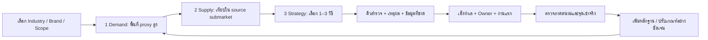
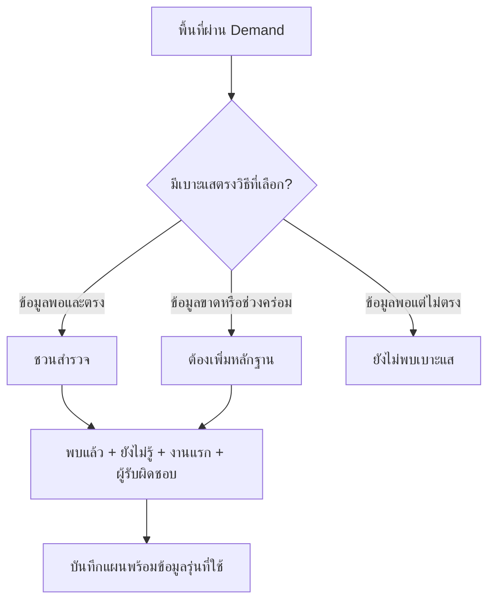
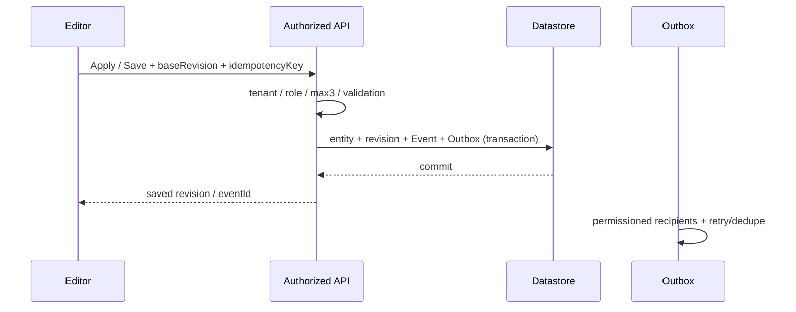

# CityMETER: Yolk — Product statement + implementation plan ฉบับเต็ม v1.9.0

อัปเดต 7 ตุลาคม 2026 · LDS 0.9.7 · 3 ธุรกิจ · 37 โปรไฟล์แบรนด์/นิติบุคคล

**หาไข่แดง → ดู Supply และการแข่งขัน → เลือกวิธีขยายตลาด → เล็งพร้อมแผนสำรวจ**

Yolk ช่วยตอบว่า “พื้นที่ไหนควรไปศึกษา ทำไม และต้องตรวจอะไรต่อ” เริ่มได้ด้วยข้อมูล CityMETER ที่มีอยู่ เพิ่มหลักฐานของทีมเมื่อพร้อม แล้วเก็บเหตุผลไว้กับทำเลนั้น การคัดผ่านยังเป็นสัญญาณจากข้อมูลบริบท ไม่ใช่การอนุมัติลงทุนหรือการรับประกันยอดขาย

เอกสารนี้เป็นจุดเริ่มพัฒนาจากศูนย์ รวม product, data, UX, schema, API, ลำดับงาน และตรวจรับไว้ในไฟล์เดียว ส่วน machine contract ฉบับเต็มอยู่ท้ายไฟล์และแยกเป็น [full-product.v1.9.0.json](contracts/full-product.v1.9.0.json) เพื่ออ่านด้วยเครื่องมือได้ง่าย

สถานะรุ่น 1.9.0: ตรวจ engine 39 ข้อ, Strategy UI 24 ข้อ และ Demand factor 12 ข้อ รวม preset 103 ชุดบนข้อมูล 7,954 พื้นที่แล้ว ตรวจหน้าจอจริงที่ 1440 × 1000 และ 390 × 844 ทั้งไทย/อังกฤษ สว่าง/มืด ดูขอบเขตผลตรวจที่ [QA รุ่นนี้](evidence/qa-v1.9.0.json) และดูหลักฐาน deployment/live bytes จาก GitHub Release ระบบกลางสำหรับหลายคนยังเป็นงานพัฒนาตามแผน

## 1. Product statement

| คำถาม | คำตอบ |
|---|---|
| **Who** | ทีม Expansion, Strategy, Brand และทีมสำรวจของกิจการหลายสาขา เริ่มจาก Fuel, Grocery และ Non-bank |
| **What** | คัดพื้นที่ Demand สูง เทียบผู้ให้บริการในตลาดที่เกี่ยวข้อง แล้วเลือก Strategy และงานสำรวจที่สอดคล้องกับแบรนด์ |
| **Why** | ลดการเตรียมข้อมูลซ้ำ เห็นเหตุผลกับข้อที่ยังไม่รู้ในหน้าเดียว ปรับเกณฑ์ได้ และย้อนดูได้ว่าใครตัดสินใจจากข้อมูลรุ่นไหน |
| **Which** | แข่งกับวิธีแก้ปัญหาเดิม: Google Maps/Street View + Excel/Google Sheets + locator แบรนด์ + ความรู้ภาคสนาม + LINE/email ซึ่งยังต้องประกอบเหตุผลและประวัติการทำงานเอง |
| **How** | เลือกธุรกิจ/แบรนด์/format → 1 Demand → 2 Supply/competition → 3 Strategy → เล็งทำเลพร้อมเหตุผล ผู้รับผิดชอบ และงานตรวจต่อ |
| **Success** | เวลาจนได้ shortlist ที่อธิบายได้ งานสำรวจที่มี owner และจำนวนข้อสรุปที่ต้องกลับคำหลังได้หลักฐานจริง ตั้งเป้าตัวเลขหลังมี baseline pilot |

ชื่อผลิตภัณฑ์ **CityMETER: Yolk** · “**Find the yolk. Grow your market.**” / “**หาไข่แดง ขยายตลาด**”

ผู้ใช้เริ่มได้ทันทีด้วย preset ที่มีข้อมูลจริง เกณฑ์ที่แนะนำเป็นสมมติฐานของ Yolk ผู้ใช้เห็น dataset, metric, สูตร, หน่วย, ช่วงข้อมูล และเปลี่ยน parameter ได้ เมื่อทีมเพิ่มหลักฐานจะได้คำตอบที่รอบคอบขึ้น เก็บเป้าหมายและงานสำรวจไว้ร่วมกัน และรับ trigger จากการแก้ข้อมูลที่เกี่ยวข้องในระบบ production

มาตรฐาน enterprise: **10 users = 1 Admin + 3 Editors + 6 Viewers** ใช้ชุดข้อมูล/context เดียวกัน การแก้เกณฑ์ต้อง Apply อย่างชัดเจน ไม่เปลี่ยนค่าของเพื่อนเพียงเพราะเลื่อน slider ส่วน preview สาธารณะเก็บงานใน browser นี้ ยังไม่ใช่ระบบ shared backend

## 2. ขอบเขต P0–P3 และสิ่งที่ต้องพัฒนาให้ใช้ร่วมทีม

P0–P3 หมายถึง **ความพร้อมของข้อมูลสำหรับวิเคราะห์** แยกจากการมีระบบกลาง auth/datastore/RBAC/outbox ซึ่งต้องพัฒนาและทดสอบก่อนใช้งานหลายคนจริง

| เฟส | ทำได้ / เพิ่มอะไร | สิ่งที่ยังไม่สรุป |
|---|---|---|
| **P0: ข้อมูล CityMETER ที่มี** | คัด Demand, เทียบ Supply ตาม source scope, คิว Strategy 01/03/05/07, แผนสำรวจของทั้ง 8 วิธี, map, shortlist และ snapshot เกณฑ์ | การเปิดจริง สินค้ารายสาขา การซื้อจริง segment gap คลัสเตอร์ดึงลูกค้า เส้นทางแวะซื้อและตลาดอนาคต |
| **P1: anchor + ภาคสนาม** | ตรวจแหล่ง CityMETER เพิ่มก่อนหาแหล่งภายนอก; เชื่อม POI โรงพยาบาล/โรงเรียน/กิจกรรมที่เกี่ยวข้อง ตรวจสิทธิ์/พิกัด/crosswalk; สินค้า ราคา เวลาเปิด กลุ่มลูกค้า โอกาสซื้อ จุดเช่า และ physical cluster | POI อยู่ใกล้กันยังไม่ยืนยันส่งลูกค้าให้กัน ต้องตรวจทางออก เวลา และการซื้อ |
| **P2: routes + future** | ถนนมีทิศทาง ข้อจำกัดเลี้ยว ทางเข้าออก daypart ผ่าน/แวะ/ซื้อ โครงการอนาคต milestone ต้นทุนรอและจุดหยุด | ถนนใหญ่ไม่ใช่ยอดแวะซื้อ โครงการประกาศไม่ใช่เปิดหรือมีคนเข้าอยู่แล้ว |
| **P3: ผลธุรกิจของแบรนด์** | POS/transaction/branch performance/capacity/cost และ customer occasions ตามสิทธิ์ เพื่อเทียบยอดเพิ่มสุทธิและผลต่อสาขาเราเดิม | ไม่ถือ public proxy เป็นผู้กู้ ความสามารถชำระ หรือผลตอบแทนลงทุนจริง |



### กติกา “ไม่เกิน 3”

- Demand: เลือกไม่เกิน **3 กลุ่มปัจจัย** เช่น คนอยู่อาศัย / แหล่งงาน / ที่พัก แต่ละกลุ่มมีไม่เกิน **3 metric ที่ต่างกัน** และแต่ละ AND path ไม่เกิน 3 เงื่อนไข
- Supply: เลือก mode หนึ่งแบบ ตัวหารดิบหนึ่งตัว และ role เรา/คู่แข่ง/ผู้ให้บริการที่ระบุได้ โดยค่าจุดเทียบยังปรับได้
- Strategy: เลือก **1–3 วิธี** พร้อมกัน พื้นที่หนึ่งมีเหตุผลหลายวิธีได้
- Ranking: มี 3 น้ำหนัก ได้แก่ Demand / ช่องว่างเรา / ช่องว่างคู่แข่ง น้ำหนักจัดลำดับ ไม่คัดพื้นที่เข้าออก

บังคับข้อจำกัดทั้ง client และ server ไม่มี hidden extra factors ค่า metric หลายหน่วยที่มาจากแหล่งเดียวกัน เช่น count กับ density ยังสัมพันธ์กัน ไม่ใช่หลักฐานอิสระสามชิ้น

## 3. ข้อมูลและภูมิศาสตร์ที่ใช้จริง

ฐานเทียบมี **7,954 reporting UUIDs** = กทม. 180 แขวง + ต่างจังหวัด 7,774 reporting อปท. เปอร์เซ็นไทล์ใช้พื้นที่ที่มีค่าที่ใช้ได้ทั่วประเทศของแต่ละ metric ไม่เปลี่ยนเมื่อกรองจังหวัด เลือกแบรนด์ หรือซูมแผนที่

ขอบเขตสีเพื่อดูข้อมูลและ crosswalk ของ geometry ใช้เพื่อแสดงผล ไม่รับรอง affiliation ตามกฎหมาย ชื่อพื้นที่หรือ bbox ไม่ใช้กระจายประชากร/สาขา ต้อง join ด้วย UUID และใช้ raw source area เป็นตัวหาร ไม่ใช้พื้นที่ polygon ที่ simplify แล้ว Locale Insight เป็น contextual prior ตามกติกาโครงการ ไม่ใช้แทน official population หรือหลักฐานพฤติกรรมจริง

| หลักฐาน | พื้นที่ที่มีค่า / 7,954 | ช่วงต้นทาง | อ่านว่าอะไร |
|---|---:|---|---|
| ประชากร | 7,830 | ส.ค. 2026 | บริบทคนตามพื้นที่ ไม่ใช่ลูกค้าหรือคนเดินทาง |
| GFA | 7,939 | V4; UI ต้นทางแสดง ธ.ค. 2024 | พื้นที่อาคารทุกชั้นจากแบบจำลอง ไม่ใช่ occupancy หรือพื้นที่ดิน |
| โรงงาน / คนงาน | 5,822 | ACTIVE เม.ย. 2025 | สถานะทะเบียนและคนงานที่รายงาน ไม่ยืนยันการผลิต/คนเข้างานวันนี้ |
| ห้องพักโรงแรม | 7,506 | ไม่เผย effective period | ความจุในรายการ ไม่ใช่ผู้เข้าพักหรือ occupancy |
| อาคารสำนักงาน | 45 | V3; UI แสดง พ.ค. 2025 | ครอบคลุมน้อย ใช้เป็น positive clue เมื่อมีค่า ไม่ตี missing เป็นไม่มีสำนักงาน |
| รายได้ อปท. | 7,751 | ปี 2024 | รายได้หน่วยงาน ไม่ใช่รายได้ครัวเรือนหรือกำลังซื้อ |

Supply aggregate และพิกัดเป็นคนละหลักฐาน: native **928 อำเภอ** ใช้ยอดที่ต้นทางรายงานโดยตรง ไม่รวมย้อนจาก fine areas ที่มี 45 display links หลายอำเภอ รายการจุด Fuel ที่บรรจุ 4,363 source features ไม่ใช่หลักฐานว่าครอบคลุมสถานีทั่วประเทศครบ Grocery มี 27,457 details เทียบ 27,458 aggregate; แยก PHARMACY 150 แถวและขาด detail เกาะเต่า 1 แถว Non-bank มี 23,524 office records, assigned 17,990, mapped 17,752, assignment residual 5,534; 5,772 คือ unmapped difference ทั้งหมด ไม่ใช้ชื่อเดียวกับ residual

### 25 metric ที่เลือกได้

ค่าที่ใช้ไม่ได้เป็น null/state ไม่เป็น 0 ตัวหารต้องบวก สูตรเต็มพร้อม source paths/AST อยู่ใน machine appendix

| metric ID | ความหมาย | หน่วย | สูตรย่อ | coverage | period |
|---|---|---|---|---:|---|
| `population` | ประชากรรวม | persons | `sum(ms)+sum(fs)` | 7830/7,954 | 2026-08 |
| `population_per_km2` | ความหนาแน่นประชากร | persons/km2 | `numerator / land_area_km2` | 7830/7,954 | 2026-08 |
| `working_age_15_64` | ประชากรอายุ 15–64 ปี | persons | `sum(ms[15:65])+sum(fs[15:65])` | 7830/7,954 | 2026-08 |
| `working_age_15_64_per_km2` | ความหนาแน่นประชากรอายุ 15–64 ปี | persons/km2 | `numerator / land_area_km2` | 7830/7,954 | 2026-08 |
| `adult_population_20_64` | ประชากรอายุ 20–64 ปี | persons | `sum(ms[20:65])+sum(fs[20:65])` | 7830/7,954 | 2026-08 |
| `adult_population_20_64_per_km2` | ความหนาแน่นประชากรอายุ 20–64 ปี | persons/km2 | `numerator / land_area_km2` | 7830/7,954 | 2026-08 |
| `children_0_14` | ประชากรอายุ 0–14 ปี | persons | `sum(ms[0:15])+sum(fs[0:15])` | 7830/7,954 | 2026-08 |
| `population_65_plus` | ประชากรอายุ 65 ปีขึ้นไป | persons | `sum(ms[65:])+sum(fs[65:])` | 7830/7,954 | 2026-08 |
| `gfa` | พื้นที่อาคารรวมประมาณ (GFA) | estimated m2 GFA | `area` | 7939/7,954 | V4 / published UI label 2024-12 |
| `building_count` | จำนวนรายการอาคารจากแบบจำลอง | modeled building records | `count` | 7939/7,954 | V4 / published UI label 2024-12 |
| `gfa_per_km2` | ความหนาแน่นพื้นที่อาคารรวมประมาณ | estimated m2 GFA/km2 | `numerator / land_area_km2` | 7939/7,954 | V4 / published UI label 2024-12 |
| `gfa_per_person` | พื้นที่อาคารรวมประมาณต่อประชากร | estimated m2 GFA/person | `building.area / (sum(population.ms)+sum(population.fs))` | 7828/7,954 | V4 / published UI label 2024-12 |
| `factory_count` | จำนวนโรงงานในทะเบียน ACTIVE | registered factory records | `totalFactory` | 5822/7,954 | 2025-04 ACTIVE |
| `factory_count_per_km2` | ความหนาแน่นโรงงานในทะเบียน ACTIVE | factory records/km2 | `numerator / land_area_km2` | 5822/7,954 | 2025-04 ACTIVE |
| `factory_workers` | คนงานโรงงานที่ต้นทางรายงาน | reported workers | `totalWorker` | 5822/7,954 | 2025-04 ACTIVE |
| `factory_workers_per_km2` | ความหนาแน่นคนงานโรงงานที่รายงาน | reported workers/km2 | `numerator / land_area_km2` | 5822/7,954 | 2025-04 ACTIVE |
| `hotel_count` | จำนวนรายการโรงแรม | catalog hotel records | `hotelCount` | 7506/7,954 | ไม่ระบุ |
| `hotel_rooms` | จำนวนห้องพักในรายการโรงแรม | catalog rooms | `roomCount` | 7506/7,954 | ไม่ระบุ |
| `hotel_rooms_per_km2` | ความหนาแน่นห้องพักในรายการ | catalog rooms/km2 | `numerator / land_area_km2` | 7506/7,954 | ไม่ระบุ |
| `office_count` | จำนวนรายการอาคารสำนักงาน | catalog office buildings | `officeCount` | 45/7,954 | V3 / published UI label 2025-05 |
| `office_count_per_km2` | ความหนาแน่นรายการอาคารสำนักงาน | catalog buildings/km2 | `numerator / land_area_km2` | 45/7,954 | V3 / published UI label 2025-05 |
| `fiscal_total_thb` | รายได้รวมของ อปท. ที่รายงาน | THB/year | `total * 1000000` | 7751/7,954 | 2024 |
| `fiscal_ex_grants_thb` | รายได้ อปท. ไม่รวมเงินอุดหนุน | THB/year | `(selfCollected+stateAllocated)*1000000` | 7751/7,954 | 2024 |
| `fiscal_ex_grants_per_km2` | รายได้ อปท. ไม่รวมเงินอุดหนุนต่อพื้นที่ | THB/km2/year | `numerator / land_area_km2` | 7751/7,954 | 2024 |
| `fiscal_ex_grants_per_person` | รายได้ อปท. ไม่รวมเงินอุดหนุนต่อประชากรอ้างอิง | THB/person/year | `(selfCollected+stateAllocated)*1000000 / fiscal.population` | 7717/7,954 | 2024 |

`land_area_km2 = raw_source_areaSqm / 1,000,000` · age slices ใช้ end-exclusive เช่น `20:65` คืออายุ 20–64 ปี · fiscal per person ใช้ `fiscal.population` ของช่วง fiscal ไม่เปลี่ยนเป็น population dataset โดยเงียบ

## 4. Industry, segment และ brand profiles

ใช้ลำดับ **Industry → segment/mission → brand → format/product scope → version** ผู้ใช้เลือกแบรนด์แล้วได้ preset ที่เหมาะกับรูปแบบสำคัญและข้อมูลที่รองรับ เปลี่ยน format ได้เมื่อแบรนด์มี source-supported format นั้น

โปรไฟล์มี offering, operator positioning, source links, research status, metric focus, default Strategy, per-scope criteria และข้อจำกัด ข้อความที่แบรนด์ประกาศเกี่ยวกับตัวเองเป็น operator claim ยังไม่ใช่ผลสำรวจ brand perception ลูกค้าจริง ค่า P/rate/weight เป็นสมมติฐานของ Yolk ไม่มีแบรนด์รับรองค่าตัวเลขเหล่านี้

| ธุรกิจ | เทียบ submarket วันนี้ | ช่องว่าง segment ที่ยังต้องเพิ่ม |
|---|---|---|
| Fuel | หมวด all_fuel ในต้นทาง | ชนิดเชื้อเพลิง LPG/น้ำมัน บริการ ความจุและ offering ที่แต่ละสถานีมีจริง |
| Grocery | format ต้นทาง C_STORE / SUPERMARKET / HYPERMARKET / WHOLESALE | สินค้า ราคา เวลาเปิด โอกาสซื้อ กลุ่มลูกค้า และช่องทางที่ตอบความต้องการจริง |
| Non-bank | กลุ่มใบอนุญาต active ระดับบริษัทที่เป็นไปได้ | หน้าที่สำนักงาน ผลิตภัณฑ์และการให้บริการรายสาขา; ไม่เดาความต้องการกู้จากประชากร |

ไม่รวมบริษัทคนละ legal ID เพียงเพราะชื่อกลุ่มหรือ marketing เหมือนกัน COSMO ยังมี current identity ที่ต้องตรวจ PURE/Caltex-PURE ต้องตรวจหน้าป้ายและ source identity ไม่รวมกับ Caltex อัตโนมัติ สินเชื่อระดับบริษัทไม่ยืนยัน offering ที่สำนักงานหนึ่ง

### 9 ครอบครัว preset

ค่าละเอียดของแต่ละ AND/OR path อยู่ใน [brand-strategy-profiles.v1.9.0.json](prototype/data/brand-strategy-profiles.v1.9.0.json) ไม่สร้าง default ซ้ำอีกชุดใน component

| family | source scope | factor families | max Tier | ตัวหาร Supply ตั้งต้น | ranking |
|---|---|---|---:|---|---|
| `fuel-common` | all_fuel | built_form, workplace, hospitality | 3 | gfa | weighted |
| `grocery-convenience` | C_STORE | residents, workplace | 3 | population | context |
| `grocery-community` | C_STORE | residents | 3 | population | context |
| `grocery-supermarket` | SUPERMARKET | residents | 3 | population | context |
| `grocery-hypermarket` | HYPERMARKET | residents | 3 | population | context |
| `grocery-wholesale` | WHOLESALE | residents, hospitality | 3 | population | context |
| `grocery-visitor-context` | C_STORE | residents, hospitality | 3 | population | context |
| `nonbank-community` | potential_retail_branch_service | adults | 3 | population | context |
| `nonbank-concentrated` | potential_retail_branch_service | adults | 2 | population | context |

**Fuel 1.9 เป็นสมมติฐานใหม่อย่างชัดเจน:** built_form ใช้ GFA/GFAต่อคน/GFAต่อพื้นที่; workplace ใช้ factory_count/factory_workers/factory_workersต่อพื้นที่; hospitality ใช้ rooms/roomsต่อพื้นที่ แยกกลุ่มแล้วใช้ best confirmed tier ไม่ใช่ activity 6 ข้อโหวต 5/3/1 แบบเดิม การเปลี่ยนนี้อาจเปลี่ยน Tier และชุดพื้นที่ ต้องโชว์ diff เมื่อ Try preset และไม่แก้ saved criteria โดยอัตโนมัติ

ตัวอย่าง fuel paths: built_form Tier1 ทุกตัว≥P99, Tier2ทุกตัว≥P95, Tier3อย่างใดอย่างหนึ่ง≥P95; workplace Tier1ทั้ง3≥P95, Tier2คู่ใดคู่หนึ่ง≥P95, Tier3ตัวใดตัวหนึ่ง≥P95; hospitality Tier1rooms+density≥P95, Tier2ทั้งคู่≥P90, Tier3rooms≥P90 เหล่านี้เป็น starter hypotheses ที่ปรับได้

Grocery convenience เริ่ม residents(volume+density) กับ workplace(workers+density); supermarket เน้น residents ที่เข้มกว่า; hypermarket เน้น volume; wholesale เพิ่ม hotel capacity เป็นฐานผู้ประกอบการที่ชวนตรวจ Non-bank ใช้ adult population20–64volume+density เป็นบริบทพื้นที่ ไม่ใช่จำนวนผู้มีสิทธิ์กู้หรือความต้องการสินเชื่อ

### โปรไฟล์ที่เลือกได้ 37 ราย

ตัวเลข Strategy คือ default research methods; methods ที่ยังไม่มีข้อมูลจะแสดงข้อมูลที่ต้องเพิ่ม ไม่สร้างผลลัพธ์เทียม แหล่งหลักฐานปฐมภูมิและ rationales อยู่ใน runtime registry เดียวกัน

| Industry | ชื่อ | stable ID | default scope | segment | Strategy เริ่มต้น | สถานะวิจัย |
|---|---|---|---|---|---|---|
| fuel | PTT Station | `ptt` | all_fuel | mobility_destination | 06, 07, 05 | primary_operator_context_verified |
| fuel | เชลล์ | `shell` | all_fuel | fuel_quality_services | 03, 06, 05 | primary_operator_context_verified |
| fuel | บางจาก | `bangchak` | all_fuel | mobility_destination | 01, 07, 05 | primary_operator_context_verified |
| fuel | คาลเท็กซ์ | `caltex` | all_fuel | fuel_fleet_services | 06, 07, 03 | primary_operator_context_verified |
| fuel | COSMO | `cosmo` | all_fuel | fuel_identity_review | 01, 07 | current_identity_unresolved |
| fuel | PT | `pt` | all_fuel | mobility_destination | 07, 01, 05 | primary_operator_context_verified |
| fuel | PURE | `pure` | all_fuel | fuel_rebrand_review | 07, 01, 06 | primary_operator_context_verified |
| fuel | สยามแก๊ส | `siam-gas` | all_fuel | automotive_lpg | 01, 07, 06 | primary_operator_context_verified |
| fuel | ซัสโก้ | `susco` | all_fuel | fuel_multi_product | 01, 07, 06 | primary_operator_context_verified |
| fuel | ยูนิคแก๊ส | `unique-gas` | all_fuel | automotive_lpg | 01, 07, 06 | primary_operator_context_verified |
| fuel | เวิลด์แก๊ส | `world-gas` | all_fuel | automotive_lpg | 01, 07, 06 | primary_operator_context_verified |
| grocery | เซเว่น อีเลฟเว่น | `grocery-brand:SEVEN_ELEVEN` | C_STORE | everyday_convenience | 07, 05, 01 | primary_operator_context_verified |
| grocery | ถูกดี มีมาตรฐาน | `grocery-brand:TOOGDEE` | C_STORE | community_partner | 07, 01, 05 | primary_operator_context_verified |
| grocery | Lotus's | `grocery-brand:LOTUSS` | HYPERMARKET | multi_format_grocery | 01, 07, 05 | primary_operator_context_verified |
| grocery | ซีเจ มอร์ | `grocery-brand:CJ_MORE` | C_STORE | community_value | 01, 07, 05 | primary_operator_context_verified |
| grocery | บิ๊กซี | `grocery-brand:BIG_C` | HYPERMARKET | multi_format_grocery | 01, 07, 05 | primary_operator_context_verified |
| grocery | ท็อปส์ | `grocery-brand:TOPS` | SUPERMARKET | quality_grocery | 02, 05, 03 | primary_operator_context_verified |
| grocery | แม็คโคร | `grocery-brand:MAKRO` | WHOLESALE | food_operator_wholesale | 05, 01, 07 | primary_operator_context_verified |
| grocery | ลอว์สัน 108 | `grocery-brand:LAWSON108` | C_STORE | meal_convenience | 05, 02, 07 | historical_mission_needs_refresh |
| grocery | วิลล่า มาร์เก็ต | `grocery-brand:VILLA_MARKET` | SUPERMARKET | international_supermarket | 02, 05, 03 | primary_operator_context_verified |
| grocery | แม็กซ์แวลู | `grocery-brand:MAXVALU` | SUPERMARKET | fresh_daily_supermarket | 01, 07, 05 | primary_operator_context_verified |
| grocery | ฟู้ดแลนด์ | `grocery-brand:FOODLAND` | SUPERMARKET | extended_hours_supermarket | 02, 05, 03 | primary_operator_context_verified |
| grocery | กูร์เมต์ มาร์เก็ต | `grocery-brand:GOURMET_MARKET` | SUPERMARKET | international_supermarket | 02, 05, 03 | primary_operator_context_verified |
| grocery | โก โฮลเซลล์ | `grocery-brand:GO_WHOLESALE` | WHOLESALE | food_operator_wholesale | 05, 01, 07 | primary_operator_context_verified |
| grocery | ดอง ดอง ดองกิ | `grocery-brand:DONKI` | SUPERMARKET | japanese_specialty_supermarket | 02, 03, 05 | primary_operator_context_verified |
| grocery | ริมปิง | `grocery-brand:RIMPING` | SUPERMARKET | international_supermarket | 02, 05, 07 | primary_operator_context_verified |
| grocery | ยูเอฟเอ็ม ฟูจิ ซูเปอร์ | `grocery-brand:FUJI` | SUPERMARKET | japanese_specialty_supermarket | 02, 05, 07 | primary_operator_context_verified |
| nonbank | เมืองไทย แคปปิตอล | `legal:0107557000195` | potential_retail_branch_service | community_finance | 07, 01, 02 | primary_operator_context_verified |
| nonbank | ศรีสวัสดิ์ พาวเวอร์ 2014 | `legal:0105559126747` | office_context | finance_entity_review | 07, 01 | exact_legal_entity_offering_unresolved |
| nonbank | เงินไชโย · AutoX | `legal:0105564161598` | vehicle_title | vehicle_title_finance | 07, 01, 03 | primary_operator_context_verified |
| nonbank | เงินติดล้อ | `legal:0107563000355` | vehicle_title | vehicle_title_insurance | 03, 07, 02 | primary_operator_context_verified |
| nonbank | ศักดิ์สยาม | `legal:0107559000290` | vehicle_title | community_finance | 01, 07, 02 | primary_operator_context_verified |
| nonbank | เงินเทอร์โบ | `legal:0107566000542` | vehicle_title | community_finance | 01, 07, 02 | primary_operator_context_verified |
| nonbank | เฮงลิสซิ่ง | `legal:0107564000120` | potential_retail_branch_service | mixed_vehicle_personal_finance | 07, 01, 02 | primary_operator_context_verified |
| nonbank | นิ่มลีสซิ่ง | `legal:0505560008015` | potential_retail_branch_service | community_finance | 07, 01, 02 | primary_operator_context_verified |
| nonbank | กรุงศรี ออโต้ · อยุธยา แคปปิตอล ออโต้ ลีส | `legal:0107538000690` | vehicle_title | motorcycle_finance | 05, 03, 07 | primary_operator_context_verified |
| nonbank | ยูโอบี แคปปิตอล เซอร์วิสเซส | `legal:0105528033194` | personal | personal_finance | 02, 07, 03 | primary_operator_context_verified |

## 5. Demand: คัดพื้นที่ไข่แดง

ทุก condition ใช้ **ค่า metric จริงเทียบ cutoff** จาก fixed national distribution ไม่ใช้ percentile score เป็นตลาดขนาดจริง

```text
within_path = every condition passes                 # AND, ≤3
factor_tier = best confirmed tier of enabled paths   # OR
qualifying_tier = minimum numbered confirmed tier
eligible = demand is true AND tier in {1,2,3} AND tier <= maxDemandTier
```

condition ที่ไม่มีค่าหรือ cutoff ใช้ unknown; ถ้าอีก condition เป็น false path นั้น false; unknown ที่เหลือยังไม่ใช่ confirmed ค่า positive_presence ต้องมากกว่า 0 แม้ percentile cutoff เท่ากับ 0 ตัวอ่าน rank-midrank เพื่อแสดงอันดับกับ percentile INC cutoff เป็นคนละการคำนวณ ต้องไม่ใช้แทนกัน

- Tier1 **ไข่แดงเข้ม / Deep yolk**: proxy Demand สูงมาก
- Tier2 **ไข่แดง / Yolk**: proxy Demand สูง
- Tier3 **ไข่ขาว / Egg white**: proxy Demand ค่อนข้างสูง

การคัดทั้งหมดนี้ไม่ได้วัดลูกค้า traffic ยอดซื้อ หรือผู้กู้จริง Supply/weights/Strategy เปลี่ยนผลด้าน Supply หรือลำดับ/มุมมองได้ แต่ไม่เปลี่ยน Demand, Tier หรือ eligible IDs

## 6. Supply และการแข่งขัน

ใช้ **สาขาเทียบฐานตลาด** เป็นค่าเริ่มต้น โหมดจำนวนสาขายังเลือกได้ ตัวหารเป็น raw extensive metric ตัวเดียวและแสดงหน่วยเสมอ

```text
rate = count / positive_raw_denominator * normalization_unit
fuel default: branches / 100,000 estimated m² GFA
grocery/nonbank default: branches / 10,000 persons
count_equivalent_reference = rate_reference * denominator / normalization_unit
```

จุดเทียบเริ่มต้นใช้ median ของอัตราบวกที่ exact และข้อมูลครบทั่วประเทศ ต่อ role แยกกันเมื่อ N≥5; interval และ unknown U ไม่เข้าตัวอย่าง ถ้าไม่พอใช้ fallback1/unit พร้อมป้าย exploratory ไม่ reseed ขณะลาก slider หรือเปลี่ยนเมนู

เลขน้อยกว่าจุดเทียบเป็น Low ตั้งแต่จุดเทียบขึ้นไปเป็น High จุดเทียบเป็นสมมติฐาน ไม่ใช่ capacity การเลื่อนขวาเพิ่มจุดเทียบ ไม่ได้สร้างสาขาหรือ Demand ใหม่ ตัวหาร missing/0/negative ใช้ unresolved ไม่ infinity หรือ 0

เก็บช่วง own/competitor และ unknown แยกกัน สำหรับ U ที่รอรู้แบรนด์: own_upper=own_base_upper+U, rival_upper=rival_base_upper+U แต่ total_upper=own_base_upper+rival_base_upper+U **บวก U ครั้งเดียว** Non-bank residual เป็น possible assignment bounds ไม่ใช่การกระจายสาขาจริงซ้ำลงทุกพื้นที่ ถ้า `boundsKnown=false` ห้ามเรียก upper bound ว่า exact

สัญลักษณ์ **โล่ = เรา, ดาบ = คู่แข่ง** มี caption/ตัวเลข/หน่วยและ bars เทียบในทำเลเดียวกัน ด้วย local extent เดียวกัน ส่วน POI ใช้โลโก้จริง square graphic ชื่อแบรนด์และ party badge ไม่ทำกรอบตกแต่งโลโก้ Unknown-brand ไม่เท่ากับ verified unbranded

### Ranking เป็นอีกชั้นหนึ่ง

```text
gap(N,T) = 100 / (1 + N/T)
weightedRank = (Wd*Demand + Wo*OwnGap + Wc*CompetitorGap) / (Wd+Wo+Wc)
```

น้ำหนักไม่ติดลบและรวม>0 ใช้ได้ไม่เกิน3ตัว Fuel starter70/20/10; Grocery/Non-bank starter context order (Tier/path strength) น้ำหนัก Supply ไม่มีผลต่อ context comparator จึงต้องบอก mode ปัจจุบัน ส่วน Strategy order ใช้สูตรคิวของแต่ละวิธีแยกต่างหาก ไม่เอา competitorGap ที่ชอบคู่แข่งน้อยไปเรียกว่าศักยภาพชิงลูกค้า

## 7. Strategy: เลือกวิธีขยายตลาดและงานสำรวจ

**ไข่แดงบอกว่าที่ไหนมี Demand เข้มข้น ส่วน Strategy บอกว่าจะเข้าถึงลูกค้าด้วยวิธีไหน** เลือกได้ครั้งละ 1–3 วิธี พื้นที่เดียวอาจมีเบาะแสตรงหลายวิธี แต่แต่ละวิธีต้องมีหลักฐานของตัวเอง

8 วิธีนี้เป็นแนวทางขยายตลาดชุดใหม่ แยกจากชื่อรูปแบบเดิมอย่าง Crowded, FOMO และ Pioneer ไม่ใช้ดาวหรือรูปแบบเดิมเป็นเงื่อนไขคัดไข่แดง

| วิธีขยายตลาด | สัญลักษณ์ช่วยจำ | เบาะแสที่ใช้วันนี้ | งานที่ต้องตรวจต่อ |
|---|---|---|---|
| **01 เติมช่องว่างตลาด** · Underserved market | เข็มทิศ · หาโอกาสที่ยังไม่ถูกเติม | **P0:** สาขารวมยังน้อยเมื่อเทียบจุดอ้างอิงของตลาด แม้นับจำนวนที่อาจเพิ่มจากรายการรอตรวจแล้ว | มีผู้ให้บริการตกหล่นไหม? ลูกค้ายังขาดบริการอะไร เวลาและทางเข้าออกเป็นอย่างไร? |
| **02 เติมช่องว่างกลุ่มลูกค้า** · Segment gap | กลุ่มคน · หาโจทย์ลูกค้าที่ยังไม่มีใครตอบ | **P1:** ต้องเพิ่มข้อมูลกลุ่มลูกค้าและข้อเสนอของแต่ละสาขาก่อน | ใครมีความต้องการที่ยังไม่ได้รับการตอบ? สินค้า ราคา เวลาเปิด และการเข้าถึงต่างกันอย่างไร? |
| **03 ชิงลูกค้าจากคู่แข่ง** · Competitive entry | ดาบ · ตรวจโอกาสแข่งขัน | **P0:** พบคู่แข่งในขอบเขตตลาดเดียวกัน จึงมีตลาดให้ศึกษาการแข่งขัน | ลูกค้าจะเปลี่ยนมาใช้เราเพราะอะไร? ข้อได้เปรียบของแบรนด์เกิดขึ้นจริงที่สาขานี้ไหม? |
| **04 เข้าร่วมย่านที่ดึงลูกค้า** · Cluster participation | ร้านค้า · เป็นส่วนหนึ่งของย่าน | **P1:** ต้องตรวจว่าร้านใกล้กันช่วยดึงลูกค้าหรือเกิดการแวะหลายร้านจริง | ลูกค้ามาเพื่อเปรียบเทียบหรือซื้อร่วมกันไหม? ประโยชน์คุ้มค่าเช่าและการแข่งขันหรือไม่? |
| **05 เกาะกิจกรรมที่ส่งลูกค้าให้กัน** · Complementary location | ชั้นกิจกรรม · มองหาแหล่งส่งลูกค้า | **P0:** พบโรงงาน คนงาน หรือห้องพักโรงแรมที่เกี่ยวข้องกับแบรนด์ อยู่ในกลุ่มบน 5% ของประเทศ | แหล่งกิจกรรมอยู่ตรงไหน? คนออกทางไหน เวลาใด และแวะซื้อจริงไหม? |
| **06 รับลูกค้าบนเส้นทาง** · Route capture | ลูกศร · มองเส้นทางผ่านและแวะ | **P2:** ต้องเพิ่มถนนที่มีทิศทาง จุดเข้าออก และข้อมูลการแวะ | รถผ่านเข้าถึงได้ไหม? เลี้ยวหรือกลับรถอย่างไร? ผ่านแล้วแวะซื้อช่วงไหน? |
| **07 เติมเครือข่ายของเรา** · Network infill | โล่ · ขยายพื้นที่ที่เราให้บริการ | **P0:** สาขาเรายังน้อยเมื่อเทียบจุดอ้างอิงของตลาด แม้นับจำนวนที่อาจเพิ่มจากรายการรอตรวจแล้ว | สาขาใหม่ช่วยลดช่องว่างการเดินทางไหม? สาขาเดิมรับเพิ่มได้หรือจะเสียลูกค้าให้สาขาใหม่? |
| **08 เปิดก่อนเพื่อได้พื้นที่ก่อน** · Future entry | ธง · จับจังหวะตลาดอนาคต | **P2:** ต้องมีโครงการจริง ความคืบหน้า และเงื่อนไขถือพื้นที่ แยกเป็นรายการติดตามอนาคต | เมื่อไรจึงจะมีลูกค้า? ต้องรอนานและมีต้นทุนเท่าไร? อะไรคือสัญญาณให้เดินหน้าหรือหยุด? |

**P0 ช่วยสร้างคิวไปสำรวจสำหรับ 01, 03, 05 และ 07 ได้ทันที** ผล “ชวนสำรวจ” ยังไม่ยืนยันว่าควรเปิดสาขา ข้อมูลไม่พอหรือช่วงจำนวนคร่อมจุดอ้างอิงจะแสดงว่า “ต้องเพิ่มหลักฐาน” ไม่ตีความเป็นสาขาน้อย

วิธี 05 ใช้กิจกรรมระดับพื้นที่ที่แบรนด์ระบุว่ามีความเกี่ยวข้อง และมีค่าจริงมากกว่า 0 ตัววัดโรงงาน คนงาน และห้องพักโรงแรมเป็นเบาะแสตั้งต้น ยังไม่ใช่หลักฐานว่าอยู่ใกล้จุดเช่า หรือส่งลูกค้าให้ร้านจริง ข้อมูลโรงพยาบาลและโรงเรียนต้องตรวจแหล่ง CityMETER และเชื่อมพิกัดใน P1; ประชากรอย่างเดียวไม่ใช่แหล่งส่งลูกค้า โรงแรมที่ไม่ระบุช่วงข้อมูลให้แสดง “ไม่ระบุ” ไม่ใช้วันที่ดาวน์โหลดแทน

วิธี 02, 04, 06 และ 08 มีคำถามสำรวจให้เริ่มงาน แต่ยังไม่มีข้อมูลพอคัดพื้นที่ด้วยวิธีนั้นใน P0 ระบบไม่สร้างคะแนนขึ้นเอง Future entry จะมีรายการติดตามแยกในเฟสถัดไป และไม่เพิ่มจำนวนไข่แดงปัจจุบัน



### หนึ่งทำเลต้องตอบได้ 4 ข้อ

1. **พบแล้ว:** ค่า หน่วย ช่วงข้อมูล แหล่งที่มา และขอบเขตที่ใช้
2. **วิธีที่ชวนตรวจ:** จะเข้าถึงลูกค้าด้วยวิธีไหน และมีเบาะแสอะไร
3. **ยังไม่รู้:** ข้อใดที่ถ้าได้คำตอบอีกทางแล้วอาจเปลี่ยนการเลือก
4. **งานแรก:** ใครจะไปตรวจอะไร และต้องบันทึกหลักฐานใดกลับมา

แยกจำนวน **ผ่าน Demand / ชวนสำรวจตาม Strategy / เล็งไว้** ให้ชัด จำนวนผลค้นหาตาม Strategy ไม่ใช่จำนวนไข่แดง แผนที่และรายการนับตามขอบเขตที่เลือก

คิวสำรวจเรียงจากจำนวนวิธีที่มีเบาะแสมากกว่า → ระดับ Demand → ลำดับวิธีที่ผู้ใช้เลือก → ค่าที่พบภายในวิธีเดียวกัน → ID ทำเลเพื่อให้ลำดับคงที่ ไม่เทียบค่าคนละหน่วยข้ามวิธี และไม่เรียกอันดับนี้ว่าคะแนนยอดขายหรือความมั่นใจ สูตรและสถานะที่เครื่องใช้ดูใน machine appendix

### ตัวอย่าง: คานหาม

บริบท Grocery / 7-Eleven / ร้านสะดวกซื้อ มีประชากรต้นทาง **6,338 คน** (ส.ค. 2026) และคนงานโรงงานที่รายงาน **49,339 คน** (ทะเบียน ACTIVE เม.ย. 2025) บัญชีร้านรูปแบบเดียวกันที่ต้นทางผูกกับพื้นที่มีสาขาเรา **7** และคู่แข่ง **5**

แหล่งงานใหญ่ชวนตรวจวิธี 05: คนทำงานกะไหน ออกทางไหน และซื้ออะไรช่วงใด ส่วนวิธี 02 ยังต้องตรวจสินค้ารายสาขาและโอกาสซื้อของลูกค้า จึงยังยืนยัน segment gap ไม่ได้ จำนวนสาขาก็ยังไม่รับรองการเปิดจริงหรือความสามารถให้บริการ

ID สำหรับตรวจซ้ำ: `13825155-7532-4b74-b89a-5127ed5f8864`

## 8. Map และ UX: ปรับแล้วเห็นผลทันที

**ใช้แผนที่เดียวค้างทุกเมนู** ผู้ใช้ปรับ Demand, Supply หรือ Strategy แล้วเห็นผลในพื้นที่เดิม เปลี่ยนภาษา ธีม หรือเมนูแล้วไม่ซูมใหม่เอง ซูมและจัดกรอบเมื่อผู้ใช้เลือกพื้นที่ กดกลับ กด Fit หรือแตะกลุ่มจุดเท่านั้น

| ระดับที่ดู | ลงสีตามขอบเขต | คลิกและไฮไลต์ตามขอบเขต |
|---|---|---|
| ทั้งประเทศ | อำเภอ | จังหวัด |
| จังหวัด | แขวง / อปท. | อำเภอ |
| อำเภอ | แขวง / อปท. | แขวง / อปท. |
| ทำเล | ภายในโปร่ง เห็นแผนที่พื้นหลังและจุดสาขา | ทำเลที่เลือกและจุดสำคัญ |

### อ่านสีไข่ดาวและเส้นขอบ

- **ไข่แดงเข้ม:** Tier 1 · Demand สูงมาก ใช้ gradient เหลืองส้มจาก DS
- **ไข่แดง:** Tier 2 · Demand สูง ใช้เหลือง Yolk
- **ไข่ขาว:** Tier 3 · Demand ค่อนข้างสูง ใช้สีไข่ขาว
- เส้นขอบปกติเป็นสีขาว ขอบเขตใหญ่หนากว่าขอบเขตย่อยเล็กน้อย เพื่อเห็นระดับพื้นที่
- เมื่อชี้เมาส์ ใช้กรอบเหลือง Yolk เน้น **ขอบเขตที่จะคลิกได้** ภายในทำเลที่เลือกยังโปร่ง ไม่ปิดถนนและชื่อสถานที่

ทั้งสองธีมใช้สีข้อมูลชุดเดียวกัน Tier 1 ใช้สีเดิมจาก `density.area` ช่วง LUT 20–40, Tier 2 ใช้ `#FFBC1F` และ Tier 3 ใช้ `#F1F4EF` Gradient ภายใน Tier 1 ไม่ได้แสดงว่าจุดใดมี Demand มากกว่า สีตัวเลขอื่นใช้ 41 ช่วงตาม DS และหน่วยจริง ไม่กลับสีหรือปรับความทึบจนสีข้อมูลเปลี่ยน แยกค่าศูนย์ ข้อมูลขาด ข้อมูลปิดบัง และข้อมูลที่ยังไม่พร้อมด้วยข้อความและสัญลักษณ์ด้วย

### แผนที่แต่ละมุมมองตอบคนละคำถาม

**Demand:** ไข่แดงอยู่ที่ไหน? ดูระดับและตัววัดที่ผ่านเกณฑ์ พร้อมปุ่มเล็งทำเล

**Supply:** ใครให้บริการอยู่แล้ว และมีมากแค่ไหนเมื่อเทียบฐานตลาด? เริ่มด้วย choropleth เลือกดูสาขาเรา คู่แข่ง หรือรวม และเปลี่ยนเป็นจุดสาขาได้ทุกระดับ ใช้โล่แทนเรา ดาบแทนคู่แข่ง พร้อมชื่อ จำนวน และหน่วย พิกัด POI มีโลโก้แบรนด์เมื่อมีไฟล์ที่ตรวจแล้ว

**Strategy:** พื้นที่ไหนมีเบาะแสตรงวิธีขยายที่เลือก? คงสีไข่ดาวของ Demand แล้วแสดงพื้นที่ที่มีเบาะแสตรงวิธีนั้น พื้นที่โปร่งจึงหมายถึง “ยังไม่ตรงหรือข้อมูลไม่พอในมุมมองนี้” ไม่ได้แปลว่า Demand ต่ำ เปิดทำเลเพื่ออ่าน **พบแล้ว / ยังไม่รู้ / งานแรก** และเล็งพร้อมแผนสำรวจ

**จุดสาขาจำนวนมาก:** รวมจุดที่ใกล้กันบนหน้าจอ พร้อมแยกเรา คู่แข่ง และรอตรวจ เก็บรายการสมาชิกทั้งหมด ไม่ทิ้งจุดเพียงเพราะเกินจำนวนที่วาดได้ เมื่อซูมสุดหรือพิกัดซ้อนกันให้เปิดรายการและชวนกรองต่อ การรวมจุดบนหน้าจอช่วยอ่านแผนที่เท่านั้น ไม่ใช่หลักฐานว่าเป็นย่านที่ส่งลูกค้าให้กันตามวิธี 04

Basemap เลือกได้ **เรียบง่าย / ภาพถ่ายดาวเทียม / รายละเอียด** มีเครดิตและที่มา แผนที่ที่แสดงไม่รับรองขอบเขตทางกฎหมาย พิกัดที่ยังไม่ผูกพื้นที่ไม่เปลี่ยนยอด Supply ของพื้นที่เพียงเพราะมองเห็นบนแผนที่

### ใช้ได้ทั้งมือถือและจอใหญ่

ออกแบบ mobile-first แต่บน desktop ให้แผนที่ใหญ่และยังเห็นขณะปรับค่า ใช้ slider ควบคู่ช่องตัวเลขสำหรับค่าที่ต้องปรับละเอียด เมนูและคำอธิบายไม่เบียดแผนที่จนหลงบริบท

ตรวจข้อความจริงทั้งไทยและอังกฤษที่ 390 และ 1440 พิกเซล ใน light/dark รวมชื่อแบรนด์ยาว หัวข้อ legend และฟอร์ม ใช้ icon จาก DS ที่จุดต้องเลือกหรือตัดสินใจ พร้อม caption เสมอ Hover ขีดเส้นใต้เฉพาะข้อความ ไม่ขีด icon และรักษากรอบ keyboard focus


เมื่อความกว้างจอเปลี่ยนมากหรือข้าม breakpoint ให้ fit ขอบเขตเดิมใหม่ ส่วนการเปลี่ยนความสูง/เมนู/เกณฑ์คงกล้องไว้ ถ้ากำลังเปิด popup ให้รักษาตำแหน่งหมุดนั้นก่อน

## 9. CRUD, evidence และ collaboration

**ทำเลที่เล็งไว้:** reportingUUID+fullcontext, owner/status/notes/custom fields และ immutableStrategyAssessment snapshot เก็บcriteriaเต็ม, privateDraftหรือacceptedrevision, source/benchmark/profile/engine/strategyversions, findings/missing/nextaction, actor/time เมื่อบันทึกตรงจากdraftต้องเห็นสถานะนั้น ไม่ทำเหมือนทีมApplyแล้ว

**สาขา:** immutable source recordแยกteamoverlay ใช้canonicalbrandID/manualsavedgeographyก่อนcoordinatehint กรองdropdownจังหวัด/พื้นที่ที่เกี่ยวข้อง; unique strict-interior displaymatchเสนอในdraftได้ ถ้าคาบเส้นหรือหลายcandidateให้เลือก ไม่รับรองlegalboundaryหรือย้ายaggregateSupply รูปสาขาได้5รูป previewใช้mock/บันทึกในbrowser; productionprivate mediaใช้validation/signedreadตามสิทธิ์

**จุดเช่า P1:** หลายCandidateSiteต่อareaได้ เก็บentrance/access/rent/date/size/availability/owner ห้ามใส่เป็นbranchแล้วเพิ่มSupply

**กิจกรรม:** Successfulsharedmutationมีactor/time/before-after/context/entityfeedหนึ่งEvent+Outboxหนึ่งtransaction criteriafeedเฉพาะcontext, detailfeedเฉพาะarea/branch, globalfeedตามสิทธิ์ Deliveryemail/LINEหลังcommitและdedupe; Map/personalStrategy/draft/themeไม่ใช่teamaction Leaderboardนับsuccessfulactionsไม่ซ้ำหรือsampleactions



## 10. Architecture และ schema สำหรับ production

T00ต้องตรวจstackจริงCityMETERก่อนเลือกframework/datastore ใช้sourceadapter→safeMetricAST/Benchmark→versionedprofiles→pureDemandSupplyRank→pureOpportunity→CalculationService→ContextRevision/CRUD/Evidence/Media→EventOutbox ห้ามportglobalbrowserตัวเดียวเป็นserverstateแชร์ทุกtenant

Fullcontext key: `workspaceId + industryId + ownEntityId + supplyScope + profileVersion` formatId/productIdต้องมีmappingชัด ผลคำนวณเพิ่มsourceReleaseId/benchmarkReleaseId/criteriaHash/engineVersion StrategyAssessmentเพิ่มstrategyContractVersion Snapshotเก่าไม่เขียนทับเมื่อprofile/sourceเปลี่ยน

| Entity | ข้อมูลสำคัญ | invariant |
|---|---|---|
| Workspace/Membership | tenant, user, role, active status | serverRBAC/seat10/lastadmin |
| SourceRelease/Area/Crosswalk | hash/period/rights/UUID/grain/geometryVersion | immutable; displaynotstatutory |
| Metric/SupplyObservation | value/state/unit/source/grain/format/license | missing≠zero; native≠finesum |
| Industry/Segment/BrandProfile | offering/operatorclaim/sources/status/per-scopepreset/version | facts/inference/perceptionunknownแยก |
| CriteriaScope/Revision/Draft | fullcontext/baseRevision/hash/criteriaJson | acceptedimmutable; privateDraftไม่event |
| Target/StrategyAssessment | area/owner/status/criteria-sourceversions/evidence/nextaction | uniquecontext+area; snapshotsimmutable |
| Branch/Media | sourceidentity+overlay+coords/assignmentprovenance/privatephotos | CRUDไม่แก้aggregate; max5 |
| EvidenceRecord/FieldAction | question/value/unit/period/rights/state/owner/result | verifiedfactไม่ใช่approvedinvestment |
| CandidateSite/AnchorPOI | entrances/rent/date/coordinates/crosswalk/operations | P1; siteไม่เป็นSupplybranch |
| FutureProject | milestone/cost/trigger/owner | P2watchlistไม่promoteYolk |
| Event/Outbox/ShareGrant | actor/time/diff/recipients/status/expiry | transaction/dedupe/permissions |

Indexesอย่างน้อย: uniqueactiveTarget(workspace,scope,area), uniqueCriteriaScope(fullcontext), uniqueMembership(workspace,user), uniqueMutation(workspace,idempotencyKey), uniqueDelivery(eventId,recipient,channel), observation(sourceRelease,metric,UUID), actions(workspace,assessment,status) รายfieldsเต็มอยู่machineappendix

### API contract ที่เสนอ — ยังไม่ได้เกิดจาก static preview

```json
{
  "requestId": "req-unique",
  "workspaceId": "authorized-tenant",
  "context": {
    "industryId": "grocery",
    "ownEntityId": "grocery-brand:SEVEN_ELEVEN",
    "supplyScope": "C_STORE",
    "profileVersion": "1.9.0"
  },
  "sourceReleaseId": "immutable-release-id",
  "benchmarkReleaseId": "national-cohort-release-id",
  "criteriaHash": "server-derived-canonical-json-sha256",
  "criteria": {"maxDemandTier": 3, "demandFactors": "validated factor-path payload"},
  "strategyIds": ["network_infill", "complementary_location"],
  "baseRevision": 7,
  "idempotencyKey": "mutation-only-unique-key"
}
```

```json
{
  "requestId": "req-unique",
  "sourceReleaseId": "immutable-release-id",
  "benchmarkReleaseId": "national-cohort-release-id",
  "criteriaHash": "exact-request-hash",
  "engineVersion": "1.9.0",
  "counters": {"demandEligibleCount": "computed", "opportunityViewCount": "computed"},
  "rows": [{
    "areaId": "reporting-uuid",
    "demand": true,
    "qualifyingTier": 1,
    "eligible": true,
    "supply": {"ownLower": "known", "ownUpper": "known-or-bound"},
    "opportunity": {"status": "candidate_to_check", "assessments": "evidence+missing+nextAction"}
  }],
  "diagnostics": {"coverage": "by metric/state/grain", "errors": []}
}
```

ตัวอย่างschemaเป็นDTOtemplate ไม่ใช่ผลวัดหรือresponseที่deployแล้ว POSTpreviewไม่มีevent; Applyต้องbaseRevision/idempotencyและservervalidate; 409คืนdiffคงdraft; 422คืนstablecode+fieldpath; ผลasyncต้องmatchcontext/request/source/criteriaก่อนใช้

Productioncontractsต้องvalidate max3ที่nestedfactor/metrics/path/strategy และtypedcustomfields ไม่รับeval/arbitraryJS/SQL ภาพprivateไม่ใส่blob/signedURLลงfeed ใช้content sniff/decode/mime/dimension/cap/revisionและstripEXIFที่ไม่จำเป็น signedreadต้องtenant+role+entitypermission

P3transaction/customerdataใช้วัตถุประสงค์/สิทธิ์/retention/minimizationชัด เก็บข้อมูลรวมเท่าที่ตอบคำถามได้ ห้ามpersonaldata/privateexportsเข้าpublichandoff

## 11. Migration ที่ไม่ทำงานทีมเสีย

1. Pin source/profile/criteria/engineversions; upgradeprofileไม่เขียนทับacceptedrevision
2. เก็บoldpatternfields/historyไว้อ่านย้อนหลัง แต่ไม่คืนhiddenfilterหรือstarpriority
3. Fuelactivity6vote→factorpathsเป็นสมมติฐานใหม่ โชว์diffเมื่อTrypreset ไม่เรียกequivalentmigration
4. Seedbrand/scopeใหม่หรือexplicitTrypresetลงprivateDraftเท่านั้น Applyจึงเป็นsharedrevision/event
5. Snapshotstrategyเก่าเก็บcriteria/sourceversionเดิม เมื่อข้อมูลใหม่ให้สร้างassessmentใหม่
6. Openingpage/migration/personalviewไม่emitteamrevision/outbox; asyncrestoreไม่สลับรูป/note/criteriaข้ามcontext

## 12. Step-by-step implementation สำหรับ dev / intern

ทำทีละTตามdependencies ห้ามเริ่มด้วยการเปลี่ยนframeworkทั้งหมด Promptแต่ละงานต้องระบุinput/output/AC/tests ไม่ให้vibecodingเดาค่าที่ไม่มี ให้reviewhuman+machinecontractก่อนรันงาน และไม่ถือgeneratedcodeเป็นDone

ลำดับP0: T00→T01/T02→T03→T04/T05→T06/T07/T08/T09/T10→T11/T12/T13/T14→T15/T16/T17/T18/T19→T23→T24 P1=T20, P2=T21, P3=T22 ทำเมื่อหลักฐานพร้อม แผนproductionแยกจากsourcepreviewที่ทำแล้ว

### T00 · ตรวจ stack และ source ที่ทีมใช้จริง

เฟสข้อมูล **P0** · เริ่มหลัง: **ไม่มี** · สถานะ production: planned

**อ่าน/รับเข้า:** This full document; Current CityMETER source/auth/spatial/media/queue repositories; DS integration

**ส่งออก:** Stack map; rights/source inventory; exact runtime-to-production field map

1. Identify existing ownership, auth/tenant identifiers and storage boundaries.
2. Inventory source fields, periods, coverage, UUID grain, rights and missing states.
3. Map current runtime globals to typed services; retain immutable snapshots.

**ตรวจรับ:** No new framework/datastore chosen before stack mapping.; 25 metrics and fixed 7954 UUIDs accounted for; hospital/school adapters explicitly pending.

**ทดสอบ:** Source hash/catalog validation; Review source/permission registry

### T01 · ตั้ง shell ตาม LDS และ responsive map layout

เฟสข้อมูล **P0** · เริ่มหลัง: **T00** · สถานะ production: planned

**อ่าน/รับเข้า:** Verified LDS0.9.7 base/profile; Current routes and UI assets

**ส่งออก:** Accessible TH/EN light/dark shell; One persistent map host

1. Use existing fonts/logos/icons with verified role/hash.
2. Build mobile-first content panels; desktop map remains large and visible.
3. Keep visible keyboard focus, captions and theme surfaces; no motifs/logo frames/left rails.

**ตรวจรับ:** No map recreation on route change.; Rendered real Thai/English headings fit 390/1440px in both themes.

**ทดสอบ:** Font/logo network checks; Native visual review and keyboard navigation

### T02 · สร้าง workspace, auth, seats และ schema

เฟสข้อมูล **P0** · เริ่มหลัง: **T00, T01** · สถานะ production: planned

**อ่าน/รับเข้า:** Existing auth/datastore; Proposed entities/indexes/RBAC

**ส่งออก:** Tenant-scoped database schema; Server-enforced role/seat checks

1. Define full context tuple and tenant indexes.
2. Enforce 1 admin + 3 editors + 6 viewers, preserve last admin.
3. Authorize every API, storage read and share path; actor selectors are preview only.

**ตรวจรับ:** Cross-tenant IDs are inaccessible.; Viewer can preview privately but cannot mutate shared criteria/records.

**ทดสอบ:** Two-tenant attack fixtures; Seat concurrent writes; RBAC service/API tests

### T03 · นำเข้า snapshot และ geometry

เฟสข้อมูล **P0** · เริ่มหลัง: **T00, T02** · สถานะ production: planned

**อ่าน/รับเข้า:** Immutable source files; Source hashes/periods/rights; Display geometry/crosswalk

**ส่งออก:** SourceRelease/Area/MetricObservation/SupplyObservation stores; Explicit many-to-many display crosswalk

1. Import rows by exact source UUID, preserving raw states.
2. Keep native928district inventory independent from fine-area totals.
3. Keep source area denominator separate from simplified display geometry.
4. Validate geometry and state missing geometry as unfilled extent, not a fabricated polygon.

**ตรวจรับ:** No name-only joins or allocation of residuals.; 45 multi-district display links do not duplicate national/province fine UUID counts.

**ทดสอบ:** Hash and row uniqueness; Geometry/crosswalk counts; Native-vs-fine reconciliation fixtures

### T04 · ทำ metric registry และ safe formula evaluator

เฟสข้อมูล **P0** · เริ่มหลัง: **T03** · สถานะ production: planned

**อ่าน/รับเข้า:** 25 metric definitions/formula AST; Allowed source fields

**ส่งออก:** Typed registry; Safe arithmetic evaluator with provenance

1. Implement only allowlisted fields/operations, selectors and age slices.
2. Require positive extensive denominators; preserve no_data/zero/not_applicable/suppressed.
3. Attach unit/source period/measurement and lineage to each result.

**ตรวจรับ:** No eval, arbitrary JS or request-provided SQL.; GFA per person uses population dataset; fiscal per person uses fiscal.population.

**ทดสอบ:** AST allowlist/injection rejection; Zero/missing denominator; Age20:65 slice endpoints

### T05 · ตรึง benchmark ทั่วประเทศ

เฟสข้อมูล **P0** · เริ่มหลัง: **T04** · สถานะ production: planned

**อ่าน/รับเข้า:** Fixed7954UUID source release; Known values per metric

**ส่งออก:** Immutable national distributions; Benchmark release/hash/cohort

1. Build each metric distribution from valid comparable values including observed zero.
2. Use declared INC percentile cutoff; maintain rank-midrank as a distinct display statistic.
3. Do not recalculate benchmark by selected province, brand or map viewport.

**ตรวจรับ:** Zoom/brand/province filters leave benchmark hashes/cutoffs unchanged.; Missing observations do not enter denominator or become zero.

**ทดสอบ:** INC/ties fixtures; Known-zero fixture; Cohort isolation

### T06 · ทำ Industry→Segment→Brand→Scope profiles

เฟสข้อมูล **P0** · เริ่มหลัง: **T00, T04, T05** · สถานะ production: planned

**อ่าน/รับเข้า:** 37-brand researched registry; 9 preset families; Current source format/license scopes

**ส่งออก:** Versioned IndustryProfile/SegmentProfile/BrandProfile registry; Per-scope starter criteria

1. Separate official offering/positioning, Yolk inference and unresolved consumer perception.
2. Bind grocery important/source-supported default format, preserving alternatives.
3. Keep only10selectableNonbankcompanies but compare the full compatible source inventory.
4. Treat COSMO/current identity, PURE rebrand and legal-company/office capability as explicit verification topics.
5. Seed only unseen context or explicit Try preset; saved draft/revision wins.

**ตรวจรับ:** No company/group marketing auto-merges distinct IDs.; Numeric presets are labeled Yolk hypotheses, not operator-endorsed thresholds.

**ทดสอบ:** 37 bindings/9 families validation; Official source links and profile status; Context restore and brand switch tests

### T07 · คำนวณ Demand ด้วย factor paths จำกัด 3

เฟสข้อมูล **P0** · เริ่มหลัง: **T04, T05, T06** · สถานะ production: planned

**อ่าน/รับเข้า:** Brand per-scope factorPresets/criteriaOverrides; National benchmark

**ส่งออก:** Pure Demand/Tier engine; Maximum-three factor validators

1. Allow at most3enabledfactor families and at most3distinct metrics within each.
2. AND within path; OR across alternative paths; choose best confirmed tier.
3. Require known positive value when positive_presence is enabled.
4. Retain interval/unknown possibility separately from confirmed result.
5. Declare new fuel path hypothesis explicitly; do not equate it with historical6-activity5/3/1 votes.

**ตรวจรับ:** eligible = demand===true AND Tier1..3 AND tier<=maxDemandTier.; Unknown does not qualify; disabled factors do not affect result; a fourth factor/metric is rejected server-side.

**ทดสอบ:** Pure fixture per family; No-data path logic; Max3 enforcement; Saved historical criteria migration

### T08 · ทำ Supply adapters และตัวหาร

เฟสข้อมูล **P0** · เริ่มหลัง: **T03, T06, T07** · สถานะ production: planned

**อ่าน/รับเข้า:** Native/fine source inventory; Selected source scope; Raw extensive denominator

**ส่งออก:** Own/competitor/unresolved bounds; Count/rate comparisons and exploratory references

1. Filter grocery by source format; Nonbank by declared company-license scope.
2. Preserve unknown brand, unknown operations and Nonbank assignment intervals.
3. Relative mode divides count by one selected positive raw market base; default fuelGFA100000m², Grocery/Nonbankpopulation10000persons.
4. Seed per-role national positive exact medians with N>=5; exclude intervals/nonzero-or-unknown U.
5. If boundsKnown=false, no upper-bound certainty is assumed.

**ตรวจรับ:** Missing denominator or assignment bounds remain unresolved.; Do not classify registered adult population as borrowers or all fuel stations as identical fuel offerings.

**ทดสอบ:** Joint-U/interval tests; Scope identity/licence fixtures; Relative median exclusion; Count/rate units

### T09 · แยก eligibility จาก ranking

เฟสข้อมูล **P0** · เริ่มหลัง: **T07, T08** · สถานะ production: planned

**อ่าน/รับเข้า:** Demand results; Supply gap references; At most3weights

**ส่งออก:** Stable context and weighted comparators; Rank bounds and coverage

1. Context ordering uses Demand tier/path strength; weighted ordering uses Demand/ownGap/competitorGap.
2. Use nonnegative weights, positive weight sum and retained gap100/(1+N/T).
3. Compute conservative bounds for valid joint uncertainty allocations.
4. Keep historical pattern fields inert and preserve history.

**ตรวจรับ:** Supply modes/references/weights change order only, never Demand/Tier/eligible IDs.; No negative-weight hack for competitive-entry or cluster strategy.

**ทดสอบ:** Membership invariants; Allzero weights rejection; Joint allocation admissibility; Deterministic ties

### T10 · เพิ่ม 8 Strategy เป็นชั้นคิวสำรวจ

เฟสข้อมูล **P0** · เริ่มหลัง: **T07, T08, T09** · สถานะ production: planned

**อ่าน/รับเข้า:** opportunity-strategies.v1.9.0.json; Evaluated rows; Brand/scope profile

**ส่งออก:** Pure OpportunityEngine; Separate candidate/incomplete/unsupported queues

1. Call assess/view after Demand evaluation.
2. Limit selected strategies to3; current market candidates require confirmed eligible Demand.
3. Implement supported cue rules1/3/5/7 with bounds and relevant actual area metrics.
4. Show2/4/6/8missing-data guides without artificial scores.
5. Return reasons/evidenceRefs/missingEvidence/nextAction and source/criteria/profile versions.

**ตรวจรับ:** Every candidate has an explicit first field task.; Future areas cannot enter current Yolk counts.; Population alone is not a Complementary anchor.

**ทดสอบ:** check-opportunity-strategies.cjs; Real national membership invariants; KhanHamworkers49339 example

### T11 · ทำ calculation API/worker และ cancellation

เฟสข้อมูล **P0** · เริ่มหลัง: **T02, T05, T07, T08, T09, T10** · สถานะ production: planned

**อ่าน/รับเข้า:** Request/response envelopes; Pure engines

**ส่งออก:** Calculation endpoints; Content-addressed cache; Latest-request guard

1. Send full context/source/benchmark/profile/criteria hash/requestId.
2. Compute in worker/service appropriate to real stack; reject stale context/route tickets.
3. Return added/removed IDs separately even when net count is unchanged.
4. Return validation state, not stale results, for invalid input.

**ตรวจรับ:** Race brand/route/source changes cannot publish old result.; Preview does not create shared events.

**ทดสอบ:** Deferred reversed responses; Same-countdifferentIDs; Cache version invalidation

### T12 · ทำ persistent maps และ POIทุกdrilldown

เฟสข้อมูล **P0** · เริ่มหลัง: **T01, T03, T11** · สถานะ production: planned

**อ่าน/รับเข้า:** Map semantics/DS scales; Native district and fine geometry; Source coordinate adapters

**ส่งออก:** One map controller; Demand/Supply/Strategy layers; Supply optional point mode

1. Country paintdistrict/clickprovince; provincepaintfine/clickdistrict; districtpaintfine/clickfine.
2. Supplydefaultsregions; pointview optional country/province/district/fine withsamecamera.
3. Group screen coordinates with56pxgrid and1000markbudget; retain every record in cluster membership.
4. Keep selectedfine/point interiors transparent, relativewhiteboundary hierarchy and yellowclickablehover.
5. Reuse exact41LUTcolors; retain egg-tier recipe separately.

**ตรวจรับ:** Camera changes only explicit navigation/focus/fit/clusterclick.; Screen bins are not physical market-cluster evidence.; Source coordinates and native supply counts never conflated.

**ทดสอบ:** check-workspace-map.cjs; check-supply-poi-modes.cjs; Paint/click boundaries; Real light/dark narrow/desktop

### T13 · ทำ criteria drafts และ Apply แบบตรวจ diff

เฟสข้อมูล **P0** · เริ่มหลัง: **T02, T07, T08, T09, T11, T12** · สถานะ production: planned

**อ่าน/รับเข้า:** Scoped CriteriaRevision; Factor controls and defaults

**ส่งออก:** Private draft editor; Revision/event/outbox Apply transaction

1. Separate Demand, Supply and ranking controls; all numeric thresholds have slider+exact input.
2. Validate max3choices at UIandserver.
3. Apply withbaseRevision/idempotencykey and full diff; reject stale409whilepreservingdraft.
4. Try preset seeds private draft only; migration creates no team revision on load.

**ตรวจรับ:** No-op and retries emit at mostone event; fourthfactor/strategy rejected.; Saved criteria are not overwritten by registry update.

**ทดสอบ:** Concurrent editors/no-op/retry; Draft context isolation; Range+number/focus retention

### T14 · ทำ Strategy UI พร้อมแผนที่และคำอธิบาย

เฟสข้อมูล **P0** · เริ่มหลัง: **T06, T10, T11, T12, T13** · สถานะ production: planned

**อ่าน/รับเข้า:** Brand profiles; Opportunity outputs; Source/criteria versions

**ส่งออก:** Eight selectable strategy cards; Separate counters; Found/unknown/first-task results

1. Show1–3selectedstrategies and scope counts per method.
2. Keep mapDemandtiercolors only on candidateareas; nonmatchtransparent doesnot mean lowDemand.
3. Display observedvalues/units/periods; unresolved methods explicitlyrequest evidence.
4. Show supplied sortdescription; never describe a different comparator.

**ตรวจรับ:** Demand count, strategy candidate count and shortlisted count remain distinct.; Keyboard/touch choices work and max3states are explained.

**ทดสอบ:** Projection doesnotmutatebaseIDs; Card counter consistency; TH/EN actual UI review

### T15 · ทำ Target CRUD และ snapshotแผนสำรวจ

เฟสข้อมูล **P0** · เริ่มหลัง: **T02, T10, T13, T14** · สถานะ production: planned

**อ่าน/รับเข้า:** ReportingUUID/fullcontext; Assessment result; Owner/status/custom fields

**ส่งออก:** Targets; Immutable StrategyAssessment snapshots; FieldActions/EvidenceRecords

1. Unique target percontext/area; retain archivedhistory.
2. Capture exactcriteria/source/benchmark/profile/engine/strategy versions and whetherprivateDraftoraccepted.
3. Save strategy evidence/missing data/next task withowner and actor/time.
4. Keep personalview selection outside sharedrevision untilexplicit targetsave.

**ตรวจรับ:** Old assessment remains reproducible after threshold/source change.; Target status never means source verified or parcel approved.

**ทดสอบ:** CRUD/dedupe/archive/restore; Snapshot hash/version parity; Cross-brand isolation

### T16 · ทำ Branch CRUD รูป5รูปและ source-first autofill

เฟสข้อมูล **P0** · เริ่มหลัง: **T02, T03, T12, T15** · สถานะ production: planned

**อ่าน/รับเข้า:** Immutable source branch records; branch-context.v1.7.5.json; Private media policy

**ส่งออก:** Team overlays; Context-safe editor; Private media finalize

1. Source/manual/saved geography wins over coordinatehint; unique strict-interior suggestion can fill draft.
2. Filter dependent province/area options; expose ambiguous boundaries and conflicts.
3. Newrecord requires name plusvalidcoordinatesorvalidarea; unresolvedexisting permits notes/photos.
4. Capture context/route/form/revision/coordinate signatures across awaits; cancel stale lookup/photo completions.
5. Validate content/mime/size/dimensions/EXIF/cap<=5server-side.

**ตรวจรับ:** LocalPOIedits never rewrite aggregateSupply.; Unknown/unbranded/closed/verified/assigned meanings remain separate.

**ทดสอบ:** check-branch-context.cjs; Photo-cap concurrency and rollback; Editor/popup parity; Tenant signed-media reads

### T17 · ทำ Location detail และ governed review

เฟสข้อมูล **P0** · เริ่มหลัง: **T10, T12, T15, T16** · สถานะ production: planned

**อ่าน/รับเข้า:** Demand paths; Supply intervals; Strategy snapshots; Spatial source geometry

**ส่งออก:** Market landscape detail; Review reason/action workflow; New correction releases

1. Show relevant market values/tier/brand scope and mapped POIs without invented traffic.
2. Popup retains actualsquarebrandgraphic/name and partyshield/swords, StreetView/GoogleAIMode contextual questions.
3. Review unknown Demand/geometry/category/license evidence; corrections requireexactsourceIDandcrosswalk.
4. Publish accepted correction as newsource release and recompute; donot overwriteoldsource.

**ตรวจรับ:** No bulkapprove button turning missing data into Yolk.; Correction can remove an area; nativecounts do not resolve fine residuals.

**ทดสอบ:** Reason/evidence acceptance; UNKNOWNvsunbranded; Read-onlysource; Externalquestion context privacy

### T18 · ทำ Feed Outbox Share และ leaderboard

เฟสข้อมูล **P0** · เริ่มหลัง: **T02, T13, T15, T16, T17** · สถานะ production: planned

**อ่าน/รับเข้า:** Immutable accepted mutation events; Existing channel integrations

**ส่งออก:** Per-page/entity/global feeds; Retryable delivery adapters; Permissioned shares

1. Entity/revision/Event/Outbox commit atomically.
2. Recipients must be authorized; email/LINE need configured productionprovidersanduserauthorizeddelivery.
3. Dedupe delivery byeventId+recipient+channel; recordretry/deadletter.
4. Leaderboard counts real successful sharedactions, excludesmap/drafts/theme/sample/retry.

**ตรวจรับ:** One action creates oneauditevent, no repeated notification on retry.; Link permissions checked at everyopen; viewer cannot widen access.

**ทดสอบ:** Outbox failure/retry; Share expiry/revoke; Actor/actioncount filters

### T19 · ทำ source refresh และ accepted adoption

เฟสข้อมูล **P0** · เริ่มหลัง: **T03, T05, T11, T13, T17, T18** · สถานะ production: planned

**อ่าน/รับเข้า:** Versioned source release; Coverage/state diff

**ส่งออก:** Refresh pipeline; Preview/adoption diff; Reproducible historical runs

1. Stagevalidate newsource/rights/schema/hash.
2. Show changedcoverage/metrics/eligibleIDsandsupply intervalsbefore accepted adoption.
3. Do not silently reseed edited criteria or defaultbrandprofile.

**ตรวจรับ:** Old result/assessment remains available.; Source updates trigger only approvedteam events, not browsing actions.

**ทดสอบ:** Historicalreplay; ChangedUUIDandcoverage; Manualpresetpreservation

### T20 · P1 เพิ่ม anchors offerings และจุดเช่าจริง

เฟสข้อมูล **P1** · เริ่มหลัง: **T03, T15, T16, T17** · สถานะ production: planned

**อ่าน/รับเข้า:** Rights-approved hospital/school/other anchor sources; Fieldsurvey protocols

**ส่งออก:** Verified AnchorPOI and spatial crosswalk; Offering/hour/occasion evidence; CandidateSite entity

1. Audit CityMETER sourceavailability before externalacquisition.
2. Add actualanchorcoordinates/name/type/period/source/status; validate nearest/access relationships.
3. Survey branchformat/products/pricebands/hours and customeroccasionswithpurpose.
4. Store candidatelease sites separately fromoperatingbranches; support several sites perarea.
5. Test physicalclusters/visits/costs; screen markerbins alone do not qualify strategy4.

**ตรวจรับ:** Hospitalnearpharmacy/schoolnearstationery remain hypotheses untilrelevantobservations.; CandidateSite doesnot increaseSupply counts.

**ทดสอบ:** Anchorcrosswalkandrights; Observedfieldstates; Cluster-versus-screenbins; Sitebranchseparation

### T21 · P2 เพิ่ม routes และ future watchlist

เฟสข้อมูล **P2** · เริ่มหลัง: **T12, T15, T20** · สถานะ production: planned

**อ่าน/รับเข้า:** Directednetwork/version; Fieldaccess/daypartdata; Verifiedfutureprojects

**ส่งออก:** Routecaptureresults; Separatefuturewatchlist

1. Modeldirection/turnrestrictions/access/mode/daypart.
2. Countpass/stop/buy separately; validate stoppingfeasibility.
3. Trackmilestones/open/occupied dates andholdingcosts/stoppingtriggers.
4. Futurewatchlist maycontain noncurrentDemandareas buthasseparatecounts.

**ตรวจรับ:** Roadrankortrafficdoesnotprovemeasuredstorebuying.; Futureevidence doesnotpromote currentYolk eligibility.

**ทดสอบ:** Directedreachabilityfixtures; Roadside/turnbarriers; Noncurrentfutureentrycount

### T22 · P3 เพิ่มข้อมูลผลธุรกิจเพื่อ calibration

เฟสข้อมูล **P3** · เริ่มหลัง: **T02, T15, T17, T19** · สถานะ production: planned

**อ่าน/รับเข้า:** Privatebrand POS/branchperformance/cost/capacity; Purposeandpermission-reviewed customerdata

**ส่งออก:** Restricted operational connector; Holdout outcome models; Networkdisplacement estimates

1. Minimizepersonaldata; aggregate/spatiallyprotect customerlocationsanddayparts.
2. Separatetransferredsales fromnewnetworksales.
3. Useholdout/temporaltests andassumptionintervals; versioncalibratedprofile separately.
4. Retain humanreview andclearlimits fornonbank financialbehavior.

**ตรวจรับ:** Noborrowingneed/creditworthiness inferredfrompublicpopulation alone.; Calibration doesnotclaimbusinesssuccesswithout observedvalidation.

**ทดสอบ:** Connectorpermission/delete; Holdoutleakage; Netincrementversuscannibalization

### T23 · ตรวจรับ end-to-end และ production

เฟสข้อมูล **P0** · เริ่มหลัง: **T01, T02, T03, T04, T05, T06, T07, T08, T09, T10, T11, T12, T13, T14, T15, T16, T17, T18, T19** · สถานะ production: planned

**อ่าน/รับเข้า:** Currentcontracts; RealTH/ENcontent; Two-tenantsfixtures

**ส่งออก:** CurrentQAreceipt; Nativevisualevidence; Remaininggates

1. Runmodel/workflowtests fromcurrentfiles.
2. Inspectallnewsections actualrenderedTH/EN at390and1440inlight/dark.
3. Exercisecontextswitch/loadsave races,RBAC,transactions,outboxprivateuploads.
4. Keep browser/nativeviewport/physicaldevice/backend outcomesseparate.

**ตรวจรับ:** AllrequiredtaskAC passed; unresolvedgates named.; Noimportedoldreleasepassesclaimedcurrent.

**ทดสอบ:** Suitesinventory+actualresults; Visualsnapshots; Security/failureflow tests

### T24 · Seal publish และส่ง handoff

เฟสข้อมูล **P0** · เริ่มหลัง: **T23** · สถานะ production: planned

**อ่าน/รับเข้า:** Approvedoutputscope; Exactsourcecommit; CurrentQAandpublicallowlist

**ส่งออก:** Publishedpreview; SinglefullMD; Machinecontracts/assets; VerifiedZIPandattestation

1. Sealonlyexplicitapprovedpaths afterfinalQA.
2. Verifyassetreferences/bytes andsourcehashes, pushauthorizedcommit, awaitterminalproviderresult.
3. VerifylivecriticalfilesHTTP/MIME/bytes/SHAatpublishedURL.
4. Packageexactsource plusseparateexternalpostpublishreceipts/checksum; no secrets/rawpersonaldata.

**ตรวจรับ:** Releaseclaims pin exactsourceSHA/provider/livebytes.; ArtifactZIPdownloadhashverified; historicalmanifestsnot overwritten.

**ทดสอบ:** Currentsealer/verifier; ProviderterminalSHA; Live-byteverification; ZIP/APIassetdigest

### Prompt ที่ใช้เริ่มแต่ละงาน

```text
Implement only {TASK_ID} from CityMETER_Yolk_Full_Product_and_Implementation_v1.9.0.md.
Read its inputs, current AGENTS/START_HERE and exact referenced contracts first.
Use the mapped CityMETER stack and verified DS assets. Preserve immutable sources.
Implement bounded outputs; enforce max-three rules and context/tenant isolation.
Run the task acceptance tests. Report changed files, actual evidence and open gates.
Do not change presets silently, implement unrelated tasks, deploy, or claim production completion.
```

Done = boundedimplementation + AC + tests/evidence + reviewer ไม่ใช่แค่codeรันได้ Internแนบdiffและผลก่อนส่งงานถัดไป ถ้าไม่มีdataให้คืนmissingcode/phase ไม่สร้างmockธุรกิจแล้วเรียกจริง

## 13. Acceptance, pilot และ release

Invariantหลัก: Supply/weights/Strategyไม่เปลี่ยนDemand/Tier/eligibleIDs; max3client+server; source/native/coordinatesไม่ปน; zero/missing/intervaldistinct; profilefactsไม่เป็นconsumerperception; futureไม่เพิ่มYolks; groupหมุดไม่เป็นmarketcluster; editsไม่rewritecounts; acceptedmutationหนึ่งEvent+Outbox; privacy/RBACจริง

Pilotเริ่มformatเดียว2–3โซนที่coverageต่างกัน เปรียบเทียบวิธีเดิม รวมพื้นที่ที่ยังไม่ผ่าน/ข้อมูลไม่พอเป็นcontrols วัดเวลาสู่explainedshortlist/owner-task, สำรวจแล้วได้จุดเช่าที่ผ่านเงื่อนไข, แรงสำรวจต่อจุดที่ใช้ได้, ข้อสรุปที่ต้องกลับคำ ภายหลังจึงวัดnetincrementทั้งเครือข่าย ไม่สัญญาตัวเลขROIก่อนข้อมูล

ตรวจปัจจุบันด้วย suitesของsourceรุ่นนี้ ได้แก่ opportunity, profiles/factors, SupplyPOImodes และretainedmodel/branch/map/source/DSchecks หลังรวมเสร็จ rootจะออกรายการsuite/ผลจริงและnativebrowserreceiptของ1.9.0 ผล39opportunitychecksที่มีตอนนี้ไม่พิสูจน์fullUIหรือbackend

ขั้นrelease: finalQA→explicitpublicallowlistseal→verifier→exactsourcecommit→terminalproviderSHA→liveHTTP/MIME/bytes/SHA→handoffZIP+checksum+externalattestation ไม่overwritehistoricalmanifests ไม่รวมrawprivateacquisition/customerdata ถ้าprovider/liveยังไม่มีหลักฐานให้ระบุpending

## 14. Machine-readable blueprint ฉบับเต็ม

Registry/provenanceที่เป็นauthorityผูกด้วยpathและsourcehashที่ตรวจจริง ค่าbrandpresetอ่านregistryเดียว ไม่คัดลอกเป็นdefaultคู่ขนาน appendixนี้เป็นproductionplan/contract ไม่อ้างว่าAPI/schemaทุกตัวdeployแล้ว ตรวจcontractรุ่นreleaseปัจจุบันและactualQAก่อนใช้

```json
{
  "schemaVersion": "yolk.full-product-and-implementation/1.9.0",
  "version": "1.9.0",
  "date": "2026-10-07",
  "status": "implementation_candidate_current_release_QA_and_publication_pending",
  "humanDocument": "CityMETER_Yolk_Full_Product_and_Implementation_v1.9.0.md",
  "product": {
    "name": "CityMETER: Yolk",
    "tagline": {
      "en": "Find the yolk. Grow your market.",
      "th": "หาไข่แดง ขยายตลาด"
    },
    "statement": {
      "who": "Expansion, strategy, brand and field teams in multi-branch businesses. Initial supported industries: fuel, grocery and Nonbank.",
      "what": "Find areas with high proxy Demand, compare relevant source-scope Supply, choose a brand-relevant expansion strategy and save a transparent fieldwork plan.",
      "why": "Start from CityMETER national data and researched starter profiles; invest verified team data to improve decisions and reproducibility.",
      "which": "The same expansion job is currently done across Google Maps/Street View + Excel/Sheets + official locators + local field knowledge + LINE/email coordination. These competing workflows lack one shared versioned decision context.",
      "how": [
        "Choose industry / brand / important format or product scope",
        "1 Confirm high Demand",
        "2 Compare Supply and source-scope competition",
        "3 Choose at most3 strategies",
        "Shortlist with evidence, missing facts, next task and owner",
        "Validate sites before investment"
      ],
      "success": "Time to an explained shortlist and an owned field task; reproduction of decisions; fewer conclusions reversed after field evidence. Pilot baseline needed before numeric success promises."
    }
  },
  "scope": {
    "industries": [
      "fuel",
      "grocery",
      "nonbank"
    ],
    "selectableBrands": 37,
    "presetFamilies": 9,
    "nonbankSelectable": 10,
    "workspaceSeats": {
      "admin": 1,
      "editor": 3,
      "viewer": 6
    },
    "maximumJointChoices": {
      "enabledDemandFactorFamilies": 3,
      "distinctMetricsPerFactor": 3,
      "conditionsPerJointPath": 3,
      "selectedStrategies": 3,
      "rankingWeights": 3
    },
    "phases": [
      {
        "id": "P0",
        "dataReadiness": "existing_CityMETER",
        "scope": "Three-industry Demand paths, current source-scope Supply, strategy survey queues 1/3/5/7, unresolved guides 2/4/6/8, shortlist and evidence tasks",
        "productionDependency": "Shared workspace still requires auth/datastore/revision/outbox implementations; static browser-local preview does not prove these."
      },
      {
        "id": "P1",
        "dataReadiness": "additional_verified_anchor_and_field_evidence",
        "scope": "Hospital/school/other anchor POI adapters, rights and crosswalk; branch offerings/prices/hours/customer occasions; candidate-site records and physical-cluster studies",
        "productionDependency": "Evidence schema, field collection and governed source reconciliation."
      },
      {
        "id": "P2",
        "dataReadiness": "directed_network_and_future_evidence",
        "scope": "Routes/daypart/access/pass-stop-buy, verified future milestones and holding-cost watchlist separate from current Yolks",
        "productionDependency": "Versioned routing service and future project evidence."
      },
      {
        "id": "P3",
        "dataReadiness": "private_brand_operational_data",
        "scope": "Sales by branch/transaction, customer occasions, capacity/costs, own-network displacement, outcome calibration",
        "productionDependency": "Private connectors, minimization/permissions, restricted access, holdout validation."
      }
    ],
    "separateDeliveryAxis": "Data P0–P3 is not shared-backend implementation maturity. Browser-local preview never proves authenticated multi-user production."
  },
  "authority": {
    "currentSource": "Owner instructions + current source implementation + referenced contracts. Attached proposal is evidence only.",
    "baseDS": {
      "path": "reference/lds-0.9.7/Landometer-Design-System-v0.9.7.md",
      "documentId": "lds-0.9.7-landometer-standalone-r1",
      "sha256": "d3085cbc0a50195f1cbf0c77b1d77c0d19b84364daf2948eb367348d65432d96"
    },
    "locationProfile": {
      "path": "reference/lds-0.9.7/Location-Intelligence-Profile-for-LDS-v0.9.7.md",
      "documentId": "location-intelligence-profile-lds-0.9.7-r1",
      "sha256": "5d4856041709735d3a04d4a510a88b551df86c211fdcab8a0707e8fe7c9efc3b"
    },
    "retainedHistorical": "1.8.0 source contracts/formulas only where named. Old8patterns are inert, not eightnewstrategies. Legacy fuel6activityvotes are not equivalent to1.9factorpaths.",
    "assetIntegration": "DS_ASSET_INTEGRATION.md; actual release asset index and runtime hash manifest. Do not invent replacements."
  },
  "source": {
    "fixedUniverse": 7954,
    "bkkKhwaeng": 180,
    "upcountryReportingLAO": 7774,
    "nativeDistricts": 928,
    "displayMultiDistrictLinks": 45,
    "uuidJoin": "Exact reporting UUID only; no name or extent allocation; display crosswalk is not statutory membership.",
    "areaDenominator": "Raw source areaSqm /1e6; never simplified display polygon area.",
    "metrics": [
      {
        "id": "population",
        "name": {
          "th": "ประชากรรวม",
          "en": "Total population"
        },
        "datasetId": "population",
        "unit": "persons",
        "formula": "sum(ms)+sum(fs)",
        "formulaAST": {
          "op": "add",
          "args": [
            {
              "op": "sum",
              "field": "ms"
            },
            {
              "op": "sum",
              "field": "fs"
            }
          ]
        },
        "sourceFields": [
          "population.ms",
          "population.fs"
        ],
        "sourceRowPaths": [
          {
            "qualifiedField": "population.ms",
            "paths": [
              "value.subdistrictDatas[area_uuid].rows[].ms",
              "value.municipalityDatas[area_uuid].rows[].ms"
            ]
          },
          {
            "qualifiedField": "population.fs",
            "paths": [
              "value.subdistrictDatas[area_uuid].rows[].fs",
              "value.municipalityDatas[area_uuid].rows[].fs"
            ]
          }
        ],
        "sourcePeriod": "2026-08",
        "measurement": "reported_context",
        "coverage": {
          "cohortId": "national_7954",
          "nTotal": 7954,
          "nValid": 7830,
          "nUnknown": 124,
          "nNotApplicable": 0,
          "nExplicitZero": 2
        },
        "denominator": null,
        "missingPolicy": "null; absent is not zero; use exactly selected source period"
      },
      {
        "id": "population_per_km2",
        "name": {
          "th": "ความหนาแน่นประชากร",
          "en": "Population density"
        },
        "datasetId": "population",
        "unit": "persons/km2",
        "formula": "numerator / land_area_km2",
        "formulaAST": {
          "op": "divide",
          "args": [
            {
              "metric": "population_count"
            },
            {
              "op": "divide",
              "args": [
                {
                  "field": "base.areaSqm"
                },
                {
                  "const": 1000000
                }
              ]
            }
          ],
          "denominator_must_be_positive": true,
          "invalid_result": "unknown"
        },
        "sourceFields": [
          "population.ms",
          "population.fs",
          "base.areaSqm"
        ],
        "sourceRowPaths": [
          {
            "qualifiedField": "population.ms",
            "paths": [
              "value.subdistrictDatas[area_uuid].rows[].ms",
              "value.municipalityDatas[area_uuid].rows[].ms"
            ]
          },
          {
            "qualifiedField": "population.fs",
            "paths": [
              "value.subdistrictDatas[area_uuid].rows[].fs",
              "value.municipalityDatas[area_uuid].rows[].fs"
            ]
          },
          {
            "qualifiedField": "base.areaSqm",
            "paths": [
              "value.subdistrictInfos[id=area_uuid].areaSqm",
              "value.municipalityInfos[id=area_uuid].areaSqm"
            ]
          }
        ],
        "sourcePeriod": "2026-08",
        "measurement": "derived_context",
        "coverage": {
          "cohortId": "national_7954",
          "nTotal": 7954,
          "nValid": 7830,
          "nUnknown": 124,
          "nNotApplicable": 0,
          "nExplicitZero": 2
        },
        "denominator": "base.areaSqm / 1000000",
        "missingPolicy": "null; absent is not zero; use exactly selected source period"
      },
      {
        "id": "working_age_15_64",
        "name": {
          "th": "ประชากรอายุ 15–64 ปี",
          "en": "Population aged 15–64"
        },
        "datasetId": "population",
        "unit": "persons",
        "formula": "sum(ms[15:65])+sum(fs[15:65])",
        "formulaAST": {
          "op": "add",
          "args": [
            {
              "op": "sum",
              "arg": {
                "op": "slice",
                "field": "ms",
                "start": 15,
                "endExclusive": 65
              }
            },
            {
              "op": "sum",
              "arg": {
                "op": "slice",
                "field": "fs",
                "start": 15,
                "endExclusive": 65
              }
            }
          ]
        },
        "sourceFields": [
          "population.ms",
          "population.fs"
        ],
        "sourceRowPaths": [
          {
            "qualifiedField": "population.ms",
            "paths": [
              "value.subdistrictDatas[area_uuid].rows[].ms",
              "value.municipalityDatas[area_uuid].rows[].ms"
            ]
          },
          {
            "qualifiedField": "population.fs",
            "paths": [
              "value.subdistrictDatas[area_uuid].rows[].fs",
              "value.municipalityDatas[area_uuid].rows[].fs"
            ]
          }
        ],
        "sourcePeriod": "2026-08",
        "measurement": "derived_context",
        "coverage": {
          "cohortId": "national_7954",
          "nTotal": 7954,
          "nValid": 7830,
          "nUnknown": 124,
          "nNotApplicable": 0,
          "nExplicitZero": 2
        },
        "denominator": null,
        "missingPolicy": "null; absent is not zero; use exactly selected source period"
      },
      {
        "id": "working_age_15_64_per_km2",
        "name": {
          "th": "ความหนาแน่นประชากรอายุ 15–64 ปี",
          "en": "Density of population aged 15–64"
        },
        "datasetId": "population",
        "unit": "persons/km2",
        "formula": "numerator / land_area_km2",
        "formulaAST": {
          "op": "divide",
          "args": [
            {
              "metric": "working_age_15_64"
            },
            {
              "op": "divide",
              "args": [
                {
                  "field": "base.areaSqm"
                },
                {
                  "const": 1000000
                }
              ]
            }
          ],
          "denominator_must_be_positive": true,
          "invalid_result": "unknown"
        },
        "sourceFields": [
          "population.ms",
          "population.fs",
          "base.areaSqm"
        ],
        "sourceRowPaths": [
          {
            "qualifiedField": "population.ms",
            "paths": [
              "value.subdistrictDatas[area_uuid].rows[].ms",
              "value.municipalityDatas[area_uuid].rows[].ms"
            ]
          },
          {
            "qualifiedField": "population.fs",
            "paths": [
              "value.subdistrictDatas[area_uuid].rows[].fs",
              "value.municipalityDatas[area_uuid].rows[].fs"
            ]
          },
          {
            "qualifiedField": "base.areaSqm",
            "paths": [
              "value.subdistrictInfos[id=area_uuid].areaSqm",
              "value.municipalityInfos[id=area_uuid].areaSqm"
            ]
          }
        ],
        "sourcePeriod": "2026-08",
        "measurement": "derived_context",
        "coverage": {
          "cohortId": "national_7954",
          "nTotal": 7954,
          "nValid": 7830,
          "nUnknown": 124,
          "nNotApplicable": 0,
          "nExplicitZero": 2
        },
        "denominator": "base.areaSqm / 1000000",
        "missingPolicy": "null; absent is not zero; use exactly selected source period"
      },
      {
        "id": "adult_population_20_64",
        "name": {
          "th": "ประชากรอายุ 20–64 ปี",
          "en": "Population aged 20–64"
        },
        "datasetId": "population",
        "unit": "persons",
        "formula": "sum(ms[20:65])+sum(fs[20:65])",
        "formulaAST": {
          "op": "add",
          "args": [
            {
              "op": "sum",
              "arg": {
                "op": "slice",
                "field": "ms",
                "start": 20,
                "endExclusive": 65
              }
            },
            {
              "op": "sum",
              "arg": {
                "op": "slice",
                "field": "fs",
                "start": 20,
                "endExclusive": 65
              }
            }
          ]
        },
        "sourceFields": [
          "population.ms",
          "population.fs"
        ],
        "sourceRowPaths": [
          {
            "qualifiedField": "population.ms",
            "paths": [
              "value.subdistrictDatas[area_uuid].rows[].ms",
              "value.municipalityDatas[area_uuid].rows[].ms"
            ]
          },
          {
            "qualifiedField": "population.fs",
            "paths": [
              "value.subdistrictDatas[area_uuid].rows[].fs",
              "value.municipalityDatas[area_uuid].rows[].fs"
            ]
          }
        ],
        "sourcePeriod": "2026-08",
        "measurement": "derived_context",
        "coverage": {
          "cohortId": "national_7954",
          "nTotal": 7954,
          "nValid": 7830,
          "nUnknown": 124,
          "nNotApplicable": 0,
          "nExplicitZero": 2
        },
        "denominator": null,
        "missingPolicy": "null; absent is not zero; use exactly selected source period"
      },
      {
        "id": "adult_population_20_64_per_km2",
        "name": {
          "th": "ความหนาแน่นประชากรอายุ 20–64 ปี",
          "en": "Density of population aged 20–64"
        },
        "datasetId": "population",
        "unit": "persons/km2",
        "formula": "numerator / land_area_km2",
        "formulaAST": {
          "op": "divide",
          "args": [
            {
              "metric": "adult_population_20_64"
            },
            {
              "op": "divide",
              "args": [
                {
                  "field": "base.areaSqm"
                },
                {
                  "const": 1000000
                }
              ]
            }
          ],
          "denominator_must_be_positive": true,
          "invalid_result": "unknown"
        },
        "sourceFields": [
          "population.ms",
          "population.fs",
          "base.areaSqm"
        ],
        "sourceRowPaths": [
          {
            "qualifiedField": "population.ms",
            "paths": [
              "value.subdistrictDatas[area_uuid].rows[].ms",
              "value.municipalityDatas[area_uuid].rows[].ms"
            ]
          },
          {
            "qualifiedField": "population.fs",
            "paths": [
              "value.subdistrictDatas[area_uuid].rows[].fs",
              "value.municipalityDatas[area_uuid].rows[].fs"
            ]
          },
          {
            "qualifiedField": "base.areaSqm",
            "paths": [
              "value.subdistrictInfos[id=area_uuid].areaSqm",
              "value.municipalityInfos[id=area_uuid].areaSqm"
            ]
          }
        ],
        "sourcePeriod": "2026-08",
        "measurement": "derived_context",
        "coverage": {
          "cohortId": "national_7954",
          "nTotal": 7954,
          "nValid": 7830,
          "nUnknown": 124,
          "nNotApplicable": 0,
          "nExplicitZero": 2
        },
        "denominator": "base.areaSqm / 1000000",
        "missingPolicy": "null; absent is not zero; use exactly selected source period"
      },
      {
        "id": "children_0_14",
        "name": {
          "th": "ประชากรอายุ 0–14 ปี",
          "en": "Population aged 0–14"
        },
        "datasetId": "population",
        "unit": "persons",
        "formula": "sum(ms[0:15])+sum(fs[0:15])",
        "formulaAST": {
          "op": "add",
          "args": [
            {
              "op": "sum",
              "arg": {
                "op": "slice",
                "field": "ms",
                "start": 0,
                "endExclusive": 15
              }
            },
            {
              "op": "sum",
              "arg": {
                "op": "slice",
                "field": "fs",
                "start": 0,
                "endExclusive": 15
              }
            }
          ]
        },
        "sourceFields": [
          "population.ms",
          "population.fs"
        ],
        "sourceRowPaths": [
          {
            "qualifiedField": "population.ms",
            "paths": [
              "value.subdistrictDatas[area_uuid].rows[].ms",
              "value.municipalityDatas[area_uuid].rows[].ms"
            ]
          },
          {
            "qualifiedField": "population.fs",
            "paths": [
              "value.subdistrictDatas[area_uuid].rows[].fs",
              "value.municipalityDatas[area_uuid].rows[].fs"
            ]
          }
        ],
        "sourcePeriod": "2026-08",
        "measurement": "derived_context",
        "coverage": {
          "cohortId": "national_7954",
          "nTotal": 7954,
          "nValid": 7830,
          "nUnknown": 124,
          "nNotApplicable": 0,
          "nExplicitZero": 2
        },
        "denominator": null,
        "missingPolicy": "null; absent is not zero; use exactly selected source period"
      },
      {
        "id": "population_65_plus",
        "name": {
          "th": "ประชากรอายุ 65 ปีขึ้นไป",
          "en": "Population aged 65 and over"
        },
        "datasetId": "population",
        "unit": "persons",
        "formula": "sum(ms[65:])+sum(fs[65:])",
        "formulaAST": {
          "op": "add",
          "args": [
            {
              "op": "sum",
              "arg": {
                "op": "slice",
                "field": "ms",
                "start": 65
              }
            },
            {
              "op": "sum",
              "arg": {
                "op": "slice",
                "field": "fs",
                "start": 65
              }
            }
          ]
        },
        "sourceFields": [
          "population.ms",
          "population.fs"
        ],
        "sourceRowPaths": [
          {
            "qualifiedField": "population.ms",
            "paths": [
              "value.subdistrictDatas[area_uuid].rows[].ms",
              "value.municipalityDatas[area_uuid].rows[].ms"
            ]
          },
          {
            "qualifiedField": "population.fs",
            "paths": [
              "value.subdistrictDatas[area_uuid].rows[].fs",
              "value.municipalityDatas[area_uuid].rows[].fs"
            ]
          }
        ],
        "sourcePeriod": "2026-08",
        "measurement": "derived_context",
        "coverage": {
          "cohortId": "national_7954",
          "nTotal": 7954,
          "nValid": 7830,
          "nUnknown": 124,
          "nNotApplicable": 0,
          "nExplicitZero": 4
        },
        "denominator": null,
        "missingPolicy": "null; absent is not zero; use exactly selected source period"
      },
      {
        "id": "gfa",
        "name": {
          "th": "พื้นที่อาคารรวมประมาณ (GFA)",
          "en": "Estimated gross floor area (GFA)"
        },
        "datasetId": "building",
        "unit": "estimated m2 GFA",
        "formula": "area",
        "formulaAST": {
          "field": "area",
          "selector": {
            "v": "V4"
          }
        },
        "sourceFields": [
          "building.area"
        ],
        "sourceRowPaths": [
          {
            "qualifiedField": "building.area",
            "paths": [
              "value.subdistrictDatas[area_uuid].rows[].area",
              "value.municipalityDatas[area_uuid].rows[].area"
            ]
          }
        ],
        "sourcePeriod": "V4 / published UI label 2024-12",
        "measurement": "model_estimate",
        "coverage": {
          "cohortId": "national_7954",
          "nTotal": 7954,
          "nValid": 7939,
          "nUnknown": 15,
          "nNotApplicable": 0,
          "nExplicitZero": 0
        },
        "denominator": null,
        "missingPolicy": "null; absent is not zero; use exactly selected source period"
      },
      {
        "id": "building_count",
        "name": {
          "th": "จำนวนรายการอาคารจากแบบจำลอง",
          "en": "Modeled building record count"
        },
        "datasetId": "building",
        "unit": "modeled building records",
        "formula": "count",
        "formulaAST": {
          "field": "count",
          "selector": {
            "v": "V4"
          }
        },
        "sourceFields": [
          "building.count"
        ],
        "sourceRowPaths": [
          {
            "qualifiedField": "building.count",
            "paths": [
              "value.subdistrictDatas[area_uuid].rows[].count",
              "value.municipalityDatas[area_uuid].rows[].count"
            ]
          }
        ],
        "sourcePeriod": "V4 / published UI label 2024-12",
        "measurement": "model_estimate",
        "coverage": {
          "cohortId": "national_7954",
          "nTotal": 7954,
          "nValid": 7939,
          "nUnknown": 15,
          "nNotApplicable": 0,
          "nExplicitZero": 0
        },
        "denominator": null,
        "missingPolicy": "null; absent is not zero; use exactly selected source period"
      },
      {
        "id": "gfa_per_km2",
        "name": {
          "th": "ความหนาแน่นพื้นที่อาคารรวมประมาณ",
          "en": "Estimated GFA density"
        },
        "datasetId": "building",
        "unit": "estimated m2 GFA/km2",
        "formula": "numerator / land_area_km2",
        "formulaAST": {
          "op": "divide",
          "args": [
            {
              "metric": "building_gfa_m2"
            },
            {
              "op": "divide",
              "args": [
                {
                  "field": "base.areaSqm"
                },
                {
                  "const": 1000000
                }
              ]
            }
          ],
          "denominator_must_be_positive": true,
          "invalid_result": "unknown"
        },
        "sourceFields": [
          "building.area",
          "base.areaSqm"
        ],
        "sourceRowPaths": [
          {
            "qualifiedField": "building.area",
            "paths": [
              "value.subdistrictDatas[area_uuid].rows[].area",
              "value.municipalityDatas[area_uuid].rows[].area"
            ]
          },
          {
            "qualifiedField": "base.areaSqm",
            "paths": [
              "value.subdistrictInfos[id=area_uuid].areaSqm",
              "value.municipalityInfos[id=area_uuid].areaSqm"
            ]
          }
        ],
        "sourcePeriod": "V4 / published UI label 2024-12",
        "measurement": "derived_model_estimate",
        "coverage": {
          "cohortId": "national_7954",
          "nTotal": 7954,
          "nValid": 7939,
          "nUnknown": 15,
          "nNotApplicable": 0,
          "nExplicitZero": 0
        },
        "denominator": "base.areaSqm / 1000000",
        "missingPolicy": "null; absent is not zero; use exactly selected source period"
      },
      {
        "id": "gfa_per_person",
        "name": {
          "th": "พื้นที่อาคารรวมประมาณต่อประชากร",
          "en": "Estimated GFA per person"
        },
        "datasetId": "building",
        "unit": "estimated m2 GFA/person",
        "formula": "building.area / (sum(population.ms)+sum(population.fs))",
        "formulaAST": {
          "op": "divide",
          "args": [
            {
              "metric": "building_gfa_m2"
            },
            {
              "metric": "population_count"
            }
          ],
          "denominator_must_be_positive": true,
          "invalid_result": "unknown"
        },
        "sourceFields": [
          "building.area",
          "population.ms",
          "population.fs"
        ],
        "sourceRowPaths": [
          {
            "qualifiedField": "building.area",
            "paths": [
              "value.subdistrictDatas[area_uuid].rows[].area",
              "value.municipalityDatas[area_uuid].rows[].area"
            ]
          },
          {
            "qualifiedField": "population.ms",
            "paths": [
              "value.subdistrictDatas[area_uuid].rows[].ms",
              "value.municipalityDatas[area_uuid].rows[].ms"
            ]
          },
          {
            "qualifiedField": "population.fs",
            "paths": [
              "value.subdistrictDatas[area_uuid].rows[].fs",
              "value.municipalityDatas[area_uuid].rows[].fs"
            ]
          }
        ],
        "sourcePeriod": "V4 / published UI label 2024-12",
        "measurement": "derived_model_estimate",
        "coverage": {
          "cohortId": "national_7954",
          "nTotal": 7954,
          "nValid": 7828,
          "nUnknown": 126,
          "nNotApplicable": 0,
          "nExplicitZero": 0
        },
        "denominator": "population_count",
        "missingPolicy": "null; absent is not zero; use exactly selected source period"
      },
      {
        "id": "factory_count",
        "name": {
          "th": "จำนวนโรงงานในทะเบียน ACTIVE",
          "en": "ACTIVE registry factory count"
        },
        "datasetId": "factory",
        "unit": "registered factory records",
        "formula": "totalFactory",
        "formulaAST": {
          "field": "totalFactory",
          "selector": {
            "y": 2025,
            "m": 4,
            "factory_status": "ACTIVE"
          }
        },
        "sourceFields": [
          "factory.active.totalFactory"
        ],
        "sourceRowPaths": [
          {
            "qualifiedField": "factory.active.totalFactory",
            "paths": [
              "value.subdistrictDatas[area_uuid].rows[].totalFactory",
              "value.municipalityDatas[area_uuid].rows[].totalFactory"
            ]
          }
        ],
        "sourcePeriod": "2025-04 ACTIVE",
        "measurement": "reported_context",
        "coverage": {
          "cohortId": "national_7954",
          "nTotal": 7954,
          "nValid": 5822,
          "nUnknown": 2132,
          "nNotApplicable": 0,
          "nExplicitZero": 0
        },
        "denominator": null,
        "missingPolicy": "null; absent is not zero; use exactly selected source period"
      },
      {
        "id": "factory_count_per_km2",
        "name": {
          "th": "ความหนาแน่นโรงงานในทะเบียน ACTIVE",
          "en": "ACTIVE registry factory density"
        },
        "datasetId": "factory",
        "unit": "factory records/km2",
        "formula": "numerator / land_area_km2",
        "formulaAST": {
          "op": "divide",
          "args": [
            {
              "metric": "factory_count"
            },
            {
              "op": "divide",
              "args": [
                {
                  "field": "base.areaSqm"
                },
                {
                  "const": 1000000
                }
              ]
            }
          ],
          "denominator_must_be_positive": true,
          "invalid_result": "unknown"
        },
        "sourceFields": [
          "factory.active.totalFactory",
          "base.areaSqm"
        ],
        "sourceRowPaths": [
          {
            "qualifiedField": "factory.active.totalFactory",
            "paths": [
              "value.subdistrictDatas[area_uuid].rows[].totalFactory",
              "value.municipalityDatas[area_uuid].rows[].totalFactory"
            ]
          },
          {
            "qualifiedField": "base.areaSqm",
            "paths": [
              "value.subdistrictInfos[id=area_uuid].areaSqm",
              "value.municipalityInfos[id=area_uuid].areaSqm"
            ]
          }
        ],
        "sourcePeriod": "2025-04 ACTIVE",
        "measurement": "derived_context",
        "coverage": {
          "cohortId": "national_7954",
          "nTotal": 7954,
          "nValid": 5822,
          "nUnknown": 2132,
          "nNotApplicable": 0,
          "nExplicitZero": 0
        },
        "denominator": "base.areaSqm / 1000000",
        "missingPolicy": "null; absent is not zero; use exactly selected source period"
      },
      {
        "id": "factory_workers",
        "name": {
          "th": "คนงานโรงงานที่ต้นทางรายงาน",
          "en": "Source-reported factory workers"
        },
        "datasetId": "factory",
        "unit": "reported workers",
        "formula": "totalWorker",
        "formulaAST": {
          "field": "totalWorker",
          "selector": {
            "y": 2025,
            "m": 4,
            "factory_status": "ACTIVE"
          }
        },
        "sourceFields": [
          "factory.active.totalWorker"
        ],
        "sourceRowPaths": [
          {
            "qualifiedField": "factory.active.totalWorker",
            "paths": [
              "value.subdistrictDatas[area_uuid].rows[].totalWorker",
              "value.municipalityDatas[area_uuid].rows[].totalWorker"
            ]
          }
        ],
        "sourcePeriod": "2025-04 ACTIVE",
        "measurement": "reported_context",
        "coverage": {
          "cohortId": "national_7954",
          "nTotal": 7954,
          "nValid": 5822,
          "nUnknown": 2132,
          "nNotApplicable": 0,
          "nExplicitZero": 13
        },
        "denominator": null,
        "missingPolicy": "null; absent is not zero; use exactly selected source period"
      },
      {
        "id": "factory_workers_per_km2",
        "name": {
          "th": "ความหนาแน่นคนงานโรงงานที่รายงาน",
          "en": "Density of reported factory workers"
        },
        "datasetId": "factory",
        "unit": "reported workers/km2",
        "formula": "numerator / land_area_km2",
        "formulaAST": {
          "op": "divide",
          "args": [
            {
              "metric": "factory_workers"
            },
            {
              "op": "divide",
              "args": [
                {
                  "field": "base.areaSqm"
                },
                {
                  "const": 1000000
                }
              ]
            }
          ],
          "denominator_must_be_positive": true,
          "invalid_result": "unknown"
        },
        "sourceFields": [
          "factory.active.totalWorker",
          "base.areaSqm"
        ],
        "sourceRowPaths": [
          {
            "qualifiedField": "factory.active.totalWorker",
            "paths": [
              "value.subdistrictDatas[area_uuid].rows[].totalWorker",
              "value.municipalityDatas[area_uuid].rows[].totalWorker"
            ]
          },
          {
            "qualifiedField": "base.areaSqm",
            "paths": [
              "value.subdistrictInfos[id=area_uuid].areaSqm",
              "value.municipalityInfos[id=area_uuid].areaSqm"
            ]
          }
        ],
        "sourcePeriod": "2025-04 ACTIVE",
        "measurement": "derived_context",
        "coverage": {
          "cohortId": "national_7954",
          "nTotal": 7954,
          "nValid": 5822,
          "nUnknown": 2132,
          "nNotApplicable": 0,
          "nExplicitZero": 13
        },
        "denominator": "base.areaSqm / 1000000",
        "missingPolicy": "null; absent is not zero; use exactly selected source period"
      },
      {
        "id": "hotel_count",
        "name": {
          "th": "จำนวนรายการโรงแรม",
          "en": "Hotel catalogue count"
        },
        "datasetId": "hotel",
        "unit": "catalog hotel records",
        "formula": "hotelCount",
        "formulaAST": {
          "field": "hotelCount"
        },
        "sourceFields": [
          "hotel.hotelCount"
        ],
        "sourceRowPaths": [
          {
            "qualifiedField": "hotel.hotelCount",
            "paths": [
              "value.subdistrictDatas[area_uuid].rows[].hotelCount",
              "value.municipalityDatas[area_uuid].rows[].hotelCount"
            ]
          }
        ],
        "sourcePeriod": null,
        "measurement": "reported_context",
        "coverage": {
          "cohortId": "national_7954",
          "nTotal": 7954,
          "nValid": 7506,
          "nUnknown": 448,
          "nNotApplicable": 0,
          "nExplicitZero": 3494
        },
        "denominator": null,
        "missingPolicy": "null; absent is not zero; use exactly selected source period"
      },
      {
        "id": "hotel_rooms",
        "name": {
          "th": "จำนวนห้องพักในรายการโรงแรม",
          "en": "Rooms in hotel catalogue"
        },
        "datasetId": "hotel",
        "unit": "catalog rooms",
        "formula": "roomCount",
        "formulaAST": {
          "field": "roomCount"
        },
        "sourceFields": [
          "hotel.roomCount"
        ],
        "sourceRowPaths": [
          {
            "qualifiedField": "hotel.roomCount",
            "paths": [
              "value.subdistrictDatas[area_uuid].rows[].roomCount",
              "value.municipalityDatas[area_uuid].rows[].roomCount"
            ]
          }
        ],
        "sourcePeriod": null,
        "measurement": "reported_context",
        "coverage": {
          "cohortId": "national_7954",
          "nTotal": 7954,
          "nValid": 7506,
          "nUnknown": 448,
          "nNotApplicable": 0,
          "nExplicitZero": 3494
        },
        "denominator": null,
        "missingPolicy": "null; absent is not zero; use exactly selected source period"
      },
      {
        "id": "hotel_rooms_per_km2",
        "name": {
          "th": "ความหนาแน่นห้องพักในรายการ",
          "en": "Catalogue room density"
        },
        "datasetId": "hotel",
        "unit": "catalog rooms/km2",
        "formula": "numerator / land_area_km2",
        "formulaAST": {
          "op": "divide",
          "args": [
            {
              "metric": "hotel_rooms"
            },
            {
              "op": "divide",
              "args": [
                {
                  "field": "base.areaSqm"
                },
                {
                  "const": 1000000
                }
              ]
            }
          ],
          "denominator_must_be_positive": true,
          "invalid_result": "unknown"
        },
        "sourceFields": [
          "hotel.roomCount",
          "base.areaSqm"
        ],
        "sourceRowPaths": [
          {
            "qualifiedField": "hotel.roomCount",
            "paths": [
              "value.subdistrictDatas[area_uuid].rows[].roomCount",
              "value.municipalityDatas[area_uuid].rows[].roomCount"
            ]
          },
          {
            "qualifiedField": "base.areaSqm",
            "paths": [
              "value.subdistrictInfos[id=area_uuid].areaSqm",
              "value.municipalityInfos[id=area_uuid].areaSqm"
            ]
          }
        ],
        "sourcePeriod": null,
        "measurement": "derived_context",
        "coverage": {
          "cohortId": "national_7954",
          "nTotal": 7954,
          "nValid": 7506,
          "nUnknown": 448,
          "nNotApplicable": 0,
          "nExplicitZero": 3494
        },
        "denominator": "base.areaSqm / 1000000",
        "missingPolicy": "null; absent is not zero; use exactly selected source period"
      },
      {
        "id": "office_count",
        "name": {
          "th": "จำนวนรายการอาคารสำนักงาน",
          "en": "Office building catalogue count"
        },
        "datasetId": "office",
        "unit": "catalog office buildings",
        "formula": "officeCount",
        "formulaAST": {
          "field": "officeCount",
          "selector": {
            "v": "V3"
          }
        },
        "sourceFields": [
          "office.officeCount"
        ],
        "sourceRowPaths": [
          {
            "qualifiedField": "office.officeCount",
            "paths": [
              "value.subdistrictDatas[area_uuid].rows[].officeCount",
              "value.municipalityDatas[area_uuid].rows[].officeCount"
            ]
          }
        ],
        "sourcePeriod": "V3 / published UI label 2025-05",
        "measurement": "reported_context",
        "coverage": {
          "cohortId": "national_7954",
          "nTotal": 7954,
          "nValid": 45,
          "nUnknown": 7909,
          "nNotApplicable": 0,
          "nExplicitZero": 0
        },
        "denominator": null,
        "missingPolicy": "null; absent is not zero; use exactly selected source period"
      },
      {
        "id": "office_count_per_km2",
        "name": {
          "th": "ความหนาแน่นรายการอาคารสำนักงาน",
          "en": "Office catalogue density"
        },
        "datasetId": "office",
        "unit": "catalog buildings/km2",
        "formula": "numerator / land_area_km2",
        "formulaAST": {
          "op": "divide",
          "args": [
            {
              "metric": "office_count"
            },
            {
              "op": "divide",
              "args": [
                {
                  "field": "base.areaSqm"
                },
                {
                  "const": 1000000
                }
              ]
            }
          ],
          "denominator_must_be_positive": true,
          "invalid_result": "unknown"
        },
        "sourceFields": [
          "office.officeCount",
          "base.areaSqm"
        ],
        "sourceRowPaths": [
          {
            "qualifiedField": "office.officeCount",
            "paths": [
              "value.subdistrictDatas[area_uuid].rows[].officeCount",
              "value.municipalityDatas[area_uuid].rows[].officeCount"
            ]
          },
          {
            "qualifiedField": "base.areaSqm",
            "paths": [
              "value.subdistrictInfos[id=area_uuid].areaSqm",
              "value.municipalityInfos[id=area_uuid].areaSqm"
            ]
          }
        ],
        "sourcePeriod": "V3 / published UI label 2025-05",
        "measurement": "derived_context",
        "coverage": {
          "cohortId": "national_7954",
          "nTotal": 7954,
          "nValid": 45,
          "nUnknown": 7909,
          "nNotApplicable": 0,
          "nExplicitZero": 0
        },
        "denominator": "base.areaSqm / 1000000",
        "missingPolicy": "null; absent is not zero; use exactly selected source period"
      },
      {
        "id": "fiscal_total_thb",
        "name": {
          "th": "รายได้รวมของ อปท. ที่รายงาน",
          "en": "Reported total local authority revenue"
        },
        "datasetId": "fiscal",
        "unit": "THB/year",
        "formula": "total * 1000000",
        "formulaAST": {
          "op": "multiply",
          "args": [
            {
              "field": "total"
            },
            {
              "const": 1000000
            }
          ]
        },
        "sourceFields": [
          "municipality.income.total"
        ],
        "sourceRowPaths": [
          {
            "qualifiedField": "municipality.income.total",
            "paths": [
              "value.municipalityDatas[area_uuid].rows[].total"
            ]
          }
        ],
        "sourcePeriod": "2024",
        "measurement": "reported_context",
        "coverage": {
          "cohortId": "national_7954",
          "nTotal": 7954,
          "nValid": 7751,
          "nUnknown": 23,
          "nNotApplicable": 180,
          "nExplicitZero": 0
        },
        "denominator": null,
        "missingPolicy": "null; absent is not zero; use exactly selected source period"
      },
      {
        "id": "fiscal_ex_grants_thb",
        "name": {
          "th": "รายได้ อปท. ไม่รวมเงินอุดหนุน",
          "en": "Local authority revenue excluding grants"
        },
        "datasetId": "fiscal",
        "unit": "THB/year",
        "formula": "(selfCollected+stateAllocated)*1000000",
        "formulaAST": {
          "op": "multiply",
          "args": [
            {
              "op": "add",
              "args": [
                {
                  "field": "selfCollected"
                },
                {
                  "field": "stateAllocated"
                }
              ]
            },
            {
              "const": 1000000
            }
          ]
        },
        "sourceFields": [
          "municipality.income.selfCollected",
          "municipality.income.stateAllocated"
        ],
        "sourceRowPaths": [
          {
            "qualifiedField": "municipality.income.selfCollected",
            "paths": [
              "value.municipalityDatas[area_uuid].rows[].selfCollected"
            ]
          },
          {
            "qualifiedField": "municipality.income.stateAllocated",
            "paths": [
              "value.municipalityDatas[area_uuid].rows[].stateAllocated"
            ]
          }
        ],
        "sourcePeriod": "2024",
        "measurement": "derived_context",
        "coverage": {
          "cohortId": "national_7954",
          "nTotal": 7954,
          "nValid": 7751,
          "nUnknown": 23,
          "nNotApplicable": 180,
          "nExplicitZero": 0
        },
        "denominator": null,
        "missingPolicy": "null; absent is not zero; use exactly selected source period"
      },
      {
        "id": "fiscal_ex_grants_per_km2",
        "name": {
          "th": "รายได้ อปท. ไม่รวมเงินอุดหนุนต่อพื้นที่",
          "en": "Local revenue excluding grants per area"
        },
        "datasetId": "fiscal",
        "unit": "THB/km2/year",
        "formula": "numerator / land_area_km2",
        "formulaAST": {
          "op": "divide",
          "args": [
            {
              "metric": "fiscal_ex_grants_thb"
            },
            {
              "op": "divide",
              "args": [
                {
                  "field": "base.areaSqm"
                },
                {
                  "const": 1000000
                }
              ]
            }
          ],
          "denominator_must_be_positive": true,
          "invalid_result": "unknown"
        },
        "sourceFields": [
          "municipality.income.selfCollected",
          "municipality.income.stateAllocated",
          "base.areaSqm"
        ],
        "sourceRowPaths": [
          {
            "qualifiedField": "municipality.income.selfCollected",
            "paths": [
              "value.municipalityDatas[area_uuid].rows[].selfCollected"
            ]
          },
          {
            "qualifiedField": "municipality.income.stateAllocated",
            "paths": [
              "value.municipalityDatas[area_uuid].rows[].stateAllocated"
            ]
          },
          {
            "qualifiedField": "base.areaSqm",
            "paths": [
              "value.subdistrictInfos[id=area_uuid].areaSqm",
              "value.municipalityInfos[id=area_uuid].areaSqm"
            ]
          }
        ],
        "sourcePeriod": "2024",
        "measurement": "derived_context",
        "coverage": {
          "cohortId": "national_7954",
          "nTotal": 7954,
          "nValid": 7751,
          "nUnknown": 23,
          "nNotApplicable": 180,
          "nExplicitZero": 0
        },
        "denominator": "base.areaSqm / 1000000",
        "missingPolicy": "null; absent is not zero; use exactly selected source period"
      },
      {
        "id": "fiscal_ex_grants_per_person",
        "name": {
          "th": "รายได้ อปท. ไม่รวมเงินอุดหนุนต่อประชากรอ้างอิง",
          "en": "Local revenue excluding grants per reference person"
        },
        "datasetId": "fiscal",
        "unit": "THB/person/year",
        "formula": "(selfCollected+stateAllocated)*1000000 / fiscal.population",
        "formulaAST": {
          "op": "divide",
          "args": [
            {
              "metric": "fiscal_ex_grants_thb"
            },
            {
              "field": "fiscal.population"
            }
          ],
          "denominator_must_be_positive": true,
          "invalid_result": "unknown"
        },
        "sourceFields": [
          "municipality.income.selfCollected",
          "municipality.income.stateAllocated",
          "municipality.income.population"
        ],
        "sourceRowPaths": [
          {
            "qualifiedField": "municipality.income.selfCollected",
            "paths": [
              "value.municipalityDatas[area_uuid].rows[].selfCollected"
            ]
          },
          {
            "qualifiedField": "municipality.income.stateAllocated",
            "paths": [
              "value.municipalityDatas[area_uuid].rows[].stateAllocated"
            ]
          },
          {
            "qualifiedField": "municipality.income.population",
            "paths": [
              "value.municipalityDatas[area_uuid].rows[].population"
            ]
          }
        ],
        "sourcePeriod": "2024",
        "measurement": "derived_context",
        "coverage": {
          "cohortId": "national_7954",
          "nTotal": 7954,
          "nValid": 7717,
          "nUnknown": 57,
          "nNotApplicable": 180,
          "nExplicitZero": 0
        },
        "denominator": "fiscal.population",
        "missingPolicy": "null; absent is not zero; use exactly selected source period"
      }
    ],
    "refs": [
      {
        "path": "prototype/data/real/area-context.json",
        "sha256": "c0386d1314efd06cd3d67970d08c7cf182ac9e40be0875a7bd177cc91edb6528"
      },
      {
        "path": "prototype/data/real/fuel-supply.json",
        "sha256": "1cbe85c16bfe81f5ae577b9d3021e83bfd9efadda5d53064f0b5ce58f6574a4c"
      },
      {
        "path": "prototype/data/real/grocery-supply.json",
        "sha256": "1ba2b27cf247cbfb11214a3e3a007393b863e3a37aab0809f0a5e1ef813865ff"
      },
      {
        "path": "prototype/data/real/nonbank-supply.json",
        "sha256": "6474915e47611b97b931454ee33ff5a9126e9b45b458ee943036e5611d9c4c0b"
      },
      {
        "path": "prototype/data/real/fuel-points.json",
        "sha256": "94b4d6798f366546a17a88d8b8ab102d338c2c8a22709768296e86255338b923"
      },
      {
        "path": "prototype/data/real/grocery-points.json",
        "sha256": "093d00e10fcc320f79f85ddf1ff76c387634879cf8682aa42344bcfff0373cac"
      },
      {
        "path": "prototype/data/real/nonbank-points.json",
        "sha256": "a18e6ce7619ee9becfbe3e8ca018212811ac9f12bdf7a5f66c54bd3d4d785909"
      },
      {
        "path": "prototype/data/real/nonbank-company-scopes.json",
        "sha256": "e37d82157f8ec5e24dc6771f3c6d901fa6d1d15e1384f9b0dcd1837b3d912a7d"
      },
      {
        "path": "prototype/data/real/nonbank-assignment-bounds.json",
        "sha256": "8f66548ef51ed3791d36d84755c7ea94e4e95264dc780c332c7b25b2f6705905"
      }
    ],
    "coordinateRecords": {
      "fuel": 4363,
      "grocery": 27457,
      "groceryAggregateRows": 27458,
      "groceryPharmacyExcluded": 150,
      "nonbankOfficeRecords": 23524,
      "nonbankAssigned": 17990,
      "nonbankMapped": 17752,
      "nonbankAssignmentResidual": 5534,
      "nonbankAllUnmappedDifference": 5772
    },
    "truthLimit": "Source reported/modelled evidence; not live operation, verified legal boundary, visits, purchases, borrower counts or creditworthiness. LocaleInsight contextual prior only after explicit crosswalk."
  },
  "profiles": {
    "runtimeRegistry": "prototype/data/brand-strategy-profiles.v1.9.0.json",
    "baselineFamilyRegistry": "prototype/data/brand-presets.v1.7.json",
    "industryMetricRegistry": "contracts/industry-profiles.json",
    "profileHashAuthority": "Current release manifest emitted after final QA; never cache unstated source versions.",
    "hierarchy": [
      "industryId",
      "segmentId",
      "brandId",
      "supplyScope",
      "profileVersion"
    ],
    "brandProfileFields": [
      "offerings",
      "positioning.operatorClaim",
      "positioning.consumerPerceptionStatus",
      "sourceIds",
      "researchStatus",
      "perScopeProfiles",
      "defaultStrategyIds",
      "complementaryAnchors",
      "limitations"
    ],
    "numericPresetAuthority": "Adjustable Yolk hypotheses; operator research supports offering/mission, not numeric cutoff validity.",
    "savedWins": "Existing saved criteria/drafts win. Explicit Try preset writes private draft; Apply creates team revision.",
    "sameSubmarket": {
      "fuel": "Broad all_fuel category; LPG/fueltype/localservices not yet known per POI",
      "grocery": "Exact source format C_STORE/SUPERMARKET/HYPERMARKET/WHOLESALE; branch assortment and price segment not independently verified",
      "nonbank": "Company active-license-family proxy; legal office function/localproduct uncertain. Compare fullscope inventory, not top10picker only."
    },
    "researchLimits": [
      "Consumerbrandperceptionnotmeasured",
      "COSMO currentidentityunresolved",
      "PURE/Caltexrebrandnotautomaticallymerged",
      "Nonbanklegalgroup/displaybrandnevermergescompanieswithoutverifiedidentity"
    ]
  },
  "demand": {
    "schema": "factor-path-v1.9.0",
    "factorFields": [
      "id",
      "label",
      "enabled",
      "tierPaths"
    ],
    "pathFields": [
      "id",
      "factorId",
      "tier",
      "all"
    ],
    "conditionFields": [
      "metric",
      "op",
      "percentile",
      "positive_presence"
    ],
    "allowedConditionOp": "gte_percentile",
    "maxEnabledFactors": 3,
    "maxDistinctMetricsPerFactor": 3,
    "maxConditionsPerPath": 3,
    "withinPath": "AND",
    "acrossPaths": "OR",
    "confirmedTier": "Minimum numbered confirmed tier across enabled paths",
    "eligibility": "row.demand === true && row.qualifyingTier in [1,2,3] && row.qualifyingTier <= maxDemandTier",
    "maxDemandTierDefault": 3,
    "missing": "Unknown condition yields unknown path unless another condition makes it false; unresolved cannot create confirmed Demand.",
    "percentile": "In 1.9 factor mode, use INC cutoffs from fixed nationwide valid values including measured zero. National parity is mandatory; view and brand filters cannot rebuild the cohort. same_grain remains historical engine compatibility only and is not an available 1.9 factor-mode option.",
    "midrank": "Display/supporting strategy ranking separate from INC cutoff. Equal values/ties may place cutoff-qualified values below matching midrank.",
    "fuelMigration": "New built_form/workplace/hospitality max3factorhypothesis. Historical5/3/1of6activityvotecriteria retained as history/savedlegacy; explicitpreset adoption required.",
    "serverValidation": "Reject>3enabledfamilies,>3distinctmetricsperfactor,>3ANDconditions, unknownmetrics/ops, invalidpercentiles, zeroactivefactors orweighttotal. Do nottrust UI disabledcontrols."
  },
  "supply": {
    "scope": "Use existing source-format or active company-license family filters. These are comparable source submarkets, not verified price/consumer segments or branch product availability.",
    "sameSubmarketRequirement": "context.submarketComparable=false makes all supply-based queues evidence_incomplete",
    "countBounds": "own=[ownLower,ownUpper+U], competitor=[competitorLower,competitorUpper+U]. Fallback lower/upper=count. total=[ownLower+competitorLower, ownUpper+competitorUpper+U]; U added once. Known nonbank bounds remain bounds.",
    "missing": "Unknown U, invalid/negative/noninteger counts or ownScopeUnavailable never become zero",
    "relativeReference": "count_equivalent_own = ownRateHigh * raw_positive_denominator / normalization_unit; competitor similarly",
    "normalizationUnits": {
      "gfa": 100000,
      "population": 10000,
      "working_age_15_64": 10000,
      "adult_population_20_64": 10000,
      "factory_workers": 10000,
      "hotel_rooms": 1000
    },
    "thresholdCrossing": "Supply interval crossing a low-supply cutoff = evidence_incomplete",
    "referenceLimit": "Adjustable exploratory reference, not investment cutoff or measured capacity",
    "assignmentBoundsAvailability": "boundsKnown === false means unavailable upper bounds, never exact zero; all supply strategies incomplete"
  },
  "ranking": {
    "modes": [
      "context",
      "weighted"
    ],
    "context": "Demandeligible first, Tierascending, confirmedpathstrengthdescending, stableUUID. Supply doesnot change order incontextmode.",
    "gap": "100/(1+observed_count/count_equivalent_reference)",
    "weighted": "(Wd*DemandScore + Wo*OwnGap + Wc*CompetitorGap)/(Wd+Wo+Wc)",
    "weights": "At most3nonnegativeweights; positivesum; noeligibilitychange.",
    "uncertainty": "Conservativeadmissiblejointbound; missingweightcontributesrange not0; interval/coverage are notstatisticalconfidence.",
    "strategyOrdering": {
      "type": "lexicographic_survey_queue",
      "fields": [
        "candidateStrategyIds.length DESC",
        "qualifyingTier ASC",
        "index_of_first_candidate_strategy_in_selected_order ASC",
        "first_candidate_observed_sort_value DESC within_same_strategy",
        "reporting_uuid ASC"
      ],
      "sortValues": {
        "underserved_market": "1-total_upper/(own_ref+competitor_ref)",
        "competitive_entry": "competitor_lower/competitor_ref; 0 if market comparison unavailable",
        "complementary_location": "largest passing selected-activity midrank",
        "network_infill": "1-own_upper/own_ref"
      },
      "noNegativeWeightHack": true,
      "mutatesExistingRank": false,
      "scoreNotProduced": true
    }
  },
  "opportunity": {
    "contract": "contracts/opportunity-strategies.v1.9.0.json",
    "runtime": "prototype/opportunity-engine.js",
    "ui": "prototype/strategy-ui.js",
    "ids": [
      "underserved_market",
      "segment_gap",
      "competitive_entry",
      "cluster_participation",
      "complementary_location",
      "route_capture",
      "network_infill",
      "future_entry"
    ],
    "statuses": [
      "candidate_to_check",
      "evidence_incomplete",
      "not_supported_by_current_evidence",
      "not_current_yolk",
      "demand_evidence_incomplete"
    ],
    "candidateMeaning": "Survey cue, never confirmed gap, measured customer demand, market share, winning probability, parcel feasibility or permit",
    "P0CandidateSupported": [
      "underserved_market",
      "competitive_entry",
      "complementary_location",
      "network_infill"
    ],
    "maxSelected": 3,
    "counterContract": {
      "demandEligibleCount": "All current Yolk rows before strategy view; reporting UUID unique",
      "opportunityViewCount": "Eligible rows having at least one selected candidate_to_check strategy",
      "evidenceIncompleteCount": "Eligible rows having no selected candidate and at least one evidence_incomplete assessment",
      "shortlistedCount": "Saved targets; belongs to workspace storage, not engine",
      "scope": "The caller filters administrative scope explicitly; never label a camera viewport count a national count"
    },
    "assessmentTraceFields": [
      "engineVersion",
      "strategyContractVersion",
      "sourceRelease",
      "criteriaRevision",
      "profileId",
      "profileVersion",
      "areaId",
      "scope"
    ],
    "timestampActor": "Capture by server/session mutation, not clock in pureengine.",
    "sourcePeriods": "Use actual inventory effective period or null; retrievedAt is not effectivePeriod."
  },
  "experience": {
    "routes": [
      "market",
      "demand",
      "supply",
      "strategy",
      "criteria",
      "targets",
      "place/:uuid",
      "poi/:id",
      "feed",
      "team",
      "inbox"
    ],
    "persistentMap": true,
    "camera": "Explicit navigation, focus, fit and cluster click move the camera. Meaningful viewport-width changes may refit the same geographic scope for responsive visibility. Route changes, criteria previews, mode changes and Strategy selection retain the camera; an open POI popup retains its anchor.",
    "geography": {
      "country": {
        "paint": "native district",
        "click": "province"
      },
      "province": {
        "paint": "fine reporting area",
        "click": "district"
      },
      "district": {
        "paint": "fine reporting area",
        "click": "fine area"
      },
      "fine": {
        "interior": "transparent",
        "details": "source POIs/evidence"
      }
    },
    "supplyMap": {
      "default": "regions",
      "optional": "points",
      "pointLevels": [
        "country",
        "province",
        "district",
        "fine"
      ],
      "gridCellPixels": 56,
      "markBudget": 1000,
      "truncateRecords": false,
      "screenGroupMeaning": "Rendering only, not physical clustering or attractiveness"
    },
    "strategyMap": {
      "paint": "Candidateareas only, retainingDemandtiercolors",
      "nonmatch": "Transparent, not lowDemand",
      "broaderClickHits": "Preservedhierarchy",
      "selection": "Transparentselectedfine",
      "counts": "CurrentDemandeligibility and strategyviewcounts separate"
    },
    "mapAppearance": {
      "ordinaryOutline": "#FFFFFF",
      "parentRelativeThicker": true,
      "hoverOutline": "#FFBC1F",
      "hoverWidthPixels": 2,
      "selectedFineFill": false,
      "tier1": "Exact density.area LUT20–40 gradient #E6AB30→#D6600C",
      "tier2": "#FFBC1F",
      "tier3": "#F1F4EF",
      "nonTierAnalytical": "Exact original41LUTvalues selectedbyunit/denominator, sameboththemes, full analytical opacity; missing neutraldistinct"
    },
    "symbols": {
      "own": "shield",
      "competitor": "swords",
      "unknown": "fact_check",
      "yolk": "egg_alt",
      "actualPOI": "Verifiedsquarebrandgraphic+caption+partybadge"
    },
    "reviewCopy": "Found / Stillunknown / Firstfieldtask; share whatwasobserved and whatcouldchange decision.",
    "responsiveCameraRule": {
      "trigger": "substantial viewport width change >100px or crossing 1100px breakpoint",
      "action": "refit same geographic navigation after invalidation",
      "exceptions": [
        "open individual or group POI popup preserves anchor"
      ],
      "heightOnly": "retain camera",
      "criteriaOrMenuChange": "retain camera"
    }
  },
  "production": {
    "stackPolicy": "Reuse realCityMETERstack afterT00; no framework/datastore presumption.",
    "moduleBoundaries": [
      "SourceAdapters",
      "MetricAST+Benchmark",
      "IndustryBrandScopeProfiles",
      "PureDemandSupplyRanking",
      "PureOpportunityEngine",
      "CalculationService",
      "ContextRevisionService",
      "SpatialMapController",
      "TargetBranchEvidenceMediaServices",
      "EventOutboxDelivery"
    ],
    "contextKey": [
      "workspaceId",
      "industryId",
      "ownEntityId",
      "supplyScope",
      "profileVersion"
    ],
    "additionalResultIdentity": [
      "sourceReleaseId",
      "benchmarkReleaseId",
      "criteriaHash",
      "engineVersion",
      "strategyContractVersion"
    ],
    "entities": [
      {
        "entity": "Workspace",
        "status": "PROPOSED_PRODUCTION",
        "fields": [
          "id",
          "name",
          "defaultLocale",
          "defaultIndustryId",
          "createdAt",
          "revision"
        ],
        "invariants": "Tenant root; all private records must have workspaceId."
      },
      {
        "entity": "Membership",
        "status": "PROPOSED_PRODUCTION",
        "fields": [
          "workspaceId",
          "userId",
          "role",
          "status",
          "joinedAt",
          "revision"
        ],
        "invariants": "Unique workspace/user; active seat limits 1 admin + 3 editors + 6 viewers; preserve a last admin."
      },
      {
        "entity": "IndustryProfile",
        "status": "PROPOSED_PRODUCTION",
        "fields": [
          "industryId",
          "profileVersion",
          "factorPresets",
          "defaultParameters",
          "sourceRefs",
          "status"
        ],
        "invariants": "Versioned immutable preset template, adjustable copied workspace criteria."
      },
      {
        "entity": "Entity",
        "status": "PROPOSED_PRODUCTION",
        "fields": [
          "id",
          "industryId",
          "kind",
          "legalCompanyId?",
          "names",
          "brandAliases",
          "formatIds",
          "logoAssetRefs"
        ],
        "invariants": "Identity and aliases are explicit, never name-only joins; a company license does not prove a branch product."
      },
      {
        "entity": "CriteriaScope",
        "status": "PROPOSED_PRODUCTION",
        "fields": [
          "id",
          "workspaceId",
          "industryId",
          "ownEntityId",
          "supplyScope",
          "formatId?",
          "productId?",
          "profileVersion",
          "acceptedRevisionId"
        ],
        "invariants": "Unique workspaceId/industryId/ownEntityId/supplyScope/profileVersion; explicit validated formatId/productId mapping, not ambiguous concatenation."
      },
      {
        "entity": "CriteriaRevision",
        "status": "PROPOSED_PRODUCTION",
        "fields": [
          "id",
          "scopeId",
          "revision",
          "criteriaJson",
          "sourceReleaseId",
          "benchmarkReleaseId",
          "actorId",
          "createdAt",
          "criteriaHash"
        ],
        "invariants": "Immutable accepted max3-factor revision; baseRevision and idempotency key at Apply; strategy view personal until target assessment save."
      },
      {
        "entity": "CriteriaDraft",
        "status": "PROPOSED_PRODUCTION",
        "fields": [
          "scopeId",
          "userId",
          "baseRevision",
          "draftJson",
          "updatedAt"
        ],
        "invariants": "Private user draft; preview never writes team feed/outbox."
      },
      {
        "entity": "SourceRelease",
        "status": "PROPOSED_PRODUCTION",
        "fields": [
          "id",
          "datasetId",
          "schemaVersion",
          "sourceUrl",
          "retrievedAt",
          "sourcePeriod",
          "contentHash",
          "coverage",
          "rightsRef"
        ],
        "invariants": "Immutable provenance/version; source correction creates a new release, not in-place silent change."
      },
      {
        "entity": "Area",
        "status": "PROPOSED_PRODUCTION",
        "fields": [
          "reportingUUID",
          "grain",
          "names",
          "provinceId",
          "sourceReleaseId",
          "sourceAreaSqm",
          "geometryRef",
          "geometryVersion"
        ],
        "invariants": "Source reporting UUID is identity; source area denominator stays separate from simplified display area."
      },
      {
        "entity": "AreaCrosswalk",
        "status": "PROPOSED_PRODUCTION",
        "fields": [
          "fineUUID",
          "parentDistrictId",
          "method",
          "overlapShare",
          "sourceReleaseId",
          "geometryVersion",
          "displayOnly"
        ],
        "invariants": "Versioned many-to-many display relationships, dedupe UUIDs for national/province counts; not statutory affiliation."
      },
      {
        "entity": "MetricObservation",
        "status": "PROPOSED_PRODUCTION",
        "fields": [
          "areaId",
          "grain",
          "reportingUUID?",
          "metricId",
          "sourceReleaseId",
          "value?",
          "evidenceState",
          "unit",
          "sourcePeriod",
          "sourceFields"
        ],
        "invariants": "Unique release/UUID/metric; null unknown remains distinct from observed zero. Fine reportingUUID is present only at fine grain; native district area IDs are a separate namespace. Compare/aggregate at matching grain."
      },
      {
        "entity": "SupplyObservation",
        "status": "PROPOSED_PRODUCTION",
        "fields": [
          "areaId",
          "grain",
          "reportingUUID?",
          "industryId",
          "entityId",
          "formatId?",
          "productScope?",
          "sourceReleaseId",
          "assignedCount?",
          "lower?",
          "upper?",
          "evidenceState",
          "supplyScope",
          "jointConstraint?",
          "adapterVersion",
          "reconciliationReleaseId?"
        ],
        "invariants": "Immutable source inventory; role classification derives from selected own/comparator identities and scope. Fine reportingUUID is present only at fine grain; native district area IDs are a separate namespace. Compare/aggregate at matching grain. Preserve joint admissible allocations where counts share the same unknown pool; marginal bounds alone cannot certify feasibility."
      },
      {
        "entity": "BranchOverlay",
        "status": "PROPOSED_PRODUCTION",
        "fields": [
          "id",
          "workspaceId",
          "industryId",
          "sourceRecordId?",
          "entityId?",
          "reportingUUID?",
          "lat?",
          "lng?",
          "name?",
          "verificationStatus",
          "operatingStatus",
          "evidenceRef?",
          "customFields",
          "archivedAt?",
          "revision",
          "assignmentState",
          "coordinateEvidence",
          "formatId?",
          "productId?",
          "createdBy",
          "createdAt",
          "provinceId?",
          "coordinateAssignmentProvenance?",
          "fieldOrigins?",
          "assignmentGeometryReleaseId?"
        ],
        "invariants": "Private team overlay; archive preserves history; source aggregates do not change until governed reconciliation. Existing unresolved records may save valid notes/evidence/photos without a reporting UUID. New record requires name && (valid coordinate pair || valid reporting area); partial/invalid supplied pair is rejected. Coordinate proposals never verify operation or source membership."
      },
      {
        "entity": "LocationTarget",
        "status": "PROPOSED_PRODUCTION",
        "fields": [
          "id",
          "workspaceId",
          "scopeId",
          "reportingUUID?",
          "geometryRef?",
          "geometryKind",
          "ownerId",
          "workflowStatus",
          "note",
          "customFields",
          "archivedAt?",
          "revision",
          "title",
          "priority",
          "rationale",
          "criteriaRevisionId",
          "sourceReleaseId",
          "geometryReleaseId",
          "createdBy",
          "createdAt"
        ],
        "invariants": "Current launch targets use source areas. Custom polygon/corridor work is a separately approved extension with explicit grain/cohort."
      },
      {
        "entity": "CustomFieldDefinition",
        "status": "PROPOSED_PRODUCTION",
        "fields": [
          "id",
          "workspaceId",
          "entityType",
          "key",
          "labelTH",
          "labelEN",
          "type",
          "required",
          "options?",
          "validation",
          "revision"
        ],
        "invariants": "PROPOSED generic typed extension, not implemented in current fixed-field editor; do not execute formulas from these values."
      },
      {
        "entity": "Event",
        "status": "PROPOSED_PRODUCTION",
        "fields": [
          "id",
          "workspaceId",
          "scopeId?",
          "entityType",
          "entityId",
          "eventType",
          "actorId",
          "occurredAt",
          "beforeAfterDiff",
          "revision",
          "idempotencyKey"
        ],
        "invariants": "Immutable record after successful shared mutation; no image bytes, credentials or unnecessary personal data."
      },
      {
        "entity": "Outbox",
        "status": "PROPOSED_PRODUCTION",
        "fields": [
          "id",
          "eventId",
          "channel",
          "recipientId",
          "state",
          "attempts",
          "nextAttemptAt",
          "dedupeKey"
        ],
        "invariants": "Created transactionally with event/mutation; delivery dedupe event+recipient+channel; actual external delivery remains proposed."
      },
      {
        "entity": "Media",
        "status": "PROPOSED_PRODUCTION",
        "fields": [
          "id",
          "workspaceId",
          "branchId?",
          "privateObjectKey",
          "mime",
          "byteSize",
          "width",
          "height",
          "contentHash",
          "caption",
          "cover",
          "createdBy",
          "revision",
          "state",
          "stagedForEntityId?",
          "expiresAt?",
          "committedAt?",
          "draftContextId?",
          "draftRecordKey?"
        ],
        "invariants": "Private object storage; max five current photos per branch enforced by server, scoped signed access. State=staged|committed|expired; commit checks record/context/revision, count cap, tenant permission; clean unused staged objects. Staged new-record media is scoped to context/draft key before a branch ID exists; committed media requires branchId. No cross-context carryover."
      },
      {
        "entity": "ReviewEvidence",
        "status": "PROPOSED_PRODUCTION",
        "fields": [
          "id",
          "workspaceId",
          "scopeId",
          "reportingUUID",
          "issueType",
          "sourceReleaseId",
          "evidenceRef",
          "observedAt",
          "reviewerId",
          "state",
          "resolutionDiff?",
          "revision",
          "sourceRecordId",
          "proposedPatch",
          "reconciliationReleaseId?",
          "recordVersion"
        ],
        "invariants": "PROPOSED documented evidence/reconciliation workflow; no generic approve button that removes uncertainty without corrected inputs."
      },
      {
        "entity": "AnalysisRun",
        "status": "PROPOSED_PRODUCTION",
        "fields": [
          "id",
          "workspaceId",
          "scopeId",
          "sourceReleaseId",
          "benchmarkReleaseId",
          "criteriaHash",
          "requestId",
          "engineVersion",
          "createdAt",
          "diagnostics"
        ],
        "invariants": "Immutable reproducibility identity and cache key; results are screening proxies, not sales predictions."
      },
      {
        "entity": "GeographyRelease",
        "status": "PROPOSED_PRODUCTION",
        "fields": [
          "id",
          "sourceReleaseId",
          "geometryVersion",
          "grain",
          "contentHash",
          "crosswalkVersion",
          "provenance",
          "publishedAt"
        ],
        "invariants": "Immutable geometry and crosswalk provenance; administrative evidence and display context are distinguished."
      },
      {
        "entity": "BranchSource",
        "status": "PROPOSED_PRODUCTION",
        "fields": [
          "sourceReleaseId",
          "sourceRecordId",
          "industryId",
          "entityId?",
          "sourceAreaAssignment?",
          "formatId?",
          "productScope?",
          "coordinates?",
          "sourceFields",
          "evidenceState"
        ],
        "invariants": "Immutable stable source identity. Team overlays never overwrite this record."
      },
      {
        "entity": "BranchVerification",
        "status": "PROPOSED_PRODUCTION",
        "fields": [
          "id",
          "workspaceId",
          "branchId",
          "operatingStatus",
          "verificationStatus",
          "assignmentState",
          "evidenceRefs",
          "observedAt",
          "reviewedBy",
          "reviewedAt",
          "revision"
        ],
        "invariants": "Audit each verification dimension separately; operating active is not a certified source assignment or brand identity. No automatic aggregate approval."
      },
      {
        "entity": "WorkItem",
        "status": "PROPOSED_PRODUCTION",
        "fields": [
          "id",
          "workspaceId",
          "entityType",
          "entityId",
          "ownerId",
          "title",
          "state",
          "dueAt?",
          "evidenceRefs",
          "revision"
        ],
        "invariants": "Work belongs to a permitted location/branch. Successful mutation creates one scoped event."
      },
      {
        "entity": "ReconciliationRelease",
        "status": "PROPOSED_PRODUCTION",
        "fields": [
          "id",
          "workspaceId",
          "scopeId",
          "sourceReleaseId",
          "reviewEvidenceIds",
          "adapterVersion",
          "contentHash",
          "diagnostics",
          "createdBy",
          "createdAt"
        ],
        "invariants": "Versioned effective correction layer, only after reviewed evidence and comparable-grain reconciliation; source remains immutable."
      },
      {
        "entity": "Notification",
        "status": "PROPOSED_PRODUCTION",
        "fields": [
          "id",
          "workspaceId",
          "eventId",
          "recipientId",
          "channel",
          "deliveryState",
          "readAt?",
          "deepLink",
          "createdAt"
        ],
        "invariants": "Recipient-only read/update; access rechecked at delivery and deep-link opening; unique event/recipient/channel."
      },
      {
        "entity": "NotificationPreference",
        "status": "PROPOSED_PRODUCTION",
        "fields": [
          "workspaceId",
          "userId",
          "channels",
          "eventTypes",
          "digestMode",
          "revision"
        ],
        "invariants": "Self-only updates within workspace policy; preferences do not grant access."
      },
      {
        "entity": "ShareGrant",
        "status": "PROPOSED_PRODUCTION",
        "fields": [
          "id",
          "workspaceId",
          "resourceType",
          "resourceId",
          "snapshotRefs",
          "recipientIds",
          "permissions",
          "expiresAt?",
          "revokedAt?",
          "createdBy",
          "revision"
        ],
        "invariants": "No public visibility by default; authorization for both link creation and reading including media/private fields."
      },
      {
        "entity": "BrandProfile",
        "status": "PROPOSED_PRODUCTION",
        "fields": [
          "id",
          "industryId",
          "brandId",
          "profileVersion",
          "segmentId",
          "defaultScope",
          "perScopeProfiles",
          "offerings",
          "positioning",
          "researchStatus",
          "sourceIds",
          "limitations"
        ],
        "invariants": "Versioned corporate offering evidence separate from operator claim/inference; consumer perception unknown until survey."
      },
      {
        "entity": "SegmentProfile",
        "status": "PROPOSED_PRODUCTION",
        "fields": [
          "id",
          "industryId",
          "scopeId",
          "mission",
          "offeringDimensions",
          "evidenceStatus",
          "sourceRefs"
        ],
        "invariants": "Source format/license family is comparable scope; actual branch product/price/customer segment requires evidence."
      },
      {
        "entity": "StrategyAssessment",
        "status": "PROPOSED_PRODUCTION",
        "fields": [
          "id",
          "workspaceId",
          "scopeId",
          "reportingAreaId",
          "strategyIds",
          "criteriaRevisionId?",
          "privateDraftHash?",
          "criteriaSnapshot",
          "sourceReleaseId",
          "benchmarkReleaseId",
          "profileVersion",
          "engineVersion",
          "strategyContractVersion",
          "status",
          "assessments",
          "actorId",
          "assessedAt",
          "revision"
        ],
        "invariants": "Immutable captured assessment; maximum3strategies; older plan is retained when criteria/source changes."
      },
      {
        "entity": "EvidenceRecord",
        "status": "PROPOSED_PRODUCTION",
        "fields": [
          "id",
          "workspaceId",
          "subjectType",
          "subjectId",
          "question",
          "value",
          "unit",
          "sourcePeriod",
          "observedAt",
          "sourceRef",
          "geographicScope",
          "productScope",
          "evidenceState",
          "verifier",
          "rightsRef",
          "limitations",
          "revision"
        ],
        "invariants": "Keep observed zero/no data/out of scope/unresolved/confirmed distinct; confirmed evidence does not mean confirmed investment outcome."
      },
      {
        "entity": "FieldAction",
        "status": "PROPOSED_PRODUCTION",
        "fields": [
          "id",
          "workspaceId",
          "assessmentId?",
          "siteId?",
          "question",
          "ownerId",
          "dueAt",
          "status",
          "result",
          "evidenceRefs",
          "closedAt",
          "revision"
        ],
        "invariants": "Task closed with evidence/result; own actor/clock/server permission, not generated engine date."
      },
      {
        "entity": "CandidateSite",
        "status": "PROPOSED_PRODUCTION",
        "fields": [
          "id",
          "workspaceId",
          "relatedAreaIds",
          "entranceLocation",
          "coordinateMethod",
          "accessConstraints",
          "usableAreaSqm",
          "rentQuote",
          "quoteDate",
          "availableFrom",
          "landlordEvidence",
          "assessmentRefs",
          "ownerId",
          "status",
          "revision"
        ],
        "invariants": "P1 lease/site evidence separate from existing operating Supply records."
      },
      {
        "entity": "AnchorPOI",
        "status": "PROPOSED_PRODUCTION",
        "fields": [
          "id",
          "datasetId",
          "sourceReleaseId",
          "names",
          "type",
          "coordinates",
          "coordinateMethod",
          "operatingState",
          "sourcePeriod",
          "observedAt",
          "sourceRefs",
          "areaCrosswalk",
          "rightsRef"
        ],
        "invariants": "P1 verified spatial reference; presence alone does not establish sent customer flow."
      },
      {
        "entity": "FutureProject",
        "status": "PROPOSED_PRODUCTION",
        "fields": [
          "id",
          "workspaceId",
          "geometryRef",
          "milestones",
          "status",
          "evidenceRefs",
          "holdingCost",
          "stoppingTrigger",
          "ownerId",
          "revision"
        ],
        "invariants": "P2 separatewatchlist, never currentDemand membership."
      }
    ],
    "indexes": [
      "Membership(workspaceId,userId) unique",
      "CriteriaScope(workspaceId,industryId,ownEntityId,supplyScope,profileVersion) unique",
      "CriteriaDraft(scopeId,userId) unique",
      "MetricObservation(sourceReleaseId,reportingUUID,metricId) unique",
      "LocationTarget active(workspaceId,scopeId,reportingUUID/customLocationId) unique",
      "Event(workspaceId,entityType,entityId,occurredAt)",
      "Outbox(eventId,recipientId,channel) unique",
      "Outbox(state,nextAttemptAt)",
      "spatial geometry/points when datastore supports it",
      "unique(workspaceId, scopeId, reportingAreaId) on activeTarget",
      "unique(workspaceId, idempotencyKey) on mutations",
      "unique(eventId, recipientId, channel) on outboxDelivery",
      "index(workspaceId, assessmentId, status) on fieldActions",
      "index(sourceReleaseId, metricId, reportingUUID) on observations"
    ],
    "rbac": {
      "status": "PROPOSED_SERVER_ENFORCED",
      "admin": "Manage workspace/members/custom field definitions plus editor actions",
      "editor": "Branch/target/evidence/media CRUD and scoped criteria Apply; permitted sharing",
      "viewer": "Read permitted data, maps/details/feed; personal filters/theme/locale and notification read state; no shared writes",
      "seats": {
        "admin": 1,
        "editor": 3,
        "viewer": 6
      },
      "checks": "Tenant+role+entity scope at every API/storage/signed URL/share path; do not trust actor selectors or client canEdit",
      "viewerPrivateDraft": "Permitted self-only preview/draft, never Apply/shared mutation",
      "reviewer": "Assigned capability within editor/admin, not an extra seat role",
      "viewerForwarding": "May copy/forward an existing link only within its authorized audience. Cannot create a new ShareGrant or grant new access."
    },
    "transaction": "authorize→validate/max3/baseRevision→writeentity+revision+event+outbox atomically→acknowledge→asyncdelivery; idempotencykey dedupesretry",
    "media": {
      "maxCount": 5,
      "maxBytesPerFile": 10485760,
      "mimeAllowlist": [
        "image/jpeg",
        "image/png",
        "image/webp"
      ],
      "verify": "Content sniffing plus permission/revision/cap validation; strip unnecessary EXIF; private signed reads"
    },
    "privacy": "Publicpreview only approvedsource snapshots andmockmedia. Privatecustomerdata/photos/evidence/signedURLsneverpublicmanifest. P3minimize/aggregate andsetretentionpurpose/access. Nonbankproxiesneverborrowereligibility/creditdetermination.",
    "errors": {
      "409": "Revisionconflict; preserve draft and returncurrentrevision/diff",
      "422": "Field/metric/op/max3validation stablecode+path",
      "401/403": "Existingauthpolicy, no tenantdata disclosure"
    },
    "migration": [
      "Pincriteria/profile/source versions; never overwriteacceptedhistory",
      "Keep legacy8patternfields inert; no mapping to8strategies",
      "Historicalfuelvotes notsilentlyrewritten tofactorpaths",
      "Seedunseenbrand/scope or explicitpresetdraft only",
      "No event/revision fromopeningpage/migration/personalview",
      "Savedstrategyassessment retains exactoldcriteria/sourceversions"
    ]
  },
  "api": {
    "status": "PROPOSED_PRODUCTION_NOT_IMPLEMENTED_BY_STATIC_PREVIEW",
    "requestEnvelope": {
      "workspaceId": "server-authorized tenant",
      "context": {
        "industryId": "fuel|grocery|nonbank",
        "ownEntityId": "stable entity ID",
        "formatId": "optional explicit grocery format",
        "productId": "optional explicit Non-bank product/license scope",
        "profileVersion": "pinned profile version",
        "supplyScope": "stable validated Supply scope; formatId/productId mapping required"
      },
      "sourceReleaseId": "immutable release",
      "benchmarkReleaseId": "pinned national distribution",
      "criteriaHash": "canonical JSON hash",
      "requestId": "unique request/ticket",
      "baseRevision": "required accepted revision for mutation",
      "idempotencyKey": "required for retryable shared mutation",
      "scopeId": "authorized CriteriaScope ID matching complete context tuple",
      "criteria": "validated criteria payload for private preview/Apply; server verifies or derives criteriaHash"
    },
    "responseEnvelope": {
      "requestId": "echo",
      "contextKey": "echo stable full tuple",
      "sourceReleaseId": "exact",
      "benchmarkReleaseId": "exact",
      "criteriaHash": "exact",
      "engineVersion": "exact",
      "rows": "DTO by reporting UUID: raw metrics/units/evidence states/Demand tier/eligible/Supply bounds/rank; historical patterns optional and inactive.",
      "diagnostics": "validN/missingN/zeroN/coverage/denominator/errors",
      "revision": "new immutable accepted revision after mutation only"
    },
    "endpoints": [
      {
        "method": "POST",
        "path": "/v1/workspaces/:id/analyses/preview",
        "meaning": "PrivateDemand/Supply/Strategycalculation; no sharedevent"
      },
      {
        "method": "POST",
        "path": "/v1/workspaces/:id/scopes/:scopeId/criteria/apply",
        "meaning": "Acceptedrevision/baseRevision/idempotency+event/outbox"
      },
      {
        "method": "POST",
        "path": "/v1/workspaces/:id/targets",
        "meaning": "SaveareawithStrategyAssessmentsnapshot+owner/action"
      },
      {
        "method": "PATCH",
        "path": "/v1/workspaces/:id/targets/:targetId",
        "meaning": "Update/archive/restorewithrevision"
      },
      {
        "method": "POST",
        "path": "/v1/workspaces/:id/branches",
        "meaning": "Teamoverlay; immutableSupplyaggregateuntouched"
      },
      {
        "method": "POST",
        "path": "/v1/workspaces/:id/branches/:branchId/media-intents",
        "meaning": "Privatevalidateduploadandfinalize"
      },
      {
        "method": "POST",
        "path": "/v1/workspaces/:id/evidence",
        "meaning": "Purpose/source/scope/statevalidatedevidence"
      },
      {
        "method": "GET",
        "path": "/v1/workspaces/:id/events",
        "meaning": "Authorizedentity/contextfeed"
      },
      {
        "method": "POST",
        "path": "/v1/workspaces/:id/shares",
        "meaning": "Editor/adminpermissionedgrant, expiry/revoke"
      }
    ],
    "decisionDTO": {
      "areaId": "reportingUUIDatfine; nativeIDsseparatenamespace",
      "demand": "boolean|null",
      "qualifyingTier": "1|2|3|null",
      "eligible": "boolean",
      "rawMetrics": "metricId→numeric|null +states/units/periods",
      "supply": "own/competitor/total bounds +unknownstate/referenceunit",
      "rank": "lower/upper/coverage +mode, notconfidence",
      "opportunity": "perselectedstrategyassessmentwithsource/criteria/profile/engineversions",
      "counters": "Demand beforeview, candidatesafterview, shortlistindependent"
    }
  },
  "tasks": [
    {
      "id": "T00",
      "title": "ตรวจ stack และ source ที่ทีมใช้จริง",
      "dependsOn": [],
      "dataPhase": "P0",
      "status": "PLANNED_PRODUCTION",
      "inputs": [
        "This full document",
        "Current CityMETER source/auth/spatial/media/queue repositories",
        "DS integration"
      ],
      "outputs": [
        "Stack map",
        "rights/source inventory",
        "exact runtime-to-production field map"
      ],
      "steps": [
        "Identify existing ownership, auth/tenant identifiers and storage boundaries.",
        "Inventory source fields, periods, coverage, UUID grain, rights and missing states.",
        "Map current runtime globals to typed services; retain immutable snapshots."
      ],
      "acceptance": [
        "No new framework/datastore chosen before stack mapping.",
        "25 metrics and fixed 7954 UUIDs accounted for; hospital/school adapters explicitly pending."
      ],
      "verification": [
        "Source hash/catalog validation",
        "Review source/permission registry"
      ],
      "codingPrompt": "Implement only T00: ตรวจ stack และ source ที่ทีมใช้จริง. Read the named contracts and existing stack map. Preserve all invariants and source snapshots. Write a pure or bounded module, run the listed acceptance checks, and report changed files, evidence, open gates. Do not implement a dependent task, change thresholds silently, deploy, or claim backend completion without evidence."
    },
    {
      "id": "T01",
      "title": "ตั้ง shell ตาม LDS และ responsive map layout",
      "dependsOn": [
        "T00"
      ],
      "dataPhase": "P0",
      "status": "PLANNED_PRODUCTION",
      "inputs": [
        "Verified LDS0.9.7 base/profile",
        "Current routes and UI assets"
      ],
      "outputs": [
        "Accessible TH/EN light/dark shell",
        "One persistent map host"
      ],
      "steps": [
        "Use existing fonts/logos/icons with verified role/hash.",
        "Build mobile-first content panels; desktop map remains large and visible.",
        "Keep visible keyboard focus, captions and theme surfaces; no motifs/logo frames/left rails."
      ],
      "acceptance": [
        "No map recreation on route change.",
        "Rendered real Thai/English headings fit 390/1440px in both themes."
      ],
      "verification": [
        "Font/logo network checks",
        "Native visual review and keyboard navigation"
      ],
      "codingPrompt": "Implement only T01: ตั้ง shell ตาม LDS และ responsive map layout. Read the named contracts and existing stack map. Preserve all invariants and source snapshots. Write a pure or bounded module, run the listed acceptance checks, and report changed files, evidence, open gates. Do not implement a dependent task, change thresholds silently, deploy, or claim backend completion without evidence."
    },
    {
      "id": "T02",
      "title": "สร้าง workspace, auth, seats และ schema",
      "dependsOn": [
        "T00",
        "T01"
      ],
      "dataPhase": "P0",
      "status": "PLANNED_PRODUCTION",
      "inputs": [
        "Existing auth/datastore",
        "Proposed entities/indexes/RBAC"
      ],
      "outputs": [
        "Tenant-scoped database schema",
        "Server-enforced role/seat checks"
      ],
      "steps": [
        "Define full context tuple and tenant indexes.",
        "Enforce 1 admin + 3 editors + 6 viewers, preserve last admin.",
        "Authorize every API, storage read and share path; actor selectors are preview only."
      ],
      "acceptance": [
        "Cross-tenant IDs are inaccessible.",
        "Viewer can preview privately but cannot mutate shared criteria/records."
      ],
      "verification": [
        "Two-tenant attack fixtures",
        "Seat concurrent writes",
        "RBAC service/API tests"
      ],
      "codingPrompt": "Implement only T02: สร้าง workspace, auth, seats และ schema. Read the named contracts and existing stack map. Preserve all invariants and source snapshots. Write a pure or bounded module, run the listed acceptance checks, and report changed files, evidence, open gates. Do not implement a dependent task, change thresholds silently, deploy, or claim backend completion without evidence."
    },
    {
      "id": "T03",
      "title": "นำเข้า snapshot และ geometry",
      "dependsOn": [
        "T00",
        "T02"
      ],
      "dataPhase": "P0",
      "status": "PLANNED_PRODUCTION",
      "inputs": [
        "Immutable source files",
        "Source hashes/periods/rights",
        "Display geometry/crosswalk"
      ],
      "outputs": [
        "SourceRelease/Area/MetricObservation/SupplyObservation stores",
        "Explicit many-to-many display crosswalk"
      ],
      "steps": [
        "Import rows by exact source UUID, preserving raw states.",
        "Keep native928district inventory independent from fine-area totals.",
        "Keep source area denominator separate from simplified display geometry.",
        "Validate geometry and state missing geometry as unfilled extent, not a fabricated polygon."
      ],
      "acceptance": [
        "No name-only joins or allocation of residuals.",
        "45 multi-district display links do not duplicate national/province fine UUID counts."
      ],
      "verification": [
        "Hash and row uniqueness",
        "Geometry/crosswalk counts",
        "Native-vs-fine reconciliation fixtures"
      ],
      "codingPrompt": "Implement only T03: นำเข้า snapshot และ geometry. Read the named contracts and existing stack map. Preserve all invariants and source snapshots. Write a pure or bounded module, run the listed acceptance checks, and report changed files, evidence, open gates. Do not implement a dependent task, change thresholds silently, deploy, or claim backend completion without evidence."
    },
    {
      "id": "T04",
      "title": "ทำ metric registry และ safe formula evaluator",
      "dependsOn": [
        "T03"
      ],
      "dataPhase": "P0",
      "status": "PLANNED_PRODUCTION",
      "inputs": [
        "25 metric definitions/formula AST",
        "Allowed source fields"
      ],
      "outputs": [
        "Typed registry",
        "Safe arithmetic evaluator with provenance"
      ],
      "steps": [
        "Implement only allowlisted fields/operations, selectors and age slices.",
        "Require positive extensive denominators; preserve no_data/zero/not_applicable/suppressed.",
        "Attach unit/source period/measurement and lineage to each result."
      ],
      "acceptance": [
        "No eval, arbitrary JS or request-provided SQL.",
        "GFA per person uses population dataset; fiscal per person uses fiscal.population."
      ],
      "verification": [
        "AST allowlist/injection rejection",
        "Zero/missing denominator",
        "Age20:65 slice endpoints"
      ],
      "codingPrompt": "Implement only T04: ทำ metric registry และ safe formula evaluator. Read the named contracts and existing stack map. Preserve all invariants and source snapshots. Write a pure or bounded module, run the listed acceptance checks, and report changed files, evidence, open gates. Do not implement a dependent task, change thresholds silently, deploy, or claim backend completion without evidence."
    },
    {
      "id": "T05",
      "title": "ตรึง benchmark ทั่วประเทศ",
      "dependsOn": [
        "T04"
      ],
      "dataPhase": "P0",
      "status": "PLANNED_PRODUCTION",
      "inputs": [
        "Fixed7954UUID source release",
        "Known values per metric"
      ],
      "outputs": [
        "Immutable national distributions",
        "Benchmark release/hash/cohort"
      ],
      "steps": [
        "Build each metric distribution from valid comparable values including observed zero.",
        "Use declared INC percentile cutoff; maintain rank-midrank as a distinct display statistic.",
        "Do not recalculate benchmark by selected province, brand or map viewport."
      ],
      "acceptance": [
        "Zoom/brand/province filters leave benchmark hashes/cutoffs unchanged.",
        "Missing observations do not enter denominator or become zero."
      ],
      "verification": [
        "INC/ties fixtures",
        "Known-zero fixture",
        "Cohort isolation"
      ],
      "codingPrompt": "Implement only T05: ตรึง benchmark ทั่วประเทศ. Read the named contracts and existing stack map. Preserve all invariants and source snapshots. Write a pure or bounded module, run the listed acceptance checks, and report changed files, evidence, open gates. Do not implement a dependent task, change thresholds silently, deploy, or claim backend completion without evidence."
    },
    {
      "id": "T06",
      "title": "ทำ Industry→Segment→Brand→Scope profiles",
      "dependsOn": [
        "T00",
        "T04",
        "T05"
      ],
      "dataPhase": "P0",
      "status": "PLANNED_PRODUCTION",
      "inputs": [
        "37-brand researched registry",
        "9 preset families",
        "Current source format/license scopes"
      ],
      "outputs": [
        "Versioned IndustryProfile/SegmentProfile/BrandProfile registry",
        "Per-scope starter criteria"
      ],
      "steps": [
        "Separate official offering/positioning, Yolk inference and unresolved consumer perception.",
        "Bind grocery important/source-supported default format, preserving alternatives.",
        "Keep only10selectableNonbankcompanies but compare the full compatible source inventory.",
        "Treat COSMO/current identity, PURE rebrand and legal-company/office capability as explicit verification topics.",
        "Seed only unseen context or explicit Try preset; saved draft/revision wins."
      ],
      "acceptance": [
        "No company/group marketing auto-merges distinct IDs.",
        "Numeric presets are labeled Yolk hypotheses, not operator-endorsed thresholds."
      ],
      "verification": [
        "37 bindings/9 families validation",
        "Official source links and profile status",
        "Context restore and brand switch tests"
      ],
      "codingPrompt": "Implement only T06: ทำ Industry→Segment→Brand→Scope profiles. Read the named contracts and existing stack map. Preserve all invariants and source snapshots. Write a pure or bounded module, run the listed acceptance checks, and report changed files, evidence, open gates. Do not implement a dependent task, change thresholds silently, deploy, or claim backend completion without evidence."
    },
    {
      "id": "T07",
      "title": "คำนวณ Demand ด้วย factor paths จำกัด 3",
      "dependsOn": [
        "T04",
        "T05",
        "T06"
      ],
      "dataPhase": "P0",
      "status": "PLANNED_PRODUCTION",
      "inputs": [
        "Brand per-scope factorPresets/criteriaOverrides",
        "National benchmark"
      ],
      "outputs": [
        "Pure Demand/Tier engine",
        "Maximum-three factor validators"
      ],
      "steps": [
        "Allow at most3enabledfactor families and at most3distinct metrics within each.",
        "AND within path; OR across alternative paths; choose best confirmed tier.",
        "Require known positive value when positive_presence is enabled.",
        "Retain interval/unknown possibility separately from confirmed result.",
        "Declare new fuel path hypothesis explicitly; do not equate it with historical6-activity5/3/1 votes."
      ],
      "acceptance": [
        "eligible = demand===true AND Tier1..3 AND tier<=maxDemandTier.",
        "Unknown does not qualify; disabled factors do not affect result; a fourth factor/metric is rejected server-side."
      ],
      "verification": [
        "Pure fixture per family",
        "No-data path logic",
        "Max3 enforcement",
        "Saved historical criteria migration"
      ],
      "codingPrompt": "Implement only T07: คำนวณ Demand ด้วย factor paths จำกัด 3. Read the named contracts and existing stack map. Preserve all invariants and source snapshots. Write a pure or bounded module, run the listed acceptance checks, and report changed files, evidence, open gates. Do not implement a dependent task, change thresholds silently, deploy, or claim backend completion without evidence."
    },
    {
      "id": "T08",
      "title": "ทำ Supply adapters และตัวหาร",
      "dependsOn": [
        "T03",
        "T06",
        "T07"
      ],
      "dataPhase": "P0",
      "status": "PLANNED_PRODUCTION",
      "inputs": [
        "Native/fine source inventory",
        "Selected source scope",
        "Raw extensive denominator"
      ],
      "outputs": [
        "Own/competitor/unresolved bounds",
        "Count/rate comparisons and exploratory references"
      ],
      "steps": [
        "Filter grocery by source format; Nonbank by declared company-license scope.",
        "Preserve unknown brand, unknown operations and Nonbank assignment intervals.",
        "Relative mode divides count by one selected positive raw market base; default fuelGFA100000m², Grocery/Nonbankpopulation10000persons.",
        "Seed per-role national positive exact medians with N>=5; exclude intervals/nonzero-or-unknown U.",
        "If boundsKnown=false, no upper-bound certainty is assumed."
      ],
      "acceptance": [
        "Missing denominator or assignment bounds remain unresolved.",
        "Do not classify registered adult population as borrowers or all fuel stations as identical fuel offerings."
      ],
      "verification": [
        "Joint-U/interval tests",
        "Scope identity/licence fixtures",
        "Relative median exclusion",
        "Count/rate units"
      ],
      "codingPrompt": "Implement only T08: ทำ Supply adapters และตัวหาร. Read the named contracts and existing stack map. Preserve all invariants and source snapshots. Write a pure or bounded module, run the listed acceptance checks, and report changed files, evidence, open gates. Do not implement a dependent task, change thresholds silently, deploy, or claim backend completion without evidence."
    },
    {
      "id": "T09",
      "title": "แยก eligibility จาก ranking",
      "dependsOn": [
        "T07",
        "T08"
      ],
      "dataPhase": "P0",
      "status": "PLANNED_PRODUCTION",
      "inputs": [
        "Demand results",
        "Supply gap references",
        "At most3weights"
      ],
      "outputs": [
        "Stable context and weighted comparators",
        "Rank bounds and coverage"
      ],
      "steps": [
        "Context ordering uses Demand tier/path strength; weighted ordering uses Demand/ownGap/competitorGap.",
        "Use nonnegative weights, positive weight sum and retained gap100/(1+N/T).",
        "Compute conservative bounds for valid joint uncertainty allocations.",
        "Keep historical pattern fields inert and preserve history."
      ],
      "acceptance": [
        "Supply modes/references/weights change order only, never Demand/Tier/eligible IDs.",
        "No negative-weight hack for competitive-entry or cluster strategy."
      ],
      "verification": [
        "Membership invariants",
        "Allzero weights rejection",
        "Joint allocation admissibility",
        "Deterministic ties"
      ],
      "codingPrompt": "Implement only T09: แยก eligibility จาก ranking. Read the named contracts and existing stack map. Preserve all invariants and source snapshots. Write a pure or bounded module, run the listed acceptance checks, and report changed files, evidence, open gates. Do not implement a dependent task, change thresholds silently, deploy, or claim backend completion without evidence."
    },
    {
      "id": "T10",
      "title": "เพิ่ม 8 Strategy เป็นชั้นคิวสำรวจ",
      "dependsOn": [
        "T07",
        "T08",
        "T09"
      ],
      "dataPhase": "P0",
      "status": "PLANNED_PRODUCTION",
      "inputs": [
        "opportunity-strategies.v1.9.0.json",
        "Evaluated rows",
        "Brand/scope profile"
      ],
      "outputs": [
        "Pure OpportunityEngine",
        "Separate candidate/incomplete/unsupported queues"
      ],
      "steps": [
        "Call assess/view after Demand evaluation.",
        "Limit selected strategies to3; current market candidates require confirmed eligible Demand.",
        "Implement supported cue rules1/3/5/7 with bounds and relevant actual area metrics.",
        "Show2/4/6/8missing-data guides without artificial scores.",
        "Return reasons/evidenceRefs/missingEvidence/nextAction and source/criteria/profile versions."
      ],
      "acceptance": [
        "Every candidate has an explicit first field task.",
        "Future areas cannot enter current Yolk counts.",
        "Population alone is not a Complementary anchor."
      ],
      "verification": [
        "check-opportunity-strategies.cjs",
        "Real national membership invariants",
        "KhanHamworkers49339 example"
      ],
      "codingPrompt": "Implement only T10: เพิ่ม 8 Strategy เป็นชั้นคิวสำรวจ. Read the named contracts and existing stack map. Preserve all invariants and source snapshots. Write a pure or bounded module, run the listed acceptance checks, and report changed files, evidence, open gates. Do not implement a dependent task, change thresholds silently, deploy, or claim backend completion without evidence."
    },
    {
      "id": "T11",
      "title": "ทำ calculation API/worker และ cancellation",
      "dependsOn": [
        "T02",
        "T05",
        "T07",
        "T08",
        "T09",
        "T10"
      ],
      "dataPhase": "P0",
      "status": "PLANNED_PRODUCTION",
      "inputs": [
        "Request/response envelopes",
        "Pure engines"
      ],
      "outputs": [
        "Calculation endpoints",
        "Content-addressed cache",
        "Latest-request guard"
      ],
      "steps": [
        "Send full context/source/benchmark/profile/criteria hash/requestId.",
        "Compute in worker/service appropriate to real stack; reject stale context/route tickets.",
        "Return added/removed IDs separately even when net count is unchanged.",
        "Return validation state, not stale results, for invalid input."
      ],
      "acceptance": [
        "Race brand/route/source changes cannot publish old result.",
        "Preview does not create shared events."
      ],
      "verification": [
        "Deferred reversed responses",
        "Same-countdifferentIDs",
        "Cache version invalidation"
      ],
      "codingPrompt": "Implement only T11: ทำ calculation API/worker และ cancellation. Read the named contracts and existing stack map. Preserve all invariants and source snapshots. Write a pure or bounded module, run the listed acceptance checks, and report changed files, evidence, open gates. Do not implement a dependent task, change thresholds silently, deploy, or claim backend completion without evidence."
    },
    {
      "id": "T12",
      "title": "ทำ persistent maps และ POIทุกdrilldown",
      "dependsOn": [
        "T01",
        "T03",
        "T11"
      ],
      "dataPhase": "P0",
      "status": "PLANNED_PRODUCTION",
      "inputs": [
        "Map semantics/DS scales",
        "Native district and fine geometry",
        "Source coordinate adapters"
      ],
      "outputs": [
        "One map controller",
        "Demand/Supply/Strategy layers",
        "Supply optional point mode"
      ],
      "steps": [
        "Country paintdistrict/clickprovince; provincepaintfine/clickdistrict; districtpaintfine/clickfine.",
        "Supplydefaultsregions; pointview optional country/province/district/fine withsamecamera.",
        "Group screen coordinates with56pxgrid and1000markbudget; retain every record in cluster membership.",
        "Keep selectedfine/point interiors transparent, relativewhiteboundary hierarchy and yellowclickablehover.",
        "Reuse exact41LUTcolors; retain egg-tier recipe separately."
      ],
      "acceptance": [
        "Camera changes only explicit navigation/focus/fit/clusterclick.",
        "Screen bins are not physical market-cluster evidence.",
        "Source coordinates and native supply counts never conflated."
      ],
      "verification": [
        "check-workspace-map.cjs",
        "check-supply-poi-modes.cjs",
        "Paint/click boundaries",
        "Real light/dark narrow/desktop"
      ],
      "codingPrompt": "Implement only T12: ทำ persistent maps และ POIทุกdrilldown. Read the named contracts and existing stack map. Preserve all invariants and source snapshots. Write a pure or bounded module, run the listed acceptance checks, and report changed files, evidence, open gates. Do not implement a dependent task, change thresholds silently, deploy, or claim backend completion without evidence."
    },
    {
      "id": "T13",
      "title": "ทำ criteria drafts และ Apply แบบตรวจ diff",
      "dependsOn": [
        "T02",
        "T07",
        "T08",
        "T09",
        "T11",
        "T12"
      ],
      "dataPhase": "P0",
      "status": "PLANNED_PRODUCTION",
      "inputs": [
        "Scoped CriteriaRevision",
        "Factor controls and defaults"
      ],
      "outputs": [
        "Private draft editor",
        "Revision/event/outbox Apply transaction"
      ],
      "steps": [
        "Separate Demand, Supply and ranking controls; all numeric thresholds have slider+exact input.",
        "Validate max3choices at UIandserver.",
        "Apply withbaseRevision/idempotencykey and full diff; reject stale409whilepreservingdraft.",
        "Try preset seeds private draft only; migration creates no team revision on load."
      ],
      "acceptance": [
        "No-op and retries emit at mostone event; fourthfactor/strategy rejected.",
        "Saved criteria are not overwritten by registry update."
      ],
      "verification": [
        "Concurrent editors/no-op/retry",
        "Draft context isolation",
        "Range+number/focus retention"
      ],
      "codingPrompt": "Implement only T13: ทำ criteria drafts และ Apply แบบตรวจ diff. Read the named contracts and existing stack map. Preserve all invariants and source snapshots. Write a pure or bounded module, run the listed acceptance checks, and report changed files, evidence, open gates. Do not implement a dependent task, change thresholds silently, deploy, or claim backend completion without evidence."
    },
    {
      "id": "T14",
      "title": "ทำ Strategy UI พร้อมแผนที่และคำอธิบาย",
      "dependsOn": [
        "T06",
        "T10",
        "T11",
        "T12",
        "T13"
      ],
      "dataPhase": "P0",
      "status": "PLANNED_PRODUCTION",
      "inputs": [
        "Brand profiles",
        "Opportunity outputs",
        "Source/criteria versions"
      ],
      "outputs": [
        "Eight selectable strategy cards",
        "Separate counters",
        "Found/unknown/first-task results"
      ],
      "steps": [
        "Show1–3selectedstrategies and scope counts per method.",
        "Keep mapDemandtiercolors only on candidateareas; nonmatchtransparent doesnot mean lowDemand.",
        "Display observedvalues/units/periods; unresolved methods explicitlyrequest evidence.",
        "Show supplied sortdescription; never describe a different comparator."
      ],
      "acceptance": [
        "Demand count, strategy candidate count and shortlisted count remain distinct.",
        "Keyboard/touch choices work and max3states are explained."
      ],
      "verification": [
        "Projection doesnotmutatebaseIDs",
        "Card counter consistency",
        "TH/EN actual UI review"
      ],
      "codingPrompt": "Implement only T14: ทำ Strategy UI พร้อมแผนที่และคำอธิบาย. Read the named contracts and existing stack map. Preserve all invariants and source snapshots. Write a pure or bounded module, run the listed acceptance checks, and report changed files, evidence, open gates. Do not implement a dependent task, change thresholds silently, deploy, or claim backend completion without evidence."
    },
    {
      "id": "T15",
      "title": "ทำ Target CRUD และ snapshotแผนสำรวจ",
      "dependsOn": [
        "T02",
        "T10",
        "T13",
        "T14"
      ],
      "dataPhase": "P0",
      "status": "PLANNED_PRODUCTION",
      "inputs": [
        "ReportingUUID/fullcontext",
        "Assessment result",
        "Owner/status/custom fields"
      ],
      "outputs": [
        "Targets",
        "Immutable StrategyAssessment snapshots",
        "FieldActions/EvidenceRecords"
      ],
      "steps": [
        "Unique target percontext/area; retain archivedhistory.",
        "Capture exactcriteria/source/benchmark/profile/engine/strategy versions and whetherprivateDraftoraccepted.",
        "Save strategy evidence/missing data/next task withowner and actor/time.",
        "Keep personalview selection outside sharedrevision untilexplicit targetsave."
      ],
      "acceptance": [
        "Old assessment remains reproducible after threshold/source change.",
        "Target status never means source verified or parcel approved."
      ],
      "verification": [
        "CRUD/dedupe/archive/restore",
        "Snapshot hash/version parity",
        "Cross-brand isolation"
      ],
      "codingPrompt": "Implement only T15: ทำ Target CRUD และ snapshotแผนสำรวจ. Read the named contracts and existing stack map. Preserve all invariants and source snapshots. Write a pure or bounded module, run the listed acceptance checks, and report changed files, evidence, open gates. Do not implement a dependent task, change thresholds silently, deploy, or claim backend completion without evidence."
    },
    {
      "id": "T16",
      "title": "ทำ Branch CRUD รูป5รูปและ source-first autofill",
      "dependsOn": [
        "T02",
        "T03",
        "T12",
        "T15"
      ],
      "dataPhase": "P0",
      "status": "PLANNED_PRODUCTION",
      "inputs": [
        "Immutable source branch records",
        "branch-context.v1.7.5.json",
        "Private media policy"
      ],
      "outputs": [
        "Team overlays",
        "Context-safe editor",
        "Private media finalize"
      ],
      "steps": [
        "Source/manual/saved geography wins over coordinatehint; unique strict-interior suggestion can fill draft.",
        "Filter dependent province/area options; expose ambiguous boundaries and conflicts.",
        "Newrecord requires name plusvalidcoordinatesorvalidarea; unresolvedexisting permits notes/photos.",
        "Capture context/route/form/revision/coordinate signatures across awaits; cancel stale lookup/photo completions.",
        "Validate content/mime/size/dimensions/EXIF/cap<=5server-side."
      ],
      "acceptance": [
        "LocalPOIedits never rewrite aggregateSupply.",
        "Unknown/unbranded/closed/verified/assigned meanings remain separate."
      ],
      "verification": [
        "check-branch-context.cjs",
        "Photo-cap concurrency and rollback",
        "Editor/popup parity",
        "Tenant signed-media reads"
      ],
      "codingPrompt": "Implement only T16: ทำ Branch CRUD รูป5รูปและ source-first autofill. Read the named contracts and existing stack map. Preserve all invariants and source snapshots. Write a pure or bounded module, run the listed acceptance checks, and report changed files, evidence, open gates. Do not implement a dependent task, change thresholds silently, deploy, or claim backend completion without evidence."
    },
    {
      "id": "T17",
      "title": "ทำ Location detail และ governed review",
      "dependsOn": [
        "T10",
        "T12",
        "T15",
        "T16"
      ],
      "dataPhase": "P0",
      "status": "PLANNED_PRODUCTION",
      "inputs": [
        "Demand paths",
        "Supply intervals",
        "Strategy snapshots",
        "Spatial source geometry"
      ],
      "outputs": [
        "Market landscape detail",
        "Review reason/action workflow",
        "New correction releases"
      ],
      "steps": [
        "Show relevant market values/tier/brand scope and mapped POIs without invented traffic.",
        "Popup retains actualsquarebrandgraphic/name and partyshield/swords, StreetView/GoogleAIMode contextual questions.",
        "Review unknown Demand/geometry/category/license evidence; corrections requireexactsourceIDandcrosswalk.",
        "Publish accepted correction as newsource release and recompute; donot overwriteoldsource."
      ],
      "acceptance": [
        "No bulkapprove button turning missing data into Yolk.",
        "Correction can remove an area; nativecounts do not resolve fine residuals."
      ],
      "verification": [
        "Reason/evidence acceptance",
        "UNKNOWNvsunbranded",
        "Read-onlysource",
        "Externalquestion context privacy"
      ],
      "codingPrompt": "Implement only T17: ทำ Location detail และ governed review. Read the named contracts and existing stack map. Preserve all invariants and source snapshots. Write a pure or bounded module, run the listed acceptance checks, and report changed files, evidence, open gates. Do not implement a dependent task, change thresholds silently, deploy, or claim backend completion without evidence."
    },
    {
      "id": "T18",
      "title": "ทำ Feed Outbox Share และ leaderboard",
      "dependsOn": [
        "T02",
        "T13",
        "T15",
        "T16",
        "T17"
      ],
      "dataPhase": "P0",
      "status": "PLANNED_PRODUCTION",
      "inputs": [
        "Immutable accepted mutation events",
        "Existing channel integrations"
      ],
      "outputs": [
        "Per-page/entity/global feeds",
        "Retryable delivery adapters",
        "Permissioned shares"
      ],
      "steps": [
        "Entity/revision/Event/Outbox commit atomically.",
        "Recipients must be authorized; email/LINE need configured productionprovidersanduserauthorizeddelivery.",
        "Dedupe delivery byeventId+recipient+channel; recordretry/deadletter.",
        "Leaderboard counts real successful sharedactions, excludesmap/drafts/theme/sample/retry."
      ],
      "acceptance": [
        "One action creates oneauditevent, no repeated notification on retry.",
        "Link permissions checked at everyopen; viewer cannot widen access."
      ],
      "verification": [
        "Outbox failure/retry",
        "Share expiry/revoke",
        "Actor/actioncount filters"
      ],
      "codingPrompt": "Implement only T18: ทำ Feed Outbox Share และ leaderboard. Read the named contracts and existing stack map. Preserve all invariants and source snapshots. Write a pure or bounded module, run the listed acceptance checks, and report changed files, evidence, open gates. Do not implement a dependent task, change thresholds silently, deploy, or claim backend completion without evidence."
    },
    {
      "id": "T19",
      "title": "ทำ source refresh และ accepted adoption",
      "dependsOn": [
        "T03",
        "T05",
        "T11",
        "T13",
        "T17",
        "T18"
      ],
      "dataPhase": "P0",
      "status": "PLANNED_PRODUCTION",
      "inputs": [
        "Versioned source release",
        "Coverage/state diff"
      ],
      "outputs": [
        "Refresh pipeline",
        "Preview/adoption diff",
        "Reproducible historical runs"
      ],
      "steps": [
        "Stagevalidate newsource/rights/schema/hash.",
        "Show changedcoverage/metrics/eligibleIDsandsupply intervalsbefore accepted adoption.",
        "Do not silently reseed edited criteria or defaultbrandprofile."
      ],
      "acceptance": [
        "Old result/assessment remains available.",
        "Source updates trigger only approvedteam events, not browsing actions."
      ],
      "verification": [
        "Historicalreplay",
        "ChangedUUIDandcoverage",
        "Manualpresetpreservation"
      ],
      "codingPrompt": "Implement only T19: ทำ source refresh และ accepted adoption. Read the named contracts and existing stack map. Preserve all invariants and source snapshots. Write a pure or bounded module, run the listed acceptance checks, and report changed files, evidence, open gates. Do not implement a dependent task, change thresholds silently, deploy, or claim backend completion without evidence."
    },
    {
      "id": "T20",
      "title": "P1 เพิ่ม anchors offerings และจุดเช่าจริง",
      "dependsOn": [
        "T03",
        "T15",
        "T16",
        "T17"
      ],
      "dataPhase": "P1",
      "status": "PLANNED_PRODUCTION",
      "inputs": [
        "Rights-approved hospital/school/other anchor sources",
        "Fieldsurvey protocols"
      ],
      "outputs": [
        "Verified AnchorPOI and spatial crosswalk",
        "Offering/hour/occasion evidence",
        "CandidateSite entity"
      ],
      "steps": [
        "Audit CityMETER sourceavailability before externalacquisition.",
        "Add actualanchorcoordinates/name/type/period/source/status; validate nearest/access relationships.",
        "Survey branchformat/products/pricebands/hours and customeroccasionswithpurpose.",
        "Store candidatelease sites separately fromoperatingbranches; support several sites perarea.",
        "Test physicalclusters/visits/costs; screen markerbins alone do not qualify strategy4."
      ],
      "acceptance": [
        "Hospitalnearpharmacy/schoolnearstationery remain hypotheses untilrelevantobservations.",
        "CandidateSite doesnot increaseSupply counts."
      ],
      "verification": [
        "Anchorcrosswalkandrights",
        "Observedfieldstates",
        "Cluster-versus-screenbins",
        "Sitebranchseparation"
      ],
      "codingPrompt": "Implement only T20: P1 เพิ่ม anchors offerings และจุดเช่าจริง. Read the named contracts and existing stack map. Preserve all invariants and source snapshots. Write a pure or bounded module, run the listed acceptance checks, and report changed files, evidence, open gates. Do not implement a dependent task, change thresholds silently, deploy, or claim backend completion without evidence."
    },
    {
      "id": "T21",
      "title": "P2 เพิ่ม routes และ future watchlist",
      "dependsOn": [
        "T12",
        "T15",
        "T20"
      ],
      "dataPhase": "P2",
      "status": "PLANNED_PRODUCTION",
      "inputs": [
        "Directednetwork/version",
        "Fieldaccess/daypartdata",
        "Verifiedfutureprojects"
      ],
      "outputs": [
        "Routecaptureresults",
        "Separatefuturewatchlist"
      ],
      "steps": [
        "Modeldirection/turnrestrictions/access/mode/daypart.",
        "Countpass/stop/buy separately; validate stoppingfeasibility.",
        "Trackmilestones/open/occupied dates andholdingcosts/stoppingtriggers.",
        "Futurewatchlist maycontain noncurrentDemandareas buthasseparatecounts."
      ],
      "acceptance": [
        "Roadrankortrafficdoesnotprovemeasuredstorebuying.",
        "Futureevidence doesnotpromote currentYolk eligibility."
      ],
      "verification": [
        "Directedreachabilityfixtures",
        "Roadside/turnbarriers",
        "Noncurrentfutureentrycount"
      ],
      "codingPrompt": "Implement only T21: P2 เพิ่ม routes และ future watchlist. Read the named contracts and existing stack map. Preserve all invariants and source snapshots. Write a pure or bounded module, run the listed acceptance checks, and report changed files, evidence, open gates. Do not implement a dependent task, change thresholds silently, deploy, or claim backend completion without evidence."
    },
    {
      "id": "T22",
      "title": "P3 เพิ่มข้อมูลผลธุรกิจเพื่อ calibration",
      "dependsOn": [
        "T02",
        "T15",
        "T17",
        "T19"
      ],
      "dataPhase": "P3",
      "status": "PLANNED_PRODUCTION",
      "inputs": [
        "Privatebrand POS/branchperformance/cost/capacity",
        "Purposeandpermission-reviewed customerdata"
      ],
      "outputs": [
        "Restricted operational connector",
        "Holdout outcome models",
        "Networkdisplacement estimates"
      ],
      "steps": [
        "Minimizepersonaldata; aggregate/spatiallyprotect customerlocationsanddayparts.",
        "Separatetransferredsales fromnewnetworksales.",
        "Useholdout/temporaltests andassumptionintervals; versioncalibratedprofile separately.",
        "Retain humanreview andclearlimits fornonbank financialbehavior."
      ],
      "acceptance": [
        "Noborrowingneed/creditworthiness inferredfrompublicpopulation alone.",
        "Calibration doesnotclaimbusinesssuccesswithout observedvalidation."
      ],
      "verification": [
        "Connectorpermission/delete",
        "Holdoutleakage",
        "Netincrementversuscannibalization"
      ],
      "codingPrompt": "Implement only T22: P3 เพิ่มข้อมูลผลธุรกิจเพื่อ calibration. Read the named contracts and existing stack map. Preserve all invariants and source snapshots. Write a pure or bounded module, run the listed acceptance checks, and report changed files, evidence, open gates. Do not implement a dependent task, change thresholds silently, deploy, or claim backend completion without evidence."
    },
    {
      "id": "T23",
      "title": "ตรวจรับ end-to-end และ production",
      "dependsOn": [
        "T01",
        "T02",
        "T03",
        "T04",
        "T05",
        "T06",
        "T07",
        "T08",
        "T09",
        "T10",
        "T11",
        "T12",
        "T13",
        "T14",
        "T15",
        "T16",
        "T17",
        "T18",
        "T19"
      ],
      "dataPhase": "P0",
      "status": "PLANNED_PRODUCTION",
      "inputs": [
        "Currentcontracts",
        "RealTH/ENcontent",
        "Two-tenantsfixtures"
      ],
      "outputs": [
        "CurrentQAreceipt",
        "Nativevisualevidence",
        "Remaininggates"
      ],
      "steps": [
        "Runmodel/workflowtests fromcurrentfiles.",
        "Inspectallnewsections actualrenderedTH/EN at390and1440inlight/dark.",
        "Exercisecontextswitch/loadsave races,RBAC,transactions,outboxprivateuploads.",
        "Keep browser/nativeviewport/physicaldevice/backend outcomesseparate."
      ],
      "acceptance": [
        "AllrequiredtaskAC passed; unresolvedgates named.",
        "Noimportedoldreleasepassesclaimedcurrent."
      ],
      "verification": [
        "Suitesinventory+actualresults",
        "Visualsnapshots",
        "Security/failureflow tests"
      ],
      "codingPrompt": "Implement only T23: ตรวจรับ end-to-end และ production. Read the named contracts and existing stack map. Preserve all invariants and source snapshots. Write a pure or bounded module, run the listed acceptance checks, and report changed files, evidence, open gates. Do not implement a dependent task, change thresholds silently, deploy, or claim backend completion without evidence."
    },
    {
      "id": "T24",
      "title": "Seal publish และส่ง handoff",
      "dependsOn": [
        "T23"
      ],
      "dataPhase": "P0",
      "status": "PLANNED_PRODUCTION",
      "inputs": [
        "Approvedoutputscope",
        "Exactsourcecommit",
        "CurrentQAandpublicallowlist"
      ],
      "outputs": [
        "Publishedpreview",
        "SinglefullMD",
        "Machinecontracts/assets",
        "VerifiedZIPandattestation"
      ],
      "steps": [
        "Sealonlyexplicitapprovedpaths afterfinalQA.",
        "Verifyassetreferences/bytes andsourcehashes, pushauthorizedcommit, awaitterminalproviderresult.",
        "VerifylivecriticalfilesHTTP/MIME/bytes/SHAatpublishedURL.",
        "Packageexactsource plusseparateexternalpostpublishreceipts/checksum; no secrets/rawpersonaldata."
      ],
      "acceptance": [
        "Releaseclaims pin exactsourceSHA/provider/livebytes.",
        "ArtifactZIPdownloadhashverified; historicalmanifestsnot overwritten."
      ],
      "verification": [
        "Currentsealer/verifier",
        "ProviderterminalSHA",
        "Live-byteverification",
        "ZIP/APIassetdigest"
      ],
      "codingPrompt": "Implement only T24: Seal publish และส่ง handoff. Read the named contracts and existing stack map. Preserve all invariants and source snapshots. Write a pure or bounded module, run the listed acceptance checks, and report changed files, evidence, open gates. Do not implement a dependent task, change thresholds silently, deploy, or claim backend completion without evidence."
    }
  ],
  "acceptance": [
    "SupplyweightsandstrategiespreserveDemand/Tier/eligibleIDs",
    "Atmost3choicesperdeclaredpoint, serverandclient",
    "Savedcriteria/preset/sourceversionsisolatecontext",
    "Zero/missing/interval/outofscope distinct",
    "FuturewatchlistnotcurrentYolk",
    "Nativecountsnotcoordinatecoverage",
    "Markerbinnotphysicalcluster",
    "NoPOIedit/sourcecountmutation",
    "Oneacceptedmutation→oneEvent+Outbox",
    "No private data in public handoff",
    "ActualTH/ENnarrowdesktopreview required",
    "Provider/live-byteproofseparatefromlocalQA"
  ],
  "verification": {
    "opportunityEngine": {
      "status": "PASS",
      "checks": 39,
      "scope": "pure/VM and real nationwide source data"
    },
    "strategyUI": {
      "status": "PASS",
      "checks": 24,
      "scope": "real UI markup, handlers, scoped counters and snapshot/rollback"
    },
    "demandFactors": {
      "status": "PASS",
      "checks": 12,
      "scope": "37 brands;103 preset scope bindings;7954 areas per context; actual Try preset handler"
    },
    "currentRelease": {
      "sourceQA": "See evidence/qa-v1.9.0.json",
      "providerAndLive": "External deployment/live-byte attestation in GitHub release"
    },
    "historicalEvidence": "1.8.0 receipts are historical only",
    "productionBackend": "not_implemented_in_static_preview",
    "physicalDevices": "unverified"
  },
  "schemas": {
    "$schema": "https://json-schema.org/draft/2020-12/schema",
    "$defs": {
      "Condition": {
        "type": "object",
        "required": [
          "metric",
          "percentile"
        ],
        "properties": {
          "metric": {
            "enum": [
              "population",
              "population_per_km2",
              "working_age_15_64",
              "working_age_15_64_per_km2",
              "adult_population_20_64",
              "adult_population_20_64_per_km2",
              "children_0_14",
              "population_65_plus",
              "gfa",
              "building_count",
              "gfa_per_km2",
              "gfa_per_person",
              "factory_count",
              "factory_count_per_km2",
              "factory_workers",
              "factory_workers_per_km2",
              "hotel_count",
              "hotel_rooms",
              "hotel_rooms_per_km2",
              "office_count",
              "office_count_per_km2",
              "fiscal_total_thb",
              "fiscal_ex_grants_thb",
              "fiscal_ex_grants_per_km2",
              "fiscal_ex_grants_per_person"
            ]
          },
          "op": {
            "enum": [
              "gte_percentile"
            ]
          },
          "percentile": {
            "type": "number",
            "minimum": 1,
            "maximum": 100
          },
          "positive_presence": {
            "type": "boolean"
          }
        },
        "additionalProperties": false
      },
      "TierPath": {
        "type": "object",
        "required": [
          "tier",
          "all"
        ],
        "properties": {
          "id": {
            "type": "string"
          },
          "factorId": {
            "type": "string"
          },
          "tier": {
            "enum": [
              1,
              2,
              3
            ]
          },
          "all": {
            "type": "array",
            "minItems": 1,
            "maxItems": 3,
            "items": {
              "$ref": "#/$defs/Condition"
            }
          },
          "label_th": {
            "type": "string"
          },
          "label_en": {
            "type": "string"
          }
        },
        "additionalProperties": false
      },
      "DemandFactor": {
        "type": "object",
        "required": [
          "id",
          "enabled",
          "tierPaths"
        ],
        "properties": {
          "id": {
            "type": "string",
            "minLength": 1
          },
          "enabled": {
            "type": "boolean"
          },
          "label": {
            "type": "object",
            "required": [
              "th",
              "en"
            ],
            "properties": {
              "th": {
                "type": "string"
              },
              "en": {
                "type": "string"
              }
            }
          },
          "tierPaths": {
            "type": "array",
            "minItems": 1,
            "items": {
              "$ref": "#/$defs/TierPath"
            }
          }
        },
        "additionalProperties": false
      },
      "SelectedStrategies": {
        "type": "array",
        "minItems": 1,
        "maxItems": 3,
        "uniqueItems": true,
        "items": {
          "enum": [
            "underserved_market",
            "segment_gap",
            "competitive_entry",
            "cluster_participation",
            "complementary_location",
            "route_capture",
            "network_infill",
            "future_entry"
          ]
        }
      },
      "RankingWeights": {
        "type": "object",
        "required": [
          "demand",
          "ownGap",
          "competitorGap"
        ],
        "properties": {
          "demand": {
            "type": "number",
            "minimum": 0,
            "maximum": 100
          },
          "ownGap": {
            "type": "number",
            "minimum": 0,
            "maximum": 100
          },
          "competitorGap": {
            "type": "number",
            "minimum": 0,
            "maximum": 100
          }
        },
        "additionalProperties": false
      }
    },
    "additionalSemanticValidation": [
      "At most3 enabled Demand factors; each factor uses at most3 distinct metric IDs across all its paths",
      "Factor IDs unique; condition metric IDs in same AND path unique; no contradictory silent deduping",
      "Compile enabled factor paths only; path factorId matches owner factor ID",
      "Positive sum of ranking weights; positive raw extensive denominator; invalid source state not coerced",
      "Server tenant/context/source/profile/baseRevision/idempotency authorization and validation",
      "JSON Schema fragments are in schemas.$defs with local #/$defs refs; compile the registry with a $ref to the chosen definition plus semantic validators."
    ],
    "compilePolicy": "Compile {$schema, $defs, $ref: #/$defs/<definition>} for the chosen DTO plus the listed semantic validators."
  }
}
```
