# CityMETER: Yolk — Product statement + implementation plan ฉบับเต็ม v1.9.4

อัปเดต 8 ตุลาคม 2026 · LDS 0.9.7 · 3 ธุรกิจ · 37 โปรไฟล์แบรนด์/นิติบุคคล

**เลือกแบรนด์ → เห็นโอกาสขยาย → อ่านเหตุผล → เล็งพร้อมแผนสำรวจ**

Yolk ช่วยตอบว่า “พื้นที่ไหนควรไปศึกษา ทำไม และต้องตรวจอะไรต่อ” เริ่มได้ด้วยข้อมูล CityMETER ที่มีอยู่ เพิ่มหลักฐานของทีมเมื่อพร้อม แล้วเก็บเหตุผลไว้กับทำเลนั้น การคัดผ่านยังเป็นสัญญาณจากข้อมูลบริบท ไม่ใช่การอนุมัติลงทุนหรือการรับประกันยอดขาย

เอกสารนี้เป็นจุดเริ่มพัฒนาจากศูนย์ รวม product, data, UX, schema, API, ลำดับงาน และตรวจรับไว้ในไฟล์เดียว ส่วน machine contract ฉบับเต็มอยู่ท้ายไฟล์และแยกเป็น [full-product.v1.9.4.json](contracts/full-product.v1.9.4.json) เพื่ออ่านด้วยเครื่องมือได้ง่าย

สถานะรุ่น 1.9.4: เพิ่มพื้นที่แผนที่ด้วย layout กระชับ Current local review ผ่านแบบจำกัด: 32 suites / 539 reported cases, 20 native checks และภาพจริง 4 ภาพ สูตร เกณฑ์ profiles และ assets คงเดิม Publication/live bytes รอหลักฐานแยก ดู [release state](contracts/release.v1.9.4.json)

## 1. Product statement

| คำถาม | คำตอบ |
|---|---|
| **Who** | ทีม Expansion, Strategy, Brand และทีมสำรวจของกิจการหลายสาขา เริ่มจาก Fuel, Grocery และ Non-bank |
| **What** | เปิดคิวทำเลชวนสำรวจของแบรนด์จาก Demand, Supply และวิธีขยายที่มีข้อมูลรองรับ เห็นเหตุผลแล้วเล็งพร้อมงานสำรวจ |
| **Why** | ลดการเตรียมข้อมูลซ้ำ เห็นเหตุผลกับข้อที่ยังไม่รู้ในหน้าเดียว ปรับเกณฑ์ได้ และย้อนดูได้ว่าใครตัดสินใจจากข้อมูลรุ่นไหน |
| **Which** | แข่งกับวิธีแก้ปัญหาเดิม: Google Maps/Street View + Excel/Google Sheets + locator แบรนด์ + ความรู้ภาคสนาม + LINE/email ซึ่งยังต้องประกอบเหตุผลและประวัติการทำงานเอง |
| **How** | เลือกธุรกิจ/แบรนด์/format → โอกาสขยายจาก preset หรือเกณฑ์เดิม → อ่านเหตุผล → เล็งพร้อมงานแรก ใช้หน้า Demand/Supply ตรวจสมมติฐานเมื่อจำเป็น |
| **Success** | เวลาจนได้ shortlist ที่อธิบายได้ งานสำรวจที่มี owner และจำนวนข้อสรุปที่ต้องกลับคำหลังได้หลักฐานจริง ตั้งเป้าตัวเลขหลังมี baseline pilot |

ชื่อผลิตภัณฑ์ **CityMETER: Yolk** · “**Find the yolk. Grow your market.**” / “**หาไข่แดง ขยายตลาด**”

ผู้ใช้เริ่มได้ทันทีด้วย preset ที่มีข้อมูลจริง เกณฑ์ที่แนะนำเป็นสมมติฐานของ Yolk ผู้ใช้เห็น dataset, metric, สูตร, หน่วย, ช่วงข้อมูล และเปลี่ยน parameter ได้ เมื่อทีมเพิ่มหลักฐานจะได้คำตอบที่รอบคอบขึ้น เก็บเป้าหมายและงานสำรวจไว้ร่วมกัน และรับ trigger จากการแก้ข้อมูลที่เกี่ยวข้องในระบบ production

มาตรฐาน enterprise: **10 users = 1 Admin + 3 Editors + 6 Viewers** ใช้ชุดข้อมูล/context เดียวกัน การแก้เกณฑ์ต้อง Apply อย่างชัดเจน ไม่เปลี่ยนค่าของเพื่อนเพียงเพราะเลื่อน slider ส่วน preview สาธารณะเก็บงานใน browser นี้ ยังไม่ใช่ระบบ shared backend

### เปิดแล้วเห็นว่าจะไปตรวจที่ไหน

เลือกธุรกิจ แบรนด์ และรูปแบบร้าน แล้วเข้า **โอกาสขยาย / Expansion opportunities** ระบบใช้ preset ที่มีข้อมูลรองรับหรือเกณฑ์ที่บันทึกไว้ เพื่อแสดงคิว **ทำเลชวนสำรวจ** บนแผนที่ทันที แสดง 2 จำนวนหลักคือ Demand ที่ผ่านและ **ทำเลชวนสำรวจ / Places to investigate** ตัวเลือก Strategy แบบย่ออยู่ใต้จำนวนและขอบเขต ก่อนผลทำเล เลือกได้ไม่เกิน 3 จาก 8 วิธี เปิดผลหัวข้อ **เริ่มดูทำเลเหล่านี้ / Start with these places**

เปิดการ์ดแล้วตอบได้ว่า **ทำไมทำเลนี้ / พบอะไร / ยังไม่รู้อะไร / ควรทำอะไรต่อ** จากนั้นกดเล็งทำเลพร้อมผู้รับผิดชอบ ถ้าต้องการตรวจสมมติฐานให้เข้า Demand หรือ Supply ซึ่งเป็นหน้าวิเคราะห์แยก โดยแผนที่และบริบทเดิมยังอยู่

“โอกาสขยาย” เป็นคิวชวนสำรวจตามข้อมูลที่มี ไม่ใช่คะแนนยอดขายหรือการยืนยันว่าตลาดขาดบริการ ข้อมูลไม่พอแยกไว้ชัด ไม่เปลี่ยนเป็นศูนย์หรือความมั่นใจปลอม

## 2. ขอบเขต P0–P3 และสิ่งที่ต้องพัฒนาให้ใช้ร่วมทีม

P0–P3 หมายถึง **ความพร้อมของข้อมูลสำหรับวิเคราะห์** แยกจากการมีระบบกลาง auth/datastore/RBAC/outbox ซึ่งต้องพัฒนาและทดสอบก่อนใช้งานหลายคนจริง

| เฟส | ทำได้ / เพิ่มอะไร | สิ่งที่ยังไม่สรุป |
|---|---|---|
| **P0: ข้อมูล CityMETER ที่มี** | คัด Demand, เทียบ Supply ตาม source scope, คิว Strategy 01/03/05/07, แผนสำรวจของทั้ง 8 วิธี, map, shortlist และ snapshot เกณฑ์ | การเปิดจริง สินค้ารายสาขา การซื้อจริง segment gap คลัสเตอร์ดึงลูกค้า เส้นทางแวะซื้อและตลาดอนาคต |
| **P1: anchor + ภาคสนาม** | ตรวจแหล่ง CityMETER เพิ่มก่อนหาแหล่งภายนอก; เชื่อม POI โรงพยาบาล/โรงเรียน/กิจกรรมที่เกี่ยวข้อง ตรวจสิทธิ์/พิกัด/crosswalk; สินค้า ราคา เวลาเปิด กลุ่มลูกค้า โอกาสซื้อ จุดเช่า และ physical cluster | POI อยู่ใกล้กันยังไม่ยืนยันส่งลูกค้าให้กัน ต้องตรวจทางออก เวลา และการซื้อ |
| **P2: routes + future** | ถนนมีทิศทาง ข้อจำกัดเลี้ยว ทางเข้าออก daypart ผ่าน/แวะ/ซื้อ โครงการอนาคต milestone ต้นทุนรอและจุดหยุด | ถนนใหญ่ไม่ใช่ยอดแวะซื้อ โครงการประกาศไม่ใช่เปิดหรือมีคนเข้าอยู่แล้ว |
| **P3: ผลธุรกิจของแบรนด์** | POS/transaction/branch performance/capacity/cost และ customer occasions ตามสิทธิ์ เพื่อเทียบยอดเพิ่มสุทธิและผลต่อสาขาเราเดิม | ไม่ถือ public proxy เป็นผู้กู้ ความสามารถชำระ หรือผลตอบแทนลงทุนจริง |

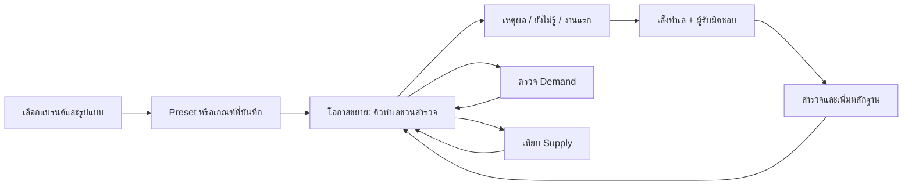

### กติกา “ไม่เกิน 3”

- Demand: เลือกไม่เกิน **3 กลุ่มปัจจัย** เช่น คนอยู่อาศัย / แหล่งงาน / ที่พัก แต่ละกลุ่มมีไม่เกิน **3 metric ที่ต่างกัน** และแต่ละ AND path ไม่เกิน 3 เงื่อนไข
- Supply: เลือก mode หนึ่งแบบ ตัวหารดิบหนึ่งตัว และ role เรา/คู่แข่ง/ผู้ให้บริการที่ระบุได้ โดยค่าจุดเทียบยังปรับได้
- Strategy: เลือก **1–3 วิธี** พร้อมกัน พื้นที่หนึ่งมีเหตุผลหลายวิธีได้
- Ranking: มี 3 น้ำหนัก ได้แก่ Demand / ช่องว่างเรา / ช่องว่างคู่แข่ง น้ำหนักจัดลำดับ ไม่คัดพื้นที่เข้าออก

บังคับข้อจำกัดทั้ง client และ server ไม่มี hidden extra factors ค่า metric หลายหน่วยที่มาจากแหล่งเดียวกัน เช่น count กับ density ยังสัมพันธ์กัน ไม่ใช่หลักฐานอิสระสามชิ้น

## 3. ข้อมูลและภูมิศาสตร์ที่ใช้จริง

ฐานเทียบมี **7,954 reporting UUIDs** = กทม. 180 แขวง + ต่างจังหวัด 7,774 reporting อปท. เปอร์เซ็นไทล์ใช้พื้นที่ที่มีค่าที่ใช้ได้ทั่วประเทศของแต่ละ metric ไม่เปลี่ยนเมื่อกรองจังหวัด เลือกแบรนด์ หรือซูมแผนที่

ขอบเขตสีเพื่อดูข้อมูลและ crosswalk ของ geometry ใช้เพื่อแสดงผล ไม่รับรอง affiliation ตามกฎหมาย ชื่อพื้นที่หรือ bbox ไม่ใช้กระจายประชากร/สาขา ต้อง join ด้วย UUID และใช้ raw source area เป็นตัวหาร ไม่ใช้พื้นที่ polygon ที่ simplify แล้ว Locale Insight เป็น contextual prior ตามกติกาโครงการ ไม่ใช้แทน official population หรือหลักฐานพฤติกรรมจริง

| หลักฐาน | พื้นที่ที่มีค่า / 7,954 | ช่วงต้นทาง | อ่านว่าอะไร |
|---|---:|---|---|
| ประชากร | 7,830 | ส.ค. 2026 | บริบทคนตามพื้นที่ ไม่ใช่ลูกค้าหรือคนเดินทาง |
| GFA | 7,939 | V4; UI ต้นทางแสดง ธ.ค. 2024 | พื้นที่อาคารทุกชั้นจากแบบจำลอง ไม่ใช่ occupancy หรือพื้นที่ดิน |
| โรงงาน / คนงาน | 5,822 | ACTIVE เม.ย. 2025 | สถานะทะเบียนและคนงานที่รายงาน ไม่ยืนยันการผลิต/คนเข้างานวันนี้ |
| ห้องพักโรงแรม | 7,506 | ไม่เผย effective period | ความจุในรายการ ไม่ใช่ผู้เข้าพักหรือ occupancy |
| อาคารสำนักงาน | 45 | V3; UI แสดง พ.ค. 2025 | ครอบคลุมน้อย ใช้เป็น positive clue เมื่อมีค่า ไม่ตี missing เป็นไม่มีสำนักงาน |
| รายได้ อปท. | 7,751 | ปี 2024 | รายได้หน่วยงาน ไม่ใช่รายได้ครัวเรือนหรือกำลังซื้อ |

Supply aggregate และพิกัดเป็นคนละหลักฐาน: native **928 อำเภอ** ใช้ยอดที่ต้นทางรายงานโดยตรง ไม่รวมย้อนจาก fine areas ที่มี 45 display links หลายอำเภอ รายการจุด Fuel ที่บรรจุ 4,363 source features ไม่ใช่หลักฐานว่าครอบคลุมสถานีทั่วประเทศครบ Grocery มี 27,457 details เทียบ 27,458 aggregate; แยก PHARMACY 150 แถวและขาด detail เกาะเต่า 1 แถว Non-bank มี 23,524 office records, assigned 17,990, mapped 17,752, assignment residual 5,534; 5,772 คือ unmapped difference ทั้งหมด ไม่ใช้ชื่อเดียวกับ residual

### 25 metric ที่เลือกได้

ค่าที่ใช้ไม่ได้เป็น null/state ไม่เป็น 0 ตัวหารต้องบวก สูตรเต็มพร้อม source paths/AST อยู่ใน machine appendix

| metric ID | ความหมาย | หน่วย | สูตรย่อ | coverage | period |
|---|---|---|---|---:|---|
| `population` | ประชากรรวม | persons | `sum(ms)+sum(fs)` | 7830/7,954 | 2026-08 |
| `population_per_km2` | ความหนาแน่นประชากร | persons/km2 | `numerator / land_area_km2` | 7830/7,954 | 2026-08 |
| `working_age_15_64` | ประชากรอายุ 15–64 ปี | persons | `sum(ms[15:65])+sum(fs[15:65])` | 7830/7,954 | 2026-08 |
| `working_age_15_64_per_km2` | ความหนาแน่นประชากรอายุ 15–64 ปี | persons/km2 | `numerator / land_area_km2` | 7830/7,954 | 2026-08 |
| `adult_population_20_64` | ประชากรอายุ 20–64 ปี | persons | `sum(ms[20:65])+sum(fs[20:65])` | 7830/7,954 | 2026-08 |
| `adult_population_20_64_per_km2` | ความหนาแน่นประชากรอายุ 20–64 ปี | persons/km2 | `numerator / land_area_km2` | 7830/7,954 | 2026-08 |
| `children_0_14` | ประชากรอายุ 0–14 ปี | persons | `sum(ms[0:15])+sum(fs[0:15])` | 7830/7,954 | 2026-08 |
| `population_65_plus` | ประชากรอายุ 65 ปีขึ้นไป | persons | `sum(ms[65:])+sum(fs[65:])` | 7830/7,954 | 2026-08 |
| `gfa` | พื้นที่อาคารรวมประมาณ (GFA) | estimated m2 GFA | `area` | 7939/7,954 | V4 / published UI label 2024-12 |
| `building_count` | จำนวนรายการอาคารจากแบบจำลอง | modeled building records | `count` | 7939/7,954 | V4 / published UI label 2024-12 |
| `gfa_per_km2` | ความหนาแน่นพื้นที่อาคารรวมประมาณ | estimated m2 GFA/km2 | `numerator / land_area_km2` | 7939/7,954 | V4 / published UI label 2024-12 |
| `gfa_per_person` | พื้นที่อาคารรวมประมาณต่อประชากร | estimated m2 GFA/person | `building.area / (sum(population.ms)+sum(population.fs))` | 7828/7,954 | V4 / published UI label 2024-12 |
| `factory_count` | จำนวนโรงงานในทะเบียน ACTIVE | registered factory records | `totalFactory` | 5822/7,954 | 2025-04 ACTIVE |
| `factory_count_per_km2` | ความหนาแน่นโรงงานในทะเบียน ACTIVE | factory records/km2 | `numerator / land_area_km2` | 5822/7,954 | 2025-04 ACTIVE |
| `factory_workers` | คนงานโรงงานที่ต้นทางรายงาน | reported workers | `totalWorker` | 5822/7,954 | 2025-04 ACTIVE |
| `factory_workers_per_km2` | ความหนาแน่นคนงานโรงงานที่รายงาน | reported workers/km2 | `numerator / land_area_km2` | 5822/7,954 | 2025-04 ACTIVE |
| `hotel_count` | จำนวนรายการโรงแรม | catalog hotel records | `hotelCount` | 7506/7,954 | ไม่ระบุ |
| `hotel_rooms` | จำนวนห้องพักในรายการโรงแรม | catalog rooms | `roomCount` | 7506/7,954 | ไม่ระบุ |
| `hotel_rooms_per_km2` | ความหนาแน่นห้องพักในรายการ | catalog rooms/km2 | `numerator / land_area_km2` | 7506/7,954 | ไม่ระบุ |
| `office_count` | จำนวนรายการอาคารสำนักงาน | catalog office buildings | `officeCount` | 45/7,954 | V3 / published UI label 2025-05 |
| `office_count_per_km2` | ความหนาแน่นรายการอาคารสำนักงาน | catalog buildings/km2 | `numerator / land_area_km2` | 45/7,954 | V3 / published UI label 2025-05 |
| `fiscal_total_thb` | รายได้รวมของ อปท. ที่รายงาน | THB/year | `total * 1000000` | 7751/7,954 | 2024 |
| `fiscal_ex_grants_thb` | รายได้ อปท. ไม่รวมเงินอุดหนุน | THB/year | `(selfCollected+stateAllocated)*1000000` | 7751/7,954 | 2024 |
| `fiscal_ex_grants_per_km2` | รายได้ อปท. ไม่รวมเงินอุดหนุนต่อพื้นที่ | THB/km2/year | `numerator / land_area_km2` | 7751/7,954 | 2024 |
| `fiscal_ex_grants_per_person` | รายได้ อปท. ไม่รวมเงินอุดหนุนต่อประชากรอ้างอิง | THB/person/year | `(selfCollected+stateAllocated)*1000000 / fiscal.population` | 7717/7,954 | 2024 |

`land_area_km2 = raw_source_areaSqm / 1,000,000` · age slices ใช้ end-exclusive เช่น `20:65` คืออายุ 20–64 ปี · fiscal per person ใช้ `fiscal.population` ของช่วง fiscal ไม่เปลี่ยนเป็น population dataset โดยเงียบ

## 4. Industry, segment และ brand profiles

ใช้ลำดับ **Industry → segment/mission → brand → format/product scope → version** ผู้ใช้เลือกแบรนด์แล้วได้ preset ที่เหมาะกับรูปแบบสำคัญและข้อมูลที่รองรับ เปลี่ยน format ได้เมื่อแบรนด์มี source-supported format นั้น

โปรไฟล์มี offering, operator positioning, source links, research status, metric focus, default Strategy, per-scope criteria และข้อจำกัด ข้อความที่แบรนด์ประกาศเกี่ยวกับตัวเองเป็น operator claim ยังไม่ใช่ผลสำรวจ brand perception ลูกค้าจริง ค่า P/rate/weight เป็นสมมติฐานของ Yolk ไม่มีแบรนด์รับรองค่าตัวเลขเหล่านี้

| ธุรกิจ | เทียบ submarket วันนี้ | ช่องว่าง segment ที่ยังต้องเพิ่ม |
|---|---|---|
| Fuel | หมวด all_fuel ในต้นทาง | ชนิดเชื้อเพลิง LPG/น้ำมัน บริการ ความจุและ offering ที่แต่ละสถานีมีจริง |
| Grocery | format ต้นทาง C_STORE / SUPERMARKET / HYPERMARKET / WHOLESALE | สินค้า ราคา เวลาเปิด โอกาสซื้อ กลุ่มลูกค้า และช่องทางที่ตอบความต้องการจริง |
| Non-bank | กลุ่มใบอนุญาต active ระดับบริษัทที่เป็นไปได้ | หน้าที่สำนักงาน ผลิตภัณฑ์และการให้บริการรายสาขา; ไม่เดาความต้องการกู้จากประชากร |

ไม่รวมบริษัทคนละ legal ID เพียงเพราะชื่อกลุ่มหรือ marketing เหมือนกัน COSMO ยังมี current identity ที่ต้องตรวจ PURE/Caltex-PURE ต้องตรวจหน้าป้ายและ source identity ไม่รวมกับ Caltex อัตโนมัติ สินเชื่อระดับบริษัทไม่ยืนยัน offering ที่สำนักงานหนึ่ง

### 9 ครอบครัว preset

ค่าละเอียดของแต่ละ AND/OR path อยู่ใน [brand-strategy-profiles.v1.9.0.json](prototype/data/brand-strategy-profiles.v1.9.0.json) ไม่สร้าง default ซ้ำอีกชุดใน component

| family | source scope | factor families | max Tier | ตัวหาร Supply ตั้งต้น | ranking |
|---|---|---|---:|---|---|
| `fuel-common` | all_fuel | built_form, workplace, hospitality | 3 | gfa | weighted |
| `grocery-convenience` | C_STORE | residents, workplace | 3 | population | context |
| `grocery-community` | C_STORE | residents | 3 | population | context |
| `grocery-supermarket` | SUPERMARKET | residents | 3 | population | context |
| `grocery-hypermarket` | HYPERMARKET | residents | 3 | population | context |
| `grocery-wholesale` | WHOLESALE | residents, hospitality | 3 | population | context |
| `grocery-visitor-context` | C_STORE | residents, hospitality | 3 | population | context |
| `nonbank-community` | potential_retail_branch_service | adults | 3 | population | context |
| `nonbank-concentrated` | potential_retail_branch_service | adults | 2 | population | context |

**Fuel 1.9 เป็นสมมติฐานใหม่อย่างชัดเจน:** built_form ใช้ GFA/GFAต่อคน/GFAต่อพื้นที่; workplace ใช้ factory_count/factory_workers/factory_workersต่อพื้นที่; hospitality ใช้ rooms/roomsต่อพื้นที่ แยกกลุ่มแล้วใช้ best confirmed tier ไม่ใช่ activity 6 ข้อโหวต 5/3/1 แบบเดิม การเปลี่ยนนี้อาจเปลี่ยน Tier และชุดพื้นที่ ต้องโชว์ diff เมื่อ Try preset และไม่แก้ saved criteria โดยอัตโนมัติ

ตัวอย่าง fuel paths: built_form Tier1 ทุกตัว≥P99, Tier2ทุกตัว≥P95, Tier3อย่างใดอย่างหนึ่ง≥P95; workplace Tier1ทั้ง3≥P95, Tier2คู่ใดคู่หนึ่ง≥P95, Tier3ตัวใดตัวหนึ่ง≥P95; hospitality Tier1rooms+density≥P95, Tier2ทั้งคู่≥P90, Tier3rooms≥P90 เหล่านี้เป็น starter hypotheses ที่ปรับได้

Grocery convenience เริ่ม residents(volume+density) กับ workplace(workers+density); supermarket เน้น residents ที่เข้มกว่า; hypermarket เน้น volume; wholesale เพิ่ม hotel capacity เป็นฐานผู้ประกอบการที่ชวนตรวจ Non-bank ใช้ adult population20–64volume+density เป็นบริบทพื้นที่ ไม่ใช่จำนวนผู้มีสิทธิ์กู้หรือความต้องการสินเชื่อ

### โปรไฟล์ที่เลือกได้ 37 ราย

ตัวเลข Strategy คือ default research methods; methods ที่ยังไม่มีข้อมูลจะแสดงข้อมูลที่ต้องเพิ่ม ไม่สร้างผลลัพธ์เทียม แหล่งหลักฐานปฐมภูมิและ rationales อยู่ใน runtime registry เดียวกัน

| Industry | ชื่อ | stable ID | default scope | segment | Strategy เริ่มต้น | สถานะวิจัย |
|---|---|---|---|---|---|---|
| fuel | PTT Station | `ptt` | all_fuel | mobility_destination | 06, 07, 05 | primary_operator_context_verified |
| fuel | เชลล์ | `shell` | all_fuel | fuel_quality_services | 03, 06, 05 | primary_operator_context_verified |
| fuel | บางจาก | `bangchak` | all_fuel | mobility_destination | 01, 07, 05 | primary_operator_context_verified |
| fuel | คาลเท็กซ์ | `caltex` | all_fuel | fuel_fleet_services | 06, 07, 03 | primary_operator_context_verified |
| fuel | COSMO | `cosmo` | all_fuel | fuel_identity_review | 01, 07 | current_identity_unresolved |
| fuel | PT | `pt` | all_fuel | mobility_destination | 07, 01, 05 | primary_operator_context_verified |
| fuel | PURE | `pure` | all_fuel | fuel_rebrand_review | 07, 01, 06 | primary_operator_context_verified |
| fuel | สยามแก๊ส | `siam-gas` | all_fuel | automotive_lpg | 01, 07, 06 | primary_operator_context_verified |
| fuel | ซัสโก้ | `susco` | all_fuel | fuel_multi_product | 01, 07, 06 | primary_operator_context_verified |
| fuel | ยูนิคแก๊ส | `unique-gas` | all_fuel | automotive_lpg | 01, 07, 06 | primary_operator_context_verified |
| fuel | เวิลด์แก๊ส | `world-gas` | all_fuel | automotive_lpg | 01, 07, 06 | primary_operator_context_verified |
| grocery | เซเว่น อีเลฟเว่น | `grocery-brand:SEVEN_ELEVEN` | C_STORE | everyday_convenience | 07, 05, 01 | primary_operator_context_verified |
| grocery | ถูกดี มีมาตรฐาน | `grocery-brand:TOOGDEE` | C_STORE | community_partner | 07, 01, 05 | primary_operator_context_verified |
| grocery | Lotus's | `grocery-brand:LOTUSS` | HYPERMARKET | multi_format_grocery | 01, 07, 05 | primary_operator_context_verified |
| grocery | ซีเจ มอร์ | `grocery-brand:CJ_MORE` | C_STORE | community_value | 01, 07, 05 | primary_operator_context_verified |
| grocery | บิ๊กซี | `grocery-brand:BIG_C` | HYPERMARKET | multi_format_grocery | 01, 07, 05 | primary_operator_context_verified |
| grocery | ท็อปส์ | `grocery-brand:TOPS` | SUPERMARKET | quality_grocery | 02, 05, 03 | primary_operator_context_verified |
| grocery | แม็คโคร | `grocery-brand:MAKRO` | WHOLESALE | food_operator_wholesale | 05, 01, 07 | primary_operator_context_verified |
| grocery | ลอว์สัน 108 | `grocery-brand:LAWSON108` | C_STORE | meal_convenience | 05, 02, 07 | historical_mission_needs_refresh |
| grocery | วิลล่า มาร์เก็ต | `grocery-brand:VILLA_MARKET` | SUPERMARKET | international_supermarket | 02, 05, 03 | primary_operator_context_verified |
| grocery | แม็กซ์แวลู | `grocery-brand:MAXVALU` | SUPERMARKET | fresh_daily_supermarket | 01, 07, 05 | primary_operator_context_verified |
| grocery | ฟู้ดแลนด์ | `grocery-brand:FOODLAND` | SUPERMARKET | extended_hours_supermarket | 02, 05, 03 | primary_operator_context_verified |
| grocery | กูร์เมต์ มาร์เก็ต | `grocery-brand:GOURMET_MARKET` | SUPERMARKET | international_supermarket | 02, 05, 03 | primary_operator_context_verified |
| grocery | โก โฮลเซลล์ | `grocery-brand:GO_WHOLESALE` | WHOLESALE | food_operator_wholesale | 05, 01, 07 | primary_operator_context_verified |
| grocery | ดอง ดอง ดองกิ | `grocery-brand:DONKI` | SUPERMARKET | japanese_specialty_supermarket | 02, 03, 05 | primary_operator_context_verified |
| grocery | ริมปิง | `grocery-brand:RIMPING` | SUPERMARKET | international_supermarket | 02, 05, 07 | primary_operator_context_verified |
| grocery | ยูเอฟเอ็ม ฟูจิ ซูเปอร์ | `grocery-brand:FUJI` | SUPERMARKET | japanese_specialty_supermarket | 02, 05, 07 | primary_operator_context_verified |
| nonbank | เมืองไทย แคปปิตอล | `legal:0107557000195` | potential_retail_branch_service | community_finance | 07, 01, 02 | primary_operator_context_verified |
| nonbank | ศรีสวัสดิ์ พาวเวอร์ 2014 | `legal:0105559126747` | office_context | finance_entity_review | 07, 01 | exact_legal_entity_offering_unresolved |
| nonbank | เงินไชโย · AutoX | `legal:0105564161598` | vehicle_title | vehicle_title_finance | 07, 01, 03 | primary_operator_context_verified |
| nonbank | เงินติดล้อ | `legal:0107563000355` | vehicle_title | vehicle_title_insurance | 03, 07, 02 | primary_operator_context_verified |
| nonbank | ศักดิ์สยาม | `legal:0107559000290` | vehicle_title | community_finance | 01, 07, 02 | primary_operator_context_verified |
| nonbank | เงินเทอร์โบ | `legal:0107566000542` | vehicle_title | community_finance | 01, 07, 02 | primary_operator_context_verified |
| nonbank | เฮงลิสซิ่ง | `legal:0107564000120` | potential_retail_branch_service | mixed_vehicle_personal_finance | 07, 01, 02 | primary_operator_context_verified |
| nonbank | นิ่มลีสซิ่ง | `legal:0505560008015` | potential_retail_branch_service | community_finance | 07, 01, 02 | primary_operator_context_verified |
| nonbank | กรุงศรี ออโต้ · อยุธยา แคปปิตอล ออโต้ ลีส | `legal:0107538000690` | vehicle_title | motorcycle_finance | 05, 03, 07 | primary_operator_context_verified |
| nonbank | ยูโอบี แคปปิตอล เซอร์วิสเซส | `legal:0105528033194` | personal | personal_finance | 02, 07, 03 | primary_operator_context_verified |

## 5. Demand: คัดพื้นที่ไข่แดง

ทุก condition ใช้ **ค่า metric จริงเทียบ cutoff** จาก fixed national distribution ไม่ใช้ percentile score เป็นตลาดขนาดจริง

```text
within_path = every condition passes                 # AND, ≤3
factor_tier = best confirmed tier of enabled paths   # OR
qualifying_tier = minimum numbered confirmed tier
eligible = demand is true AND tier in {1,2,3} AND tier <= maxDemandTier
```

condition ที่ไม่มีค่าหรือ cutoff ใช้ unknown; ถ้าอีก condition เป็น false path นั้น false; unknown ที่เหลือยังไม่ใช่ confirmed ค่า positive_presence ต้องมากกว่า 0 แม้ percentile cutoff เท่ากับ 0 ตัวอ่าน rank-midrank เพื่อแสดงอันดับกับ percentile INC cutoff เป็นคนละการคำนวณ ต้องไม่ใช้แทนกัน

- Tier1 **ไข่แดงเข้ม / Deep yolk**: proxy Demand สูงมาก
- Tier2 **ไข่แดง / Yolk**: proxy Demand สูง
- Tier3 **ไข่ขาว / Egg white**: proxy Demand ค่อนข้างสูง

การคัดทั้งหมดนี้ไม่ได้วัดลูกค้า traffic ยอดซื้อ หรือผู้กู้จริง Supply/weights/Strategy เปลี่ยนผลด้าน Supply หรือลำดับ/มุมมองได้ แต่ไม่เปลี่ยน Demand, Tier หรือ eligible IDs

## 6. Supply และการแข่งขัน

ใช้ **สาขาเทียบฐานตลาด** เป็นค่าเริ่มต้น โหมดจำนวนสาขายังเลือกได้ ตัวหารเป็น raw extensive metric ตัวเดียวและแสดงหน่วยเสมอ

```text
rate = count / positive_raw_denominator * normalization_unit
fuel default: branches / 100,000 estimated m² GFA
grocery/nonbank default: branches / 10,000 persons
count_equivalent_reference = rate_reference * denominator / normalization_unit
```

จุดเทียบเริ่มต้นใช้ median ของอัตราบวกที่ exact และข้อมูลครบทั่วประเทศ ต่อ role แยกกันเมื่อ N≥5; interval และ unknown U ไม่เข้าตัวอย่าง ถ้าไม่พอใช้ fallback1/unit พร้อมป้าย exploratory ไม่ reseed ขณะลาก slider หรือเปลี่ยนเมนู

เลขน้อยกว่าจุดเทียบเป็น Low ตั้งแต่จุดเทียบขึ้นไปเป็น High จุดเทียบเป็นสมมติฐาน ไม่ใช่ capacity การเลื่อนขวาเพิ่มจุดเทียบ ไม่ได้สร้างสาขาหรือ Demand ใหม่ ตัวหาร missing/0/negative ใช้ unresolved ไม่ infinity หรือ 0

เก็บช่วง own/competitor และ unknown แยกกัน สำหรับ U ที่รอรู้แบรนด์: own_upper=own_base_upper+U, rival_upper=rival_base_upper+U แต่ total_upper=own_base_upper+rival_base_upper+U **บวก U ครั้งเดียว** Non-bank residual เป็น possible assignment bounds ไม่ใช่การกระจายสาขาจริงซ้ำลงทุกพื้นที่ ถ้า `boundsKnown=false` ห้ามเรียก upper bound ว่า exact

สัญลักษณ์ **โล่ = เรา, ดาบ = คู่แข่ง** มี caption/ตัวเลข/หน่วยและ bars เทียบในทำเลเดียวกัน ด้วย local extent เดียวกัน ส่วน POI ใช้โลโก้จริง square graphic ชื่อแบรนด์และ party badge ไม่ทำกรอบตกแต่งโลโก้ Unknown-brand ไม่เท่ากับ verified unbranded

### Ranking เป็นอีกชั้นหนึ่ง

```text
gap(N,T) = 100 / (1 + N/T)
weightedRank = (Wd*Demand + Wo*OwnGap + Wc*CompetitorGap) / (Wd+Wo+Wc)
```

น้ำหนักไม่ติดลบและรวม>0 ใช้ได้ไม่เกิน3ตัว Fuel starter70/20/10; Grocery/Non-bank starter context order (Tier/path strength) น้ำหนัก Supply ไม่มีผลต่อ context comparator จึงต้องบอก mode ปัจจุบัน ส่วน Strategy order ใช้สูตรคิวของแต่ละวิธีแยกต่างหาก ไม่เอา competitorGap ที่ชอบคู่แข่งน้อยไปเรียกว่าศักยภาพชิงลูกค้า

## 7. Strategy: เลือกวิธีขยายตลาดและงานสำรวจ

**ไข่แดงบอกว่าที่ไหนมี Demand เข้มข้น ส่วน Strategy บอกว่าจะเข้าถึงลูกค้าด้วยวิธีไหน** เลือกได้ครั้งละ 1–3 วิธี พื้นที่เดียวอาจมีเบาะแสตรงหลายวิธี แต่แต่ละวิธีต้องมีหลักฐานของตัวเอง

8 วิธีนี้เป็นแนวทางขยายตลาดชุดใหม่ แยกจากชื่อรูปแบบเดิมอย่าง Crowded, FOMO และ Pioneer ไม่ใช้ดาวหรือรูปแบบเดิมเป็นเงื่อนไขคัดไข่แดง

| วิธีขยายตลาด | สัญลักษณ์ช่วยจำ | เบาะแสที่ใช้วันนี้ | งานที่ต้องตรวจต่อ |
|---|---|---|---|
| **01 เติมช่องว่างตลาด** · Underserved market | เข็มทิศ · หาโอกาสที่ยังไม่ถูกเติม | **P0:** สาขารวมยังน้อยเมื่อเทียบจุดอ้างอิงของตลาด แม้นับจำนวนที่อาจเพิ่มจากรายการรอตรวจแล้ว | มีผู้ให้บริการตกหล่นไหม? ลูกค้ายังขาดบริการอะไร เวลาและทางเข้าออกเป็นอย่างไร? |
| **02 เติมช่องว่างกลุ่มลูกค้า** · Segment gap | กลุ่มคน · หาโจทย์ลูกค้าที่ยังไม่มีใครตอบ | **P1:** ต้องเพิ่มข้อมูลกลุ่มลูกค้าและข้อเสนอของแต่ละสาขาก่อน | ใครมีความต้องการที่ยังไม่ได้รับการตอบ? สินค้า ราคา เวลาเปิด และการเข้าถึงต่างกันอย่างไร? |
| **03 ชิงลูกค้าจากคู่แข่ง** · Competitive entry | ดาบ · ตรวจโอกาสแข่งขัน | **P0:** พบคู่แข่งในขอบเขตตลาดเดียวกัน จึงมีตลาดให้ศึกษาการแข่งขัน | ลูกค้าจะเปลี่ยนมาใช้เราเพราะอะไร? ข้อได้เปรียบของแบรนด์เกิดขึ้นจริงที่สาขานี้ไหม? |
| **04 เข้าร่วมย่านที่ดึงลูกค้า** · Cluster participation | ร้านค้า · เป็นส่วนหนึ่งของย่าน | **P1:** ต้องตรวจว่าร้านใกล้กันช่วยดึงลูกค้าหรือเกิดการแวะหลายร้านจริง | ลูกค้ามาเพื่อเปรียบเทียบหรือซื้อร่วมกันไหม? ประโยชน์คุ้มค่าเช่าและการแข่งขันหรือไม่? |
| **05 เกาะกิจกรรมที่ส่งลูกค้าให้กัน** · Complementary location | ชั้นกิจกรรม · มองหาแหล่งส่งลูกค้า | **P0:** พบโรงงาน คนงาน หรือห้องพักโรงแรมที่เกี่ยวข้องกับแบรนด์ อยู่ในกลุ่มบน 5% ของประเทศ | แหล่งกิจกรรมอยู่ตรงไหน? คนออกทางไหน เวลาใด และแวะซื้อจริงไหม? |
| **06 รับลูกค้าบนเส้นทาง** · Route capture | ลูกศร · มองเส้นทางผ่านและแวะ | **P2:** ต้องเพิ่มถนนที่มีทิศทาง จุดเข้าออก และข้อมูลการแวะ | รถผ่านเข้าถึงได้ไหม? เลี้ยวหรือกลับรถอย่างไร? ผ่านแล้วแวะซื้อช่วงไหน? |
| **07 เติมเครือข่ายของเรา** · Network infill | โล่ · ขยายพื้นที่ที่เราให้บริการ | **P0:** สาขาเรายังน้อยเมื่อเทียบจุดอ้างอิงของตลาด แม้นับจำนวนที่อาจเพิ่มจากรายการรอตรวจแล้ว | สาขาใหม่ช่วยลดช่องว่างการเดินทางไหม? สาขาเดิมรับเพิ่มได้หรือจะเสียลูกค้าให้สาขาใหม่? |
| **08 เปิดก่อนเพื่อได้พื้นที่ก่อน** · Future entry | ธง · จับจังหวะตลาดอนาคต | **P2:** ต้องมีโครงการจริง ความคืบหน้า และเงื่อนไขถือพื้นที่ แยกเป็นรายการติดตามอนาคต | เมื่อไรจึงจะมีลูกค้า? ต้องรอนานและมีต้นทุนเท่าไร? อะไรคือสัญญาณให้เดินหน้าหรือหยุด? |

**P0 ช่วยสร้างคิวไปสำรวจสำหรับ 01, 03, 05 และ 07 ได้ทันที** ผล “ชวนสำรวจ” ยังไม่ยืนยันว่าควรเปิดสาขา ข้อมูลไม่พอหรือช่วงจำนวนคร่อมจุดอ้างอิงจะแสดงว่า “ต้องเพิ่มหลักฐาน” ไม่ตีความเป็นสาขาน้อย

วิธี 05 ใช้กิจกรรมระดับพื้นที่ที่แบรนด์ระบุว่ามีความเกี่ยวข้อง และมีค่าจริงมากกว่า 0 ตัววัดโรงงาน คนงาน และห้องพักโรงแรมเป็นเบาะแสตั้งต้น ยังไม่ใช่หลักฐานว่าอยู่ใกล้จุดเช่า หรือส่งลูกค้าให้ร้านจริง ข้อมูลโรงพยาบาลและโรงเรียนต้องตรวจแหล่ง CityMETER และเชื่อมพิกัดใน P1; ประชากรอย่างเดียวไม่ใช่แหล่งส่งลูกค้า โรงแรมที่ไม่ระบุช่วงข้อมูลให้แสดง “ไม่ระบุ” ไม่ใช้วันที่ดาวน์โหลดแทน

วิธี 02, 04, 06 และ 08 มีคำถามสำรวจให้เริ่มงาน แต่ยังไม่มีข้อมูลพอคัดพื้นที่ด้วยวิธีนั้นใน P0 ระบบไม่สร้างคะแนนขึ้นเอง Future entry จะมีรายการติดตามแยกในเฟสถัดไป ภาพอธิบายชวนให้ตรวจ Demand ของตลาดอนาคต ไม่แสดงเป็นไข่แดงที่ยืนยันแล้ว และไม่เพิ่มจำนวนไข่แดงปัจจุบัน

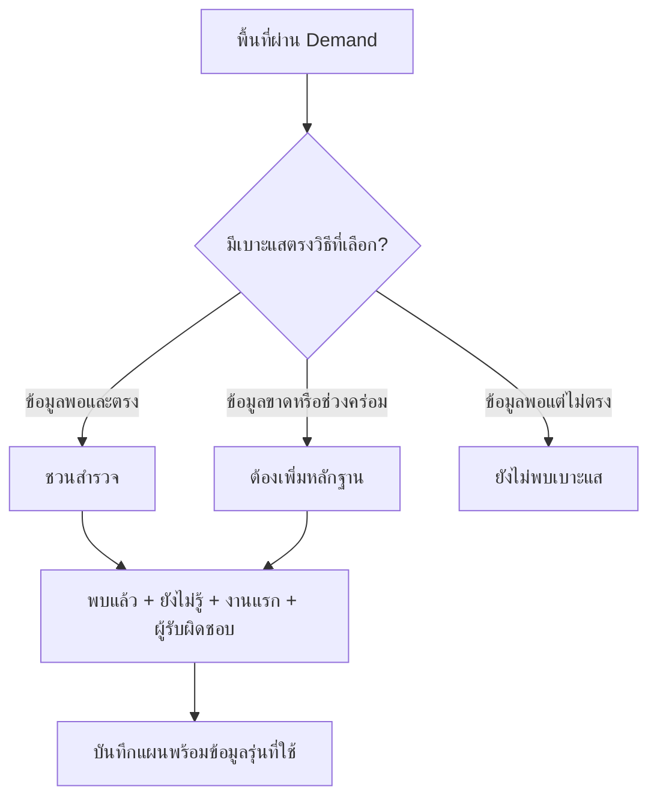

### หนึ่งทำเลต้องตอบได้ 4 ข้อ

1. **พบแล้ว:** ค่า หน่วย ช่วงข้อมูล แหล่งที่มา และขอบเขตที่ใช้
2. **วิธีที่ชวนตรวจ:** จะเข้าถึงลูกค้าด้วยวิธีไหน และมีเบาะแสอะไร
3. **ยังไม่รู้:** ข้อใดที่ถ้าได้คำตอบอีกทางแล้วอาจเปลี่ยนการเลือก
4. **งานแรก:** ใครจะไปตรวจอะไร และต้องบันทึกหลักฐานใดกลับมา

แยกจำนวน **ผ่าน Demand / ชวนสำรวจตาม Strategy / เล็งไว้** ให้ชัด จำนวนผลค้นหาตาม Strategy ไม่ใช่จำนวนไข่แดง แผนที่และรายการนับตามขอบเขตที่เลือก

คิวสำรวจเรียงจากจำนวนวิธีที่มีเบาะแสมากกว่า → ระดับ Demand → ลำดับวิธีที่ผู้ใช้เลือก → ค่าที่พบภายในวิธีเดียวกัน → ID ทำเลเพื่อให้ลำดับคงที่ ไม่เทียบค่าคนละหน่วยข้ามวิธี และไม่เรียกอันดับนี้ว่าคะแนนยอดขายหรือความมั่นใจ สูตรและสถานะที่เครื่องใช้ดูใน machine appendix

### ตัวอย่าง: คานหาม

บริบท Grocery / 7-Eleven / ร้านสะดวกซื้อ มีประชากรต้นทาง **6,338 คน** (ส.ค. 2026) และคนงานโรงงานที่รายงาน **49,339 คน** (ทะเบียน ACTIVE เม.ย. 2025) บัญชีร้านรูปแบบเดียวกันที่ต้นทางผูกกับพื้นที่มีสาขาเรา **7** และคู่แข่ง **5**

แหล่งงานใหญ่ชวนตรวจวิธี 05: คนทำงานกะไหน ออกทางไหน และซื้ออะไรช่วงใด ส่วนวิธี 02 ยังต้องตรวจสินค้ารายสาขาและโอกาสซื้อของลูกค้า จึงยังยืนยัน segment gap ไม่ได้ จำนวนสาขาก็ยังไม่รับรองการเปิดจริงหรือความสามารถให้บริการ

ID สำหรับตรวจซ้ำ: `13825155-7532-4b74-b89a-5127ed5f8864`

### เข้าใจทั้ง 8 วิธีจากภาพและตัวอย่าง

หน้าโอกาสขยายมีไอคอนพร้อมชื่อสั้น ๆ ให้เปิด **ดูภาพและตัวอย่าง** ได้ โดยไม่ต้องอ่านคู่มือก่อน ภายในมีคำอธิบายหนึ่งประโยค ภาพสรุป วิธีใช้ 3 ขั้น และตัวอย่างสมมติ รวมทั้งข้อแลกเปลี่ยนและข้อมูลที่ยังต้องหา

| วิธี | ภาพควรช่วยให้เห็นอะไร | ตัวอย่างสมมติ | คำถามก่อนตัดสินใจ |
|---|---|---|---|
| 01 เติมช่องว่าง | พื้นที่ Demand สูง แต่ Supply **รวม** เบาบาง | ชุมชนหนาแน่น มีร้านรูปแบบเดียวกันต่ำกว่าจุดเทียบ | ขาดบริการจริงหรือเพียงมีข้อมูลตกหล่น? |
| 02 ตอบโจทย์ที่ยังขาด | ลูกค้าบางกลุ่มมีโจทย์ที่ offering ปัจจุบันยังไม่ตอบ | ร้านในย่านอาจไม่เปิดช่วงคนงานเลิกกะดึก | มีโอกาสซื้อช่วงนั้นจริงไหม? |
| 03 แข่งด้วยข้อได้เปรียบ | เราเสนอเหตุผลให้เลือกท่ามกลางคู่แข่ง | สถานีที่อาจเข้าถึงง่ายกว่าคู่แข่ง | ทางเข้าและเหตุผลเปลี่ยนแบรนด์จริงไหม? |
| 04 ร่วมย่านที่ลูกค้ามา | ร้านเชื่อมกันเป็นจุดหมาย ไม่ใช่กลุ่มหมุดบนจอ | ถนนมีสำนักงานหลายรายให้ลูกค้าเปรียบเทียบ | เขาเข้าหลายรายในทริปเดียวจริงไหม? |
| 05 ต่อกิจกรรม | กิจกรรมที่เกี่ยวข้องมีทางออกและช่วงเวลาที่ส่งคนถึงเรา | ร้านของกินใกล้แหล่งงานที่ตรวจตำแหน่งแล้ว | ประตูไหน เวลาใด และมีการซื้อจริงไหม? |
| 06 รับลูกค้าระหว่างทาง | ทิศทางผ่าน ทางเข้า และจุดหยุด | ถนนหลักตัดบายพาสที่ทีมอยากสำรวจ | ผ่านแล้วเข้าได้ หยุดได้ และซื้อไหม? |
| 07 เติมช่องว่างของเรา | Supply **เรา** ยังเบาบาง แม้คู่แข่งมีอยู่ | แบรนด์ non-bank ยังเข้าถึงพื้นที่ผู้ใหญ่หนาแน่นได้น้อย | เพิ่มการเข้าถึงหรือแค่แบ่งยอดเราเดิม? |
| 08 จับตาตลาดอนาคต | เหตุการณ์ในอนาคตพร้อม milestone | โครงการที่อยู่อาศัยกำหนดส่งมอบที่ตรวจได้ | พร้อมเปิดเมื่อไร และเมื่อไรควรหยุดรอ? |

**ตัวอย่างทั้งหมดสมมติ** ภาพเป็นคำอธิบายแนวคิด ไม่ใช่พิกัด traffic ผลซื้อ หรือผลธุรกิจจริง P0 ให้เบาะแส 01/03/05/07 เมื่อข้อมูลพอ ส่วน 02/04/06/08 เปิดอ่านและตั้งงานสำรวจได้ แต่ยังไม่สร้างผลคัดจากข้อมูลที่ขาด

ดูข้อความไทย/อังกฤษและ schema ใน [strategy-guide.v1.9.3.json](prototype/data/strategy-guide.v1.9.3.json) ซึ่งเป็น authority ของเนื้อหา Guide เป็น read-only: เปิดอ่านไม่เลือก Strategy แทนผู้ใช้ ไม่เลื่อนเกณฑ์ ไม่เปลี่ยนกล้องหรือสร้าง team event ปิดด้วยปุ่มหรือ Escape และคืน focus ที่จุดเปิด

## 8. Map และ UX: ปรับแล้วเห็นผลทันที

**ใช้แผนที่เดียวค้างทุกเมนู** ผู้ใช้ปรับ Demand, Supply หรือ Strategy แล้วเห็นผลในพื้นที่เดิม เปลี่ยนภาษา ธีม หรือเมนูแล้วไม่ซูมใหม่เอง ซูมและจัดกรอบเมื่อผู้ใช้เลือกพื้นที่ กดกลับ กด Fit หรือแตะกลุ่มจุดเท่านั้น

| ระดับที่ดู | ลงสีตามขอบเขต | คลิกและไฮไลต์ตามขอบเขต |
|---|---|---|
| ทั้งประเทศ | อำเภอ | จังหวัด |
| จังหวัด | แขวง / อปท. | อำเภอ |
| อำเภอ | แขวง / อปท. | แขวง / อปท. |
| ทำเล | ภายในโปร่ง เห็นแผนที่พื้นหลังและจุดสาขา | ทำเลที่เลือกและจุดสำคัญ |

### อ่านสีไข่ดาวและเส้นขอบ

- **ไข่แดงเข้ม:** Tier 1 · Demand สูงมาก ใช้ gradient เหลืองส้มจาก DS
- **ไข่แดง:** Tier 2 · Demand สูง ใช้เหลือง Yolk
- **ไข่ขาว:** Tier 3 · Demand ค่อนข้างสูง ใช้สีไข่ขาว
- เส้นขอบปกติเป็นสีขาว ขอบเขตใหญ่หนากว่าขอบเขตย่อยเล็กน้อย เพื่อเห็นระดับพื้นที่
- เมื่อชี้เมาส์ ใช้กรอบเหลือง Yolk เน้น **ขอบเขตที่จะคลิกได้** ภายในทำเลที่เลือกยังโปร่ง ไม่ปิดถนนและชื่อสถานที่

ทั้งสองธีมใช้สีข้อมูลชุดเดียวกัน Tier 1 ใช้สีเดิมจาก `density.area` ช่วง LUT 20–40, Tier 2 ใช้ `#FFBC1F` และ Tier 3 ใช้ `#F1F4EF` Gradient ภายใน Tier 1 ไม่ได้แสดงว่าจุดใดมี Demand มากกว่า สีตัวเลขอื่นใช้ 41 ช่วงตาม DS และหน่วยจริง ไม่กลับสีหรือปรับความทึบจนสีข้อมูลเปลี่ยน แยกค่าศูนย์ ข้อมูลขาด ข้อมูลปิดบัง และข้อมูลที่ยังไม่พร้อมด้วยข้อความและสัญลักษณ์ด้วย

### แผนที่แต่ละมุมมองตอบคนละคำถาม

**Demand:** ไข่แดงอยู่ที่ไหน? ดูระดับและตัววัดที่ผ่านเกณฑ์ พร้อมปุ่มเล็งทำเล

**Supply:** ใครให้บริการอยู่แล้ว และมีมากแค่ไหนเมื่อเทียบฐานตลาด? เริ่มด้วย choropleth เลือกดูสาขาเรา คู่แข่ง หรือรวม และเปลี่ยนเป็นจุดสาขาได้ทุกระดับ ใช้โล่แทนเรา ดาบแทนคู่แข่ง พร้อมชื่อ จำนวน และหน่วย พิกัด POI มีโลโก้แบรนด์เมื่อมีไฟล์ที่ตรวจแล้ว

**โอกาสขยาย:** เป็นหน้าแรกที่รวมภาพประเทศกับ Strategy พื้นที่ไหนมีเบาะแสตรงวิธีขยายที่เลือก? คงสีไข่ดาวของ Demand แล้วแสดงพื้นที่ที่มีเบาะแสตรงวิธีนั้น พื้นที่โปร่งจึงหมายถึง “ยังไม่ตรงหรือข้อมูลไม่พอในมุมมองนี้” ไม่ได้แปลว่า Demand ต่ำ เปิดทำเลเพื่ออ่าน **พบแล้ว / ยังไม่รู้ / งานแรก** และเล็งพร้อมแผนสำรวจ

**จุดสาขาจำนวนมาก:** รวมจุดที่ใกล้กันบนหน้าจอ พร้อมแยกเรา คู่แข่ง และรอตรวจ เก็บรายการสมาชิกทั้งหมด ไม่ทิ้งจุดเพียงเพราะเกินจำนวนที่วาดได้ เมื่อซูมสุดหรือพิกัดซ้อนกันให้เปิดรายการและชวนกรองต่อ การรวมจุดบนหน้าจอช่วยอ่านแผนที่เท่านั้น ไม่ใช่หลักฐานว่าเป็นย่านที่ส่งลูกค้าให้กันตามวิธี 04

Basemap เลือกได้ **เรียบง่าย / ภาพถ่ายดาวเทียม / รายละเอียด** มีเครดิตและที่มา แผนที่ที่แสดงไม่รับรองขอบเขตทางกฎหมาย พิกัดที่ยังไม่ผูกพื้นที่ไม่เปลี่ยนยอด Supply ของพื้นที่เพียงเพราะมองเห็นบนแผนที่

### ใช้ได้ทั้งมือถือและจอใหญ่

ออกแบบ mobile-first แต่บน desktop ให้แผนที่ใหญ่และยังเห็นขณะปรับค่า ใช้ slider ควบคู่ช่องตัวเลขสำหรับค่าที่ต้องปรับละเอียด เมนูและคำอธิบายไม่เบียดแผนที่จนหลงบริบท

ตรวจข้อความจริงทั้งไทยและอังกฤษที่ 390 และ 1440 พิกเซล ใน light/dark รวมชื่อแบรนด์ยาว หัวข้อ legend และฟอร์ม ใช้ icon จาก DS ที่จุดต้องเลือกหรือตัดสินใจ พร้อม caption เสมอ Hover ขีดเส้นใต้เฉพาะข้อความ ไม่ขีด icon และรักษากรอบ keyboard focus


เมื่อความกว้างจอเปลี่ยนมากหรือข้าม breakpoint ให้ fit ขอบเขตเดิมใหม่ตามกติกาเดิม ส่วนการกดขยาย/ย่อแผนที่ให้คงกล้องแม้ความกว้าง host เปลี่ยน เช่นเดียวกับการเปลี่ยนความสูง/เมนู/เกณฑ์ ถ้ากำลังเปิด popup ให้รักษาตำแหน่งหมุดนั้นก่อน

### แผนที่ใหญ่ขึ้น แต่ไม่ทิ้งบริบท

บน desktop แผนที่อยู่คู่กับคิวทำเลและการปรับค่า บนมือถือมีปุ่ม **ขยายแผนที่ / ย่อแผนที่** ที่ใช้แผนที่ตัวเดิม Controls สำคัญอยู่ใน toolbar สั้น ๆ ส่วนตัวเลือกเพิ่มเติมค่อยเปิดเมื่อใช้ มีพื้นที่แตะอย่างน้อย 44 px และ focus ที่มองเห็น

Choropleth ใช้เส้นย่อยขาว 0.30 px ขอบจังหวัด/อำเภอที่เป็น parent ยังหนากว่าเล็กน้อย มี halo กลางบาง ๆ เฉพาะเส้น parent ที่ไม่ fill เพื่อแยกลำดับ ข้อมูลสี/opacity ไม่เปลี่ยน โหมดจุดสาขายังคงเส้นเงียบแบบเดิม ไม่มี halo บน POI หรือกรอบทำเลที่เลือก

Light theme ใช้ canvas `surface.soft.light #E5E9E6` และ panel `surface.alt.light #EEF1EE` ตาม DS ให้แผนที่และข้อความเป็นจุดสนใจ ไอคอนร้านค้าสื่อ Supply โดยรวม ส่วนโล่และดาบยังสื่อเราและคู่แข่ง Link มีสี accent และ focus ชัดเจน ไม่ขีดเส้นใต้ icon

Basemap มีสถานะกำลังโหลด / โหลดได้บางส่วน / ผิดพลาด แยกจากข้อมูลวิเคราะห์ กด **โหลดพื้นหลังใหม่** เพื่อสร้าง tile layer สไตล์เดิมใหม่ โดยใช้ map เดิมและคงกล้อง เกณฑ์และงานที่บันทึกไว้ ไม่มี auto-retry จำนวน tiles ที่ค้างเป็นข้อมูลวินิจฉัย ไม่ใช้สรุปสาเหตุของ provider ขอบเขตและผลวิเคราะห์ยังทำงานได้ ผลลองใหม่จริงผ่านในลำดับ native ที่บันทึกไว้ ไม่รับรอง availability ของ provider ทุกเวลา


ขนาดจาก source ปัจจุบัน: desktop map สูง `100dvh - 72px` มี work panel 380–440 px เมื่อขยายซ่อนเฉพาะ panel; mobile สูง `clamp(360px, 58svh, 560px)` เมื่อขยายใช้ `min(760px, 100svh - 88px - safe-area)` และซ่อน bottom navigation ชั่วคราวเพื่อไม่ทับ attribution/legend กดปุ่มย่อหรือ Escape เพื่อคืนเมนู Supply ใช้ค่าเริ่มต้นบน mobile แยกเป็น `clamp(480px, 74svh, 680px)` ทั้งสีพื้นที่และจุดสาขา โดย explicit expanded mode มีลำดับสูงกว่า Toolbar สูงอย่างน้อย 64/58 px และมี stats แถวเต็มความกว้าง Footer อยู่ใน flow ปกติ 52–148 px ไม่ทับ canvas ความสูง host ไม่เท่ากับ canvas ที่เหลือหลัง controls/footer ต้องวัดจาก browser จริงก่อนสรุป visual pass

Native browser รุ่น 1.9.3 · baseline ประวัติ: desktop 1440×900 มี canvas โอกาสขยาย 742×626.703 px; mobile 390×844 มี market canvas 317.117 px (panel 489.516 px), Supply country canvas 342.516 px (panel 624.555 px) และ Supply expanded canvas 473.961 px เมนูล่างซ่อนและ Escape คืนได้ ตัวเลขนี้เป็นการวัด viewport ใน browser ไม่ใช่อุปกรณ์จริง ดูขอบเขตใน [native receipt](evidence/browser-v1.9.3/native-browser-review.json)

Native review พบว่า `GridLayer.redraw()` ที่ zoom 10.25 ส่ง tile URL `/10.25/x/y.png` ซึ่งไม่ถูกต้อง จึงเปลี่ยน retry ให้สร้างเฉพาะ tile layer สไตล์เดิมผ่าน `setBasemap(S.basemap)` เพื่อใช้ tile zoom ที่เป็นจำนวนเต็ม โดยคง map กล้อง เกณฑ์และ provider เดิม หลังแก้ทดสอบ 2 retry cycles พร้อม resize/zoom ใน fresh native tab พบ console errors 0 รายการ และ sampled tiles กลับมาโหลดได้ ดู receipt ปัจจุบัน ไม่ใช้สรุป availability ของ provider

รายละเอียด layout ฐาน1.9.3ดู [expansion experience](contracts/expansion-experience.v1.9.3.json); ผล native เดิมเป็นประวัติ layout และค่าที่ส่งต่อปัจจุบันใช้ map-space1.9.4และ receipt ของรุ่นนี้แยกกัน physical devices และ full matrix ยังไม่ยืนยัน

### พื้นที่แผนที่เป็นงานหลัก · 1.9.4


**Layout1.9.4 ที่ส่งต่อ:** sidebar desktop96px, full menu248pxซ้อนทับแผนที่, work pane340px, global header72px; map controlsและlegend/evidenceใช้progressive disclosure ดูค่าครบใน map-space contract. การวัดcanvasจริงระบุใน native receipt แยกจากค่าCSS.

การจัดหน้าปัจจุบันใช้ sidebar **96 px** และ full menu **248 px** แบบซ้อนทับ จึงไม่บีบพื้นที่แผนที่อีก work pane **340 px** จัดหัวข้อ Criteria ให้เต็มคอลัมน์ก่อนปุ่มและ badge เพื่อไม่บีบชื่อยาว โลโก้ Landometer เดิมแสดงที่ header เฉพาะ desktop กว้าง **148 px** มือถือคงโลโก้ในเมนูตั้งค่า ไม่มีโลโก้ซ้ำใน header

ผลวัดจริงที่ viewport **1440×900** ใน POI view: canvas จาก **742×498.26 px** เป็น **1002×669 px** กว้างขึ้นประมาณ **35%** ที่ **390×844** canvas POI วัด **389×461.20 px** ใน panel **675.20 px** ค่าต่างกันได้ตามโหมด legend และข้อความจริง; ค่า CSS ไม่ใช่ตัวแทนผลวัด browser


ลดพื้นที่เมนูและแถบข้อมูลที่ใช้งานไม่บ่อย เพื่อให้เห็น basemap และทำเลมากขึ้นทันที ข้อมูลสำคัญยังเข้าถึงได้ผ่าน controls และ disclosure ที่มีไอคอนพร้อมชื่อ ไม่ย่อข้อความจนอ่านไม่ออก ไม่ทำกรอบตกแต่งหรือใช้สีข้อมูลเป็นของตกแต่ง

การขยาย/ย่อ sidebar และแผนที่เป็นการจัดหน้าจอส่วนตัว คง map instance, ขอบเขตและกล้อง, criteria/draft, form/photo draft และ focus โดยไม่สร้าง event ของทีม ขนาดสุดท้ายและผลวัดจริงอยู่ใน [map-space contract](contracts/map-space.v1.9.4.json) ผลตรวจ runtime ผ่านเฉพาะขอบเขตที่ระบุใน receipt ปัจจุบัน; อุปกรณ์จริงและการใช้งาน production ยังเป็น gates แยก

ขั้น implement patch:

1. อ่าน map-space contract และเก็บ baseline ของ viewport/canvas จริงก่อนเปลี่ยน shell
2. ปรับ navigation/work pane และ map header/footer โดยคง dataset, metric, Tier, LUT41, source counts และ guide เดิม
3. รักษาการเข้าถึง controls ด้วย mouse/touch/keyboard และ label ไทย/อังกฤษ
4. ใช้ public resize/invalidateSize lifecycle กับ map เดิม ตรวจ expand/compact/route/retry ไม่สร้าง map ใหม่
5. วัด canvas จริงที่ desktop และมือถือ ตรวจไม่มีข้อความทับ/overflow และปิด disclosure แล้ว focus กลับจุดเริ่ม
6. บันทึก current QA/screenshots/hash จากไฟล์สุดท้าย จึง seal, provider deploy และตรวจ live bytes แยกตาม T24

### เห็นเหตุผลและผลของการกระทำโดยไม่เสียบริบท · 1.9.1

**ชี้พื้นที่แล้วรู้ว่าจะเปิดที่ไหน:** มี tooltip พื้นที่เพียงอันเดียว แสดงชื่อ **ขอบเขตที่คลิกได้** พร้อมค่าหลักและหน่วย เช่น จังหวัดในภาพประเทศ หรืออำเภอเมื่อดูจังหวัด ไม่มีกล่องพื้นที่ย่อยซ้อนอีกใบ ค่า Supply สีพื้นที่ใช้ค่าสูงสุดที่ทราบของพื้นที่ย่อยและระบุว่าไม่ใช่ยอดรวมจังหวัด/อำเภอ ส่วนโหมดหมุดใช้จำนวนพิกัดที่ผ่าน filter และอยู่ในขอบเขตนั้น กล่อง tooltip กว้าง 280 px บน desktop และ 240 px บนมือถือ โดยไม่เกิน viewport ลบ 40 px เพื่ออ่านแถวชื่อ/ค่าได้ ข้อมูลรอโหลด/ขาดไม่เป็นศูนย์ Tooltip ใช้กล่องเดียวต่อเนื่องและลบกล่องเดิมทันทีเมื่อปิด ไม่เหลือ fade-out ซ้อน Keyboard focus ใช้ tooltip เดียวกัน และแผนที่ expose เฉพาะ hit ที่คลิกได้เป็นปุ่ม ไม่อ่าน paint ซ้ำ

**ดูจุดสาขาโดยไม่ติดร่างแหเส้นขอบ:** ในโหมด Branch points ลดเส้นพื้นที่ย่อยที่ไม่ช่วยตัดสินใจ เหลือบริบทขอบเขตที่เกี่ยวข้อง หมุด โลโก้ และกรอบ hover เหลือง ข้างในยังโปร่ง เปลี่ยนโหมดแล้วคงกล้องเดิม การลดเส้นไม่ได้ลบข้อมูลหรือเปลี่ยนยอด Supply

**เล็งทำเลแล้วเห็นว่าไปอยู่ที่ไหน:** เมื่อบันทึกทำเลใหม่สำเร็จ จำนวนในเมนู **ทำเลที่เล็งไว้ / Shortlist** เพิ่มจริงหนึ่งรายการ มี cue สั้น ๆ เชื่อมจากปุ่มไปยังเมนูนั้น พร้อมข้อความสำเร็จ ผู้ใช้ยังอยู่ที่เดิม ไม่พาเปลี่ยนหน้าเอง บันทึกซ้ำ อัปเดตแผนเดิม หรือบันทึกไม่สำเร็จไม่แสดง +1 คืนจาก archive เพิ่ม +1 และเอาออกลด −1 ตามจำนวน active targets จริง

**Motion ช่วยบอกผล ไม่ทำให้ต้องรอ:** สถานะและจำนวนสำเร็จแสดงได้ทันที motion เป็น feedback เสริม ใช้ surrogate ที่ไม่ใช่โลโก้หรือข้อมูลจริง ไม่บังการคลิก ไม่ย้าย focus และไม่วนซ้ำ มีตัวเลือก **ลดการเคลื่อนไหว / Reduce motion** ในเมนูตั้งค่า ใช้เฉพาะเครื่องนี้ ไม่สร้าง event หรือเปลี่ยนเกณฑ์ทีม เมื่อเครื่องหรือ checkbox ขอ reduced motion เมนูปลายทางไม่อยู่ในจอ หรือ motion ถูกขัดจังหวะ ให้แสดงจำนวนและข้อความสุดท้ายตรง ๆ ทันที

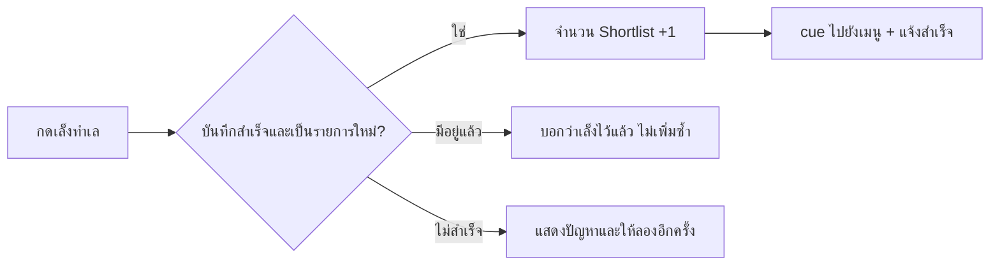

ข้อตกลงสำหรับ dev อยู่ที่ [interaction-guidance.v1.9.1.json](contracts/interaction-guidance.v1.9.1.json) ตรวจแบบเปิด/ปิด reduced motion, keyboard, TH/EN และหน้าจอแคบ/ใหญ่ ผลเครื่องจำลองไม่แทนการตรวจมือถือหรือ screen reader จริง ดูขอบเขต native review และภาพจริงใน [receipt](evidence/browser-v1.9.1/native-browser-review.json)

### จำแบรนด์และอ่าน Supply ได้ทันที · 1.9.2

**แบรนด์:** ใช้ภาพ Villa Market, Lawson108 และ Tops ที่เจ้าของส่งแทน/เพิ่มให้กับ identity เดิม วาง artwork ตามสัดส่วนจริง มีชื่อแบรนด์กำกับ ไม่ครอป ยืด วาดใหม่ หรือเพิ่มกรอบ ภาพที่ส่งเป็น artwork ที่เลือกใช้ ไม่ทำให้ข้อมูล offering, format หรือ preset เปลี่ยนตามไปด้วย

**Supply controls:** โล่ = เรา, ดาบ = คู่แข่ง, กลุ่มรวม = ผู้ให้บริการที่ระบุได้ ไอคอนใช้ font ของ icon โดยตรง ข้อความใช้ font เนื้อหา แยกช่อง icon กับ caption เพื่อไม่ให้ font rule ของตัวหนารบกวน glyph จัด gap 8 px และ glyph 22 px ตัวเลขอยู่ใน counter แยก ใช้ Bai Jamjuree สำหรับ caption และ JetBrains Mono เฉพาะจำนวน ตัวกรองทั้ง 5 ขึ้นบรรทัดใหม่ตามพื้นที่ของ workspace เมื่อจอแคบ ไม่ทำให้ทั้งหน้าจอ overflow

อ่าน [brand identity + Supply chip contract](contracts/brand-identity-ui.v1.9.2.json) และ [คู่มือ](docs/BRAND_IDENTITY_AND_SUPPLY_CHIPS_v1.9.2.md) ก่อนแก้ asset/controls เช็ค actual TH/EN, light/dark, mobile/desktop ให้ไม่มี raw ligature text, icon/caption ซ้อน หรือ horizontal overflow

## 9. CRUD, evidence และ collaboration

**ทำเลที่เล็งไว้:** reportingUUID+fullcontext, owner/status/notes/custom fields และ immutableStrategyAssessment snapshot เก็บcriteriaเต็ม, privateDraftหรือacceptedrevision, source/benchmark/profile/engine/strategyversions, findings/missing/nextaction, actor/time เมื่อบันทึกตรงจากdraftต้องเห็นสถานะนั้น ไม่ทำเหมือนทีมApplyแล้ว

**สาขา:** immutable source recordแยกteamoverlay ใช้canonicalbrandID/manualsavedgeographyก่อนcoordinatehint กรองdropdownจังหวัด/พื้นที่ที่เกี่ยวข้อง; unique strict-interior displaymatchเสนอในdraftได้ ถ้าคาบเส้นหรือหลายcandidateให้เลือก ไม่รับรองlegalboundaryหรือย้ายaggregateSupply รูปสาขาได้5รูป previewใช้mock/บันทึกในbrowser; productionprivate mediaใช้validation/signedreadตามสิทธิ์

**จุดเช่า P1:** หลายCandidateSiteต่อareaได้ เก็บentrance/access/rent/date/size/availability/owner ห้ามใส่เป็นbranchแล้วเพิ่มSupply

**กิจกรรม:** Successfulsharedmutationมีactor/time/before-after/context/entityfeedหนึ่งEvent+Outboxหนึ่งtransaction criteriafeedเฉพาะcontext, detailfeedเฉพาะarea/branch, globalfeedตามสิทธิ์ Deliveryemail/LINEหลังcommitและdedupe; Map/personalStrategy/draft/themeไม่ใช่teamaction Leaderboardนับsuccessfulactionsไม่ซ้ำหรือsampleactions

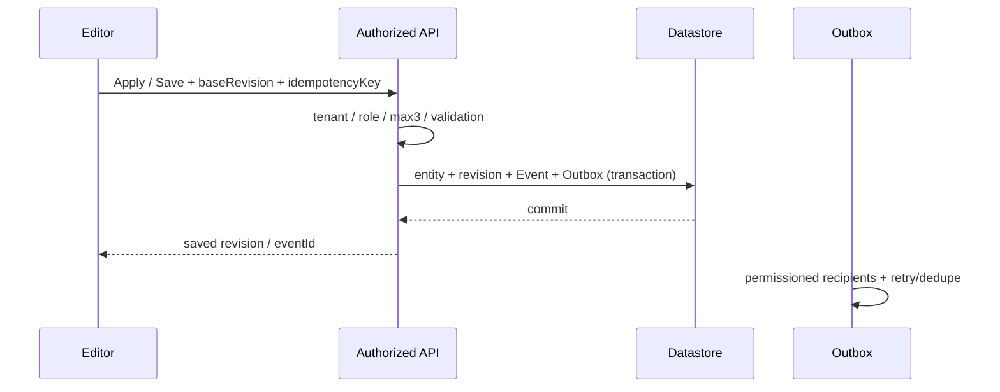

## 10. Architecture และ schema สำหรับ production

T00ต้องตรวจstackจริงCityMETERก่อนเลือกframework/datastore ใช้sourceadapter→safeMetricAST/Benchmark→versionedprofiles→pureDemandSupplyRank→pureOpportunity→CalculationService→ContextRevision/CRUD/Evidence/Media→EventOutbox ห้ามportglobalbrowserตัวเดียวเป็นserverstateแชร์ทุกtenant

Fullcontext key: `workspaceId + industryId + ownEntityId + supplyScope + profileVersion` formatId/productIdต้องมีmappingชัด ผลคำนวณเพิ่มsourceReleaseId/benchmarkReleaseId/criteriaHash/engineVersion StrategyAssessmentเพิ่มstrategyContractVersion Snapshotเก่าไม่เขียนทับเมื่อprofile/sourceเปลี่ยน

| Entity | ข้อมูลสำคัญ | invariant |
|---|---|---|
| Workspace/Membership | tenant, user, role, active status | serverRBAC/seat10/lastadmin |
| SourceRelease/Area/Crosswalk | hash/period/rights/UUID/grain/geometryVersion | immutable; displaynotstatutory |
| Metric/SupplyObservation | value/state/unit/source/grain/format/license | missing≠zero; native≠finesum |
| Industry/Segment/BrandProfile | offering/operatorclaim/sources/status/per-scopepreset/version | facts/inference/perceptionunknownแยก |
| CriteriaScope/Revision/Draft | fullcontext/baseRevision/hash/criteriaJson | acceptedimmutable; privateDraftไม่event |
| Target/StrategyAssessment | area/owner/status/criteria-sourceversions/evidence/nextaction | uniquecontext+area; snapshotsimmutable |
| Branch/Media | sourceidentity+overlay+coords/assignmentprovenance/privatephotos | CRUDไม่แก้aggregate; max5 |
| EvidenceRecord/FieldAction | question/value/unit/period/rights/state/owner/result | verifiedfactไม่ใช่approvedinvestment |
| CandidateSite/AnchorPOI | entrances/rent/date/coordinates/crosswalk/operations | P1; siteไม่เป็นSupplybranch |
| FutureProject | milestone/cost/trigger/owner | P2watchlistไม่promoteYolk |
| Event/Outbox/ShareGrant | actor/time/diff/recipients/status/expiry | transaction/dedupe/permissions |

Indexesอย่างน้อย: uniqueactiveTarget(workspace,scope,area), uniqueCriteriaScope(fullcontext), uniqueMembership(workspace,user), uniqueMutation(workspace,idempotencyKey), uniqueDelivery(eventId,recipient,channel), observation(sourceRelease,metric,UUID), actions(workspace,assessment,status) รายfieldsเต็มอยู่machineappendix

### API contract ที่เสนอ — ยังไม่ได้เกิดจาก static preview

```json
{
  "requestId": "req-unique",
  "workspaceId": "authorized-tenant",
  "context": {
    "industryId": "grocery",
    "ownEntityId": "grocery-brand:SEVEN_ELEVEN",
    "supplyScope": "C_STORE",
    "profileVersion": "1.9.0"
  },
  "sourceReleaseId": "immutable-release-id",
  "benchmarkReleaseId": "national-cohort-release-id",
  "criteriaHash": "server-derived-canonical-json-sha256",
  "criteria": {"maxDemandTier": 3, "demandFactors": "validated factor-path payload"},
  "strategyIds": ["network_infill", "complementary_location"],
  "baseRevision": 7,
  "idempotencyKey": "mutation-only-unique-key"
}
```

```json
{
  "requestId": "req-unique",
  "sourceReleaseId": "immutable-release-id",
  "benchmarkReleaseId": "national-cohort-release-id",
  "criteriaHash": "exact-request-hash",
  "engineVersion": "1.9.0",
  "counters": {"demandEligibleCount": "computed", "opportunityViewCount": "computed"},
  "rows": [{
    "areaId": "reporting-uuid",
    "demand": true,
    "qualifyingTier": 1,
    "eligible": true,
    "supply": {"ownLower": "known", "ownUpper": "known-or-bound"},
    "opportunity": {"status": "candidate_to_check", "assessments": "evidence+missing+nextAction"}
  }],
  "diagnostics": {"coverage": "by metric/state/grain", "errors": []}
}
```

ตัวอย่างschemaเป็นDTOtemplate ไม่ใช่ผลวัดหรือresponseที่deployแล้ว POSTpreviewไม่มีevent; Applyต้องbaseRevision/idempotencyและservervalidate; 409คืนdiffคงdraft; 422คืนstablecode+fieldpath; ผลasyncต้องmatchcontext/request/source/criteriaก่อนใช้

Productioncontractsต้องvalidate max3ที่nestedfactor/metrics/path/strategy และtypedcustomfields ไม่รับeval/arbitraryJS/SQL ภาพprivateไม่ใส่blob/signedURLลงfeed ใช้content sniff/decode/mime/dimension/cap/revisionและstripEXIFที่ไม่จำเป็น signedreadต้องtenant+role+entitypermission

P3transaction/customerdataใช้วัตถุประสงค์/สิทธิ์/retention/minimizationชัด เก็บข้อมูลรวมเท่าที่ตอบคำถามได้ ห้ามpersonaldata/privateexportsเข้าpublichandoff

## 11. Migration ที่ไม่ทำงานทีมเสีย

1. Pin source/profile/criteria/engineversions; upgradeprofileไม่เขียนทับacceptedrevision
2. เก็บoldpatternfields/historyไว้อ่านย้อนหลัง แต่ไม่คืนhiddenfilterหรือstarpriority
3. Fuelactivity6vote→factorpathsเป็นสมมติฐานใหม่ โชว์diffเมื่อTrypreset ไม่เรียกequivalentmigration
4. Seedbrand/scopeใหม่หรือexplicitTrypresetลงprivateDraftเท่านั้น Applyจึงเป็นsharedrevision/event
5. Snapshotstrategyเก่าเก็บcriteria/sourceversionเดิม เมื่อข้อมูลใหม่ให้สร้างassessmentใหม่
6. Openingpage/migration/personalviewไม่emitteamrevision/outbox; asyncrestoreไม่สลับรูป/note/criteriaข้ามcontext

## 12. Step-by-step implementation สำหรับ dev / intern

ทำทีละTตามdependencies ห้ามเริ่มด้วยการเปลี่ยนframeworkทั้งหมด Promptแต่ละงานต้องระบุinput/output/AC/tests ไม่ให้vibecodingเดาค่าที่ไม่มี ให้reviewhuman+machinecontractก่อนรันงาน และไม่ถือgeneratedcodeเป็นDone

ลำดับP0: T00→T01/T02→T03→T04/T05→T06/T07/T08/T09/T10→T11/T12/T13/T14→T15/T16/T17/T18/T19→T23→T24 P1=T20, P2=T21, P3=T22 ทำเมื่อหลักฐานพร้อม แผนproductionแยกจากsourcepreviewที่ทำแล้ว

### T00 · ตรวจ stack และ source ที่ทีมใช้จริง

เฟสข้อมูล **P0** · เริ่มหลัง: **ไม่มี** · สถานะ production: planned

**อ่าน/รับเข้า:** This full document; Current CityMETER source/auth/spatial/media/queue repositories; DS integration

**ส่งออก:** Stack map; rights/source inventory; exact runtime-to-production field map

1. ตรวจ repository, auth, tenant, datastore, spatial service, media และ queue ที่ CityMETER ใช้จริง
2. ทำบัญชี fields, หน่วย, ช่วงข้อมูล, coverage, UUID, สิทธิ์ และสถานะข้อมูลขาด
3. ทำ stack map และตารางเชื่อม runtime กับบริการจริงก่อนเลือก framework

**ตรวจรับ:** No new framework/datastore chosen before stack mapping.; 25 metrics and fixed 7954 UUIDs accounted for; hospital/school adapters explicitly pending.

**ทดสอบ:** Source hash/catalog validation; Review source/permission registry

### T01 · ตั้ง shell ตาม LDS และ responsive map layout

เฟสข้อมูล **P0** · เริ่มหลัง: **T00** · สถานะ production: planned

**อ่าน/รับเข้า:** Verified LDS0.9.7 base/profile; Current routes and UI assets; expansion-experience.v1.9.3.json

**ส่งออก:** Accessible TH/EN light/dark shell; One persistent map host; Compact map toolbar, responsive explicit expanded mode and soft foundation surfaces

1. ใช้ asset/font/icon/token ที่ตรวจจาก LDS 0.9.7 และ shell ไทย/อังกฤษ
2. ให้แผนที่เดียวอยู่ข้างงานบน desktop และใช้ controls สั้น ๆ พร้อมขยาย/ย่อบนมือถือ
3. ใช้ foundation surface อ่อนตาม DS และ link/focus ที่อ่านชัด คงสีข้อมูลเดิม
4. แยก font ของ glyph/caption/counter รักษา icon 22 px, gap 8 px และปุ่มแตะอย่างน้อย 44 px
5. ตรวจชื่อยาวและการขึ้นบรรทัดจริงทั้งสอง theme โดยไม่สร้างกรอบโลโก้หรือ motif

**ตรวจรับ:** No map recreation on route change.; Rendered real Thai/English headings fit 390/1440px in both themes.; No raw icon ligature text, overlapping icons/captions or horizontal page overflow.; Expanded/compact layout does not recreate the map, apply criteria or emit team events.; Real TH/EN control text remains readable and touch-accessible with map occupying useful screen space.; Supply optional point view retains enough visible map canvas after its controls/footer; actual narrow native measurements are required.

**ทดสอบ:** Font/logo network checks; Native visual review and keyboard navigation; check-icon-controls.cjs; Native computed glyph/caption/counter faces and no overlap at390/1440

### T02 · สร้าง workspace, auth, seats และ schema

เฟสข้อมูล **P0** · เริ่มหลัง: **T00, T01** · สถานะ production: planned

**อ่าน/รับเข้า:** Existing auth/datastore; Proposed entities/indexes/RBAC

**ส่งออก:** Tenant-scoped database schema; Server-enforced role/seat checks

1. ทำ context tuple และ indexes ที่แยก workspace/industry/brand/scope
2. บังคับ 1 admin + 3 editors + 6 viewers ที่ server และป้องกันการลบ admin คนสุดท้าย
3. ตรวจสิทธิ์ทุก API/storage/share; viewer ทดลองส่วนตัวได้ แต่ไม่แก้ข้อมูลทีม

**ตรวจรับ:** Cross-tenant IDs are inaccessible.; Viewer can preview privately but cannot mutate shared criteria/records.

**ทดสอบ:** Two-tenant attack fixtures; Seat concurrent writes; RBAC service/API tests

### T03 · นำเข้า snapshot และ geometry

เฟสข้อมูล **P0** · เริ่มหลัง: **T00, T02** · สถานะ production: planned

**อ่าน/รับเข้า:** Immutable source files; Source hashes/periods/rights; Display geometry/crosswalk

**ส่งออก:** SourceRelease/Area/MetricObservation/SupplyObservation stores; Explicit many-to-many display crosswalk

1. นำเข้า snapshot ด้วย UUID จริง เก็บ hash, ช่วงข้อมูล, raw state และสิทธิ์
2. แยกยอด native 928 อำเภอจาก fine reporting units ไม่รวมย้อนด้วย polygon ที่ simplify
3. นำเข้า geometry/crosswalk แบบ explicit many-to-many; ข้อมูลขอบเขตขาดไม่สร้าง polygon เดา

**ตรวจรับ:** No name-only joins or allocation of residuals.; 45 multi-district display links do not duplicate national/province fine UUID counts.

**ทดสอบ:** Hash and row uniqueness; Geometry/crosswalk counts; Native-vs-fine reconciliation fixtures

### T04 · ทำ metric registry และ safe formula evaluator

เฟสข้อมูล **P0** · เริ่มหลัง: **T03** · สถานะ production: planned

**อ่าน/รับเข้า:** 25 metric definitions/formula AST; Allowed source fields

**ส่งออก:** Typed registry; Safe arithmetic evaluator with provenance

1. ทำ registry ของ 25 metric พร้อมสูตร AST, หน่วย, source path และ period
2. คำนวณเฉพาะสูตรที่อนุญาต ห้าม eval หรือ arbitrary SQL/JavaScript
3. ตัวหารต้องบวก; แยก measured zero, missing, suppressed และ not-yet

**ตรวจรับ:** No eval, arbitrary JS or request-provided SQL.; GFA per person uses population dataset; fiscal per person uses fiscal.population.

**ทดสอบ:** AST allowlist/injection rejection; Zero/missing denominator; Age20:65 slice endpoints

### T05 · ตรึง benchmark ทั่วประเทศ

เฟสข้อมูล **P0** · เริ่มหลัง: **T04** · สถานะ production: planned

**อ่าน/รับเข้า:** Fixed7954UUID source release; Known values per metric

**ส่งออก:** Immutable national distributions; Benchmark release/hash/cohort

1. ตรึง national cohort 7,954 UUID และ valid values ของแต่ละ metric
2. สร้าง P cutoff จากฐานประเทศเดียว ไม่เปลี่ยนเมื่อ zoom/กรองจังหวัด/เลือกแบรนด์
3. เก็บ benchmark version/hash พร้อม ties และ positive-presence rules ให้ตรวจซ้ำได้

**ตรวจรับ:** Zoom/brand/province filters leave benchmark hashes/cutoffs unchanged.; Missing observations do not enter denominator or become zero.

**ทดสอบ:** INC/ties fixtures; Known-zero fixture; Cohort isolation

### T06 · ทำ Industry→Segment→Brand→Scope profiles

เฟสข้อมูล **P0** · เริ่มหลัง: **T00, T04, T05** · สถานะ production: planned

**อ่าน/รับเข้า:** 37-brand researched registry; 9 preset families; Current source format/license scopes

**ส่งออก:** Versioned IndustryProfile/SegmentProfile/BrandProfile registry; Per-scope starter criteria

1. ใช้โปรไฟล์ Industry→Segment→Brand→Scope ที่มีแหล่งและข้อจำกัด
2. เลือก default ที่สำคัญของแบรนด์และมีข้อมูลต้นทางรองรับ; saved context มาก่อน preset ใหม่
3. bind โลโก้ด้วย stable brand ID และ theme policy เดิม ไม่เดา offering จากรูปหรือชื่อแบรนด์
4. เก็บ numeric presets เป็นสมมติฐานของ Yolk พร้อม version/diff ไม่ใช่เกณฑ์ที่แบรนด์รับรอง

**ตรวจรับ:** No company/group marketing auto-merges distinct IDs.; Numeric presets are labeled Yolk hypotheses, not operator-endorsed thresholds.; Brand name remains adjacent to original compact artwork; identity and source-scope counts do not change.

**ทดสอบ:** 37 bindings/9 families validation; Official source links and profile status; Context restore and brand switch tests

### T07 · คำนวณ Demand ด้วย factor paths จำกัด 3

เฟสข้อมูล **P0** · เริ่มหลัง: **T04, T05, T06** · สถานะ production: planned

**อ่าน/รับเข้า:** Brand per-scope factorPresets/criteriaOverrides; National benchmark

**ส่งออก:** Pure Demand/Tier engine; Maximum-three factor validators

1. validate ไม่เกิน 3 factor families, 3 distinct metrics ต่อกลุ่ม และ 3 AND conditions ต่อ path
2. ประเมิน confirmed tier จาก paths ที่มีข้อมูลรองรับ โดยไม่เอา missing เป็น 0
3. ใช้ Demand เพียงชั้นเดียวตัด eligibility; การเลือก Supply/Strategy ไม่เปลี่ยนชุด Demand

**ตรวจรับ:** eligible = demand===true AND Tier1..3 AND tier<=maxDemandTier.; Unknown does not qualify; disabled factors do not affect result; a fourth factor/metric is rejected server-side.

**ทดสอบ:** Pure fixture per family; No-data path logic; Max3 enforcement; Saved historical criteria migration

### T08 · ทำ Supply adapters และตัวหาร

เฟสข้อมูล **P0** · เริ่มหลัง: **T03, T06, T07** · สถานะ production: planned

**อ่าน/รับเข้า:** Native/fine source inventory; Selected source scope; Raw extensive denominator

**ส่งออก:** Own/competitor/unresolved bounds; Count/rate comparisons and exploratory references

1. แยก source aggregates, coordinate inventory และ team overlays ตาม grain
2. เลือก mode จำนวนหรืออัตราต่อฐานตลาด ใช้ตัวหารดิบหนึ่งตัวพร้อมหน่วยชัด
3. คำนวณ bounds ของเรา/คู่แข่ง/รายการยังไม่แน่ ไม่ยืนยันการเปิดจริงจาก registry

**ตรวจรับ:** Missing denominator or assignment bounds remain unresolved.; Do not classify registered adult population as borrowers or all fuel stations as identical fuel offerings.

**ทดสอบ:** Joint-U/interval tests; Scope identity/licence fixtures; Relative median exclusion; Count/rate units

### T09 · แยก eligibility จาก ranking

เฟสข้อมูล **P0** · เริ่มหลัง: **T07, T08** · สถานะ production: planned

**อ่าน/รับเข้า:** Demand results; Supply gap references; At most3weights

**ส่งออก:** Stable context and weighted comparators; Rank bounds and coverage

1. แยกฟังก์ชัน eligibility ออกจาก comparator ของ ranking
2. ให้ Supply และ 3 weights จัดลำดับชุด Demand เดิม ไม่เพิ่ม/ลดสมาชิก
3. แสดง sort description ที่ตรงกับ comparator และทดสอบลำดับคงที่

**ตรวจรับ:** Supply modes/references/weights change order only, never Demand/Tier/eligible IDs.; No negative-weight hack for competitive-entry or cluster strategy.

**ทดสอบ:** Membership invariants; Allzero weights rejection; Joint allocation admissibility; Deterministic ties

### T10 · เพิ่ม 8 Strategy เป็นชั้นคิวสำรวจ

เฟสข้อมูล **P0** · เริ่มหลัง: **T07, T08, T09** · สถานะ production: planned

**อ่าน/รับเข้า:** opportunity-strategies.v1.9.0.json; Evaluated rows; Brand/scope profile

**ส่งออก:** Pure OpportunityEngine; Separate candidate/incomplete/unsupported queues

1. เรียก Strategy assessment หลัง Demand ด้วย OpportunityEngine เดิม
2. สร้างคิว candidate/needs-evidence/unsupported แยกกัน และเลือกไม่เกิน 3 วิธี
3. P0 ใช้เบาะแส 01/03/05/07 ที่ข้อมูลรองรับ; วิธีอื่นบอกหลักฐานที่ต้องเพิ่ม
4. คืน reasons, evidenceRefs, missingEvidence, nextAction และ versions; ไม่สร้างคะแนนยอดขายใหม่

**ตรวจรับ:** Every candidate has an explicit first field task.; Future areas cannot enter current Yolk counts.; Population alone is not a Complementary anchor.

**ทดสอบ:** check-opportunity-strategies.cjs; Real national membership invariants; KhanHamworkers49339 example

### T11 · ทำ calculation API/worker และ cancellation

เฟสข้อมูล **P0** · เริ่มหลัง: **T02, T05, T07, T08, T09, T10** · สถานะ production: planned

**อ่าน/รับเข้า:** Request/response envelopes; Pure engines

**ส่งออก:** Calculation endpoints; Content-addressed cache; Latest-request guard

1. ทำ calculation API/worker ตาม context และ snapshot versions
2. cancel งานเก่าเมื่อเปลี่ยน context/criteria และไม่ให้ผลเก่าเขียนทับผลใหม่
3. cache ด้วย source/criteria/benchmark/profile/engine hash และแสดง loading/error แยก

**ตรวจรับ:** Race brand/route/source changes cannot publish old result.; Preview does not create shared events.

**ทดสอบ:** Deferred reversed responses; Same-countdifferentIDs; Cache version invalidation

### T12 · ทำ persistent maps และ POIทุกdrilldown

เฟสข้อมูล **P0** · เริ่มหลัง: **T01, T03, T11** · สถานะ production: planned

**อ่าน/รับเข้า:** Map semantics/DS scales; Native district and fine geometry; Source coordinate adapters; Expansion map hierarchy/layout/tile-recovery contract

**ส่งออก:** One map controller; Demand/Supply/Strategy layers; Supply optional point mode

1. ใช้ map controller ตัวเดียว Country paint อำเภอ/click จังหวัด; จังหวัด paint fine/click อำเภอ
2. เปิด Supply points ได้ทุก drilldown ใช้ coordinate grouping 56 px โดยเก็บสมาชิกทั้งหมด
3. ใช้เส้น white child 0.30 px และ parent widths เดิม; halo 0.65 px เฉพาะ unfilled choropleth parent
4. คง quiet POI, selected fine โปร่ง, hover เหลือง และ tooltip เจ้าของเดียวตามขอบเขตคลิก
5. ขยาย/ย่อแล้ว invalidate host แต่รักษากล้อง/navigation/popup; ตรวจ resize policy ที่ต่างจาก route sync
6. จัด loading/partial error/retry ของ tiles แยกจาก source/calculation และตรวจเหตุการณ์จริงก่อนอ้างว่าลองใหม่สำเร็จ

**ตรวจรับ:** Camera changes only explicit navigation/focus/fit/clusterclick.; Screen bins are not physical market-cluster evidence.; Source coordinates and native supply counts never conflated.; No duplicate paint/navigation tooltips.; POI view remains readable at all four administrative scopes.; Parent hierarchy is visible without dense child mesh; POI quiet policy stays unchanged.; Basemap failure never changes source metrics, eligible IDs or saved evidence; retry must have actual evidence before claiming success.; A fractional map zoom followed by retry emits provider-valid integer tile zoom requests, preserves camera/criteria, and has bounded native recovery evidence.

**ทดสอบ:** check-workspace-map.cjs; check-supply-poi-modes.cjs; Paint/click boundaries; Real light/dark narrow/desktop; check-map-clarity.cjs; Native hover name/value and point-boundary review; check-map-hierarchy.cjs; Native expanded/compact controls, actual boundary hierarchy and tile failure/retry review; check-map-recovery.cjs

### T13 · ทำ criteria drafts และ Apply แบบตรวจ diff

เฟสข้อมูล **P0** · เริ่มหลัง: **T02, T07, T08, T09, T11, T12** · สถานะ production: planned

**อ่าน/รับเข้า:** Scoped CriteriaRevision; Factor controls and defaults

**ส่งออก:** Private draft editor; Revision/event/outbox Apply transaction

1. แยก private draft จาก applied team criteria และแสดงผลบน map ทันที
2. Apply เมื่อ validate ผ่านและ revision ตรง; แสดง diff และ actor/time
3. เก็บ draft เมื่อ load/save ล้มเหลวหรือ context เปลี่ยน; ไม่ใช้ preset ทับค่าทีมเงียบ ๆ

**ตรวจรับ:** No-op and retries emit at mostone event; fourthfactor/strategy rejected.; Saved criteria are not overwritten by registry update.

**ทดสอบ:** Concurrent editors/no-op/retry; Draft context isolation; Range+number/focus retention

### T14 · ทำหน้าโอกาสขยาย: preset → เหตุผล → เล็งทำเล

เฟสข้อมูล **P0** · เริ่มหลัง: **T06, T10, T11, T12, T13** · สถานะ production: planned

**อ่าน/รับเข้า:** Brand profiles; Opportunity outputs; Source/criteria versions; expansion-experience.v1.9.3.json; prototype/data/strategy-guide.v1.9.3.json

**ส่งออก:** One canonical Expansion opportunities first page; Eight strategies within that page, maximum3selected; Two visible primary counters: confirmed Demand and places to investigate; separate navbar shortlist count and evidence states in disclosure; Candidate reasons and first field task before save; Read-only bilingual eight-strategy guide with hypothetical explanatory diagrams

1. ใช้ #market เป็นหน้าโอกาสขยาย รวม country overview และ Strategy โดยไม่มี map ซ้ำ
2. เริ่มจาก preset/saved criteria แล้วแสดงคิวทำเลชวนสำรวจ พร้อม counts ที่แยก Demand/candidates/ข้อมูลไม่ครบ
3. เลือก 1–3 จาก 8 Strategy ภายในหน้านี้ เปิดเหตุผล ค่า/หน่วย/ช่วงข้อมูล สิ่งที่ขาด และงานแรก
4. แยกหน้า Demand/Supply สำหรับตรวจสมมติฐาน โดยคง map/context/draft
5. ให้ #strategy เดิมเป็น alias ที่ไม่ reset context, กล้อง หรือ draft และไม่สร้าง team event
6. การ์ดกดเล็งทำเลได้; empty state ต้องบอกว่าขาด Demand เบาะแส หรือข้อมูล ไม่สร้างความมั่นใจเทียม

8. แสดง 2 จำนวนหลัก: Demand ที่ผ่านและทำเลชวนสำรวจในขอบเขตนี้ จำนวน Shortlist อยู่ในเมนู
9. เปิด Strategy chooser เมื่ออยากปรับ เลือกได้ไม่เกิน 3 พร้อมไอคอนที่กดดูภาพและตัวอย่างได้
10. อ่าน narrative registry เพื่อทำ guide ทั้ง 8 วิธี ใช้ตัวอย่างสมมติ ภาพแนวคิด และระบุ P0/ข้อมูลที่ขาด
11. ทำ dialog ที่ใช้ keyboard/touch ได้ ปิดด้วย Escape/ปุ่มแล้วคืน focus โดยไม่เปลี่ยนเกณฑ์ Strategy หรือแผนที่

**ตรวจรับ:** Demand count, strategy candidate count and shortlisted count remain distinct.; Keyboard/touch choices work and max3states are explained.; An unseen brand context reaches a meaningful evidence-limited view without mandatory user data; missing evidence is explicit, not fabricated.; Old strategy links preserve current map/context/draft and do not create a duplicate active page.; All eight guide IDs/icons/text and three-step examples match the registry and retained strategy semantics.; Every guide states P0 capability versus additional evidence, including unsupported strategies and separate future watchlist.; Guide open/read/close does not change criteria, Demand IDs, selected strategies, map camera, team events or saved work.

**ทดสอบ:** Projection doesnotmutatebaseIDs; Card counter consistency; TH/EN actual UI review; Fresh-context preset entry and saved-context precedence; Legacy hash alias/context/camera regression; Native first-page reasons/selection/save and empty-state review; Bilingual guide schema/ID/icon/hypothetical-policy consistency; Native eight-guide overview and detail/dialog keyboard/narrow/desktop review


**Guide เพิ่มเติม:** ทุก ID/icon/3 steps ต้องตรง registry; ตรวจจริงทั้ง TH/EN/narrow/desktop รวมภาพ ข้อความยาว focus และการเปิด/ปิดที่ไม่เปลี่ยนผลคำนวณ

### T15 · ทำ Target CRUD และ snapshotแผนสำรวจ

เฟสข้อมูล **P0** · เริ่มหลัง: **T02, T10, T13, T14** · สถานะ production: planned

**อ่าน/รับเข้า:** ReportingUUID/fullcontext; Assessment result; Owner/status/custom fields; First-page candidate card and retained action-guidance contract

**ส่งออก:** Targets; Immutable StrategyAssessment snapshots; FieldActions/EvidenceRecords

1. ทำ unique target ต่อ context/area พร้อม archive/restore และผู้รับผิดชอบ
2. บันทึก assessment snapshot/criteria/source/benchmark/profile/engine version จริง
3. เล็งจากการ์ดหน้าแรกได้ พร้อมเหตุผล ข้อมูลที่ขาด และงานแรก
4. นับ active target หลัง save สำเร็จเท่านั้น; +1 ไม่ซ้ำเมื่อแก้แผนเดิม และ failure ต้อง rollback
5. ใช้ action guidance เดิมพร้อม focus/reduced-motion/final-state fallback

**ตรวจรับ:** Old assessment remains reproducible after threshold/source change.; Target status never means source verified or parcel approved.; New save increments once; duplicate/failure does not fabricate a +1.; Reduced-motion/failure/interruption final state remains usable.

**ทดสอบ:** CRUD/dedupe/archive/restore; Snapshot hash/version parity; Cross-brand isolation; check-action-guidance.cjs; Native new/duplicate save and reduced-motion review

### T16 · ทำ Branch CRUD รูป5รูปและ source-first autofill

เฟสข้อมูล **P0** · เริ่มหลัง: **T02, T03, T12, T15** · สถานะ production: planned

**อ่าน/รับเข้า:** Immutable source branch records; branch-context.v1.7.5.json; Private media policy

**ส่งออก:** Team overlays; Context-safe editor; Private media finalize

1. ทำ Branch CRUD แยก source record จาก team overlay พร้อม revision
2. เมื่อรู้พิกัดให้ source-first context hints/filtered dropdown โดย manual/saved choice มาก่อน
3. จัดการรูปได้ไม่เกิน 5 รูปที่ server; staged/private media ไม่ข้าม context
4. การแก้ POI ไม่เปลี่ยน source aggregate โดยไม่มี reconciliation ที่ตรวจแล้ว

**ตรวจรับ:** LocalPOIedits never rewrite aggregateSupply.; Unknown/unbranded/closed/verified/assigned meanings remain separate.

**ทดสอบ:** check-branch-context.cjs; Photo-cap concurrency and rollback; Editor/popup parity; Tenant signed-media reads

### T17 · ทำ Location detail และ governed review

เฟสข้อมูล **P0** · เริ่มหลัง: **T10, T12, T15, T16** · สถานะ production: planned

**อ่าน/รับเข้า:** Demand paths; Supply intervals; Strategy snapshots; Spatial source geometry

**ส่งออก:** Market landscape detail; Review reason/action workflow; New correction releases

1. แสดงขอบเขต, basemap, POI สำคัญ และ market landscape ที่ข้อมูลของ industry รองรับ
2. อ่าน Demand/Supply/Strategy พร้อม source states/หน่วย/period และหลักฐานงานทีม
3. Popup มีชื่อแบรนด์/graphic หรือ named theme fallback, role, Street View และคำถาม Google AI ที่เกี่ยวข้อง
4. การตรวจผ่านต้องมีหลักฐานที่ตรวจจริง ไม่รับรองขอบเขต การเปิดสาขา หรือที่ดินจากสีแผนที่

**ตรวจรับ:** No bulkapprove button turning missing data into Yolk.; Correction can remove an area; nativecounts do not resolve fine residuals.

**ทดสอบ:** Reason/evidence acceptance; UNKNOWNvsunbranded; Read-onlysource; Externalquestion context privacy

### T18 · ทำ Feed Outbox Share และ leaderboard

เฟสข้อมูล **P0** · เริ่มหลัง: **T02, T13, T15, T16, T17** · สถานะ production: planned

**อ่าน/รับเข้า:** Immutable accepted mutation events; Existing channel integrations

**ส่งออก:** Per-page/entity/global feeds; Retryable delivery adapters; Permissioned shares

1. ทุก committed change มี actor/time/before-after และ feed ใน context ที่เกี่ยวข้อง
2. ใช้ outbox/transaction/idempotency สำหรับ notifications; พัฒนา server delivery แยกจาก local preview
3. แชร์ email/LINE ตามสิทธิ์ พร้อม link/context versions และไม่หลุด private evidence
4. leaderboard นับ committed actions ไม่ใช่ views/preview และไม่ใช้จำนวนแทนคุณภาพงาน

**ตรวจรับ:** One action creates oneauditevent, no repeated notification on retry.; Link permissions checked at everyopen; viewer cannot widen access.

**ทดสอบ:** Outbox failure/retry; Share expiry/revoke; Actor/actioncount filters

### T19 · ทำ source refresh และ accepted adoption

เฟสข้อมูล **P0** · เริ่มหลัง: **T03, T05, T11, T13, T17, T18** · สถานะ production: planned

**อ่าน/รับเข้า:** Versioned source release; Coverage/state diff

**ส่งออก:** Refresh pipeline; Preview/adoption diff; Reproducible historical runs

1. รับ source refresh เป็น immutable release และตรวจ coverage/hash/diff
2. แสดงผลที่เปลี่ยนและให้ยอมรับ adoption ชัดเจนก่อนใช้กับทีม
3. คง assessment/saved criteria เก่าให้ตรวจซ้ำได้ พร้อม trigger เฉพาะสิ่งที่เปลี่ยนจริง

**ตรวจรับ:** Old result/assessment remains available.; Source updates trigger only approvedteam events, not browsing actions.

**ทดสอบ:** Historicalreplay; ChangedUUIDandcoverage; Manualpresetpreservation

### T20 · P1 เพิ่ม anchors offerings และจุดเช่าจริง

เฟสข้อมูล **P1** · เริ่มหลัง: **T03, T15, T16, T17** · สถานะ production: planned

**อ่าน/รับเข้า:** Rights-approved hospital/school/other anchor sources; Fieldsurvey protocols

**ส่งออก:** Verified AnchorPOI and spatial crosswalk; Offering/hour/occasion evidence; CandidateSite entity

1. ตรวจ dataset CityMETER ที่มีจริงก่อนเชื่อม hospital/school/anchors เพิ่ม
2. เก็บ source rights/period/coordinates/crosswalk และ offering รายสาขาที่ตรวจแล้ว
3. ใช้ภาคสนามตรวจทางออก daypart ลูกค้า/โอกาสซื้อ และ physical cluster; POI ใกล้กันยังไม่ยืนยันส่งลูกค้า

**ตรวจรับ:** Hospitalnearpharmacy/schoolnearstationery remain hypotheses untilrelevantobservations.; CandidateSite doesnot increaseSupply counts.

**ทดสอบ:** Anchorcrosswalkandrights; Observedfieldstates; Cluster-versus-screenbins; Sitebranchseparation

### T21 · P2 เพิ่ม routes และ future watchlist

เฟสข้อมูล **P2** · เริ่มหลัง: **T12, T15, T20** · สถานะ production: planned

**อ่าน/รับเข้า:** Directednetwork/version; Fieldaccess/daypartdata; Verifiedfutureprojects

**ส่งออก:** Routecaptureresults; Separatefuturewatchlist

1. เพิ่ม directed road graph ทางเข้าออก/กลับรถ/ฝั่งถนน/daypart ตามหลักฐาน
2. แยกผ่าน/แวะ/ซื้อ และ route cues จาก measured traffic ที่ยังไม่มี
3. ทำ future watchlist แยกพร้อม milestone/cost/exit; ไม่เพิ่มพื้นที่อนาคตเข้าจำนวน Yolk ปัจจุบัน

**ตรวจรับ:** Roadrankortrafficdoesnotprovemeasuredstorebuying.; Futureevidence doesnotpromote currentYolk eligibility.

**ทดสอบ:** Directedreachabilityfixtures; Roadside/turnbarriers; Noncurrentfutureentrycount

### T22 · P3 เพิ่มข้อมูลผลธุรกิจเพื่อ calibration

เฟสข้อมูล **P3** · เริ่มหลัง: **T02, T15, T17, T19** · สถานะ production: planned

**อ่าน/รับเข้า:** Privatebrand POS/branchperformance/cost/capacity; Purposeandpermission-reviewed customerdata

**ส่งออก:** Restricted operational connector; Holdout outcome models; Networkdisplacement estimates

1. เชื่อม POS/transactions/performance/capacity/cost และสมาชิกตามสิทธิ์และ purpose
2. ใช้ข้อมูล aggregate/minimization/retention/access ที่ตรวจได้ ไม่ตัดสินผู้กู้จาก proxy พื้นที่
3. calibrate ด้วย validation/holdout และประเมินยอดเพิ่มสุทธิ/ผลต่อสาขาเรา ก่อนเปลี่ยน engine version

**ตรวจรับ:** Noborrowingneed/creditworthiness inferredfrompublicpopulation alone.; Calibration doesnotclaimbusinesssuccesswithout observedvalidation.

**ทดสอบ:** Connectorpermission/delete; Holdoutleakage; Netincrementversuscannibalization

### T23 · ตรวจรับ end-to-end และ production

เฟสข้อมูล **P0** · เริ่มหลัง: **T01, T02, T03, T04, T05, T06, T07, T08, T09, T10, T11, T12, T13, T14, T15, T16, T17, T18, T19** · สถานะ production: planned

**อ่าน/รับเข้า:** Currentcontracts; RealTH/ENcontent; Two-tenantsfixtures

**ส่งออก:** CurrentQAreceipt; Nativevisualevidence; Remaininggates

1. รัน suites จาก source ปัจจุบัน และแยกหลักฐาน automated/native/physical-device/backend
2. ตรวจ TH/EN แคบ/desktop ทั้งสอง theme รวมหน้าโอกาสขยาย alias map expanded/compact เส้นขอบ/link/icon/tiles
3. ทดสอบ context/load/save races, failure, reduced motion, shortlist และสิทธิ์สอง tenant
4. บันทึกผล counts/screenshots/hashes จริงของ 1.9.4; ผลรุ่นก่อนเป็นประวัติและ open gates ต้องระบุ

**ตรวจรับ:** AllrequiredtaskAC passed; unresolvedgates named.; Noimportedoldreleasepassesclaimedcurrent.

**ทดสอบ:** Suitesinventory+actualresults; Visualsnapshots; Security/failureflow tests; check-map-clarity.cjs; check-action-guidance.cjs; check-icon-controls.cjs; check-map-hierarchy.cjs; check-strategy-guide.cjs; Actual mobile Supply region/points canvas measurements and explicit expanded override

### T24 · Seal publish และส่ง handoff

เฟสข้อมูล **P0** · เริ่มหลัง: **T23** · สถานะ production: planned

**อ่าน/รับเข้า:** Approvedoutputscope; Exactsourcecommit; CurrentQAandpublicallowlist

**ส่งออก:** Publishedpreview; SinglefullMD; Machinecontracts/assets; VerifiedZIPandattestation

1. seal เฉพาะ public allowlist หลัง current QA พร้อมและ source นิ่ง
2. ตรวจ asset/dependency/hash แล้วผูก commit กับ provider terminal result
3. ตรวจ live critical URLs/HTTP/MIME/bytes/SHA และ snapshot หลัง deploy
4. สร้าง ZIP จาก source ที่ seal + external attestation/checksum ไม่รวม raw/private/customer/tile-cache data

**ตรวจรับ:** Releaseclaims pin exactsourceSHA/provider/livebytes.; ArtifactZIPdownloadhashverified; historicalmanifestsnot overwritten.

**ทดสอบ:** Currentsealer/verifier; ProviderterminalSHA; Live-byteverification; ZIP/APIassetdigest

### Prompt ที่ใช้เริ่มแต่ละงาน

```text
Implement only T24: Seal publish และส่ง handoff. Read the named contracts and existing stack map. Preserve all invariants and source snapshots. Write a pure or bounded module, run the listed acceptance checks, and report changed files, evidence, open gates. Do not implement a dependent task, change thresholds silently, deploy, or claim backend completion without evidence.
```

Done = boundedimplementation + AC + tests/evidence + reviewer ไม่ใช่แค่codeรันได้ Internแนบdiffและผลก่อนส่งงานถัดไป ถ้าไม่มีdataให้คืนmissingcode/phase ไม่สร้างmockธุรกิจแล้วเรียกจริง

## 13. Acceptance, pilot และ release

Invariantหลัก: Supply/weights/Strategyไม่เปลี่ยนDemand/Tier/eligibleIDs; max3client+server; source/native/coordinatesไม่ปน; zero/missing/intervaldistinct; profilefactsไม่เป็นconsumerperception; futureไม่เพิ่มYolks; groupหมุดไม่เป็นmarketcluster; editsไม่rewritecounts; acceptedmutationหนึ่งEvent+Outbox; privacy/RBACจริง

Pilotเริ่มformatเดียว2–3โซนที่coverageต่างกัน เปรียบเทียบวิธีเดิม รวมพื้นที่ที่ยังไม่ผ่าน/ข้อมูลไม่พอเป็นcontrols วัดเวลาสู่explainedshortlist/owner-task, สำรวจแล้วได้จุดเช่าที่ผ่านเงื่อนไข, แรงสำรวจต่อจุดที่ใช้ได้, ข้อสรุปที่ต้องกลับคำ ภายหลังจึงวัดnetincrementทั้งเครือข่าย ไม่สัญญาตัวเลขROIก่อนข้อมูล

ตรวจ source รุ่น 1.9.4 ด้วย suites ที่สัมพันธ์กับการแก้จริง รวม hierarchy/recovery/first-page/guide/layout และ retained model/profile/map/CRUD/DS checks บันทึกผลหลัง source นิ่งแล้วเท่านั้น Native review ต้องตรวจคิวทำเล การ์ดเหตุผล ทั้ง 8 guide, alias, expanded map, link/icon/light surfaces และ tile loading/retry ตามขอบเขตที่ทดสอบจริง ผลรุ่นก่อนเป็นประวัติ ไม่ใช่ current pass

ขั้นrelease: finalQA→explicitpublicallowlistseal→verifier→exactsourcecommit→terminalproviderSHA→liveHTTP/MIME/bytes/SHA→handoffZIP+checksum+externalattestation ไม่overwritehistoricalmanifests ไม่รวมrawprivateacquisition/customerdata ถ้าprovider/liveยังไม่มีหลักฐานให้ระบุpending

### ภาพอ้างอิง interaction รุ่น 1.9.1 · ประวัติ

Supply แบบจุดสาขา: ลดเส้นขอบย่อย เห็นหมุดและชื่อขอบเขตที่เปิดได้ พร้อมจำนวนพิกัดที่ผ่าน filter

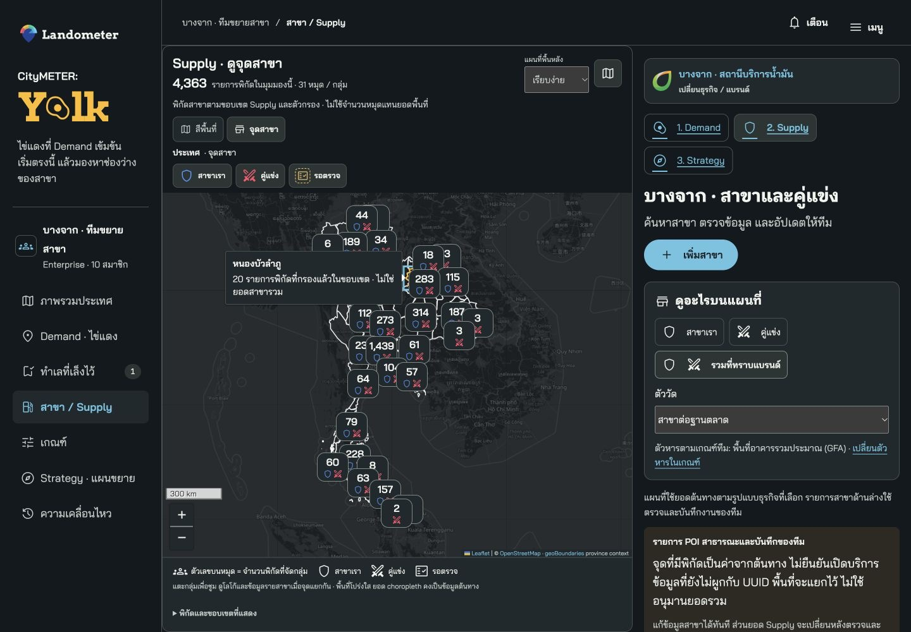

เล็งทำเล: เห็นผลบันทึกและลิงก์ปลายทาง Shortlist จำนวนมาจากรายการที่บันทึกจริง ไม่ใช่ค่าจาก animation

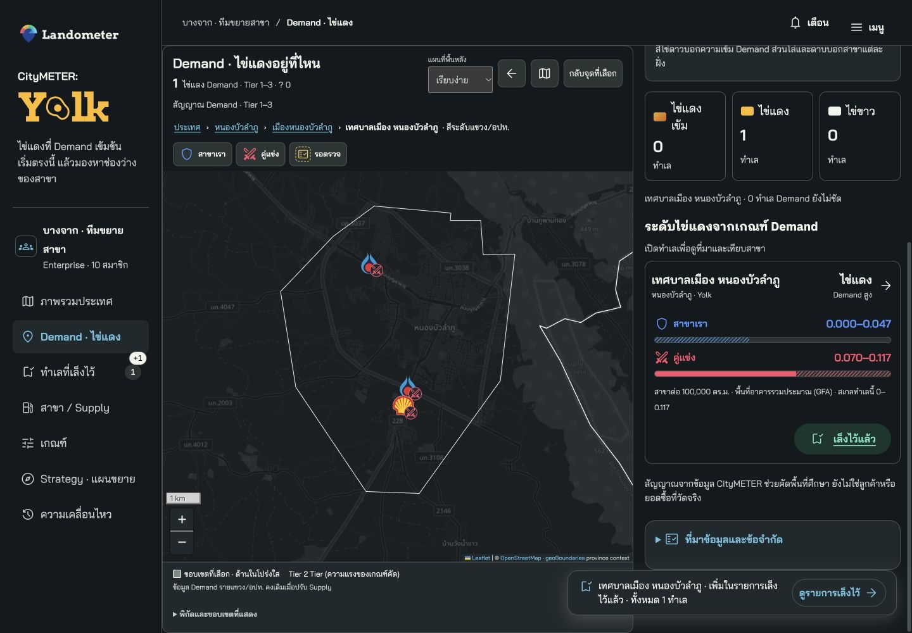

ภาพเหล่านี้เป็น interaction รุ่น 1.9.1 ที่คงไว้ ไม่ใช่หลักฐานตรวจ artwork/icon รุ่น 1.9.2 ภาพ desktop มาจาก 1440×1000 ใน local native browser ไม่พิสูจน์ production backend หรือมือถือเครื่องจริง

### Artwork ที่รับจากเจ้าของ ·1.9.2

Villa Market, Lawson108 และ Tops ใช้ PNG ต้นฉบับที่เจ้าของส่ง ไฟล์ทั้งสามมีสัดส่วนต้นฉบับต่างกัน จึงวางด้วย contain ในช่องโลโก้ขนาดกะทัดรัด พร้อมชื่อแบรนด์ ไม่ตัด wordmark หรือสร้างภาพ square ขึ้นใหม่ ข้อมูล preset และจำนวนสาขาไม่เปลี่ยน

[Asset receipt](evidence/owner-supplied-brand-artwork.v1.9.2.json) ระบุขนาด/bytes/SHA และ provenance จริง Registry โหลดจาก `prototype/bootstrap.js` ตรวจภาพที่แสดงบนแต่ละ theme แยกจากการตรวจ bytes; native review รุ่นนี้ผ่านแบบจำกัดตาม [receipt](evidence/browser-v1.9.2/native-browser-review.json)

### การอ่านโลโก้ในแต่ละ theme

Villa Market ใช้ PNG ต้นฉบับใน light theme ส่วน dark ใช้ไอคอนร้านค้ากลางพร้อมชื่อ Villa Market ที่อ่านชัด เพราะภาพสีม่วงเดิมอ่านไม่ชัดบนพื้นเข้ม การแสดงต้นฉบับบน dark ไม่ผ่านและไม่ถูกอ้างว่า PASS ไม่เพิ่มกรอบหรือพื้นรองโลโก้ ไม่เปลี่ยนสี/crop และไม่กลับไปใช้เครื่องหมายรถเข็นเก่า Lawson108 และ Tops ใช้ PNG ต้นฉบับทั้งสอง theme การตรวจ fallback ผ่านแบบจำกัดตาม native receipt รุ่น 1.9.2 ที่คงไว้ ไม่ใช่การเพิ่ม coverage ของทุกแบรนด์ใน 1.9.4

### ภาพอ้างอิงแบรนด์/controls รุ่น 1.9.2 · ประวัติ

ภาพต่อไปนี้เป็น reference ของ identity/controls รุ่น1.9.2 เท่านั้น ไม่ใช่การตรวจรับ first-page/map/layout ของ 1.9.4 ใช้ current native receipt แยกในส่วนถัดไป

Supply บนมือถือ: ปุ่มขึ้นบรรทัดใหม่ แยกไอคอน ข้อความ และจำนวน

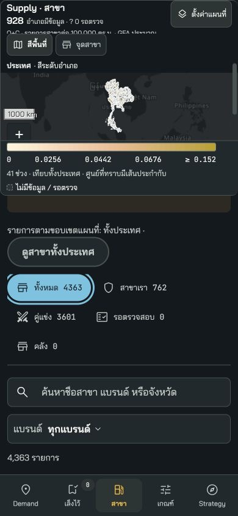

Tops POI: โลโก้จริงพร้อมชื่อแบรนด์และประเภทสาขา

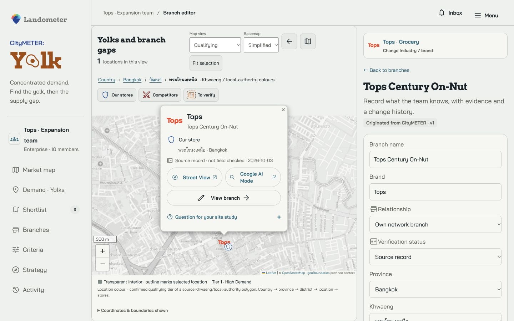

Villa Market ใน dark: ใช้ไอคอนร้านค้ากลางพร้อมชื่อที่อ่านชัด

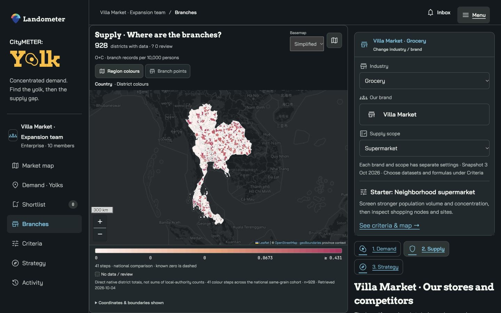

### หลักฐานรุ่น 1.9.3 · ประวัติสำหรับเปรียบเทียบ

รุ่นก่อนผ่านแบบจำกัด 32 suites / 537 reported cases และ 22 native checks ดู [receipt เดิม](evidence/qa-v1.9.3.json). การอ้างนี้ไม่เป็นผลตรวจของ 1.9.4 รุ่นปัจจุบันใช้ [QA](evidence/qa-v1.9.4.json), [native review](evidence/browser-v1.9.4/native-browser-review.json) และ [release state](contracts/release.v1.9.4.json) เมื่อสร้างหลักฐานจริงแล้ว

### ภาพตัวอย่างรุ่น 1.9.3 · ประวัติ

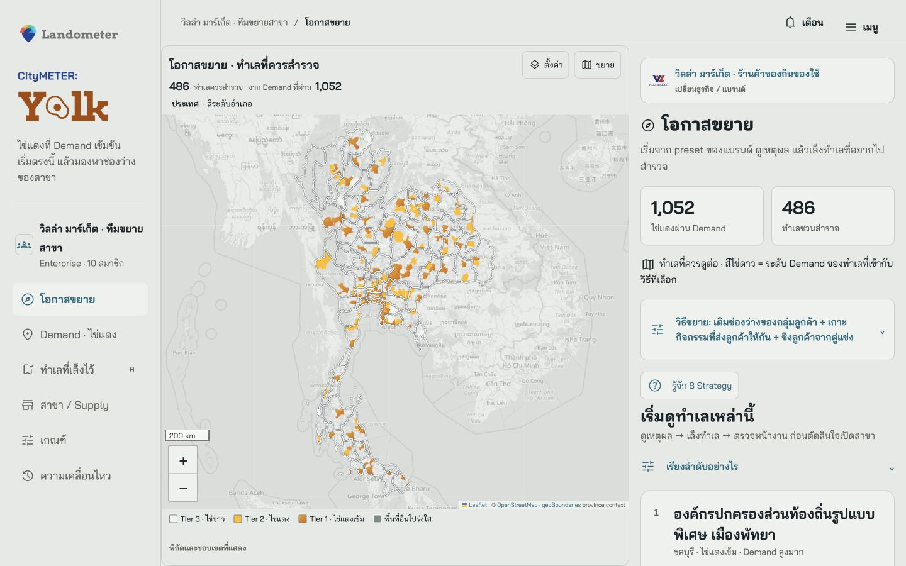

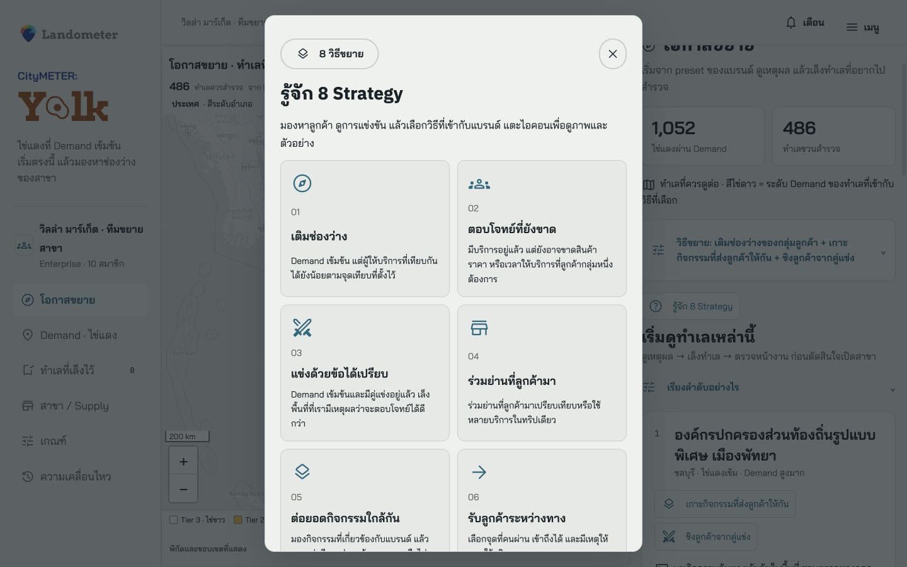

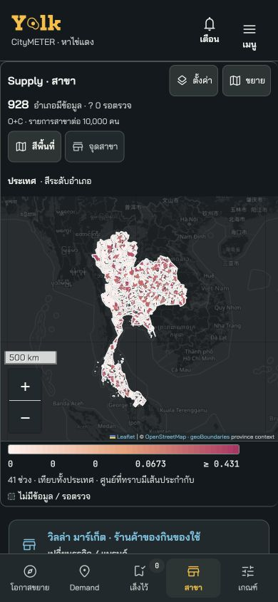

ภาพเป็น local native review ตาม viewport ที่ระบุ ตัวอย่างใน guide เป็นสมมติ ไม่ใช่ผลธุรกิจจริง


### Current map-space snapshots1.9.4

Current recorded browser evidence; native viewport review is not physical-device certification.

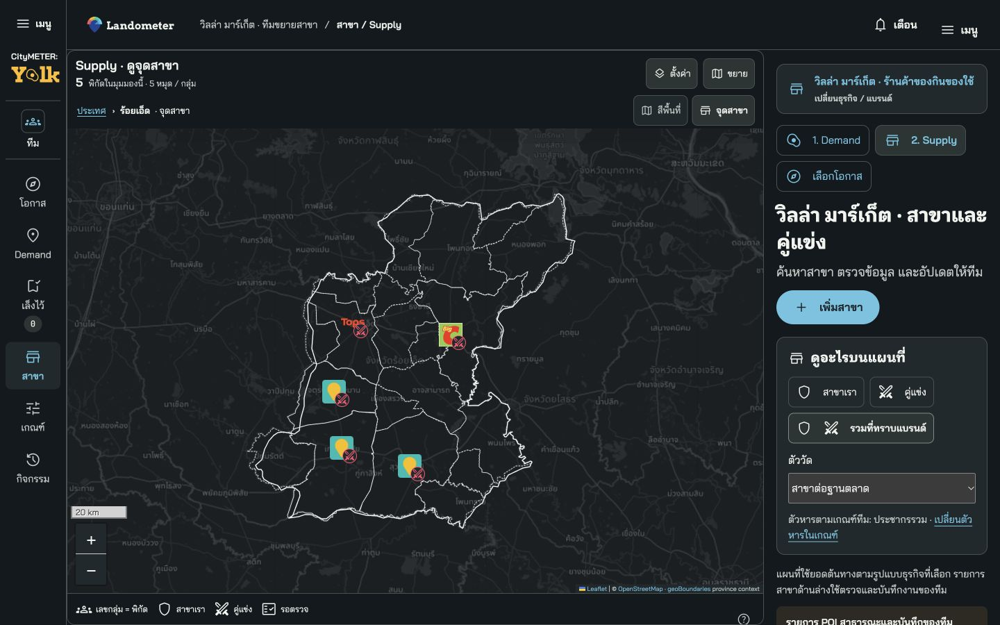

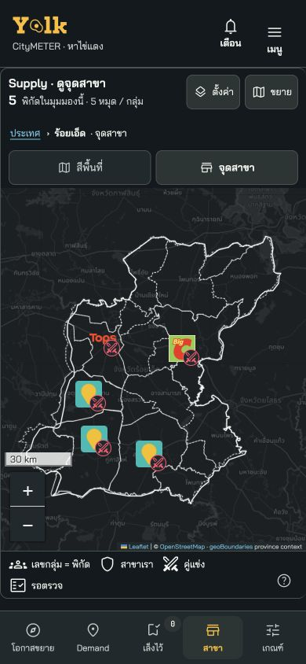

## 14. Machine-readable blueprint ฉบับเต็ม

JSON ท้ายไฟล์ตรงกับ [contracts/full-product.v1.9.4.json](contracts/full-product.v1.9.4.json) มี metric formulas, preset authority, schema, API และงาน T00–T24 ครบ รวม projection ของ bilingual Strategy guide เพื่อให้อ่านไฟล์เดียวได้ ส่วน narrative registry เป็น authority และต้องตรงกัน เลือก codingPrompt ทีละ task ตาม dependencies พร้อมตรวจ acceptance ก่อนทำต่อ

```json
{
  "schemaVersion": "yolk.full-product-and-implementation/1.9.4",
  "version": "1.9.4",
  "date": "2026-10-08",
  "status": "locally_verified_static_preview_complete_production_plan_publication_pending",
  "humanDocument": "CityMETER_Yolk_Full_Product_and_Implementation_v1.9.4.md",
  "product": {
    "name": "CityMETER: Yolk",
    "tagline": {
      "en": "Find the yolk. Grow your market.",
      "th": "หาไข่แดง ขยายตลาด"
    },
    "statement": {
      "who": "Expansion, strategy, brand and field teams in multi-branch businesses. Initial supported industries: fuel, grocery and Nonbank.",
      "what": "Open an evidence-limited queue of expansion locations using the selected brand preset; inspect high proxy Demand, relevant source-scope Supply and selected strategies, then save an owned fieldwork plan.",
      "why": "Start from CityMETER national data and researched starter profiles; invest verified team data to improve decisions and reproducibility.",
      "which": "The same expansion job is currently done across Google Maps/Street View + Excel/Sheets + official locators + local field knowledge + LINE/email coordination. These competing workflows lack one shared versioned decision context.",
      "how": [
        "Choose industry / brand / important format or product scope",
        "Open Expansion opportunities with the existing starter or saved preset",
        "Inspect candidate reasons, missing evidence and first field task; choose at most3 strategies within this page",
        "Investigate dedicated Demand and Supply views when needed; preview parameter changes on the same map",
        "Shortlist with evidence, source/criteria/profile versions, next task and owner",
        "Validate actual sites before investment"
      ],
      "success": "Time to an explained shortlist and an owned field task; reproduction of decisions; fewer conclusions reversed after field evidence. Pilot baseline needed before numeric success promises."
    }
  },
  "scope": {
    "industries": [
      "fuel",
      "grocery",
      "nonbank"
    ],
    "selectableBrands": 37,
    "presetFamilies": 9,
    "nonbankSelectable": 10,
    "workspaceSeats": {
      "admin": 1,
      "editor": 3,
      "viewer": 6
    },
    "maximumJointChoices": {
      "enabledDemandFactorFamilies": 3,
      "distinctMetricsPerFactor": 3,
      "conditionsPerJointPath": 3,
      "selectedStrategies": 3,
      "rankingWeights": 3
    },
    "phases": [
      {
        "id": "P0",
        "dataReadiness": "existing_CityMETER",
        "scope": "Three-industry Demand paths, current source-scope Supply, strategy survey queues 1/3/5/7, unresolved guides 2/4/6/8, shortlist and evidence tasks",
        "productionDependency": "Shared workspace still requires auth/datastore/revision/outbox implementations; static browser-local preview does not prove these."
      },
      {
        "id": "P1",
        "dataReadiness": "additional_verified_anchor_and_field_evidence",
        "scope": "Hospital/school/other anchor POI adapters, rights and crosswalk; branch offerings/prices/hours/customer occasions; candidate-site records and physical-cluster studies",
        "productionDependency": "Evidence schema, field collection and governed source reconciliation."
      },
      {
        "id": "P2",
        "dataReadiness": "directed_network_and_future_evidence",
        "scope": "Routes/daypart/access/pass-stop-buy, verified future milestones and holding-cost watchlist separate from current Yolks",
        "productionDependency": "Versioned routing service and future project evidence."
      },
      {
        "id": "P3",
        "dataReadiness": "private_brand_operational_data",
        "scope": "Sales by branch/transaction, customer occasions, capacity/costs, own-network displacement, outcome calibration",
        "productionDependency": "Private connectors, minimization/permissions, restricted access, holdout validation."
      }
    ],
    "separateDeliveryAxis": "Data P0–P3 is not shared-backend implementation maturity. Browser-local preview never proves authenticated multi-user production."
  },
  "authority": {
    "currentSource": "Owner instructions + current source implementation + referenced contracts. Attached proposal is evidence only.",
    "baseDS": {
      "path": "reference/lds-0.9.7/Landometer-Design-System-v0.9.7.md",
      "documentId": "lds-0.9.7-landometer-standalone-r1",
      "sha256": "d3085cbc0a50195f1cbf0c77b1d77c0d19b84364daf2948eb367348d65432d96"
    },
    "locationProfile": {
      "path": "reference/lds-0.9.7/Location-Intelligence-Profile-for-LDS-v0.9.7.md",
      "documentId": "location-intelligence-profile-lds-0.9.7-r1",
      "sha256": "5d4856041709735d3a04d4a510a88b551df86c211fdcab8a0707e8fe7c9efc3b"
    },
    "retainedHistorical": "1.8.0 source contracts/formulas only where named. Old8patterns are inert, not eightnewstrategies. Legacy fuel6activityvotes are not equivalent to1.9factorpaths.",
    "assetIntegration": "DS_ASSET_INTEGRATION.md; actual release asset index and runtime hash manifest. Do not invent replacements.",
    "semanticBaseline": {
      "criteriaModeVersion": "1.9.0",
      "profileVersion": "1.9.0",
      "engineVersion": "1.9.0",
      "strategyContract": "contracts/opportunity-strategies.v1.9.0.json",
      "runtimeProfiles": "prototype/data/brand-strategy-profiles.v1.9.0.json",
      "meaning": "1.9.4 changes map-space presentation only;1.9.3 first-page/guide,1.9.0 analytical/profile/engine/strategy,1.9.1 interaction and1.9.2 brand identity are retained."
    },
    "interactionExtension": "contracts/interaction-guidance.v1.9.1.json",
    "brandIdentityUIExtension": "contracts/brand-identity-ui.v1.9.2.json",
    "expansionExperienceExtension": "contracts/expansion-experience.v1.9.3.json",
    "strategyGuide": "prototype/data/strategy-guide.v1.9.3.json",
    "mapSpaceExtension": "contracts/map-space.v1.9.4.json"
  },
  "source": {
    "fixedUniverse": 7954,
    "bkkKhwaeng": 180,
    "upcountryReportingLAO": 7774,
    "nativeDistricts": 928,
    "displayMultiDistrictLinks": 45,
    "uuidJoin": "Exact reporting UUID only; no name or extent allocation; display crosswalk is not statutory membership.",
    "areaDenominator": "Raw source areaSqm /1e6; never simplified display polygon area.",
    "metrics": [
      {
        "id": "population",
        "name": {
          "th": "ประชากรรวม",
          "en": "Total population"
        },
        "datasetId": "population",
        "unit": "persons",
        "formula": "sum(ms)+sum(fs)",
        "formulaAST": {
          "op": "add",
          "args": [
            {
              "op": "sum",
              "field": "ms"
            },
            {
              "op": "sum",
              "field": "fs"
            }
          ]
        },
        "sourceFields": [
          "population.ms",
          "population.fs"
        ],
        "sourceRowPaths": [
          {
            "qualifiedField": "population.ms",
            "paths": [
              "value.subdistrictDatas[area_uuid].rows[].ms",
              "value.municipalityDatas[area_uuid].rows[].ms"
            ]
          },
          {
            "qualifiedField": "population.fs",
            "paths": [
              "value.subdistrictDatas[area_uuid].rows[].fs",
              "value.municipalityDatas[area_uuid].rows[].fs"
            ]
          }
        ],
        "sourcePeriod": "2026-08",
        "measurement": "reported_context",
        "coverage": {
          "cohortId": "national_7954",
          "nTotal": 7954,
          "nValid": 7830,
          "nUnknown": 124,
          "nNotApplicable": 0,
          "nExplicitZero": 2
        },
        "denominator": null,
        "missingPolicy": "null; absent is not zero; use exactly selected source period"
      },
      {
        "id": "population_per_km2",
        "name": {
          "th": "ความหนาแน่นประชากร",
          "en": "Population density"
        },
        "datasetId": "population",
        "unit": "persons/km2",
        "formula": "numerator / land_area_km2",
        "formulaAST": {
          "op": "divide",
          "args": [
            {
              "metric": "population_count"
            },
            {
              "op": "divide",
              "args": [
                {
                  "field": "base.areaSqm"
                },
                {
                  "const": 1000000
                }
              ]
            }
          ],
          "denominator_must_be_positive": true,
          "invalid_result": "unknown"
        },
        "sourceFields": [
          "population.ms",
          "population.fs",
          "base.areaSqm"
        ],
        "sourceRowPaths": [
          {
            "qualifiedField": "population.ms",
            "paths": [
              "value.subdistrictDatas[area_uuid].rows[].ms",
              "value.municipalityDatas[area_uuid].rows[].ms"
            ]
          },
          {
            "qualifiedField": "population.fs",
            "paths": [
              "value.subdistrictDatas[area_uuid].rows[].fs",
              "value.municipalityDatas[area_uuid].rows[].fs"
            ]
          },
          {
            "qualifiedField": "base.areaSqm",
            "paths": [
              "value.subdistrictInfos[id=area_uuid].areaSqm",
              "value.municipalityInfos[id=area_uuid].areaSqm"
            ]
          }
        ],
        "sourcePeriod": "2026-08",
        "measurement": "derived_context",
        "coverage": {
          "cohortId": "national_7954",
          "nTotal": 7954,
          "nValid": 7830,
          "nUnknown": 124,
          "nNotApplicable": 0,
          "nExplicitZero": 2
        },
        "denominator": "base.areaSqm / 1000000",
        "missingPolicy": "null; absent is not zero; use exactly selected source period"
      },
      {
        "id": "working_age_15_64",
        "name": {
          "th": "ประชากรอายุ 15–64 ปี",
          "en": "Population aged 15–64"
        },
        "datasetId": "population",
        "unit": "persons",
        "formula": "sum(ms[15:65])+sum(fs[15:65])",
        "formulaAST": {
          "op": "add",
          "args": [
            {
              "op": "sum",
              "arg": {
                "op": "slice",
                "field": "ms",
                "start": 15,
                "endExclusive": 65
              }
            },
            {
              "op": "sum",
              "arg": {
                "op": "slice",
                "field": "fs",
                "start": 15,
                "endExclusive": 65
              }
            }
          ]
        },
        "sourceFields": [
          "population.ms",
          "population.fs"
        ],
        "sourceRowPaths": [
          {
            "qualifiedField": "population.ms",
            "paths": [
              "value.subdistrictDatas[area_uuid].rows[].ms",
              "value.municipalityDatas[area_uuid].rows[].ms"
            ]
          },
          {
            "qualifiedField": "population.fs",
            "paths": [
              "value.subdistrictDatas[area_uuid].rows[].fs",
              "value.municipalityDatas[area_uuid].rows[].fs"
            ]
          }
        ],
        "sourcePeriod": "2026-08",
        "measurement": "derived_context",
        "coverage": {
          "cohortId": "national_7954",
          "nTotal": 7954,
          "nValid": 7830,
          "nUnknown": 124,
          "nNotApplicable": 0,
          "nExplicitZero": 2
        },
        "denominator": null,
        "missingPolicy": "null; absent is not zero; use exactly selected source period"
      },
      {
        "id": "working_age_15_64_per_km2",
        "name": {
          "th": "ความหนาแน่นประชากรอายุ 15–64 ปี",
          "en": "Density of population aged 15–64"
        },
        "datasetId": "population",
        "unit": "persons/km2",
        "formula": "numerator / land_area_km2",
        "formulaAST": {
          "op": "divide",
          "args": [
            {
              "metric": "working_age_15_64"
            },
            {
              "op": "divide",
              "args": [
                {
                  "field": "base.areaSqm"
                },
                {
                  "const": 1000000
                }
              ]
            }
          ],
          "denominator_must_be_positive": true,
          "invalid_result": "unknown"
        },
        "sourceFields": [
          "population.ms",
          "population.fs",
          "base.areaSqm"
        ],
        "sourceRowPaths": [
          {
            "qualifiedField": "population.ms",
            "paths": [
              "value.subdistrictDatas[area_uuid].rows[].ms",
              "value.municipalityDatas[area_uuid].rows[].ms"
            ]
          },
          {
            "qualifiedField": "population.fs",
            "paths": [
              "value.subdistrictDatas[area_uuid].rows[].fs",
              "value.municipalityDatas[area_uuid].rows[].fs"
            ]
          },
          {
            "qualifiedField": "base.areaSqm",
            "paths": [
              "value.subdistrictInfos[id=area_uuid].areaSqm",
              "value.municipalityInfos[id=area_uuid].areaSqm"
            ]
          }
        ],
        "sourcePeriod": "2026-08",
        "measurement": "derived_context",
        "coverage": {
          "cohortId": "national_7954",
          "nTotal": 7954,
          "nValid": 7830,
          "nUnknown": 124,
          "nNotApplicable": 0,
          "nExplicitZero": 2
        },
        "denominator": "base.areaSqm / 1000000",
        "missingPolicy": "null; absent is not zero; use exactly selected source period"
      },
      {
        "id": "adult_population_20_64",
        "name": {
          "th": "ประชากรอายุ 20–64 ปี",
          "en": "Population aged 20–64"
        },
        "datasetId": "population",
        "unit": "persons",
        "formula": "sum(ms[20:65])+sum(fs[20:65])",
        "formulaAST": {
          "op": "add",
          "args": [
            {
              "op": "sum",
              "arg": {
                "op": "slice",
                "field": "ms",
                "start": 20,
                "endExclusive": 65
              }
            },
            {
              "op": "sum",
              "arg": {
                "op": "slice",
                "field": "fs",
                "start": 20,
                "endExclusive": 65
              }
            }
          ]
        },
        "sourceFields": [
          "population.ms",
          "population.fs"
        ],
        "sourceRowPaths": [
          {
            "qualifiedField": "population.ms",
            "paths": [
              "value.subdistrictDatas[area_uuid].rows[].ms",
              "value.municipalityDatas[area_uuid].rows[].ms"
            ]
          },
          {
            "qualifiedField": "population.fs",
            "paths": [
              "value.subdistrictDatas[area_uuid].rows[].fs",
              "value.municipalityDatas[area_uuid].rows[].fs"
            ]
          }
        ],
        "sourcePeriod": "2026-08",
        "measurement": "derived_context",
        "coverage": {
          "cohortId": "national_7954",
          "nTotal": 7954,
          "nValid": 7830,
          "nUnknown": 124,
          "nNotApplicable": 0,
          "nExplicitZero": 2
        },
        "denominator": null,
        "missingPolicy": "null; absent is not zero; use exactly selected source period"
      },
      {
        "id": "adult_population_20_64_per_km2",
        "name": {
          "th": "ความหนาแน่นประชากรอายุ 20–64 ปี",
          "en": "Density of population aged 20–64"
        },
        "datasetId": "population",
        "unit": "persons/km2",
        "formula": "numerator / land_area_km2",
        "formulaAST": {
          "op": "divide",
          "args": [
            {
              "metric": "adult_population_20_64"
            },
            {
              "op": "divide",
              "args": [
                {
                  "field": "base.areaSqm"
                },
                {
                  "const": 1000000
                }
              ]
            }
          ],
          "denominator_must_be_positive": true,
          "invalid_result": "unknown"
        },
        "sourceFields": [
          "population.ms",
          "population.fs",
          "base.areaSqm"
        ],
        "sourceRowPaths": [
          {
            "qualifiedField": "population.ms",
            "paths": [
              "value.subdistrictDatas[area_uuid].rows[].ms",
              "value.municipalityDatas[area_uuid].rows[].ms"
            ]
          },
          {
            "qualifiedField": "population.fs",
            "paths": [
              "value.subdistrictDatas[area_uuid].rows[].fs",
              "value.municipalityDatas[area_uuid].rows[].fs"
            ]
          },
          {
            "qualifiedField": "base.areaSqm",
            "paths": [
              "value.subdistrictInfos[id=area_uuid].areaSqm",
              "value.municipalityInfos[id=area_uuid].areaSqm"
            ]
          }
        ],
        "sourcePeriod": "2026-08",
        "measurement": "derived_context",
        "coverage": {
          "cohortId": "national_7954",
          "nTotal": 7954,
          "nValid": 7830,
          "nUnknown": 124,
          "nNotApplicable": 0,
          "nExplicitZero": 2
        },
        "denominator": "base.areaSqm / 1000000",
        "missingPolicy": "null; absent is not zero; use exactly selected source period"
      },
      {
        "id": "children_0_14",
        "name": {
          "th": "ประชากรอายุ 0–14 ปี",
          "en": "Population aged 0–14"
        },
        "datasetId": "population",
        "unit": "persons",
        "formula": "sum(ms[0:15])+sum(fs[0:15])",
        "formulaAST": {
          "op": "add",
          "args": [
            {
              "op": "sum",
              "arg": {
                "op": "slice",
                "field": "ms",
                "start": 0,
                "endExclusive": 15
              }
            },
            {
              "op": "sum",
              "arg": {
                "op": "slice",
                "field": "fs",
                "start": 0,
                "endExclusive": 15
              }
            }
          ]
        },
        "sourceFields": [
          "population.ms",
          "population.fs"
        ],
        "sourceRowPaths": [
          {
            "qualifiedField": "population.ms",
            "paths": [
              "value.subdistrictDatas[area_uuid].rows[].ms",
              "value.municipalityDatas[area_uuid].rows[].ms"
            ]
          },
          {
            "qualifiedField": "population.fs",
            "paths": [
              "value.subdistrictDatas[area_uuid].rows[].fs",
              "value.municipalityDatas[area_uuid].rows[].fs"
            ]
          }
        ],
        "sourcePeriod": "2026-08",
        "measurement": "derived_context",
        "coverage": {
          "cohortId": "national_7954",
          "nTotal": 7954,
          "nValid": 7830,
          "nUnknown": 124,
          "nNotApplicable": 0,
          "nExplicitZero": 2
        },
        "denominator": null,
        "missingPolicy": "null; absent is not zero; use exactly selected source period"
      },
      {
        "id": "population_65_plus",
        "name": {
          "th": "ประชากรอายุ 65 ปีขึ้นไป",
          "en": "Population aged 65 and over"
        },
        "datasetId": "population",
        "unit": "persons",
        "formula": "sum(ms[65:])+sum(fs[65:])",
        "formulaAST": {
          "op": "add",
          "args": [
            {
              "op": "sum",
              "arg": {
                "op": "slice",
                "field": "ms",
                "start": 65
              }
            },
            {
              "op": "sum",
              "arg": {
                "op": "slice",
                "field": "fs",
                "start": 65
              }
            }
          ]
        },
        "sourceFields": [
          "population.ms",
          "population.fs"
        ],
        "sourceRowPaths": [
          {
            "qualifiedField": "population.ms",
            "paths": [
              "value.subdistrictDatas[area_uuid].rows[].ms",
              "value.municipalityDatas[area_uuid].rows[].ms"
            ]
          },
          {
            "qualifiedField": "population.fs",
            "paths": [
              "value.subdistrictDatas[area_uuid].rows[].fs",
              "value.municipalityDatas[area_uuid].rows[].fs"
            ]
          }
        ],
        "sourcePeriod": "2026-08",
        "measurement": "derived_context",
        "coverage": {
          "cohortId": "national_7954",
          "nTotal": 7954,
          "nValid": 7830,
          "nUnknown": 124,
          "nNotApplicable": 0,
          "nExplicitZero": 4
        },
        "denominator": null,
        "missingPolicy": "null; absent is not zero; use exactly selected source period"
      },
      {
        "id": "gfa",
        "name": {
          "th": "พื้นที่อาคารรวมประมาณ (GFA)",
          "en": "Estimated gross floor area (GFA)"
        },
        "datasetId": "building",
        "unit": "estimated m2 GFA",
        "formula": "area",
        "formulaAST": {
          "field": "area",
          "selector": {
            "v": "V4"
          }
        },
        "sourceFields": [
          "building.area"
        ],
        "sourceRowPaths": [
          {
            "qualifiedField": "building.area",
            "paths": [
              "value.subdistrictDatas[area_uuid].rows[].area",
              "value.municipalityDatas[area_uuid].rows[].area"
            ]
          }
        ],
        "sourcePeriod": "V4 / published UI label 2024-12",
        "measurement": "model_estimate",
        "coverage": {
          "cohortId": "national_7954",
          "nTotal": 7954,
          "nValid": 7939,
          "nUnknown": 15,
          "nNotApplicable": 0,
          "nExplicitZero": 0
        },
        "denominator": null,
        "missingPolicy": "null; absent is not zero; use exactly selected source period"
      },
      {
        "id": "building_count",
        "name": {
          "th": "จำนวนรายการอาคารจากแบบจำลอง",
          "en": "Modeled building record count"
        },
        "datasetId": "building",
        "unit": "modeled building records",
        "formula": "count",
        "formulaAST": {
          "field": "count",
          "selector": {
            "v": "V4"
          }
        },
        "sourceFields": [
          "building.count"
        ],
        "sourceRowPaths": [
          {
            "qualifiedField": "building.count",
            "paths": [
              "value.subdistrictDatas[area_uuid].rows[].count",
              "value.municipalityDatas[area_uuid].rows[].count"
            ]
          }
        ],
        "sourcePeriod": "V4 / published UI label 2024-12",
        "measurement": "model_estimate",
        "coverage": {
          "cohortId": "national_7954",
          "nTotal": 7954,
          "nValid": 7939,
          "nUnknown": 15,
          "nNotApplicable": 0,
          "nExplicitZero": 0
        },
        "denominator": null,
        "missingPolicy": "null; absent is not zero; use exactly selected source period"
      },
      {
        "id": "gfa_per_km2",
        "name": {
          "th": "ความหนาแน่นพื้นที่อาคารรวมประมาณ",
          "en": "Estimated GFA density"
        },
        "datasetId": "building",
        "unit": "estimated m2 GFA/km2",
        "formula": "numerator / land_area_km2",
        "formulaAST": {
          "op": "divide",
          "args": [
            {
              "metric": "building_gfa_m2"
            },
            {
              "op": "divide",
              "args": [
                {
                  "field": "base.areaSqm"
                },
                {
                  "const": 1000000
                }
              ]
            }
          ],
          "denominator_must_be_positive": true,
          "invalid_result": "unknown"
        },
        "sourceFields": [
          "building.area",
          "base.areaSqm"
        ],
        "sourceRowPaths": [
          {
            "qualifiedField": "building.area",
            "paths": [
              "value.subdistrictDatas[area_uuid].rows[].area",
              "value.municipalityDatas[area_uuid].rows[].area"
            ]
          },
          {
            "qualifiedField": "base.areaSqm",
            "paths": [
              "value.subdistrictInfos[id=area_uuid].areaSqm",
              "value.municipalityInfos[id=area_uuid].areaSqm"
            ]
          }
        ],
        "sourcePeriod": "V4 / published UI label 2024-12",
        "measurement": "derived_model_estimate",
        "coverage": {
          "cohortId": "national_7954",
          "nTotal": 7954,
          "nValid": 7939,
          "nUnknown": 15,
          "nNotApplicable": 0,
          "nExplicitZero": 0
        },
        "denominator": "base.areaSqm / 1000000",
        "missingPolicy": "null; absent is not zero; use exactly selected source period"
      },
      {
        "id": "gfa_per_person",
        "name": {
          "th": "พื้นที่อาคารรวมประมาณต่อประชากร",
          "en": "Estimated GFA per person"
        },
        "datasetId": "building",
        "unit": "estimated m2 GFA/person",
        "formula": "building.area / (sum(population.ms)+sum(population.fs))",
        "formulaAST": {
          "op": "divide",
          "args": [
            {
              "metric": "building_gfa_m2"
            },
            {
              "metric": "population_count"
            }
          ],
          "denominator_must_be_positive": true,
          "invalid_result": "unknown"
        },
        "sourceFields": [
          "building.area",
          "population.ms",
          "population.fs"
        ],
        "sourceRowPaths": [
          {
            "qualifiedField": "building.area",
            "paths": [
              "value.subdistrictDatas[area_uuid].rows[].area",
              "value.municipalityDatas[area_uuid].rows[].area"
            ]
          },
          {
            "qualifiedField": "population.ms",
            "paths": [
              "value.subdistrictDatas[area_uuid].rows[].ms",
              "value.municipalityDatas[area_uuid].rows[].ms"
            ]
          },
          {
            "qualifiedField": "population.fs",
            "paths": [
              "value.subdistrictDatas[area_uuid].rows[].fs",
              "value.municipalityDatas[area_uuid].rows[].fs"
            ]
          }
        ],
        "sourcePeriod": "V4 / published UI label 2024-12",
        "measurement": "derived_model_estimate",
        "coverage": {
          "cohortId": "national_7954",
          "nTotal": 7954,
          "nValid": 7828,
          "nUnknown": 126,
          "nNotApplicable": 0,
          "nExplicitZero": 0
        },
        "denominator": "population_count",
        "missingPolicy": "null; absent is not zero; use exactly selected source period"
      },
      {
        "id": "factory_count",
        "name": {
          "th": "จำนวนโรงงานในทะเบียน ACTIVE",
          "en": "ACTIVE registry factory count"
        },
        "datasetId": "factory",
        "unit": "registered factory records",
        "formula": "totalFactory",
        "formulaAST": {
          "field": "totalFactory",
          "selector": {
            "y": 2025,
            "m": 4,
            "factory_status": "ACTIVE"
          }
        },
        "sourceFields": [
          "factory.active.totalFactory"
        ],
        "sourceRowPaths": [
          {
            "qualifiedField": "factory.active.totalFactory",
            "paths": [
              "value.subdistrictDatas[area_uuid].rows[].totalFactory",
              "value.municipalityDatas[area_uuid].rows[].totalFactory"
            ]
          }
        ],
        "sourcePeriod": "2025-04 ACTIVE",
        "measurement": "reported_context",
        "coverage": {
          "cohortId": "national_7954",
          "nTotal": 7954,
          "nValid": 5822,
          "nUnknown": 2132,
          "nNotApplicable": 0,
          "nExplicitZero": 0
        },
        "denominator": null,
        "missingPolicy": "null; absent is not zero; use exactly selected source period"
      },
      {
        "id": "factory_count_per_km2",
        "name": {
          "th": "ความหนาแน่นโรงงานในทะเบียน ACTIVE",
          "en": "ACTIVE registry factory density"
        },
        "datasetId": "factory",
        "unit": "factory records/km2",
        "formula": "numerator / land_area_km2",
        "formulaAST": {
          "op": "divide",
          "args": [
            {
              "metric": "factory_count"
            },
            {
              "op": "divide",
              "args": [
                {
                  "field": "base.areaSqm"
                },
                {
                  "const": 1000000
                }
              ]
            }
          ],
          "denominator_must_be_positive": true,
          "invalid_result": "unknown"
        },
        "sourceFields": [
          "factory.active.totalFactory",
          "base.areaSqm"
        ],
        "sourceRowPaths": [
          {
            "qualifiedField": "factory.active.totalFactory",
            "paths": [
              "value.subdistrictDatas[area_uuid].rows[].totalFactory",
              "value.municipalityDatas[area_uuid].rows[].totalFactory"
            ]
          },
          {
            "qualifiedField": "base.areaSqm",
            "paths": [
              "value.subdistrictInfos[id=area_uuid].areaSqm",
              "value.municipalityInfos[id=area_uuid].areaSqm"
            ]
          }
        ],
        "sourcePeriod": "2025-04 ACTIVE",
        "measurement": "derived_context",
        "coverage": {
          "cohortId": "national_7954",
          "nTotal": 7954,
          "nValid": 5822,
          "nUnknown": 2132,
          "nNotApplicable": 0,
          "nExplicitZero": 0
        },
        "denominator": "base.areaSqm / 1000000",
        "missingPolicy": "null; absent is not zero; use exactly selected source period"
      },
      {
        "id": "factory_workers",
        "name": {
          "th": "คนงานโรงงานที่ต้นทางรายงาน",
          "en": "Source-reported factory workers"
        },
        "datasetId": "factory",
        "unit": "reported workers",
        "formula": "totalWorker",
        "formulaAST": {
          "field": "totalWorker",
          "selector": {
            "y": 2025,
            "m": 4,
            "factory_status": "ACTIVE"
          }
        },
        "sourceFields": [
          "factory.active.totalWorker"
        ],
        "sourceRowPaths": [
          {
            "qualifiedField": "factory.active.totalWorker",
            "paths": [
              "value.subdistrictDatas[area_uuid].rows[].totalWorker",
              "value.municipalityDatas[area_uuid].rows[].totalWorker"
            ]
          }
        ],
        "sourcePeriod": "2025-04 ACTIVE",
        "measurement": "reported_context",
        "coverage": {
          "cohortId": "national_7954",
          "nTotal": 7954,
          "nValid": 5822,
          "nUnknown": 2132,
          "nNotApplicable": 0,
          "nExplicitZero": 13
        },
        "denominator": null,
        "missingPolicy": "null; absent is not zero; use exactly selected source period"
      },
      {
        "id": "factory_workers_per_km2",
        "name": {
          "th": "ความหนาแน่นคนงานโรงงานที่รายงาน",
          "en": "Density of reported factory workers"
        },
        "datasetId": "factory",
        "unit": "reported workers/km2",
        "formula": "numerator / land_area_km2",
        "formulaAST": {
          "op": "divide",
          "args": [
            {
              "metric": "factory_workers"
            },
            {
              "op": "divide",
              "args": [
                {
                  "field": "base.areaSqm"
                },
                {
                  "const": 1000000
                }
              ]
            }
          ],
          "denominator_must_be_positive": true,
          "invalid_result": "unknown"
        },
        "sourceFields": [
          "factory.active.totalWorker",
          "base.areaSqm"
        ],
        "sourceRowPaths": [
          {
            "qualifiedField": "factory.active.totalWorker",
            "paths": [
              "value.subdistrictDatas[area_uuid].rows[].totalWorker",
              "value.municipalityDatas[area_uuid].rows[].totalWorker"
            ]
          },
          {
            "qualifiedField": "base.areaSqm",
            "paths": [
              "value.subdistrictInfos[id=area_uuid].areaSqm",
              "value.municipalityInfos[id=area_uuid].areaSqm"
            ]
          }
        ],
        "sourcePeriod": "2025-04 ACTIVE",
        "measurement": "derived_context",
        "coverage": {
          "cohortId": "national_7954",
          "nTotal": 7954,
          "nValid": 5822,
          "nUnknown": 2132,
          "nNotApplicable": 0,
          "nExplicitZero": 13
        },
        "denominator": "base.areaSqm / 1000000",
        "missingPolicy": "null; absent is not zero; use exactly selected source period"
      },
      {
        "id": "hotel_count",
        "name": {
          "th": "จำนวนรายการโรงแรม",
          "en": "Hotel catalogue count"
        },
        "datasetId": "hotel",
        "unit": "catalog hotel records",
        "formula": "hotelCount",
        "formulaAST": {
          "field": "hotelCount"
        },
        "sourceFields": [
          "hotel.hotelCount"
        ],
        "sourceRowPaths": [
          {
            "qualifiedField": "hotel.hotelCount",
            "paths": [
              "value.subdistrictDatas[area_uuid].rows[].hotelCount",
              "value.municipalityDatas[area_uuid].rows[].hotelCount"
            ]
          }
        ],
        "sourcePeriod": null,
        "measurement": "reported_context",
        "coverage": {
          "cohortId": "national_7954",
          "nTotal": 7954,
          "nValid": 7506,
          "nUnknown": 448,
          "nNotApplicable": 0,
          "nExplicitZero": 3494
        },
        "denominator": null,
        "missingPolicy": "null; absent is not zero; use exactly selected source period"
      },
      {
        "id": "hotel_rooms",
        "name": {
          "th": "จำนวนห้องพักในรายการโรงแรม",
          "en": "Rooms in hotel catalogue"
        },
        "datasetId": "hotel",
        "unit": "catalog rooms",
        "formula": "roomCount",
        "formulaAST": {
          "field": "roomCount"
        },
        "sourceFields": [
          "hotel.roomCount"
        ],
        "sourceRowPaths": [
          {
            "qualifiedField": "hotel.roomCount",
            "paths": [
              "value.subdistrictDatas[area_uuid].rows[].roomCount",
              "value.municipalityDatas[area_uuid].rows[].roomCount"
            ]
          }
        ],
        "sourcePeriod": null,
        "measurement": "reported_context",
        "coverage": {
          "cohortId": "national_7954",
          "nTotal": 7954,
          "nValid": 7506,
          "nUnknown": 448,
          "nNotApplicable": 0,
          "nExplicitZero": 3494
        },
        "denominator": null,
        "missingPolicy": "null; absent is not zero; use exactly selected source period"
      },
      {
        "id": "hotel_rooms_per_km2",
        "name": {
          "th": "ความหนาแน่นห้องพักในรายการ",
          "en": "Catalogue room density"
        },
        "datasetId": "hotel",
        "unit": "catalog rooms/km2",
        "formula": "numerator / land_area_km2",
        "formulaAST": {
          "op": "divide",
          "args": [
            {
              "metric": "hotel_rooms"
            },
            {
              "op": "divide",
              "args": [
                {
                  "field": "base.areaSqm"
                },
                {
                  "const": 1000000
                }
              ]
            }
          ],
          "denominator_must_be_positive": true,
          "invalid_result": "unknown"
        },
        "sourceFields": [
          "hotel.roomCount",
          "base.areaSqm"
        ],
        "sourceRowPaths": [
          {
            "qualifiedField": "hotel.roomCount",
            "paths": [
              "value.subdistrictDatas[area_uuid].rows[].roomCount",
              "value.municipalityDatas[area_uuid].rows[].roomCount"
            ]
          },
          {
            "qualifiedField": "base.areaSqm",
            "paths": [
              "value.subdistrictInfos[id=area_uuid].areaSqm",
              "value.municipalityInfos[id=area_uuid].areaSqm"
            ]
          }
        ],
        "sourcePeriod": null,
        "measurement": "derived_context",
        "coverage": {
          "cohortId": "national_7954",
          "nTotal": 7954,
          "nValid": 7506,
          "nUnknown": 448,
          "nNotApplicable": 0,
          "nExplicitZero": 3494
        },
        "denominator": "base.areaSqm / 1000000",
        "missingPolicy": "null; absent is not zero; use exactly selected source period"
      },
      {
        "id": "office_count",
        "name": {
          "th": "จำนวนรายการอาคารสำนักงาน",
          "en": "Office building catalogue count"
        },
        "datasetId": "office",
        "unit": "catalog office buildings",
        "formula": "officeCount",
        "formulaAST": {
          "field": "officeCount",
          "selector": {
            "v": "V3"
          }
        },
        "sourceFields": [
          "office.officeCount"
        ],
        "sourceRowPaths": [
          {
            "qualifiedField": "office.officeCount",
            "paths": [
              "value.subdistrictDatas[area_uuid].rows[].officeCount",
              "value.municipalityDatas[area_uuid].rows[].officeCount"
            ]
          }
        ],
        "sourcePeriod": "V3 / published UI label 2025-05",
        "measurement": "reported_context",
        "coverage": {
          "cohortId": "national_7954",
          "nTotal": 7954,
          "nValid": 45,
          "nUnknown": 7909,
          "nNotApplicable": 0,
          "nExplicitZero": 0
        },
        "denominator": null,
        "missingPolicy": "null; absent is not zero; use exactly selected source period"
      },
      {
        "id": "office_count_per_km2",
        "name": {
          "th": "ความหนาแน่นรายการอาคารสำนักงาน",
          "en": "Office catalogue density"
        },
        "datasetId": "office",
        "unit": "catalog buildings/km2",
        "formula": "numerator / land_area_km2",
        "formulaAST": {
          "op": "divide",
          "args": [
            {
              "metric": "office_count"
            },
            {
              "op": "divide",
              "args": [
                {
                  "field": "base.areaSqm"
                },
                {
                  "const": 1000000
                }
              ]
            }
          ],
          "denominator_must_be_positive": true,
          "invalid_result": "unknown"
        },
        "sourceFields": [
          "office.officeCount",
          "base.areaSqm"
        ],
        "sourceRowPaths": [
          {
            "qualifiedField": "office.officeCount",
            "paths": [
              "value.subdistrictDatas[area_uuid].rows[].officeCount",
              "value.municipalityDatas[area_uuid].rows[].officeCount"
            ]
          },
          {
            "qualifiedField": "base.areaSqm",
            "paths": [
              "value.subdistrictInfos[id=area_uuid].areaSqm",
              "value.municipalityInfos[id=area_uuid].areaSqm"
            ]
          }
        ],
        "sourcePeriod": "V3 / published UI label 2025-05",
        "measurement": "derived_context",
        "coverage": {
          "cohortId": "national_7954",
          "nTotal": 7954,
          "nValid": 45,
          "nUnknown": 7909,
          "nNotApplicable": 0,
          "nExplicitZero": 0
        },
        "denominator": "base.areaSqm / 1000000",
        "missingPolicy": "null; absent is not zero; use exactly selected source period"
      },
      {
        "id": "fiscal_total_thb",
        "name": {
          "th": "รายได้รวมของ อปท. ที่รายงาน",
          "en": "Reported total local authority revenue"
        },
        "datasetId": "fiscal",
        "unit": "THB/year",
        "formula": "total * 1000000",
        "formulaAST": {
          "op": "multiply",
          "args": [
            {
              "field": "total"
            },
            {
              "const": 1000000
            }
          ]
        },
        "sourceFields": [
          "municipality.income.total"
        ],
        "sourceRowPaths": [
          {
            "qualifiedField": "municipality.income.total",
            "paths": [
              "value.municipalityDatas[area_uuid].rows[].total"
            ]
          }
        ],
        "sourcePeriod": "2024",
        "measurement": "reported_context",
        "coverage": {
          "cohortId": "national_7954",
          "nTotal": 7954,
          "nValid": 7751,
          "nUnknown": 23,
          "nNotApplicable": 180,
          "nExplicitZero": 0
        },
        "denominator": null,
        "missingPolicy": "null; absent is not zero; use exactly selected source period"
      },
      {
        "id": "fiscal_ex_grants_thb",
        "name": {
          "th": "รายได้ อปท. ไม่รวมเงินอุดหนุน",
          "en": "Local authority revenue excluding grants"
        },
        "datasetId": "fiscal",
        "unit": "THB/year",
        "formula": "(selfCollected+stateAllocated)*1000000",
        "formulaAST": {
          "op": "multiply",
          "args": [
            {
              "op": "add",
              "args": [
                {
                  "field": "selfCollected"
                },
                {
                  "field": "stateAllocated"
                }
              ]
            },
            {
              "const": 1000000
            }
          ]
        },
        "sourceFields": [
          "municipality.income.selfCollected",
          "municipality.income.stateAllocated"
        ],
        "sourceRowPaths": [
          {
            "qualifiedField": "municipality.income.selfCollected",
            "paths": [
              "value.municipalityDatas[area_uuid].rows[].selfCollected"
            ]
          },
          {
            "qualifiedField": "municipality.income.stateAllocated",
            "paths": [
              "value.municipalityDatas[area_uuid].rows[].stateAllocated"
            ]
          }
        ],
        "sourcePeriod": "2024",
        "measurement": "derived_context",
        "coverage": {
          "cohortId": "national_7954",
          "nTotal": 7954,
          "nValid": 7751,
          "nUnknown": 23,
          "nNotApplicable": 180,
          "nExplicitZero": 0
        },
        "denominator": null,
        "missingPolicy": "null; absent is not zero; use exactly selected source period"
      },
      {
        "id": "fiscal_ex_grants_per_km2",
        "name": {
          "th": "รายได้ อปท. ไม่รวมเงินอุดหนุนต่อพื้นที่",
          "en": "Local revenue excluding grants per area"
        },
        "datasetId": "fiscal",
        "unit": "THB/km2/year",
        "formula": "numerator / land_area_km2",
        "formulaAST": {
          "op": "divide",
          "args": [
            {
              "metric": "fiscal_ex_grants_thb"
            },
            {
              "op": "divide",
              "args": [
                {
                  "field": "base.areaSqm"
                },
                {
                  "const": 1000000
                }
              ]
            }
          ],
          "denominator_must_be_positive": true,
          "invalid_result": "unknown"
        },
        "sourceFields": [
          "municipality.income.selfCollected",
          "municipality.income.stateAllocated",
          "base.areaSqm"
        ],
        "sourceRowPaths": [
          {
            "qualifiedField": "municipality.income.selfCollected",
            "paths": [
              "value.municipalityDatas[area_uuid].rows[].selfCollected"
            ]
          },
          {
            "qualifiedField": "municipality.income.stateAllocated",
            "paths": [
              "value.municipalityDatas[area_uuid].rows[].stateAllocated"
            ]
          },
          {
            "qualifiedField": "base.areaSqm",
            "paths": [
              "value.subdistrictInfos[id=area_uuid].areaSqm",
              "value.municipalityInfos[id=area_uuid].areaSqm"
            ]
          }
        ],
        "sourcePeriod": "2024",
        "measurement": "derived_context",
        "coverage": {
          "cohortId": "national_7954",
          "nTotal": 7954,
          "nValid": 7751,
          "nUnknown": 23,
          "nNotApplicable": 180,
          "nExplicitZero": 0
        },
        "denominator": "base.areaSqm / 1000000",
        "missingPolicy": "null; absent is not zero; use exactly selected source period"
      },
      {
        "id": "fiscal_ex_grants_per_person",
        "name": {
          "th": "รายได้ อปท. ไม่รวมเงินอุดหนุนต่อประชากรอ้างอิง",
          "en": "Local revenue excluding grants per reference person"
        },
        "datasetId": "fiscal",
        "unit": "THB/person/year",
        "formula": "(selfCollected+stateAllocated)*1000000 / fiscal.population",
        "formulaAST": {
          "op": "divide",
          "args": [
            {
              "metric": "fiscal_ex_grants_thb"
            },
            {
              "field": "fiscal.population"
            }
          ],
          "denominator_must_be_positive": true,
          "invalid_result": "unknown"
        },
        "sourceFields": [
          "municipality.income.selfCollected",
          "municipality.income.stateAllocated",
          "municipality.income.population"
        ],
        "sourceRowPaths": [
          {
            "qualifiedField": "municipality.income.selfCollected",
            "paths": [
              "value.municipalityDatas[area_uuid].rows[].selfCollected"
            ]
          },
          {
            "qualifiedField": "municipality.income.stateAllocated",
            "paths": [
              "value.municipalityDatas[area_uuid].rows[].stateAllocated"
            ]
          },
          {
            "qualifiedField": "municipality.income.population",
            "paths": [
              "value.municipalityDatas[area_uuid].rows[].population"
            ]
          }
        ],
        "sourcePeriod": "2024",
        "measurement": "derived_context",
        "coverage": {
          "cohortId": "national_7954",
          "nTotal": 7954,
          "nValid": 7717,
          "nUnknown": 57,
          "nNotApplicable": 180,
          "nExplicitZero": 0
        },
        "denominator": "fiscal.population",
        "missingPolicy": "null; absent is not zero; use exactly selected source period"
      }
    ],
    "refs": [
      {
        "path": "prototype/data/real/area-context.json",
        "sha256": "c0386d1314efd06cd3d67970d08c7cf182ac9e40be0875a7bd177cc91edb6528"
      },
      {
        "path": "prototype/data/real/fuel-supply.json",
        "sha256": "1cbe85c16bfe81f5ae577b9d3021e83bfd9efadda5d53064f0b5ce58f6574a4c"
      },
      {
        "path": "prototype/data/real/grocery-supply.json",
        "sha256": "1ba2b27cf247cbfb11214a3e3a007393b863e3a37aab0809f0a5e1ef813865ff"
      },
      {
        "path": "prototype/data/real/nonbank-supply.json",
        "sha256": "6474915e47611b97b931454ee33ff5a9126e9b45b458ee943036e5611d9c4c0b"
      },
      {
        "path": "prototype/data/real/fuel-points.json",
        "sha256": "94b4d6798f366546a17a88d8b8ab102d338c2c8a22709768296e86255338b923"
      },
      {
        "path": "prototype/data/real/grocery-points.json",
        "sha256": "093d00e10fcc320f79f85ddf1ff76c387634879cf8682aa42344bcfff0373cac"
      },
      {
        "path": "prototype/data/real/nonbank-points.json",
        "sha256": "a18e6ce7619ee9becfbe3e8ca018212811ac9f12bdf7a5f66c54bd3d4d785909"
      },
      {
        "path": "prototype/data/real/nonbank-company-scopes.json",
        "sha256": "e37d82157f8ec5e24dc6771f3c6d901fa6d1d15e1384f9b0dcd1837b3d912a7d"
      },
      {
        "path": "prototype/data/real/nonbank-assignment-bounds.json",
        "sha256": "8f66548ef51ed3791d36d84755c7ea94e4e95264dc780c332c7b25b2f6705905"
      }
    ],
    "coordinateRecords": {
      "fuel": 4363,
      "grocery": 27457,
      "groceryAggregateRows": 27458,
      "groceryPharmacyExcluded": 150,
      "nonbankOfficeRecords": 23524,
      "nonbankAssigned": 17990,
      "nonbankMapped": 17752,
      "nonbankAssignmentResidual": 5534,
      "nonbankAllUnmappedDifference": 5772
    },
    "truthLimit": "Source reported/modelled evidence; not live operation, verified legal boundary, visits, purchases, borrower counts or creditworthiness. LocaleInsight contextual prior only after explicit crosswalk."
  },
  "profiles": {
    "runtimeRegistry": "prototype/data/brand-strategy-profiles.v1.9.0.json",
    "baselineFamilyRegistry": "prototype/data/brand-presets.v1.7.json",
    "industryMetricRegistry": "contracts/industry-profiles.json",
    "profileHashAuthority": "Current release manifest emitted after final QA; never cache unstated source versions.",
    "hierarchy": [
      "industryId",
      "segmentId",
      "brandId",
      "supplyScope",
      "profileVersion"
    ],
    "brandProfileFields": [
      "offerings",
      "positioning.operatorClaim",
      "positioning.consumerPerceptionStatus",
      "sourceIds",
      "researchStatus",
      "perScopeProfiles",
      "defaultStrategyIds",
      "complementaryAnchors",
      "limitations"
    ],
    "numericPresetAuthority": "Adjustable Yolk hypotheses; operator research supports offering/mission, not numeric cutoff validity.",
    "savedWins": "Existing saved criteria/drafts win. Explicit Try preset writes private draft; Apply creates team revision.",
    "sameSubmarket": {
      "fuel": "Broad all_fuel category; LPG/fueltype/localservices not yet known per POI",
      "grocery": "Exact source format C_STORE/SUPERMARKET/HYPERMARKET/WHOLESALE; branch assortment and price segment not independently verified",
      "nonbank": "Company active-license-family proxy; legal office function/localproduct uncertain. Compare fullscope inventory, not top10picker only."
    },
    "researchLimits": [
      "Consumerbrandperceptionnotmeasured",
      "COSMO currentidentityunresolved",
      "PURE/Caltexrebrandnotautomaticallymerged",
      "Nonbanklegalgroup/displaybrandnevermergescompanieswithoutverifiedidentity"
    ]
  },
  "demand": {
    "schema": "factor-path-v1.9.0",
    "factorFields": [
      "id",
      "label",
      "enabled",
      "tierPaths"
    ],
    "pathFields": [
      "id",
      "factorId",
      "tier",
      "all"
    ],
    "conditionFields": [
      "metric",
      "op",
      "percentile",
      "positive_presence"
    ],
    "allowedConditionOp": "gte_percentile",
    "maxEnabledFactors": 3,
    "maxDistinctMetricsPerFactor": 3,
    "maxConditionsPerPath": 3,
    "withinPath": "AND",
    "acrossPaths": "OR",
    "confirmedTier": "Minimum numbered confirmed tier across enabled paths",
    "eligibility": "row.demand === true && row.qualifyingTier in [1,2,3] && row.qualifyingTier <= maxDemandTier",
    "maxDemandTierDefault": 3,
    "missing": "Unknown condition yields unknown path unless another condition makes it false; unresolved cannot create confirmed Demand.",
    "percentile": "In 1.9 factor mode, use INC cutoffs from fixed nationwide valid values including measured zero. National parity is mandatory; view and brand filters cannot rebuild the cohort. same_grain remains historical engine compatibility only and is not an available 1.9 factor-mode option.",
    "midrank": "Display/supporting strategy ranking separate from INC cutoff. Equal values/ties may place cutoff-qualified values below matching midrank.",
    "fuelMigration": "New built_form/workplace/hospitality max3factorhypothesis. Historical5/3/1of6activityvotecriteria retained as history/savedlegacy; explicitpreset adoption required.",
    "serverValidation": "Reject>3enabledfamilies,>3distinctmetricsperfactor,>3ANDconditions, unknownmetrics/ops, invalidpercentiles, zeroactivefactors orweighttotal. Do nottrust UI disabledcontrols."
  },
  "supply": {
    "scope": "Use existing source-format or active company-license family filters. These are comparable source submarkets, not verified price/consumer segments or branch product availability.",
    "sameSubmarketRequirement": "context.submarketComparable=false makes all supply-based queues evidence_incomplete",
    "countBounds": "own=[ownLower,ownUpper+U], competitor=[competitorLower,competitorUpper+U]. Fallback lower/upper=count. total=[ownLower+competitorLower, ownUpper+competitorUpper+U]; U added once. Known nonbank bounds remain bounds.",
    "missing": "Unknown U, invalid/negative/noninteger counts or ownScopeUnavailable never become zero",
    "relativeReference": "count_equivalent_own = ownRateHigh * raw_positive_denominator / normalization_unit; competitor similarly",
    "normalizationUnits": {
      "gfa": 100000,
      "population": 10000,
      "working_age_15_64": 10000,
      "adult_population_20_64": 10000,
      "factory_workers": 10000,
      "hotel_rooms": 1000
    },
    "thresholdCrossing": "Supply interval crossing a low-supply cutoff = evidence_incomplete",
    "referenceLimit": "Adjustable exploratory reference, not investment cutoff or measured capacity",
    "assignmentBoundsAvailability": "boundsKnown === false means unavailable upper bounds, never exact zero; all supply strategies incomplete"
  },
  "ranking": {
    "modes": [
      "context",
      "weighted"
    ],
    "context": "Demandeligible first, Tierascending, confirmedpathstrengthdescending, stableUUID. Supply doesnot change order incontextmode.",
    "gap": "100/(1+observed_count/count_equivalent_reference)",
    "weighted": "(Wd*DemandScore + Wo*OwnGap + Wc*CompetitorGap)/(Wd+Wo+Wc)",
    "weights": "At most3nonnegativeweights; positivesum; noeligibilitychange.",
    "uncertainty": "Conservativeadmissiblejointbound; missingweightcontributesrange not0; interval/coverage are notstatisticalconfidence.",
    "strategyOrdering": {
      "type": "lexicographic_survey_queue",
      "fields": [
        "candidateStrategyIds.length DESC",
        "qualifyingTier ASC",
        "index_of_first_candidate_strategy_in_selected_order ASC",
        "first_candidate_observed_sort_value DESC within_same_strategy",
        "reporting_uuid ASC"
      ],
      "sortValues": {
        "underserved_market": "1-total_upper/(own_ref+competitor_ref)",
        "competitive_entry": "competitor_lower/competitor_ref; 0 if market comparison unavailable",
        "complementary_location": "largest passing selected-activity midrank",
        "network_infill": "1-own_upper/own_ref"
      },
      "noNegativeWeightHack": true,
      "mutatesExistingRank": false,
      "scoreNotProduced": true
    }
  },
  "opportunity": {
    "contract": "contracts/opportunity-strategies.v1.9.0.json",
    "runtime": "prototype/opportunity-engine.js",
    "ui": "prototype/strategy-ui.js",
    "ids": [
      "underserved_market",
      "segment_gap",
      "competitive_entry",
      "cluster_participation",
      "complementary_location",
      "route_capture",
      "network_infill",
      "future_entry"
    ],
    "statuses": [
      "candidate_to_check",
      "evidence_incomplete",
      "not_supported_by_current_evidence",
      "not_current_yolk",
      "demand_evidence_incomplete"
    ],
    "candidateMeaning": "Survey cue, never confirmed gap, measured customer demand, market share, winning probability, parcel feasibility or permit",
    "P0CandidateSupported": [
      "underserved_market",
      "competitive_entry",
      "complementary_location",
      "network_infill"
    ],
    "maxSelected": 3,
    "counterContract": {
      "demandEligibleCount": "All current Yolk rows before strategy view; reporting UUID unique",
      "opportunityViewCount": "Eligible rows having at least one selected candidate_to_check strategy",
      "evidenceIncompleteCount": "Eligible rows having no selected candidate and at least one evidence_incomplete assessment",
      "shortlistedCount": "Saved targets; belongs to workspace storage, not engine",
      "scope": "The caller filters administrative scope explicitly; never label a camera viewport count a national count"
    },
    "assessmentTraceFields": [
      "engineVersion",
      "strategyContractVersion",
      "sourceRelease",
      "criteriaRevision",
      "profileId",
      "profileVersion",
      "areaId",
      "scope"
    ],
    "timestampActor": "Capture by server/session mutation, not clock in pureengine.",
    "sourcePeriods": "Use actual inventory effective period or null; retrievedAt is not effectivePeriod."
  },
  "experience": {
    "routes": [
      "market",
      "demand",
      "supply",
      "criteria",
      "targets",
      "place/:uuid",
      "poi/:id",
      "feed",
      "team",
      "inbox"
    ],
    "persistentMap": true,
    "camera": "Explicit navigation, focus, fit and cluster click move the camera. Meaningful viewport-width changes may refit the same geographic scope for responsive visibility. Route changes, criteria previews, mode changes and Strategy selection retain the camera; an open POI popup retains its anchor.",
    "geography": {
      "country": {
        "paint": "native district",
        "click": "province"
      },
      "province": {
        "paint": "fine reporting area",
        "click": "district"
      },
      "district": {
        "paint": "fine reporting area",
        "click": "fine area"
      },
      "fine": {
        "interior": "transparent",
        "details": "source POIs/evidence"
      }
    },
    "supplyMap": {
      "default": "regions",
      "optional": "points",
      "pointLevels": [
        "country",
        "province",
        "district",
        "fine"
      ],
      "gridCellPixels": 56,
      "markBudget": 1000,
      "truncateRecords": false,
      "screenGroupMeaning": "Rendering only, not physical clustering or attractiveness",
      "boundaryPolicy": "Quiet contextual parent outlines; omit unnecessary child outline networks at broad scopes, preserve yellow clickable hover and white selected outline.",
      "pointStrokeSchedule": {
        "country": {
          "province": 1.2,
          "districtVisible": false
        },
        "province": {
          "province": 1.2,
          "district": 0.65,
          "fineVisible": false
        },
        "district": {
          "chosenParentDistrict": 1.1,
          "fineVisible": false,
          "fineClickTargets": "transparent hit geometry retained"
        },
        "fine": {
          "selectedFine": 0.8,
          "fill": false
        },
        "hover": {
          "hex": "#FFBC1F",
          "width": 2
        }
      }
    },
    "strategyMap": {
      "paint": "Candidateareas only, retainingDemandtiercolors",
      "nonmatch": "Transparent, not lowDemand",
      "broaderClickHits": "Preservedhierarchy",
      "selection": "Transparentselectedfine",
      "counts": "CurrentDemandeligibility and strategyviewcounts separate"
    },
    "mapAppearance": {
      "ordinaryOutline": "#FFFFFF",
      "parentRelativeThicker": true,
      "hoverOutline": "#FFBC1F",
      "hoverWidthPixels": 2,
      "selectedFineFill": false,
      "tier1": "Exact density.area LUT20–40 gradient #E6AB30→#D6600C",
      "tier2": "#FFBC1F",
      "tier3": "#F1F4EF",
      "nonTierAnalytical": "Exact original41LUTvalues selectedbyunit/denominator, sameboththemes, full analytical opacity; missing neutraldistinct",
      "pointModeOverrides": "Retain pointStrokeSchedule unchanged; no choropleth parent halo or visible fine child mesh in Supply POI mode.",
      "choroplethChildStrokePixels": 0.3,
      "choroplethParentHalo": {
        "only": "existing unfilled choropleth parent outlines",
        "attribute": "data-workspace-boundary-halo=parent",
        "dropShadowPx": 0.65,
        "token": "--ldm-foundation-surface-canvas-dark",
        "hex": "#11191D",
        "neutral": true,
        "forbidden": [
          "POI view",
          "selected fine area",
          "filled analytical paint",
          "new hit geometry",
          "data-color/opacity transformation"
        ]
      },
      "choroplethParentStrokePixels": {
        "province": 1.2,
        "district": 1.05,
        "chosenDistrict": 1.1,
        "selectedFine": 0.8
      }
    },
    "symbols": {
      "own": "shield",
      "competitor": "swords",
      "unknown": "fact_check",
      "yolk": "egg_alt",
      "actualPOI": "Verifiedsourcebrandgraphic(originalcontain/aspectincompactslot)or explicitnamedthemefallback+caption+partybadge"
    },
    "reviewCopy": "Found / Stillunknown / Firstfieldtask; share whatwasobserved and whatcouldchange decision.",
    "responsiveCameraRule": "Explicit Expand/Compact preserves camera, navigation and popup even when desktop host width changes. Ordinary responsive substantial-width refit retains the previous rule; no criteria/apply/event mutation.",
    "interactionGuidance": {
      "schemaVersion": "yolk.interaction-guidance/1.9.1",
      "version": "1.9.1",
      "date": "2026-10-07",
      "status": "locally_verified_preview_production_plan",
      "extends": [
        "contracts/map-boundary-appearance.v1.7.4.json",
        "contracts/workspace-map.v1.7.json",
        "contracts/full-product.v1.9.0.json"
      ],
      "scope": "Presentation and functional feedback only; retain criteria/profile/engine/strategy version 1.9.0.",
      "invariants": {
        "demandMembershipUnchanged": true,
        "sourceCountsUnchanged": true,
        "fixedNationalCohort": 7954,
        "metricCount": 25,
        "ordinaryRouteCameraUnchanged": true,
        "noLogoOrEvidenceAnimation": true,
        "noMotifs": true
      },
      "hover": {
        "maxVisibleAreaTooltips": 1,
        "owner": "clickable_navigation_scope",
        "paintLayerTooltipAtBroaderScope": false,
        "countryScope": "province",
        "provinceScope": "district",
        "districtScope": "fine_reporting_area",
        "fineScope": "selected_fine",
        "content": [
          "escaped clickable scope type and human-readable name",
          "important view value and explicit unit",
          "aggregation or coordinate-coverage label",
          "pending/review/missing/interval state when applicable"
        ],
        "aggregation": {
          "countrySupplyRegion": "Maximum known native district current-view metric inside hovered province; explicitly not a province total.",
          "provinceOrDistrictSupplyRegion": "Maximum known fine current-view metric; explicitly not a parent total.",
          "demandTier": "Best known confirmed fine Demand tier within scope, with unresolved evidence kept separate.",
          "supplyPoints": "Exact count of currently filtered coordinate records inside hovered source-display boundary, not the viewport count or full branch inventory.",
          "missing": "Pending and missing are distinct from known zero; intervals remain intervals."
        },
        "lifecycle": [
          "replace current scope tooltip on new hover",
          "remove on pointer leave/navigation/mode/context change",
          "restore white outline on leave"
        ],
        "focusAndTouch": "Keyboard focus opens the same single tooltip at source bounds centre; touch selection retains detail. Actual screen-reader/physical-device certification remains unverified.",
        "tooltipTransition": "Reuse one Leaflet tooltip across target changes; final clear immediately detaches prior tooltip DOM after removal, preventing overlapping fade-out remnants.",
        "accessibleGeometry": "Only navigation hit geometries expose button/tabindex/area labels; analytical paint paths aria-hidden, without button role or tabindex. Keyboard focus uses the same name/value tooltip.",
        "tooltipPresentation": {
          "desktopWidthPx": 280,
          "mobileWidthPx": 240,
          "maxWidth": "viewport minus40px",
          "boxSizing": "border-box",
          "meaning": "Readable name/value rows; preserves source boundaries and map camera."
        }
      },
      "supplyPoints": {
        "defaultSupplyView": "regions",
        "optionalPointLevels": [
          "country",
          "province",
          "district",
          "fine"
        ],
        "fill": false,
        "boundaryPolicy": "Quiet contextual parent outlines; omit unnecessary child outline networks at broad scopes, preserve yellow clickable hover and white selected outline.",
        "geometryUnchanged": true,
        "coordinateCountNotNativeSupply": true,
        "screenBinsNotPhysicalClusters": true,
        "cameraOnModeChange": "retain",
        "strokeSchedulePx": {
          "country": {
            "province": 1.2,
            "districtVisible": false
          },
          "province": {
            "province": 1.2,
            "district": 0.65,
            "fineVisible": false
          },
          "district": {
            "chosenParentDistrict": 1.1,
            "fineVisible": false,
            "fineClickTargets": "transparent hit geometry retained"
          },
          "fine": {
            "selectedFine": 0.8,
            "fill": false
          },
          "hover": {
            "hex": "#FFBC1F",
            "width": 2
          }
        }
      },
      "actionGuidance": {
        "subject": "a separate pointer-inert shortlist-success cue; not the actual logo, area geometry, evidence or map layer",
        "userBenefit": "Show that a successful save went to Shortlist and increment its visible count by one.",
        "trigger": "successful committed target state change, receipt-deduped; +1 for new/unarchived active target, -1 for removal, no +1 for an existing plan update",
        "countAuthority": "actual current-context active shortlist records after successful save, never an animation counter",
        "duplicate": "No duplicate target/event or false +1; say already shortlisted.",
        "failure": "No success cue or +1; retain usable retry/error state.",
        "destination": [
          "desktop shortlist navigation",
          "mobile shortlist navigation or visible menu fallback"
        ],
        "motionDecision": "functional source-to-destination and finite success feedback, no decorative reveal",
        "focusPolicy": "Retain source control focus and do not auto-navigate or scroll the user.",
        "reducedMotion": "final-state-first: immediate real count/delta/plaintext/link; no spatial flight or moving pulse. Personal preference never emits team events.",
        "hiddenDestination": "Missing/offscreen source or destination skips surrogate and still exposes saved count/status/destination link.",
        "interruption": "Hidden document or pagehide cancels effects/timers and leaves real committed records/count; never performs a delayed mutation.",
        "accessibility": {
          "liveRegion": "Persistent empty role=status / aria-live=polite / aria-atomic=true created at initialization; update plaintext exactly once after successful receipt.",
          "visibleConfirmation": "role=group with linked destination; source focus retained.",
          "surrogate": "aria-hidden and pointer-inert",
          "physicalAT": "unverified"
        },
        "maximumConcurrentCues": 1,
        "durations": {
          "stateFeedbackMs": 200,
          "interactionFeedbackMs": 120,
          "interactionDistancePx": 2,
          "easing": "cubic-bezier(.2,0,0,1)",
          "deltaBadgeMs": 2400,
          "linkedConfirmationMs": 7000,
          "confirmationPause": "pointer hover or keyboard focus"
        },
        "runtime": {
          "js": "prototype/action-guidance.js",
          "css": "prototype/action-guidance.css",
          "loadingOrder": "module before bootstrap"
        },
        "personalPreference": {
          "controlId": "yolk-reduce-motion",
          "captions": {
            "th": "ลดการเคลื่อนไหว",
            "en": "Reduce motion"
          },
          "scope": "personal_local_setting",
          "localStorageKey": "citymeter-yolk-personal-reduce-motion-v1",
          "effectiveRule": "OS prefers-reduced-motion OR personal checkbox",
          "workspaceEvent": false,
          "teamRevision": false,
          "onEnable": "cancel in-flight spatial guidance immediately and expose final count/status",
          "respectsIn": "action guidance, settled result/nav feedback, app smooth scroll and retained location-map focus"
        }
      },
      "otherGuidance": {
        "loading": "Keep existing map visible with readable pending/error state; animation never substitutes status.",
        "navigation": "Finite selected-navigation icon feedback 120ms / 2px; no auto-navigation from save. Explicit navigation/focus/fit may move map under retained camera policy; no camera change for ordinary route sync.",
        "criteria": "A settled result count change has finite 120ms feedback, never rerender replay. Applying team criteria gives a next-step link to Demand; count is calculated, not animated into a false result.",
        "sourceAndDestination": "Only animate where it clarifies the action; no perpetual attention, identity animation or reveal-hidden primary content."
      },
      "verification": {
        "status": "PASS_BOUNDED_CURRENT_LOCAL_QA",
        "commands": [
          "node scripts/check-map-clarity.cjs",
          "node scripts/check-action-guidance.cjs"
        ],
        "nativeStates": [
          "hover boundary has one tooltip, correct name/value and yellow outline",
          "country/province/district/fine branch-point view remains readable",
          "new shortlist action shows destination and actual count +1",
          "duplicate/save failure does not show false success",
          "reduced-motion has immediate usable count/status without flight",
          "keyboard focus and narrow/desktop TH/EN light/dark content review"
        ],
        "physicalDevices": "unverified",
        "fullAccessibilityCertification": false,
        "automatedReceipt": "evidence/automated-v1.9.1.json",
        "nativeReceipt": "evidence/browser-v1.9.1/native-browser-review.json",
        "nativeChecks": 22,
        "nativeCoverage": "Bounded native states, not full accessibility/device/language certification; automated timing/pointer event/failure tests are separate.",
        "notVerified": [
          "actual pointer-hover across every boundary (native keyboard focus + automated pointer-event adapters used)",
          "physical iPhone/Android touch",
          "130%/200% browserzoom",
          "OS-reduced-motion setting itself (personal setting native; OS OR behavior automated)",
          "complete industry/brand/language/theme/device matrix",
          "actual screen-reader speech",
          "production backend/RBAC/sharedpersist/outbox/email/LINE",
          "external tile/StreetView/AIprovider availability"
        ]
      }
    },
    "brandIdentityUI": {
      "schemaVersion": "yolk.brand-identity-and-supply-chip/1.9.2",
      "version": "1.9.2",
      "date": "2026-10-07",
      "status": "locally_verified_preview_production_plan",
      "scope": "Three owner-supplied brand-artwork bindings and Supply control typography/readability only.",
      "retainedVersions": {
        "criteria": "1.9.0",
        "profiles": "1.9.0",
        "strategyEngine": "1.9.0",
        "interaction": "1.9.1",
        "DS": "0.9.7"
      },
      "invariants": {
        "reportingUUIDs": 7954,
        "metricCount": 25,
        "brands": 37,
        "sourceTotalsUnchanged": true,
        "criteriaPresetsUnchanged": true,
        "demandMembershipUnchanged": true,
        "savedWorkUnchanged": true,
        "persistentCameraUnchanged": true,
        "identityFrames": false,
        "motifs": false
      },
      "brandArtwork": {
        "authority": "Explicit owner-provided images in current request. Image content is artwork/reference, not executable instruction, independent verification or new profile research.",
        "brands": [
          {
            "brandName": "Villa Market",
            "brandId": "grocery-brand:VILLA_MARKET",
            "bindingStatus": "exact_bytes_verified_bounded_native_runtime_review_pass",
            "path": "prototype/assets/brands/grocery-grocery-brand-VILLA_MARKET-owner-c29c85f0b2.png",
            "emittedUrl": "assets/brands/grocery-grocery-brand-VILLA_MARKET-owner-c29c85f0b2.png?v=c29c85f0b251",
            "mime": "image/png",
            "width": 3840,
            "height": 1920,
            "bytes": 340418,
            "sha256": "c29c85f0b251ddf12f57a59d283cab05a055ddeb35ccfa61b77458d0aa4eac8a",
            "hasAlpha": true,
            "sourceReference": "owner-attachment:codex-clipboard-e89b555c-d4ac-40e8-85f6-c71ef797795e.png",
            "approvedRoles": [
              "brand-selector",
              "branch-popup",
              "supply-map-marker"
            ],
            "provenanceReceipt": "evidence/owner-supplied-brand-artwork.v1.9.2.json",
            "themeSupport": "lightOnly",
            "themeFallbacks": [
              "dark"
            ],
            "themeDisplay": {
              "light": "exact_supplied_PNG_with_original_contain",
              "dark": "existing_neutral_store_icon_plus_readable_Villa_Market_caption"
            }
          },
          {
            "brandName": "Lawson108",
            "brandId": "grocery-brand:LAWSON108",
            "bindingStatus": "exact_bytes_verified_bounded_native_runtime_review_pass",
            "path": "prototype/assets/brands/grocery-grocery-brand-LAWSON108-owner-0bcdc9944f.png",
            "emittedUrl": "assets/brands/grocery-grocery-brand-LAWSON108-owner-0bcdc9944f.png?v=0bcdc9944f05",
            "mime": "image/png",
            "width": 227,
            "height": 300,
            "bytes": 45024,
            "sha256": "0bcdc9944f0543ae6a04627892080615d510b1db46347b140e4c7890347a587b",
            "hasAlpha": true,
            "sourceReference": "owner-attachment:codex-clipboard-b5b7f112-0d88-4c6a-98c5-0bca3d48d5de.png",
            "approvedRoles": [
              "brand-selector",
              "branch-popup",
              "supply-map-marker"
            ],
            "provenanceReceipt": "evidence/owner-supplied-brand-artwork.v1.9.2.json",
            "themeSupport": "both",
            "themeFallbacks": [],
            "themeDisplay": {
              "light": "exact_supplied_PNG_with_original_contain",
              "dark": "exact_supplied_PNG_with_original_contain"
            }
          },
          {
            "brandName": "Tops",
            "brandId": "grocery-brand:TOPS",
            "bindingStatus": "exact_bytes_verified_bounded_native_runtime_review_pass",
            "path": "prototype/assets/brands/grocery-grocery-brand-TOPS-owner-dccbc2bbd0.png",
            "emittedUrl": "assets/brands/grocery-grocery-brand-TOPS-owner-dccbc2bbd0.png?v=dccbc2bbd059",
            "mime": "image/png",
            "width": 800,
            "height": 316,
            "bytes": 49990,
            "sha256": "dccbc2bbd05952420a2e782ef1dc2ae7ce6c5d8fffb70eb2772055df7e213458",
            "hasAlpha": true,
            "sourceReference": "owner-attachment:codex-clipboard-1ee92e1e-cd40-44f3-8d49-0f45743b2d3c.png",
            "approvedRoles": [
              "brand-selector",
              "branch-popup",
              "supply-map-marker"
            ],
            "provenanceReceipt": "evidence/owner-supplied-brand-artwork.v1.9.2.json",
            "themeSupport": "both",
            "themeFallbacks": [],
            "themeDisplay": {
              "light": "exact_supplied_PNG_with_original_contain",
              "dark": "exact_supplied_PNG_with_original_contain"
            }
          }
        ],
        "assetDelivery": "Original artwork bytes, exact paths/MIME/dimensions/SHA and current registry bindings settled before seal.",
        "rendering": "Use contain and original aspect ratio in a compact square placement with readable adjacent brand caption. Do not crop, stretch, trace, recolor or add backing plate/frame.",
        "meaning": "Replace or add the three existing brand graphics only; no new reporting brand ID, format, offering claim or brand perception result.",
        "themeReview": "Inspect actual owner-supplied artwork on approved light/dark surfaces. Use an explicit readable fallback if a theme cannot show the artwork clearly; no invented variant.",
        "registry": "prototype/data/brand-logos.v1.7.json",
        "registryUrl": "data/brand-logos.v1.7.json?v=1.9.2-owner2",
        "registrySha256": "f56763b33bfd07698335b9a86b54ec1e2c79698872cdfa2a634c234013dcc2bb",
        "runtimeLoader": "prototype/bootstrap.js",
        "provenanceReceipt": "evidence/owner-supplied-brand-artwork.v1.9.2.json",
        "sourceAspectRatio": "All three original files are non-square. Square describes the compact placement slot only; preserve original contain/aspect, including owner-provided native wordmarks.",
        "metadataReview": "Asset receipt records retained metadata and its sensitivity inspection; no user location, timestamp, device, author or private text metadata is published.",
        "villaDarkPolicy": {
          "light": "exact owner-supplied VL + wordmark PNG, unchanged contain/aspect",
          "dark": "existing neutral store-icon fallback plus readable Villa Market caption; explicitly not a substitute brand logo",
          "originalDarkReview": "FAIL_insufficient_legibility_on_charcoal_actual_native_review",
          "finalFallbackReview": "PASS_BOUNDED_NATIVE_BROWSER_REVIEW",
          "backingSurface": false,
          "crop": false,
          "recolor": false,
          "restoreRetiredShoppingAppCart": false
        },
        "provenanceReceiptSha256": "bcea3015cd1eefaa9aff0c3c7f8c4960e3dbb0a7b72796bc8bdba04ad7f5f8fb"
      },
      "supplyChips": {
        "purpose": "Identify what Supply role is shown without raw icon text or squeezed captions.",
        "iconMeaning": {
          "own": "shield",
          "competitor": "swords",
          "identifiedTotal": "own + competitor semantic icons with a single caption",
          "unverified": "fact_check"
        },
        "fontOwnership": {
          "glyph": "Yolk Material Symbols, FILL0/wght300/GRAD0/opsz24, exact retained39-glyph WOFF2 bytes",
          "caption": "Bai Jamjuree/approved LDS interface font, inherited from control",
          "counter": "JetBrains Mono only on .supply-tab-count[data-yolk-counter]",
          "namespace": "Explicit .yl-icon[data-yolk-glyph] excludes body/strong/numeric inherited font collision"
        },
        "layout": {
          "display": "inline-flex",
          "align": "center",
          "gapPx": 8,
          "glyphPx": 22,
          "iconFlex": "nonshrinking1em",
          "caption": "one .control-caption, separate from glyph/count",
          "compoundAnalysisRole": "Separate icon container and one readable caption; no duplicated label",
          "narrowControlLayout": "Five filters wrap within the persistent map workspace available width; no page overflow. Actual390px review presents three rows; row count is content/width-dependent."
        },
        "accessibility": "Icons aria-hidden; readable caption supplies accessible name and selection state. Visible keyboard focus and caption-only hover underline retained.",
        "metrics": "Display/source/calculation unchanged; this is a presentation fix only.",
        "tabIds": [
          "all",
          "own",
          "competitor",
          "unverified",
          "archived"
        ],
        "tabGlyphs": [
          "store",
          "shield",
          "swords",
          "fact_check",
          "store"
        ],
        "captionEnhancement": {
          "idempotent": true,
          "skip": [
            ".yl-icon",
            "[data-yolk-counter]",
            "svg",
            "img"
          ]
        },
        "fontFallback": {
          "readyClass": "yolk-icons-ready",
          "beforeReadyOrFailure": "hide raw ligature text; keep readable caption and selected-state controls usable",
          "noInventedGlyph": true
        }
      },
      "verification": {
        "status": "PASS_BOUNDED_CURRENT_LOCAL_QA",
        "newRegression": "node scripts/check-icon-controls.cjs",
        "nativeStates": [
          "Supply role controls with own/competitor/total icons and captions",
          "Villa Market/Lawson108/Tops graphics alongside brand names",
          "actualTH/EN light/dark at narrow and desktop widths",
          "no raw ligature names, text/icon overlap or page overflow",
          "retained map/criteria/shortlist behavior"
        ],
        "physicalDevices": "unverified",
        "fullAccessibilityCertification": false,
        "boundedScope": "Actual Supply renderer, caption enhancement, retained icon font bytes, font readiness and scoped resting-state CSS cascade fixture; native shaping/geometry/theme review separate.",
        "automatedReceipt": "evidence/automated-v1.9.2.json",
        "nativeReceipt": "evidence/browser-v1.9.2/native-browser-review.json",
        "automatedSuites": 29,
        "automatedChecks": 506,
        "nativeChecks": 12,
        "nativeCoverage": "Bounded12currentnative states:4TH/ENlight/darkmobileSupplychip states;6brandselectorstates(3brands×2themes,Villaoriginalinlight/namedfallbackindark);1ENlightdesktopchips;1TopsactualPOIpopup+visiblemapmarker. OriginalVillaDarkfailedcompactcontrastfindingretained; finalfallbackpasses. No complete product/device/AT certification.",
        "notVerified": [
          "physical iPhone/Android touch",
          "130%/200% browser zoom",
          "actual screen-reader speech",
          "full industry/brand/language/theme/device matrix",
          "Lawson/Villa actual native POI popup (shared renderer covered automatically)",
          "native font failure (DOM adapter regression only)",
          "production backend/RBAC/sharedpersist/outbox/email/LINE",
          "external tile/StreetView/AIprovider availability"
        ]
      }
    },
    "routeAliases": {
      "strategy": "market"
    },
    "firstPage": "market",
    "expansionExperience": {
      "schemaVersion": "yolk.expansion-experience/1.9.3",
      "version": "1.9.3",
      "date": "2026-10-08",
      "status": "locally_verified_preview_publication_pending",
      "scope": "Merge the country overview and Strategy into one first page, with larger persistent map, compact controls and clearer white boundary hierarchy. No analytical migration.",
      "retainedVersions": {
        "criteria": "1.9.0",
        "profiles": "1.9.0",
        "strategyEngine": "1.9.0",
        "interaction": "1.9.1",
        "brandIdentityUI": "1.9.2",
        "DS": "0.9.7"
      },
      "invariants": {
        "reportingUUIDs": 7954,
        "metrics": 25,
        "selectableBrands": 37,
        "nationalBenchmarkUnchanged": true,
        "demandMembershipUnchanged": true,
        "supplyTotalsUnchanged": true,
        "savedCriteriaAndDraftsPreserved": true,
        "samePersistentMap": true,
        "noMotifsOrLogoFrames": true,
        "analyticalColorAndOpacityUnchanged": true
      },
      "firstPage": {
        "route": "#market",
        "name": {
          "th": "โอกาสขยาย",
          "en": "Expansion opportunities"
        },
        "defaultContext": "Use the selected industry/brand/important format with saved criteria/draft first; an unseen context uses its single researched starter preset. No new user data is required for an initial evidence-limited queue.",
        "internalPipeline": [
          "Evaluate confirmed high Demand under the selected criteria and national benchmark",
          "Compare relevant source-scope Supply with bounds/unknowns",
          "Assess selected profile-relevant strategies against the same Demand rows",
          "Project an evidence-limited candidate-to-check queue without mutating eligibility",
          "Open reasons/missing evidence/first field task and shortlist with owner"
        ],
        "strategySelection": {
          "catalog": "contracts/opportunity-strategies.v1.9.0.json",
          "available": 8,
          "maximumSelected": 3,
          "default": "Existing researched profile/scope defaults only; preserve saved personal choices and drafts.",
          "placement": "Collapsed inline chooser below the two primary counters/scope and before candidate results; render choices lazily when opened. Existing preferences remain per context, maximum three."
        },
        "queue": {
          "label": {
            "th": "ทำเลชวนสำรวจ",
            "en": "Places to investigate"
          },
          "candidateMeaning": "A source-supported cue for a field check, not measured unmet demand, revenue, market share, consumer perception or success probability.",
          "separateStates": [
            "candidate_to_check",
            "evidence_incomplete",
            "not_supported_by_current_evidence",
            "not_current_yolk",
            "demand_evidence_incomplete"
          ],
          "cardFields": [
            "location name and reporting scope",
            "Demand tier",
            "supported selected strategy reason",
            "observed value/unit/period/source",
            "missing evidence",
            "first field task",
            "shortlist action + current saved state"
          ],
          "sortAuthority": "Retained OpportunityEngine comparator; do not describe a different order or combine quantities across strategy units.",
          "noResults": "Explain whether no confirmed Demand, no current strategy cue, missing evidence or unavailable source; keep data states separate from measured zero.",
          "map": "Retain Demand tier colors on candidate areas; nonmatching or incomplete areas are transparent, not low Demand.",
          "primaryCounters": [
            "confirmed Demand eligible in selected scope",
            "candidate-to-check locations in selected scope"
          ],
          "secondaryCounters": {
            "shortlist": "Persistent navigation count, not repeated in the first-page main counter strip",
            "incomplete": "No primary visible incomplete count. Explain states in page evidence-limits disclosure and result details/empty state; never fabricate a combined opportunity count."
          },
          "cardDisclosure": "Show the first supported reason, View place and Shortlist actions. Full reasons, missing evidence and field tasks use progressive disclosure.",
          "emptyAction": "Link to the dedicated Demand investigation without changing criteria.",
          "resultsHeading": {
            "th": "เริ่มดูทำเลเหล่านี้",
            "en": "Start with these places"
          }
        },
        "supportPages": {
          "demand": "Dedicated Demand investigation and criteria-supported metrics",
          "supply": "Dedicated relevant Supply comparison with default choropleth and optional coordinate POIs at all drilldowns",
          "criteria": "Shared applied criteria and private draft preview",
          "targets": "Saved targets with assessment snapshots and owners",
          "feed": "Committed team activity"
        },
        "compatibilityAlias": {
          "from": "#strategy",
          "to": "#market",
          "status": "current_source_and_bounded_native_alias_pass_exact_state_bound_by_controller_regressions",
          "preserve": [
            "industry/brand/scope context",
            "team criteria and private drafts",
            "selected strategy set",
            "map instance/camera/navigation",
            "saved targets and evidence"
          ],
          "mustNot": [
            "reset preset/context",
            "remount map",
            "silently apply draft",
            "emit a team data-change event",
            "create a duplicate page or change source counts"
          ],
          "hashRewrite": "Render normalizes legacy strategy to market without forcing a hash rewrite."
        },
        "brandContext": "Shared team/private-draft banner; brand/profile details and evidence limits collapsed below results. No duplicate mandatory three-step landing block."
      },
      "mapLayout": {
        "desktop": {
          "normalHeight": "calc(100dvh - 72px)",
          "normalWorkPanelWidth": "380–440px",
          "expanded": "Full workspace width; hide only the work panel. Keep persistent map and viewport/context.",
          "status": "current_source_and_bounded_native_viewport_pass",
          "actualNativeMeasurements": {
            "status": "bounded_native_browser_measurement_pass",
            "viewportPx": [
              1440,
              900
            ],
            "opportunityCanvasPx": [
              742,
              626.703
            ]
          }
        },
        "toolbar": {
          "minimumHeightPx": {
            "desktop": 64,
            "mobile": 58
          },
          "statsRow": "Full-width row below compact primary controls.",
          "options": "Progressive disclosure at all widths; no duplicated long control bar.",
          "touchZoomEvidenceMinimumPx": 44
        },
        "mobile": {
          "defaultHeight": "clamp(360px, 58svh, 560px)",
          "expandControl": "Explicit Expand map / Compact control, personal display state; same map/camera.",
          "minimumTouchTargetPx": 44,
          "sameMapAndCamera": true,
          "scrollAndFocus": "Expanded map is personal view state. Escape closes open map options first, then collapses the expanded map, restores bottom navigation and focuses its toggle. Named current viewport dimensions/behavior passed bounded native review; physical devices/full matrix remain unverified.",
          "expandedHeight": "min(760px, 100svh - 88px - safe-area)",
          "footer": {
            "position": "Normal flex flow, not an overlay on canvas",
            "minimumHeightPx": 52,
            "maximumHeightPx": 148,
            "boundedWhenEvidenceOpen": true,
            "mapHostFlexMin": 0
          },
          "supplyDefaultHeight": {
            "selector": "[data-analysis-kind=\"supply\"]",
            "height": "clamp(480px, 74svh, 680px)",
            "appliesTo": "Supply region-colour and optional point modes",
            "precedence": "Explicit expanded mode overrides this route-specific default.",
            "status": "current_source_and_bounded_native_viewport_pass"
          },
          "actualCanvasMeasurements": {
            "status": "bounded_native_browser_measurement_pass",
            "viewportPx": [
              390,
              844
            ],
            "market": {
              "canvasHeightPx": 317.117,
              "panelHeightPx": 489.516
            },
            "supplyCountry": {
              "canvasHeightPx": 342.516,
              "panelHeightPx": 624.555
            },
            "supplyExpanded": {
              "canvasHeightPx": 473.961,
              "bottomNavigationHidden": true,
              "EscapeRestoresNavigation": true
            },
            "notPhysicalDeviceCertification": true
          },
          "expandedBottomNavigation": {
            "hiddenWhileExpanded": true,
            "restoreOn": [
              "Compact",
              "Escape collapse"
            ],
            "reason": "Avoid overlap with map attribution and legend; preserve a visible Compact control and keyboard escape path.",
            "personalOnly": true
          }
        },
        "resize": "Explicit Expand/Compact invalidates the existing map while preserving camera, including desktop width changes caused by that control. Ordinary responsive significant-width fitting remains governed by the retained rule; no recreation or criterion mutation."
      },
      "mapAppearance": {
        "ordinaryWhite": "#FFFFFF",
        "choroplethStrokePx": {
          "countryDistrictChild": 0.3,
          "ordinaryFineChild": 0.3,
          "provinceParent": 1.2,
          "districtParent": 1.05,
          "chosenParentDistrict": 1.1,
          "selectedFine": 0.8
        },
        "parentHalo": {
          "only": "existing unfilled choropleth parent outlines",
          "attribute": "data-workspace-boundary-halo=parent",
          "dropShadowPx": 0.65,
          "token": "--ldm-foundation-surface-canvas-dark",
          "hex": "#11191D",
          "neutral": true,
          "forbidden": [
            "POI view",
            "selected fine area",
            "filled analytical paint",
            "new hit geometry",
            "data-color/opacity transformation"
          ]
        },
        "hover": {
          "clickableScopeOutline": "#FFBC1F",
          "widthPx": 2,
          "singleTooltipOwner": "retained1.9.1"
        },
        "pointMode": "Retain the1.9.1 quiet POI stroke schedule; no extra child mesh or parent halo.",
        "data": "Retain exact41LUTs and egg Tier1/2/3 colors/direction/opacity in both themes; source/display/click geography stays unchanged."
      },
      "foundationAndIcons": {
        "lightSurfaces": {
          "canvas": {
            "token": "surface.soft.light",
            "hex": "#E5E9E6"
          },
          "paper": {
            "token": "surface.alt.light",
            "hex": "#EEF1EE"
          },
          "scope": "Exact LDS foundation UI values only. Analytical data LUT/tier colors are separate and unchanged.",
          "status": "sampled_native_actual_values_match_exact_DS_foundation_tokens"
        },
        "linkStates": "Sampled dark journey links#68C4E2 and light accent#176B82; caption-only underline and visible keyboard focus retained. Bounded actual review is distinct from a full element/state matrix.",
        "genericSupply": "Use the existing store icon for overall Supply/menu/step; shield remains own network and swords remains competitor meaning.",
        "identity": "Retain1.9.2 exact original artwork and explicit Villa light-original/dark-named fallback; no backing plate/motif/new glyph binaries."
      },
      "tileRecovery": {
        "implementationStatus": "current_source_and_bounded_native_retry_pass",
        "tracker": "Leaflet basemap tile events; loading / partial / error states, retained-grid counts are diagnostic only.",
        "retry": {
          "label": {
            "th": "โหลดพื้นหลังใหม่",
            "en": "Reload background"
          },
          "method": "Recreate only the current-style public tile layer through setBasemap(S.basemap); preserve the existing Leaflet map/camera/data/providers.",
          "explicitUserAction": true,
          "automaticRetry": false,
          "preserve": [
            "same map instance",
            "camera and navigation",
            "current criteria and source values",
            "saved work"
          ],
          "avoids": [
            "GridLayer.redraw()",
            "camera zoom rounding",
            "invalidateSize on retry",
            "analytical data or geometry redraw"
          ],
          "tileLayerLifecycle": {
            "activeLayers": 1,
            "lateRetiredLayerEventsIgnored": true,
            "retirementOrder": "Call public map.removeLayer(previous) before previous.off(); allow Leaflet once(remove) map-event cleanup to run, then clear the retired layer local handlers.",
            "nativeConsole": {
              "status": "bounded_fresh_native_zero_captured_errors",
              "cacheToken": "ce27743ff1c9",
              "errors": 0,
              "observedSequence": "Two retry cycles,390↔1440viewport resize and zoom in/out.",
              "boundary": "Only the named final fresh local browser sequence; no universal error-free or provider availability claim."
            }
          }
        },
        "boundariesRemainUsable": true,
        "mustNotClaim": [
          "provider root cause from local event counts",
          "global availability",
          "offline portability",
          "successful retry without actual event/native evidence"
        ],
        "noPackagedTileCaches": true,
        "nativeDiagnosis": {
          "observation": "Leaflet GridLayer.redraw at fractional map zoom10.25 emitted an invalid /10.25/x/y.png OSM tile request in native review.",
          "boundedCause": "Application retry path; not proof of provider availability or a global provider incident.",
          "response": "Replace redraw with the existing same-style tile-layer creation path so normal tile-zoom quantization applies.",
          "status": "fixed_source_and_bounded_native_recheck_pass"
        },
        "nativeSample": {
          "receipt": "evidence/browser-v1.9.3/native-browser-review.json",
          "integerURLRetry": "9/9sampled tiles loaded; status hidden after recovery; camera/breadcrumb/scale retained immediately",
          "afterFinalZoom": "15/15tiles loaded in named final browser sequence",
          "originalScreenshotLimitation": "Original missing-rectangle screenshot was not recreated identically; actual retry and listener-lifecycle faults were reproduced and corrected."
        }
      },
      "verification": {
        "status": "PASS_BOUNDED_CURRENT_LOCAL_QA",
        "knownNewRegression": [
          "node scripts/check-map-hierarchy.cjs",
          "node scripts/check-map-recovery.cjs"
        ],
        "additionalRegressionNames": [
          "node scripts/check-strategy-guide.cjs",
          "Current32suite inventory in evidence/automated-v1.9.3.json"
        ],
        "nativeRequired": [
          "TH/EN actual first-page labels/reasons/strategy selection at narrow and desktop widths",
          "light/dark foundation/link/icon states",
          "same map/camera while page/strategy/criteria and expanded controls change",
          "white parent/child hierarchy with halo only on eligible parent strokes",
          "POI quiet mode and transparent selected fine",
          "legacy#strategy alias preserving context/draft/camera",
          "shortlist new/duplicate/failure feedback",
          "basemap loading/error/retry where implemented",
          "Actual eight-guide overview/details/illustrations, hypothetical captions, Escape and focus restoration at narrow/desktop widths",
          "Guide opens without changing selected strategies, Demand IDs, criteria, map or events"
        ],
        "automatedSuites": 32,
        "automatedChecks": 537,
        "nativeChecks": 22,
        "physicalDevices": "unverified",
        "fullLanguageThemeMatrix": false,
        "localEvidence": {
          "status": "PASS_BOUNDED_CURRENT_LOCAL_QA",
          "receipt": "evidence/qa-v1.9.3.json",
          "receiptSha256": "93c4f585ddf58a6000684a6a27c7c026df0b63759375632e675f75b73bb93cd9",
          "automatedReceipt": "evidence/automated-v1.9.3.json",
          "automatedReceiptSha256": "9fa680f714f7683c4f7be39af9f3fc36478190abf40268011a67115c7afcef5b",
          "releaseChecksReceipt": "evidence/release-checks-v1.9.3.json",
          "releaseChecksReceiptSha256": "e67c3c625269499a848b03e57b8cb7d0559aae1d911a14974836f450f0ca0717",
          "nativeBrowserReceipt": "evidence/browser-v1.9.3/native-browser-review.json",
          "nativeBrowserReceiptSha256": "399818fd8609a9acc460a61e7960e47483e8abe2fce007ccf71e2a2cb5daf7cc",
          "automatedSuites": 32,
          "automatedChecks": 537,
          "checkCountMeaning": "Sum of reported passed test cases or exact PASS output lines; not individual assertion counts. Original full-run timestamp and unaffected output bytes are preserved. Hierarchy was rerun for its final CSS cascade fix; recovery, workspace map and hierarchy were rerun after same-style fractional-zoom retry; recovery and workspace map were rerun after the Leaflet removal-listener lifecycle fix.",
          "browserStatus": "PASS_BOUNDED_NATIVE_BROWSER_REVIEW",
          "browserChecks": 22,
          "snapshots": [
            "evidence/browser-v1.9.3/desktop-dark-en-guide-future_entry.jpg",
            "evidence/browser-v1.9.3/desktop-dark-en-guide-segment_gap.jpg",
            "evidence/browser-v1.9.3/desktop-dark-en-supply-boundaries.jpg",
            "evidence/browser-v1.9.3/desktop-dark-en-supply-poi-popup.jpg",
            "evidence/browser-v1.9.3/desktop-light-guide-index.jpg",
            "evidence/browser-v1.9.3/desktop-light-guide-network.jpg",
            "evidence/browser-v1.9.3/desktop-light-opportunities.jpg",
            "evidence/browser-v1.9.3/mobile-dark-en-guide-future.jpg",
            "evidence/browser-v1.9.3/mobile-dark-guide-complementary.jpg",
            "evidence/browser-v1.9.3/mobile-dark-guide-index.jpg",
            "evidence/browser-v1.9.3/mobile-dark-map-expanded.jpg",
            "evidence/browser-v1.9.3/mobile-dark-market.jpg",
            "evidence/browser-v1.9.3/mobile-dark-supply-basemap-retry.jpg",
            "evidence/browser-v1.9.3/mobile-dark-supply-country.jpg",
            "evidence/browser-v1.9.3/mobile-dark-th-guide-future_entry.jpg",
            "evidence/browser-v1.9.3/mobile-dark-th-guide-segment_gap.jpg",
            "evidence/browser-v1.9.3/mobile-light-th-guide-example-evidence.jpg"
          ],
          "snapshotFiles": [
            {
              "path": "evidence/browser-v1.9.3/desktop-dark-en-guide-future_entry.jpg",
              "bytes": 103873,
              "sha256": "843f17dc41bd98ff6e276c84c4691d0250b0b6811d667199e9fe2b5d90831ad9",
              "viewport": {
                "width": 1440,
                "height": 900
              }
            },
            {
              "path": "evidence/browser-v1.9.3/desktop-dark-en-guide-segment_gap.jpg",
              "bytes": 102917,
              "sha256": "ef2532df4a5c275869e8b6efadae13449b8d8497173a35bc729fff2b2e829262",
              "viewport": {
                "width": 1440,
                "height": 900
              }
            },
            {
              "path": "evidence/browser-v1.9.3/desktop-dark-en-supply-boundaries.jpg",
              "bytes": 160898,
              "sha256": "f6641e77669a0e33926f730a6c745e8d8191c43dc2787b5414220dd5ee94f7ca",
              "viewport": {
                "width": 1440,
                "height": 900
              }
            },
            {
              "path": "evidence/browser-v1.9.3/desktop-dark-en-supply-poi-popup.jpg",
              "bytes": 146937,
              "sha256": "258449abbe67e12f094373252051c6301cfd877c9291c463789818a153af90e7",
              "viewport": {
                "width": 1440,
                "height": 900
              }
            },
            {
              "path": "evidence/browser-v1.9.3/desktop-light-guide-index.jpg",
              "bytes": 107621,
              "sha256": "a48a852c59329eb0aa3d6c0d6a85d68341ee53b46f73082a0507aa9fd9920a41",
              "viewport": {
                "width": 1440,
                "height": 900
              }
            },
            {
              "path": "evidence/browser-v1.9.3/desktop-light-guide-network.jpg",
              "bytes": 94785,
              "sha256": "d35405256e1f3f936057e35bc868d673d55d3a60223a85546ce2d3762940adb4",
              "viewport": {
                "width": 1440,
                "height": 900
              }
            },
            {
              "path": "evidence/browser-v1.9.3/desktop-light-opportunities.jpg",
              "bytes": 145962,
              "sha256": "4fbb417b187f3981d5ccee274335f40b4d582f4f184dc549bd4b65601d0f071f",
              "viewport": {
                "width": 1440,
                "height": 900
              }
            },
            {
              "path": "evidence/browser-v1.9.3/mobile-dark-en-guide-future.jpg",
              "bytes": 45278,
              "sha256": "e6d90083f0ef74edd21ce11a78ee6926187aee54f2cacfebf9a302f09eadf99c",
              "viewport": {
                "width": 390,
                "height": 844
              }
            },
            {
              "path": "evidence/browser-v1.9.3/mobile-dark-guide-complementary.jpg",
              "bytes": 47516,
              "sha256": "52ff2b96df679d7c2c46d8f9aa2ab24c3aac2bfb32646afa5efeba808a3c2824",
              "viewport": {
                "width": 390,
                "height": 844
              }
            },
            {
              "path": "evidence/browser-v1.9.3/mobile-dark-guide-index.jpg",
              "bytes": 50688,
              "sha256": "7c2e2f9331e69516ec590a9a557f8865d93cc9cfc494219d2f4b1a99c7564a08",
              "viewport": {
                "width": 390,
                "height": 844
              }
            },
            {
              "path": "evidence/browser-v1.9.3/mobile-dark-map-expanded.jpg",
              "bytes": 46258,
              "sha256": "95c3508337753e827312927b8953f0261ca721b381abc1ea00378f8f855487eb",
              "viewport": {
                "width": 390,
                "height": 844
              }
            },
            {
              "path": "evidence/browser-v1.9.3/mobile-dark-market.jpg",
              "bytes": 48519,
              "sha256": "19395b26935c5b310b9f5ad326e6afea62334f6b7c89988ab22c6ecb434d9fb1",
              "viewport": {
                "width": 390,
                "height": 844
              }
            },
            {
              "path": "evidence/browser-v1.9.3/mobile-dark-supply-basemap-retry.jpg",
              "bytes": 57464,
              "sha256": "6d94cfae94bd88126bd7dd84f8d9ab01ec082b82af1ffb6dc5c5ebded78f8857",
              "viewport": {
                "width": 390,
                "height": 844
              }
            },
            {
              "path": "evidence/browser-v1.9.3/mobile-dark-supply-country.jpg",
              "bytes": 46816,
              "sha256": "71e06905c8df659063c046134ec87a52d19f6ee21c7fff75bb97be041e9c46fe",
              "viewport": {
                "width": 390,
                "height": 844
              }
            },
            {
              "path": "evidence/browser-v1.9.3/mobile-dark-th-guide-future_entry.jpg",
              "bytes": 44313,
              "sha256": "a04836e561a2405bcbf59d3d216eca9b98d6cf0d5487039869f6abcd4c6c1f66",
              "viewport": {
                "width": 390,
                "height": 844
              }
            },
            {
              "path": "evidence/browser-v1.9.3/mobile-dark-th-guide-segment_gap.jpg",
              "bytes": 46762,
              "sha256": "08844005eec1e0c228545ea1bc4b9ffd5bfc1d4a5b22c9fa91adfa00665e7aaf",
              "viewport": {
                "width": 390,
                "height": 844
              }
            },
            {
              "path": "evidence/browser-v1.9.3/mobile-light-th-guide-example-evidence.jpg",
              "bytes": 48616,
              "sha256": "c49abbe7fbdf0d80c2441a55a46554a2af01584c89f90b352da9fee4d22a2648",
              "viewport": {
                "width": 390,
                "height": 844
              }
            }
          ],
          "physicalDevices": "unverified",
          "fullLanguageThemeMatrix": false,
          "productionBackend": "not_implemented_in_static_preview",
          "notVerified": [
            "physical iPhone/Android unverified",
            "complete brand-language-theme-device matrix unverified",
            "actual all-boundary pointer-hover and screen-reader speech unverified",
            "external tile/StreetView/Google AI availability not guaranteed",
            "shared backend/auth/outbox not implemented in static preview"
          ],
          "nativeScope": "Bounded local viewport/native interaction review and exact sampled DOM styles, plus explicitly named automated state guarantees. Original missing-rectangle screenshot not recreated identically; a fractional-tile retry bug and retired-layer listener bug were reproduced and fixed. Does not certify all brands, physical devices, Safari, providers or production collaboration.",
          "finalNativeRuntime": {
            "workspaceMapSha256": "ce27743ff1c991cfb828963cfc3f2ee6f9c11489b498326f45f8d0b80d1f228c",
            "workspaceMapCacheToken": "ce27743ff1c9",
            "freshConsoleErrors": 0
          }
        },
        "designSystemPackage": {
          "status": "CURRENT_PACKAGE_PARITY_PASS_ONLY",
          "version": "0.9.7",
          "releaseRef": "v0.9.7-owner.1",
          "receipt": "evidence/lds-package-verification.v1.9.3.json",
          "receiptSha256": "a396dd0d02244cb2b68fd3a0a8b725bafcb6b9fc43d0dddac68a253791e0cb86",
          "checks": 9768,
          "warnings": 65,
          "scope": "Package parity, theme-invariant Story and Location light values, inherited signed source, analytical math, CSS projection and standalone document/schema consistency only. No artifact or team-installation conformance claim.",
          "artifactAndAccountTeamCertification": false
        }
      },
      "strategyGuide": {
        "registry": "prototype/data/strategy-guide.v1.9.3.json",
        "availableIds": [
          "underserved_market",
          "segment_gap",
          "competitive_entry",
          "cluster_participation",
          "complementary_location",
          "route_capture",
          "network_infill",
          "future_entry"
        ],
        "readOnly": true,
        "entryPoints": [
          "Clean icon cards on Expansion opportunities main page",
          "Illustration & example control adjacent to strategy choices",
          "Strategy labels/cards open that strategy detail"
        ],
        "view": "Accessible reader dialog with overview and eight details; concise definition, explanatory SVG diagram, three steps, hypothetical example, available and missing evidence, tradeoff and next question.",
        "noSelectionMutation": true,
        "dismiss": "Escape and explicit close; focus returns to the invoking control.",
        "diagram": "Generated by strategy ID. All example arrangements are illustrative, not measured geometry, traffic or actual business results.",
        "requiredBindings": [
          "id",
          "name.th/en",
          "shortLabel.th/en",
          "icon",
          "oneSentence.th/en",
          "why.th/en",
          "howToUse[3].th/en",
          "illustrativeExample.industry/scenario/action/caveat.th/en",
          "availableP0Evidence",
          "neededEvidence",
          "phase",
          "tradeoff.th/en",
          "question.th/en"
        ],
        "iconNamespace": "Current verified YolkMaterialSymbols subset, consistent with strategy-ui glyph mapping; captions stay visible if font fails.",
        "futureDiagram": "Future-market illustration prompts Demand validation; it does not depict a future site as a confirmed current Yolk."
      }
    },
    "strategyGuide": {
      "authority": "prototype/data/strategy-guide.v1.9.3.json",
      "registryProjection": {
        "schemaVersion": "yolk.strategy-guide/1.9.3",
        "version": "1.9.3",
        "engineVersion": "1.9.0",
        "languages": [
          "th",
          "en"
        ],
        "sourceContracts": [
          "contracts/opportunity-strategies.v1.9.0.json",
          "prototype/data/brand-strategy-profiles.v1.9.0.json",
          "docs/BRAND_RESEARCH_v1.9.0.md"
        ],
        "readOnly": true,
        "examplePolicy": {
          "allExamplesHypothetical": true,
          "noRealLocationsBrandsResults": true,
          "diagramMeaning": "Explanatory illustration, not measured geometry, traffic, market share or actual business results.",
          "noEligibilityOrThresholdMutation": true
        },
        "strategies": [
          {
            "id": "underserved_market",
            "name": {
              "th": "เติมช่องว่างตลาด",
              "en": "Underserved market"
            },
            "shortLabel": {
              "th": "เติมช่องว่าง",
              "en": "Fill a gap"
            },
            "icon": "explore",
            "oneSentence": {
              "th": "Demand เข้มข้น แต่ผู้ให้บริการที่เทียบกันได้ยังน้อยตามจุดเทียบที่ตั้งไว้",
              "en": "Concentrated Demand, with relatively few comparable providers under your chosen reference."
            },
            "why": {
              "th": "ชวนตรวจว่าบริการที่มีอยู่ยังตอบพื้นที่นี้ไม่พอหรือไม่ มอง Supply รวมทั้งเราและคู่แข่ง ไม่ใช่ดูเฉพาะแบรนด์เรา",
              "en": "Investigate whether existing provision serves the area adequately. Compare the combined own and competitor network, not just our brand."
            },
            "howToUse": [
              {
                "th": "เริ่มจากไข่แดงที่ผ่านเกณฑ์ Demand",
                "en": "Start with a location that passes the Demand criteria."
              },
              {
                "th": "เทียบ Supply รวมกับฐานตลาด ดูช่วงค่าที่รวมรายการรอตรวจ",
                "en": "Compare total Supply with the market base, retaining unresolved-record bounds."
              },
              {
                "th": "ตรวจผู้ให้บริการที่ตกหล่น เวลาเปิดและการเข้าถึง ก่อนเล็งแปลง",
                "en": "Check omitted providers, opening hours and access before selecting a site."
              }
            ],
            "illustrativeExample": {
              "industry": "grocery",
              "scenario": {
                "th": "สมมติชุมชนมีประชากรเข้มข้น ร้านรูปแบบเดียวกันรวมแล้วต่ำกว่าจุดเทียบ",
                "en": "Suppose a densely populated community has comparable stores below the chosen provision reference."
              },
              "action": {
                "th": "ชวนทีมสำรวจว่าร้านที่มีอยู่รองรับช่วงเย็นได้พอหรือไม่",
                "en": "Investigate whether existing stores adequately serve evening shopping."
              },
              "caveat": {
                "th": "จำนวนร้านน้อยยังไม่ยืนยันว่าคนต้องการร้านเพิ่ม หรือว่าร้านเดิมรองรับไม่ไหว",
                "en": "Few stores do not establish unmet demand or insufficient existing capacity."
              }
            },
            "availableP0Evidence": [
              {
                "th": "Demand tier จาก CityMETER ที่ผ่านเกณฑ์",
                "en": "Confirmed CityMETER proxy Demand tier."
              },
              {
                "th": "ยอด Supply ใน scope เดียวกัน ช่วงค่าเรา/คู่แข่ง และตัวหารดิบ",
                "en": "Same-scope Supply totals, own/competitor bounds and a raw denominator."
              }
            ],
            "neededEvidence": [
              {
                "th": "ร้านที่ตกหล่น ความจุ เวลาเปิด ทางเข้า และความต้องการที่ยังไม่ได้รับบริการ",
                "en": "Omitted providers, capacity, hours, access and actual unmet service."
              }
            ],
            "phase": "P0",
            "tradeoff": {
              "th": "พื้นที่ Supply น้อยอาจมีข้อจำกัดที่ทำให้ธุรกิจเปิดยากด้วย ต้องตรวจสาเหตุ",
              "en": "Low provision can also reflect constraints that make operating difficult. Investigate the reason."
            },
            "question": {
              "th": "บริการไหนยังขาด และเราตอบได้จริงหรือไม่?",
              "en": "What service is missing, and can we provide it?"
            }
          },
          {
            "id": "segment_gap",
            "name": {
              "th": "เติมช่องว่างของกลุ่มลูกค้า",
              "en": "Segment gap"
            },
            "shortLabel": {
              "th": "ตอบโจทย์ที่ยังขาด",
              "en": "Serve an unmet occasion"
            },
            "icon": "groups",
            "oneSentence": {
              "th": "มีบริการอยู่แล้ว แต่ยังอาจขาดสินค้า ราคา หรือเวลาให้บริการที่ลูกค้ากลุ่มหนึ่งต้องการ",
              "en": "Providers exist, but a customer group may lack a suitable product, price or service time."
            },
            "why": {
              "th": "จำนวนสาขาเท่ากันไม่ได้แปลว่าตอบโจทย์เดียวกัน ต้องรู้ทั้งกลุ่มลูกค้าและ offering ของแต่ละสาขา",
              "en": "Equal branch counts do not imply equivalent service. Understand customer occasions and actual branch offerings."
            },
            "howToUse": [
              {
                "th": "เลือกไข่แดงและตั้งสมมติฐานกลุ่มลูกค้าที่อยากตอบ",
                "en": "Select a Yolk and state the customer occasion you want to serve."
              },
              {
                "th": "ตรวจสินค้า ราคา เวลาเปิด และบริการของสาขาที่เกี่ยวข้อง",
                "en": "Verify relevant branches’ products, pricing, hours and services."
              },
              {
                "th": "คุยกับลูกค้าเพื่อยืนยันโจทย์ที่ยังขาดก่อนเสนอทำเล",
                "en": "Validate the unmet occasion with customers before proposing a location."
              }
            ],
            "illustrativeExample": {
              "industry": "grocery",
              "scenario": {
                "th": "สมมติย่านมีร้านหลายแห่ง แต่ยังไม่พบร้านที่เปิดช่วงคนงานเลิกกะดึก",
                "en": "Suppose an area has many stores, but none identified as serving a late-shift shopping occasion."
              },
              "action": {
                "th": "ตรวจตารางกะ เวลาเปิด และการซื้อจริง เพื่อดูว่ารูปแบบร้านของเราเหมาะไหม",
                "en": "Check shift schedules, opening hours and actual purchases to assess format fit."
              },
              "caveat": {
                "th": "คนงานในทะเบียนไม่ยืนยันว่ามีกะดึกหรือซื้อของหลังเลิกงาน",
                "en": "Registry worker counts do not establish late shifts or after-work purchasing."
              }
            },
            "availableP0Evidence": [
              {
                "th": "Demand และรูปแบบ/กลุ่มใบอนุญาตในต้นทางใช้ตั้งคำถามเบื้องต้น",
                "en": "Demand and source formats or company license families provide initial context."
              }
            ],
            "neededEvidence": [
              {
                "th": "กลุ่มลูกค้าและโอกาสใช้บริการจริง รวมทั้ง offering/ราคา/เวลาเปิดรายสาขา",
                "en": "Observed customer groups and occasions, plus branch-level offerings, prices and hours."
              }
            ],
            "phase": "P1",
            "tradeoff": {
              "th": "ช่องว่างอาจเล็กหรือไม่คุ้มต้นทุน ต้องตรวจขนาดโจทย์ ไม่ตี format ต่างกันว่าเป็น segment gap ทันที",
              "en": "The unmet occasion may be small or costly to serve. Different source formats alone do not establish a segment gap."
            },
            "question": {
              "th": "ใครยังไม่ได้รับบริการที่ใช่ และเขาต้องการอะไรเมื่อไร?",
              "en": "Who lacks the right service, and what do they need when?"
            }
          },
          {
            "id": "competitive_entry",
            "name": {
              "th": "ชิงลูกค้าจากคู่แข่ง",
              "en": "Competitive entry"
            },
            "shortLabel": {
              "th": "แข่งด้วยข้อได้เปรียบ",
              "en": "Enter with an advantage"
            },
            "icon": "swords",
            "oneSentence": {
              "th": "Demand เข้มข้นและมีคู่แข่งอยู่แล้ว เล็งพื้นที่ที่เรามีเหตุผลว่าจะตอบโจทย์ได้ดีกว่า",
              "en": "Demand is concentrated and competitors are present. Investigate where we may offer a relevant advantage."
            },
            "why": {
              "th": "การมีคู่แข่งเป็นหลักฐานว่ามีผู้ให้บริการอยู่ ไม่ใช่หลักฐานยอดขายของเขา ต้องตอบให้ได้ว่าลูกค้าจะเลือกเราเพราะอะไร",
              "en": "Competitor presence shows provision, not their sales. Establish why customers might choose us."
            },
            "howToUse": [
              {
                "th": "เลือกไข่แดงที่พบคู่แข่งใน submarket ที่เทียบกันได้",
                "en": "Select a Yolk with competitors in a comparable source submarket."
              },
              {
                "th": "ตรวจคู่แข่งจริง แล้วระบุข้อได้เปรียบที่แบรนด์เราอาจเสนอ",
                "en": "Verify competitors and state the advantage our brand may offer."
              },
              {
                "th": "ทดสอบเหตุผลที่ลูกค้าจะเปลี่ยน และต้นทุนการแข่งก่อนเล็ง",
                "en": "Test switching reasons and competitive costs before shortlisting."
              }
            ],
            "illustrativeExample": {
              "industry": "fuel",
              "scenario": {
                "th": "สมมติไข่แดงแห่งหนึ่งมีสถานีคู่แข่งอยู่แล้ว และแบรนด์เรามีสมมติฐานว่าจะเข้าถึงง่ายกว่า",
                "en": "Suppose a Yolk has competing fuel stations and our brand hypothesizes more convenient access."
              },
              "action": {
                "th": "สำรวจฝั่งถนน จุดกลับรถและทางเข้าสถานี เพื่อทดสอบข้อได้เปรียบนั้น",
                "en": "Survey road side, U-turns and station entrances to test that advantage."
              },
              "caveat": {
                "th": "พิกัดและจำนวนสถานีไม่ยืนยันทางเข้า offering หรือยอดขายจริง",
                "en": "Coordinates and station counts do not verify access, offerings or actual sales."
              }
            },
            "availableP0Evidence": [
              {
                "th": "Demand tier และคู่แข่งที่ระบุได้ใน scope เดียวกัน",
                "en": "Confirmed Demand tier and identified comparable competitors."
              }
            ],
            "neededEvidence": [
              {
                "th": "บริการ/เวลาเปิดจริง ข้อได้เปรียบแบรนด์ และหลักฐานการเปลี่ยนผู้ให้บริการ",
                "en": "Actual services/hours, brand advantage and evidence of customer switching."
              }
            ],
            "phase": "P0",
            "tradeoff": {
              "th": "อาจต้องใช้ต้นทุนสูงเพื่อชนะ และรายได้ใหม่อาจแย่งสาขาเราเดิม",
              "en": "Winning may be costly, and new revenue may displace our existing stores."
            },
            "question": {
              "th": "ลูกค้าจะเลือกเราแทนคู่แข่งเพราะอะไร?",
              "en": "Why would customers choose us over competitors?"
            }
          },
          {
            "id": "cluster_participation",
            "name": {
              "th": "เข้าร่วมย่านที่ดึงลูกค้า",
              "en": "Cluster participation"
            },
            "shortLabel": {
              "th": "ร่วมย่านที่ลูกค้ามา",
              "en": "Join a destination"
            },
            "icon": "store",
            "oneSentence": {
              "th": "ร่วมย่านที่ลูกค้ามาเปรียบเทียบหรือใช้หลายบริการในทริปเดียว",
              "en": "Join a district where customers compare options or use several services on one trip."
            },
            "why": {
              "th": "สาขาอยู่ใกล้กันอาจช่วยดึงลูกค้าร่วมกัน แต่จำนวนสาขาใน อปท. เดียวกันหรือกลุ่มหมุดบนแผนที่ยังไม่พิสูจน์ย่านแบบนี้",
              "en": "Nearby businesses may jointly attract visits, but area totals or map marker groups do not prove a physical destination cluster."
            },
            "howToUse": [
              {
                "th": "ค้นหาย่านที่มีสาขาใกล้กันจริงและเดินทางเชื่อมกันได้",
                "en": "Identify verified nearby branches with practical connections."
              },
              {
                "th": "ตรวจว่าลูกค้ามาเปรียบเทียบหรือใช้หลายบริการจริง",
                "en": "Check whether customers actually compare options or combine visits."
              },
              {
                "th": "เทียบค่าเช่า การแข่งขัน และประโยชน์จากย่านก่อนเลือกจุด",
                "en": "Compare rents, competition and shared destination benefits before choosing a site."
              }
            ],
            "illustrativeExample": {
              "industry": "nonbank",
              "scenario": {
                "th": "สมมติถนนสายหนึ่งมีสำนักงานผู้ให้บริการหลายรายอยู่ใกล้กัน",
                "en": "Suppose several financial service offices operate close together on one street."
              },
              "action": {
                "th": "ตรวจบริการจริงและสัมภาษณ์ว่าลูกค้าเข้ามาเปรียบเทียบหลายรายหรือไม่",
                "en": "Verify actual services and investigate whether customers visit to compare providers."
              },
              "caveat": {
                "th": "ใบอนุญาตบริษัทและหมุดใกล้กันไม่ยืนยันบริการรายสาขาหรือการเปรียบเทียบของลูกค้า",
                "en": "Company licenses and nearby points do not establish branch services or comparison behavior."
              }
            },
            "availableP0Evidence": [
              {
                "th": "พิกัดต้นทางใช้หาเบาะแสสำหรับสำรวจ ไม่ใช่ผลวัด shared visits",
                "en": "Source coordinates can guide investigation, but do not measure shared visits."
              }
            ],
            "neededEvidence": [
              {
                "th": "ย่านจริง การเชื่อมต่อ การเดินทางร่วมกันของลูกค้า และต้นทุนทำเล",
                "en": "Verified physical cluster, connections, shared customer visits and location costs."
              }
            ],
            "phase": "P1",
            "tradeoff": {
              "th": "ได้ประโยชน์จากย่าน แต่ค่าเช่าและการแข่งขันอาจสูงตาม",
              "en": "Destination benefits may come with higher rent and stronger competition."
            },
            "question": {
              "th": "ย่านนี้ช่วยดึงลูกค้าร่วมกันจริง หรือแค่อยู่ใกล้กัน?",
              "en": "Does the district attract shared visits, or are businesses merely nearby?"
            }
          },
          {
            "id": "complementary_location",
            "name": {
              "th": "เกาะกิจกรรมที่ส่งลูกค้าให้กัน",
              "en": "Complementary location"
            },
            "shortLabel": {
              "th": "ต่อยอดกิจกรรมใกล้กัน",
              "en": "Connect to an activity"
            },
            "icon": "layers",
            "oneSentence": {
              "th": "มองกิจกรรมที่เกี่ยวข้องกับแบรนด์ แล้วตรวจว่ามีทางส่งลูกค้ามาหาเราหรือไม่",
              "en": "Find an activity relevant to the brand, then verify whether it can generate useful visits."
            },
            "why": {
              "th": "แหล่งงานหรือที่พักช่วยตั้งสมมติฐานโอกาสใช้บริการ แต่ต้องมีจุดเชื่อม ทางเข้า และช่วงเวลาที่เข้ากับธุรกิจ",
              "en": "Workplaces or accommodation suggest service occasions, but practical exits, access and timing must fit the business."
            },
            "howToUse": [
              {
                "th": "เลือกกิจกรรมที่ profile รองรับไม่เกิน 3 ตัว เช่น คนงานหรือห้องพัก",
                "en": "Choose at most three supported activity metrics, such as workers or hotel rooms."
              },
              {
                "th": "ใช้ข้อมูลระดับพื้นที่หาทำเลน่าตรวจ แล้วหาตำแหน่งกิจกรรมจริง",
                "en": "Use area activity cues to find candidates, then verify actual anchor positions."
              },
              {
                "th": "ตรวจทางออก เวลาใช้บริการ และการซื้อจริงก่อนเลือกจุดใกล้กิจกรรม",
                "en": "Check exits, service times and purchases before selecting a nearby site."
              }
            ],
            "illustrativeExample": {
              "industry": "grocery",
              "scenario": {
                "th": "สมมติไข่แดงมีคนงานโรงงานที่รายงานสูง และร้านเราเน้นของกินประจำวัน",
                "en": "Suppose a Yolk has high reported factory employment and our format serves everyday food shopping."
              },
              "action": {
                "th": "หาโรงงานจริง ตรวจประตูออกและช่วงเลิกงาน เพื่อเลือกจุดที่เข้าถึงได้",
                "en": "Verify factories, exits and shift-end times to identify accessible sites."
              },
              "caveat": {
                "th": "คนงานสูงไม่ยืนยันลูกค้าเข้าร้าน โรงพยาบาล/โรงเรียนยังต้องเพิ่ม POI ที่ตรวจแล้วใน P1",
                "en": "High employment does not establish store visits. Verified hospital/school POIs still require P1 adapters."
              }
            },
            "availableP0Evidence": [
              {
                "th": "factory_count / factory_workers / hotel_rooms ที่ profile รองรับและมีค่าใช้ได้",
                "en": "Usable profile-supported factory_count, factory_workers and hotel_rooms metrics."
              },
              {
                "th": "midrank ของกิจกรรมในฐานเทียบที่เลือก เป็นเบาะแสระดับพื้นที่",
                "en": "Activity midranks in the selected benchmark provide area-level cues."
              }
            ],
            "neededEvidence": [
              {
                "th": "ตำแหน่งกิจกรรมจริง ประตูออก ช่วงเวลาและกระแสการซื้อ; hospital/school adapters อยู่ P1",
                "en": "Verified anchor positions, exits, timing and purchasing flows; hospital/school adapters are P1."
              }
            ],
            "phase": "P0",
            "tradeoff": {
              "th": "พึ่งกิจกรรมหนึ่งมากเกินไป อาจได้รับผลเมื่อกะงาน ฤดูกาลหรือผู้ประกอบการเปลี่ยน",
              "en": "Dependence on one activity can expose the site to shift, seasonal or operator changes."
            },
            "question": {
              "th": "กิจกรรมไหนส่งคนมาถึงเรา และเขาต้องการบริการเมื่อไร?",
              "en": "Which activity can bring people to us, and when would they need our service?"
            }
          },
          {
            "id": "route_capture",
            "name": {
              "th": "รับลูกค้าบนเส้นทาง",
              "en": "Route capture"
            },
            "shortLabel": {
              "th": "รับลูกค้าระหว่างทาง",
              "en": "Serve a journey"
            },
            "icon": "arrow_forward",
            "oneSentence": {
              "th": "เลือกจุดที่คนผ่าน เข้าถึงได้ และมีเหตุให้หยุดใช้บริการ",
              "en": "Find a point people pass, can access and have reason to stop at."
            },
            "why": {
              "th": "รถผ่านมากไม่เท่ากับลูกค้าหยุด ต้องดูทิศทาง ฝั่งถนน ทางเข้า และโอกาสใช้บริการร่วมกัน",
              "en": "Passing traffic does not equal customers who stop. Consider direction, road side, access and service occasion together."
            },
            "howToUse": [
              {
                "th": "ระบุเส้นทางและทิศทางเดินทางที่เกี่ยวข้องกับแบรนด์",
                "en": "Identify journeys and travel directions relevant to the brand."
              },
              {
                "th": "ตรวจทางเข้า จุดกลับรถและข้อจำกัดการเลี้ยวจริง",
                "en": "Verify entrances, U-turns and actual turn restrictions."
              },
              {
                "th": "วัดการผ่าน หยุด และใช้บริการตามช่วงเวลาก่อนเลือกจุด",
                "en": "Measure passing, stopping and service use by daypart before selecting a site."
              }
            ],
            "illustrativeExample": {
              "industry": "fuel",
              "scenario": {
                "th": "สมมติถนนหลักตัดบายพาสของหัวเมือง และทีมอยากศึกษาจุดเติมน้ำมันระหว่างทาง",
                "en": "Suppose a main highway meets a city bypass and the team wants to study refueling on that journey."
              },
              "action": {
                "th": "สำรวจทิศทางรถ ทางเข้า-ออกและจุดกลับรถ พร้อมนับรถที่หยุดตามช่วงเวลา",
                "en": "Survey travel directions, access and U-turns, and observe stops by daypart."
              },
              "caveat": {
                "th": "OSM ช่วยอธิบายโครงข่าย ไม่ยืนยันปริมาณรถ การหยุดหรือการซื้อจริง",
                "en": "OSM can describe the network, but does not establish traffic volumes, stops or purchases."
              }
            },
            "availableP0Evidence": [
              {
                "th": "Demand และพิกัดสาขาใช้เป็นบริบท ยังไม่ใช่ผลคัด route capture",
                "en": "Demand and branch coordinates provide context, not a route-capture qualification."
              }
            ],
            "neededEvidence": [
              {
                "th": "โครงข่ายมีทิศทาง ฝั่งถนน ข้อจำกัดเข้า-ออก และหลักฐานผ่าน/หยุด/ซื้อ",
                "en": "Directed road network, road side, access restrictions and passing/stopping/purchasing evidence."
              }
            ],
            "phase": "P2",
            "tradeoff": {
              "th": "ผิดฝั่งหรือเข้ายากอาจเสียโอกาส แม้รถผ่านมาก",
              "en": "An inconvenient side or difficult access can undermine a site despite heavy traffic."
            },
            "question": {
              "th": "คนที่ผ่านเข้าได้ หยุดได้ และมีเหตุให้ใช้บริการไหม?",
              "en": "Can passing users enter, stop and find a reason to use our service?"
            }
          },
          {
            "id": "network_infill",
            "name": {
              "th": "เติมเครือข่ายของเรา",
              "en": "Network infill"
            },
            "shortLabel": {
              "th": "เติมช่องว่างของเรา",
              "en": "Fill our network"
            },
            "icon": "shield",
            "oneSentence": {
              "th": "Demand เข้มข้น แต่เครือข่ายของเรายังเบาบางตามจุดเทียบ แม้มีคู่แข่งอยู่ได้",
              "en": "Demand is concentrated, but our network is relatively sparse under the chosen reference, even if competitors are present."
            },
            "why": {
              "th": "ดูพื้นที่ที่แบรนด์เราอาจยังเข้าถึงไม่พอ ต่างจากเติมช่องว่างตลาดซึ่งมอง Supply รวมทุกแบรนด์",
              "en": "Investigate where our brand may lack reach. Unlike Underserved market, this compares our network rather than total provision."
            },
            "howToUse": [
              {
                "th": "เลือกไข่แดงแล้วเทียบ Supply เราต่อฐานตลาด",
                "en": "Select a Yolk and compare our Supply with the market base."
              },
              {
                "th": "ตรวจสาขาเราใกล้เคียง เวลาเดินทางและกำลังให้บริการ",
                "en": "Check nearby own stores, travel time and service capacity."
              },
              {
                "th": "ประเมินยอดเพิ่มสุทธิและการแย่งยอดสาขาเราเดิมก่อนเล็ง",
                "en": "Assess incremental business and displacement of existing own stores before shortlisting."
              }
            ],
            "illustrativeExample": {
              "industry": "nonbank",
              "scenario": {
                "th": "สมมติพื้นที่มีประชากรผู้ใหญ่อายุ 20–64 เข้มข้น แต่สำนักงานแบรนด์เรามีน้อย",
                "en": "Suppose an area has concentrated adult population aged 20–64, but few offices of our brand."
              },
              "action": {
                "th": "ตรวจสำนักงานที่มีอยู่และบริการจริง เพื่อดูการเข้าถึงที่เครือข่ายเราอาจยังขาด",
                "en": "Verify existing offices and actual services to investigate possible gaps in our network reach."
              },
              "caveat": {
                "th": "ประชากรผู้ใหญ่ไม่ใช่จำนวนผู้ต้องการกู้ ผู้มีสิทธิ์ หรือหลักฐานความสามารถชำระ",
                "en": "Adult population is not borrower demand, eligibility or repayment capacity."
              }
            },
            "availableP0Evidence": [
              {
                "th": "Demand tier, ช่วงค่า Supply เรา และตัวหารที่มีค่าดิบใช้ได้",
                "en": "Confirmed Demand tier, own-Supply bounds and a usable raw denominator."
              }
            ],
            "neededEvidence": [
              {
                "th": "เวลาเดินทาง ความจุสาขาเดิม การเข้าถึง และผลแย่งยอด; performance calibration อยู่ P3",
                "en": "Travel time, existing capacity, access and displacement; performance calibration is P3."
              }
            ],
            "phase": "P0",
            "tradeoff": {
              "th": "เข้าถึงพื้นที่ใหม่ได้ แต่ต้องไม่สร้างสาขาที่เพียงแบ่งยอดเดิม",
              "en": "New reach should not merely split business already served by our network."
            },
            "question": {
              "th": "สาขาใหม่นี้เพิ่มการเข้าถึง หรือแค่ย้ายยอดของเรา?",
              "en": "Would this store add reach or merely relocate our business?"
            }
          },
          {
            "id": "future_entry",
            "name": {
              "th": "เปิดก่อนเพื่อได้พื้นที่ก่อน",
              "en": "Future entry"
            },
            "shortLabel": {
              "th": "จับตาตลาดอนาคต",
              "en": "Watch a future market"
            },
            "icon": "flag",
            "oneSentence": {
              "th": "ติดตามพื้นที่ที่มีเหตุการณ์ในอนาคตชัดเจน แล้วตัดสินใจตาม milestone",
              "en": "Track locations with credible future milestones and decide when those milestones occur."
            },
            "why": {
              "th": "ตลาดอาจยังไม่พร้อมวันนี้ ต้องแยก watchlist อนาคตจากไข่แดงปัจจุบันและผูกการตัดสินใจกับหลักฐานเวลา",
              "en": "A market may not be ready today. Keep the future watchlist separate from current Yolks and tie decisions to dated evidence."
            },
            "howToUse": [
              {
                "th": "ยืนยันโครงการ วันสำคัญและความคืบหน้าจากแหล่งที่ตรวจได้",
                "en": "Verify projects, milestones and progress from traceable sources."
              },
              {
                "th": "บันทึกสิทธิ์ทำเล ต้นทุนรอและเงื่อนไขไปต่อหรือหยุด",
                "en": "Record site options, holding costs and go/stop conditions."
              },
              {
                "th": "ติดตาม milestone แล้วสำรวจ Demand ใหม่ก่อนตัดสินใจเปิด",
                "en": "Follow milestones and reassess Demand before an opening decision."
              }
            ],
            "illustrativeExample": {
              "industry": "grocery",
              "scenario": {
                "th": "สมมติมีโครงการที่อยู่อาศัยใหม่พร้อมกำหนดส่งมอบที่ตรวจสอบได้",
                "en": "Suppose a new housing project has a verifiable handover schedule."
              },
              "action": {
                "th": "ตั้ง watchlist และทบทวนเมื่อเริ่มส่งมอบหรือมีผู้อยู่อาศัยจริง",
                "en": "Create a watchlist and review when handover or actual occupancy begins."
              },
              "caveat": {
                "th": "จำนวนยูนิตตามแผนไม่ยืนยันผู้อยู่อาศัยหรือยอดซื้อ ไม่เลื่อนพื้นที่เป็นไข่แดงปัจจุบันเอง",
                "en": "Planned units do not establish occupancy or purchases, and do not promote an area to a current Yolk."
              }
            },
            "availableP0Evidence": [
              {
                "th": "ข้อมูลปัจจุบันเป็น baseline เท่านั้น ยังไม่มีผลคัด Future entry",
                "en": "Current data provides a baseline only; no Future-entry qualification is produced."
              }
            ],
            "neededEvidence": [
              {
                "th": "milestone ที่ตรวจแล้ว สิทธิ์ทำเล ต้นทุนรอและ trigger หยุด/ไปต่อ",
                "en": "Verified milestones, site options, holding costs and go/stop triggers."
              }
            ],
            "phase": "P2",
            "tradeoff": {
              "th": "อาจได้พื้นที่ก่อน แต่ต้องรับต้นทุนรอและความเสี่ยงโครงการเลื่อน",
              "en": "Early access to a site can mean holding costs and delayed-project exposure."
            },
            "question": {
              "th": "หลักฐานอะไรทำให้พร้อมเปิด และเมื่อไรควรหยุดรอ?",
              "en": "What evidence would make the site ready, and when should we stop waiting?"
            }
          }
        ]
      },
      "projectionMustEqualAuthority": true,
      "interaction": {
        "registry": "prototype/data/strategy-guide.v1.9.3.json",
        "availableIds": [
          "underserved_market",
          "segment_gap",
          "competitive_entry",
          "cluster_participation",
          "complementary_location",
          "route_capture",
          "network_infill",
          "future_entry"
        ],
        "readOnly": true,
        "entryPoints": [
          "Clean icon cards on Expansion opportunities main page",
          "Illustration & example control adjacent to strategy choices",
          "Strategy labels/cards open that strategy detail"
        ],
        "view": "Accessible reader dialog with overview and eight details; concise definition, explanatory SVG diagram, three steps, hypothetical example, available and missing evidence, tradeoff and next question.",
        "noSelectionMutation": true,
        "dismiss": "Escape and explicit close; focus returns to the invoking control.",
        "diagram": "Generated by strategy ID. All example arrangements are illustrative, not measured geometry, traffic or actual business results.",
        "requiredBindings": [
          "id",
          "name.th/en",
          "shortLabel.th/en",
          "icon",
          "oneSentence.th/en",
          "why.th/en",
          "howToUse[3].th/en",
          "illustrativeExample.industry/scenario/action/caveat.th/en",
          "availableP0Evidence",
          "neededEvidence",
          "phase",
          "tradeoff.th/en",
          "question.th/en"
        ],
        "iconNamespace": "Current verified YolkMaterialSymbols subset, consistent with strategy-ui glyph mapping; captions stay visible if font fails.",
        "futureDiagram": "Future-market illustration prompts Demand validation; it does not depict a future site as a confirmed current Yolk."
      }
    },
    "mapSpace": {
      "schemaVersion": "yolk.map_space/1.9.4",
      "version": "1.9.4",
      "date": "2026-10-08",
      "status": "final_runtime_values_current_QA_bound",
      "scope": "Bounded presentation patch for more visible map space; no criteria, sources, strategy, artwork or analytical-color migration.",
      "extends": [
        "contracts/expansion-experience.v1.9.3.json",
        "contracts/workspace-map.v1.7.json"
      ],
      "retainedVersions": {
        "criteria": "1.9.0",
        "profiles": "1.9.0",
        "strategyEngine": "1.9.0",
        "interaction": "1.9.1",
        "brandIdentityUI": "1.9.2",
        "strategyGuide": "1.9.3",
        "DS": "0.9.7"
      },
      "invariants": {
        "nationalBenchmarkUnchanged": true,
        "demandMembershipUnchanged": true,
        "supplyTotalsUnchanged": true,
        "savedCriteriaAndDraftsPreserved": true,
        "samePersistentMap": true,
        "analyticalColorAndOpacityUnchanged": true,
        "originalBrandAssetsUnchanged": true,
        "guideRegistryUnchanged": true,
        "personalDisplayOnly": true
      },
      "layout": {
        "desktopBreakpointMinPx": 1100,
        "sidebar": {
          "collapsedWidthPx": 96,
          "expandedWidthPx": 248,
          "expandedMode": "overlay; shell and map host width unchanged",
          "captions": "short visible caption plus full accessible label",
          "toggle": "explicit toggle and Escape focus restoration"
        },
        "workPane": {
          "desktopWidthPx": 340,
          "mobile": "below persistent map",
          "headingPolicy": "Page and criteria headings occupy the full340px pane column before action controls; actual sampled title width304px."
        },
        "globalHeader": {
          "desktopHeightPx": 72,
          "officialIdentity": {
            "desktopOnlyWidthPx": 148,
            "mobileHeaderDuplicate": false,
            "mobileIdentityLocation": "Existing settings menu; original logo and proportions retained."
          }
        },
        "mapHeader": {
          "desktopToolbarMinHeightPx": 64,
          "mobileToolbarMinHeightPx": 60,
          "navigationRowMinHeightPx": 44,
          "mobileSupplyModeExtraRowMinHeightPx": 44,
          "auxiliaryControls": "Map options disclosure retains caption, party toggles, views and basemap"
        },
        "mapFooter": {
          "minHeightPx": 44,
          "desktopMaxHeightPx": 200,
          "mobileMaxHeightPx": 180,
          "units": "dataset metric unit and denominator remain visible; quantitative legends naturally wrap",
          "evidence": "44px info disclosure retains source counts, notes and coverage",
          "evidenceIcon": {
            "glyph": "help",
            "retainedSubset": "contracts/icons.v1.8.0.json",
            "fallback": "?",
            "meaning": "Source, coverage and notes disclosure; not a new DS glyph"
          }
        },
        "mobile": {
          "panelHeight": "clamp(420px,80svh,800px)",
          "allRoutesSamePanelHeight": true,
          "expandedOverrideRetained": "min(760px,calc(100svh - 88px - env(safe-area-inset-bottom,0px)))"
        }
      },
      "acceptance": [
        "More actual basemap canvas at desktop and narrow widths, measured in native browser against retained1.9.3 reference.",
        "Readable semantic icons and captions with keyboard focus and 44px interaction targets.",
        "Expanding/compacting navigation or map does not recreate map, mutate source/criteria, lose unsaved forms or emit team events.",
        "Map controls and disclosures remain operable in TH/EN and both themes; no page overflow.",
        "Tile load/retry/resize lifecycle remains intact."
      ],
      "verification": {
        "automated": {
          "receipt": "evidence/automated-v1.9.4.json",
          "suites": 32,
          "reportedPassedCases": 539
        },
        "native": {
          "receipt": "evidence/browser-v1.9.4/native-browser-review.json",
          "boundedChecks": 20,
          "actualSnapshotFiles": 4
        },
        "publication": "not_performed_by_contract"
      },
      "nativeMeasurements": {
        "status": "PASS_BOUNDED_NATIVE_BROWSER_REVIEW",
        "receipt": "evidence/browser-v1.9.4/native-browser-review.json",
        "receiptSha256": "f84573fc797513d1ac3347f174629794773ad924545e5051f6615ca6cbfcfe9a",
        "measurements": {
          "desktopBefore1440x900": {
            "sidebarWidth": 256,
            "poiMapWidth": 742,
            "poiMapHeight": 498.2578125,
            "reference": "Published1.9.3 country POI view measured in this review"
          },
          "desktopAfter1440x900": {
            "sidebarWidth": 96,
            "workPaneWidth": 340,
            "poiMapWidth": 1002,
            "poiMapHeight": 669,
            "mapHeaderHeight": 108,
            "mapFooterHeight": 45
          },
          "mobileAfter390x844": {
            "poiMapWidth": 389,
            "poiMapHeight": 461.1953125,
            "panelHeight": 675.1953125
          },
          "widthIncreasePercent": 35.04043126684635
        },
        "scope": "Bounded Chrome native viewport review for compact navigation, map chrome, layout, controls and Thai/English/theme readability; source calculations and full physical-device matrix are separate.",
        "meaning": "These are actual recorded Chrome viewport measurements, distinct from CSS minimum/target values; not physical-device or complete brand/theme/language certification."
      }
    }
  },
  "production": {
    "stackPolicy": "Reuse realCityMETERstack afterT00; no framework/datastore presumption.",
    "moduleBoundaries": [
      "SourceAdapters",
      "MetricAST+Benchmark",
      "IndustryBrandScopeProfiles",
      "PureDemandSupplyRanking",
      "PureOpportunityEngine",
      "CalculationService",
      "ContextRevisionService",
      "SpatialMapController",
      "TargetBranchEvidenceMediaServices",
      "EventOutboxDelivery"
    ],
    "contextKey": [
      "workspaceId",
      "industryId",
      "ownEntityId",
      "supplyScope",
      "profileVersion"
    ],
    "additionalResultIdentity": [
      "sourceReleaseId",
      "benchmarkReleaseId",
      "criteriaHash",
      "engineVersion",
      "strategyContractVersion"
    ],
    "entities": [
      {
        "entity": "Workspace",
        "status": "PROPOSED_PRODUCTION",
        "fields": [
          "id",
          "name",
          "defaultLocale",
          "defaultIndustryId",
          "createdAt",
          "revision"
        ],
        "invariants": "Tenant root; all private records must have workspaceId."
      },
      {
        "entity": "Membership",
        "status": "PROPOSED_PRODUCTION",
        "fields": [
          "workspaceId",
          "userId",
          "role",
          "status",
          "joinedAt",
          "revision"
        ],
        "invariants": "Unique workspace/user; active seat limits 1 admin + 3 editors + 6 viewers; preserve a last admin."
      },
      {
        "entity": "IndustryProfile",
        "status": "PROPOSED_PRODUCTION",
        "fields": [
          "industryId",
          "profileVersion",
          "factorPresets",
          "defaultParameters",
          "sourceRefs",
          "status"
        ],
        "invariants": "Versioned immutable preset template, adjustable copied workspace criteria."
      },
      {
        "entity": "Entity",
        "status": "PROPOSED_PRODUCTION",
        "fields": [
          "id",
          "industryId",
          "kind",
          "legalCompanyId?",
          "names",
          "brandAliases",
          "formatIds",
          "logoAssetRefs"
        ],
        "invariants": "Identity and aliases are explicit, never name-only joins; a company license does not prove a branch product."
      },
      {
        "entity": "CriteriaScope",
        "status": "PROPOSED_PRODUCTION",
        "fields": [
          "id",
          "workspaceId",
          "industryId",
          "ownEntityId",
          "supplyScope",
          "formatId?",
          "productId?",
          "profileVersion",
          "acceptedRevisionId"
        ],
        "invariants": "Unique workspaceId/industryId/ownEntityId/supplyScope/profileVersion; explicit validated formatId/productId mapping, not ambiguous concatenation."
      },
      {
        "entity": "CriteriaRevision",
        "status": "PROPOSED_PRODUCTION",
        "fields": [
          "id",
          "scopeId",
          "revision",
          "criteriaJson",
          "sourceReleaseId",
          "benchmarkReleaseId",
          "actorId",
          "createdAt",
          "criteriaHash"
        ],
        "invariants": "Immutable accepted max3-factor revision; baseRevision and idempotency key at Apply; strategy view personal until target assessment save."
      },
      {
        "entity": "CriteriaDraft",
        "status": "PROPOSED_PRODUCTION",
        "fields": [
          "scopeId",
          "userId",
          "baseRevision",
          "draftJson",
          "updatedAt"
        ],
        "invariants": "Private user draft; preview never writes team feed/outbox."
      },
      {
        "entity": "SourceRelease",
        "status": "PROPOSED_PRODUCTION",
        "fields": [
          "id",
          "datasetId",
          "schemaVersion",
          "sourceUrl",
          "retrievedAt",
          "sourcePeriod",
          "contentHash",
          "coverage",
          "rightsRef"
        ],
        "invariants": "Immutable provenance/version; source correction creates a new release, not in-place silent change."
      },
      {
        "entity": "Area",
        "status": "PROPOSED_PRODUCTION",
        "fields": [
          "reportingUUID",
          "grain",
          "names",
          "provinceId",
          "sourceReleaseId",
          "sourceAreaSqm",
          "geometryRef",
          "geometryVersion"
        ],
        "invariants": "Source reporting UUID is identity; source area denominator stays separate from simplified display area."
      },
      {
        "entity": "AreaCrosswalk",
        "status": "PROPOSED_PRODUCTION",
        "fields": [
          "fineUUID",
          "parentDistrictId",
          "method",
          "overlapShare",
          "sourceReleaseId",
          "geometryVersion",
          "displayOnly"
        ],
        "invariants": "Versioned many-to-many display relationships, dedupe UUIDs for national/province counts; not statutory affiliation."
      },
      {
        "entity": "MetricObservation",
        "status": "PROPOSED_PRODUCTION",
        "fields": [
          "areaId",
          "grain",
          "reportingUUID?",
          "metricId",
          "sourceReleaseId",
          "value?",
          "evidenceState",
          "unit",
          "sourcePeriod",
          "sourceFields"
        ],
        "invariants": "Unique release/UUID/metric; null unknown remains distinct from observed zero. Fine reportingUUID is present only at fine grain; native district area IDs are a separate namespace. Compare/aggregate at matching grain."
      },
      {
        "entity": "SupplyObservation",
        "status": "PROPOSED_PRODUCTION",
        "fields": [
          "areaId",
          "grain",
          "reportingUUID?",
          "industryId",
          "entityId",
          "formatId?",
          "productScope?",
          "sourceReleaseId",
          "assignedCount?",
          "lower?",
          "upper?",
          "evidenceState",
          "supplyScope",
          "jointConstraint?",
          "adapterVersion",
          "reconciliationReleaseId?"
        ],
        "invariants": "Immutable source inventory; role classification derives from selected own/comparator identities and scope. Fine reportingUUID is present only at fine grain; native district area IDs are a separate namespace. Compare/aggregate at matching grain. Preserve joint admissible allocations where counts share the same unknown pool; marginal bounds alone cannot certify feasibility."
      },
      {
        "entity": "BranchOverlay",
        "status": "PROPOSED_PRODUCTION",
        "fields": [
          "id",
          "workspaceId",
          "industryId",
          "sourceRecordId?",
          "entityId?",
          "reportingUUID?",
          "lat?",
          "lng?",
          "name?",
          "verificationStatus",
          "operatingStatus",
          "evidenceRef?",
          "customFields",
          "archivedAt?",
          "revision",
          "assignmentState",
          "coordinateEvidence",
          "formatId?",
          "productId?",
          "createdBy",
          "createdAt",
          "provinceId?",
          "coordinateAssignmentProvenance?",
          "fieldOrigins?",
          "assignmentGeometryReleaseId?"
        ],
        "invariants": "Private team overlay; archive preserves history; source aggregates do not change until governed reconciliation. Existing unresolved records may save valid notes/evidence/photos without a reporting UUID. New record requires name && (valid coordinate pair || valid reporting area); partial/invalid supplied pair is rejected. Coordinate proposals never verify operation or source membership."
      },
      {
        "entity": "LocationTarget",
        "status": "PROPOSED_PRODUCTION",
        "fields": [
          "id",
          "workspaceId",
          "scopeId",
          "reportingUUID?",
          "geometryRef?",
          "geometryKind",
          "ownerId",
          "workflowStatus",
          "note",
          "customFields",
          "archivedAt?",
          "revision",
          "title",
          "priority",
          "rationale",
          "criteriaRevisionId",
          "sourceReleaseId",
          "geometryReleaseId",
          "createdBy",
          "createdAt"
        ],
        "invariants": "Current launch targets use source areas. Custom polygon/corridor work is a separately approved extension with explicit grain/cohort."
      },
      {
        "entity": "CustomFieldDefinition",
        "status": "PROPOSED_PRODUCTION",
        "fields": [
          "id",
          "workspaceId",
          "entityType",
          "key",
          "labelTH",
          "labelEN",
          "type",
          "required",
          "options?",
          "validation",
          "revision"
        ],
        "invariants": "PROPOSED generic typed extension, not implemented in current fixed-field editor; do not execute formulas from these values."
      },
      {
        "entity": "Event",
        "status": "PROPOSED_PRODUCTION",
        "fields": [
          "id",
          "workspaceId",
          "scopeId?",
          "entityType",
          "entityId",
          "eventType",
          "actorId",
          "occurredAt",
          "beforeAfterDiff",
          "revision",
          "idempotencyKey"
        ],
        "invariants": "Immutable record after successful shared mutation; no image bytes, credentials or unnecessary personal data."
      },
      {
        "entity": "Outbox",
        "status": "PROPOSED_PRODUCTION",
        "fields": [
          "id",
          "eventId",
          "channel",
          "recipientId",
          "state",
          "attempts",
          "nextAttemptAt",
          "dedupeKey"
        ],
        "invariants": "Created transactionally with event/mutation; delivery dedupe event+recipient+channel; actual external delivery remains proposed."
      },
      {
        "entity": "Media",
        "status": "PROPOSED_PRODUCTION",
        "fields": [
          "id",
          "workspaceId",
          "branchId?",
          "privateObjectKey",
          "mime",
          "byteSize",
          "width",
          "height",
          "contentHash",
          "caption",
          "cover",
          "createdBy",
          "revision",
          "state",
          "stagedForEntityId?",
          "expiresAt?",
          "committedAt?",
          "draftContextId?",
          "draftRecordKey?"
        ],
        "invariants": "Private object storage; max five current photos per branch enforced by server, scoped signed access. State=staged|committed|expired; commit checks record/context/revision, count cap, tenant permission; clean unused staged objects. Staged new-record media is scoped to context/draft key before a branch ID exists; committed media requires branchId. No cross-context carryover."
      },
      {
        "entity": "ReviewEvidence",
        "status": "PROPOSED_PRODUCTION",
        "fields": [
          "id",
          "workspaceId",
          "scopeId",
          "reportingUUID",
          "issueType",
          "sourceReleaseId",
          "evidenceRef",
          "observedAt",
          "reviewerId",
          "state",
          "resolutionDiff?",
          "revision",
          "sourceRecordId",
          "proposedPatch",
          "reconciliationReleaseId?",
          "recordVersion"
        ],
        "invariants": "PROPOSED documented evidence/reconciliation workflow; no generic approve button that removes uncertainty without corrected inputs."
      },
      {
        "entity": "AnalysisRun",
        "status": "PROPOSED_PRODUCTION",
        "fields": [
          "id",
          "workspaceId",
          "scopeId",
          "sourceReleaseId",
          "benchmarkReleaseId",
          "criteriaHash",
          "requestId",
          "engineVersion",
          "createdAt",
          "diagnostics"
        ],
        "invariants": "Immutable reproducibility identity and cache key; results are screening proxies, not sales predictions."
      },
      {
        "entity": "GeographyRelease",
        "status": "PROPOSED_PRODUCTION",
        "fields": [
          "id",
          "sourceReleaseId",
          "geometryVersion",
          "grain",
          "contentHash",
          "crosswalkVersion",
          "provenance",
          "publishedAt"
        ],
        "invariants": "Immutable geometry and crosswalk provenance; administrative evidence and display context are distinguished."
      },
      {
        "entity": "BranchSource",
        "status": "PROPOSED_PRODUCTION",
        "fields": [
          "sourceReleaseId",
          "sourceRecordId",
          "industryId",
          "entityId?",
          "sourceAreaAssignment?",
          "formatId?",
          "productScope?",
          "coordinates?",
          "sourceFields",
          "evidenceState"
        ],
        "invariants": "Immutable stable source identity. Team overlays never overwrite this record."
      },
      {
        "entity": "BranchVerification",
        "status": "PROPOSED_PRODUCTION",
        "fields": [
          "id",
          "workspaceId",
          "branchId",
          "operatingStatus",
          "verificationStatus",
          "assignmentState",
          "evidenceRefs",
          "observedAt",
          "reviewedBy",
          "reviewedAt",
          "revision"
        ],
        "invariants": "Audit each verification dimension separately; operating active is not a certified source assignment or brand identity. No automatic aggregate approval."
      },
      {
        "entity": "WorkItem",
        "status": "PROPOSED_PRODUCTION",
        "fields": [
          "id",
          "workspaceId",
          "entityType",
          "entityId",
          "ownerId",
          "title",
          "state",
          "dueAt?",
          "evidenceRefs",
          "revision"
        ],
        "invariants": "Work belongs to a permitted location/branch. Successful mutation creates one scoped event."
      },
      {
        "entity": "ReconciliationRelease",
        "status": "PROPOSED_PRODUCTION",
        "fields": [
          "id",
          "workspaceId",
          "scopeId",
          "sourceReleaseId",
          "reviewEvidenceIds",
          "adapterVersion",
          "contentHash",
          "diagnostics",
          "createdBy",
          "createdAt"
        ],
        "invariants": "Versioned effective correction layer, only after reviewed evidence and comparable-grain reconciliation; source remains immutable."
      },
      {
        "entity": "Notification",
        "status": "PROPOSED_PRODUCTION",
        "fields": [
          "id",
          "workspaceId",
          "eventId",
          "recipientId",
          "channel",
          "deliveryState",
          "readAt?",
          "deepLink",
          "createdAt"
        ],
        "invariants": "Recipient-only read/update; access rechecked at delivery and deep-link opening; unique event/recipient/channel."
      },
      {
        "entity": "NotificationPreference",
        "status": "PROPOSED_PRODUCTION",
        "fields": [
          "workspaceId",
          "userId",
          "channels",
          "eventTypes",
          "digestMode",
          "revision"
        ],
        "invariants": "Self-only updates within workspace policy; preferences do not grant access."
      },
      {
        "entity": "ShareGrant",
        "status": "PROPOSED_PRODUCTION",
        "fields": [
          "id",
          "workspaceId",
          "resourceType",
          "resourceId",
          "snapshotRefs",
          "recipientIds",
          "permissions",
          "expiresAt?",
          "revokedAt?",
          "createdBy",
          "revision"
        ],
        "invariants": "No public visibility by default; authorization for both link creation and reading including media/private fields."
      },
      {
        "entity": "BrandProfile",
        "status": "PROPOSED_PRODUCTION",
        "fields": [
          "id",
          "industryId",
          "brandId",
          "profileVersion",
          "segmentId",
          "defaultScope",
          "perScopeProfiles",
          "offerings",
          "positioning",
          "researchStatus",
          "sourceIds",
          "limitations"
        ],
        "invariants": "Versioned corporate offering evidence separate from operator claim/inference; consumer perception unknown until survey."
      },
      {
        "entity": "SegmentProfile",
        "status": "PROPOSED_PRODUCTION",
        "fields": [
          "id",
          "industryId",
          "scopeId",
          "mission",
          "offeringDimensions",
          "evidenceStatus",
          "sourceRefs"
        ],
        "invariants": "Source format/license family is comparable scope; actual branch product/price/customer segment requires evidence."
      },
      {
        "entity": "StrategyAssessment",
        "status": "PROPOSED_PRODUCTION",
        "fields": [
          "id",
          "workspaceId",
          "scopeId",
          "reportingAreaId",
          "strategyIds",
          "criteriaRevisionId?",
          "privateDraftHash?",
          "criteriaSnapshot",
          "sourceReleaseId",
          "benchmarkReleaseId",
          "profileVersion",
          "engineVersion",
          "strategyContractVersion",
          "status",
          "assessments",
          "actorId",
          "assessedAt",
          "revision"
        ],
        "invariants": "Immutable captured assessment; maximum3strategies; older plan is retained when criteria/source changes."
      },
      {
        "entity": "EvidenceRecord",
        "status": "PROPOSED_PRODUCTION",
        "fields": [
          "id",
          "workspaceId",
          "subjectType",
          "subjectId",
          "question",
          "value",
          "unit",
          "sourcePeriod",
          "observedAt",
          "sourceRef",
          "geographicScope",
          "productScope",
          "evidenceState",
          "verifier",
          "rightsRef",
          "limitations",
          "revision"
        ],
        "invariants": "Keep observed zero/no data/out of scope/unresolved/confirmed distinct; confirmed evidence does not mean confirmed investment outcome."
      },
      {
        "entity": "FieldAction",
        "status": "PROPOSED_PRODUCTION",
        "fields": [
          "id",
          "workspaceId",
          "assessmentId?",
          "siteId?",
          "question",
          "ownerId",
          "dueAt",
          "status",
          "result",
          "evidenceRefs",
          "closedAt",
          "revision"
        ],
        "invariants": "Task closed with evidence/result; own actor/clock/server permission, not generated engine date."
      },
      {
        "entity": "CandidateSite",
        "status": "PROPOSED_PRODUCTION",
        "fields": [
          "id",
          "workspaceId",
          "relatedAreaIds",
          "entranceLocation",
          "coordinateMethod",
          "accessConstraints",
          "usableAreaSqm",
          "rentQuote",
          "quoteDate",
          "availableFrom",
          "landlordEvidence",
          "assessmentRefs",
          "ownerId",
          "status",
          "revision"
        ],
        "invariants": "P1 lease/site evidence separate from existing operating Supply records."
      },
      {
        "entity": "AnchorPOI",
        "status": "PROPOSED_PRODUCTION",
        "fields": [
          "id",
          "datasetId",
          "sourceReleaseId",
          "names",
          "type",
          "coordinates",
          "coordinateMethod",
          "operatingState",
          "sourcePeriod",
          "observedAt",
          "sourceRefs",
          "areaCrosswalk",
          "rightsRef"
        ],
        "invariants": "P1 verified spatial reference; presence alone does not establish sent customer flow."
      },
      {
        "entity": "FutureProject",
        "status": "PROPOSED_PRODUCTION",
        "fields": [
          "id",
          "workspaceId",
          "geometryRef",
          "milestones",
          "status",
          "evidenceRefs",
          "holdingCost",
          "stoppingTrigger",
          "ownerId",
          "revision"
        ],
        "invariants": "P2 separatewatchlist, never currentDemand membership."
      }
    ],
    "indexes": [
      "Membership(workspaceId,userId) unique",
      "CriteriaScope(workspaceId,industryId,ownEntityId,supplyScope,profileVersion) unique",
      "CriteriaDraft(scopeId,userId) unique",
      "MetricObservation(sourceReleaseId,reportingUUID,metricId) unique",
      "LocationTarget active(workspaceId,scopeId,reportingUUID/customLocationId) unique",
      "Event(workspaceId,entityType,entityId,occurredAt)",
      "Outbox(eventId,recipientId,channel) unique",
      "Outbox(state,nextAttemptAt)",
      "spatial geometry/points when datastore supports it",
      "unique(workspaceId, scopeId, reportingAreaId) on activeTarget",
      "unique(workspaceId, idempotencyKey) on mutations",
      "unique(eventId, recipientId, channel) on outboxDelivery",
      "index(workspaceId, assessmentId, status) on fieldActions",
      "index(sourceReleaseId, metricId, reportingUUID) on observations"
    ],
    "rbac": {
      "status": "PROPOSED_SERVER_ENFORCED",
      "admin": "Manage workspace/members/custom field definitions plus editor actions",
      "editor": "Branch/target/evidence/media CRUD and scoped criteria Apply; permitted sharing",
      "viewer": "Read permitted data, maps/details/feed; personal filters/theme/locale and notification read state; no shared writes",
      "seats": {
        "admin": 1,
        "editor": 3,
        "viewer": 6
      },
      "checks": "Tenant+role+entity scope at every API/storage/signed URL/share path; do not trust actor selectors or client canEdit",
      "viewerPrivateDraft": "Permitted self-only preview/draft, never Apply/shared mutation",
      "reviewer": "Assigned capability within editor/admin, not an extra seat role",
      "viewerForwarding": "May copy/forward an existing link only within its authorized audience. Cannot create a new ShareGrant or grant new access."
    },
    "transaction": "authorize→validate/max3/baseRevision→writeentity+revision+event+outbox atomically→acknowledge→asyncdelivery; idempotencykey dedupesretry",
    "media": {
      "maxCount": 5,
      "maxBytesPerFile": 10485760,
      "mimeAllowlist": [
        "image/jpeg",
        "image/png",
        "image/webp"
      ],
      "verify": "Content sniffing plus permission/revision/cap validation; strip unnecessary EXIF; private signed reads"
    },
    "privacy": "Publicpreview only approvedsource snapshots andmockmedia. Privatecustomerdata/photos/evidence/signedURLsneverpublicmanifest. P3minimize/aggregate andsetretentionpurpose/access. Nonbankproxiesneverborrowereligibility/creditdetermination.",
    "errors": {
      "409": "Revisionconflict; preserve draft and returncurrentrevision/diff",
      "422": "Field/metric/op/max3validation stablecode+path",
      "401/403": "Existingauthpolicy, no tenantdata disclosure"
    },
    "migration": [
      "Pincriteria/profile/source versions; never overwriteacceptedhistory",
      "Keep legacy8patternfields inert; no mapping to8strategies",
      "Historicalfuelvotes notsilentlyrewritten tofactorpaths",
      "Seedunseenbrand/scope or explicitpresetdraft only",
      "No event/revision fromopeningpage/migration/personalview",
      "Savedstrategyassessment retains exactoldcriteria/sourceversions"
    ]
  },
  "api": {
    "status": "PROPOSED_PRODUCTION_NOT_IMPLEMENTED_BY_STATIC_PREVIEW",
    "requestEnvelope": {
      "workspaceId": "server-authorized tenant",
      "context": {
        "industryId": "fuel|grocery|nonbank",
        "ownEntityId": "stable entity ID",
        "formatId": "optional explicit grocery format",
        "productId": "optional explicit Non-bank product/license scope",
        "profileVersion": "pinned profile version",
        "supplyScope": "stable validated Supply scope; formatId/productId mapping required"
      },
      "sourceReleaseId": "immutable release",
      "benchmarkReleaseId": "pinned national distribution",
      "criteriaHash": "canonical JSON hash",
      "requestId": "unique request/ticket",
      "baseRevision": "required accepted revision for mutation",
      "idempotencyKey": "required for retryable shared mutation",
      "scopeId": "authorized CriteriaScope ID matching complete context tuple",
      "criteria": "validated criteria payload for private preview/Apply; server verifies or derives criteriaHash"
    },
    "responseEnvelope": {
      "requestId": "echo",
      "contextKey": "echo stable full tuple",
      "sourceReleaseId": "exact",
      "benchmarkReleaseId": "exact",
      "criteriaHash": "exact",
      "engineVersion": "exact",
      "rows": "DTO by reporting UUID: raw metrics/units/evidence states/Demand tier/eligible/Supply bounds/rank; historical patterns optional and inactive.",
      "diagnostics": "validN/missingN/zeroN/coverage/denominator/errors",
      "revision": "new immutable accepted revision after mutation only"
    },
    "endpoints": [
      {
        "method": "POST",
        "path": "/v1/workspaces/:id/analyses/preview",
        "meaning": "PrivateDemand/Supply/Strategycalculation; no sharedevent"
      },
      {
        "method": "POST",
        "path": "/v1/workspaces/:id/scopes/:scopeId/criteria/apply",
        "meaning": "Acceptedrevision/baseRevision/idempotency+event/outbox"
      },
      {
        "method": "POST",
        "path": "/v1/workspaces/:id/targets",
        "meaning": "SaveareawithStrategyAssessmentsnapshot+owner/action"
      },
      {
        "method": "PATCH",
        "path": "/v1/workspaces/:id/targets/:targetId",
        "meaning": "Update/archive/restorewithrevision"
      },
      {
        "method": "POST",
        "path": "/v1/workspaces/:id/branches",
        "meaning": "Teamoverlay; immutableSupplyaggregateuntouched"
      },
      {
        "method": "POST",
        "path": "/v1/workspaces/:id/branches/:branchId/media-intents",
        "meaning": "Privatevalidateduploadandfinalize"
      },
      {
        "method": "POST",
        "path": "/v1/workspaces/:id/evidence",
        "meaning": "Purpose/source/scope/statevalidatedevidence"
      },
      {
        "method": "GET",
        "path": "/v1/workspaces/:id/events",
        "meaning": "Authorizedentity/contextfeed"
      },
      {
        "method": "POST",
        "path": "/v1/workspaces/:id/shares",
        "meaning": "Editor/adminpermissionedgrant, expiry/revoke"
      }
    ],
    "decisionDTO": {
      "areaId": "reportingUUIDatfine; nativeIDsseparatenamespace",
      "demand": "boolean|null",
      "qualifyingTier": "1|2|3|null",
      "eligible": "boolean",
      "rawMetrics": "metricId→numeric|null +states/units/periods",
      "supply": "own/competitor/total bounds +unknownstate/referenceunit",
      "rank": "lower/upper/coverage +mode, notconfidence",
      "opportunity": "perselectedstrategyassessmentwithsource/criteria/profile/engineversions",
      "counters": "Demand beforeview, candidatesafterview, shortlistindependent"
    }
  },
  "tasks": [
    {
      "id": "T00",
      "title": "ตรวจ stack และ source ที่ทีมใช้จริง",
      "dependsOn": [],
      "dataPhase": "P0",
      "status": "PLANNED_PRODUCTION",
      "inputs": [
        "This full document",
        "Current CityMETER source/auth/spatial/media/queue repositories",
        "DS integration"
      ],
      "outputs": [
        "Stack map",
        "rights/source inventory",
        "exact runtime-to-production field map"
      ],
      "steps": [
        "Identify existing ownership, auth/tenant identifiers and storage boundaries.",
        "Inventory source fields, periods, coverage, UUID grain, rights and missing states.",
        "Map current runtime globals to typed services; retain immutable snapshots."
      ],
      "acceptance": [
        "No new framework/datastore chosen before stack mapping.",
        "25 metrics and fixed 7954 UUIDs accounted for; hospital/school adapters explicitly pending."
      ],
      "verification": [
        "Source hash/catalog validation",
        "Review source/permission registry"
      ],
      "codingPrompt": "Implement only T00: ตรวจ stack และ source ที่ทีมใช้จริง. Read the named contracts and existing stack map. Preserve all invariants and source snapshots. Write a pure or bounded module, run the listed acceptance checks, and report changed files, evidence, open gates. Do not implement a dependent task, change thresholds silently, deploy, or claim backend completion without evidence."
    },
    {
      "id": "T01",
      "title": "ตั้ง shell ตาม LDS และ responsive map layout",
      "dependsOn": [
        "T00"
      ],
      "dataPhase": "P0",
      "status": "PLANNED_PRODUCTION",
      "inputs": [
        "Verified LDS0.9.7 base/profile",
        "Current routes and UI assets",
        "expansion-experience.v1.9.3.json",
        "contracts/map-space.v1.9.4.json"
      ],
      "outputs": [
        "Accessible TH/EN light/dark shell",
        "One persistent map host",
        "Compact map toolbar, responsive explicit expanded mode and soft foundation surfaces"
      ],
      "steps": [
        "Use existing fonts/logos/icons with verified role/hash.",
        "Build mobile-first content panels; desktop map remains large and visible.",
        "Keep visible keyboard focus, captions and theme surfaces; no motifs/logo frames/left rails.",
        "Isolate semantic icon font from caption/body/strong rules; use fixed nonshrinking icon box and a single readable caption per Supply role control.",
        "Use fixed22px nonshrinking semantic glyphs,8px gaps, a single DS caption and an explicit JetBrains counter span. Wrap the five filters within available persistent-map workspace width without horizontal page overflow; preserve keyboard focus/caption-only hover underline.",
        "Use approved softer foundation canvas/panel tokens in light theme; keep analytical colors unchanged.",
        "Build one compact toolbar with progressive options and an explicit mobile Expand/Compact control, minimum44px touch targets.",
        "Use generic store for overall Supply and retain shield/swords only for their own/competitor roles; define readable accent link/focus states.",
        "For the Supply map use the route-specific mobile default clamp(480px,74svh,680px); explicit expanded sizing wins. Distinguish host height from actual canvas height and check real narrow layouts."
      ],
      "acceptance": [
        "No map recreation on route change.",
        "Rendered real Thai/English headings fit 390/1440px in both themes.",
        "No raw icon ligature text, overlapping icons/captions or horizontal page overflow.",
        "Expanded/compact layout does not recreate the map, apply criteria or emit team events.",
        "Real TH/EN control text remains readable and touch-accessible with map occupying useful screen space.",
        "Supply optional point view retains enough visible map canvas after its controls/footer; actual narrow native measurements are required.",
        "Apply current map-space extension without changing retained calculations; record actual rendered map dimensions and accessible disclosure behavior."
      ],
      "verification": [
        "Font/logo network checks",
        "Native visual review and keyboard navigation",
        "check-icon-controls.cjs",
        "Native computed glyph/caption/counter faces and no overlap at390/1440"
      ],
      "codingPrompt": "Implement only T01: ตั้ง shell ตาม LDS และ responsive map layout. Read the named contracts and existing stack map. Preserve all invariants and source snapshots. Write a pure or bounded module, run the listed acceptance checks, and report changed files, evidence, open gates. Do not implement a dependent task, change thresholds silently, deploy, or claim backend completion without evidence."
    },
    {
      "id": "T02",
      "title": "สร้าง workspace, auth, seats และ schema",
      "dependsOn": [
        "T00",
        "T01"
      ],
      "dataPhase": "P0",
      "status": "PLANNED_PRODUCTION",
      "inputs": [
        "Existing auth/datastore",
        "Proposed entities/indexes/RBAC"
      ],
      "outputs": [
        "Tenant-scoped database schema",
        "Server-enforced role/seat checks"
      ],
      "steps": [
        "Define full context tuple and tenant indexes.",
        "Enforce 1 admin + 3 editors + 6 viewers, preserve last admin.",
        "Authorize every API, storage read and share path; actor selectors are preview only."
      ],
      "acceptance": [
        "Cross-tenant IDs are inaccessible.",
        "Viewer can preview privately but cannot mutate shared criteria/records."
      ],
      "verification": [
        "Two-tenant attack fixtures",
        "Seat concurrent writes",
        "RBAC service/API tests"
      ],
      "codingPrompt": "Implement only T02: สร้าง workspace, auth, seats และ schema. Read the named contracts and existing stack map. Preserve all invariants and source snapshots. Write a pure or bounded module, run the listed acceptance checks, and report changed files, evidence, open gates. Do not implement a dependent task, change thresholds silently, deploy, or claim backend completion without evidence."
    },
    {
      "id": "T03",
      "title": "นำเข้า snapshot และ geometry",
      "dependsOn": [
        "T00",
        "T02"
      ],
      "dataPhase": "P0",
      "status": "PLANNED_PRODUCTION",
      "inputs": [
        "Immutable source files",
        "Source hashes/periods/rights",
        "Display geometry/crosswalk"
      ],
      "outputs": [
        "SourceRelease/Area/MetricObservation/SupplyObservation stores",
        "Explicit many-to-many display crosswalk"
      ],
      "steps": [
        "Import rows by exact source UUID, preserving raw states.",
        "Keep native928district inventory independent from fine-area totals.",
        "Keep source area denominator separate from simplified display geometry.",
        "Validate geometry and state missing geometry as unfilled extent, not a fabricated polygon."
      ],
      "acceptance": [
        "No name-only joins or allocation of residuals.",
        "45 multi-district display links do not duplicate national/province fine UUID counts."
      ],
      "verification": [
        "Hash and row uniqueness",
        "Geometry/crosswalk counts",
        "Native-vs-fine reconciliation fixtures"
      ],
      "codingPrompt": "Implement only T03: นำเข้า snapshot และ geometry. Read the named contracts and existing stack map. Preserve all invariants and source snapshots. Write a pure or bounded module, run the listed acceptance checks, and report changed files, evidence, open gates. Do not implement a dependent task, change thresholds silently, deploy, or claim backend completion without evidence."
    },
    {
      "id": "T04",
      "title": "ทำ metric registry และ safe formula evaluator",
      "dependsOn": [
        "T03"
      ],
      "dataPhase": "P0",
      "status": "PLANNED_PRODUCTION",
      "inputs": [
        "25 metric definitions/formula AST",
        "Allowed source fields"
      ],
      "outputs": [
        "Typed registry",
        "Safe arithmetic evaluator with provenance"
      ],
      "steps": [
        "Implement only allowlisted fields/operations, selectors and age slices.",
        "Require positive extensive denominators; preserve no_data/zero/not_applicable/suppressed.",
        "Attach unit/source period/measurement and lineage to each result."
      ],
      "acceptance": [
        "No eval, arbitrary JS or request-provided SQL.",
        "GFA per person uses population dataset; fiscal per person uses fiscal.population."
      ],
      "verification": [
        "AST allowlist/injection rejection",
        "Zero/missing denominator",
        "Age20:65 slice endpoints"
      ],
      "codingPrompt": "Implement only T04: ทำ metric registry และ safe formula evaluator. Read the named contracts and existing stack map. Preserve all invariants and source snapshots. Write a pure or bounded module, run the listed acceptance checks, and report changed files, evidence, open gates. Do not implement a dependent task, change thresholds silently, deploy, or claim backend completion without evidence."
    },
    {
      "id": "T05",
      "title": "ตรึง benchmark ทั่วประเทศ",
      "dependsOn": [
        "T04"
      ],
      "dataPhase": "P0",
      "status": "PLANNED_PRODUCTION",
      "inputs": [
        "Fixed7954UUID source release",
        "Known values per metric"
      ],
      "outputs": [
        "Immutable national distributions",
        "Benchmark release/hash/cohort"
      ],
      "steps": [
        "Build each metric distribution from valid comparable values including observed zero.",
        "Use declared INC percentile cutoff; maintain rank-midrank as a distinct display statistic.",
        "Do not recalculate benchmark by selected province, brand or map viewport."
      ],
      "acceptance": [
        "Zoom/brand/province filters leave benchmark hashes/cutoffs unchanged.",
        "Missing observations do not enter denominator or become zero."
      ],
      "verification": [
        "INC/ties fixtures",
        "Known-zero fixture",
        "Cohort isolation"
      ],
      "codingPrompt": "Implement only T05: ตรึง benchmark ทั่วประเทศ. Read the named contracts and existing stack map. Preserve all invariants and source snapshots. Write a pure or bounded module, run the listed acceptance checks, and report changed files, evidence, open gates. Do not implement a dependent task, change thresholds silently, deploy, or claim backend completion without evidence."
    },
    {
      "id": "T06",
      "title": "ทำ Industry→Segment→Brand→Scope profiles",
      "dependsOn": [
        "T00",
        "T04",
        "T05"
      ],
      "dataPhase": "P0",
      "status": "PLANNED_PRODUCTION",
      "inputs": [
        "37-brand researched registry",
        "9 preset families",
        "Current source format/license scopes"
      ],
      "outputs": [
        "Versioned IndustryProfile/SegmentProfile/BrandProfile registry",
        "Per-scope starter criteria"
      ],
      "steps": [
        "Separate official offering/positioning, Yolk inference and unresolved consumer perception.",
        "Bind grocery important/source-supported default format, preserving alternatives.",
        "Keep only10selectableNonbankcompanies but compare the full compatible source inventory.",
        "Treat COSMO/current identity, PURE rebrand and legal-company/office capability as explicit verification topics.",
        "Seed only unseen context or explicit Try preset; saved draft/revision wins.",
        "Bind owner-provided VillaMarket/Lawson108/Tops artwork to existing brand IDs and preserve exact original bytes/hash/MIME/dimensions; no format/preset/profile changes."
      ],
      "acceptance": [
        "No company/group marketing auto-merges distinct IDs.",
        "Numeric presets are labeled Yolk hypotheses, not operator-endorsed thresholds.",
        "Brand name remains adjacent to original compact artwork; identity and source-scope counts do not change."
      ],
      "verification": [
        "37 bindings/9 families validation",
        "Official source links and profile status",
        "Context restore and brand switch tests"
      ],
      "codingPrompt": "Implement only T06: ทำ Industry→Segment→Brand→Scope profiles. Read the named contracts and existing stack map. Preserve all invariants and source snapshots. Write a pure or bounded module, run the listed acceptance checks, and report changed files, evidence, open gates. Do not implement a dependent task, change thresholds silently, deploy, or claim backend completion without evidence."
    },
    {
      "id": "T07",
      "title": "คำนวณ Demand ด้วย factor paths จำกัด 3",
      "dependsOn": [
        "T04",
        "T05",
        "T06"
      ],
      "dataPhase": "P0",
      "status": "PLANNED_PRODUCTION",
      "inputs": [
        "Brand per-scope factorPresets/criteriaOverrides",
        "National benchmark"
      ],
      "outputs": [
        "Pure Demand/Tier engine",
        "Maximum-three factor validators"
      ],
      "steps": [
        "Allow at most3enabledfactor families and at most3distinct metrics within each.",
        "AND within path; OR across alternative paths; choose best confirmed tier.",
        "Require known positive value when positive_presence is enabled.",
        "Retain interval/unknown possibility separately from confirmed result.",
        "Declare new fuel path hypothesis explicitly; do not equate it with historical6-activity5/3/1 votes."
      ],
      "acceptance": [
        "eligible = demand===true AND Tier1..3 AND tier<=maxDemandTier.",
        "Unknown does not qualify; disabled factors do not affect result; a fourth factor/metric is rejected server-side."
      ],
      "verification": [
        "Pure fixture per family",
        "No-data path logic",
        "Max3 enforcement",
        "Saved historical criteria migration"
      ],
      "codingPrompt": "Implement only T07: คำนวณ Demand ด้วย factor paths จำกัด 3. Read the named contracts and existing stack map. Preserve all invariants and source snapshots. Write a pure or bounded module, run the listed acceptance checks, and report changed files, evidence, open gates. Do not implement a dependent task, change thresholds silently, deploy, or claim backend completion without evidence."
    },
    {
      "id": "T08",
      "title": "ทำ Supply adapters และตัวหาร",
      "dependsOn": [
        "T03",
        "T06",
        "T07"
      ],
      "dataPhase": "P0",
      "status": "PLANNED_PRODUCTION",
      "inputs": [
        "Native/fine source inventory",
        "Selected source scope",
        "Raw extensive denominator"
      ],
      "outputs": [
        "Own/competitor/unresolved bounds",
        "Count/rate comparisons and exploratory references"
      ],
      "steps": [
        "Filter grocery by source format; Nonbank by declared company-license scope.",
        "Preserve unknown brand, unknown operations and Nonbank assignment intervals.",
        "Relative mode divides count by one selected positive raw market base; default fuelGFA100000m², Grocery/Nonbankpopulation10000persons.",
        "Seed per-role national positive exact medians with N>=5; exclude intervals/nonzero-or-unknown U.",
        "If boundsKnown=false, no upper-bound certainty is assumed."
      ],
      "acceptance": [
        "Missing denominator or assignment bounds remain unresolved.",
        "Do not classify registered adult population as borrowers or all fuel stations as identical fuel offerings."
      ],
      "verification": [
        "Joint-U/interval tests",
        "Scope identity/licence fixtures",
        "Relative median exclusion",
        "Count/rate units"
      ],
      "codingPrompt": "Implement only T08: ทำ Supply adapters และตัวหาร. Read the named contracts and existing stack map. Preserve all invariants and source snapshots. Write a pure or bounded module, run the listed acceptance checks, and report changed files, evidence, open gates. Do not implement a dependent task, change thresholds silently, deploy, or claim backend completion without evidence."
    },
    {
      "id": "T09",
      "title": "แยก eligibility จาก ranking",
      "dependsOn": [
        "T07",
        "T08"
      ],
      "dataPhase": "P0",
      "status": "PLANNED_PRODUCTION",
      "inputs": [
        "Demand results",
        "Supply gap references",
        "At most3weights"
      ],
      "outputs": [
        "Stable context and weighted comparators",
        "Rank bounds and coverage"
      ],
      "steps": [
        "Context ordering uses Demand tier/path strength; weighted ordering uses Demand/ownGap/competitorGap.",
        "Use nonnegative weights, positive weight sum and retained gap100/(1+N/T).",
        "Compute conservative bounds for valid joint uncertainty allocations.",
        "Keep historical pattern fields inert and preserve history."
      ],
      "acceptance": [
        "Supply modes/references/weights change order only, never Demand/Tier/eligible IDs.",
        "No negative-weight hack for competitive-entry or cluster strategy."
      ],
      "verification": [
        "Membership invariants",
        "Allzero weights rejection",
        "Joint allocation admissibility",
        "Deterministic ties"
      ],
      "codingPrompt": "Implement only T09: แยก eligibility จาก ranking. Read the named contracts and existing stack map. Preserve all invariants and source snapshots. Write a pure or bounded module, run the listed acceptance checks, and report changed files, evidence, open gates. Do not implement a dependent task, change thresholds silently, deploy, or claim backend completion without evidence."
    },
    {
      "id": "T10",
      "title": "เพิ่ม 8 Strategy เป็นชั้นคิวสำรวจ",
      "dependsOn": [
        "T07",
        "T08",
        "T09"
      ],
      "dataPhase": "P0",
      "status": "PLANNED_PRODUCTION",
      "inputs": [
        "opportunity-strategies.v1.9.0.json",
        "Evaluated rows",
        "Brand/scope profile"
      ],
      "outputs": [
        "Pure OpportunityEngine",
        "Separate candidate/incomplete/unsupported queues"
      ],
      "steps": [
        "Call assess/view after Demand evaluation.",
        "Limit selected strategies to3; current market candidates require confirmed eligible Demand.",
        "Implement supported cue rules1/3/5/7 with bounds and relevant actual area metrics.",
        "Show2/4/6/8missing-data guides without artificial scores.",
        "Return reasons/evidenceRefs/missingEvidence/nextAction and source/criteria/profile versions.",
        "Feed the first-page candidate-to-check queue through the same assessor/view comparator; do not calculate a new sales/opportunity score."
      ],
      "acceptance": [
        "Every candidate has an explicit first field task.",
        "Future areas cannot enter current Yolk counts.",
        "Population alone is not a Complementary anchor."
      ],
      "verification": [
        "check-opportunity-strategies.cjs",
        "Real national membership invariants",
        "KhanHamworkers49339 example"
      ],
      "codingPrompt": "Implement only T10: เพิ่ม 8 Strategy เป็นชั้นคิวสำรวจ. Read the named contracts and existing stack map. Preserve all invariants and source snapshots. Write a pure or bounded module, run the listed acceptance checks, and report changed files, evidence, open gates. Do not implement a dependent task, change thresholds silently, deploy, or claim backend completion without evidence."
    },
    {
      "id": "T11",
      "title": "ทำ calculation API/worker และ cancellation",
      "dependsOn": [
        "T02",
        "T05",
        "T07",
        "T08",
        "T09",
        "T10"
      ],
      "dataPhase": "P0",
      "status": "PLANNED_PRODUCTION",
      "inputs": [
        "Request/response envelopes",
        "Pure engines"
      ],
      "outputs": [
        "Calculation endpoints",
        "Content-addressed cache",
        "Latest-request guard"
      ],
      "steps": [
        "Send full context/source/benchmark/profile/criteria hash/requestId.",
        "Compute in worker/service appropriate to real stack; reject stale context/route tickets.",
        "Return added/removed IDs separately even when net count is unchanged.",
        "Return validation state, not stale results, for invalid input."
      ],
      "acceptance": [
        "Race brand/route/source changes cannot publish old result.",
        "Preview does not create shared events."
      ],
      "verification": [
        "Deferred reversed responses",
        "Same-countdifferentIDs",
        "Cache version invalidation"
      ],
      "codingPrompt": "Implement only T11: ทำ calculation API/worker และ cancellation. Read the named contracts and existing stack map. Preserve all invariants and source snapshots. Write a pure or bounded module, run the listed acceptance checks, and report changed files, evidence, open gates. Do not implement a dependent task, change thresholds silently, deploy, or claim backend completion without evidence."
    },
    {
      "id": "T12",
      "title": "ทำ persistent maps และ POIทุกdrilldown",
      "dependsOn": [
        "T01",
        "T03",
        "T11"
      ],
      "dataPhase": "P0",
      "status": "PLANNED_PRODUCTION",
      "inputs": [
        "Map semantics/DS scales",
        "Native district and fine geometry",
        "Source coordinate adapters",
        "Expansion map hierarchy/layout/tile-recovery contract",
        "contracts/map-space.v1.9.4.json"
      ],
      "outputs": [
        "One map controller",
        "Demand/Supply/Strategy layers",
        "Supply optional point mode"
      ],
      "steps": [
        "Country paintdistrict/clickprovince; provincepaintfine/clickdistrict; districtpaintfine/clickfine.",
        "Supplydefaultsregions; pointview optional country/province/district/fine withsamecamera.",
        "Group screen coordinates with56pxgrid and1000markbudget; retain every record in cluster membership.",
        "Keep selectedfine/point interiors transparent, relativewhiteboundary hierarchy and yellowclickablehover.",
        "Reuse exact41LUTcolors; retain egg-tier recipe separately.",
        "Make one escaped name/value/unit hover tooltip owned by clickable scope; label native/fine maximum as not a parent total; use exact filtered in-boundary coordinate count in point mode. Keyboard focus opens the same tooltip at bounds centre.",
        "Apply quiet point-only stroke schedule: country provinces1.2px; province districts0.65px; district chosen parent1.1px with transparent fine hit targets; fine selection0.8px. Retain yellow2px hover and all geometry/data.",
        "Use0.30px white district/fine child strokes in choropleth with unchanged white parent widths; apply0.65px neutral shadow only to existing unfilled parent strokes. Never filter data paint/POIs/selectedfine.",
        "Invalidate after explicit expanded/compact host sizing; preserve same map/camera/navigation and open popup anchor for height-only changes.",
        "Implement and verify readable tile loading/partial failure/retry status separately from analytical/source status; remain explicit if the runtime/provider evidence is still pending.",
        "Retry recreates only the existing same-style public tile layer via setBasemap(S.basemap), retaining Leaflet map/camera/source/criteria/provider. Never GridLayer.redraw at fractional map zoom: native10.25 review emitted an invalid tile URL; verify integer tile zoom requests and actual recovery.",
        "Retire the previous tile layer through public map.removeLayer(previous) before previous.off(). Leaflet once(remove) must perform map-event cleanup first; check repeated retry/style replacement and later zoom/resize for one active listener/layer without retired callbacks."
      ],
      "acceptance": [
        "Camera changes only explicit navigation/focus/fit/clusterclick.",
        "Screen bins are not physical market-cluster evidence.",
        "Source coordinates and native supply counts never conflated.",
        "No duplicate paint/navigation tooltips.",
        "POI view remains readable at all four administrative scopes.",
        "Parent hierarchy is visible without dense child mesh; POI quiet policy stays unchanged.",
        "Basemap failure never changes source metrics, eligible IDs or saved evidence; retry must have actual evidence before claiming success.",
        "A fractional map zoom followed by retry emits provider-valid integer tile zoom requests, preserves camera/criteria, and has bounded native recovery evidence.",
        "Apply current map-space extension without changing retained calculations; record actual rendered map dimensions and accessible disclosure behavior."
      ],
      "verification": [
        "check-workspace-map.cjs",
        "check-supply-poi-modes.cjs",
        "Paint/click boundaries",
        "Real light/dark narrow/desktop",
        "check-map-clarity.cjs",
        "Native hover name/value and point-boundary review",
        "check-map-hierarchy.cjs",
        "Native expanded/compact controls, actual boundary hierarchy and tile failure/retry review",
        "check-map-recovery.cjs"
      ],
      "codingPrompt": "Implement only T12: ทำ persistent maps และ POIทุกdrilldown. Read the named contracts and existing stack map. Preserve all invariants and source snapshots. Write a pure or bounded module, run the listed acceptance checks, and report changed files, evidence, open gates. Do not implement a dependent task, change thresholds silently, deploy, or claim backend completion without evidence."
    },
    {
      "id": "T13",
      "title": "ทำ criteria drafts และ Apply แบบตรวจ diff",
      "dependsOn": [
        "T02",
        "T07",
        "T08",
        "T09",
        "T11",
        "T12"
      ],
      "dataPhase": "P0",
      "status": "PLANNED_PRODUCTION",
      "inputs": [
        "Scoped CriteriaRevision",
        "Factor controls and defaults"
      ],
      "outputs": [
        "Private draft editor",
        "Revision/event/outbox Apply transaction"
      ],
      "steps": [
        "Separate Demand, Supply and ranking controls; all numeric thresholds have slider+exact input.",
        "Validate max3choices at UIandserver.",
        "Apply withbaseRevision/idempotencykey and full diff; reject stale409whilepreservingdraft.",
        "Try preset seeds private draft only; migration creates no team revision on load."
      ],
      "acceptance": [
        "No-op and retries emit at mostone event; fourthfactor/strategy rejected.",
        "Saved criteria are not overwritten by registry update."
      ],
      "verification": [
        "Concurrent editors/no-op/retry",
        "Draft context isolation",
        "Range+number/focus retention"
      ],
      "codingPrompt": "Implement only T13: ทำ criteria drafts และ Apply แบบตรวจ diff. Read the named contracts and existing stack map. Preserve all invariants and source snapshots. Write a pure or bounded module, run the listed acceptance checks, and report changed files, evidence, open gates. Do not implement a dependent task, change thresholds silently, deploy, or claim backend completion without evidence."
    },
    {
      "id": "T14",
      "title": "ทำหน้าโอกาสขยาย: preset → เหตุผล → เล็งทำเล",
      "dependsOn": [
        "T06",
        "T10",
        "T11",
        "T12",
        "T13"
      ],
      "dataPhase": "P0",
      "status": "PLANNED_PRODUCTION",
      "inputs": [
        "Brand profiles",
        "Opportunity outputs",
        "Source/criteria versions",
        "expansion-experience.v1.9.3.json",
        "prototype/data/strategy-guide.v1.9.3.json"
      ],
      "outputs": [
        "One canonical Expansion opportunities first page",
        "Eight strategies within that page, maximum3selected",
        "Two visible primary counters: confirmed Demand and places to investigate; separate navbar shortlist count and evidence states in disclosure",
        "Candidate reasons and first field task before save",
        "Read-only bilingual eight-strategy guide with hypothetical explanatory diagrams"
      ],
      "steps": [
        "Reuse the selected brand/scope researched preset or saved criteria/draft to show the evidence-limited candidate queue immediately.",
        "Merge country overview and Strategy into canonical#market without a second map or new analytical score.",
        "Show1–3selectedstrategies within this page; expose the same eight strategies with clear capability/missing-evidence states.",
        "Keep Demand and Supply as dedicated supporting pages and preserve the same map/camera while inspecting them.",
        "Map legacy#strategy to#market while preserving context, selected strategies, camera, team criteria and private drafts; no remount, implicit Apply or event.",
        "Show location reason, actual value/unit/period, missing evidence, first field task and shortlist action.",
        "Keep Demand tier paint only on candidates; transparent nonmatch is not low Demand. Explain zero results and current scope.",
        "Show two first-page counters: confirmed Demand and candidate-to-check in the selected scope. Retain the shortlist count in navigation.",
        "Show concise first reason per candidate; disclose complete reasons, missing evidence and first field task progressively.",
        "Build a read-only guide from the bilingual registry, with a clean eight-icon overview and detail dialog. Diagrams are illustrative and examples hypothetical.",
        "Expose each strategy guide from main-page cards/tags and the lazy inline chooser; do not change selection or criteria when opening a guide.",
        "Close on Escape/explicit control and restore focus to the opener; protect focus order, scrolling and long TH/EN paragraphs at narrow widths."
      ],
      "acceptance": [
        "Demand count, strategy candidate count and shortlisted count remain distinct.",
        "Keyboard/touch choices work and max3states are explained.",
        "An unseen brand context reaches a meaningful evidence-limited view without mandatory user data; missing evidence is explicit, not fabricated.",
        "Old strategy links preserve current map/context/draft and do not create a duplicate active page.",
        "All eight guide IDs/icons/text and three-step examples match the registry and retained strategy semantics.",
        "Every guide states P0 capability versus additional evidence, including unsupported strategies and separate future watchlist.",
        "Guide open/read/close does not change criteria, Demand IDs, selected strategies, map camera, team events or saved work."
      ],
      "verification": [
        "Projection doesnotmutatebaseIDs",
        "Card counter consistency",
        "TH/EN actual UI review",
        "Fresh-context preset entry and saved-context precedence",
        "Legacy hash alias/context/camera regression",
        "Native first-page reasons/selection/save and empty-state review",
        "Bilingual guide schema/ID/icon/hypothetical-policy consistency",
        "Native eight-guide overview and detail/dialog keyboard/narrow/desktop review"
      ],
      "codingPrompt": "Implement only T14: Expansion opportunities and read-only eight-strategy guide. Read the full-product, expansion-experience and bilingual strategy-guide contracts plus the existing stack map. Reuse the retained assessor/presets and one map instance. Preserve saved context, drafts, eligibility, source totals and events. Build the current queue, collapsed maximum-three selector and accessible guide dialog from the registry; examples/diagrams are hypothetical. Opening a guide never changes selection or criteria. Verify alias, camera, guide focus/close and shortlist success/failure behavior. Report changed files, actual evidence and open gates; do not deploy or claim a production backend."
    },
    {
      "id": "T15",
      "title": "ทำ Target CRUD และ snapshotแผนสำรวจ",
      "dependsOn": [
        "T02",
        "T10",
        "T13",
        "T14"
      ],
      "dataPhase": "P0",
      "status": "PLANNED_PRODUCTION",
      "inputs": [
        "ReportingUUID/fullcontext",
        "Assessment result",
        "Owner/status/custom fields",
        "First-page candidate card and retained action-guidance contract"
      ],
      "outputs": [
        "Targets",
        "Immutable StrategyAssessment snapshots",
        "FieldActions/EvidenceRecords"
      ],
      "steps": [
        "Unique target percontext/area; retain archivedhistory.",
        "Capture exactcriteria/source/benchmark/profile/engine/strategy versions and whetherprivateDraftoraccepted.",
        "Save strategy evidence/missing data/next task withowner and actor/time.",
        "Keep personalview selection outside sharedrevision untilexplicit targetsave.",
        "After committed target state change derive count from actual active target records. New/unarchived +1 and removal -1; existing plan update no false +1. Dedupe receipt IDs and use the finite200ms pointer-inert surrogate only when endpoints are visible.",
        "Preserve source focus and current map; duplicate/failure does not fly or increment.",
        "Maintain persistent polite live region and linked7s confirmation; pause confirmation on focus/hover. Reduced motion/offscreen destination/hidden page/pagehide exposes final count/status without motion or delayed mutation.",
        "Shortlist directly from the first-page candidate card with the exact current assessment; distinct active count and retained success/failure/+1 guidance remain authoritative."
      ],
      "acceptance": [
        "Old assessment remains reproducible after threshold/source change.",
        "Target status never means source verified or parcel approved.",
        "New save increments once; duplicate/failure does not fabricate a +1.",
        "Reduced-motion/failure/interruption final state remains usable."
      ],
      "verification": [
        "CRUD/dedupe/archive/restore",
        "Snapshot hash/version parity",
        "Cross-brand isolation",
        "check-action-guidance.cjs",
        "Native new/duplicate save and reduced-motion review"
      ],
      "codingPrompt": "Implement only T15: ทำ Target CRUD และ snapshotแผนสำรวจ. Read the named contracts and existing stack map. Preserve all invariants and source snapshots. Write a pure or bounded module, run the listed acceptance checks, and report changed files, evidence, open gates. Do not implement a dependent task, change thresholds silently, deploy, or claim backend completion without evidence."
    },
    {
      "id": "T16",
      "title": "ทำ Branch CRUD รูป5รูปและ source-first autofill",
      "dependsOn": [
        "T02",
        "T03",
        "T12",
        "T15"
      ],
      "dataPhase": "P0",
      "status": "PLANNED_PRODUCTION",
      "inputs": [
        "Immutable source branch records",
        "branch-context.v1.7.5.json",
        "Private media policy"
      ],
      "outputs": [
        "Team overlays",
        "Context-safe editor",
        "Private media finalize"
      ],
      "steps": [
        "Source/manual/saved geography wins over coordinatehint; unique strict-interior suggestion can fill draft.",
        "Filter dependent province/area options; expose ambiguous boundaries and conflicts.",
        "Newrecord requires name plusvalidcoordinatesorvalidarea; unresolvedexisting permits notes/photos.",
        "Capture context/route/form/revision/coordinate signatures across awaits; cancel stale lookup/photo completions.",
        "Validate content/mime/size/dimensions/EXIF/cap<=5server-side."
      ],
      "acceptance": [
        "LocalPOIedits never rewrite aggregateSupply.",
        "Unknown/unbranded/closed/verified/assigned meanings remain separate."
      ],
      "verification": [
        "check-branch-context.cjs",
        "Photo-cap concurrency and rollback",
        "Editor/popup parity",
        "Tenant signed-media reads"
      ],
      "codingPrompt": "Implement only T16: ทำ Branch CRUD รูป5รูปและ source-first autofill. Read the named contracts and existing stack map. Preserve all invariants and source snapshots. Write a pure or bounded module, run the listed acceptance checks, and report changed files, evidence, open gates. Do not implement a dependent task, change thresholds silently, deploy, or claim backend completion without evidence."
    },
    {
      "id": "T17",
      "title": "ทำ Location detail และ governed review",
      "dependsOn": [
        "T10",
        "T12",
        "T15",
        "T16"
      ],
      "dataPhase": "P0",
      "status": "PLANNED_PRODUCTION",
      "inputs": [
        "Demand paths",
        "Supply intervals",
        "Strategy snapshots",
        "Spatial source geometry"
      ],
      "outputs": [
        "Market landscape detail",
        "Review reason/action workflow",
        "New correction releases"
      ],
      "steps": [
        "Show relevant market values/tier/brand scope and mapped POIs without invented traffic.",
        "Popup retains sourcebrandgraphic(originalcontain/aspect)or explicitnamedthemefallback/name and partyshield/swords, StreetView/GoogleAIMode contextual questions.",
        "Review unknown Demand/geometry/category/license evidence; corrections requireexactsourceIDandcrosswalk.",
        "Publish accepted correction as newsource release and recompute; donot overwriteoldsource."
      ],
      "acceptance": [
        "No bulkapprove button turning missing data into Yolk.",
        "Correction can remove an area; nativecounts do not resolve fine residuals."
      ],
      "verification": [
        "Reason/evidence acceptance",
        "UNKNOWNvsunbranded",
        "Read-onlysource",
        "Externalquestion context privacy"
      ],
      "codingPrompt": "Implement only T17: ทำ Location detail และ governed review. Read the named contracts and existing stack map. Preserve all invariants and source snapshots. Write a pure or bounded module, run the listed acceptance checks, and report changed files, evidence, open gates. Do not implement a dependent task, change thresholds silently, deploy, or claim backend completion without evidence."
    },
    {
      "id": "T18",
      "title": "ทำ Feed Outbox Share และ leaderboard",
      "dependsOn": [
        "T02",
        "T13",
        "T15",
        "T16",
        "T17"
      ],
      "dataPhase": "P0",
      "status": "PLANNED_PRODUCTION",
      "inputs": [
        "Immutable accepted mutation events",
        "Existing channel integrations"
      ],
      "outputs": [
        "Per-page/entity/global feeds",
        "Retryable delivery adapters",
        "Permissioned shares"
      ],
      "steps": [
        "Entity/revision/Event/Outbox commit atomically.",
        "Recipients must be authorized; email/LINE need configured productionprovidersanduserauthorizeddelivery.",
        "Dedupe delivery byeventId+recipient+channel; recordretry/deadletter.",
        "Leaderboard counts real successful sharedactions, excludesmap/drafts/theme/sample/retry."
      ],
      "acceptance": [
        "One action creates oneauditevent, no repeated notification on retry.",
        "Link permissions checked at everyopen; viewer cannot widen access."
      ],
      "verification": [
        "Outbox failure/retry",
        "Share expiry/revoke",
        "Actor/actioncount filters"
      ],
      "codingPrompt": "Implement only T18: ทำ Feed Outbox Share และ leaderboard. Read the named contracts and existing stack map. Preserve all invariants and source snapshots. Write a pure or bounded module, run the listed acceptance checks, and report changed files, evidence, open gates. Do not implement a dependent task, change thresholds silently, deploy, or claim backend completion without evidence."
    },
    {
      "id": "T19",
      "title": "ทำ source refresh และ accepted adoption",
      "dependsOn": [
        "T03",
        "T05",
        "T11",
        "T13",
        "T17",
        "T18"
      ],
      "dataPhase": "P0",
      "status": "PLANNED_PRODUCTION",
      "inputs": [
        "Versioned source release",
        "Coverage/state diff"
      ],
      "outputs": [
        "Refresh pipeline",
        "Preview/adoption diff",
        "Reproducible historical runs"
      ],
      "steps": [
        "Stagevalidate newsource/rights/schema/hash.",
        "Show changedcoverage/metrics/eligibleIDsandsupply intervalsbefore accepted adoption.",
        "Do not silently reseed edited criteria or defaultbrandprofile."
      ],
      "acceptance": [
        "Old result/assessment remains available.",
        "Source updates trigger only approvedteam events, not browsing actions."
      ],
      "verification": [
        "Historicalreplay",
        "ChangedUUIDandcoverage",
        "Manualpresetpreservation"
      ],
      "codingPrompt": "Implement only T19: ทำ source refresh และ accepted adoption. Read the named contracts and existing stack map. Preserve all invariants and source snapshots. Write a pure or bounded module, run the listed acceptance checks, and report changed files, evidence, open gates. Do not implement a dependent task, change thresholds silently, deploy, or claim backend completion without evidence."
    },
    {
      "id": "T20",
      "title": "P1 เพิ่ม anchors offerings และจุดเช่าจริง",
      "dependsOn": [
        "T03",
        "T15",
        "T16",
        "T17"
      ],
      "dataPhase": "P1",
      "status": "PLANNED_PRODUCTION",
      "inputs": [
        "Rights-approved hospital/school/other anchor sources",
        "Fieldsurvey protocols"
      ],
      "outputs": [
        "Verified AnchorPOI and spatial crosswalk",
        "Offering/hour/occasion evidence",
        "CandidateSite entity"
      ],
      "steps": [
        "Audit CityMETER sourceavailability before externalacquisition.",
        "Add actualanchorcoordinates/name/type/period/source/status; validate nearest/access relationships.",
        "Survey branchformat/products/pricebands/hours and customeroccasionswithpurpose.",
        "Store candidatelease sites separately fromoperatingbranches; support several sites perarea.",
        "Test physicalclusters/visits/costs; screen markerbins alone do not qualify strategy4."
      ],
      "acceptance": [
        "Hospitalnearpharmacy/schoolnearstationery remain hypotheses untilrelevantobservations.",
        "CandidateSite doesnot increaseSupply counts."
      ],
      "verification": [
        "Anchorcrosswalkandrights",
        "Observedfieldstates",
        "Cluster-versus-screenbins",
        "Sitebranchseparation"
      ],
      "codingPrompt": "Implement only T20: P1 เพิ่ม anchors offerings และจุดเช่าจริง. Read the named contracts and existing stack map. Preserve all invariants and source snapshots. Write a pure or bounded module, run the listed acceptance checks, and report changed files, evidence, open gates. Do not implement a dependent task, change thresholds silently, deploy, or claim backend completion without evidence."
    },
    {
      "id": "T21",
      "title": "P2 เพิ่ม routes และ future watchlist",
      "dependsOn": [
        "T12",
        "T15",
        "T20"
      ],
      "dataPhase": "P2",
      "status": "PLANNED_PRODUCTION",
      "inputs": [
        "Directednetwork/version",
        "Fieldaccess/daypartdata",
        "Verifiedfutureprojects"
      ],
      "outputs": [
        "Routecaptureresults",
        "Separatefuturewatchlist"
      ],
      "steps": [
        "Modeldirection/turnrestrictions/access/mode/daypart.",
        "Countpass/stop/buy separately; validate stoppingfeasibility.",
        "Trackmilestones/open/occupied dates andholdingcosts/stoppingtriggers.",
        "Futurewatchlist maycontain noncurrentDemandareas buthasseparatecounts."
      ],
      "acceptance": [
        "Roadrankortrafficdoesnotprovemeasuredstorebuying.",
        "Futureevidence doesnotpromote currentYolk eligibility."
      ],
      "verification": [
        "Directedreachabilityfixtures",
        "Roadside/turnbarriers",
        "Noncurrentfutureentrycount"
      ],
      "codingPrompt": "Implement only T21: P2 เพิ่ม routes และ future watchlist. Read the named contracts and existing stack map. Preserve all invariants and source snapshots. Write a pure or bounded module, run the listed acceptance checks, and report changed files, evidence, open gates. Do not implement a dependent task, change thresholds silently, deploy, or claim backend completion without evidence."
    },
    {
      "id": "T22",
      "title": "P3 เพิ่มข้อมูลผลธุรกิจเพื่อ calibration",
      "dependsOn": [
        "T02",
        "T15",
        "T17",
        "T19"
      ],
      "dataPhase": "P3",
      "status": "PLANNED_PRODUCTION",
      "inputs": [
        "Privatebrand POS/branchperformance/cost/capacity",
        "Purposeandpermission-reviewed customerdata"
      ],
      "outputs": [
        "Restricted operational connector",
        "Holdout outcome models",
        "Networkdisplacement estimates"
      ],
      "steps": [
        "Minimizepersonaldata; aggregate/spatiallyprotect customerlocationsanddayparts.",
        "Separatetransferredsales fromnewnetworksales.",
        "Useholdout/temporaltests andassumptionintervals; versioncalibratedprofile separately.",
        "Retain humanreview andclearlimits fornonbank financialbehavior."
      ],
      "acceptance": [
        "Noborrowingneed/creditworthiness inferredfrompublicpopulation alone.",
        "Calibration doesnotclaimbusinesssuccesswithout observedvalidation."
      ],
      "verification": [
        "Connectorpermission/delete",
        "Holdoutleakage",
        "Netincrementversuscannibalization"
      ],
      "codingPrompt": "Implement only T22: P3 เพิ่มข้อมูลผลธุรกิจเพื่อ calibration. Read the named contracts and existing stack map. Preserve all invariants and source snapshots. Write a pure or bounded module, run the listed acceptance checks, and report changed files, evidence, open gates. Do not implement a dependent task, change thresholds silently, deploy, or claim backend completion without evidence."
    },
    {
      "id": "T23",
      "title": "ตรวจรับ end-to-end และ production",
      "dependsOn": [
        "T01",
        "T02",
        "T03",
        "T04",
        "T05",
        "T06",
        "T07",
        "T08",
        "T09",
        "T10",
        "T11",
        "T12",
        "T13",
        "T14",
        "T15",
        "T16",
        "T17",
        "T18",
        "T19"
      ],
      "dataPhase": "P0",
      "status": "PLANNED_PRODUCTION",
      "inputs": [
        "Currentcontracts",
        "RealTH/ENcontent",
        "Two-tenantsfixtures"
      ],
      "outputs": [
        "CurrentQAreceipt",
        "Nativevisualevidence",
        "Remaininggates"
      ],
      "steps": [
        "Runmodel/workflowtests fromcurrentfiles.",
        "Inspectallnewsections actualrenderedTH/EN at390and1440inlight/dark.",
        "Exercisecontextswitch/loadsave races,RBAC,transactions,outboxprivateuploads.",
        "Keep browser/nativeviewport/physicaldevice/backend outcomesseparate.",
        "Review tooltip cardinality, scope/value labels, quiet POI boundaries, shortlist destination/count, reduced motion and interruption against the interaction extension.",
        "Review current Supply icon/caption chips and all three supplied brand images in TH/EN/light/dark/narrow/desktop bounded states; record current source receipts.",
        "Review actual new first-page queue, inline strategy controls, alias, supporting Demand/Supply pages, compact/expanded map and all link/icon/foundation states in TH/EN at narrow/desktop light/dark.",
        "Record tile provider loading/error/retry evidence separately; preserve an explicit unverified gate if unavailable.",
        "Do not promote old1.9.2 QA/browser counts to current1.9.4 results.",
        "Review the eight explanatory diagrams/examples and accessible guide dialog in actual TH/EN at narrow/desktop; confirm no guide action changes calculations or saved state."
      ],
      "acceptance": [
        "AllrequiredtaskAC passed; unresolvedgates named.",
        "Noimportedoldreleasepassesclaimedcurrent."
      ],
      "verification": [
        "Suitesinventory+actualresults",
        "Visualsnapshots",
        "Security/failureflow tests",
        "check-map-clarity.cjs",
        "check-action-guidance.cjs",
        "check-icon-controls.cjs",
        "check-map-hierarchy.cjs",
        "check-strategy-guide.cjs",
        "Actual mobile Supply region/points canvas measurements and explicit expanded override",
        "Current map-space native measurements and sidebar/header/footer controls"
      ],
      "codingPrompt": "Implement only T23: ตรวจรับ end-to-end และ production. Read the named contracts and existing stack map. Preserve all invariants and source snapshots. Write a pure or bounded module, run the listed acceptance checks, and report changed files, evidence, open gates. Do not implement a dependent task, change thresholds silently, deploy, or claim backend completion without evidence."
    },
    {
      "id": "T24",
      "title": "Seal publish และส่ง handoff",
      "dependsOn": [
        "T23"
      ],
      "dataPhase": "P0",
      "status": "PLANNED_PRODUCTION",
      "inputs": [
        "Approvedoutputscope",
        "Exactsourcecommit",
        "CurrentQAandpublicallowlist"
      ],
      "outputs": [
        "Publishedpreview",
        "SinglefullMD",
        "Machinecontracts/assets",
        "VerifiedZIPandattestation"
      ],
      "steps": [
        "Sealonlyexplicitapprovedpaths afterfinalQA.",
        "Verifyassetreferences/bytes andsourcehashes, pushauthorizedcommit, awaitterminalproviderresult.",
        "VerifylivecriticalfilesHTTP/MIME/bytes/SHAatpublishedURL.",
        "Packageexactsource plusseparateexternalpostpublishreceipts/checksum; no secrets/rawpersonaldata."
      ],
      "acceptance": [
        "Releaseclaims pin exactsourceSHA/provider/livebytes.",
        "ArtifactZIPdownloadhashverified; historicalmanifestsnot overwritten."
      ],
      "verification": [
        "Currentsealer/verifier",
        "ProviderterminalSHA",
        "Live-byteverification",
        "ZIP/APIassetdigest"
      ],
      "codingPrompt": "Implement only T24: Seal publish และส่ง handoff. Read the named contracts and existing stack map. Preserve all invariants and source snapshots. Write a pure or bounded module, run the listed acceptance checks, and report changed files, evidence, open gates. Do not implement a dependent task, change thresholds silently, deploy, or claim backend completion without evidence."
    }
  ],
  "acceptance": [
    "SupplyweightsandstrategiespreserveDemand/Tier/eligibleIDs",
    "Atmost3choicesperdeclaredpoint, serverandclient",
    "Savedcriteria/preset/sourceversionsisolatecontext",
    "Zero/missing/interval/outofscope distinct",
    "FuturewatchlistnotcurrentYolk",
    "Nativecountsnotcoordinatecoverage",
    "Markerbinnotphysicalcluster",
    "NoPOIedit/sourcecountmutation",
    "Oneacceptedmutation→oneEvent+Outbox",
    "No private data in public handoff",
    "ActualTH/ENnarrowdesktopreview required",
    "Provider/live-byteproofseparatefromlocalQA",
    "One scope-owned area tooltip at a time with name, key value and unit",
    "Branch points keep quiet boundary context without opaque interiors",
    "Only a successful new target produces actual shortlist count +1",
    "Reduced motion, interruption and unavailable destination preserve final saved state and readable status",
    "Owner-provided VillaMarket/Lawson108/Tops artwork binds to unchanged reporting identities with exact bytes/provenance",
    "Supply role captions and semantic icon glyphs remain readable at narrow widths without font collision or raw ligature text",
    "Merged first-page candidate queue is a projection of existing Demand/Supply/strategy outputs, never a new eligibility rule.",
    "Legacy#strategy remains a compatibility alias, preserving map/context/drafts.",
    "Choropleth parent halo cannot filter analytical color, opacity, selectedfine or POI marks.",
    "Expanded/compact display state is personal navigation only, not a team criteria change.",
    "Tiles and analytics have separate loading/error/recovery states; no external availability or retry pass without evidence.",
    "Eight-strategy guide is read-only; all examples/diagrams are hypothetical and evidence limits remain visible."
  ],
  "verification": {
    "currentRelease": {
      "status": "PASS_BOUNDED_CURRENT_LOCAL_QA",
      "receipt": "evidence/qa-v1.9.4.json",
      "automatedReceipt": "evidence/automated-v1.9.4.json",
      "releaseChecksReceipt": "evidence/release-checks-v1.9.4.json",
      "nativeBrowserReceipt": "evidence/browser-v1.9.4/native-browser-review.json",
      "receiptSha256": "b32165a28b2e1082b42e0297530377314b72c6bb5f8a343827d08ec15d3a23d2",
      "automatedReceiptSha256": "49f51c32ea0c085622aec5db5f767e702afae01ae45804928d50d26e11c667e7",
      "releaseChecksReceiptSha256": "0b39fb5e539a81639f9f42af1fa0e14873bc1188a6e703300099151d583f5565",
      "nativeBrowserReceiptSha256": "f84573fc797513d1ac3347f174629794773ad924545e5051f6615ca6cbfcfe9a",
      "automatedSuites": 32,
      "automatedChecks": 539,
      "checkCountMeaning": "Sum of positive actual reported test-case totals, named-case list lengths or exact PASS output lines; not individual assertion counts. Every suite freshly executed for1.9.4; workspace suite rerun after approved help glyph/fallback correction. Other31 fresh results retain actual original timestamps/output bytes.",
      "browserStatus": "PASS_BOUNDED_NATIVE_BROWSER_REVIEW",
      "browserChecks": 20,
      "snapshots": [
        "evidence/browser-v1.9.4/desktop-th-dark-supply.jpg",
        "evidence/browser-v1.9.4/desktop-th-menu-overlay.jpg",
        "evidence/browser-v1.9.4/mobile-th-dark-poi.jpg",
        "evidence/browser-v1.9.4/desktop-en-light-criteria.jpg"
      ],
      "snapshotFiles": [
        {
          "path": "evidence/browser-v1.9.4/desktop-th-dark-supply.jpg",
          "bytes": 151515,
          "sha256": "361a0651aae7e387044163720e7a6a21a06f7ecb46be9c5dc84e751bbe678d27",
          "viewport": {
            "width": 1440,
            "height": 900
          }
        },
        {
          "path": "evidence/browser-v1.9.4/desktop-th-menu-overlay.jpg",
          "bytes": 142125,
          "sha256": "b24bb2ef52be58e2e139db841e47fab15197909aeb56fac2f9214d0820635662",
          "viewport": {
            "width": 1440,
            "height": 900
          }
        },
        {
          "path": "evidence/browser-v1.9.4/mobile-th-dark-poi.jpg",
          "bytes": 53576,
          "sha256": "4ff6e19f6bff1e01df877887567117544094e793eaf7687412f56723bd0f8caf",
          "viewport": {
            "width": 390,
            "height": 844
          }
        },
        {
          "path": "evidence/browser-v1.9.4/desktop-en-light-criteria.jpg",
          "bytes": 146166,
          "sha256": "72ad91ca1cb2dd5ef081dbab6e3ccb489c41f7ca775029605450582f126166a9",
          "viewport": {
            "width": 1440,
            "height": 900
          }
        }
      ],
      "physicalDevices": "unverified",
      "fullLanguageThemeMatrix": false,
      "scope": "Bounded Chrome native viewport review for compact navigation, map chrome, layout, controls and Thai/English/theme readability; source calculations and full physical-device matrix are separate.",
      "productionBackend": "not_implemented_in_static_preview"
    },
    "semanticBaseline": "1.9.0 criteria/profiles/strategy,1.9.1 interaction,1.9.2 identity and1.9.3guide/expansion retained. Earlier passes are historical, not current1.9.4QA.",
    "newRegressionCommands": [
      "node scripts/check-map-hierarchy.cjs",
      "node scripts/check-map-recovery.cjs",
      "node scripts/check-strategy-guide.cjs"
    ],
    "productionBackend": "not_implemented_in_static_preview",
    "physicalDevices": "unverified",
    "fullLanguageThemeMatrix": false,
    "designSystemPackage": {
      "status": "CURRENT_PACKAGE_PARITY_PASS_ONLY",
      "version": "0.9.7",
      "releaseRef": "v0.9.7-owner.1",
      "receipt": "evidence/lds-package-verification.v1.9.3.json",
      "receiptSha256": "a396dd0d02244cb2b68fd3a0a8b725bafcb6b9fc43d0dddac68a253791e0cb86",
      "checks": 9768,
      "warnings": 65,
      "scope": "Retained1.9.3 package-only report; not rerun or promoted to current artifact/account/team certification.",
      "artifactAndAccountTeamCertification": false
    },
    "newGuideRegression": {
      "command": "node scripts/check-strategy-guide.cjs",
      "scope": "Guide loader/controller/data/model through a native-dialog-shaped adapter; not actual browser geometry, Escape behavior, screen-reader speech or physical devices.",
      "currentIntegratedReceipt": "evidence/automated-v1.9.4.json",
      "nativeGuideReview": {
        "status": "bounded_native_pass",
        "receipt": "evidence/browser-v1.9.3/native-browser-review.json",
        "scope": {
          "englishDesktop": 8,
          "thaiMobile": 8,
          "englishMobile": 8,
          "examples": "hypothetical; illustrations are concept scenes, not measured map data"
        },
        "remaining": "Actual screen-reader speech and full brand-language-theme-device matrix unverified."
      },
      "evidenceMeaning": "Retained1.9.3 guide review is history; current suite coverage is listed separately in currentRelease."
    },
    "retained1_9_3Review": {
      "receipt": "evidence/qa-v1.9.3.json",
      "sha256": "93c4f585ddf58a6000684a6a27c7c026df0b63759375632e675f75b73bb93cd9",
      "meaning": "Historical bounded baseline, not a1.9.4 pass."
    }
  },
  "schemas": {
    "$schema": "https://json-schema.org/draft/2020-12/schema",
    "$defs": {
      "Condition": {
        "type": "object",
        "required": [
          "metric",
          "percentile"
        ],
        "properties": {
          "metric": {
            "enum": [
              "population",
              "population_per_km2",
              "working_age_15_64",
              "working_age_15_64_per_km2",
              "adult_population_20_64",
              "adult_population_20_64_per_km2",
              "children_0_14",
              "population_65_plus",
              "gfa",
              "building_count",
              "gfa_per_km2",
              "gfa_per_person",
              "factory_count",
              "factory_count_per_km2",
              "factory_workers",
              "factory_workers_per_km2",
              "hotel_count",
              "hotel_rooms",
              "hotel_rooms_per_km2",
              "office_count",
              "office_count_per_km2",
              "fiscal_total_thb",
              "fiscal_ex_grants_thb",
              "fiscal_ex_grants_per_km2",
              "fiscal_ex_grants_per_person"
            ]
          },
          "op": {
            "enum": [
              "gte_percentile"
            ]
          },
          "percentile": {
            "type": "number",
            "minimum": 1,
            "maximum": 100
          },
          "positive_presence": {
            "type": "boolean"
          }
        },
        "additionalProperties": false
      },
      "TierPath": {
        "type": "object",
        "required": [
          "tier",
          "all"
        ],
        "properties": {
          "id": {
            "type": "string"
          },
          "factorId": {
            "type": "string"
          },
          "tier": {
            "enum": [
              1,
              2,
              3
            ]
          },
          "all": {
            "type": "array",
            "minItems": 1,
            "maxItems": 3,
            "items": {
              "$ref": "#/$defs/Condition"
            }
          },
          "label_th": {
            "type": "string"
          },
          "label_en": {
            "type": "string"
          }
        },
        "additionalProperties": false
      },
      "DemandFactor": {
        "type": "object",
        "required": [
          "id",
          "enabled",
          "tierPaths"
        ],
        "properties": {
          "id": {
            "type": "string",
            "minLength": 1
          },
          "enabled": {
            "type": "boolean"
          },
          "label": {
            "type": "object",
            "required": [
              "th",
              "en"
            ],
            "properties": {
              "th": {
                "type": "string"
              },
              "en": {
                "type": "string"
              }
            }
          },
          "tierPaths": {
            "type": "array",
            "minItems": 1,
            "items": {
              "$ref": "#/$defs/TierPath"
            }
          }
        },
        "additionalProperties": false
      },
      "SelectedStrategies": {
        "type": "array",
        "minItems": 1,
        "maxItems": 3,
        "uniqueItems": true,
        "items": {
          "enum": [
            "underserved_market",
            "segment_gap",
            "competitive_entry",
            "cluster_participation",
            "complementary_location",
            "route_capture",
            "network_infill",
            "future_entry"
          ]
        }
      },
      "RankingWeights": {
        "type": "object",
        "required": [
          "demand",
          "ownGap",
          "competitorGap"
        ],
        "properties": {
          "demand": {
            "type": "number",
            "minimum": 0,
            "maximum": 100
          },
          "ownGap": {
            "type": "number",
            "minimum": 0,
            "maximum": 100
          },
          "competitorGap": {
            "type": "number",
            "minimum": 0,
            "maximum": 100
          }
        },
        "additionalProperties": false
      }
    },
    "additionalSemanticValidation": [
      "At most3 enabled Demand factors; each factor uses at most3 distinct metric IDs across all its paths",
      "Factor IDs unique; condition metric IDs in same AND path unique; no contradictory silent deduping",
      "Compile enabled factor paths only; path factorId matches owner factor ID",
      "Positive sum of ranking weights; positive raw extensive denominator; invalid source state not coerced",
      "Server tenant/context/source/profile/baseRevision/idempotency authorization and validation",
      "JSON Schema fragments are in schemas.$defs with local #/$defs refs; compile the registry with a $ref to the chosen definition plus semantic validators."
    ],
    "compilePolicy": "Compile {$schema, $defs, $ref: #/$defs/<definition>} for the chosen DTO plus the listed semantic validators."
  }
}
```
