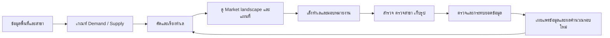

# CityMETER: Yolk — Product statement v1.3

**Find the yolk. Grow your market.**  
**หาไข่แดง ขยายตลาด**

**Spot demand. See the gaps. Pick your next location.**  
เห็นความต้องการ มองช่องว่าง เลือกทำเลถัดไป

Yolk ช่วยทีมขยายสาขาเลือกว่าควรไปศึกษาตลาดตรงไหนก่อน โดยเทียบ **Demand — สัญญาณความต้องการในพื้นที่** กับ **Supply — สาขาเราและคู่แข่ง** แล้วเก็บทำเลที่สนใจ เหตุผล ผู้รับผิดชอบ และหลักฐานไว้ในพื้นที่ทำงานเดียวกัน ทุกคนเริ่มจากข้อมูลและเกณฑ์แนะนำได้ทันที และค่อยเติมข้อมูลของธุรกิจเพื่อให้ข้อสรุปรอบคอบขึ้น

เอกสารนี้เป็นข้อกำหนดผลิตภัณฑ์ของ v1.3 อ่านคู่กับ [แผนลงมือพัฒนา](IMPLEMENTATION_PLAN_v1.3.md), [สัญญาสำหรับเครื่อง](contracts/product.v1.3.json) และ [เกณฑ์ v1.3](contracts/criteria.v1.3.json) รุ่นนี้รวบรวมข้อกำหนดให้ตรงพรีวิวปัจจุบันและเพิ่มประสบการณ์ใช้งาน โดยไม่เปลี่ยนสูตร Demand/Supply ตั้งต้น

## สถานะของรุ่นนี้

| ส่วน | มีให้ทดลองในเว็บ v1.3 | สิ่งที่ dev ต้องทำในระบบจริง |
|---|---|---|
| ข้อมูลและการคัดทำเล | พื้นที่จำลอง 308 แห่ง, POI จำลอง 16 รายการ, ขอบเขตจังหวัด 77 จังหวัด | เชื่อมข้อมูลที่มีสิทธิ์ใช้งาน ตรวจหน่วยพื้นที่และคุณภาพก่อนเผยแพร่ผล |
| เกณฑ์และผล | ปรับค่า ดูผลทันที และทดลองใช้เกณฑ์ร่วมกันในเบราว์เซอร์ | บันทึกเวอร์ชันเกณฑ์และรอบคำนวณถาวร ตรวจย้อนหลังได้ |
| ทีม | ผู้ใช้ตัวอย่าง 10 คนและการจำลองสิทธิ์ | บัญชีจริง สิทธิ์ฝั่ง server และข้อมูลร่วมกันหลายคน |
| CRUD / feed / leaderboard | ทดลองบันทึกในเครื่องและข้ามแท็บเบราว์เซอร์เดียวกัน | ธุรกรรมข้อมูล ประวัติถาวร การแจ้งเตือน และป้องกันการแก้ทับ |
| ธีม ภาษา แผนที่ รูปสาขา | สว่าง/มืด/ตามเครื่อง, TH/EN, แผนที่ 3 แบบ, รูปสูงสุด 5 รูป | เชื่อมบริการแผนที่และที่เก็บรูปตามสิทธิ์ workspace |
| Email / LINE | ตัวอย่างการแชร์ ไม่มีการส่งจริง | สิทธิ์ผู้รับ ลิงก์ที่ตรวจสิทธิ์ได้ และสถานะส่ง |

**ข้อมูลสาธารณะเป็นข้อมูลจำลองสำหรับอธิบายผลิตภัณฑ์** จึงใช้ยืนยันยอดสาขา สภาพตลาด หรืออันดับทำเลจริงไม่ได้ การตรวจ source/runtime และไฟล์เผยแพร่แล้วไม่เท่ากับตรวจภาพในเบราว์เซอร์: visual/device QA ยังเปิดอยู่ตาม [experience contract](contracts/experience.v1.3.json)

## Who — ใครใช้

ทีม expansion, strategy, พัฒนาธุรกิจ และทีมสำรวจพื้นที่ของกิจการที่เข้าถึงลูกค้าผ่านสาขา เช่น ปั๊มน้ำมัน non-bank ร้านสะดวกซื้อ ร้านสะดวกซัก ร้านกาแฟ และร้านอาหาร

หนึ่ง enterprise เริ่มที่ **10 users: 1 Admin + 3 Editors + 6 Viewers** ใช้ข้อมูลชุดเดียวกัน สิทธิ์ผูกกับ workspace ไม่ผูกกับเพียงหน้าจอ

| บทบาท | งานหลัก | สิทธิ์สำคัญ |
|---|---|---|
| Admin | ดูแลทีม ข้อมูล และเกณฑ์ร่วม | จัดการสมาชิกและสิทธิ์ รวมถึงงานของ Editor |
| Editor | คัดทำเล ตรวจสาขา บันทึกงานภาคสนาม | CRUD สาขา/ทำเล/รูป และใช้เกณฑ์ใหม่กับทีม |
| Viewer | อ่านหลักฐาน เปรียบเทียบ และติดตามงาน | ดูข้อมูลและลองร่างเกณฑ์ส่วนตัว; เปลี่ยนข้อมูลร่วมไม่ได้ |

พรีวิวนี้ใช้ **บางจาก / ธุรกิจสถานีบริการน้ำมัน** เป็นบริบทเดียว ไม่มี dropdown เปลี่ยนธุรกิจ ส่วนระบบจริงใช้ metric catalogue, brand registry และ preset ที่มีเวอร์ชัน เพื่อรองรับหลายธุรกิจบนโครงสร้างเดียวกัน

## What — ช่วยตัดสินใจเรื่องอะไร

1. **ควรเริ่มดูพื้นที่ไหน:** คัดและเรียงทำเลทั่วประเทศจากเกณฑ์ที่ทีมเลือก
2. **ทำไมพื้นที่นี้น่าสนใจ:** เห็นค่า Demand, สาขาเรา/คู่แข่ง, รูปแบบตลาด และข้อมูลที่ยังขาด
3. **ทีมจะทำอะไรต่อ:** เล็งทำเล มอบหมายงาน ตรวจข้อมูลสาขา เก็บรูปและข้อสังเกต แล้วตัดสินใจว่าจะศึกษาต่อหรือหยุด

ผลลัพธ์คือ **ลำดับทำเลที่ควรศึกษาต่อพร้อมเหตุผล** การตรวจตำแหน่งทางเข้า–ออก ช่วงถนน และที่ดินรายแปลงเป็นขั้นถัดไป คะแนนยังไม่ใช่ปริมาณรถผ่าน ยอดขาย หรือการรับรองว่าแปลงนั้นตั้งกิจการได้

## Why — ทำไมจึงมีประโยชน์

ทีมจะมีจุดเริ่มต้นร่วมกันโดยไม่ต้องส่งข้อมูลเพิ่มในครั้งแรก เห็นทันทีว่าเปลี่ยนเกณฑ์แล้วมีพื้นที่ไหนเข้า–ออกจากรายการ และย้อนดูได้ว่าใครเปลี่ยนอะไร เมื่อไร เพราะเหตุใด เมื่อทีมตรวจสาขาและสำรวจพื้นที่เพิ่ม ข้อมูลใหม่จะกลับมาช่วยประเมินครั้งถัดไป

วัดความสำเร็จจากเวลาที่ใช้จนได้ shortlist ที่มีเหตุผล สัดส่วนทำเลที่มีผู้รับผิดชอบ/หลักฐานครบ และความสอดคล้องกับผลสำรวจ การนับ action ใช้เห็นการมีส่วนร่วมของทีมเท่านั้น ไม่ใช่คะแนนคุณภาพพนักงานหรือหลักฐานว่าทำเลจะขายดี

## Which — แข่งกับวิธีใดที่ทีมใช้อยู่

คู่แข่งหลักของ Yolk คือ **การเปิดแผนที่หลายชั้น เทียบ spreadsheet ส่งพิกัดในแชต แล้วประกอบเหตุผลใหม่ทุกครั้งที่เกณฑ์หรือคนรับงานเปลี่ยน** รวมถึงความรู้ที่อยู่กับคนใดคนหนึ่ง

Yolk รวมเกณฑ์ หลักฐาน ทำเลที่เล็งไว้ และประวัติงานไว้ด้วยกัน ให้คนถัดไปทำงานต่อได้จากเหตุผลชุดเดิม วิธีทำงานเดิมของลูกค้าแต่ละรายต้องยืนยันในการ discovery; ข้อความนี้เป็นสมมติฐานผลิตภัณฑ์ ไม่ใช่ผลสัมภาษณ์ที่ยืนยันแล้ว

## How — ลำดับใช้งานหลัก

ผู้ใช้ลองปรับเกณฑ์เป็นร่างส่วนตัว เห็นผลก่อน แล้วจึงกดใช้กับทีม ร่าง การค้นหา การซูม และการเปลี่ยนธีมไม่สร้างกิจกรรมร่วม เมื่อบันทึกข้อมูลร่วมสำเร็จ จึงสร้าง event หนึ่งรายการเพื่อใช้ทั้ง feed และการแจ้งเตือน

## กติกาพื้นที่และข้อมูล

**REQ-GEO-01 · หน่วยตั้งต้น:** กทม. ใช้ **แขวง** ต่างจังหวัดใช้ **อปท.ระดับพื้นที่ที่ตรวจขอบเขตแล้ว** เช่น เทศบาล/อบต./รูปแบบพิเศษที่เข้าเงื่อนไข ไม่ใช้ อบจ. มารวมกับหน่วยย่อยที่ทับซ้อน จังหวัดเป็นชั้นภาพรวมและใช้กรองรายการ

ฐาน percentile เป็น **กลุ่มหน่วยพื้นที่ทั่วประเทศเดียวกันในรอบข้อมูลนั้น** แต่ละ metric ใช้ค่าที่มีข้อมูลจริง ข้อมูลขาดไม่แทนด้วยศูนย์ อัตราต่อคน/ต่อพื้นที่ต้องมีตัวหารที่ถูกหน่วยและมากกว่าศูนย์ ทุกผลผูกกับขอบเขต ช่วงข้อมูล และวิธี crosswalk ที่ระบุเวอร์ชัน

แนวคิดคัด อปท. จากรายได้/รายได้ต่อคน/รายได้ต่อพื้นที่เป็นสมมติฐานจากช่วงก่อนหน้า **เกณฑ์ตั้งต้นปัจจุบันใช้อาคารและกิจกรรมชุดเดียวกันทั่วประเทศ** ไม่ผสมรายได้ อปท. กลับเข้ามาโดยอัตโนมัติ

**REQ-GEO-02 · เปลี่ยนขอบเขต:** รองรับจังหวัด อำเภอ ตำบล อปท. custom polygon และช่วงถนนในลำดับพัฒนาถัดไป ต้อง aggregate ค่าดิบและสร้าง benchmark ใหม่ตามหน่วยนั้น ห้ามเฉลี่ย percentile เดิมเป็น percentile ของพื้นที่ใหม่ และห้ามเอา custom areas ที่ทับซ้อนกันแทรกในฐานประเทศโดยไม่มีกติกา

Locale Insight ใช้เป็นบริบทเพื่อวางแผนและตั้งคำถามได้ หลังเชื่อม `locale_id` กับพื้นที่วิเคราะห์แล้ว ไม่ใช้แทนประชากรทางการ ขอบเขตทางการ หรือหลักฐานว่าคนเดินทางตามพฤติกรรมใดจริง ดู [geography contract](contracts/geography-profile-default.json)

## Demand — ค่าเริ่มต้นที่ทีมปรับได้

**REQ-DEM-01 · สัญญาณอาคาร 3 ค่า**

| Metric ID | ค่า | หน่วย |
|---|---|---|
| `gfa` | พื้นที่อาคารรวม | ตร.ม. |
| `gfa_per_person` | พื้นที่อาคารต่อประชากร | ตร.ม./คน |
| `gfa_per_km2` | พื้นที่อาคารต่อพื้นที่ | ตร.ม./ตร.กม. |

| Tier | เกณฑ์อาคาร |
|---|---|
| 1 | ทั้ง 3 ค่า ≥ P99 |
| 2 | ทั้ง 3 ค่า ≥ P95 และไม่เข้า Tier 1 |
| 3 | อย่างน้อย 1 ค่า ≥ P95 และไม่เข้า Tier 1–2 |

**REQ-DEM-02 · สัญญาณกิจกรรม 6 ค่า**

| Metric ID | ค่า | หน่วย |
|---|---|---|
| `factory_count` | จำนวนโรงงาน | แห่ง |
| `factory_count_per_km2` | โรงงานต่อพื้นที่ | แห่ง/ตร.กม. |
| `factory_workers` | แรงงานโรงงาน | คน |
| `factory_workers_per_km2` | แรงงานโรงงานต่อพื้นที่ | คน/ตร.กม. |
| `hotel_rooms` | ห้องพักโรงแรม | ห้อง |
| `hotel_rooms_per_km2` | ห้องพักโรงแรมต่อพื้นที่ | ห้อง/ตร.กม. |

| Tier | จำนวนค่าที่ ≥ P95 |
|---|---|
| 1 | 5–6 ค่า |
| 2 | 3–4 ค่า |
| 3 | 1–2 ค่า |

**Demand สูง** เมื่อสัญญาณอาคาร **หรือ** กิจกรรมเข้า Tier 1/2/3 อย่างน้อยหนึ่งกลุ่ม ค่า tier ที่เลขน้อยกว่าคือระดับที่สูงกว่า ข้อมูลไม่ครบอาจยืนยันว่า Demand สูงได้จากค่าที่ผ่านแล้ว แต่ต้องแสดงว่า tier ยังมีความเป็นไปได้มากกว่าหนึ่งระดับ

**REQ-DEM-03 · ปัจจัยเพิ่มเติม:** ผู้ใช้เปิด–ปิดกลุ่มและปรับ percentile/จำนวนข้อได้ แยก Demand กับ Supply ชัดเจน ปัจจัยเพิ่มเติมปิดไว้โดยค่าเริ่มต้น; หากเปิด ปัจจัยที่ผ่านข้อใดข้อหนึ่งจะเข้าร่วมเงื่อนไข OR ของ Demand สูง

พรีวิวมีประชากรและความหนาแน่นประชากรให้ทดลอง ส่วนโรงเรียนขนาดใหญ่ โรงพยาบาลขนาดใหญ่ เตียงโรงพยาบาล ที่พักเช่า ศูนย์การค้า และปริมาณรถผ่านเป็น catalogue ที่แสดงสถานะความพร้อม ต้องตรวจ source/นิยามขนาด/crosswalk ก่อนเปิดใช้ การมีชื่อ dataset ในเมนูไม่เท่ากับมีข้อมูลพร้อมคำนวณ

## Supply — สาขาเรา คู่แข่ง และรายการรอตรวจ

**REQ-SUP-01:** แยก B = สาขาเรา, C = สาขาคู่แข่ง และ U = รายการที่ยังระบุแบรนด์ไม่ได้ ค่าเริ่มต้น **B ≥ 3 เป็นมาก; C ≥ 3 เป็นมาก** ทีมปรับสองค่านี้แยกกันได้ ดัชนี `C/(B+α)` ยังไม่เปิดเป็นกติกาตั้งต้นในรุ่นนี้

U อาจทำให้การจัดกลุ่ม B/C เปลี่ยน ระบบจึงตรวจผลที่เป็นไปได้และแสดง “รอตรวจเพิ่ม” ถ้ายังสรุปเป็นรูปแบบเดียวไม่ได้ ในระบบจริง **unknown brand** กับ **unbranded ที่ตรวจยืนยันแล้ว** ต้องเป็นคนละสถานะ; unbranded ที่ยืนยันแล้วเป็นกลุ่มสำหรับศึกษาการ acquire ได้โดยไม่ต้องเดาว่าเป็นสาขาใคร

**REQ-SUP-02:** เพิ่ม แก้ไข ตรวจยืนยัน เก็บเข้าคลัง และคืนรายการได้ พร้อมแบรนด์ ประเภทสาขา ทำเล พิกัด หลักฐาน และ custom fields ระบบเก็บ source เดิมแยกจากสิ่งที่ทีมแก้ การแก้ POI ไม่เปลี่ยนยอดรวม Supply ทันที ต้องตรวจสมาชิกพื้นที่ รายการซ้ำ ช่วงข้อมูล และกระทบยอดก่อนเผยแพร่ผลรอบใหม่

## รูปแบบตลาด 8 แบบ

**REQ-PAT-01:** ใช้ชื่อที่ทีมตกลงเพื่อสนทนาให้จำง่าย เมื่อ D/C/B ยังไม่ชัดให้แสดงสถานะรอตรวจพร้อมกลุ่มที่เป็นไปได้ ไม่ฝืนเลือกหนึ่งในแปด

| D | C | B | ชื่อ | แนวคำถามสำหรับศึกษาต่อ | ดาวตั้งต้น |
|---|---|---|---|---|---|
| มาก | มาก | มาก | **Crowded** | ยังมีช่องว่างด้านตำแหน่งหรือรูปแบบบริการไหม | — |
| มาก | มาก | น้อย | **FOMO** | บางจากเข้าไปตอบโจทย์อะไรได้เพิ่ม | ★★ |
| มาก | น้อย | มาก | **Our Farm** | เครือข่ายเรารองรับพื้นที่นี้ได้ทั่วถึงหรือยัง | ★ |
| มาก | น้อย | น้อย | **Pioneer** | ทำไมสาขายังน้อย และเข้าถึงลูกค้าได้จริงไหม | ★★★ |
| น้อย | น้อย | น้อย | **Quiet** | มีความต้องการที่โมเดลยังมองไม่เห็นไหม | — |
| น้อย | มาก | น้อย | **Their War** | คู่แข่งเห็นโอกาสอะไรที่ข้อมูลชุดนี้ไม่บอก | — |
| น้อย | น้อย | มาก | **Our Island** | สาขาเรามีฐานลูกค้าหรือบทบาทเฉพาะอะไร | — |
| น้อย | มาก | มาก | **Winter War** | Supply หนาแน่นเกินไป หรือ Demand ยังวัดไม่ครบ | — |

ดาวเป็นลำดับสมมติฐานสำหรับศึกษาต่อของธุรกิจน้ำมัน ไม่ใช่ความน่าลงทุนที่ยืนยันแล้วหรือเกณฑ์สากลของทุกธุรกิจ

## อันดับ ภาพประเทศ และหน้าทำเล

**REQ-RANK-01:** ค่าเริ่มต้นคัด Demand สูงและสามรูปแบบ Pioneer / FOMO / Our Farm แล้วเรียงตาม: ผ่านเกณฑ์ → Demand สูง/ไม่ทราบ/ต่ำ → ดาวมากก่อน → tier ที่ยืนยันได้ดีที่สุด → จำนวนสัญญาณที่เปิดใช้และผ่านเกณฑ์ → C มากก่อน → B น้อยก่อน → ลำดับต้นทางเพื่อให้ผลคงที่

ระบบจริงต้องให้ทีมปรับเงื่อนไขและลำดับความสำคัญของการจัดอันดับได้ภายใน schema ที่ตรวจสอบได้ พร้อม preview และ version ทุกครั้ง พรีวิวรุ่นนี้ปรับสัญญาณ จุดตัด และรูปแบบตลาดได้ แต่ยังไม่มี UI ย้ายลำดับตัวเรียงหรือแก้ดาวของ preset

**REQ-MAP-01:** สีทำเลใช้ percentile สูงสุดของสัญญาณ Demand ที่เปิดใช้และมีค่า ส่วนสีจังหวัดสรุปค่าสูงสุดในทำเลที่ผ่านเกณฑ์ของจังหวัดนั้น สีจึงบอก “มีสัญญาณเด่นแค่ไหน” และไม่ได้แทนอันดับรวม ต้องแยกไม่มีทำเลผ่าน/หลักฐานไม่พอ/ค่าศูนย์/นอกขอบเขต พร้อมรายการที่อ่านแทนแผนที่ได้

**REQ-DETAIL-01:** หน้าทำเลรวม Market landscape ที่ตอบได้ว่าผลมาจากอะไร: ค่าดิบ หน่วย percentile จุดตัด tier, B/C/U, ส่วนแบ่งจำนวนรายการตามแบรนด์เมื่อมีข้อมูลพอ, ตาราง 8 รูปแบบ และข้อจำกัดความครบถ้วน จำนวนรายการสาขาไม่ใช่ส่วนแบ่งยอดขาย และ POI ตัวอย่างไม่ใช่รายชื่อครบทุกสาขา

**REQ-DETAIL-02:** แสดงขอบเขตทำเลและ POI สำคัญตามข้อมูลที่มี เช่น สาขา โรงงาน โรงแรม โรงพยาบาล โรงเรียน เปิด–ปิดกลุ่มและเลือกจุดจากรายการได้ เลือกพื้นหลัง **เรียบง่าย / ดาวเทียม / รายละเอียด** กรอบพิกัดสำหรับซูมไม่ใช่เส้นเขต เมื่อไม่มี geometry ให้แสดงสถานะและรายการต่อได้

แผนที่พรีวิวใช้ขอบเขต/จุดจำลองที่แยกจากข้อมูลคำนวณ พื้นหลังเป็นภูมิศาสตร์จริงจาก OSM และภาพดาวเทียม Sentinel-2 ปี 2021 ความละเอียด 10 ม. ผ่าน ESA WorldCover/Terrascope พร้อม attribution ภาพนี้ใช้ดูบริบท ไม่อ้างว่าเป็นภาพปัจจุบันหรือหลักฐานระดับแปลง

## ทำเลที่เล็งไว้ รูปสาขา และงานของทีม

**REQ-WORK-01:** ทำเลมีเจ้าของงาน สถานะ บันทึก และ custom fields ตาม workflow ธุรกิจ สถานะตั้งต้นคือ “รอลงพื้นที่ / กำลังศึกษา / ติดตาม / ไม่ไปต่อ” การนำออกจาก shortlist คงประวัติไว้ ระบบจริงต้องจัดการนิยาม custom fields ประเภทค่า ขอบเขตใช้ และเวอร์ชัน; พรีวิวยังไม่ได้เป็นตัวสร้างฟิลด์เต็มรูปแบบ

**REQ-PHOTO-01:** สาขาเก็บได้สูงสุด **5 รูป** เพิ่ม ลบ เลือกรูปปก และคืนร่างรูปเป็นค่าที่บันทึกไว้ได้ ปุ่มบันทึกสาขา commit รูปและข้อมูลสาขาร่วมกัน พรีวิวใช้ภาพ AI ที่มีป้าย “ภาพจำลอง”; รูปที่ผู้ใช้เลือกเก็บใน IndexedDB ไม่มี network upload

ระบบจริงเก็บรูปส่วนตัวใน workspace ตรวจสิทธิ์และไฟล์ฝั่ง server จำกัดจำนวนหลังรวม concurrent changes เก็บ metadata และ event ในธุรกรรมเดียวกันกับ revision ของสาขา ลบ EXIF/GPS ออกจากภาพเผยแพร่ และไม่ใส่ bytes/URL ที่หมดอายุใน event การเพิ่มรูปไม่เปลี่ยนยอด Supply

**REQ-TEAM-01:** shared write ที่สำเร็จหนึ่งครั้งสร้าง event เดียว ระบุคน เวลา record ค่าเดิม/ใหม่ และเหตุผล Feed แสดงตามบริบท: เกณฑ์อยู่หน้าเกณฑ์ งานทำเลอยู่ในทำเล และงานสาขาอยู่ในสาขา สมาชิกอื่นที่มีสิทธิ์ได้รับ notification พร้อมลิงก์กลับมาทำงาน

**REQ-TEAM-02:** เมื่อมีข้อมูลใหม่หรือทีมบันทึกงาน ระบบแจ้งเฉพาะสิ่งที่เกี่ยวข้อง ให้เห็นว่าคำตอบเปลี่ยนเพราะอะไร ผู้ใช้ตั้งการติดตามและความถี่ได้ Email/LINE ใช้ลิงก์ที่ตรวจสิทธิ์ผู้รับเสมอ ห้ามส่งข้อมูลใน workspace ไปยังปลายทางที่ไม่ได้รับสิทธิ์โดยอัตโนมัติ

**REQ-ACT-01:** leaderboard แสดงผู้ทำ action จำนวน action ประเภทงาน และจำนวน record ไม่ซ้ำ ในช่วงเวลาเลือกได้ ค่าเริ่มต้น 30 วัน บันทึกหลายฟิลด์ในครั้งเดียวคิดหนึ่ง action; ไม่นับ draft, เปิดดู, คลิก, no-op, failed write, retry หรือ system job ดู [activity policy](contracts/activity-summary.policy.json)

## Responsive, ภาษา และ DS

**REQ-UX-01:** ออกแบบจากมือถือก่อน มีแผนที่/รายการที่สลับใช้ได้ ฟอร์มและหน้าทำเลเต็มความกว้าง จอใหญ่จึงวางข้อมูลคู่กัน ปุ่มเป้าหมายอย่างน้อย 44×44 CSS px ตรวจที่ 320/390/768/1440 px, keyboard/touch และ text zoom 200%

**REQ-UX-02:** รองรับไทย/อังกฤษทั้ง UI หน่วย คำอธิบาย feed ข้อผิดพลาด และ accessible names เปลี่ยนภาษาแล้วทำเลที่ดู ร่างแบบฟอร์ม และรูปที่ยังไม่บันทึกต้องอยู่ครบ ไม่แปลบันทึกผู้ใช้หรือชื่อจาก source อัตโนมัติ

**REQ-DS-01:** ใช้ **Landometer DS 0.9.4** ตาม [วิธีเชื่อม asset](DS_ASSET_INTEGRATION.md) และ [manifest ระบุไฟล์/บทบาท/hash](contracts/ds-assets.v1.3.json) ไม่สร้างโลโก้หรือสี canonical ขึ้นใหม่ ตัวอักษรหลัก 17 px มือถือ / 18 px จอใหญ่, controls 16 px, metadata เป้าหมาย 14 px ตาม adapter ของผลิตภัณฑ์

ผู้ใช้เลือก **สว่าง / มืด / ตามเครื่อง** ค่าเริ่มต้นตามเครื่องและบันทึกเป็นความชอบส่วนตัว Light ใช้ canvas `surface-alt-light` และ card `surface-canvas-light` ของ DS ให้พื้นที่ทำงานนุ่มตา ส่วน Dark ใช้คู่ token ที่กำหนดไว้ **ไม่แสดง motif ทุกชนิดใน UI รุ่นนี้** ตามการปรับล่าสุดของผู้ใช้

**REQ-DS-02 · Logo:** ไม่ใส่กรอบ การ์ด badge หรือพื้นรองที่สร้างขึ้นครอบโลโก้ เลือก asset รุ่นที่อนุมัติให้ใช้กับพื้นผิวเดิมนั้นและคงสัดส่วนครบ ห้าม crop หรือเปลี่ยนสีเพื่อชดเชยการเลือกพื้นหลังผิด ข้อกำหนดล่าสุดนี้แทนคำแนะนำเก่าที่เสนอแผ่นรองโลโก้

**REQ-DS-03 · Icons:** ใช้ Material Symbols Rounded แบบ outline `FILL 0 / wght 300 / GRAD 0 / opsz 24` ประกอบข้อความที่บอกการกระทำ โดยเฉพาะจุดตัดสินใจ เช่น เล็งทำเล ปรับเกณฑ์ ตรวจสาขา เพิ่มรูป และบันทึก ไม่เปลี่ยน fill/weight ใน selected state ไม่ใช้ emoji แทน และไม่ใช้เครื่องหมายสำเร็จทำให้ข้อมูลที่ยังรอตรวจดูเหมือนยืนยันแล้ว [ชุด glyph ของ Yolk](contracts/icons.v1.3.json) เป็น product extension ที่มี source/license/hash แยกจากไฟล์ DS canonical; ถ้า font โหลดไม่ได้หรือชื่อ glyph ไม่รองรับ ต้องยังอ่านและใช้ label ได้

## ขยายระบบต่อโดยไม่เปลี่ยนแกนกลาง

| ระยะธุรกิจ | ขอบเขต | สถานะในแผน |
|---|---|---|
| **P1** | Supply CRUD, custom fields และ shortlist unbranded สำหรับศึกษา acquire | พัฒนาระบบจริงจาก interaction พรีวิว |
| **P2** | คัดทำเลจากสาขาเรา/คู่แข่ง และบันทึก shortlist | รักษา Supply-only scenario ได้ ไม่บังคับมี Demand |
| **P3** | Area CRUD + Demand/Supply + รูปแบบตลาด + ทีมทำงานร่วมกัน | ขอบเขตหลักของ Yolk v1.3; custom boundaries/road analysis ทำเป็น capability ต่อ |
| **P4** | ยอดขายราย transaction/สาขา และข้อมูลสมาชิก | แยกเป็น private-data track; ยังไม่มีในพรีวิว |

เลข **v1.3 เป็นรุ่นของพรีวิว** ส่วน **P1–P4 เป็นระยะความสามารถทางธุรกิจ** จึงไม่ควรนำมาเทียบเป็นเลขเดียวกัน

ภายใต้ P3 ให้คงทางเลือกทำเล **A: ชุมชนเมือง/ไข่ดาว** และ **B: ช่วงถนน/ชุมทาง** แนว A ศึกษาพื้นที่ที่มีสัญญาณ Demand และพื้นที่ติดต่อรอบข้าง; การเป็นเพื่อนบ้านยังไม่ยืนยันว่ามีรถ commute ผ่าน ต้องใช้หลักฐานการเดินทางเพิ่มเติม แนว B รวมชุมทาง ทางด่วน/rest area และ **B6 บายพาสหัวเมืองบริเวณแยกกับถนนหลัก** ต้องมีข้อมูลโครงข่าย การเข้าถึง และข้อจำกัดถนนก่อนจัดอันดับใน cohort แยก ไม่ใช้จำนวนทางแยกแทนปริมาณรถโดยตรง

**REQ-P4-01:** ก่อนใช้ยอดขาย/สมาชิก กำหนด data contract, สิทธิ์ วัตถุประสงค์ retention และการเชื่อม branch ID ใหม่ ใช้ยอดขายทดสอบว่าตัวชี้วัดสัมพันธ์กับผลจริงเพียงใด และวัดผลนอกชุดฝึกก่อนอ้างว่าแม่นขึ้น รายละเอียด daypart, พฤติกรรม, ฝั่งถนน และ cannibalisation ค่อยออกแบบใน P4

CRUD หลักยังเป็นสาขาและทำเล เพิ่มงานจัดการ source, mapping, คุณภาพข้อมูล, model version และสิทธิ์แทนการเปิด transaction/ที่อยู่สมาชิกให้ทุกคนแก้ในหน้าทำเล ใช้ผลรวมตามพื้นที่และเกณฑ์จำนวนขั้นต่ำเพื่อคุ้มครองข้อมูลบุคคล

ธุรกิจอื่นใช้ workspace/Supply/shortlist/feed ชุดเดิม เปลี่ยนชุด Demand แบรนด์คู่แข่ง และ default criteria ตามโจทย์ที่พิสูจน์ได้ [industry seeds](contracts/industry-preset-seeds.json) เป็นสมมติฐานสำหรับ pilot ไม่ใช่คำแนะนำที่ผ่านการยืนยันหรือสูตรที่เปิดใช้ใน demo

## เงื่อนไขรับมอบ

| กลุ่ม requirement | ผ่านเมื่อ |
|---|---|
| GEO / DEM / SUP / PAT / RANK | ใช้ source และ cohort ที่ระบุซ้ำได้; boundary case/ข้อมูลขาด/unknown brand ไม่ถูกแปลงเป็นความแน่ใจ |
| MAP / DETAIL | แผนที่กับรายการอ้าง run เดียวกัน; metric สีและอันดับอธิบายตรง; geometry/POI มีสถานะและที่มา |
| WORK / PHOTO / TEAM / ACT | ตรวจสิทธิ์ฝั่ง server; conflict ไม่ทับงานเงียบ; หนึ่ง commit หนึ่ง event; รูปไม่เกิน 5 และอ่านได้ตามสิทธิ์ |
| UX / DS | TH/EN, 3 themes, responsive, keyboard/touch ผ่านการดูจริง; asset hash ตรง manifest |
| P4 | data contract ผ่านก่อน import; มีแผนทดสอบผลกับข้อมูลจริงก่อนเผยแพร่คำกล่าวด้านความแม่นยำ |

**เริ่มงาน dev:** ใช้ [IMPLEMENTATION_PLAN_v1.3.md](IMPLEMENTATION_PLAN_v1.3.md) เลือกหนึ่งงานตาม dependency แล้วส่งทั้ง implementation, ผลทดสอบ และรายการที่ยังไม่ยืนยัน ห้ามถือว่า UI จำลองเท่ากับ backend ที่พร้อมใช้งานจริง
