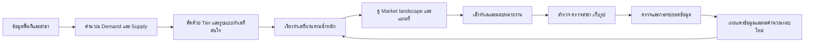
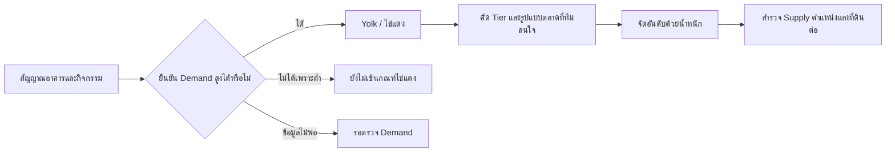
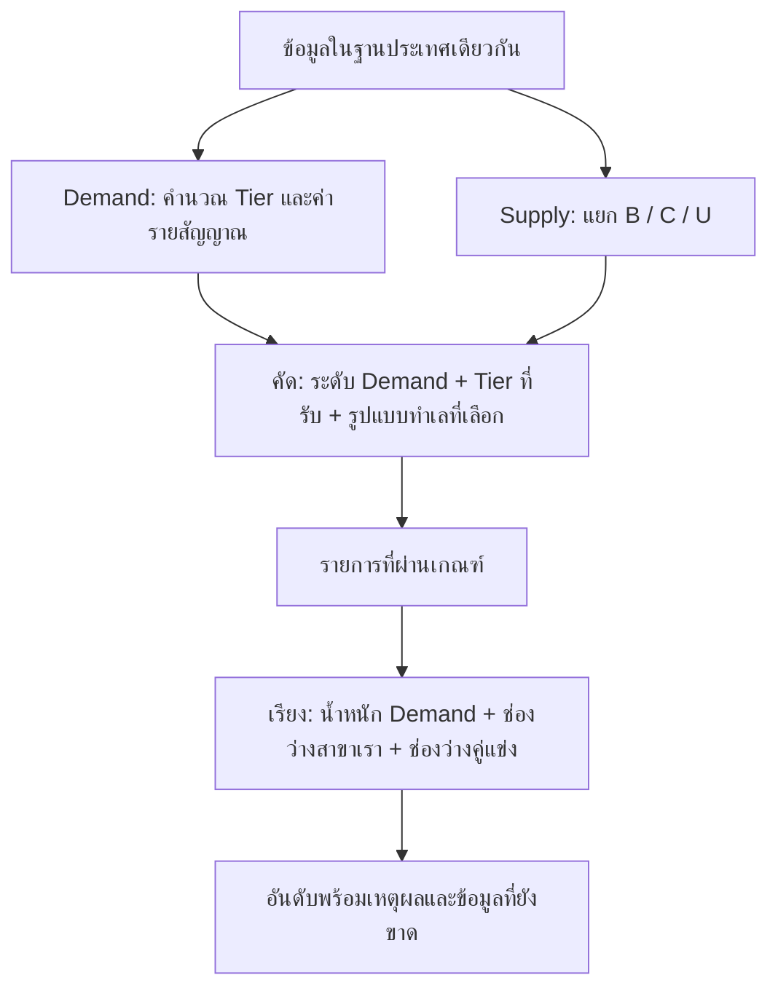

# CityMETER: Yolk — Product statement v1.5

**Find the yolk. Grow your market.**
**หาไข่แดง ขยายตลาด**

**Spot demand. See the gaps. Pick your next location.**
เห็นความต้องการ มองช่องว่าง เลือกทำเลถัดไป

Yolk ช่วยทีมขยายสาขาเลือกว่าควรไปศึกษาตลาดตรงไหนก่อน โดยเทียบ **Demand — สัญญาณความต้องการในพื้นที่** กับ **Supply — สาขาเราและคู่แข่ง** แล้วเก็บทำเลที่สนใจ เหตุผล ผู้รับผิดชอบ และหลักฐานไว้ในพื้นที่ทำงานเดียวกัน ทุกคนเริ่มจากข้อมูลและเกณฑ์แนะนำได้ทันที และค่อยเติมข้อมูลของธุรกิจเพื่อให้ข้อสรุปรอบคอบขึ้น

เอกสารนี้เป็นข้อกำหนดผลิตภัณฑ์ของ v1.5 อ่านคู่กับ [แผนลงมือพัฒนา](IMPLEMENTATION_PLAN_v1.5.md), [สัญญาสำหรับเครื่อง](contracts/product.v1.5.json) และ [เกณฑ์ v1.4](contracts/criteria.v1.4.json) รุ่นนี้ทำให้ความหมายของ **Yolk / ไข่แดง** ชัดขึ้น: พื้นที่ที่มีสัญญาณ Demand สูงตามเกณฑ์ที่ทีมเลือก แล้วจึงเทียบ Supply เพื่อเลือกว่าจะศึกษาต่อที่ไหน ปรับ navigation มือถือและธีมมืด เพิ่ม icon ให้ทั้ง 8 รูปแบบ และแสดงระดับ percentile ให้อ่านง่าย เกณฑ์คำนวณ Tier, Supply และน้ำหนักจัดอันดับคงตาม v1.4

## สถานะของรุ่นนี้

| ส่วน | มีให้ทดลองในเว็บ v1.5 | สิ่งที่ dev ต้องทำในระบบจริง |
|---|---|---|
| ข้อมูลและการคัดทำเล | พื้นที่จำลอง 308 แห่ง, POI จำลอง 16 รายการ, ขอบเขตจังหวัด 77 จังหวัด | เชื่อมข้อมูลที่มีสิทธิ์ใช้งาน ตรวจหน่วยพื้นที่และคุณภาพก่อนเผยแพร่ผล |
| เกณฑ์และผล | แยก Demand / Supply / รูปแบบทำเลที่สนใจ / น้ำหนักจัดอันดับ ปรับค่าและดูผลทันทีในเบราว์เซอร์ | บันทึกเวอร์ชันเกณฑ์และรอบคำนวณถาวร ตรวจย้อนหลังได้ |
| ทีม | ผู้ใช้ตัวอย่าง 10 คนและการจำลองสิทธิ์ | บัญชีจริง สิทธิ์ฝั่ง server และข้อมูลร่วมกันหลายคน |
| CRUD / feed / leaderboard | ทดลองบันทึกในเครื่องและข้ามแท็บเบราว์เซอร์เดียวกัน | ธุรกรรมข้อมูล ประวัติถาวร การแจ้งเตือน และป้องกันการแก้ทับ |
| ธีม ภาษา แผนที่ รูปสาขา | สว่าง/มืด/ตามเครื่อง, TH/EN, แผนที่ 3 แบบ, รูปสูงสุด 5 รูป | เชื่อมบริการแผนที่และที่เก็บรูปตามสิทธิ์ workspace |
| Email / LINE | ตัวอย่างการแชร์ ไม่มีการส่งจริง | สิทธิ์ผู้รับ ลิงก์ที่ตรวจสิทธิ์ได้ และสถานะส่ง |

**ข้อมูลสาธารณะเป็นข้อมูลจำลองสำหรับอธิบายผลิตภัณฑ์** จึงใช้ยืนยันยอดสาขา สภาพตลาด หรืออันดับทำเลจริงไม่ได้ การตรวจ source/runtime และไฟล์เผยแพร่แล้วไม่เท่ากับตรวจภาพในเบราว์เซอร์: visual/device QA ยังเปิดอยู่ตาม [experience contract](contracts/experience.v1.3.json)

## Who — ใครใช้

ทีม expansion, strategy, พัฒนาธุรกิจ และทีมสำรวจพื้นที่ของกิจการที่เข้าถึงลูกค้าผ่านสาขา เช่น ปั๊มน้ำมัน non-bank ร้านสะดวกซื้อ ร้านสะดวกซัก ร้านกาแฟ และร้านอาหาร

หนึ่ง enterprise เริ่มที่ **10 users: 1 Admin + 3 Editors + 6 Viewers** ใช้ข้อมูลชุดเดียวกัน สิทธิ์ผูกกับ workspace ไม่ผูกกับเพียงหน้าจอ

| บทบาท | งานหลัก | สิทธิ์สำคัญ |
|---|---|---|
| Admin | ดูแลทีม ข้อมูล และเกณฑ์ร่วม | จัดการสมาชิกและสิทธิ์ รวมถึงงานของ Editor |
| Editor | คัดทำเล ตรวจสาขา บันทึกงานภาคสนาม | CRUD สาขา/ทำเล/รูป และใช้เกณฑ์ใหม่กับทีม |
| Viewer | อ่านหลักฐาน เปรียบเทียบ และติดตามงาน | ดูข้อมูลและลองร่างเกณฑ์ส่วนตัว; เปลี่ยนข้อมูลร่วมไม่ได้ |

พรีวิวนี้ใช้ **บางจาก / ธุรกิจสถานีบริการน้ำมัน** เป็นบริบทเดียว ไม่มี dropdown เปลี่ยนธุรกิจ ส่วนระบบจริงใช้ metric catalogue, brand registry และ preset ที่มีเวอร์ชัน เพื่อรองรับหลายธุรกิจบนโครงสร้างเดียวกัน

## What — ช่วยตัดสินใจเรื่องอะไร

1. **ควรเริ่มดูพื้นที่ไหน:** คัดและเรียงทำเลทั่วประเทศจากเกณฑ์ที่ทีมเลือก
2. **ทำไมพื้นที่นี้น่าสนใจ:** เห็นค่า Demand, สาขาเรา/คู่แข่ง, รูปแบบตลาด และข้อมูลที่ยังขาด
3. **ทีมจะทำอะไรต่อ:** เล็งทำเล มอบหมายงาน ตรวจข้อมูลสาขา เก็บรูปและข้อสังเกต แล้วตัดสินใจว่าจะศึกษาต่อหรือหยุด

ผลลัพธ์คือ **ลำดับทำเลที่ควรศึกษาต่อพร้อมเหตุผล** การตรวจตำแหน่งทางเข้า–ออก ช่วงถนน และที่ดินรายแปลงเป็นขั้นถัดไป คะแนนยังไม่ใช่ปริมาณรถผ่าน ยอดขาย หรือการรับรองว่าแปลงนั้นตั้งกิจการได้

## Why — ทำไมจึงมีประโยชน์

ทีมจะมีจุดเริ่มต้นร่วมกันโดยไม่ต้องส่งข้อมูลเพิ่มในครั้งแรก เห็นทันทีว่าเปลี่ยนเกณฑ์แล้วมีพื้นที่ไหนเข้า–ออกจากรายการ และย้อนดูได้ว่าใครเปลี่ยนอะไร เมื่อไร เพราะเหตุใด เมื่อทีมตรวจสาขาและสำรวจพื้นที่เพิ่ม ข้อมูลใหม่จะกลับมาช่วยประเมินครั้งถัดไป

วัดความสำเร็จจากเวลาที่ใช้จนได้ shortlist ที่มีเหตุผล สัดส่วนทำเลที่มีผู้รับผิดชอบ/หลักฐานครบ และความสอดคล้องกับผลสำรวจ การนับ action ใช้เห็นการมีส่วนร่วมของทีมเท่านั้น ไม่ใช่คะแนนคุณภาพพนักงานหรือหลักฐานว่าทำเลจะขายดี

## Which — แข่งกับวิธีใดที่ทีมใช้อยู่

คู่แข่งหลักของ Yolk คือ **การเปิดแผนที่หลายชั้น เทียบ spreadsheet ส่งพิกัดในแชต แล้วประกอบเหตุผลใหม่ทุกครั้งที่เกณฑ์หรือคนรับงานเปลี่ยน** รวมถึงความรู้ที่อยู่กับคนใดคนหนึ่ง

Yolk รวมเกณฑ์ หลักฐาน ทำเลที่เล็งไว้ และประวัติงานไว้ด้วยกัน ให้คนถัดไปทำงานต่อได้จากเหตุผลชุดเดิม วิธีทำงานเดิมของลูกค้าแต่ละรายต้องยืนยันในการ discovery; ข้อความนี้เป็นสมมติฐานผลิตภัณฑ์ ไม่ใช่ผลสัมภาษณ์ที่ยืนยันแล้ว

## How — ลำดับใช้งานหลัก

ผู้ใช้ลองปรับเกณฑ์เป็นร่างส่วนตัว เห็นผลก่อน แล้วจึงกดใช้กับทีม ร่าง การค้นหา การซูม และการเปลี่ยนธีมไม่สร้างกิจกรรมร่วม เมื่อบันทึกข้อมูลร่วมสำเร็จ จึงสร้าง event หนึ่งรายการเพื่อใช้ทั้ง feed และการแจ้งเตือน

## Yolk คืออะไร — ไข่แดงของ Demand

**REQ-YOLK-01 · ความหมายเดียวกันทั้งผลิตภัณฑ์:** **Yolk / ไข่แดง** คือทำเลที่สัญญาณ Demand ซึ่งเปิดใช้ยืนยันว่าอยู่ในระดับสูงตามเกณฑ์ปัจจุบัน (`demand === true`) ชื่อ Yolk ไม่ได้แปลว่ามี Supply ขาด หรือผ่าน shortlist เสมอไป ทำเล Crowded ก็เป็น Yolk ได้ แม้ทีมไม่เลือกรูปแบบนั้น และ Yolk Tier 3 ยังคงเป็น Yolk แม้ผู้ใช้เลือกศึกษาเฉพาะ Tier 1–2

ใช้คำ **“Yolk · ไข่แดง”** คู่คำอธิบาย **“ทำเลที่มี Demand สูง”** ใน overview, detail และคำอธิบายแผนที่ สีทองจาก DS และ icon `egg_alt` ช่วยจำความหมาย แต่ต้องมีข้อความกำกับเสมอ สีหรือ icon นี้ไม่สื่อว่าเป็นทำเลขายดีแน่นอน ไม่ใช่ข้อมูลรถผ่านที่วัดจริง และไม่ใช่คำแนะนำให้เปิดสาขาทันที

## กติกาพื้นที่และข้อมูล

**REQ-GEO-01 · หน่วยตั้งต้น:** กทม. ใช้ **แขวง** ต่างจังหวัดใช้ **อปท.ระดับพื้นที่ที่ตรวจขอบเขตแล้ว** เช่น เทศบาล/อบต./รูปแบบพิเศษที่เข้าเงื่อนไข ไม่ใช้ อบจ. มารวมกับหน่วยย่อยที่ทับซ้อน จังหวัดเป็นชั้นภาพรวมและใช้กรองรายการ

ฐาน percentile เป็น **กลุ่มหน่วยพื้นที่ทั่วประเทศเดียวกันในรอบข้อมูลนั้น** แต่ละ metric ใช้ค่าที่มีข้อมูลจริง ข้อมูลขาดไม่แทนด้วยศูนย์ อัตราต่อคน/ต่อพื้นที่ต้องมีตัวหารที่ถูกหน่วยและมากกว่าศูนย์ ทุกผลผูกกับขอบเขต ช่วงข้อมูล และวิธี crosswalk ที่ระบุเวอร์ชัน

แนวคิดคัด อปท. จากรายได้/รายได้ต่อคน/รายได้ต่อพื้นที่เป็นสมมติฐานจากช่วงก่อนหน้า **เกณฑ์ตั้งต้นปัจจุบันใช้อาคารและกิจกรรมชุดเดียวกันทั่วประเทศ** ไม่ผสมรายได้ อปท. กลับเข้ามาโดยอัตโนมัติ

**REQ-GEO-02 · เปลี่ยนขอบเขต:** รองรับจังหวัด อำเภอ ตำบล อปท. custom polygon และช่วงถนนในลำดับพัฒนาถัดไป ต้อง aggregate ค่าดิบและสร้าง benchmark ใหม่ตามหน่วยนั้น ห้ามเฉลี่ย percentile เดิมเป็น percentile ของพื้นที่ใหม่ และห้ามเอา custom areas ที่ทับซ้อนกันแทรกในฐานประเทศโดยไม่มีกติกา

Locale Insight ใช้เป็นบริบทเพื่อวางแผนและตั้งคำถามได้ หลังเชื่อม `locale_id` กับพื้นที่วิเคราะห์แล้ว ไม่ใช้แทนประชากรทางการ ขอบเขตทางการ หรือหลักฐานว่าคนเดินทางตามพฤติกรรมใดจริง ดู [geography contract](contracts/geography-profile-default.json)

**REQ-DEMO-01 · ชื่อทำเลจำลอง:** ทุกชื่อพื้นที่สังเคราะห์ที่ผู้ใช้เห็นใช้ **“ทำเลจำลอง” / “Demo location”** ตามด้วยหมายเลขหรือรหัสที่อ่านได้ ไม่เรียกชื่อเป็น “แขวงจำลอง” หรือ “อปท.จำลอง” แต่ยังคง `boundary_type`, stable ID, จังหวัด และ geographic profile ไว้ในข้อมูลและช่อง metadata ชื่อที่อ่านง่ายไม่ใช่การเปลี่ยนชนิดขอบเขต ไม่รวมพื้นที่ใหม่ ไม่เปลี่ยน cohort และไม่ทำให้การเชื่อม branch/shortlist เสีย

## Demand — ค่าเริ่มต้นที่ทีมปรับได้

**REQ-DEM-01 · สัญญาณอาคาร 3 ค่า**

| Metric ID | ค่า | หน่วย |
|---|---|---|
| `gfa` | พื้นที่อาคารรวม | ตร.ม. |
| `gfa_per_person` | พื้นที่อาคารต่อประชากร | ตร.ม./คน |
| `gfa_per_km2` | พื้นที่อาคารต่อพื้นที่ | ตร.ม./ตร.กม. |

| Tier | เกณฑ์อาคาร |
|---|---|
| 1 | ทั้ง 3 ค่า ≥ P99 |
| 2 | ทั้ง 3 ค่า ≥ P95 และไม่เข้า Tier 1 |
| 3 | อย่างน้อย 1 ค่า ≥ P95 และไม่เข้า Tier 1–2 |

**REQ-DEM-02 · สัญญาณกิจกรรม 6 ค่า**

| Metric ID | ค่า | หน่วย |
|---|---|---|
| `factory_count` | จำนวนโรงงาน | แห่ง |
| `factory_count_per_km2` | โรงงานต่อพื้นที่ | แห่ง/ตร.กม. |
| `factory_workers` | แรงงานโรงงาน | คน |
| `factory_workers_per_km2` | แรงงานโรงงานต่อพื้นที่ | คน/ตร.กม. |
| `hotel_rooms` | ห้องพักโรงแรม | ห้อง |
| `hotel_rooms_per_km2` | ห้องพักโรงแรมต่อพื้นที่ | ห้อง/ตร.กม. |

| Tier | จำนวนค่าที่ ≥ P95 |
|---|---|
| 1 | 5–6 ค่า |
| 2 | 3–4 ค่า |
| 3 | 1–2 ค่า |

**Demand สูง** เมื่อสัญญาณอาคาร **หรือ** กิจกรรมเข้า Tier 1/2/3 อย่างน้อยหนึ่งกลุ่ม Tier เป็นระดับตามเกณฑ์สัญญาณ; ไม่ใช่ระดับความแน่นอนของหลักฐานหรือคำรับรองยอดขาย เมื่อมีหลายกลุ่มผ่าน ใช้ **Tier ที่ยืนยันได้ดีที่สุด** เช่น อาคาร Tier 2 + กิจกรรม Tier 3 = ทำเล Tier 2

**REQ-DEM-03 · ปัจจัยเพิ่มเติม:** ผู้ใช้เปิด–ปิดกลุ่มและปรับ percentile/จำนวนข้อได้ ปัจจัยเพิ่มเติมปิดไว้โดยค่าเริ่มต้น หากเปิดแล้วผ่านอย่างน้อยหนึ่งข้อ กลุ่มเพิ่มเติมนับเป็น Tier 3 จึงช่วยให้ผ่านตัวกรอง “Tier 1–3” ได้ แต่ไม่ยกทำเลเป็น Tier 1/2 เอง

พรีวิวมีประชากรและความหนาแน่นประชากรให้ทดลอง ส่วนโรงเรียนขนาดใหญ่ โรงพยาบาลขนาดใหญ่ เตียงโรงพยาบาล ที่พักเช่า ศูนย์การค้า และปริมาณรถผ่านเป็น catalogue ที่แสดงสถานะความพร้อม ต้องตรวจ source/นิยามขนาด/crosswalk ก่อนเปิดใช้ การมีชื่อ dataset ในเมนูไม่เท่ากับมีข้อมูลพร้อมคำนวณ

**REQ-TIER-01 · ใช้ Tier คัดจริง:** ในหมวด “รูปแบบทำเลที่สนใจ” ให้เลือก **Tier 1 เท่านั้น / Tier 1–2 / Tier 1–3** ค่าเริ่มต้น Tier 1–3 (`maxDemandTier=3`) ตัวกรองนี้ใช้กับทำเล Demand สูงเท่านั้น ทำเล Demand ต่ำไม่มี Tier; หากเปิดดู Demand ทุกระดับและเลือกรูปแบบตลาด Demand ต่ำไว้ ยังดูทำเลเหล่านั้นได้ตามปกติ

Tier ของกลุ่มที่ยืนยันได้แล้วนำมาใช้คัดได้ แม้ข้อมูลบางค่าขาด แต่ต้องแสดงข้อมูลที่ขาดและ Tier ที่ยังเป็นไปได้ หากยังยืนยันไม่ได้ว่าอยู่ภายใน Tier ที่เลือก ให้แยก “รอตรวจเพิ่ม” ออกจากรายการผ่าน การเปลี่ยน Tier ที่ยอมรับไม่เปลี่ยนนิยาม D มาก/น้อยหรือชื่อรูปแบบตลาดของพื้นที่เดิม

## Supply — สาขาเรา คู่แข่ง และรายการรอตรวจ

**REQ-SUP-01:** แยก B = สาขาเรา, C = สาขาคู่แข่ง และ U = รายการที่ยังระบุแบรนด์ไม่ได้ ค่าเริ่มต้น **B ≥ 3 เป็นมาก; C ≥ 3 เป็นมาก** ทีมปรับสองค่านี้แยกกันได้ ดัชนี `C/(B+α)` ยังไม่เปิดเป็นกติกาตั้งต้นในรุ่นนี้

U อาจทำให้การจัดกลุ่ม B/C เปลี่ยน ระบบจึงตรวจผลที่เป็นไปได้และแสดง “รอตรวจเพิ่ม” ถ้ายังสรุปเป็นรูปแบบเดียวไม่ได้ ในระบบจริง **unknown brand** กับ **unbranded ที่ตรวจยืนยันแล้ว** ต้องเป็นคนละสถานะ; unbranded ที่ยืนยันแล้วเป็นกลุ่มสำหรับศึกษาการ acquire ได้โดยไม่ต้องเดาว่าเป็นสาขาใคร

**REQ-SUP-02:** เพิ่ม แก้ไข ตรวจยืนยัน เก็บเข้าคลัง และคืนรายการได้ พร้อมแบรนด์ ประเภทสาขา ทำเล พิกัด หลักฐาน และ custom fields ระบบเก็บ source เดิมแยกจากสิ่งที่ทีมแก้ การแก้ POI ไม่เปลี่ยนยอดรวม Supply ทันที ต้องตรวจสมาชิกพื้นที่ รายการซ้ำ ช่วงข้อมูล และกระทบยอดก่อนเผยแพร่ผลรอบใหม่

## รูปแบบทำเลที่สนใจ — Preferred location types

หมวดนี้อยู่ **แยกจาก Supply** เพราะใช้ทั้ง Demand, สาขาเรา และคู่แข่งร่วมกัน ชื่อสั้นใน navigation คือ **รูปแบบทำเล / Location types** ส่วนคำอธิบายคือ “เลือกตลาดแบบที่ทีมอยากเข้าไปศึกษา”

**REQ-PAT-01 · คัดแต่ละแบบอย่างไร:** D = Demand, C = คู่แข่ง, B = สาขาเรา ใช้เงื่อนไขด้านล่างตรงกันทุกหน้า ตัวเลขบนคำอธิบายต้องมาจากเกณฑ์ที่กำลังดู ไม่ hardcode ค่า 3 หลังผู้ใช้แก้ threshold

| รูปแบบ | Demand (D) | คู่แข่ง (C) | สาขาเรา (B) | ความหมายสำหรับทีม | ดาวตั้งต้น |
|---|---|---|---|---|---|
| **Crowded** | มาก | มาก | มาก | ความต้องการเด่น และทั้งเรา/คู่แข่งมีสาขามาก | — |
| **FOMO** | มาก | มาก | น้อย | ความต้องการเด่น คู่แข่งเข้าไปมาก แต่เรายังมีน้อย | ★★ |
| **Our Farm** | มาก | น้อย | มาก | ความต้องการเด่น เรามีฐานสาขา ส่วนคู่แข่งยังน้อย | ★ |
| **Pioneer** | มาก | น้อย | น้อย | ความต้องการเด่น แต่ทั้งเราและคู่แข่งยังมีสาขาน้อย | ★★★ |
| **Quiet** | น้อย | น้อย | น้อย | ยังไม่พบสัญญาณ Demand สูง และสาขายังน้อยทั้งสองฝั่ง | — |
| **Their War** | น้อย | มาก | น้อย | Demand ที่วัดยังไม่สูง คู่แข่งมีสาขามาก แต่เราน้อย | — |
| **Our Island** | น้อย | น้อย | มาก | Demand ที่วัดยังไม่สูง เรามีสาขามาก แต่คู่แข่งน้อย | — |
| **Winter War** | น้อย | มาก | มาก | Demand ที่วัดยังไม่สูง ขณะที่มีสาขามากทั้งสองฝั่ง | — |

- **D มาก:** อย่างน้อยหนึ่งกลุ่ม Demand ที่เปิดใช้ผ่าน Tier 1/2/3; **D น้อย:** มีหลักฐานพอยืนยันว่าไม่มีสัญญาณที่เปิดใช้ผ่าน; ข้อมูลไม่พอคือ unknown
- **C มาก / B มาก:** จำนวน ≥ threshold ของฝั่งนั้น; **น้อย:** จำนวน < threshold ค่าเริ่มต้นทั้งสองฝั่งคือ 3
- เมื่อ D/C/B ยังไม่ชัด ให้แสดง “รอตรวจเพิ่ม” พร้อมรูปแบบที่เป็นไปได้ ไม่มีชื่อที่เก้า และไม่เดาให้เป็นหนึ่งในแปด

**REQ-PAT-02 · เลือกให้เข้าใจง่าย:** ใช้ checkbox จริง 8 ใบ แต่ละใบมีชื่อ คำอธิบาย และ D/C/B มาก–น้อยที่อ่านได้โดยไม่อาศัยสีอย่างเดียว เลือกค่าเริ่มต้น **Pioneer / FOMO / Our Farm** และ Demand สูง ตัวเลือก Demand ทุกระดับต้องอธิบายว่าช่วยดู 5 รูปแบบที่เหลือได้ ปรับชุดที่เลือกแล้วแสดงจำนวนทำเลผ่านและผลต่างก่อนกดใช้กับทีม

ดาวใช้สื่อสมมติฐานเดิมของธุรกิจน้ำมัน ไม่ใช่คำรับรองความน่าลงทุน ในโหมดจัดอันดับด้วยน้ำหนัก ดาว **ไม่บังคับลำดับ** Pioneer 3 ดาวจึงไม่จำเป็นต้องมาก่อน FOMO 2 ดาว หากคะแนนตามน้ำหนักของทีมต่ำกว่า

**REQ-PAT-03 · Icon ประจำรูปแบบ:** ใช้ icon จากชุด Material Symbols Rounded ที่พินตาม DS หนึ่งตัวต่อชื่อ ใช้ตัวเดียวกันใน selector, badge และตารางหน้าทำเล Icon เป็นเครื่องช่วยจำ; D/C/B มาก–น้อยและคำอธิบายเป็นข้อมูลที่ใช้ตัดสินใจจริง

| รูปแบบ | Icon ID | สิ่งที่ช่วยจำ |
|---|---|---|
| Crowded | `groups` | ตลาดที่มีผู้เล่นหนาแน่น |
| FOMO | `flag` | ตลาดที่ควรจับตา เพราะคู่แข่งเข้าไปมากแล้ว |
| Our Farm | `potted_plant` | ฐานตลาดที่เรามีสาขามาก |
| Pioneer | `explore` | สำรวจโอกาสที่สาขายังน้อย |
| Quiet | `bedtime` | สัญญาณ Demand และสาขายังน้อย |
| Their War | `swords` | คู่แข่งมีสาขามากในตลาด Demand ต่ำ |
| Our Island | `beach_access` | เรามีสาขามาก ส่วนคู่แข่งน้อย |
| Winter War | `ac_unit` | Demand ต่ำแต่สาขาหนาแน่นทั้งสองฝั่ง |

Glyph ไม่เปลี่ยนชื่อรูปแบบหรือสูตรจำแนก ไม่ใช้ icon แทน label และไม่ทำให้สถานะยังไม่ทราบดูเหมือนยืนยันแล้ว

## อันดับ ภาพประเทศ และหน้าทำเล

**REQ-RANK-01 · คัดก่อน เรียงทีหลัง:** หน้าเกณฑ์มี 4 หมวดตามลำดับ **Demand → Supply → รูปแบบทำเลที่สนใจ → น้ำหนักจัดอันดับ** ส่วนแรกกำหนดข้อมูลและจุดตัด ส่วนรูปแบบทำเล/Tier กำหนดว่าจะเก็บทำเลใด ส่วน “น้ำหนักจัดอันดับ” กำหนดว่าทำเลที่ผ่านแล้วควรศึกษาที่ไหนก่อน เปลี่ยนน้ำหนักอย่างเดียวไม่ทำให้จำนวนทำเลผ่านเปลี่ยน

ค่าเริ่มต้นสำหรับ workspace ใหม่:

| องค์ประกอบจัดอันดับ | น้ำหนัก | คะแนนสูงเมื่อ |
|---|---:|---|
| **Demand** | 70 | ตัวชี้วัดที่เปิดใช้มี percentile สูงในฐานประเทศ |
| **ช่องว่างสาขาเรา** | 20 | จำนวนสาขาเราน้อย |
| **ช่องว่างคู่แข่ง** | 10 | จำนวนสาขาคู่แข่งน้อย |

ภายใน Demand ให้น้ำหนักกลุ่มอาคาร 50 / กิจกรรม 50 ปัจจัยเพิ่มเติมเตรียมน้ำหนัก 50 แต่ไม่ร่วมคำนวณจนเปิดกลุ่มนั้น แต่ละตัวชี้วัดเริ่มน้ำหนัก 1 น้ำหนัก 0 จะตัดเฉพาะคะแนนของตัววัดนั้นออก โดยยังใช้เกณฑ์ Tier เดิม น้ำหนักเป็น **สัดส่วน** เช่น 70:20:10 กับ 7:2:1 ให้ผลเหมือนกัน สัญญาณที่ปิดไม่เข้าคะแนน ทั้งนี้กลุ่มกิจกรรมหลายตัวสัมพันธ์กัน จึงควรตรวจผลจริงก่อนอ้างว่าการให้น้ำหนักนี้เหมาะที่สุดกับธุรกิจ

คะแนน Demand ใช้ percentile แบบ midrank ของ metric ที่เปิดอยู่ในกลุ่มนั้น ช่องว่าง Supply ใช้ `100 / (1 + จำนวนสาขา / threshold_มาก)` เป็น heuristic ที่อ่านง่ายและปรับน้ำหนักได้ ไม่ใช่อัตรากำลังรองรับของสถานีจริง ตัวเลขคะแนนเป็นตัวช่วยเปรียบเทียบในรอบวิเคราะห์เดียวกัน ไม่ใช่เปอร์เซ็นต์โอกาสขายดี

**REQ-RANK-02 · ไม่เพิ่มคะแนนเพราะข้อมูลขาด:** ตัววัดที่เปิดใช้แต่ข้อมูลขาดยังคงน้ำหนักไว้ ให้คะแนนเป็นช่วง 0–100 ตามน้ำหนักของตัวนั้น ไม่ตัดน้ำหนักทิ้งแล้วเฉลี่ยเฉพาะค่าที่เหลือ U ใช้การกระจายสาขาไป B/C ร่วมกันทุกกรณี เพื่อหาคะแนนต่ำสุด–สูงสุด เรียงรายการที่ผ่านด้วย **ขอบล่างคะแนนรวมมากก่อน → Tier ที่ยืนยันได้ดีที่สุด → ลำดับต้นทาง/ID ที่คงที่** พร้อมแสดงช่วงคะแนนเมื่อยังไม่แน่

**REQ-RANK-03 · รักษางานเดิม:** เกณฑ์ที่เคยบันทึกก่อน v1.4 คง `legacy` ordering จนทีมเลือกใช้ weighted ranking และกดใช้กับทีมอย่างชัดเจน หน้าจออธิบายโหมดที่ใช้อยู่; ห้ามสลับสูตรหรือแก้ shortlist เก่าเงียบ ๆ การเปลี่ยนโหมด น้ำหนัก Tier หรือรูปแบบที่รับ ต้องอยู่ใน diff, criteria version และ feed เช่นเดียวกับการเปลี่ยน threshold

### Tier กับน้ำหนักทำหน้าที่ต่างกันอย่างไร

ตัวอย่างสมมติด้านล่างมีข้อมูลครบ U=0 ทั้งสองทำเลเป็น Pioneer และใช้ threshold สาขาเรา/คู่แข่งเท่ากับ 3 คะแนน Demand เป็นค่าหลังรวมสัญญาณแล้ว

| ทำเลตัวอย่าง | Tier ที่ยืนยันได้ | Demand | B / C | ช่องว่างเรา / คู่แข่ง | คะแนน 70:20:10 | คะแนน 40:50:10 |
|---|---:|---:|---|---|---:|---:|
| A | 2 | 90 | 2 / 0 | 60 / 100 | **85.0** | 76.0 |
| B | 3 | 80 | 0 / 1 | 100 / 75 | 83.5 | **89.5** |

- เลือก **Tier 1–3** ทั้ง A/B ผ่าน; เปลี่ยนน้ำหนักจาก 70:20:10 เป็น 40:50:10 จะสลับอันดับ เพราะทีมให้ความสำคัญกับพื้นที่ที่เรายังไม่มีสาขามากขึ้น จำนวนทำเลผ่านยังเท่าเดิม
- เลือก **Tier 1–2** เหลือ A; นี่คือการคัดให้เข้มขึ้น น้ำหนักไม่สามารถดึง B กลับเข้ารายการผ่าน

จึง **คง Tier ไว้** และทำให้มีผลต่อการคัดจริง ผู้ใช้เลือกได้ว่าจะเริ่มค้นกว้างแค่ไหน แล้วใช้น้ำหนักเรียงลำดับภายในรายการนั้น

**REQ-MAP-01 · แผนที่ไข่แดง:** ระบายสีทองเฉพาะทำเลที่ยืนยัน Demand สูงได้ ใช้ 3 ระดับตาม percentile สูงสุดของสัญญาณ Demand ที่เปิดและมีข้อมูล: **ตั้งแต่ 99 / ตั้งแต่ 95 แต่น้อยกว่า 99 / ต่ำกว่า 95** กลุ่มต่ำกว่า 95 ยังเป็น Yolk ได้หากทีมปรับจุดตัด Demand ลง ค่า map นี้เป็นความเด่นของสัญญาณ ไม่ใช่คะแนนจัดอันดับ

แผนที่จังหวัดสรุป **ค่าสูงสุดของสัญญาณจาก Yolk ที่อยู่ในขอบเขตการดู** และแสดงจำนวน Yolk ประกอบ ไม่เรียกทั้งจังหวัดว่าเป็น Yolk และไม่เฉลี่ย percentile ของทำเล

| ขอบเขตการดู | เงื่อนไขทำเลที่เข้าค่าสี |
|---|---|
| ค่าเริ่มต้น: ไข่แดงที่ผ่านเกณฑ์ทีม | `demand === true && eligible === true` |
| ไข่แดงทั้งหมด | `demand === true` โดยไม่บังคับ Tier cap/รูปแบบที่ทีมเลือก |

ตัวเลือกนี้เปลี่ยนแผนที่เท่านั้น ไม่เปลี่ยนเกณฑ์ที่บันทึก ฐานประเทศ อันดับ หรือ shortlist จังหวัดที่มี Yolk แต่ไม่มีแห่งใดผ่านตัวกรองต้องบอกว่า **ไม่มีไข่แดงที่ผ่านเกณฑ์ทีม** แยกจากยังไม่พบ Yolk และจาก Demand ที่ยังสรุปไม่ได้เพราะข้อมูลไม่พอ ใช้สีพื้น/ลาย/ข้อความต่างกัน พร้อมจำนวนและรายการที่อ่านแทนแผนที่ได้ ค่าต่ำหรือศูนย์ที่วัดได้ไม่ถือเป็น missing

**REQ-DETAIL-01:** ปุ่มจากรายการไปหน้าทำเลใช้ **“ดูรายละเอียด / View details”** เป็นปุ่มขอบชัดพร้อม icon และ focus state ไม่ใช้ข้อความ “Evidence & work” ลอย ๆ หน้าทำเลรวม Market landscape ที่ตอบได้ว่าผลมาจากอะไร: ค่าดิบ หน่วย percentile จุดตัด tier, B/C/U, คะแนนแยกองค์ประกอบและช่วงความไม่แน่นอน, ส่วนแบ่งจำนวนรายการตามแบรนด์เมื่อมีข้อมูลพอ, ตาราง 8 รูปแบบ และข้อจำกัดความครบถ้วน จำนวนรายการสาขาไม่ใช่ส่วนแบ่งยอดขาย และ POI ตัวอย่างไม่ใช่รายชื่อครบทุกสาขา

**REQ-PERCENTILE-01 · อ่านความเด่นได้ก่อนรายละเอียด:** แสดงชื่อ metric, ค่าดิบและหน่วย, ป้ายกลุ่มบนของประเทศ และแถบตำแหน่ง 0–100 คู่กัน เช่น **“กลุ่มบน 1%” / “Top 1%”** ช่วยแยกความหมายจากค่าตัวชี้วัดและคะแนนจัดอันดับ ไม่วาง `P99.7 P100.0 P99.7 P97.4` เรียงเป็นคำตอบหลักอีก

กลุ่มบน 1% ใช้ percentile ≥99; กลุ่มบน 5% ใช้ ≥95 แต่ <99; กลุ่มบน 10% ใช้ ≥90 แต่ <95 ค่า ≥50 แต่ <90 แสดง “ครึ่งบน” / “Upper half”; ค่า <50 แสดง “ต่ำกว่ากึ่งกลาง” / “Below midpoint” ค่า percentile เท่ากับ 100 ยังอยู่กลุ่มบน 1% ไม่ใช้คำ “Top 0%” เปิดดูค่า percentile รายตัว (พรีวิวแสดงทศนิยม 1 ตำแหน่ง) จุดตัด และนิยามได้ โดยยังรักษาค่าคำนวณจริง ไม่ใช้ค่าที่ปัดเศษเพื่อคัด Tier ไม่กล่าวว่า P99.7 หมายถึงชนะพื้นที่ 99.7% อย่างเคร่งครัด เพราะใช้ tie-midrank

แถบและป้ายต้องมี text equivalent, accessible name และ missing state ไม่มีข้อมูลให้บอก **“ยังไม่มีข้อมูล”** ไม่แสดงแถบศูนย์ ทุกตัวเลขอยู่ในฐานประเทศเดียวกันกับ analysis run; การกรองจังหวัดไม่คำนวณ percentile ใหม่

**REQ-DETAIL-02:** แสดงขอบเขตทำเลและ POI สำคัญตามข้อมูลที่มี เช่น สาขา โรงงาน โรงแรม โรงพยาบาล โรงเรียน เปิด–ปิดกลุ่มและเลือกจุดจากรายการได้ เลือกพื้นหลัง **เรียบง่าย / ดาวเทียม / รายละเอียด** กรอบพิกัดสำหรับซูมไม่ใช่เส้นเขต เมื่อไม่มี geometry ให้แสดงสถานะและรายการต่อได้

แผนที่พรีวิวใช้ขอบเขต/จุดจำลองที่แยกจากข้อมูลคำนวณ พื้นหลังเป็นภูมิศาสตร์จริงจาก OSM และภาพดาวเทียม Sentinel-2 ปี 2021 ความละเอียด 10 ม. ผ่าน ESA WorldCover/Terrascope พร้อม attribution ภาพนี้ใช้ดูบริบท ไม่อ้างว่าเป็นภาพปัจจุบันหรือหลักฐานระดับแปลง

## ทำเลที่เล็งไว้ รูปสาขา และงานของทีม

**REQ-WORK-01:** ทำเลมีเจ้าของงาน สถานะ บันทึก และ custom fields ตาม workflow ธุรกิจ สถานะตั้งต้นคือ “รอลงพื้นที่ / กำลังศึกษา / ติดตาม / ไม่ไปต่อ” การนำออกจาก shortlist คงประวัติไว้ ระบบจริงต้องจัดการนิยาม custom fields ประเภทค่า ขอบเขตใช้ และเวอร์ชัน; พรีวิวยังไม่ได้เป็นตัวสร้างฟิลด์เต็มรูปแบบ

**REQ-PHOTO-01:** สาขาเก็บได้สูงสุด **5 รูป** เพิ่ม ลบ เลือกรูปปก และคืนร่างรูปเป็นค่าที่บันทึกไว้ได้ ปุ่มบันทึกสาขา commit รูปและข้อมูลสาขาร่วมกัน พรีวิวใช้ภาพ AI ที่มีป้าย “ภาพจำลอง”; รูปที่ผู้ใช้เลือกเก็บใน IndexedDB ไม่มี network upload

ระบบจริงเก็บรูปส่วนตัวใน workspace ตรวจสิทธิ์และไฟล์ฝั่ง server จำกัดจำนวนหลังรวม concurrent changes เก็บ metadata และ event ในธุรกรรมเดียวกันกับ revision ของสาขา ลบ EXIF/GPS ออกจากภาพเผยแพร่ และไม่ใส่ bytes/URL ที่หมดอายุใน event การเพิ่มรูปไม่เปลี่ยนยอด Supply

**REQ-TEAM-01:** shared write ที่สำเร็จหนึ่งครั้งสร้าง event เดียว ระบุคน เวลา record ค่าเดิม/ใหม่ และเหตุผล Feed แสดงตามบริบท: เกณฑ์อยู่หน้าเกณฑ์ งานทำเลอยู่ในทำเล และงานสาขาอยู่ในสาขา สมาชิกอื่นที่มีสิทธิ์ได้รับ notification พร้อมลิงก์กลับมาทำงาน

**REQ-TEAM-02:** เมื่อมีข้อมูลใหม่หรือทีมบันทึกงาน ระบบแจ้งเฉพาะสิ่งที่เกี่ยวข้อง ให้เห็นว่าคำตอบเปลี่ยนเพราะอะไร ผู้ใช้ตั้งการติดตามและความถี่ได้ Email/LINE ใช้ลิงก์ที่ตรวจสิทธิ์ผู้รับเสมอ ห้ามส่งข้อมูลใน workspace ไปยังปลายทางที่ไม่ได้รับสิทธิ์โดยอัตโนมัติ

**REQ-ACT-01:** leaderboard แสดงผู้ทำ action จำนวน action ประเภทงาน และจำนวน record ไม่ซ้ำ ในช่วงเวลาเลือกได้ ค่าเริ่มต้น 30 วัน บันทึกหลายฟิลด์ในครั้งเดียวคิดหนึ่ง action; ไม่นับ draft, เปิดดู, คลิก, no-op, failed write, retry หรือ system job ดู [activity policy](contracts/activity-summary.policy.json)

## Responsive, ภาษา และ DS

**REQ-UX-01:** ออกแบบจากมือถือก่อน มีแผนที่/รายการที่สลับใช้ได้ ฟอร์มและหน้าทำเลเต็มความกว้าง จอใหญ่จึงวางข้อมูลคู่กัน ปุ่มเป้าหมายอย่างน้อย 44×44 CSS px ตรวจที่ 320/390/768/1440 px, keyboard/touch และ text zoom 200%

**REQ-UX-02:** รองรับไทย/อังกฤษทั้ง UI หน่วย คำอธิบาย feed ข้อผิดพลาด และ accessible names เปลี่ยนภาษาแล้วทำเลที่ดู ร่างแบบฟอร์ม และรูปที่ยังไม่บันทึกต้องอยู่ครบ ไม่แปลบันทึกผู้ใช้หรือชื่อจาก source อัตโนมัติ

**REQ-DS-01:** ใช้ **Landometer DS 0.9.4** ตาม [วิธีเชื่อม asset](DS_ASSET_INTEGRATION.md) และ [manifest ระบุไฟล์/บทบาท/hash](contracts/ds-assets.v1.5.json) ไม่สร้างโลโก้หรือสี canonical ขึ้นใหม่ ตัวอักษรหลัก 17 px มือถือ / 18 px จอใหญ่, controls 16 px, metadata เป้าหมาย 14 px ตาม adapter ของผลิตภัณฑ์

ผู้ใช้เลือก **สว่าง / มืด / ตามเครื่อง** ค่าเริ่มต้นตามเครื่องและบันทึกเป็นความชอบส่วนตัว Light ใช้ canvas `surface-alt-light` และ card `surface-canvas-light` ของ DS ให้พื้นที่ทำงานนุ่มตา ส่วน Dark ใช้คู่ token ที่กำหนดไว้ **ไม่แสดง motif ทุกชนิดใน UI รุ่นนี้** ตามการปรับล่าสุดของผู้ใช้

**REQ-DS-02 · Logo และตัวตนตอนแชร์:** แสดง **โลโก้ Landometer จาก asset ที่อนุมัติจริง** ใน shell บนจอใหญ่และมือถือ รวมทั้งธีมมืด ไม่แทนด้วยชื่อผลิตภัณฑ์เพียงอย่างเดียวและไม่ใส่กรอบ การ์ด badge หรือพื้นรองที่สร้างขึ้นครอบโลโก้ คงสัดส่วนครบ ห้าม crop หรือเปลี่ยนสี asset เพื่อชดเชยการเลือกพื้นหลังผิด

หน้าเว็บต้องมี favicon ที่ผูกกับ asset อนุมัติ และ **ภาพปกสำหรับแชร์ (social share image)** ที่บอก CityMETER: Yolk พร้อม tagline และ logo อ่านได้ ใช้ URL แบบ absolute HTTPS พร้อม Open Graph/Twitter metadata ทั้งหมดตาม [identity contract](contracts/web-identity.v1.5.json) ภาพแชร์เป็น product asset มี provenance แยกจาก DS canonical; ไม่ฝังข้อมูล workspace หรือทำเลของลูกค้าในภาพสาธารณะ รูปบนแอปแชตอาจติด cache จึงต้องตรวจ metadata และไฟล์ปลายทางแยกจากการแสดงผลจริงในแอปนั้น

**REQ-DS-03 · Icons:** ใช้ Material Symbols Rounded แบบ outline `FILL 0 / wght 300 / GRAD 0 / opsz 24` ประกอบข้อความที่บอกการกระทำ โดยเฉพาะจุดตัดสินใจ เช่น เล็งทำเล ปรับเกณฑ์ ตรวจสาขา เพิ่มรูป และบันทึก ไม่เปลี่ยน fill/weight ใน selected state ไม่ใช้ emoji แทน และไม่ใช้เครื่องหมายสำเร็จทำให้ข้อมูลที่ยังรอตรวจดูเหมือนยืนยันแล้ว [ชุด glyph ของ Yolk](contracts/icons.v1.5.json) เป็น product extension ที่มี source/license/hash แยกจากไฟล์ DS canonical; ถ้า font โหลดไม่ได้หรือชื่อ glyph ไม่รองรับ ต้องยังอ่านและใช้ label ได้

**REQ-NAV-01 · Navigation มือถือและธีมมืด:** แถบมือถือมี Yolk, การแจ้งเตือน และปุ่มเปิด **เมนู/การตั้งค่า** เท่านั้นในสถานะปิด ภาษา ธีม สมาชิก และโลโก้ Landometer อยู่ในแผงเปิด–ปิดได้ ใช้ native disclosure หรือ component ที่ให้ keyboard/focus และ accessible name เทียบเท่า จอใหญ่ใช้ sidebar และ header แบบกระชับ ไม่ปล่อย controls wrap เป็นแนวตั้งกินพื้นที่เนื้อหา

สี chrome เปลี่ยนตามธีมจริง: ธีมมืดใช้พื้น dark ของ DS ไม่บังคับแถบสี beige ขนาดใหญ่ แสดง native Landometer asset ที่อนุมัติแบบเดิมบนพื้นนั้นโดยตรง ไม่มีกรอบหรือแผ่นรองและไม่ invert/recolour เพื่อแก้ contrast เอง หากการตรวจภาพจริงพบว่า logo อ่านไม่ชัด ต้องขอ variant ที่อนุมัติ ไม่วาดขึ้นใหม่ มือถือต้องเปิดเมนูแล้วพบ logo ได้; Yolk ยังคงเห็นใน header เมื่อเมนูปิด

แถบล่างใช้ label สั้นคู่ icon, touch target อย่างน้อย 44×44 CSS px, เคารพ safe-area และเว้นเนื้อหาไม่ให้ถูกบัง ต้องตรวจที่ 320/390/768/1440 CSS px และ 200% text zoom ทั้ง TH/EN เปลี่ยนภาษา/ธีมไม่ล้างร่างหรือสร้าง team event

## ขยายระบบต่อโดยไม่เปลี่ยนแกนกลาง

| ระยะธุรกิจ | ขอบเขต | สถานะในแผน |
|---|---|---|
| **P1** | Supply CRUD, custom fields และ shortlist unbranded สำหรับศึกษา acquire | พัฒนาระบบจริงจาก interaction พรีวิว |
| **P2** | คัดทำเลจากสาขาเรา/คู่แข่ง และบันทึก shortlist | รักษา Supply-only scenario ได้ ไม่บังคับมี Demand |
| **P3** | Area CRUD + Demand/Supply + รูปแบบตลาด + ทีมทำงานร่วมกัน | ขอบเขตหลักของ Yolk v1.5; custom boundaries/road analysis ทำเป็น capability ต่อ |
| **P4** | ยอดขายราย transaction/สาขา และข้อมูลสมาชิก | แยกเป็น private-data track; ยังไม่มีในพรีวิว |

เลข **v1.5 เป็นรุ่นของพรีวิว** ส่วน **P1–P4 เป็นระยะความสามารถทางธุรกิจ** จึงไม่ควรนำมาเทียบเป็นเลขเดียวกัน

ภายใต้ P3 ให้คงทางเลือกทำเล **A: ชุมชนเมือง/ไข่ดาว** และ **B: ช่วงถนน/ชุมทาง** แนว A ศึกษาพื้นที่ที่มีสัญญาณ Demand และพื้นที่ติดต่อรอบข้าง; การเป็นเพื่อนบ้านยังไม่ยืนยันว่ามีรถ commute ผ่าน ต้องใช้หลักฐานการเดินทางเพิ่มเติม แนว B รวมชุมทาง ทางด่วน/rest area และ **B6 บายพาสหัวเมืองบริเวณแยกกับถนนหลัก** ต้องมีข้อมูลโครงข่าย การเข้าถึง และข้อจำกัดถนนก่อนจัดอันดับใน cohort แยก ไม่ใช้จำนวนทางแยกแทนปริมาณรถโดยตรง

**REQ-P4-01:** ก่อนใช้ยอดขาย/สมาชิก กำหนด data contract, สิทธิ์ วัตถุประสงค์ retention และการเชื่อม branch ID ใหม่ ใช้ยอดขายทดสอบว่าตัวชี้วัดสัมพันธ์กับผลจริงเพียงใด และวัดผลนอกชุดฝึกก่อนอ้างว่าแม่นขึ้น รายละเอียด daypart, พฤติกรรม, ฝั่งถนน และ cannibalisation ค่อยออกแบบใน P4

CRUD หลักยังเป็นสาขาและทำเล เพิ่มงานจัดการ source, mapping, คุณภาพข้อมูล, model version และสิทธิ์แทนการเปิด transaction/ที่อยู่สมาชิกให้ทุกคนแก้ในหน้าทำเล ใช้ผลรวมตามพื้นที่และเกณฑ์จำนวนขั้นต่ำเพื่อคุ้มครองข้อมูลบุคคล

ธุรกิจอื่นใช้ workspace/Supply/shortlist/feed ชุดเดิม เปลี่ยนชุด Demand แบรนด์คู่แข่ง และ default criteria ตามโจทย์ที่พิสูจน์ได้ [industry seeds](contracts/industry-preset-seeds.json) เป็นสมมติฐานสำหรับ pilot ไม่ใช่คำแนะนำที่ผ่านการยืนยันหรือสูตรที่เปิดใช้ใน demo

## เงื่อนไขรับมอบ

| กลุ่ม requirement | ผ่านเมื่อ |
|---|---|
| GEO / DEM / SUP / PAT / RANK | ใช้ source และ cohort ที่ระบุซ้ำได้; boundary case/ข้อมูลขาด/unknown brand ไม่ถูกแปลงเป็นความแน่ใจ |
| MAP / DETAIL | แผนที่กับรายการอ้าง run เดียวกัน; metric สีและอันดับอธิบายตรง; geometry/POI มีสถานะและที่มา |
| WORK / PHOTO / TEAM / ACT | ตรวจสิทธิ์ฝั่ง server; conflict ไม่ทับงานเงียบ; หนึ่ง commit หนึ่ง event; รูปไม่เกิน 5 และอ่านได้ตามสิทธิ์ |
| YOLK / DEMO / PERCENTILE / UX / DS / NAV | TH/EN, 3 themes, responsive, keyboard/touch ผ่านการดูจริง; asset hash ตรง manifest |
| P4 | data contract ผ่านก่อน import; มีแผนทดสอบผลกับข้อมูลจริงก่อนเผยแพร่คำกล่าวด้านความแม่นยำ |

**เริ่มงาน dev:** ใช้ [IMPLEMENTATION_PLAN_v1.5.md](IMPLEMENTATION_PLAN_v1.5.md) เลือกหนึ่งงานตาม dependency แล้วส่งทั้ง implementation, ผลทดสอบ และรายการที่ยังไม่ยืนยัน ห้ามถือว่า UI จำลองเท่ากับ backend ที่พร้อมใช้งานจริง
