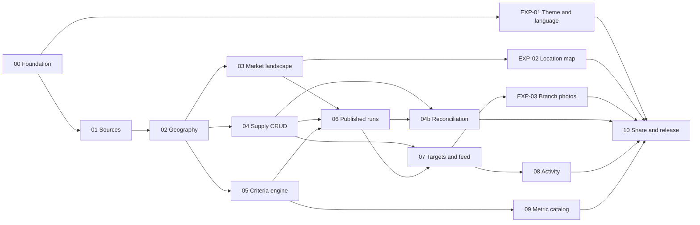

# CityMETER: Yolk v1.4 — แผนเริ่มพัฒนา

เอกสารนี้รวบ **12 งานหลัก + 3 งานประสบการณ์** เป็นลำดับเดียว ให้ dev หรือ coding agent รับทีละงานและตรวจผลได้ Handoff 1.4.0 เพิ่มการคัดด้วย Tier และการจัดอันดับตามน้ำหนัก อธิบายทั้ง 8 รูปแบบแยกจาก Supply และปรับ brand identity/link affordance โดยดู runtime commit/hash จาก [release manifest](contracts/release.v1.4.0.json) ไม่ hardcode revision ในแผน ส่วนที่เป็น production ด้านล่างยังต้องสร้าง พรีวิวที่มีอยู่เป็น HTML/CSS/JavaScript พร้อมข้อมูลจำลอง การสลับสมาชิก ประวัติ และการแจ้งเตือนในพรีวิวไม่ได้ทดแทน auth, tenant sync หรือ backend จริง

อ่าน [Product statement](CityMETER_Yolk_Product_Statement_v1.4.md) เพื่อเข้าใจงานของผู้ใช้ แล้วใช้ [task manifest JSON](contracts/implementation-tasks.v1.4.json) เป็นตัวสั่งงาน ใช้ [criteria contract](contracts/criteria.v1.4.json) เป็นกติกาคำนวณ ไม่ถอดสูตรใหม่จากภาพหน้าจอ เอกสารนี้แทนแผน v1.3; ไฟล์ประสบการณ์ [EXPERIENCE_v1.3.md](docs/EXPERIENCE_v1.3.md) ยังเป็นรายละเอียดเสริมของ EXP-01/02/03

## 1. เริ่มจากของที่มีอยู่จริง

รันจาก root ของ repository ได้ทันที ไม่ต้องติดตั้ง backend:

```sh
python3 -m http.server 8849 --bind 127.0.0.1
```

เปิด `http://127.0.0.1:8849/prototype/` หาก port ถูกใช้แล้วเลือก port ว่าง คำสั่งตรวจปัจจุบันใช้ Python 3 และ Node.js ไม่มีขั้น `pnpm install` ใน static preview:

```sh
python3 scripts/verify-public-release.py
node scripts/check-public-runtime.cjs
node scripts/check-theme-runtime.cjs
node scripts/check-map-runtime.cjs
node scripts/check-photo-runtime.cjs
node scripts/check-photo-form.cjs
node scripts/check-brand-identity.cjs
node scripts/check-icons.cjs
node scripts/check-ranking-v1.4.cjs
node scripts/check-decisions-v1.4.cjs
node scripts/check-web-identity.cjs
```

คำสั่งเหล่านี้ตรวจ source/contracts/controller ผ่าน Node VM และ mocked DOM/storage **ยังไม่ใช่การตรวจภาพใน browser** สถานะส่งมอบคือ `ready_with_open_manual_gate`; browser/อุปกรณ์จริงยังต้องตรวจหลังจาก approval-review block เดิมคลี่คลาย การ deploy สำเร็จไม่ปิด gate นี้

| มีในพรีวิว v1.4 | สิ่งที่ production ต้องสร้าง |
|---|---|
| TH/EN, light/dark/system, UI ที่อ่านง่ายขึ้น | บัญชีผู้ใช้ สิทธิ์ฝั่ง server การ sync และ device QA จริง |
| จำลอง criteria, rank, 8 market patterns, local feed | approved private data release, immutable runs และ publication jobs |
| Supply editor, local draft, ภาพจำลอง 5 มุม, IndexedDB | private media storage, server validation, revision, event/outbox |
| แผนที่ boundary/POI ฉากจำลองบน basemap จริง | geometry/crosswalk/membership/coverage ที่ตรวจแล้ว |
| email/LINE share preview | permissioned share grants และ delivery เมื่อ workspace เปิดใช้ |

### Stack และโครงสร้างที่แนะนำ

**ใช้ระบบเดิมของ CityMETER ก่อน** หากมี auth, storage, GIS, queue หรือ event platform ที่ตรงสัญญา ให้เขียน adapter ไปหาของเดิม PostgreSQL/PostGIS, TypeScript web/API และ background worker เป็น reference stack ไม่ใช่ข้อบังคับให้ย้ายระบบ

```text
apps/web/                  TH/EN หน้าจอและ map/list/detail
apps/api/                  API ที่ตรวจสิทธิ์ workspace ทุกครั้ง
apps/worker/               import, analysis, outbox, media jobs
packages/contracts/        JSON Schema/OpenAPI และ typed DTO
packages/criteria-engine/  pure calculation ไม่มี state ของ UI
packages/geo/              geometry, universe, crosswalk, aggregation
packages/data-adapters/    source → observation พร้อม lineage
packages/domain/           supply, target, revisions, events
packages/ui/               wrapper ที่อ้าง DS asset จริง
packages/i18n/             th-TH / en-US
fixtures/synthetic/        fixture สำหรับ public CI
```

Path ใน task manifest เป็น **ตำแหน่งที่จะสร้าง** หาก repo จริงต่างกัน ให้ task 00 สร้าง path/command mapping ก่อน dispatch งานต่อ ห้ามคาดว่ามี `apps/api/` หรือ package scripts เหล่านี้อยู่แล้ว ใช้ shared schemas และ generated client เพื่อลดการตีความ DTO คนละแบบ

## 2. สัญญาที่ห้ามหลุดระหว่างพัฒนา

- Workspace มาตรฐาน **1 Admin + 3 Editors + 6 Viewers** ทำงานบนชุดเดียวกัน Admin ดูแลทีม/แหล่งข้อมูล; Admin และ Editor บันทึกงาน/เกณฑ์ร่วมได้; Viewer อ่านและลองเกณฑ์ส่วนตัวได้ แต่เขียนร่วมไม่ได้ ตรวจทั้งหมดฝั่ง server
- กทม. ใช้ **แขวง** ต่างจังหวัดใช้ **อปท. ระดับพื้นที่ที่ไม่ซ้อนกัน** ไม่รวม อบจ. จังหวัดเป็นภาพรวมและตัวกรอง เริ่ม mode ใหม่ต้อง aggregate raw data และคำนวณ benchmark ใหม่
- Approved source, workspace overlay และ analytical aggregate แยกกัน การแก้สาขา/รูป/สถานะไม่เปลี่ยน B/C/U ทันที ต้องผ่าน reconciliation แล้ว publish run ใหม่
- Data quality มี `missing`, `observed_zero`, `unverified`, `not_applicable` แยกกัน ระบุ coverage, unit, period และ lineage ตาม metric ไม่เติมศูนย์เพื่อให้กราฟดูครบ
- ภาพ public preview และ fixtures เป็นข้อมูลจำลอง ข้อมูลจริงและ transaction/member data นำเข้าผ่าน private release ที่เจ้าของข้อมูลอนุมัติ ไม่มี source credentials หรือ customer records ใน public repository
- DS ใช้ **0.9.4** ตาม [asset integration](DS_ASSET_INTEGRATION.md) และ [hash manifest](contracts/ds-assets.v1.4.json) ไฟล์ v1.4 ระบุ DS asset ที่ ship; provenance เดิมอยู่ใน receipt เดิม; รายการ runtime ทั้งหมดดู [asset index](ASSET_INDEX_v1.4.md) และ [machine asset list](contracts/assets.v1.4.json) ห้ามแก้ bytes ของ canonical logo/font/color CSS **ไม่ใช้ motif ในแอปหรือ asset bundle** ตามคำขอรอบนี้
- วาง logo variant ที่อนุมัติแล้วบนพื้นเข้ากันได้โดยตรง **ไม่มีกรอบ card หรือแผ่นขาวรอง logo** ไม่เปลี่ยนสี/ครอป logo ใช้ icon ตาม DS ควบคู่ข้อความที่จุดตัดสินใจ เช่น เกณฑ์/เล็งทำเล/ตรวจยืนยัน/ชั้นแผนที่/บันทึก/รูปสาขา ไอคอนไม่สื่อว่าสถานะข้อมูล verified โดยไม่มีหลักฐาน
- Locale Insight เป็น contextual prior สำหรับ planning/field validation เท่านั้น ต้องมี crosswalk ก่อน aggregate และไม่แทนประชากรทางการ ขอบเขตตามกฎหมาย สิทธิ์ หรือหลักฐานพฤติกรรมจริง
- คัดพื้นที่หรือช่วงถนนก่อน แล้วจึงพิจารณา **แปลงที่ดิน ทางเข้าออก ฝั่งถนน และความเป็นไปได้จริง** ดาวเป็นแนวทางศึกษาต่อ ไม่ใช่การรับรองยอดขาย

### นิยามคำนวณที่ dev ต้องทำให้ตรง

**National cutoff:** เรียง known values ของ metric เดียวจาก pinned national universe เป็น `x[0..n-1]` ใช้ `h=(n-1)*p`, `k=floor(h)`, cutoff=`x[k]+(x[min(k+1,n-1)]-x[k])*(h-k)` โดย `p` อยู่ระหว่าง 0–1 นี่คือ `PERCENTILE.INC` ไม่มีข้อมูลให้ cutoff เป็น null; n=1 ให้ค่าเดียว ไม่คำนวณฐานใหม่เมื่อค้นหา/กรองจังหวัด

**ค่าหาร:** GFA/person ต้องมี population ที่ใช้ได้และมากกว่า0; ทุก `/km²` ต้องมี area ที่มากกว่า0และ lineage ของพื้นที่ กรณีหารไม่ได้เป็น missing พร้อม reason ไม่เป็น0หรือInfinity

| กลุ่ม | ตัววัด | Tier 1 | Tier 2 | Tier 3 |
|---|---|---|---|---|
| อาคาร | GFA, GFA/person, GFA/km² | ทั้ง3 ≥ P99 | ทั้ง3 ≥ P95 | อย่างน้อย1 ≥ P95 |
| กิจกรรม | จำนวนโรงงาน, โรงงาน/km², แรงงานโรงงาน, แรงงาน/km², ห้องโรงแรม, ห้อง/km² | ผ่าน P95 ≥5ข้อ | ≥3ข้อ | ≥1ข้อ |

เลือก Tier ที่ดีที่สุดก่อน Demand สูงเมื่อ **อาคาร OR กิจกรรม OR optional ready metric ที่เปิดใช้** ผ่าน ถ้าไม่มีสัญญาณยืนยันสูงและยังมีค่าขาดที่อาจทำให้ผ่าน ให้ Demand เป็น unknown; จะเป็นต่ำได้เมื่อข้อมูลพอยืนยันว่าไม่ผ่าน กลุ่มที่ปิดไม่เป็น hit/miss และไม่มีผลอันดับ ปิดทุกกลุ่มแล้ว apply ไม่ได้

พรีวิวเปรียบเทียบ `value >= cutoff` ดังนั้น **observed zero ผ่านได้เมื่อ cutoff เท่ากับ0** ต้องเก็บ fixture และบอก prevalence/coverage เพื่อทบทวน calibration ห้ามเพิ่มกฎ `value>0` เอง การเปลี่ยนกฎต้องเป็น criteria version ใหม่ ค่า P95/P99 ที่ snapshot มาให้ต้องตรวจว่าคำนวณจาก cohort/source version เดียวกัน

**Supply:** B=สาขาเรา, C=คู่แข่ง, U=สถานีรอระบุความสัมพันธ์ ค่าเริ่มต้น B≥3 และ C≥3 คือ “มาก” ส่วน `C/(B+α)` ยังไม่เปิดใช้ Runtime ลอง `k=0..U` แล้วพิจารณา `(B+k, C+U-k)`; ให้ชื่อ pattern แน่นอนได้เมื่อทุกกรณีได้แบบเดียว หากยังได้หลายแบบ แสดง possible patterns และคิวตรวจ สมมติฐานนี้ใช้ได้เมื่อ U เป็นสถานีที่อยู่ในขอบเขตและนับได้จริง แต่ไม่ทราบแบรนด์ หากไม่รู้สถานะเปิด/ซ้ำ/ตำแหน่งด้วย ต้อง reconcile หรือคืน unknown เพิ่ม ไม่บีบเป็นแค่ brand uncertainty

| Demand | คู่แข่ง | เรา | Pattern | ดาวเริ่มต้น |
|---|---|---|---|---:|
| มาก | มาก | มาก | Crowded | 0 |
| มาก | มาก | น้อย | FOMO | 2 |
| มาก | น้อย | มาก | Our Farm | 1 |
| มาก | น้อย | น้อย | Pioneer | 3 |
| น้อย | น้อย | น้อย | Quiet | 0 |
| น้อย | มาก | น้อย | Their War | 0 |
| น้อย | น้อย | มาก | Our Island | 0 |
| น้อย | มาก | มาก | Winter War | 0 |

**Tier ใช้คัด:** `qualifyingTier` เป็น Tier ที่ยืนยันได้ดีที่สุดของกลุ่มที่เปิด ปัจจัยเพิ่มเติมที่ผ่านเกณฑ์นับเป็น Tier 3 ค่า `maxDemandTier=3` รับ Tier 1/2/3; เลือก 2 รับ 1/2; เลือก 1 รับเฉพาะ 1 ตัวกรองนี้ใช้กับ Demand สูง เมื่อเปิด Demand ทุกระดับ รูปแบบ Demand ต่ำที่เลือกไว้ไม่มี Tier และไม่ถูกตัดด้วย Tier cap ส่วน unknown แยกเป็นรายการรอตรวจ

**Ranking ใช้เรียง:** workspace ใหม่ใช้ `weighted` แต่เกณฑ์ที่บันทึกก่อน v1.4 คง `legacy` จนทีมเปลี่ยนอย่างชัดเจน โหมด weighted เรียงรายการผ่านด้วย `rankScore` มากก่อน → `qualifyingTier` น้อยก่อน (null ท้าย) → `sourceRank` → `id` ดาวไม่บังคับลำดับในโหมดนี้

```text
metric_percentile = national_midrank(metric_value)                  # 0..100
missing_metric_bounds = [0,100]                                    # retain configured weight
group_score = normalized weighted mean(enabled metrics; default each=1)
Demand = normalized weighted mean(enabled building/activity/extra groups)
group_weights = building:50, activity:50, extra:50-if-enabled
ownGap = 100 / (1 + B / ownMany)
competitorGap = 100 / (1 + C / competitorMany)
rankScore = lower bound of normalized mean(Demand:70, ownGap:20, competitorGap:10)
```

น้ำหนักเป็นสัดส่วน 0–100 และไม่ต้องรวมเป็น 100 น้ำหนัก 0 ตัดเฉพาะการร่วมคะแนน ไม่ได้ปิดตัววัดในเกณฑ์ Tier เมื่อน้ำหนัก Demand มากกว่า 0 ต้องมีกลุ่มที่เปิดพร้อมน้ำหนักบวก และแต่ละกลุ่มที่ร่วมคะแนนต้องมีตัววัดน้ำหนักบวกอย่างน้อยหนึ่งตัว ดู validation เต็มใน criteria contract

ข้อมูลขาดยังคงน้ำหนักของตัววัดไว้ จึงเกิดช่วงคะแนน `rankScore` ถึง `rankUpper` ไม่เฉลี่ยใหม่โดยทิ้งตัววัดนั้น สำหรับ U ให้คำนวณจาก `(B+k,C+U-k)` ร่วมกันทุก `k=0..U` แล้วหาคะแนนต่ำสุด/สูงสุด ห้ามนำช่องว่างต่ำสุดของเราและคู่แข่งจากคนละกรณีมาบวกกัน

ตัวอย่างตรวจ: A มี Demand 90 / B=2 / C=0 / Tier 2 และ B มี Demand 80 / B=0 / C=1 / Tier 3 (threshold 3, U=0, ทั้งคู่ Pioneer) ได้คะแนน 85.0/83.5 ที่น้ำหนัก 70:20:10 และ 76.0/89.5 ที่ 40:50:10 เปลี่ยนเฉพาะน้ำหนักแล้วจำนวนที่ผ่านต้องไม่เปลี่ยน แต่การเปลี่ยน maxDemandTier จาก 3 เป็น 2 จะตัด B ออก ดูภาพอธิบายใน Product statement

สีทำเลยังใช้ **max known enabled-signal percentile rank** จังหวัดใช้ค่าสูงสุดของทำเลที่ผ่าน กราฟใช้ tie-midrank (n=1 แสดง 50) คนละนิยามกับ PERCENTILE.INC และคะแนนรวม ต้องระบุชื่อและหน่วยแยกใน DTO/legend

### ฟิลด์ที่เชื่อม UI กับเครื่องคำนวณ

ตัวอย่างเป็นเฉพาะส่วนที่เพิ่ม/ปรับใน v1.4 รวมเข้ากับ defaults ฉบับเต็มจาก criteria contract ไม่สร้างค่าตั้งต้นอีกชุดใน component

```json
{
  "demandMode": "high",
  "maxDemandTier": 3,
  "patterns": ["Pioneer", "FOMO", "Our Farm"],
  "rankingMode": "weighted",
  "rankingWeights": {"demand": 70, "ownGap": 20, "competitorGap": 10},
  "demandGroupWeights": {"building": 50, "activity": 50, "extra": 50}
}
```

`metricWeights` เก็บทุก ready metric ID โดยค่าเริ่มต้น 1 และ `extraMetrics=[]` ทำให้กลุ่ม extra ยังไม่ร่วมคะแนน อ่านผลผ่านฟิลด์จริงดังนี้:

| ฟิลด์ผล | หน้าที่ใน UI |
|---|---|
| `eligible` | ผ่านการคัดหรือไม่ ไม่เปลี่ยนเพราะแก้เฉพาะน้ำหนัก |
| `qualifyingTier`, `tierEligible` | Tier ที่ยืนยันได้และผ่านเพดาน Tier หรือไม่; Demand ต่ำแสดง n/a |
| `rankScore`, `rankUpper` | คะแนนรวมขอบล่าง/ขอบบน ใช้ขอบล่างเรียงใน weighted mode |
| `rankCoverage` | สัดส่วนน้ำหนักที่มีข้อมูลแน่ชัด 0–1 ไม่ใช่ความน่าจะเป็นว่าคำตอบถูก |
| `demandWeightedScore`, `demandWeightedUpper`, `demandWeightedCoverage` | คะแนนและความครบของข้อมูล Demand ก่อนรวม Supply |
| `rankingComponents` | `demand`, `ownGap`, `competitorGap` แต่ละตัวมี lower/upper เพื่ออธิบายคะแนน |
| `score` | ค่าสัญญาณ Demand สูงสุดสำหรับสีแผนที่เดิม ไม่ใช่คะแนนจัดอันดับรวม |

ตัวเชื่อม `normalizeCriteria(raw,{existing:true|false})` เติมฟิลด์ที่ขาดให้เกณฑ์เก่าโดยคง legacy และไม่สร้าง event/เพิ่ม version การเปลี่ยนโดยผู้ใช้จริงผ่าน `diffCriteria` ต้องเก็บ diff น้ำหนักแต่ละช่องและชื่ออ่านง่าย

## 3. ลำดับทำงานเดียวสำหรับคนและ agent

ID เดิมคงไว้เพื่อย้อนเอกสารได้ แต่ dependencies ด้านล่าง/JSON เป็นฉบับเดียวที่ใช้ dispatch งาน 15 งานนี้เป็น **งานวิศวกรรม** ไม่ใช่ชื่อ phase เชิงพาณิชย์ P1–P4



แผนภาพละเส้น dependency ที่ส่งต่อกันอยู่แล้วเพื่ออ่านง่าย; ตาราง/JSON เก็บ direct dependencies ทั้งหมด ทำ EXP-01 คู่กับ data track ได้ หลัง02 งาน03/04/05 ทำขนานได้ แต่ต้องตกลงเจ้าของ shared contracts ก่อน Task06 รอ03/04/05 เพราะต้องมี read model, mutation/event transaction และ engine ครบ

| ID | ผลที่ต้องส่ง | Depends on |
|---|---|---|
| 00 | ตั้งฐานระบบและสัญญาข้อมูล | — |
| 01 | ทะเบียนแหล่งข้อมูลและนำเข้าแบบตรวจสอบได้ | 00 |
| 02 | กำหนดพื้นที่วิเคราะห์และ crosswalk | 01 |
| 03 | หน้าแผนที่ประเทศ รายการ และ Market landscape | 01, 02 |
| 04 | CRUD สาขาและคิวตรวจสอบ | 00, 01, 02 |
| 05 | เครื่องคำนวณ Demand / Supply และอันดับ | 01, 02 |
| 06 | เกณฑ์ร่วมทีมและผลวิเคราะห์ที่ย้อนตรวจได้ | 03, 04, 05 |
| 04b | กระทบยอด POI ก่อนปรับ Supply | 04, 06 |
| 07 | Shortlist ประวัติ และการแจ้งเตือนเพื่อน | 04, 06 |
| 08 | Activity และ leaderboard | 07 |
| 09 | ขยายปัจจัย Demand ด้วยหลักฐานของ dataset | 01, 02, 05 |
| EXP-01 | ธีมส่วนบุคคลและภาษาอ่านง่าย | 00 |
| EXP-02 | แผนที่ขอบเขตและ POI ในหน้าทำเล | 02, 03 |
| EXP-03 | รูปสาขา 5 รูปและหลักฐานภาคสนาม | 04, 07 |
| 10 | แชร์ ทดสอบบนอุปกรณ์ และส่งมอบ pilot | 04b, 08, 09, EXP-01, EXP-02, EXP-03 |

## 4. งานทีละขั้น

แต่ละงานทำเป็น vertical slice: migration/DTO/API/UI เท่าที่เกี่ยวข้อง พร้อม test และหลักฐานรับงาน `input_paths`/`output_paths_proposed` อยู่ใน JSON ขั้นตอน เกณฑ์รับงาน และ prompts ต่อไปนี้ใช้ชุดเดียวกับ machine manifest

### 00 · ตั้งฐานระบบและสัญญาข้อมูล

**เริ่มเมื่อ:** เริ่มได้จาก repository และระบบ CityMETER เดิม

1. สำรวจ CityMETER เดิมก่อน เลือกใช้ auth, DB, queue, object storage และ DS loader ที่มีอยู่ แล้วเขียน architecture decision และ path mapping; ไม่ตั้ง service ซ้ำโดยไม่มีเหตุผล
2. สร้าง dev environment, CI, migration/seed runner และ schema/type generation ให้เริ่มด้วย synthetic workspace ได้ สร้างคำสั่ง production ที่ระบุใน command registry ก่อนให้ task ถัดไปเรียก
3. สร้าง workspace/membership และ guard ฝั่ง server: 1 Admin + 3 Editors + 6 Viewers พร้อมเปลี่ยน Admin อย่างปลอดภัย ทุก tenant-owned query ตรวจสมาชิก ไม่เชื่อ workspace_id จาก client
4. Pin DS 0.9.4 และ hash/role ของ assets; โหลดสี ฟอนต์ logo และ icon ตาม DS_ASSET_INTEGRATION.md ไม่ใช้ motif; แสดง native logo ทุกธีมโดยไม่มีกรอบ/พื้นรอง ไม่ recolor/crop; ใส่ favicon และ public share image ตาม identity contract; แยก TH/EN dictionary และ accessible shell

**รับงานเมื่อ**

- Clone ใหม่แล้วเปิด synthetic web/API ได้ตาม README ที่ทีมเขียนจริง
- CI ตรวจ schema drift, asset hashes, tenant boundaries และไม่รวมข้อมูลส่วนตัว/secret
- Viewer ไม่มี write scope; cross-tenant read/write ถูกปฏิเสธ; seat limit/last Admin มีการทดสอบ
- Runtime/bundle ไม่มี motif; logo วางบนพื้นเข้ากันได้โดยตรง ไม่มี card/frame/plate; decision controls มี DS icon คู่ข้อความหรือ accessible name
- Native Landometer logo มองเห็นได้ในทุกธีมและสอง layout; favicon และ Open Graph/Twitter image ใช้ approved assets/absolute HTTPS URL ตาม identity contract

**ทดสอบหลัก:** `contracts_generation`, `rbac_role_matrix`, `cross_tenant_access`, `seat_limits_1_3_6`, `last_admin_handoff`, `ds_asset_sha256`, `synthetic_seed_repeatability`, `no_motif_runtime_or_bundle`, `logo_native_no_plate`, `decision_icon_semantics`, `native_logo_all_themes`, `favicon_and_social_metadata`, `share_image_public_no_customer_data`

**Prompt สำหรับ agent**

```text
Implement only task 00. Reuse the existing CityMETER stack first and record any adapter/path mapping. Scaffold server-enforced workspace roles, synthetic boot, shared contracts, pinned DS assets and the documented check commands. Do not imply the current static preview already has an authenticated backend. Apply the current owner direction: no motifs, no logo plate/frame/recolor/crop, and meaningful DS icons with accessible labels at decision controls.
```

### 01 · ทะเบียนแหล่งข้อมูลและนำเข้าแบบตรวจสอบได้

**เริ่มเมื่อ:** 00 ผ่าน acceptance แล้ว

1. กำหนด SourceRelease: เจ้าของ/สิทธิ์ใช้/schema/ช่วงเวลา/วันอ้างอิง/coverage/checksum/refresh policy; raw snapshot จริงอยู่ private storage และ public CI ใช้ synthetic เท่านั้น
2. Normalize observation เป็น value, unit, period, quality, source_entity_id และ lineage แยก missing, observed_zero, unverified, not_applicable; ไม่แปลงช่องว่างเป็นศูนย์
3. ทำ import preview แสดง missing/duplicates/invalid values/denominators/coverage/diff และ quarantine แถวที่ผิด; preview ไม่ publish
4. Admin commit release ที่อนุมัติแล้วแบบ idempotent เก็บ immutable source; period ของ POI กับ aggregate ต้องแยกและตรวจ ไม่ทำให้ยอดเดิมเปลี่ยนโดยเงียบ

**รับงานเมื่อ**

- Retry source checksum เดิมไม่สร้างชุดซ้ำ; แถวผิดหน่วย/period/identity เข้าคิวตรวจ
- Counts เป็นจำนวนเต็มไม่ติดลบ; population/area ผิดหรือศูนย์ไม่ทำให้ ratio เป็น Infinity
- Release ข้อมูลจริงต้องมีหลักฐานสิทธิ์และ QA; ถ้า coverage ไม่ครบต้องติดป้ายและไม่อ้างครบประเทศ

**ทดสอบหลัก:** `missing_vs_observed_zero`, `negative_or_fractional_counts`, `denominator_invalid`, `schema_period_drift`, `idempotent_import`, `quarantine_invalid_rows`, `private_data_not_in_public_build`

**Prompt สำหรับ agent**

```text
Implement task 01 using synthetic import fixtures. Normalize the exact nine fuel metrics and provenance before adding optional sources. Create preview/commit separation, permission and checksum gates. Never embed private rows, source credentials or customer links in public code or logs.
```

### 02 · กำหนดพื้นที่วิเคราะห์และ crosswalk

**เริ่มเมื่อ:** 01 ผ่าน acceptance แล้ว

1. สร้าง profile bkk_khwaeng_upcountry_lao: กทม. ใช้แขวง; ต่างจังหวัดใช้ อปท. ระดับพื้นที่จาก allowlist ที่ตรวจแล้ว ไม่รวม อบจ. หรือพื้นที่ซ้อนทับใน universe เดียวกัน
2. Version geometry, effective period, stable place_id และ crosswalk จาก source_entity_id; join ด้วยชื่อเพียงอย่างเดียวไม่ได้ ข้อมูลที่ยังจับคู่ไม่ได้เข้าคิวตรวจ
3. คำนวณพื้นที่ km² ด้วยวิธี geodesic หรือ projected CRS ที่เหมาะสม บันทึกวิธี/CRS/denominator lineage ตรวจ gaps/overlaps ก่อน publish cohort
4. Pin membership/checksum ของ national universe; province filter เป็นเพียงตัวกรองการแสดงผล Future province/district/subdistrict/custom/road corridor ต้องมี aggregation และ universe ใหม่ ไม่เฉลี่ย percentile เดิม

**รับงานเมื่อ**

- แถวต้นทางผูกหน่วยวิเคราะห์ได้ครั้งเดียวหรือมีเหตุผลใน review queue
- ค่าวัดและ boundary ใช้ช่วงเวลา/หน่วยที่เข้ากันได้; gaps แสดงชัด; overlap ที่แก้ไม่ได้บล็อก cohort
- Locale Insight ใช้ contextual prior เท่านั้น ต้องมี crosswalk ก่อน aggregate; ไม่ใช้แทนประชากรทางการ/สิทธิ์/เขตตามกฎหมายหรือพฤติกรรมจริง

**ทดสอบหลัก:** `crosswalk_identity`, `effective_period_match`, `overlap_gap_report`, `metric_specific_aggregation`, `area_units`, `national_cohort_pin`, `filter_does_not_rebenchmark`

**Prompt สำหรับ agent**

```text
Implement task 02 with versioned primary units, crosswalks, metric-specific aggregation and one pinned national universe. Province shapes and bbox are not LAO boundaries. Keep contextual Locale Insight separate from official population/boundary evidence. Block unresolved overlaps rather than silently double counting.
```

### 03 · หน้าแผนที่ประเทศ รายการ และ Market landscape

**เริ่มเมื่อ:** 01, 02 ผ่าน acceptance แล้ว

1. สร้าง read model และ API ของ published run โดยเริ่มจาก synthetic contract fixture; task 06 จะต่อ publication pointer จริงภายหลัง
2. หน้า country ใช้จังหวัดเป็น summary/drill-down ไปหน่วยหลัก แสดง coverage/source period/run_id ทุกมุมมอง; สีสรุป max signal percentile ในทำเลที่ผ่านเกณฑ์ของจังหวัดนั้น
3. หน้า detail แสดงค่าดิบ/หน่วย/cutoff/percentile, building/activity/qualifying tier, aggregate B/C/U, 8 market patterns พร้อมเหตุผล และคะแนนแยกองค์ประกอบ/ช่วงความไม่แน่; brand breakdown เฉพาะข้อมูลที่มี coverage
4. ใช้ปุ่มขอบชัดพร้อม icon และข้อความ ดูรายละเอียด / View details จากรายการ; ทำ shortlist entry point, focus state, loading/empty/no eligible/insufficient evidence/error และรายการที่ใช้ keyboard ได้; แผนที่ทำเลส่งต่อ EXP-02

**รับงานเมื่อ**

- Map/list/detail ใช้ run_id และ place identity เดียวกัน
- ไม่ตีความจำนวนสาขาเป็น sales share และไม่ใช้ POI sample เป็นรายชื่อครบทุกสาขา
- แยกสีภาพรวมจาก ranking tuple; unknown มีสถานะเฉพาะ ไม่กลืนเป็นศูนย์
- ทั้ง 8 รูปแบบอธิบาย Demand / คู่แข่ง / สาขาเรา ตามเกณฑ์ที่ใช้อยู่ ปุ่มดูรายละเอียดมี icon ข้อความ ขอบ และ focus state; เปิดได้ด้วย keyboard

**ทดสอบหลัก:** `same_run_across_views`, `landscape_contract`, `coverage_partial_missing`, `map_score_vs_rank`, `count_not_sales_share`, `empty_error_states`, `bilingual_values_units`, `pattern_dynamic_threshold_descriptions`, `details_button_affordance`

**Prompt สำหรับ agent**

```text
Implement task 03 as a read-only vertical slice against a typed immutable-run fixture. Show evidence and unknown states before any action recommendation. Preserve the distinction between aggregate Supply and incomplete POI examples. Do not invent sales shares, traffic counts or real coordinates.
```

### 04 · CRUD สาขาและคิวตรวจสอบ

**เริ่มเมื่อ:** 00, 01, 02 ผ่าน acceptance แล้ว

1. แยก licensed source POI ที่ไม่แก้ทับออกจาก workspace overlay, Brand และ Verification; CRUD สาขาเรา/คู่แข่ง/รอตรวจ/ยืนยัน unbranded
2. เพิ่ม custom field, acquisition candidate, หลักฐาน, owner, duplicate review, archive/restore และ optimistic revision; unknown brand ไม่เท่ากับ unbranded ที่ยืนยันแล้ว
3. สร้าง mutation service ที่บันทึก record revision + before/after + immutable event + outbox ใน DB transaction เดียว รองรับ no-op/idempotency; งาน 07 นำ event ไปกระจาย feed
4. ทุกการแก้ POI ติด pending reconciliation; published B/C/U ยังคง release เดิมจนงาน 04b ตรวจครบ

**รับงานเมื่อ**

- Admin/Editor เขียนได้ Viewer ถูกปฏิเสธที่ server; เขียนข้าม tenant ไม่ได้
- Retry/no-op ไม่เพิ่ม event; revision conflict ไม่ทับงานคนอื่น
- Refresh source ไม่ลบ overlay/history; archive ไม่ทำให้ aggregate ลดทันที

**ทดสอบหลัก:** `supply_crud_rbac`, `optimistic_revision_conflict`, `source_overlay_separation`, `no_op_idempotent_event`, `unknown_vs_verified_unbranded`, `archive_restore`, `overlay_does_not_change_aggregate`

**Prompt สำหรับ agent**

```text
Implement task 04 only. Use a shared mutation service with server-side tenant guards, revisions and atomic event/outbox creation. Keep source records immutable and POI edits pending reconciliation. Prepare photo integration points without storing blobs in events.
```

### 05 · เครื่องคำนวณ Demand / Supply และอันดับ

**เริ่มเมื่อ:** 01, 02 ผ่าน acceptance แล้ว

1. ทำ pure functions จาก criteria.v1.4.json แยก PERCENTILE.INC สำหรับจุดตัดออกจาก midrank สำหรับคะแนน ทั้งสองใช้ national universe ที่ตรึงไว้ ไม่เปลี่ยนตามตัวกรองจังหวัด
2. คำนวณ Tier อาคารและกิจกรรมตาม 99-all / 95-all / 95-any และกิจกรรม 5/3/1 รวมทั้งขอบเขตเมื่อข้อมูลขาด qualifyingTier ใช้ Tier ที่ยืนยันได้ดีที่สุด ปัจจัยเพิ่มเติมที่เปิดและผ่านเป็น Tier 3; maxDemandTier เริ่ม 3 และใช้กับ Demand สูงเท่านั้น
3. จัด Supply และทั้ง 8 รูปแบบจาก B/C/U ตั้งต้น ownMany=3 และ competitorMany=3 ตรวจการกระจาย U ไป B/C ทุกกรณีแล้วคืน possiblePatterns; ความไม่แน่นอนไม่กลายเป็นผลที่ผ่านเกณฑ์
4. แยกการคัดออกจากการเรียง: demandMode, maxDemandTier และ patterns กำหนด eligible ส่วน weights กำหนดอันดับ โดยไม่เปลี่ยนชุดที่ผ่าน
5. คำนวณคะแนนตามสัดส่วนน้ำหนักองค์ประกอบ 70/20/10 กลุ่ม Demand 50/50/50 (กลุ่ม extra ต้องเปิดก่อน) และตัววัดละ 1 ข้อมูลขาดคงน้ำหนักไว้เป็นช่วง 0–100 ช่องว่างสาขาใช้ 100/(1+count/threshold) และตรวจ B/C จากการกระจาย U ชุดเดียวกัน
6. คง legacy ordering ของเกณฑ์เก่าจนผู้ใช้เลือก weighted แล้วกดใช้กับทีม ดาวไม่บังคับลำดับใน weighted mode คืนคะแนนรายองค์ประกอบ ช่วงคะแนน และโหมด แยกจาก score ที่ใช้ระบายสีแผนที่

**รับงานเมื่อ**

- Tier อาคาร/กิจกรรมและ qualifyingTier ใช้ฐานประเทศเดียวกันและตรง contract; missing ไม่เป็น 0 ส่วน observed zero ผ่าน cutoff zero ตามกฎเดิม
- ตัวเลือก Tier 1 / Tier 1–2 / Tier 1–3 คัดได้จริง ทำเล Demand ต่ำที่เลือกไว้ยังผ่านได้เมื่อ demandMode=all ส่วน unknown ถูกแยกไว้ เปลี่ยนเฉพาะน้ำหนักแล้วจำนวนที่ผ่านไม่เปลี่ยน
- ทั้ง 8 รูปแบบใช้ D/C/B ถูกต้องและอธิบายตาม threshold ปัจจุบัน ปิดทุกกลุ่ม Demand หรือให้น้ำหนักที่จำเป็นรวมเป็น 0 แล้วกดใช้กับทีมไม่ได้
- คะแนนอยู่ในช่วง 0–100 และคำนวณจากสัดส่วนน้ำหนักที่ถูกต้อง missing ไม่ทำให้เฉลี่ยน้ำหนักใหม่เฉพาะค่าที่มี U ใช้ joint bounds ไม่รวมค่าต่ำสุดจากคนละกรณี
- ตัวอย่าง A/B ได้ 85/83.5 และ 76/89.5 ตาม Product statement ลำดับเมื่อคะแนนเท่ากันคงที่ เกณฑ์ legacy ยังได้ลำดับเดิมก่อนผู้ใช้ยอมรับการเปลี่ยนสูตร

**ทดสอบหลัก:** `percentile_inc_interpolation`, `ties_zero_cutoff`, `missing_tier_bounds`, `disabled_metrics`, `all_groups_disabled`, `activity_5_3_1`, `all_eight_patterns`, `unverified_allocation`, `chart_midrank_not_cutoff`, `tier_cap_1_2_3`, `tier_cap_only_high_demand`, `unknown_not_eligible`, `weights_do_not_change_eligibility`, `weight_relative_normalization`, `weight_zero_validation`, `missing_weight_not_renormalized`, `supply_gap_formula`, `joint_supply_score_bounds`, `weighted_example_order_flip`, `weighted_stable_ties`, `legacy_criteria_migration`

**Prompt สำหรับ agent**

```text
Implement task 05 from contracts/criteria.v1.4.json as pure functions. Separate screening from weighted ranking and return explainable score bounds. Preserve national cutoff versus midrank semantics, missing values and joint U allocations. Keep saved legacy criteria ordering until explicit migration. Prove the documented A/B ranking example and that changing only weights never changes eligibility. Do not treat stars, map colour or proxy scores as actual sales.
```

### 06 · เกณฑ์ร่วมทีมและผลวิเคราะห์ที่ย้อนตรวจได้

**เริ่มเมื่อ:** 03, 04, 05 ผ่าน acceptance แล้ว

1. ทำหน้าเกณฑ์ 4 หมวด: Demand, Supply, รูปแบบทำเลที่สนใจ และน้ำหนักจัดอันดับ การ์ดรูปแบบทั้ง 8 ใช้ checkbox จริงพร้อมคำอธิบาย D/C/B วาง demandMode และ maxDemandTier ในหมวดรูปแบบทำเล
2. ทำ validate → private preview → apply(base_revision) → analysis job → publication pointer ให้ preview แสดงจำนวนทำเลเข้า/ออกและอันดับที่เปลี่ยนก่อน apply; Admin/Editor ใช้กับทีมได้ Viewer ทดลองส่วนตัวได้
3. บันทึก rankingMode, maxDemandTier, patterns, rankingWeights, demandGroupWeights, metricWeights และ thresholds ใน CriteriaVersion ที่แก้ย้อนหลังไม่ได้ เกณฑ์เก่าคง legacy; เตรียมร่างให้เลือกเปลี่ยนโดยไม่แก้ข้อมูลเดิมเงียบ ๆ
4. ระบุเวอร์ชัน criteria, source, geography, catalog, engine, output hash และ run ID เปลี่ยน publication pointer พร้อมกันเมื่อ QA ผ่านเท่านั้น pending/failed ยังคงผลที่ผ่านการตรวจครั้งล่าสุด
5. เมื่อ apply แล้วค่าเปลี่ยนจริง สร้าง event/outbox หนึ่งรายการพร้อม actor/time/before-after รวมถึงน้ำหนัก Tier และรูปแบบที่เลือก draft/no-op ไม่สร้าง event ส่วน rollback สร้าง revision ใหม่

**รับงานเมื่อ**

- ทั้ง 4 หมวดแยกชัด checkbox ทั้ง 8 อ่านและกดด้วย keyboard ได้ คำอธิบายมาก/น้อยเปลี่ยนตาม threshold ไม่ค้างค่าเริ่มต้น
- โหลดหน้าใหม่หรือสลับภาษาแล้วเกณฑ์ที่ apply ยังอยู่ ร่างเป็นไปตาม draft contract shared apply หนึ่งครั้งสร้าง event เดียวพร้อมความเปลี่ยนแปลงของ weights/Tier/patterns
- Concurrent apply แจ้ง conflict; failed job คงผลที่ผ่านการตรวจครั้งล่าสุด map/list/detail อ้าง run เดียวกัน และ run เดิมคำนวณซ้ำได้
- เกณฑ์ legacy มีขั้นเลือกใช้ weighted พร้อม preview อย่างชัดเจน private preview และการตั้งค่าส่วนตัวไม่แจ้งเพื่อนหรือเพิ่ม leaderboard

**ทดสอบหลัก:** `concurrent_apply`, `immutable_run_reproduction`, `atomic_publication_pointer`, `failed_job_last_good`, `rollback_new_revision`, `private_preview_no_event`, `four_section_criteria`, `accessible_pattern_checkboxes`, `dynamic_pattern_copy`, `criteria_weight_filter_persistence`, `weight_tier_pattern_diff_event`, `legacy_explicit_opt_in`, `preview_count_vs_order_diff`

**Prompt สำหรับ agent**

```text
Implement task 06 using four criteria sections and the task 05 engine. Use native accessible checkboxes for Preferred location types, dynamic D/C/B descriptions, a tier cap and separate ranking weights. Persist all criteria fields, preview count/order changes, preserve legacy mode until explicit opt-in and emit one shared event only on a committed change. Keep atomic immutable run publication and conflict handling.
```

### 04b · กระทบยอด POI ก่อนปรับ Supply

**เริ่มเมื่อ:** 04, 06 ผ่าน acceptance แล้ว

1. เปรียบเทียบ POI กับ baseline: physical-site identity, ซ้ำข้ามแบรนด์/layer, spatial membership, operating status, completeness และ source period
2. สร้าง preview B/C/U ก่อน–หลังพร้อม reason codes และ records ที่ยังไม่แน่; ยอดเท่ากันอย่างเดียวไม่แปลว่าชุดข้อมูลครบหรือเป็นเวลาเดียวกัน
3. Reviewer อนุมัติ reconciliation version แล้วสร้าง analysis run ใหม่ผ่านงาน06; เก็บ source/overlay/decision trace ย้อนตรวจ
4. หาก partial/failed คง baseline เดิมและแสดงสถานะรอตรวจ ไม่ลด unknown หรือเปลี่ยน count โดยการเดา

**รับงานเมื่อ**

- หลาย source records ไม่กลายเป็นหลาย physical branches โดยอัตโนมัติ
- POI ใหม่/รูป/การยืนยันไม่เปลี่ยน published counts จน review gate ผ่าน
- Retry publish ไม่สร้าง run ซ้ำ และ run เก่ายัง reproducible

**ทดสอบหลัก:** `cross_layer_duplicates`, `physical_site_identity`, `boundary_membership`, `source_vintage_mismatch`, `partial_coverage`, `reviewed_publish`, `failed_reconciliation_preserves_baseline`

**Prompt สำหรับ agent**

```text
Implement task 04b. Reconcile physical sites, effective boundaries, operating status and source vintage before changing analytical B/C/U. Emit a reviewed version and publish through task 06. Matching totals alone are insufficient evidence.
```

### 07 · Shortlist ประวัติ และการแจ้งเตือนเพื่อน

**เริ่มเมื่อ:** 04, 06 ผ่าน acceptance แล้ว

1. CRUD ทำเลที่เล็งไว้: owner/status/notes/custom fields/tasks และ history; place ID อ้าง geography release ปัจจุบัน รองรับ geometry_kind ใน schema เพื่อเพิ่ม polygon/road corridor ในอนาคต
2. ใช้ event ID เดียวแสดงใน feed ของ criteria/place/supply/workspace ตามบริบท; log บอกใครเปลี่ยนอะไร เมื่อไร และค่าเดิม–ใหม่
3. Outbox fan-out ไปสมาชิกอื่นที่ยังมีสิทธิ์ ณ เวลาส่ง ไม่แจ้งผู้ทำเอง; inbox แยก read state ต่อคนและใช้ stable cursor
4. System data refresh สร้าง event ประเภทระบบพร้อม diff/ลิงก์ผลที่ได้รับผลกระทบ เมื่อข้อมูลใหม่พร้อมจริง; มีการรวมข้อความเพื่อลดซ้ำและไม่ล้าง shortlist เดิม

**รับงานเมื่อ**

- หนึ่ง committed operation ปรากฏใน feed ที่เกี่ยวข้องและ recipient inbox ครั้งเดียว
- ถอนสิทธิ์แล้วอ่าน payload เก่าไม่ได้; delivery retry ไม่ซ้ำ
- View/search/private draft/read receipt/theme change ไม่ถูกนับเป็น shared work

**ทดสอบหลัก:** `context_fanout_same_event`, `recipient_authorization_at_read`, `outbox_retry`, `actor_exclusion`, `refresh_keeps_targets`, `private_actions_excluded`, `notification_deeplink`

**Prompt สำหรับ agent**

```text
Implement task 07 by projecting the same immutable events into contextual feeds and authorized inboxes. Create shared target workflow without coupling it to source refresh. System updates must be distinguishable from human actions and must not inflate the leaderboard.
```

### 08 · Activity และ leaderboard

**เริ่มเมื่อ:** 07 ผ่าน acceptance แล้ว

1. Project committed human operation_id ตาม actor/category/[from,to) ใน workspace timezone; canonical event timestamp เป็น UTC ค่าเริ่มต้น 30 วัน
2. แสดง action count, affected records และ distinct entities แยกกัน Bulk commit = 1 action; category/time filter และ drill-down ต้องใช้ filter เดียวกัน
3. Tie count ให้อันดับร่วม ใช้ stable actor ID สำหรับลำดับแสดง; ประวัติผู้พ้นทีมเก็บ attribution ตามสิทธิ์ workspace
4. ไม่ให้ views/clicks/no-op/failure/retry/draft/system refresh/seed/personal preferences เพิ่มคะแนน และอธิบายว่าเป็นการมีส่วนร่วม ไม่ใช่คุณภาพหรือผลงานขาย

**รับงานเมื่อ**

- ยอดรวมเท่ากับผลรวม category และ drill-down events
- Bulk action ไม่เพิ่มจำนวนตาม record count; operation เดียวจากหลาย context ไม่นับซ้ำ
- อ่านได้เฉพาะสมาชิกที่มีสิทธิ์ใน workspace

**ทดสอบหลัก:** `count_distinct_operation`, `bulk_one_plus_affected`, `category_sum`, `period_timezone_edges`, `tie_rank`, `excluded_events`, `former_member_attribution`

**Prompt สำหรับ agent**

```text
Implement task 08 from the activity policy. Count distinct committed human operations, not clicks or success scores. Reuse event authorization and expose drill-down evidence for each count.
```

### 09 · ขยายปัจจัย Demand ด้วยหลักฐานของ dataset

**เริ่มเมื่อ:** 01, 02, 05 ผ่าน acceptance แล้ว

1. ทะเบียน metric เก็บ unit/denominator/grain/period/coverage/privacy/aggregation/source meaning และ ready/partial/blocked พร้อมเหตุผล
2. เตรียม factory/workers, population, schools/students/large schools, hospitals/large hospitals, retail และ activity anchors เท่าที่ schema มีจริง จำนวนโรงงานเป็น core อยู่แล้ว
3. โรงพยาบาลใหญ่/โรงเรียนใหญ่เปิดได้เมื่อมี size measure หรือ source classification และนิยาม threshold; hospital count ไม่แปลเป็น beds และชื่อ POI ไม่พิสูจน์ขนาด
4. Optional metric เริ่มปิด เปิดแล้วมี catalog/preset version ใหม่และ distribution QA; Bangchak เป็น demo context เดิม ไม่เพิ่ม business dropdown โดยพลการ

**รับงานเมื่อ**

- Metric ขาดข้อมูลแสดงเหตุผลและไม่เข้าคำนวณ
- Coverage/missing/observed zero ถูกส่งต่อ engine และ UI ครบ
- ค่าที่เป็น proxy ไม่ถูกเล่าเป็น traffic หรือพฤติกรรมจริง

**ทดสอบหลัก:** `metric_availability_gate`, `unit_semantics`, `large_facility_definition`, `optional_default_off`, `version_on_new_metric`, `coverage_distribution_qa`

**Prompt สำหรับ agent**

```text
Implement task 09 as evidence-gated metric adapters. Keep Bangchak as the current business context. Add only metrics with explicit source fields and aggregation semantics; do not infer facility capacity or actual traffic from POI type.
```

### EXP-01 · ธีมส่วนบุคคลและภาษาอ่านง่าย

**เริ่มเมื่อ:** 00 ผ่าน acceptance แล้ว

1. ย้าย theme controller โดยคง light/dark/system, default system, prepaint resolution, storage/OS change behavior และ data-theme; sync ข้ามอุปกรณ์ผ่าน user preference เป็น optional
2. ใช้ exact DS token aliases: light canvas=surface-alt และ card=surface-canvas; dark ใช้ canvas/card ฝั่ง dark ห้ามแก้ canonical CSS เพื่อปรับหน้าจอเดียว
3. ใช้ main body 17px mobile/18px large, controls 16px, metadata เป้าหมาย14px, line-height1.65 เป็น baseline ทดสอบข้อความไทยยาว/200% zoom ก่อนลดตัวอักษร
4. ใช้คำไทยตรงการกระทำและ DS icon คู่ข้อความ ไม่ใช้ motif หรือ icon-only ที่ต้องเดา; TH/EN จำค่าภาษาและเปลี่ยนธีม/ภาษาไม่ล้าง draft หรือแจ้งทั้งทีม

**รับงานเมื่อ**

- Explicit theme ชนะ OS; system ตาม OS; storage พังยังใช้งานใน session ได้
- ทุก component/read state/focus/error/map overlay รองรับ light/dark และภาษา
- Personal preferences ไม่มี workspace event หรือ leaderboard count

**ทดสอบหลัก:** `theme_prepaint`, `os_system_only`, `storage_sync_failure`, `draft_preservation`, `thai_english_copy`, `personal_setting_no_event`, `responsive_zoom_manual`, `icon_text_accessible_name`, `icon_not_verification_claim`

**Prompt สำหรับ agent**

```text
Implement EXP-01 using the pinned DS asset graph and existing theme controller as a reference. Keep preferences personal and preserve unsaved work across language/theme changes. Report browser typography and responsive checks separately from controller tests.
```

### EXP-02 · แผนที่ขอบเขตและ POI ในหน้าทำเล

**เริ่มเมื่อ:** 02, 03 ผ่าน acceptance แล้ว

1. สร้าง GET map-context ผูก place/run/geometry/source versions; ใช้ Polygon/MultiPolygon EPSG:4326 ตรวจ ring/topology/identity/period; statuses verified/source/draft/synthetic/missing ไม่ยกระดับ source เป็น verified เอง
2. extent3857 ใช้ fit viewport เท่านั้น ไม่มี polygon ก็แสดง missing; POI ไม่มีพิกัดไม่วางจุดสมมติและแสดงจำนวนที่ขาด ตรวจ membership/edge cases ฝั่ง server
3. แสดง own/competitor/unverified กับ activity anchors ตาม coverage ที่มี จุด archived/closed ไม่อยู่ใน active map; synthetic map scene ไม่เข้าคำนวณ Supply
4. ทำ provider adapter: Simplified คือ OSM ลดสี, Detailed คือ OSM พร้อม labels, Satellite คือ ESA WorldCover Sentinel-2 2021 10m ผ่าน Terrascope พร้อม attribution; production ทบทวน terms/capacity/provider ที่เหมาะกับ traffic ก่อนเปิดจริง
5. มี layer controls/fit/list keyboard/popup และ network retry; tile ล้มยังเห็น boundary/POI/list; destroy listeners/timers เมื่อเปลี่ยน route; cache scope รวม workspace/run/geometry/POI release/access

**รับงานเมื่อ**

- ไม่มี bbox ปลอมเป็น boundary; geometry สถานะ/ช่วงเวลา/แหล่งอ้างอิงแสดงชัด
- Basemap ทั้งสามมี attribution และ satellite year/resolution note; ไม่ bundle/prefetch/offline download tiles
- อ่าน POI ข้าม tenant ไม่ได้; มี keyboard list เทียบเท่า map และไม่ใช้ภาพปี2021อ้างสภาพที่ดินปัจจุบัน

**ทดสอบหลัก:** `polygon_multipolygon_topology`, `bbox_fit_only`, `coordinate_membership`, `missing_coordinates`, `source_not_verified`, `tile_failure_recovery`, `map_route_cleanup`, `access_scoped_cache`, `map_keyboard_theme_manual`

**Prompt สำหรับ agent**

```text
Implement EXP-02 from the map contract. Draw only sourced or explicitly synthetic geometry, never an extent as a boundary. Keep tile providers replaceable and disclose satellite vintage. Preserve authorized POI/list access and run/version identity.
```

### EXP-03 · รูปสาขา 5 รูปและหลักฐานภาคสนาม

**เริ่มเมื่อ:** 04, 07 ผ่าน acceptance แล้ว

1. ย้าย draft UX เพิ่ม/ลบ/เลือกปก/reset และ max5 จาก preview; mockup มีป้ายจำลองเสมอ สาขาใหม่เริ่มว่าง รูปที่ยังไม่กด save ไม่เป็น shared event
2. สร้าง private upload intents อายุสั้นสำหรับ Admin/Editor; staging/quarantine ตรวจ MIME+magic bytes+decoded dimensions ฝั่ง server รองรับ JPG/PNG/WebP ขนาดเริ่มต้นตาม experience contract; strip EXIF/GPS และสร้าง derivative
3. PATCH branch ร่วม photo_operations ภายใต้ If-Match/idempotency และ lock/recheck active count<=5 หลังรวมคำขอ พร้อม one-cover constraint; reject cross-tenant object/intent
4. DB transaction เดียวบันทึก revision/photo metadata/event/outbox; event มี photo IDs/caption/cover changes ไม่มี bytes/signed URL; object storage ไม่ atomic ร่วม DB จึงใช้ idempotent promote/orphan cleanup
5. อ่านผ่าน authorized proxy หรือ URL อายุสั้น; remove เป็น tombstone/retention, failure กลับ last-saved draft ไม่ล้างข้อมูลสาขา; ภาพไม่เพิ่ม B/C/U จน reconciliation ผ่าน

**รับงานเมื่อ**

- Client/server ปฏิเสธรูปที่6 รวม concurrent uploads; Viewer ไม่ upload/remove/set cover
- Fake MIME/decode failure/oversize/cross-tenant intent ถูกปฏิเสธและ cleanup ได้
- Save retry มี event เดียว; revision conflict ไม่ทับรูปเพื่อน; storage error ไม่ทำ branch data หาย

**ทดสอบหลัก:** `max5_concurrent`, `mime_magic_dimensions`, `exif_stripping`, `viewer_cross_tenant_media`, `cover_unique`, `staging_commit_failure`, `orphan_cleanup`, `photo_event_no_blob_url`, `orientation_storage_error_manual`

**Prompt สำหรับ agent**

```text
Implement EXP-03 by adapting the preview draft UX to private object storage. Revalidate at the server, enforce the five-photo limit under a branch revision lock, and commit photo metadata/event/outbox atomically in the database. Use a staged object lifecycle; never claim object storage and DB are one atomic transaction.
```

### 10 · แชร์ ทดสอบบนอุปกรณ์ และส่งมอบ pilot

**เริ่มเมื่อ:** 04b, 08, 09, EXP-01, EXP-02, EXP-03 ผ่าน acceptance แล้ว

1. สร้าง share grant อายุ/สิทธิ์/เพิกถอนและ snapshot/run reference; manual link copy/native share ได้ Email/LINE delivery adapters เปิดเมื่อ workspace ตั้งค่าและอนุญาต ไม่ส่งจาก static preview
2. ตรวจ flow map→detail→criteria preview/apply→supply/photo save→context feed/inbox ทั้ง Admin/Editor/Viewer ใน TH/EN, light/dark/system และ 320/390/768/1440 CSS px
3. ตรวจ keyboard/touch/200% text zoom/reduced motion/tile error/upload error/revision conflict บน actual build; browser visual gate เดิมยัง open จนมีผู้ตรวจจริงและแนบหลักฐาน
4. ตรวจ asset hashes บนเว็บที่เผยแพร่ โลโก้จริงทุกธีมและมือถือ favicon, canonical/Open Graph/Twitter metadata ที่ใช้ URL แบบ absolute และภาพแชร์สาธารณะ ยืนยันไม่มี motif/กรอบโลโก้ ตรวจสิทธิ์ข้อมูล coverage การคำนวณซ้ำและ rollback พร้อมแยกผล source tests ออกจาก manual checks ที่ยังไม่ทำ

**รับงานเมื่อ**

- Expired/revoked share links และ membership removal ปิดการเข้าถึงจริง; export คุมสิทธิ์แหล่งข้อมูลด้วย
- Pilot ใช้ approved real release ใน private environment และผ่าน source/geo/engine/RBAC/DS/device gates
- ไม่ประกาศ production-ready ด้วย synthetic demo หรือ VM tests อย่างเดียว
- Metadata และภาพแชร์ที่เผยแพร่ตรง identity contract ไม่อ้างว่าแอปแชร์แสดงถูกต้องหากตรวจเพียงไฟล์และ metadata ลำดับใช้งานอธิบายได้ว่า Tier ใช้คัด ส่วนน้ำหนักใช้เรียง

**ทดสอบหลัก:** `share_grant_expiry_revocation`, `email_line_opt_in`, `access_scoped_export`, `end_to_end_roles`, `th_en_all_themes`, `mobile_zoom_keyboard_touch`, `live_asset_hash`, `release_rollback`, `manual_gate_evidence`, `published_favicon_social_card`, `tier_weight_user_flow`, `icon_details_action_accessible`

**Prompt สำหรับ agent**

```text
Implement task 10 only after its dependencies pass. Complete authorized sharing and observe the actual deployed build for mobile, accessibility and theme QA. Record any blocked or unperformed check as open. A public synthetic preview is not proof that production data, auth or tenant sync is ready.
```

## 5. API และ migration ที่ต้องสร้าง

API ทุกตัวอยู่ใต้ workspace scope ที่ server ตรวจได้ สร้าง OpenAPI/DTO จาก shared schema; path ต่อไปนี้เป็น contract ที่จะพัฒนา ไม่ใช่ endpoint ที่ static preview เรียกใช้อยู่

| กลุ่ม API | สัญญาสำคัญ |
|---|---|
| `POST /imports/preview`, `/imports/{id}/commit` | Admin, approval/checksum, preview ไม่ publish |
| `GET /results`, `/results/{place_id}`, `/map/summary` | run_id, coverage, source period, shared DTO |
| `GET /places/{id}/market-landscape`, `/places/{id}/map-context` | geometry/source/run/version/access scope ตรงกัน |
| `POST /criteria/validate`, `/preview`, `/apply` | private draft; rankingMode/maxDemandTier/patterns/weights; schema migration; shared revision; immutable run |
| `GET/POST/PATCH /supplies`, `/supplies/{id}/{verify|archive|restore}` | source/overlay, If-Match, one event/outbox |
| `POST /supplies/{id}/photo-upload-intents` และ branch PATCH | staged media, server validation, max5, branch revision |
| `POST /supply-reconciliations/preview`, `/{id}/publish` | site/period/coverage QA ก่อนเปลี่ยน counts |
| `GET/POST/PATCH /targets`, `GET /activity`, `/notifications`, `/activity/leaderboard` | contextual event, cursor, recipient/actor/time filters |
| `POST /shares`, `GET /shares/{token}`, `POST /shares/{id}/revoke` | permission, expiry, revocation, source-export rights |
| `GET/PATCH /me/preferences` | optional cross-device theme/language, ไม่ใช่ workspace event |

Migration namespace ที่เสนอ: `001_workspace_identity`, `002_source_releases`, `003_metric_registry`, `004_geography`, `005_supply_targets`, `006_criteria_runs`, `007_events_outbox`, `008_tasks_notifications`, `009_activity_projection`, `010_branch_photos`, `011_personal_preferences` ให้ทีมเลือก timestamp migration ID จริงตามระบบเดิมเมื่อเริ่มงาน การเรียงเลขในแผนไม่แทน DAG: 007 ต้องพร้อมก่อน supply mutation task04; task00 วาง migration runner และจุด integrate ให้ชัด

Core record ทุกตัวควรมี stable ID, workspace/source ownership ที่ชัด, revision, created/updated attribution และ quality/provenance ตามชนิดข้อมูล `CriteriaVersion` เก็บ screening และ ranking แยกกันพร้อม schema_version/rankingMode/weights; `AnalysisRun` เป็น immutable; `PublicationPointer` เป็นจุดเดียวที่ย้าย version; `ActivityEvent` เป็น append-only; notification เป็น projection แยก read state

## 6. คำสั่ง production ที่ task00 ต้องสร้างก่อน

ตารางนี้ **ยังรันไม่ได้ใน static repo ปัจจุบัน** เป็นชื่อเสนอสำหรับ stack ที่ใช้ pnpm ถ้า CityMETER ใช้เครื่องมืออื่น ให้บันทึกคำสั่งเทียบเท่าใน command registry แล้วใช้แบบเดียวกันทั้งทีม

| งาน | คำสั่งเสนอ |
|---|---|
| เตรียม dependencies/DB | `pnpm install`, `pnpm db:up`, `pnpm db:migrate` |
| เริ่มด้วยข้อมูลจำลอง | `pnpm db:seed:synthetic`, `pnpm fixtures:validate` |
| ตรวจ import โดยยังไม่ commit | `pnpm import:preview --manifest <approved-private-manifest>` |
| สัญญา/สูตร/ภูมิศาสตร์ | `pnpm test:contracts`, `pnpm test:engine`, `pnpm test:geo` |
| API/สิทธิ์/UI controllers | `pnpm test:api`, `pnpm test:ui` |
| Browser และ DS | `pnpm test:browser`, `pnpm check:ds-assets` |
| รวม release gates | `pnpm check:release` |

Public CI ใช้ synthetic fixtures และ mock external providers ไม่ควรพึ่ง live tile service หรือ real-data credentials การตรวจ integration กับแหล่งจริงทำใน private environment พร้อมสิทธิ์ที่จำเป็น

### วิธีใช้กับ coding agent

1. อ่าน product + criteria + task JSON และเลือก task ที่ dependencies รับงานแล้ว
2. ยืนยัน path mapping/เจ้าของ shared schema ก่อนแก้ พร้อมระบุ output paths ที่จะสร้าง
3. ใช้ `coding_prompt` ของ task นั้นร่วมกับ prompt ด้านล่าง ไม่สั่ง “ทำระบบทั้งหมด” ในรอบเดียว
4. ตรวจ acceptance + tests ที่ตรงงาน และรายงาน blockers/evidence ที่ยังไม่ครบก่อนมอบงานถัดไป

```text
Implement task <ID> from contracts/implementation-tasks.v1.4.json.
Read CityMETER_Yolk_Product_Statement_v1.4.md, contracts/product.v1.4.json,
contracts/criteria.v1.4.json, and DS_ASSET_INTEGRATION.md first.
Confirm dependencies and the agreed existing-stack path mapping.
Change only this task's bounded slice and necessary shared contract adapters.
Use synthetic fixtures in public code; real inputs require private approved releases.
Preserve source records, published runs, DS bytes, missing semantics and criteria behavior.
Run the task's tests with real command output. Do not treat proposed commands as existing.
Return: task_id, changed_paths, migrations, commands_run, test_results,
acceptance_evidence, unverified_items, next_blockers.
Do not mark manual browser/device QA passed without observing the actual build.
```

งานอิสระทำขนานได้ แต่ถ้าแก้ path เดียว เช่น `packages/contracts/` หรือ migrations ให้มีผู้รวมหนึ่งคนและส่ง interface patch ก่อน ไม่ให้ agent overwrite กัน Manifest ระบุ topological order ที่ถูกต้องหนึ่งชุด; ไม่จำเป็นต้องทำทุกงานเรียงทีละตัวหาก dependencies พร้อมแล้ว

## 7. Pilot gate และทางต่อยอด

**Pilot ใช้งานจริงได้เมื่อ** มี approved private SourceRelease และ geography/crosswalk ที่ตรวจแล้ว, run ที่ reproduce ได้, server-tested tenant/RBAC, Supply CRUD/reconciliation, criteria preview/apply, target/feed/notifications และ DS-linked TH/EN responsive UI ที่ตรวจบน browser จริง การมีเว็บสาธารณะจำลองไม่ทำให้เงื่อนไขเหล่านี้ผ่านเอง

การเพิ่มยอดขายราย transaction/สาขาและข้อมูลสมาชิกเป็น **งานแยกภายหลัง** เริ่มจาก purpose/access/minimization/retention แล้วจึงเชื่อม branch/place/time keys ตรวจคุณภาพ ช่วงเวลา daypart catchment ฝั่งถนน และพฤติกรรมที่วัดได้จริงก่อนนิยาม features ใช้ข้อมูลรวมในหน้าจอ ไม่เปิดที่อยู่รายบุคคล แบ่ง holdout ตามพื้นที่/เวลาเพื่อกัน leakage เปรียบเทียบ calibrated model กับ baseline นี้ รวมผลต่อสาขาเดิมและ cannibalization เก็บ model/data version พร้อมหลักฐานว่าแม่นขึ้นตรงไหนก่อนนำไปใช้จัดอันดับ

การคัด “ไข่แดง–ไข่ขาว” และ highway/corridor รวม bypass junction เป็นทางต่อยอด geography/metric model ต้องนิยามพื้นที่รับบริการและหลักฐาน traffic เพิ่ม การพิจารณารายแปลง ทางเข้าออก ข้อจำกัดกายภาพ/กฎหมาย และความเป็นไปได้เชิงพาณิชย์เกิด **หลัง shortlist พื้นที่** เสมอ

## 8. หลักฐานส่งมอบและสิ่งที่ยังเปิดอยู่

- Runtime/UI reference: [prototype](prototype/index.html), [experience contract](contracts/experience.v1.3.json), [source/controller QA](evidence/experience-qa-v1.3.json)
- Product/domain: [Product statement](CityMETER_Yolk_Product_Statement_v1.4.md), [product JSON](contracts/product.v1.4.json), [criteria JSON](contracts/criteria.v1.4.json)
- Dispatch: [15 tasks JSON](contracts/implementation-tasks.v1.4.json) มี dependencies, input/output paths, acceptance, test IDs, prompts และ command status
- Asset authority: [asset index](ASSET_INDEX_v1.4.md), [runtime assets](contracts/assets.v1.4.json), [DS guide](DS_ASSET_INTEGRATION.md), [DS hash/role manifest](contracts/ds-assets.v1.4.json), [release fingerprint](contracts/release.v1.4.0.json)

Browser visual/device QA ยัง **open** จาก automatic approval review ที่บล็อกขั้นตอนเดิมไว้ เอกสารนี้ไม่อ้างว่า source tests ปิดเรื่อง layout, tile interaction, Thai readability หรือ photo orientation บนอุปกรณ์จริงแล้ว Dev ต้องเก็บผลตรวจจริงเมื่อสามารถตรวจได้ และไม่เปลี่ยนสถานะเป็น passed จากการคาดเดา
