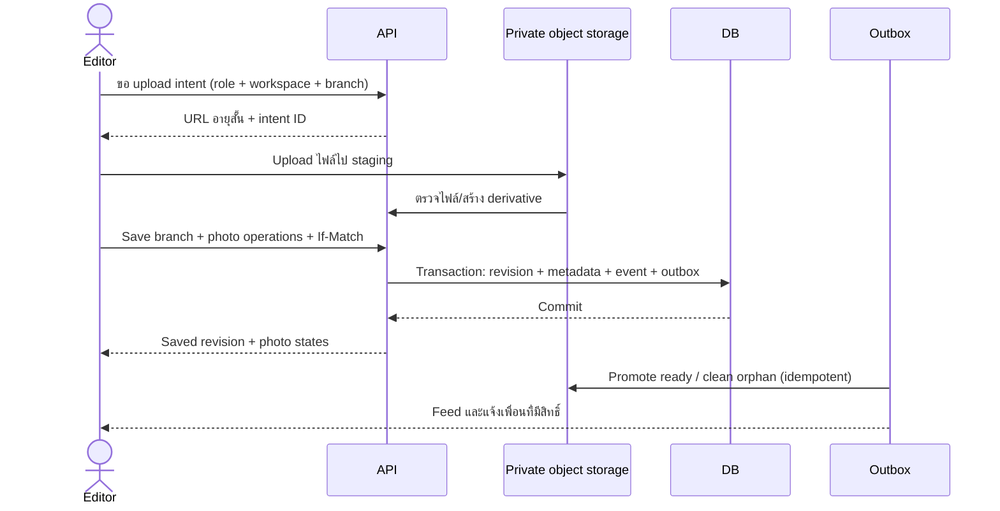

# Yolk v1.3 — อ่านง่าย เห็นพื้นที่ เก็บภาพสาขา

รอบนี้ทำให้ทีมอ่านข้อมูลได้นานขึ้น เข้าใจบริเวณรอบทำเล และเห็นภาพสาขาก่อนลงพื้นที่ หลัก Demand/Supply, percentile, รูปแบบตลาดทั้งแปด และสิทธิ์ทีมยังใช้สัญญาเดิม

## สิ่งที่ลองได้ในพรีวิว

| ส่วน | สิ่งที่ทำได้ | ขอบเขตของพรีวิว |
|---|---|---|
| ธีม | สว่าง / มืด / ตามเครื่อง จำค่าที่เลือก และเปลี่ยนตาม OS | เป็นค่าของผู้ใช้ในเบราว์เซอร์ ไม่เปลี่ยนเกณฑ์ทีม |
| ตัวหนังสือ | เนื้อหาหลัก 17 px บนมือถือ / 18 px บนจอใหญ่ ข้อความกำกับส่วนใหญ่ 14 px และปุ่ม/ฟอร์มหลัก 16 px | ค่าการใช้งานของ Yolk บนฟอนต์ DS; การตรวจภาพจริงยังรอดำเนินการ |
| Light theme | ใช้พื้นหลังเทาอมเขียวอ่อนและการ์ดนวล ลดพื้นที่ขาวสว่าง | ใช้ token เดิมของ LDS 0.9.4 ไม่มีการแก้สี canonical |
| แผนที่ทำเล | เลื่อน/ซูม ดูทั้งทำเล เปิด–ปิดขอบเขตและกลุ่ม POI เลือกจุดจากรายการ | ขอบเขตและจุดในเว็บสาธารณะเป็นฉากจำลอง ไม่เข้าคำนวณ Supply |
| พื้นหลังแผนที่ | เรียบง่าย / ดาวเทียม / รายละเอียด | ใช้บริการแผนที่ภายนอก ต้องมีอินเทอร์เน็ต มี attribution และสถานะโหลดไม่สำเร็จ |
| รูปสาขา | สูงสุด 5 รูป เพิ่ม/ลบ/เลือกปก/ย้อนร่างรูป แล้วบันทึกสาขา | รูปตัวอย่างมีป้าย “ภาพจำลอง”; รูปที่เลือกเองเก็บเฉพาะเบราว์เซอร์ ไม่มีการ upload |

พรีวิวสาธารณะใช้ภาพตัวอย่างที่สร้างด้วย AI และข้อมูลทำเล/จุดจำลอง พื้นหลังแผนที่เป็นภูมิศาสตร์จริง จึงแสดงคำอธิบายแยกสองส่วนนี้ไว้ใกล้แผนที่

## EXP-01 · ธีมและตัวอักษร

**ต่อจากงาน 00 — Runnable foundation**

1. โหลด production colour CSS และฟอนต์ DS ก่อน component styles; โหลด `experience.css` ท้ายสุด และเรียก preference controller ก่อนแสดง body เพื่อลดการสลับสีวาบแรกเข้า
2. ค่าเริ่มต้น `system`; อ่านเฉพาะ `light | dark | system` จาก local storage ค่าที่ไม่รู้จักกลับไปใช้ `system` หาก storage ใช้ไม่ได้ ให้เลือกธีมได้ใน session นั้น
3. เปลี่ยน `document.documentElement.dataset.theme` เป็นธีมที่ resolve แล้ว และ `data-theme-preference` เป็นค่าที่ผู้ใช้เลือก ตั้ง `color-scheme` ให้ native controls ตรงกัน
4. รับ OS change เฉพาะเมื่อเลือก `system`; sync preference ระหว่างแท็บผ่าน storage event หน้าใหม่และการสลับ TH/EN ต้องคงค่าเดิม
5. Production อาจ sync ค่านี้กับ `UserPreference` ผ่าน API ของตัวเอง เป็นการตั้งค่าส่วนบุคคล จึงไม่สร้าง workspace activity, notification หรือคะแนน leaderboard
6. ใช้ข้อความที่บอกการกระทำ เช่น “ดูทั้งทำเล”, “เล็งทำเลนี้”, “บันทึกสาขา” แทนข้อความยาว; ลดถ้อยคำก่อนย่อขนาดตัวหนังสือ

**Contract:** `YolkTheme.renderControl(lang)`, `setPreference(value)`, `getPreference()`, `getResolved()`, `apply()`; event `yolk:themechange` มี `{preference, theme}`. รหัส token และ palette อยู่ใน [DS integration](../DS_ASSET_INTEGRATION.md)

**ยอมรับงานเมื่อ:** explicit light/dark ชนะ OS; system ตาม OS; storage error ไม่ทำให้หน้าใช้ไม่ได้; ทุก route เก็บธีมและภาษาได้; TH/EN, keyboard, 200% zoom และ 320/390/768/1440 px อ่านและใช้งานได้จริง บันทึกผล browser QA แยกจาก unit tests

## EXP-02 · แผนที่ในหน้าทำเล

**ต่อจากงาน 02 และ 03 — Geography + read-only detail**

1. สร้าง `LocationMapContext` จาก approved source adapter ผูก `place_id`, `geometry_version`, `source_release_id`, effective date ถ้ามี, เวลาอ่านข้อมูล, CRS และสถานะหลักฐานกับข้อมูลใน published run
2. ขอบเขตต้องเป็น GeoJSON Polygon/MultiPolygon ใน EPSG:4326 และมี ID ตรงกับทำเล ตรวจ ring ปิด, พิกัด, topology, พื้นที่ผิดปกติ และ crosswalk ฝั่ง server ข้อมูลที่ผ่านเพียง format check ยังไม่ถือว่าได้รับรองเขตทางกฎหมาย
3. แยก `verified`, `source`, `draft`, `synthetic`, `missing` ชัดเจน `source` หมายถึงขอบเขตที่ผู้ให้ข้อมูลใช้; `verified` ต้องมีหลักฐานการตรวจเพิ่ม ห้ามยกระดับเอง `extent3857` ใช้จัดกรอบกล้องเท่านั้น **ห้ามวาดกรอบ bbox แทนขอบเขตทำเล**
4. Join POI ด้วย place ID/crosswalk และ membership policy ที่ระบุไว้ รวมสาขาเรา คู่แข่ง รอตรวจสอบ และ activity anchors ที่ dataset รองรับ เก็บ coverage แยกตามชั้นข้อมูล ตรวจพิกัดและแยกแยะจุดบนเส้นเขต; ชื่อแบรนด์อย่างเดียวไม่พิสูจน์ตำแหน่งหรือสถานะเปิดบริการ
5. วาดเส้นเขตและจุดพร้อม legend ที่มีชื่อ/สัญลักษณ์ สีไม่เป็นคำอธิบายเพียงอย่างเดียว มีรายการจุดสำหรับ keyboard เปิด popup ได้ และปุ่ม “ดูทั้งทำเล” ข้อมูลไม่มีพิกัดไม่นำไปวาดเป็นจุดสมมติ
6. ต่อ `BasemapProvider` ตามตารางด้านล่าง เก็บ provider/version/terms/attribution ใน config คง boundary และ POI เมื่อ tile โหลดไม่ได้ ให้ retry หรือเปลี่ยนพื้นหลังได้ ไม่ prefetch หรือเก็บ tile ออฟไลน์โดยไม่มีสิทธิ์
7. ทำ lifecycle ให้ชัด: mount หลัง route render, destroy map/listeners/timers เมื่อออกจากหน้า, invalidate size เมื่อ container เปลี่ยน และอัปเดตสีเส้นเขตเมื่อธีมเปลี่ยน

| ตัวเลือก | พรีวิว v1.3 | สิ่งที่ต้องบอกผู้ใช้ |
|---|---|---|
| Simplified / เรียบง่าย | OpenStreetMap street tiles ลดสีผ่าน CSS | เป็นข้อมูลถนนชุดเดียวกับ Detailed ใช้สีที่สงบเพื่ออ่าน overlay ง่ายขึ้น |
| Detailed / รายละเอียด | OpenStreetMap streets and place labels | แสดงแหล่งที่มา; ข้อมูลอาจเปลี่ยนตาม provider |
| Satellite / ดาวเทียม | ESA WorldCover Sentinel-2 annual composite ปี **2021**, 10 m ผ่าน Terrascope | ภาพสำหรับดูบริบทพื้นที่ ไม่ใช่ภาพปัจจุบันหรือภาพละเอียดระดับหัวจ่าย/แปลงที่ดิน |

Leaflet 1.9.4 อยู่ใน `prototype/vendor/` พร้อม licence. พื้นหลังโหลดจากบริการภายนอกเมื่อเปิดหน้า; ไม่มี tile หรือภาพดาวเทียมอยู่ใน repo. รักษา [OSM attribution](https://www.openstreetmap.org/copyright), [ESA WorldCover attribution](https://esa-worldcover.org/en/data-access) และ [Terrascope service attribution](https://docs.terrascope.be/Developers/WebServices/OGC/WMTSv2.html)

**Preview adapter:** `area.mapContext` หรือ `window.YOLK_MAP_CONTEXT[area.id]`; หากไม่มี GeoJSON ระบบใช้ extent เพื่อ fit viewport และแสดงเฉพาะจุดที่มีพิกัด Public fixture สร้างฉากจำลองเฉพาะ `area.synthetic === true` และไม่นำจุดฉากไปใช้ใน analytical counts

**Production API ที่ต้องสร้าง:** `GET /places/{id}/map-context?run_id=...` คืน geometry/coverage/version และ POI ที่ผู้ใช้นั้นมีสิทธิ์ดู Cache key รวม workspace, run, geometry version, POI release และ access scope ไม่ cache ข้าม tenant

**ยอมรับงานเมื่อ:** ใช้ Polygon และ MultiPolygon ได้, ID/CRS ผิดถูกปฏิเสธ, ไม่มี geometry แสดงสถานะ missing โดยไม่แต่ง polygon, หยุดแสดง archived/closed POI, จุดที่ไม่มีพิกัดมีจำนวนแจ้ง, tile failure ไม่ทำรายการ/overlay หาย, TH/EN และทั้งสามธีมเข้าถึงได้ การจำแนกข้อมูลในพรีวิวไม่ใช่ spatial membership validator สำหรับ production

## EXP-03 · รูปสาขาสูงสุด 5 รูป

**ต่อจากงาน 04 และ 07 — Supply CRUD + events**

พรีวิวมี 5 มุม: ด้านหน้า, ทางเข้า–ออก, หัวจ่ายและหลังคา, ร้านค้า, ลานจอดและทางวิ่ง สาขาตัวอย่างเริ่มด้วยภาพจำลองครบ 5 รูป หากต้องการเพิ่มรูปเองให้ลบภาพตัวอย่างก่อน สาขาใหม่เริ่มว่าง รูปที่เพิ่ม/ลบ/เลือกปกยังเป็นร่างจนกดบันทึกสาขา และย้อนกลับไปชุดที่บันทึกล่าสุดได้

**พฤติกรรมที่ทำอยู่แล้ว:** JPG/PNG/WebP, สูงสุด 10 MiB ต่อไฟล์, ตรวจ MIME และ magic bytes, อย่างน้อย 120×120 px, ไม่เกิน 24 ล้านพิกเซล และแต่ละด้านไม่เกิน 16,000 px; ย่อด้านยาวไม่เกิน 1,280 px แล้ว re-encode JPEG เป้าหมายไม่เกิน 420 KiB เก็บ IndexedDB ใน browser origin นี้ สร้างภาพไม่สำเร็จ/พื้นที่เต็มต้องแจ้ง error ร่างรูปไม่เพิ่ม Supply หรือสร้าง shared action ก่อนบันทึก

### ลำดับสำหรับ production

1. Migration `009_branch_photos`: `branch_photo(id, workspace_id, branch_id, object_key, mime, bytes, width, height, sha256, caption_th, caption_en, is_cover, status, created_by, created_at, revision)` และ `upload_intent(id, workspace_id, actor_id, expires_at, state)` ใช้ opaque object key แทน path ที่เดาจากชื่อไฟล์ได้
2. `POST /supplies/{id}/photo-upload-intents`: ตรวจสมาชิก/role (Admin หรือ Editor), branch access, quota และ MIME ที่รองรับก่อนออก URL อายุสั้นไป private object storage; Viewer ไม่มีสิทธิ์ upload, remove หรือ set cover
3. รับไฟล์ไว้ staging/quarantine ตรวจ magic bytes, ขนาด, decoded dimensions และเนื้อหาไฟล์ฝั่ง server re-encode derivative เพื่อลด payload/metadata และ strip EXIF รวม GPS ไม่เชื่อ filename, MIME หรือผลตรวจฝั่ง client
4. Client ส่ง `PATCH /supplies/{id}` พร้อม `If-Match`, `idempotency_key`, metadata และ `photo_operations` ร่วมกัน Server lock/recheck revision และ **active photos ≤5** หลังรวม add/remove ทั้งคำขอ; จำกัด cover หนึ่งรูป และปฏิเสธ object/upload intent ของ tenant อื่น
5. หนึ่ง DB transaction บันทึก branch/photo metadata, เพิ่ม revision, immutable `supply.updated` event และ outbox รวม before/after photo IDs กับ cover/caption changes ไม่ใส่ image bytes, signed URLs หรือ EXIF ใน event; no-op/ retry ไม่สร้าง event ซ้ำ
6. Object upload กับ DB transaction ไม่ atomic ร่วมกัน จึงเก็บ object staging จน commit metadata สำเร็จ ใช้ outbox/promoter ทำให้สถานะ `ready` อย่าง idempotent และ job ล้าง orphan ตาม retention; หาก commit ล้มเหลวไม่แสดงภาพเป็น saved
7. อ่านรูปผ่าน authorised proxy หรือ signed URL อายุสั้น ตรวจสมาชิกทุกครั้งก่อนออก URL Archive/delete ใช้ tombstone และงานลบตาม retention ไม่ลบหลักฐานเก่าทันทีหากยังต้องเก็บ audit อธิบายการหมดสิทธิ์อ่านและระยะ URL ค้างที่ยอมรับได้
8. ออก event หนึ่งรายการให้ feed สาขา/ทำเลที่เกี่ยวข้อง และ notification เฉพาะเพื่อนร่วมทีมที่มีสิทธิ์ รูปเป็นหลักฐานภาคสนาม ต้องผ่านการตรวจตามงาน 04b ก่อนมีผลต่อ Supply



**ยอมรับงานเมื่อ:** รูปที่ 6 ถูกปฏิเสธทั้ง client/server รวม concurrent uploads; fake MIME/oversized/decode failure ถูกปฏิเสธ; Viewer/cross-tenant access ไม่ผ่าน; conflict ไม่ทับรูปเพื่อน; retry มี event เดียว; remove/cover/caption มี before/after; failed upload ไม่ทำข้อมูลสาขาสูญหาย; event ไม่มี blob หรือ temporary URL; ทดสอบ actual phone image orientation และ error recovery ใน browser จริง

## Release และวิธีเริ่มงานแบบสั้น

สถานะ revision นี้คือ **`ready_with_open_manual_gate`**: พร้อมส่งมอบ preview และ source contracts แต่การตรวจภาพใน browser / responsive / keyboard บน build จริงยังเปิดอยู่ การตรวจดังกล่าวถูก automatic approval review บล็อกไว้ จึงไม่มีการอ้างว่าผ่านด้วย source tests หรือภาพจาก renderer อื่น

```text
Implement EXP-01 / EXP-02 / EXP-03 from docs/EXPERIENCE_v1.3.md.
Read contracts/experience.v1.3.json and the relevant core task first.
Preserve criteria engine, cohort, source release and DS asset hashes.
Use synthetic fixtures; do not add private data to the public repository.
Build one vertical slice, run acceptance tests, and report what is unverified.
Do not mark the browser/visual gate passed without observing the actual build.
```

เชื่อม workflow ใหม่กับ [แผนหลัก 12 งาน](../IMPLEMENTATION_PLAN_v1.2.md); ไม่สร้างระบบ auth, storage หรือ event ชุดที่สองหาก platform เดิมมีสัญญาที่ใช้ร่วมกันได้แล้ว
