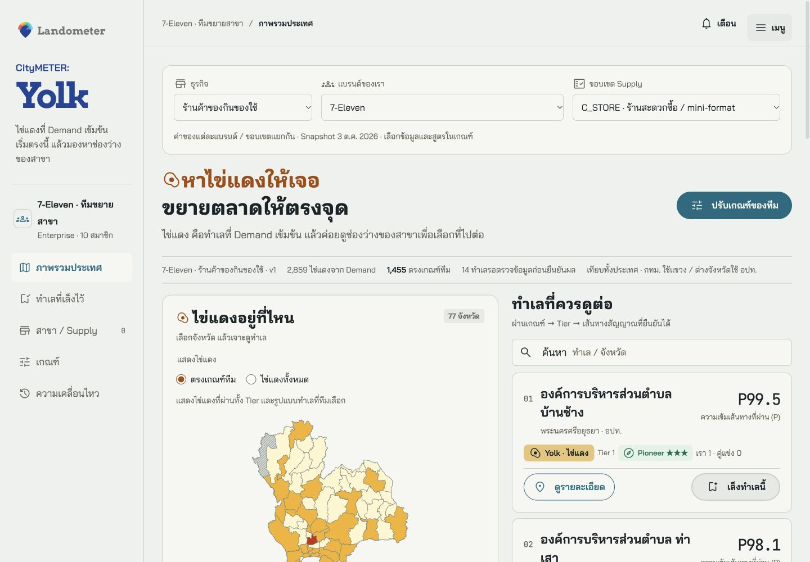
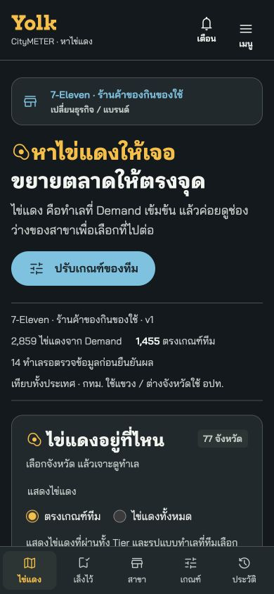
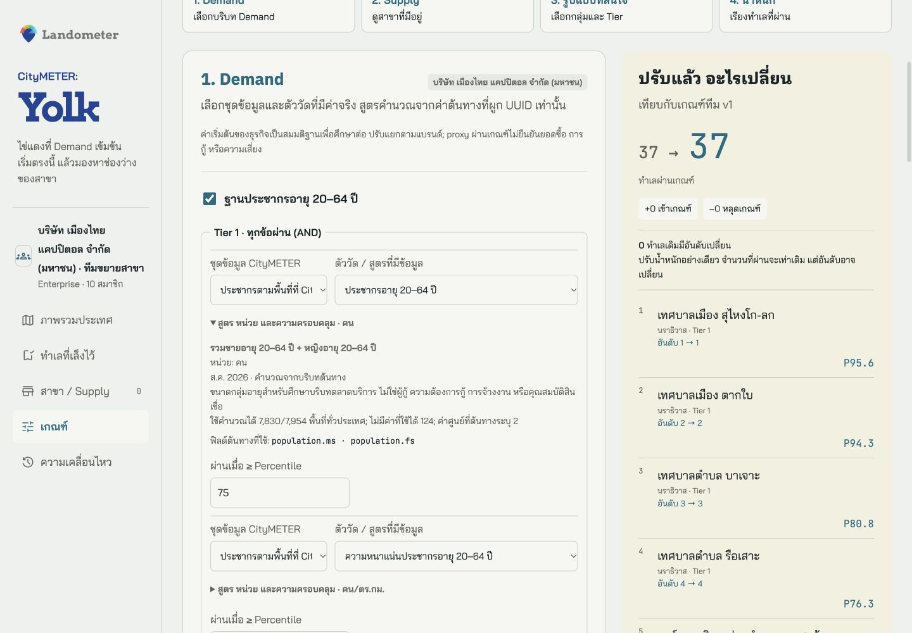
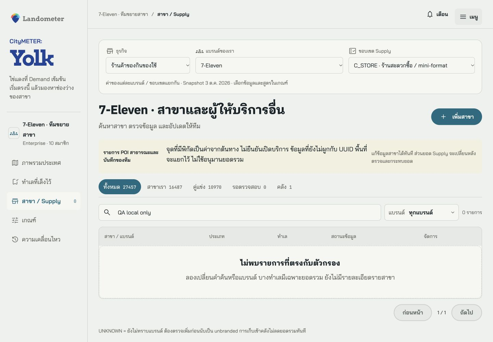
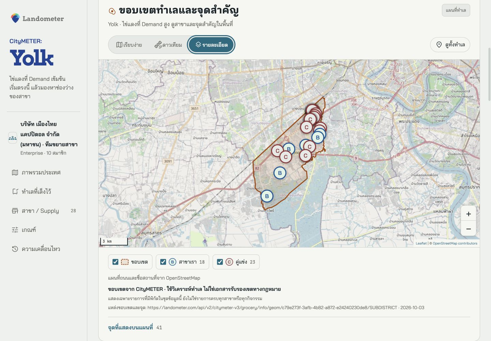
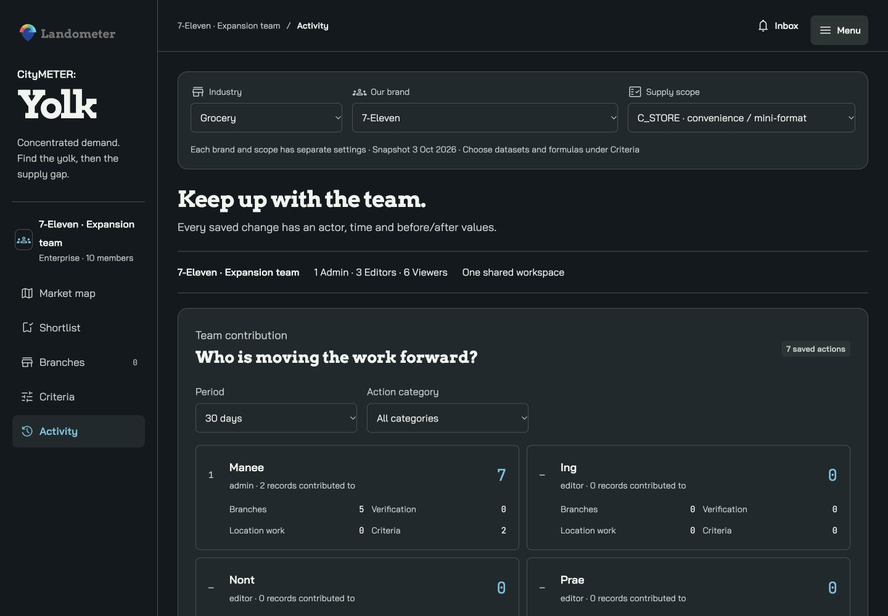

# UI เดิมของ Yolk · ข้อมูลจริง 3 ธุรกิจ

ภาพด้านล่างจับจาก browser ของ preview รุ่นนี้ ดูภาษา/ธีม/viewport และขอบเขตตรวจใน [QA receipt](../evidence/QA.md) ใช้ [เกณฑ์และสูตร](CRITERIA_GUIDE.md) ควบคู่กับภาพ; สีหรือชื่อ pattern ไม่ใช่ผลสอบเทียบธุรกิจ

## ภาพรวมประเทศ: หาไข่แดงก่อน แล้วเลือกกลยุทธ์

บริบทด้านบนเลือกธุรกิจ แบรนด์ และ Supply scope หน้าหลักแยกจำนวนไข่แดงจาก Demand, พื้นที่ที่ตรงเกณฑ์ทีม และรายการรอตรวจ พื้นที่ทุกจังหวัดมองเห็นได้ในทั้งสองธีม ไม่ใช้พื้นขาวจั๊วะหรือสีจังหวัดกลืนกับพื้นหลัง

แผนที่ใช้ national signal percentile จากพื้นที่ที่เกี่ยวข้องในมุมมองนี้ ส่วนรายชื่อใช้สูตร ranking ที่ทีมเลือก ค่าเหล่านี้ต่างกันและมี label บอก การเลือกจังหวัดไม่เปลี่ยน percentile ฐานประเทศ

## มือถือ: ย่อส่วนเลือกบริบท เก็บพื้นที่ให้เนื้อหา

Navbar เดิมอยู่ครบ ส่วนภาษา ธีม และบทบาททีมอยู่ในเมนู ส่วนธุรกิจ/แบรนด์อยู่ใน disclosure ที่เปิดเมื่อต้องเปลี่ยน โลโก้วางตรงบนเมนู ไม่มีกรอบ; ธีมมืดใช้ wordmark สี foundation text-primary ตาม DS

## เกณฑ์: เลือก dataset → metric/สูตร → parameter

แยก Demand, Supply, รูปแบบทำเลที่สนใจ และน้ำหนัก สูตร หน่วย field ต้นทาง รอบข้อมูล และ coverage เปิดดูได้ในแต่ละตัววัด ก่อน Apply เห็นจำนวนพื้นที่เพิ่ม/หายและอันดับเปลี่ยน การสลับแบรนด์เก็บค่าที่เลือกแยกกัน

[ดูหน้าเกณฑ์เต็ม · EN/dark](../evidence/browser-three-industry/desktop-en-dark-criteria.png)

[ดูรายละเอียดสูตรและ coverage ของสำนักงาน](../evidence/browser-three-industry/desktop-th-office-formula.png)

ภาพสำนักงานเป็นตัวอย่างการเปิดดู coverage ของ metric ที่มีข้อมูลน้อย ไม่ได้เปิดใช้สำนักงานใน preset ทั่วประเทศ การเปลี่ยนค่าบนหน้าจอไม่ยืนยันว่ากลุ่มข้อมูลนั้นเหมาะกับทุกธุรกิจ

## Supply: ยอดรวมกับ POI เป็นคนละชั้นหลักฐาน

รายการแสดงภายใน format/license scope ที่เลือก และแบ่งเครือข่ายเรา ผู้ให้บริการอื่น และรอตรวจ ชื่อ/พิกัดมาจากต้นทางเมื่อมีจริง ทีมแก้ไขผ่าน overlay; การเพิ่ม POI ไม่ทำให้ source aggregate เปลี่ยนทันที

5 รูปที่ใช้ทดลอง editor เป็น mockup จากสถานีสมมติ แยกจากรูปสาขาที่ตรวจจริงและจากข้อมูล Grocery/Non-bank

## Non-bank: ระบุขอบเขตข้อมูลก่อนสรุปตลาด

ทำเลใช้บริบทประชากรอายุ 20–64 และความหนาแน่น Supply แสดงยอดที่ต้นทางผูกพื้นที่ได้ และจำนวนที่ยังต้องตรวจแยกกัน แผนที่เลือกผู้ให้บริการใน license scope เดียวกับเกณฑ์; ใบอนุญาตบริษัทไม่ได้ยืนยันบริการของทุกจุด

ขอบเขตในภาพนี้เป็นหนึ่งใน direct source polygons ที่มีจริง พื้นที่อื่นที่มีเพียง extent จะบอกว่าไม่มี polygon ข้อมูลเขตที่เห็นไม่ได้เป็นการรับรอง statutory boundary หรือจำนวนผู้กู้

## ทำงานร่วมกัน

เล็งทำเล เก็บหลักฐาน มอบหมายงาน และติดตาม feed/leaderboard ตาม action ที่บันทึกสำเร็จ ใน preview จำลองผ่าน browser storage; การเชื่อมสมาชิกพร้อมกันและการส่ง notification จริงอยู่ใน [implementation plan](../IMPLEMENTATION_PLAN_v1.6.md)

ภาพ snapshot เป็นส่วนหนึ่งของหลักฐานการตรวจ ไม่มีการแก้ภาพเพื่อซ่อนข้อจำกัด รายละเอียด viewport/font/overflow อยู่ใน render matrix; ไม่เท่ากับทดสอบบนเครื่องมือถือทุกชนิด
