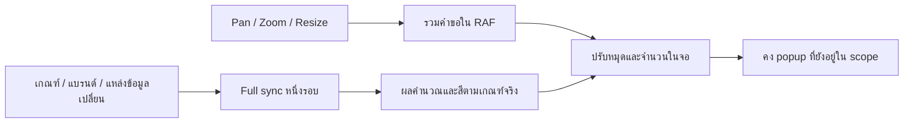

# เลื่อนแผนที่ เปิดหมุด แล้วทำงานต่อได้ — Yolk v1.7.1

รุ่นนี้ลดงานซ้ำที่ทำให้แผนที่สะดุด รักษา popup ของสาขาระหว่างเลื่อน ซูม และเปิดเมนู พร้อมแสดงโลโก้ ชื่อแบรนด์ และชื่อสาขาให้ชัด ผู้ใช้เลือกดู Street View อ่านคำถามสำหรับ Google AI Mode หรือค้น Google ต่อได้ ส่วนลิงก์ตรงไปยังสาขาจะรอข้อมูลจริงก่อนเปิดฟอร์มแก้ไข

**ผลคัดทำเลคงเดิม:** การปรับนี้ไม่เปลี่ยนสูตร Demand, Supply ต่อขนาดตลาด, เกณฑ์ Tier, รูปแบบทำเล, percentile ฐานประเทศ หรืออันดับจากเกณฑ์เดียวกัน ใช้ 7,954 UUID เดิม: แขวง กทม. 180 และ อปท. ต่างจังหวัด 7,774 พร้อม 25 metrics การจับหมุดกับ source polygon ใช้แสดงมุมมองเท่านั้น ไม่เขียน assignment หรือเปลี่ยนยอดรวม Supply

**สถานะ:** automated checks 179 ข้อผ่าน; model parity 12 กรณี × 7,954 แถวตรงกันทั้งเนื้อหาและลำดับ; popup ตรวจใน Chrome จริงครบไทย/อังกฤษ × light/dark × desktop/mobile; hover ตรวจจริงครบสามระดับตามสถานะที่ระบุท้ายเอกสาร การทดสอบเครื่องมือถือจริง ผู้ให้บริการ Google และ live deployment ยังแยกเป็น gate ที่ต้องเติมหลักฐาน

[Machine contract](../contracts/responsiveness.v1.7.1.json) ระบุ API, tasks, acceptance, source hashes และขอบเขตหลักฐานสำหรับ dev/agent

## อะไรเปลี่ยน และผู้ใช้ได้อะไร

| ปัญหา | สิ่งที่แก้ | ผลที่ใช้ตรวจรับ |
|---|---|---|
| pan/zoom เรียก full sync ซ้ำ รวมงานสีพื้นที่และคำนวณ | รวมคำขอด้วย RAF แล้วอัปเดตเฉพาะหมุด/จำนวนใน viewport | viewport-only ไม่คำนวณหรือวาด choropleth ใหม่ |
| อ่าน computed styles แทรกใน loop ของพื้นที่ | อ่าน token หกตัวหนึ่งครั้งต่อ full sync; ลด sync ซ้ำหลัง mount | สี LDS เดิม; adapter อ่าน styles 1 ครั้ง จากเดิม 1,933 |
| ล้างหมุดแล้วสร้างใหม่ ทำให้ popup ปิด | reconcile marker ด้วย record ID และ context | สาขาเดิมคง marker/popup; รายการที่หลุด scope ถูกลบ |
| popup autopan/resize ทำให้หมุดหลุดจอชั่วคราว | เก็บหมุดที่เป็นจุดยึดของ popup เมื่อยังอยู่ใน scope | popup ไม่หาย; หมุดที่อยู่นอกจอไม่นับในจำนวนที่มองเห็น |
| storage update ทำให้ source branches หาย | ประกอบ source cache กับ local overlays ใหม่ | source inventory และบริบทอื่นไม่ถูกทับ |
| ผลค้น/กิจกรรมเก่าพากลับผิดงานหลัง await | ตรวจ route/context ticket ก่อนนำทาง | การเลือกใหม่ของผู้ใช้ไม่ถูกผลเก่าดึงกลับ |
| ลิงก์สาขาเปิดก่อนโหลดข้อมูลกลายเป็นฟอร์มใหม่ว่าง | แยก loading/absent/error จาก new form | สาขาเดิมเปิดจาก record จริง; `#poi/new` เท่านั้นที่สร้างใหม่ |

RAF ช่วยตัดงานที่ไม่จำเป็น ไม่ได้ย้ายการคำนวณหนักเข้า worker อัตโนมัติ งาน worker/server และการวัดความเร็วบนเครื่องจริงยังเป็นขั้นพัฒนาต่างหาก



## Hover ให้รู้ว่าจะเจาะพื้นที่ไหน

**ชั้นสีตอบว่า Demand อยู่ตรงไหน; ชั้นที่กดตอบว่าจะเจาะพื้นที่ไหนต่อ** ทั้งสองใช้ Polygon ต้นทางจริง

| หน้าที่เห็น | พื้นที่ลงสี | hover/คลิกเพื่อเจาะต่อ |
|---|---|---|
| ประเทศ | อำเภอ | จังหวัด |
| จังหวัด | แขวง/อปท. | อำเภอ |
| อำเภอ | แขวง/อปท. | ทำเลนั้น |

Hover เป็นกรอบ **ไม่เติมสีด้านใน** ใช้ UI selection token `--yl-map-active` พร้อมชื่อพื้นที่ ไม่มี bbox/centroid สร้างขอบเขตทดแทน ไม่เปลี่ยน analytical fill, Tier, metric หรือการเลือกแหล่งข้อมูล

API ที่มีจริงใน `prototype/map-hover.js`:

```js
const hover = YolkMapHover.create({
  map: existingLeafletMap,
  L,
  token: () => currentDSActiveToken
});
const unbind = hover.bind(sourceHitLayer, event => ({
  level: 'province', // หรือ district / location ตามระดับจริง
  id: sourceId,
  feature: exactSourceFeature,
  label: targetLabel
}));
// caller เป็นเจ้าของ click/keyboard navigation
hover.clear();
// เมื่อเลิกใช้ layer: unbind(); เมื่อเลิกใช้ helper: hover.destroy();
```

`show(target, latlng)`, `clear(expectedTargetOrKey?)`, `getState()` และ `usableFeature(feature)` ใช้ตรวจแยกได้ การเลื่อนภายใน target เดิมใช้ outline เดิม; mouseout ของ target เก่าต้องไม่ล้าง target ใหม่

**อย่าลด specificity ของ CSS นี้:** path ที่ไม่มี fill ต้องรับ pointer ภายในพื้นที่ได้ และ outline ต้องไม่บังการคลิก โหลดหลัง Leaflet/workspace styles

```css
.workspace-map-panel .leaflet-overlay-pane svg path.workspace-navigation-hit {
  pointer-events: all;
  cursor: pointer;
}
.workspace-map-panel .leaflet-overlay-pane svg path.workspace-navigation-outline {
  pointer-events: none;
}
```

สี hover เป็นสถานะ UI จึงใช้ token ตามธีมได้ ส่วนสีข้อมูล Demand คง HEX และทิศความหมายเดิมทั้ง light/dark ไม่มีการแปลงสีหรือใช้ opacity เปลี่ยนค่าข้อมูล

## Popup ที่อ่านและเลือกทำงานต่อได้

ลำดับข้อมูลคือ **โลโก้ → แบรนด์ → ชื่อสาขา → O/C/U พร้อมความหมาย → การกระทำ** โลโก้อ่านจาก [brand registry contract](../contracts/brand-experience.v1.7.json) ใช้ original asset bytes และสัดส่วนเดิม ไม่ crop, recolour, ล้อมกรอบ หรือสร้างภาพแทน เมื่อ asset/variant ใช้ไม่ได้ ให้แสดงชื่อแบรนด์ที่อ่านได้ โลโก้ขนาดกะทัดรัดต้องเป็น `verifiedSquareGraphic=true`; ไม่ตัด wordmark กว้างให้เป็นสี่เหลี่ยม

Module `prototype/poi-popup.js` / `.css` มี `YolkPoiPopup.render(point, {lang, industry, area, ownBrandId, ownBrandName})` และ helpers `prompt()`, `links()`, `publicContext()`, `relationship()`, `validPoint()` โหลด JS หลัง brand/icon modules และ CSS หลัง workspace styles ปุ่ม `data-workspace-open-poi` เปิด branch editor เดิม

ชื่อสาขามาจาก record ที่กด ข้อความต้นทางต้อง escape; URL query ต้อง encode ชื่อยาวตัดบรรทัดได้ทั้งไทย/อังกฤษ ปุ่มมีข้อความ/icon ที่ตรงความหมาย มี close action และ keyboard focus ไม่มี outbound request จนกว่าผู้ใช้กดลิงก์

| การกระทำ | ข้อมูลที่ใช้ | ความหมายที่ต้องสื่อ |
|---|---|---|
| **Street View** | พิกัดสาขาต้นทางที่ valid | เปิด Maps ภายนอก; ภาพใกล้พิกัดอาจไม่ใช่ตัวสาขาหรือภาพล่าสุด |
| **ถาม Google AI Mode** | คำถามสาธารณะจากแบรนด์/สาขา/ทำเลและบริบทธุรกิจ | อ่านคำถามก่อนเปิดได้; ใช้งานได้ตามเงื่อนไขของ Google |
| **ค้น Google** | คำถามเดียวกัน | ทางเลือกค้นปกติเมื่อ AI Mode ใช้ไม่ได้ |

Street View ใช้ `api=1&map_action=pano&viewpoint=lat,lng` ตาม [Google Maps URLs](https://developers.google.com/maps/documentation/urls/get-started) ไม่เอาจุดกึ่งกลางทำเลมาแทนพิกัดสาขาที่ขาด AI Mode ใช้ query ที่แสดงใน popup พร้อม `udm=50&aep=11` เป็น **best-effort link ไม่ใช่ third-party API contract ที่ Google รับรอง** มี Search ปกติอยู่ในส่วนคำถาม ข้อจำกัดบัญชี/พื้นที่และความถูกต้องของคำตอบดูที่ [Google Search Help](https://support.google.com/websearch/answer/16011537)

Query ไม่รวมบันทึกทีม รูปส่วนตัว ข้อมูลลูกค้า/สมาชิก/ผู้กู้ ยอดขาย metrics หรือเกณฑ์ภายใน เปิดแท็บใหม่ด้วย `noopener noreferrer` ไม่มี prefetch ภาพ/คำตอบ และ Yolk ไม่ยืนยันคำตอบภายนอก การเปิด popup หรือค้นข้อมูลไม่เพิ่ม activity/leaderboard; การบันทึก evidence ภายหลังต้องผ่าน explicit commit ปกติ

บนหน้าจอแคบ popup ขยายแผนที่ชั่วคราว คง geographic centre และจำกัด scroll ภายใน ไม่ fit ใหม่ `ResizeObserver` วัดความสูง host จริงเพื่อกำหนดพื้นที่อ่าน ปิด popup แล้วคืนความสูงตาม layout ที่ viewport 390×844 ที่ตรวจจริง panel/host สูง 520/420 px เมื่อเปิด และ 320/220 px เมื่อปิด ตัวเลขนี้เป็นสถานะที่ตรวจ ไม่ใช่ค่าบังคับทุกอุปกรณ์

## เปิดสาขาจากลิงก์ตรงโดยไม่ทำข้อมูลร่างหาย

`poiEditor()` ต้องแยกสี่สถานะ: **loading → record ที่พบ / ไม่พบ / โหลดผิดพลาด** มีฟอร์มใหม่เมื่อ route เป็น `#poi/new` เท่านั้น Existing ID ที่กำลังโหลดไม่ควร render ฟอร์มว่างที่มี `data-id=new`

`ensureSourcePoints()` โหลด source inventory ของ context ปัจจุบัน เมื่อพร้อมให้ render ชื่อแบรนด์ ชื่อสาขา และพิกัดของ ID ที่ขอจริง `workingForm()` จับ `{id, recordId, recordRevision, values, focus, selection, province}` เฉพาะ rendered route/context เดิม ส่วน `restoreWorkingForm(snapshot)` คืนค่าต่อเมื่อ record ID ตรงกัน

เก็บ **expected revision เดิม** เพื่อให้ save guard ตรวจความขัดแย้งหลัง source เปลี่ยนได้ คืน user values, area, focus และ cursor โดยไม่แตะ file input Draft ของ new record หรือสาขาอื่นต้องไม่ทับฟอร์ม source ที่เพิ่งโหลด; route/context ที่เปลี่ยนต้องไม่คืน snapshot เก่า

## Step-by-step สำหรับ dev และ vibe coding

1. **RESP-00 — ตรึง baseline:** อ่าน AGENTS/START_HERE, product/map/brand v1.7, criteria/industry v1.6 และ brand presets v1.7 บันทึก hashes และ context ใช้ Supply-relative/brand overrides ที่อนุมัติ ไม่เทียบตัวเลขข้ามโหมด Supply
2. **RESP-01 — แยก viewport work:** `moveend zoomend` รวมใน RAF อัปเดตหมุด/จำนวนเท่านั้น; criteria/context/source/theme ที่เปลี่ยนทำ full sync อ่าน tokens หนึ่งชุดต่อรอบ ลด sync ซ้ำหลัง mount
3. **RESP-02 — เก็บ marker/popup:** reconcile canonical record ID/context เก็บ open anchor ที่ยังอยู่ใน scope แม้ autopan/resize พาออกจอชั่วคราว ไม่นับ anchor นอกจอใน visible count ปิด popup หรือเปลี่ยน filter/context ต้อง prune ได้
4. **RESP-03 — กันข้อมูลและผลเก่าทับ:** source cache แยกจาก overlays; storage update ประกอบสองส่วนโดยคง totals/drafts ของทุก context ตรวจ route/context ticket หลัง await ก่อน navigate/focus
5. **RESP-04 — ต่อ popup/actions:** registry เดิม + selected branch record; original logo/fallback; URL helpers ใช้ public fields และพิกัดจริง ตรวจ escaping, privacy, explicit click และ Search fallback
6. **RESP-06 — ต่อ hierarchy hover:** ใช้ exact source feature ของ target จริง แยก hit layer จาก analytical fill ใช้ CSS pointer-events ที่มี specificity ถูกต้องและ clear/rebind ตาม navigation/context ทดสอบด้วย pointer จริงและคลิกพื้นที่ภายใน
7. **RESP-07 — แก้ cold branch/form:** status จน source พร้อม; existing ID ไม่สร้างฟอร์มใหม่ เก็บ/คืน draft เฉพาะ record/context เดิมพร้อม expected revision ตรวจ asynchronous load, absent/error, cursor และ file inputs
8. **RESP-05 — รับงานตามหลักฐาน:** automated checks + exact ordered-row model parity ก่อน ตรวจ browser popup matrix และ hover ตาม hierarchy บันทึกสิ่งที่เห็นจริง แยก timing/device/provider/DS full-conformance ที่ยังไม่ตรวจ
9. **Release owner — ปิดการเผยแพร่:** ผูก commit, manifests, artifact hashes, terminal deployment success และ live-byte verification หลัง source ถูก freeze การผ่าน local checks ยังไม่ใช่หลักฐานว่าเผยแพร่แล้ว

คำสั่ง regression ที่มีจริง:

```sh
node scripts/check-three-industry.cjs
node scripts/check-brand-presets.cjs
node scripts/check-workspace-map.cjs
node scripts/check-photo-runtime.cjs
node scripts/check-criteria-controls.cjs
node scripts/check-save-context.cjs
node scripts/check-relative-supply.cjs
node scripts/check-poi-popup.cjs
node scripts/check-map-hover.cjs
node scripts/check-map-responsiveness.cjs
node scripts/check-cold-branch.cjs
```

## หลักฐานตรวจรับ ณ 4 ตุลาคม 2026

| ชุดตรวจจริง | ผ่าน |
|---|---:|
| Core / brands / map | 30 / 13 / 20 |
| Photos / criteria controls / save context / relative Supply | 28 / 12 / 9 / 14 |
| Popup / hover / responsiveness / cold branch | 17 / 12 / 13 / 11 |
| **รวม automated checks** | **179** |
| Exact complete ordered-row model parity | **12 กรณี × 7,954 แถว** |

Model parity ตรวจ raw metrics, percentile, uncertainty intervals, possible patterns, Supply thresholds, eligibility และ rank components รวมลำดับแถว ครอบคลุมสาม industry defaults, alternate brand/format/scope, same-grain และ draft thresholds แต่ละกลุ่มสามกรณี การสำรวจ 515 กรณีเดิมถูกหยุดก่อนจบ **ไม่ใช่ pass และไม่ใช่ failure** ใช้ bounded 12 กรณีนี้เป็นหลักฐาน; source-scope coverage อยู่ใน relative Supply suite เดิม

Work-count checks ยืนยันหนึ่ง full sync อ่าน computed styles 1 ครั้งจากเดิม 1,933; country viewport-only pan/zoom ไม่มี analytical style writes/layer re-add; same-view pan/zoom ไม่สร้าง/ลบ marker ใหม่ เป็น Node/DOM/Leaflet adapter checks ไม่ใช่ frame time หรือ latency บนมือถือ Paired scoring benchmark มี receipt แยก ใช้ Node VM, warmup และสลับก่อน/หลัง ไม่ใช้ wall-clock ที่มี concurrent load มาสัญญาความเร็วผู้ใช้

**Chrome จริงบน local preview:**

- Popup ครบ 8 combinations: desktop 1440×1000 / mobile 390×844 × ไทย/อังกฤษ × light/dark โลโก้ CJ More และชื่อสาขาจริงตรง record ปุ่มหลักเห็นครบ ข้อความไม่ทับ ไม่มี horizontal overflow; popup คงอยู่หลัง zoom/autopan จนหยุด และหลังเปิดเมนู/ปรับธีม
- Country hover/click: TH/dark เลือก exact province ไม่มี fill สี UI `#65B6DB`; country district colours คงเดิม
- Province hover/click: TH/dark เชียงใหม่ → อำเภอเมืองเชียงใหม่ ตรง target จริง
- District hover/click: TH/light ดินแดง → รัชดาภิเษก exact outline ไม่มี fill สี UI `#347DA8`; click ลงทำเลเดียวกันและคง interior โปร่งใส ทั้งสามระดับนี้ไม่ใช่การตรวจทุก language/theme permutation
- Cold direct `#poi/{existing-id}` เปิด full actual source form ได้ ไม่ใช่ blank new form

Receipts อยู่ใน review bundle `deliverables/yolk-v1.7.1-review`: `map-responsiveness-results.json`, `cold-branch-regression-results.json`, `model-parity-results.json`, `paired-scoring-results.json` และภาพ browser สถานะ/paths/hashes อยู่ใน [contract](../contracts/responsiveness.v1.7.1.json) บน repository ใช้ paths สัมพันธ์กับ root ตามที่ระบุ ไม่ถือว่าภาพที่มีอยู่บน disk พิสูจน์ interaction โดยลำพัง

**ยังไม่ยืนยัน:** มือถือจริง, Safari/Firefox, full keyboard/accessibility/failure coverage, Street View/AI Mode ที่ผู้ให้บริการเปิดจริง และ deployment/live-byte gate การตรวจ token/asset/hover แบบจำกัดไม่ปิด static vendor findings หรือพิสูจน์ DS conformance ทั้งระบบ Static preview ยังเป็น browser-local; shared backend และการส่งแจ้งเตือนจริงเป็น production work

## Prompt สำหรับ vibe coding

```text
เลือกหนึ่ง RESP task จาก contracts/responsiveness.v1.7.1.json
อ่าน AGENTS/START_HERE และ baseline contracts ที่ task อ้าง
คง Supply-relative, brand overrides, national UUID/cohort/formulas/ranking/unknown states
ใช้ Leaflet instance เดิม แยก viewport refresh จาก full criteria/context sync
เก็บ open in-scope popup anchor ตาม record ID; ไม่นับ anchor นอกจอใน visible count
hover exact source target ด้วย outline ไม่มี fill และ SVG hit-path rule ที่ถูกต้อง
cold existing POI ต้องโหลด record จริง; คืน draft เฉพาะ identity/context ตรงกัน
รักษา expected revision, original logo bytes, focus/cursor และไม่คืน file input
external actions ใช้ public fields หลัง explicit click เท่านั้น
รายงานไฟล์/คำสั่ง/ผลจริง hashes และแยก native/device/provider/release gates
อย่าเปลี่ยนสูตรหรือออกแบบ UI ใหม่เพื่อกลบอาการค้าง
```
