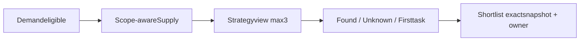

# Strategy experience · Yolk v1.9.0

หาไข่แดง → ดู Supply/การแข่งขัน → เลือกวิธีขยายตลาด → เล็งพร้อมแผนสำรวจ

Full product + from-scratch tasks: [ฉบับเต็ม](../CityMETER_Yolk_Full_Product_and_Implementation_v1.9.0.md). Machine rules: [opportunity-strategies](../contracts/opportunity-strategies.v1.9.0.json).

## การอ่านผล

เลือก1–3จาก8วิธีใหม่ พื้นที่เดียวมีได้หลายเหตุผล แต่ไม่ใช่oldCrowded/FOMO/Pioneer classifications. ทุกผลมีพบแล้ว/วิธีที่ชวนตรวจ/ยังไม่รู้/งานแรก. แยกจำนวนผ่านDemand, Strategycandidates และshortlistedเสมอ

| Strategy | P0 |
|---|---|
| 01 Underserved market | คิวตรวจจากtotalSupplyupperต่ำกว่าจุดเทียบ |
| 02 Segment gap | ต้องมีlocaloffering/hour/actualcustomeroccasions |
| 03 Competitive entry | คิวตรวจจากconfirmedcompetitorpresence ไม่ใช่winprobability |
| 04 Cluster participation | ต้องมีphysicalcluster/visits ไม่ใช้screenbinsแทน |
| 05 Complementary location | คิวจากbrand-relevantfactory/hotelareacontext; ยังไม่มีhospital/schoolproximity |
| 06 Route capture | ต้องมีdirectedroutes/access/stop-buy |
| 07 Network infill | คิวตรวจจากownSupplyupperต่ำกว่าจุดเทียบ; owncoverage/displacementยังต้องเพิ่ม |
| 08 Future entry | แยกfuturewatchlistเมื่อมีmilestones; ไม่เพิ่มcurrentYolk |

## แผนที่

คงแผนที่และตำแหน่งที่กำลังดูเมื่อเปลี่ยนเมนูหรือเกณฑ์ หากความกว้างจอเปลี่ยนมาก ระบบปรับมุมมองให้เห็นขอบเขตเดิมพอดีจอ โดยไม่ปิด popup ที่กำลังดู StrategyviewลงสีDemandtierเฉพาะcandidateareas; nonmatchโปร่งไม่ได้หมายถึงDemandต่ำ Selectedfineยังfill=false, whitehierarchicaloutlines, Yolk-yellowhover. quantitative41LUTและtierrecipeเดิมไม่เปลี่ยนตามtheme

Supplydefaultsregionchoropleth, optionalPOIsทุกdrilldown. Sourcecoordinategroupsลดmarkdensityไม่ใช่businessclusters ดู[SupplyPOImodes](SUPPLY_POI_MODES_v1.9.0.md).

## การบันทึก

PersonalStrategyselectionไม่สร้างteamrevision Targetsaveจึงcaptureexactcriteria/source/benchmark/profile/engineversions, privateDraftหรือacceptedstatus, selectedmethods, evidence/missing/actions, actor/time. Snapshotเก่าไม่เปลี่ยนเมื่อcriteria/sourceใหม่

CurrentP0เป็นคิวสำรวจจากproxyและreportedinventory ไม่ยืนยันoperation, measuredtraffic/purchases, segmentgap, parcelsหรือinvestmentapproval Staticpreviewbrowser-local; sharedproductionต้องผ่านserverRBAC/revisions/outbox/private-media testsแยก
