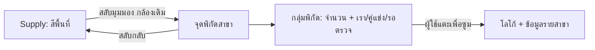

# Supply: สีพื้นที่และจุดสาขา — v1.9.0

เมื่อเปิด Supply ระบบเริ่มที่ **สีพื้นที่** เพื่อเทียบจำนวนหรือความหนาแน่นของสาขา ผู้ใช้สลับเป็น **จุดสาขา** ได้ตั้งแต่ระดับประเทศ จังหวัด อำเภอ ไปจนถึงแขวง/อปท. โดยแผนที่เดิมยังอยู่และไม่กระโดดไปตำแหน่งใหม่

| มุมมอง | เห็นอะไร | ใช้ตัดสินใจเรื่องใด |
|---|---|---|
| สีพื้นที่ / Region colours | ยอดต้นทางระดับอำเภอเมื่อดูประเทศ และยอดแขวง/อปท.เมื่อเจาะลงไป | เทียบ Supply เรา คู่แข่ง หรือผู้ให้บริการที่ระบุได้ ด้วย metric และหน่วยเดียวกัน |
| จุดสาขา / Branch points | พิกัดต้นทางและรายการที่ทีมบันทึก พร้อมโลโก้และสัญลักษณ์ความสัมพันธ์ | ดูว่าสาขาอยู่ตรงไหน อยู่ใกล้กันเพียงใด แล้วเปิดข้อมูลรายสาขาเพื่อเตรียมสำรวจ |

**จำนวนพิกัดที่แสดงไม่ใช่ยอดสาขาทั้งหมดของพื้นที่** บางรายการยังไม่มีพิกัด บางข้อมูลมีขอบเขตหรือผู้ให้บริการที่ยังไม่ชัด และข้อมูลเป็น snapshot. การแก้ POI ของทีมไม่เขียนทับยอดต้นทางของ choropleth.

## วิธีใช้

1. เลือกธุรกิจ แบรนด์ และขอบเขต Supply ตามปกติ
2. เปิด Supply แล้วเทียบ **สีพื้นที่** ด้วยจำนวนสาขา สาขาต่อพื้นที่ หรือสาขาเทียบขนาดตลาด
3. เลือก **จุดสาขา** เพื่อดูพิกัดในกรอบแผนที่ปัจจุบัน ใช้ตัวกรองเรา/คู่แข่ง/รอตรวจได้เช่นเดิม
4. เมื่อจุดอยู่ใกล้กัน ระบบรวมเป็นหมุดที่แสดงจำนวนพิกัด แตะหมุดเพื่อซูมเข้า จากนั้นเปิดรายสาขาที่มีโลโก้และข้อมูลแบรนด์
5. หากหลายพิกัดตรงกัน หรือซูมถึงระดับ 18 แล้ว หมุดกลุ่มเปิดรายการ 10 จุดแรก พร้อมแจ้งให้กรองเพิ่มเติม ไม่มีการเดาตำแหน่งเพื่อให้จุดแยกกัน
6. สลับกลับ **สีพื้นที่** เพื่อเทียบยอดต้นทาง การเปลี่ยนมุมมองไม่เปลี่ยนเกณฑ์ Demand, Tier, อันดับ, รายการที่เล็งไว้ หรือกล้องของแผนที่

เลือกประเทศ → เจาะจังหวัด → เจาะอำเภอ → เจาะทำเล ยังทำงานตามขอบเขตที่คลิกได้เดิม พื้นที่ภายในโปร่งใสเมื่อดูจุดสาขา เส้นขอบสีขาวและกรอบ hover สีเหลือง Yolk ยังใช้เหมือนเดิม



## ข้อมูลที่ใช้ได้ใน P0

- บัญชีพิกัด `fuel-points.json`, `grocery-points.json`, `nonbank-points.json` ที่เผยแพร่ใน runtime เดิม ใช้ cache ต่อ industry และ overlay ของทีม
- กรอง Supply scope และความสัมพันธ์ตาม `industry-workspace.js` ก่อนวาด ใช้เฉพาะ latitude/longitude ที่เป็นตัวเลขและอยู่ในช่วงพิกัดที่ถูกต้อง
- จำกัดการแสดงตามกรอบแผนที่และเส้นทางที่ผู้ใช้เลือก บันทึกพื้นที่จากต้นทางก่อน หากยังไม่ผูกพื้นที่ ใช้ polygon ต้นทางเพื่อจับคู่ **สำหรับมุมมองเท่านั้น** ไม่เขียน membership หรือรับรองขอบเขตตามกฎหมาย
- ช่วงที่กำลังโหลด โหลดไม่สำเร็จ หรือยังไม่โหลด ใช้ข้อความสถานะ ไม่มีการสรุปว่าจำนวนสาขาเป็นศูนย์

ยังไม่ใช่ spatial-cluster attractiveness model. กลุ่มหมุดเป็นกลไกลดความหนาแน่นของภาพบนหน้าจอ ไม่ใช่หลักฐานว่าเกิดย่านค้าขายร่วมกัน ลูกค้าเดินทางร่วมกัน หรือสาขานั้นเปิดบริการอยู่จริง

## สำหรับ dev / intern

ใช้ host Leaflet เดิม ห้ามสร้าง map ใหม่เมื่อเปลี่ยนเมนูหรือ mode. การเปิดและปิด mode เป็นการเปลี่ยนการแสดงผลเฉพาะ session ไม่ใช่การแก้เกณฑ์ร่วมของทีม จึงไม่เพิ่ม activity event ของเกณฑ์

1. เตรียม source coordinate adapter และคง immutable native counts ไว้คนละชุด
2. ใช้ `YolkWorkspaceMap.setSupplyView('regions'|'points')` เปลี่ยนมุมมอง ไม่เรียก fit หรือ setView
3. อ่าน `getSupplyView()` และ `getState().points` เพื่อตรวจ mode, จำนวนพิกัดที่นำเสนอ, จำนวน marks, clusters และสถานะการโหลด
4. กรองด้วย `visiblePoints()` และ `poiMatchesNavigation()` ก่อนสร้างแผนการวาด
5. `pointPlan()` จัดกลุ่มบนกริดพิกัดหน้าจอเริ่มต้น 56 px. ถ้าจำนวน marks เกิน 1,000 ให้เพิ่มขนาดกริดจนผ่านงบแสดงผล ทุก record ยังคงอยู่ในสมาชิกกลุ่ม ไม่มีการเลือกเพียง 1,000 จุดแรกใน mode นี้
6. แต่ละกลุ่มเก็บจำนวนเรา/คู่แข่ง/รอตรวจแยกกัน ไม่รวม U เป็นคู่แข่งและไม่เปลี่ยนยอดต้นทาง กลุ่มใช้พื้น UI กลาง สัญลักษณ์ใช้ role inks เดิมจาก DS
7. เมื่อ scope/brand/industry เปลี่ยน ให้ล้าง marker cache ของ context เดิมก่อนนำเสนอข้อมูลใหม่ `ensureSourcePoints()` มี industry request guard เดิมและ `focusPoi()` ตรวจ focus ticket ก่อนย้ายกล้อง
8. `moveend` และ `zoomend` อัปเดตกลุ่มในกรอบแผนที่ผ่าน animation frame เดียว ไม่รื้อแผนที่หรือ recalibrate cohort ของ choropleth
9. ตรวจ regression ด้วย `node scripts/check-workspace-map.cjs` และ `node scripts/check-supply-poi-modes.cjs` แล้วตรวจหน้าจอจริง TH/EN, light/dark, mobile/desktop เพิ่มเติม

## Strategy map hook

`#strategy` รับ projection จาก `YolkStrategyUI.mapRows(evaluatedRows)`. Projection ต้อง clone rows และกำหนด `eligible` สำหรับ **strategy candidates** เท่านั้น ค่า Demand และ `qualifyingTier` เดิมไม่เปลี่ยน

แผนที่ใช้สีไข่แดงของ Demand บนพื้นที่ที่ควรสำรวจตาม Strategy; พื้นที่อื่นภายในโปร่งใส จำนวน **ทำเลควรสำรวจ** และจำนวน **Demand ที่ผ่าน** แยกกัน ชื่อ Strategy จาก `mapSummary()` ใส่ผ่าน `textContent`. ชั้นนี้ไม่รับรองว่ากลยุทธ์จะสร้างยอดขายจริง

```json
{
  "contractId": "supply-poi-modes-v1.9.0",
  "defaultView": "regions",
  "viewModes": ["regions", "points"],
  "route": "supply",
  "pointGrains": ["country", "province", "district", "location"],
  "mapInstance": "persistent_existing_leaflet_host",
  "automaticCameraChangeOnMode": false,
  "pointMembership": "view_only_no_aggregate_mutation",
  "pointCoverage": "available_source_coordinates_and_local_overlays",
  "loadingStates": ["not_loaded", "loading", "ready", "error"],
  "cluster": {
    "meaning": "screen_coordinate_group_not_market_attraction",
    "initialGridCellPixels": 56,
    "maxRenderedMarks": 1000,
    "recordTruncation": false,
    "roleCounts": ["own", "competitor", "unverified"],
    "coincidentPopupLimit": 10,
    "limitDisclosure": true,
    "cameraChange": "explicit_user_cluster_click_only"
  },
  "invariants": [
    "demand_membership_unchanged",
    "tier_unchanged",
    "source_supply_totals_immutable",
    "unknown_not_zero",
    "brand_scope_race_guard",
    "same_map_instance_and_camera_on_toggle",
    "no_analytical_color_transformation"
  ],
  "strategyMap": {
    "hook": "YolkStrategyUI.mapRows",
    "rows": "cloned_projection",
    "fill": "candidate_demand_tier_only",
    "unmatchedInterior": "transparent",
    "counts": ["strategy_candidates", "eligible_demand"],
    "summary": "textContent_not_html"
  },
  "checks": ["check-workspace-map.cjs", "check-supply-poi-modes.cjs"],
  "browserReviewRequired": true
}
```
